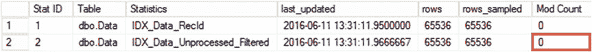
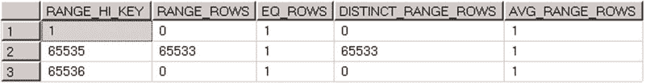
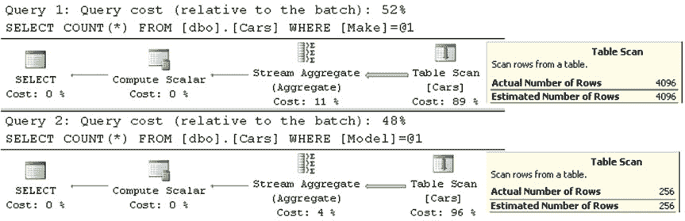
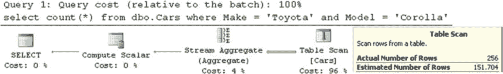
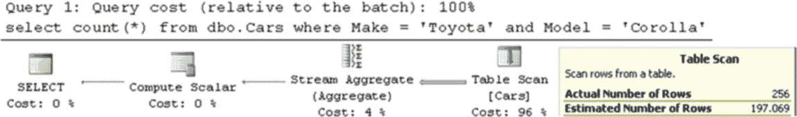
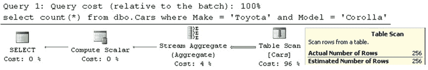

# 第四章 ■ 特殊索引与存储特性

**注意** 我们将在[第 26 章](http://dx.doi.org/10.1007/978-1-4842-1964-5_26) “计划缓存”中更深入地讨论计划缓存。



处理筛选索引时，另一个需要记住的重要方面是 SQL Server 如何更新其上的统计信息。遗憾的是，SQL Server 并不会将筛选条件中列的修改计入统计信息更新阈值。举个例子，让我们向 `dbo.Data` 表填充一些数据，然后更新统计信息。完成此操作的代码如清单 4-12 所示。

***清单 4-12.*** 筛选索引：插入数据并更新统计信息

```sql
;with N1(C) as (select 0 union all select 0) -- 2 rows
,N2(C) as (select 0 from N1 as T1 CROSS JOIN N1 as T2) -- 4 rows
,N3(C) as (select 0 from N2 as T1 CROSS JOIN N2 as T2) -- 16 rows
,N4(C) as (select 0 from N3 as T1 CROSS JOIN N3 as T2) -- 256 rows
,N5(C) as (select 0 from N4 as T1 CROSS JOIN N4 as T2) -- 65,536 rows
,IDs(ID) as (select row_number() over (order by (select NULL)) from N5)
insert into dbo.Data(RecId, Processed)
select ID, 0 from Ids;

update statistics dbo.Data;
```

此时，`dbo.Data` 表有 65,536 行。让我们更新表中的所有数据，将 `Processed` 设置为 `1`。之后，我们将查看统计信息的列修改计数。完成此操作的代码如清单 4-13 所示。

***清单 4-13.*** 筛选索引：更新数据

```sql
update dbo.Data set Processed = 1;

select
    s.stats_id as [Stat ID],
    sc.name + '.' + t.name as [Table],
    s.name as [Statistics],
    p.last_updated,
    p.rows,
    p.rows_sampled,
    p.modification_counter as [Mod Count]
from
    sys.stats s
    join sys.tables t on s.object_id = t.object_id
    join sys.schemas sc on t.schema_id = sc.schema_id
    outer apply sys.dm_db_stats_properties(t.object_id, s.stats_id) p
where
    sc.name = 'dbo'
    and t.name = 'Data'
```

如图 4-7 所示，筛选索引列的修改计数显示为零。此外，索引中的行数仍然是 65,536，尽管表中的所有行现在都已被处理。

***图 4-7.** 筛选索引：统计信息*



如果你查看图 4-8 中显示的直方图，会发现它包含的仍是旧的数据分布信息。

***图 4-8.** 筛选索引：统计信息直方图*

这种行为可能导致错误的基数估计和次优的执行计划。当筛选列易变且未包含在索引键中时，你应该定期更新筛选索引上的统计信息。从好的方面看，筛选索引通常很小，其索引维护带来的开销比常规索引要小。

筛选索引另一个非常有用的领域是在值的子集上支持唯一性。举一个实际例子，考虑一个包含 SSN（社会安全号码）作为可选可空列的表。这种场景通常要求你维护所提供 SSN 值的唯一性。然而，你不能为此目的使用唯一的非聚集索引。SQL Server 将 NULL 视为常规值，不允许你存储多个 SSN 未指定的行。幸运的是，唯一的筛选索引可以解决这个问题。清单 4-14 展示了这样一种方法。

***清单 4-14.*** 在值的子集上支持唯一性

```sql
create table dbo.Customers
(
    CustomerId int not null,
    SSN varchar(11) null,
    /* Other Columns */
);

create unique index IDX_Customers_SSN on dbo.Customers(SSN)
where SSN is not null;
```

#### 筛选统计信息

传统基数估算器 (70) 的假设之一是查询谓词相互独立。


为了说明这个概念，让我们看一下清单 4-15 中所示的代码。此表存储有关文章的信息，它有一些属性，例如 `Color` 和 `Size`。

**清单 4-15.** 具有多个谓词的基数估计

```sql
create table dbo.Articles
(
    ArticleId int not null,
    Name nvarchar(64) not null,
    Description nvarchar(max) null,
    Color nvarchar(32) null,
    Size smallint null
);

select ArticleId, Name from dbo.Articles where Color = 'Red' and Size = 3
```

当你基于两个属性筛选数据时，查询优化器正确地假设只有行的子集是红色的。此外，只有一部分红色文章的尺寸会等于三。因此，它预期应用两个谓词后的总行数将低于应用任何一个单独谓词的情况。

虽然这种方法在某些情况下效果良好，但在谓词高度相关的情况下，它会引入不正确的基数估计。让我们看另一个例子，创建一个存储汽车信息的表，包括其制造商和型号。清单 4-16 创建了这个表并填充了一些数据。最后一步，它在两列上创建了列级统计信息。

**清单 4-16.** 相关谓词：表创建

```sql
create table dbo.Cars
(
    ID int not null identity(1,1),
    Make varchar(32) not null,
    Model varchar(32) not null
);

;with N1(C) as (select 0 union all select 0) -- 2 rows
,N2(C) as (select 0 from N1 as T1 cross join N1 as T2) -- 4 rows
,N3(C) as (select 0 from N2 as T1 cross join N2 as T2) -- 16 rows
,N4(C) as (select 0 from N3 as T1 cross join N3 as T2) -- 256 rows
,IDs(ID) as (select row_number() over (order by (select null)) from N4)
,Models(Model)
as
(
    select Models.Model
    from
    ( values('Yaris'),('Corolla'),('Matrix'),('Camry'),('Avalon'),('Sienna')
    ,('Tacoma'),('Tundra'),('RAV4'),('Venza'),('Highlander'),('FJ Cruiser'),('4Runner')
    ,('Sequoia'),('Land Cruiser'),('Prius') ) Models(Model)
)
insert into dbo.Cars(Make,Model)
select 'Toyota', Model from Models cross join IDs;

;with N1(C) as (select 0 union all select 0) -- 2 rows
,N2(C) as (select 0 from N1 as T1 cross join N1 as T2) -- 4 rows
,N3(C) as (select 0 from N2 as T1 cross join N2 as T2) -- 16 rows
,N4(C) as (select 0 from N3 as T1 cross join N3 as T2) -- 256 rows
,IDs(ID) as (select row_number() over (order by (select null)) from N4)
,Models(Model)
as
(
    select Models.Model
    from ( values('Accord'),('Civic'),('CR-V'),('Crosstour'),('CR-Z'),('FCX Clarity')
    ,('Fit'),('Insight'),('Odyssey'),('Pilot'),('Ridgeline') ) Models(Model)
)
insert into dbo.Cars(Make,Model)
select 'Honda', Model from Models cross join IDs;

create statistics stat_Cars_Make on dbo.Cars(Make);
create statistics stat_Cars_Model on dbo.Cars(Model);
```





当你运行带有单个谓词的查询时，SQL Server 能正确估计基数，如清单 4-17 和图 4-9 所示。

**清单 4-17.** 相关谓词：使用单个谓词的基数估计

```sql
select count(*) from dbo.Cars where Make = 'Toyota';
select count(*) from dbo.Cars where Model = 'Corolla';
```

**图 4-9.** 使用单个谓词的基数估计

但是，当指定两个谓词时，基数估计会不正确。图 4-10 展示了当使用旧版基数估计器时，查询 `SELECT COUNT(*) FROM dbo.Cars WHERE Make='Toyota' and Model='Corolla'` 的基数估计。

**图 4-10.** 使用相关谓词的基数估计（旧版基数估计器）

旧版基数估计器（版本 70）假设谓词是独立的，并使用以下公式：

（第一个谓词的选择性 * 第二个谓词的选择性） * （总行数


（在表内）= （第一个谓词的估计行数 * 第二个谓词的估计行数）/ （表中的总行数）= (4096 * 256) / 6912 = 151.704

SQL Server 2014 引入的新的基数估算器采用了不同的方法，并假设谓词之间存在一定的相关性。它使用以下公式：

（最具选择性的谓词的选择率）* `SQRT`（次具选择性的谓词的选择率）= (256 / 6912) * `SQRT`(4096 / 6912) * 6912 = 256 * `SQRT`(4096 / 6912) = 197.069

尽管该公式在此情况下能提供更好的结果，但它仍然不正确，如 图 4-11 所示。





## 第 4 章 ■ 特殊索引和存储功能

图 4-11. 使用相关谓词进行基数估算（新的基数估算器）

解决此问题的一种方法是使用过滤的列级统计信息。在谓词相关的情况下，这可以改善基数估算。清单 4-18 为所有丰田制造的汽车在 `Model` 列上创建了过滤统计信息。

清单 4-18. 相关谓词：创建过滤统计信息

```sql
create statistics stat_Cars_Toyota_Models
on dbo.Cars(Model)
where Make='Toyota'
```

现在，如果你再次运行 `SELECT` 语句，你将获得正确的基数估算，如 图 4-12 所示。

图 4-12. 使用过滤统计信息进行基数估算

过滤统计信息的局限性与过滤索引类似。在缓存计划的情况下，如果过滤统计信息可能不适用于所有可能的参数选择，SQL Server 将不会使用此功能进行基数估算。发生这种情况的一种情况是 `自动参数化`，即 SQL Server 用查询的 `WHERE` 子句中的参数替换常量值；也就是说，如果 SQL Server 对前述查询中 `Model` 列上的谓词进行了自动参数化，它将不会使用统计信息。语句级重新编译可以帮助你避免这种情况。此外，SQL Server 不会将对筛选列的修改计入统计信息修改阈值，因此在某些情况下需要你手动更新统计信息。

#### 计算列

SQL Server 允许你使用表达式或系统和标量用户定义函数在表中定义计算列。清单 4-19 展示了一个包含两个计算列的表示例。

## 第 4 章 ■ 特殊索引和存储功能

清单 4-19. 包含两个计算列的表

```sql
create table dbo.Customers
(
    CustomerId int not null,
    SSN char(11) not null,
    Phone varchar(32) null,
    SSNLastFour as (right(SSN,4)),
    PhoneAreaCode as (dbo.ExtractAreaCode(Phone)),
    /* 其他列 */
);
```

当查询引用计算列时，SQL Server 会计算该列的值。在计算复杂的情况下，这可能会带来一些性能影响，尤其是当计算列被引用在查询的 `WHERE` 子句中时。你可以通过将计算列设置为 `PERSISTED` 来避免这种情况。在这种情况下，SQL Server 会持久化计算值，将它们像常规列一样存储在数据行中。虽然这种方法通过消除即时计算提高了读取数据的查询性能，但它降低了数据修改的性能，并增加了行的大小。

用户定义函数 (`UDF`) 允许实现非常复杂的计算。然而，它们可能会显著降低查询的性能。让我们看一个例子，并创建一个包含 65,536 行的表，如 清单 4-20 所示。我们将使用此表作为数据源。

清单 4-20. 计算列和 UDF：创建包含数据的表

```sql
create table dbo.InputData ( ID int not null );

;with N1(C) as (select 0 union all select 0) -- 2 行
```


```
,N2(C) as (select 0 from N1 as T1 cross join N1 as T2) -- 4 行
,N3(C) as (select 0 from N2 as T1 cross join N2 as T2) -- 16 行
,N4(C) as (select 0 from N3 as T1 cross join N3 as T2) -- 256 行
,N5(C) as (select 0 from N4 as T1 cross join N4 as T2 ) -- 65,536 行
,Nums(Num) as (select row_number() over (order by (select null)) from N5)
insert into dbo.InputData(ID)
select Num from Nums;
```

接下来，让我们创建另外两个带有计算列的表。其中一个表会持久化计算列数据，而另一个表则不会。完成此操作的代码如清单 4-21 所示。

### 清单 4-21. 计算列与用户定义函数：创建测试表

```
create function dbo.SameWithID(@ID int)
returns int
with schemabinding
as
begin
return @ID;
end
go

create table dbo.NonPersistedColumn
(
ID int not null,
NonPersistedColumn as (dbo.SameWithID(ID))
);

create table dbo.PersistedColumn
(
ID int not null,
PersistedColumn as (dbo.SameWithID(ID)) persisted
);
```

