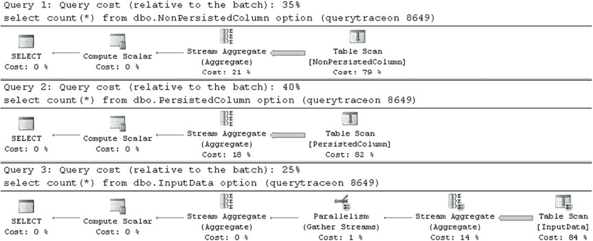

# 第 4 章 ■ 特殊索引与存储特性

在第一个测试中，我们来测量持久化计算列在批量插入操作期间对性能的影响。相关代码如清单 4-22 所示。

### 清单 4-22. 计算列与用户定义函数：比较批量插入操作的性能

```
insert into dbo.NonPersistedColumn(ID)
select ID from dbo.InputData;

insert into dbo.PersistedColumn(ID)
select ID from dbo.InputData;
```

在我的计算机上的执行时间如表 4-2 所示。

### 表 4-2. 批量插入性能

| `dbo.NonPersistedColumn` | `dbo.PersistedColumn` |
|--------------------------|-----------------------|
| 100 ms                   | 449ms                 |

作为下一步，让我们使用清单 4-23 所示的代码，来比较在 SELECT 操作中引用持久化和非持久化计算列的查询性能。

### 清单 4-23. 计算列与用户定义函数：比较 SELECT 操作的性能

```
select count(*)
from dbo.NonPersistedColumn
where NonPersistedColumn = 42;

select count(*)
from dbo.PersistedColumn
where PersistedColumn = 42;
```

对于非持久化计算列的情况，SQL Server 会调用用户定义函数来评估每一行的谓词，这显著增加了执行时间，如表 4-3 所示。

### 表 4-3. 热缓存下的查询性能

| `dbo.PersistedColumn` | `dbo.NonPersistedColumn` |
|-----------------------|--------------------------|
| 7 ms                  | 218ms                    |



