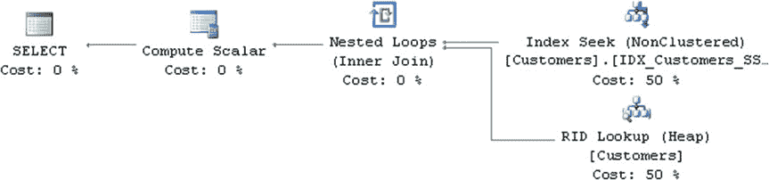
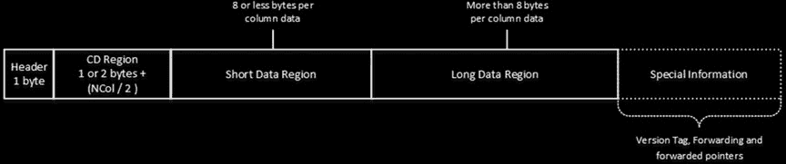
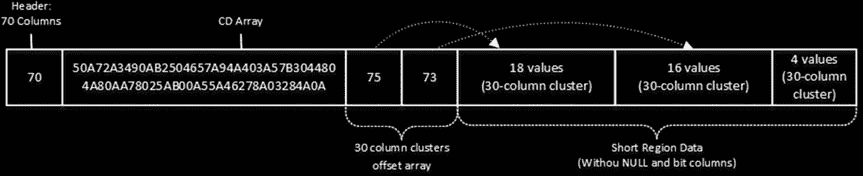

# 第 4 章 ■ 特殊索引与存储特性

## **图 4-13.** 计算列与并行执行计划

即使计算列未被持久化，您仍可在其上创建索引。当计算列的主要用途是支持索引查找操作时，这是一个很好的选择。一个典型例子是按社会保障号的后四位进行搜索。您可以在 `dbo.Customers` 表的 `SSNLastFour` 计算列上（如代码清单 4-19 所示）创建非聚集索引，而无需将该计算列持久化。这种方法节省了数据存储空间。



代码清单 4-25 所示的代码在一个非持久化的计算列上创建索引，并在查询中引用了该列。

## **代码清单 4-25.** 为非持久化计算列创建索引

```
create unique nonclustered index IDX_Customers_SSNLastFour
on dbo.Customers(SSNLastFour);

select CustomerId, SSN
from dbo.Customers
where SSNLastFour = '1234';
```

图 4-14 展示了该 `SELECT` 语句的执行计划。如您所见，SQL Server 能够使用该非聚集索引。

## **图 4-14.** 利用非持久化计算列上的非聚集索引的执行计划

决定在何处计算数据至关重要。尽管计算列对开发人员很方便，但它们会在计算时增加 SQL Server 的负载。当应用程序使用 ORM 框架并将计算列作为实体属性加载时，这一决策更为重要。这种场景增加了计算列被引用和计算的几率，即使某些用例并不需要它们。

您还需要记住，典型系统包含多个应用服务器，而服务于所有数据的活动数据库服务器通常只有一个。横向扩展应用服务器通常比升级数据库服务器更简单、成本更低。

在应用服务器或客户端级别计算数据可以减轻 SQL Server 的负载。但是，如果系统没有专用的数据访问层和/或业务逻辑层，当计算需要在代码的多个地方执行时，可能会导致可维护性问题。通常，这类决策属于“视情况而定”的范畴，您需要评估每种方法的利弊。

#### 数据压缩

SQL Server 2008 及以上版本的企业版允许通过实施数据压缩来减小表的大小。有两种可用的数据压缩类型：`行压缩` 和 `页压缩`。`行压缩` 通过使用不同的行格式来减小行的大小，消除了固定长度数据中未使用的存储空间。`页压缩` 在数据页范围内工作，它会移除页面中重复的字节序列。



缓冲池中的数据页以与磁盘上存储数据相同的格式存储数据。压缩功能对 SQL Server 的其他特性是透明实现的；也就是说，访问数据的 SQL Server 组件并不知道是否使用了压缩。

尽管数据压缩允许您将更多行放入数据页中，但它并不会增加一行可以存储的数据量。无论压缩设置如何，8,060 字节的最大行大小限制仍然适用。SQL Server 保证禁用数据压缩始终会成功，因此，未压缩的行必须始终能容纳在一个数据页中。

让我们来研究一下两种压缩类型的实现方式。

##### 行压缩

您应该还记得，常规的行格式称为 `FixedVar`，它将固定长度和可变长度数据存储在行的不同部分。这种方法的好处是能快速访问列数据。固定长度


列总是具有相同的行内偏移量。基于偏移量数组信息，也可以轻松获取变长列数据的偏移量。

然而，这种快速访问是有代价的。定长列总是根据数据类型可能的最大值使用相同的存储空间。例如，`int` 数据类型总是使用四个字节，即使它存储的是 `0` 或 `NULL` 值。

不幸的是，未使用的空间会迅速累积。在一个每天收集一百万行数据的表中，一个未使用的字节每年会导致近 350 MB 的未使用空间。该表在磁盘和缓冲池中占用更多空间，这增加了所需的 I/O 操作次数，并对系统性能产生负面影响。

## 行压缩通过实现另一种行格式来解决这个问题，这种格式称为 `CD`，代表 `列描述符`。使用此格式时，每一行都使用值所需的确切存储空间来存储该行的列和数据描述信息。图 4-15 展示了 `CD` 行格式。

**图 4-15.** `CD` 行格式

与 `FixedVar` 行格式类似，`CD` 格式中的数据也被分成两个不同的部分：`短数据区域` 和 `长数据区域`。然而，这种分离是基于数据大小，而不是基于数据类型。`短数据区域` 存储大小不超过 8 字节的数据。更大的值则存储在 `长数据区域` 中。让我们深入了解一下这种行格式。

### `Header` 字节是一个位掩码，类似于 `FixedVar` 行格式中的 `Status Bits A` 字节。它由表示行属性的各个位组成，例如是否是索引行、是否具有版本标签、行是否被删除以及其他一些属性。



第 4 章 ■ 特殊索引和存储特性

`CD 区域` 存储行中列数据的信息。它以一或两个字节开始，指示 `CD 数组` 中的列数。第一个字节的第一位指示列数是否超过 127，如果超过，则需要两个字节来存储列数。随后是 `CD 数组` 本身。数组中的每个元素存储其中一个列的信息，它使用四位来存储以下值之一：

```
0 (0x0) 表示对应的列为 NULL
1 (0x1) 表示对应的列存储该数据类型的空值。例如，int 列的空值将是 0。空列在短数据区域或长数据区域中都不占用空间。
2 (0x2) 表示对应的列是 1 字节短值。
3 (0x3) 表示对应的列是 2 字节短值。
4 (0x4) 表示对应的列是 3 字节短值。
5 (0x5) 表示对应的列是 4 字节短值。
6 (0x6) 表示对应的列是 5 字节短值。
7 (0x7) 表示对应的列是 6 字节短值。
8 (0x8) 表示对应的列是 7 字节短值。
9 (0x9) 表示对应的列是 8 字节短值。
10 (0xA) 表示对应的列的值超过 8 字节，存储在长数据区域中。
11 (0xB) 表示对应的列是值为 1 的位列。这样的列在短数据区域中不占用空间。
```

`短数据区域` 中列数据的偏移量可以基于 `CD 区域` 信息计算得出。然而，当列数很多时，这种计算可能代价高昂。SQL Server 通过在 `短列数据区域` 开头存储一系列包含 30 列的簇来优化这一点。例如，如果 `短数据区域` 有 70 列，SQL Server 会存储一个包含两个单字节元素的数组。第一个元素/字节存储前 30 列簇的大小。第二个元素/字节存储……


