# 第四章 ■ 特殊索引与存储功能

## 图 4-16. CD 与短数据区域数据示例

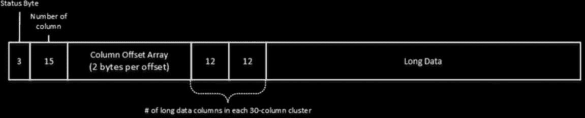

（属于）第二个 30 列簇。如果行的列数少于 30，则不会存储数组。

图 4-16 展示了这样一个例子。`CD`数组中的值`10`（`0xA`）表示该列存储的是长数据，因此实际的短数据区域列簇可以包含少于 30 个值——本例中为`18`、`16`和`4`。

## 图 4-17. 长数据区域数据示例

长数据区域以一个偏移数组开始，这与`FixedVar`行格式中的变长偏移数组类似。

第一个字节是一个位掩码，其中有两个有意义的位。第一位始终为`1`，用于告知 SQL Server 该偏移数组使用两字节的值。第二位指示该行是否有任何将数据存储在行外的复杂列。

接下来的两个字节存储后续数组中的列数。

偏移数组中每个元素的第一个字节的最高位指示它是否是一个复杂列。其他位存储该列的结束偏移量。

与短数据区域类似，SQL Server 通过在每 30 列簇中存储一个包含长数据列数量的数组，来优化对尾部列的访问。图 4-17 展示了与图 4-16 所示行相同的长数据区域。

让我们检查实际的行数据并创建一个表，如清单 4-26 所示。

## 清单 4-26. 行压缩：创建表

```sql
create table dbo.RowCompressionData
(
    Int1 int,
    Int2 int,
    Int3 int,
    VarChar1 varchar(1000),
    VarChar2 varchar(1000),
    Bit1 bit,
    Bit2 bit,
    Char1 char(1000),
    Char2 char(1000),
    Char3 char(1000)
)
with (data_compression=row);

insert into dbo.RowCompressionData
values
    (0 /*Int1*/, 2147483647 /*Int2*/, null /*Int3*/, 'aaa'/*VarChar1*/
    ,replicate('b',1000) /*VarChar2*/, 0 /*BitCol1*/, 1 /*BitCol2*/, null /*Char1*/
    ,replicate('c',1000) /*Char2*/, 'dddddddddd' /*Char3*/);
```

清单 4-27 显示了部分`DBCC PAGE`命令结果。你可以使用第一章中描述的相同技术来获取行的页码。

## 清单 4-27. 行压缩：DBCC PAGE 结果

```
Slot 0 Offset 0x60 Length 2033

Record Type = (COMPRESSED) PRIMARY_RECORD
Record attributes = LONG_DATA_REGION
Record size = 2033

CD Array
CD array entry=Column 1 (cluster 0, CD array offset 0): 0x01 (EMPTY)
CD array entry=Column 2 (cluster 0, CD array offset 0): 0x05 (FOUR_BYTE_SHORT)
CD array entry=Column 3 (cluster 0, CD array offset 1): 0x00 (NULL)
CD array entry=Column 4 (cluster 0, CD array offset 1): 0x04 (THREE_BYTE_SHORT)
CD array entry=Column 5 (cluster 0, CD array offset 2): 0x0a (LONG)
CD array entry=Column 6 (cluster 0, CD array offset 2): 0x01 (EMPTY)
CD array entry=Column 7 (cluster 0, CD array offset 3): 0x0b (BIT_COLUMN)
CD array entry=Column 8 (cluster 0, CD array offset 3): 0x00 (NULL)
CD array entry=Column 9 (cluster 0, CD array offset 4): 0x0a (LONG)
CD array entry=Column 10 (cluster 0, CD array offset 4): 0x0a (LONG)

Record Memory Dump
0EA4A060: 210a5140 1a0baaff ffffff61 61610103 00e803d0 !.Q@..ªÿÿÿÿaaa…è.Ð
0EA4A074: 07da0762 62626262 62626262 62626262 62626262 .Ú.bbbbbbbbbbbbbbbbb
<SKIPPED>
0EA4A448: 62626262 62626262 62626262 62626262 62626262 bbbbbbbbbbbbbbbbbbbb
0EA4A45C: 62626263 63636363 63636363 63636363 63636363 bbbccccccccccccccccc
0EA4A470: 63636363 63636363 63636363 63636363 63636363 cccccccccccccccccccc
<SKIPPED>
0EA4A830: 63636363 63636363 63636363 63636363 63636363 cccccccccccccccccccc
0EA4A844: 63636364 64646464 64646464 64 cccdddddddddd

Slot 0 Column 1 Offset 0x0 Length 4 Length (physical) 0
Int1 = 0

Slot 0 Column 2 Offset 0x7 Length 4 Length (physical) 4
Int2 = 2147483647

Slot 0 Column 3 Offset 0x0 Length 0 Length (physical) 0
Int3 = [NULL]


# 第四章 ■ 特殊索引与存储特性

##### 页面压缩

*页面压缩*的工作方式与行压缩不同。它应用于整个页面，但仅在页面已满且压缩能显著节省页面空间时才启用。此外，SQL Server 不会在非叶索引级别使用页面压缩——当使用页面压缩时，这些级别会使用行压缩。

页面压缩由三个不同的阶段组成。首先，SQL Server 对行执行行压缩。接下来，它通过定位并重用最常见的前缀来在列级执行*前缀压缩*，从而减小该列中值的数据大小。最后，SQL Server 通过移除所有列中的所有重复数据来执行*字典压缩*。让我们深入研究前缀压缩和字典压缩。

第一步，SQL Server 检测列数据中最常见的前缀，并找到使用该前缀的最长值。该值称为*锚点值*。页面上的所有其他行存储它们的值与锚点值之间的差异，而不是实际值。

让我们看一个例子，假设我们有一个四列的表，数据如表 4-4 所示。

**表 4-4. 页面压缩：原始数据**

| 列 1 | 列 2 | 列 3 | 列 4 |
| :--- | :--- | :--- | :--- |
| PALETTE | CAN | NULL | PONY |
| PAL | BALL | MILL | HORSE |
| POX | BILL | MALL | TIGER |
| PILL | BOX | MAN | BUNNY |

对于第一列，最常见的前缀是 *P*；因此 *PALETTE* 是锚点值。SQL Server 将锚点值存储为空的非空字符串（在随后的表中用 <> 表示锚点值）。所有其他值都基于前缀进行存储。例如，值 *PILL* 存储为 <1><ILL>，表示它应使用锚点值的一个字母作为前缀，后跟 *ILL*。值 *PAL* 存储为 <3><>，表示它仅使用锚点值的三个字母。如果未找到可用的前缀，SQL Server 不存储锚点值，所有数据按原样存储。

表 4-5 说明了应用前缀压缩后的页面数据。

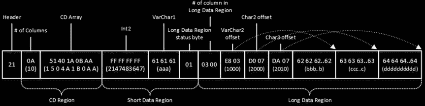

图 4-18 说明了行中的数据。请记住，多字节值以字节交换顺序存储，类似于 FixedVar 格式。此外，CD 数组中的四位部分也在每个字节内交换。

**图 4-18. 行压缩：行数据**

然而，有一个非常重要的注意事项。在某些情况下，压缩可能会增加行的大小。考虑一种情况，你有一个包含多个固定长度列的表，这些列根据数据类型使用了所有存储空间。考虑存储非零值的 `tinyint` 列、存储两字节值的 `smallint` 列，或始终使用八字节的 `datetime` 列。这些列不会从行压缩中受益，实际上，行压缩会在 CD 数组中为每列使用额外的四位，而 FixedVar 格式则没有这额外开销。幸运的是，这些情况相对较少，行压缩通常能显著节省空间。

最后，值得重申的是，默认类型值（例如，`int` 和 `bit` 数据类型的零）除了 CD 区域中的四位外，不使用其他存储空间。

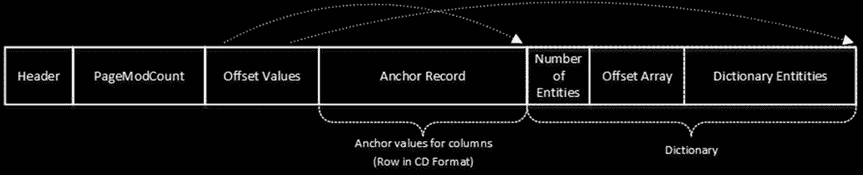


# 第四章 ■ 特殊索引与存储功能

*表 4-5.* `页面压缩：前缀压缩后的数据`

| *列 1* | *列 2* | *列 3* | *列 4* |
| :--- | :--- | :--- | :--- |
| 锚点值 | PALETTE | BALL | MALL |
| NULL | <><> | <><CAN> | NULL |
| PONY | <3><> | <><> | <1><ILL> |
| HORSE | <1><OX> | <1><ILL> | <><> |
| TIGER | <1><ILL> | <1><OX> | <2><N> |
| BUNNY | | | |

在字典压缩过程中，SQL Server 会检测页面上所有数据中的相同模式，并用字典条目替换它们，如 `表 4-6` 所示。此过程与数据类型无关，适用于字节序列。该行仍在使用 CD 数据格式。CD 数组存储值 13 (0xC) 以表示该行值已被字典条目替换。

*表 4-6.* `页面压缩：字典压缩后的数据`

| *列 1* | *列 2* | *列 3* | *列 4* |
| :--- | :--- | :--- | :--- |
| 字典实体: [D1]: <1><OX>; [D2]:<1><ILL> | <><> | <><CAN> | NULL |
| PONY | <3><> | <><> | [D2] |
| HORSE | [D1] | [D2] | <><> |
| TIGER | [D2] | [D1] | <2><N> |
| BUNNY | | | |

锚点值和字典值都是可选的。如果数据模式重复不够频繁，SQL Server 不会创建其中任意一个或两者都不创建。

当页面被压缩时，SQL Server 会在页面头之后添加另一个隐藏行，称为 `压缩信息（CI）记录`。`图 4-19` 展示了其格式。

*图 4-19.* `压缩信息记录格式`

*   `Header` 是一个位掩码，指示 CI 记录的版本以及是否存在锚点记录和/或字典条目。
*   `PageModCount` 指示页面被压缩后发生的更改次数。SQL Server 会在 25 次修改后，或者当修改次数超过页面上行数的 25% 时，尝试重新压缩页面并重建 CI 记录。
*   `Offsets` 是一个数组，存储 CI 记录中锚点记录和/或字典条目的起始偏移量和结束偏移量。
*   `Anchor Record` 是另一个 CD 格式的行，每一列代表特定表列的锚点值。
*   `Dictionary` 存储字典条目的数组，由三部分组成：条目数量、它们的偏移量以及实际值。

如前所述，SQL Server 仅当页面已满且压缩能带来显著的空间节省时，才会以页面压缩格式存储数据。当页面已满时，SQL Server 执行压缩并评估新压缩的页面是否能比压缩前多存储五行或多存储 25% 的行。如果是这种情况，则保留页面压缩，SQL Server 以页面压缩格式存储数据。否则，页面压缩将被丢弃，数据以行压缩格式存储。

当 CI 记录中的 `PageModCount` 超过阈值时，也会发生相同的过程。SQL Server 尝试重新压缩页面，评估空间节省情况，并决定保留或丢弃结果。

**注意** 您可以在 `sys.dm_db_index_operational_stats` DMF 中的 `page_compression_attempt_count` 和 `page_compression_success_count` 列中查看页面压缩统计信息。

最后，无论是数据修改的事务日志记录，还是 tempdb 中的版本存储，都不支持页面压缩。每当需要将一行放入版本存储或写入事务日志时，SQL Server 都需要解压缩页面并移除锚点和字典记录。当使用乐观隔离级别或 AFTER 触发器，或者压缩数据被频繁修改时，这可能会引入额外的性能影响。

**注意** 我们将在第 9 章“触发器”和第 21 章“乐观隔离级别”中更详细地讨论版本存储。事务日志内部原理将在第 30 章“事务日志内部原理”中介绍。

# 性能考虑

数据压缩可以显著减少数据所需的存储空间，但代价是额外的 CPU 开销。


load。无论使用何种压缩类型，SQL Server 都需要更多时间来访问行数据。这并不一定意味着查询执行时间会增加，因为在许多情况下，由于需要扫描的数据页更少且执行的 I/O 读取更少，查询运行得甚至更快。然而，批量数据修改和索引维护例程的性能可能会受到负面影响。

让我们做一些测试，看看数据压缩如何影响存储大小和查询执行时间。我使用了来自某个生产表的数据，该表包含大量定长和变长列。显然，不同的表结构和数据分布会导致略有不同的结果。然而，在大多数情况下，您会看到相似的模式。

## 第 4 章 ■ 特殊索引与存储特性

为了开始测试，我创建了三个不同的堆表，并向每个表插入了一百万行数据。之后，我创建了具有不同压缩设置和 `FILLFACTOR=100` 的聚集索引。此工作流程导致数据页完全填充且索引碎片为零。

在第一次测试中，我运行 `SELECT` 语句来扫描所有聚集索引，访问部分行数据。第二次测试更新了表中的每一行，以不增加行大小的方式更改了定长列的值。第三次测试向表中插入了另一批一百万行数据。最后，我重建了所有聚集索引。

您可以在表 4-7 中看到执行统计信息。所有测试均在缓存预热的情况下运行，数据页已缓存在缓冲池中。冷缓存可能会减少针对压缩数据和非压缩数据的查询之间的执行时间差异，因为针对压缩数据的查询执行的物理 I/O 更少。

**表 4-7.** 数据压缩、存储空间与性能

**大小（MB）** | **平均行大小（字节）** | **SELECT 耗时（毫秒）** | **UPDATE 耗时（毫秒）** | **INSERT 耗时（毫秒）** | **索引重建耗时（毫秒）**
--- | --- | --- | --- | --- | ---
无压缩 | 3,745 | 12,596 | 21,537 | |
行压缩 | 12,618 | 17,808 | 33,074 | |
页压缩 | 36,690 | 39,121 | 76,694 | |

所有语句都通过使用 `MAXDOP 1` 查询提示强制在单个 CPU 上运行。使用并行性会减少查询执行时间；但是，它也会在查询执行期间增加并行性管理的开销。我们将在本书后面讨论这种开销。

如您所见，即使没有涉及物理 I/O，数据压缩也提高了读取和扫描数据的查询的性能。这使我们得出结论：读取压缩数据给系统带来的开销非常小。然而，压缩降低了数据修改的性能；因此，压缩数据代价高昂，尤其是在使用页压缩时。

然而，CPU 开销并不是唯一需要考虑的因素。压缩减少了行的大小以及存储它们所需的数据页数量。压缩索引在缓冲池中占用的空间更少，这允许您在系统中缓存更多数据。即使涉及所有数据修改开销，压缩也可以显著减少物理 I/O 量，并由于这种缓存而改善系统性能。此外，数据压缩减小了数据库的大小，从而也减小了备份文件的大小及其存储成本。

显然，在谈到使用数据压缩时，不可能提供通用的建议。在某些情况下，尤其是对于 CPU 负载过重的服务器，压缩可能会降低系统性能。然而，在大多数情况下，压缩将使系统受益。当数据易变时，行压缩通常是一个不错的选择。另一方面，页压缩更适合静态数据。但是，您应该单独分析每种情况，考虑 CPU 和 I/O 负载、数据修改模式以及各种其他因素。

您还应该估算压缩实际为您节省了多少空间。如果节省的空间微乎其微，就没有必要压缩数据。行压缩减少了定长数据使用的存储空间。它对变长数据存储空间的帮助不大。页压缩的结果取决于数据本身，而不是数据类型。最后，两种数据压缩方法都只适用于行内数据，它们不会压缩存储在行溢出和 LOB 页中的数据。

根据经验，当能带来空间节省时，我通常为所有易变索引启用行压缩，并为具有静态数据的索引启用页压缩。当系统中活动数据的大小超过可用内存量时，即使数据是易变的，我也会考虑启用页压缩。正如我已经提到的，压缩允许 SQL Server 在缓冲池中缓存更多数据，从而减少物理 I/O 活动并提高系统性能，即使涉及所有数据修改开销。

## 第 4 章 ■ 特殊索引与存储特性

■ **提示** 当您处理大量使用定长数据类型的第三方系统时，数据压缩可能很有用。例如，一些独立软件供应商使用定长 `char` 数据类型来存储文本信息。在这里实现数据压缩可以显著减少表存储空间，并透明地提高应用程序的性能。

您可以使用 `sp_estimate_data_compression_savings` 存储过程来估算行压缩和页压缩的空间节省。此过程将数据样本复制到 `tempdb` 并应用所需的数据压缩方法，从而估算空间节省。显然，如果数据分布不均匀，它可能会产生不正确的结果。我将估算数据库中所有索引的压缩空间节省的脚本包含在本书的配套资料中。

您可以基于每个索引应用不同的数据压缩方法。对于分区表，压缩可以基于每个分区应用。例如，您可能决定对包含易变操作数据的分区使用行压缩或完全不压缩，而对静态存档数据使用页压缩。

■ **注意** 我们将在第 16 章“数据分区”中讨论分区表和其他数据分区技术。

#### 稀疏列

`稀疏列` 于 SQL Server 2008 中引入，具有一种针对 `NULL` 值存储进行优化的特殊存储格式。您会记得，在没有数据压缩的情况下，定长列即使存储 `NULL` 值也始终使用相同的存储空间。变长列使用的空间量基于值的大小，外加在变长偏移数组中的额外两个字节。

当列被定义为 `稀疏` 时，如果它为 `NULL`，则不使用任何存储空间，代价是在 `NOT NULL` 值的情况下会有额外的存储开销。对于定长数据类型，此存储开销为四个字节；对于变长数据类型，为两个字节。

■ **注意** 即使 `NULL` 定长数据类型在定义为稀疏时不使用存储空间，您也不应将它们与变长数据类型互换使用。稀疏 `char` 列在 `NOT NULL` 时将存储在行内，并计入 8,060 字节的最大行大小限制。或者，稀疏 `varchar` 列在需要时可以存储在行溢出页中。

稀疏列数据存储在行中一个称为 `稀疏向量` 的特殊部分。我不打算深入探讨稀疏向量的内部存储格式，但我想提到它位于行的变长部分之后。此外，稀疏向量增加了额外的存储开销，这增加了行的大小并计入 8,060 字节的限制。


# 第四章 ■ 特殊索引与存储特性

## 表 4-8. 非稀疏列与稀疏列的空间占用

**数据类型** | **非稀疏存储空间（字节）** | **非空时稀疏存储空间（字节）** | **NULL 百分比**
:--- | :--- | :--- | :---
Bit | 0.125 | 4.125 | 98%
Tinyint | 1 | 4 | 86%
Smallint | 2 | 6 | 76%
Date | 3 | 6 | 69%
time(0) | 3 | 6 | 69%
Int | 4 | 8 | 64%
Real | 4 | 8 | 64%
Smallmoney | 4 | 8 | 64%
Smalldatetime | 4 | 8 | 64%
time(7) | 5 | 8 | 60%
decimal/numeric(1,s) | 5 | 8 | 60%
datetime2(0) | 6 | 8 | 57%
Bigint | 8 | 12 | 52%
Float | 8 | 12 | 52%
Money | 8 | 12 | 52%
Datetime | 8 | 12 | 52%
datetime2(7) | 8 | 12 | 52%
datetimeoffset(0) | 8 | 12 | 52%
datetimeoffset(7) | 10 | 14 | 49%
Uniqueidentifier | 16 | 20 | 43%
decimal/numeric(38,s) | 17 | 20 | 42%
可变长度类型 | 2 + 平均数据大小 | 4 + 平均数据大小 | 60%

稀疏列允许创建包含多达 30,000 列的宽表。某些系统——例如 Microsoft SharePoint——使用宽表来存储半结构化数据。

举个例子，设想一个存储不同类型文档的表。每种文档类型都有自己定义的一组属性/列。某些属性，如 *文档编号* 和 *创建日期*，存在于每种文档类型中，而其他属性则对特定类型是唯一的。

如果你决定将所有文档保存在单个表中，可以将通用属性定义为常规的非稀疏列，将与文档类型相关的属性定义为稀疏列。当大量属性存储 `NULL` 值时，这种方法可以显著减小表行的大小。

值得一提的是，在这种情况下，除了宽表之外，你还可以选择其他设计方案。你可以考虑将不同的文档类型存储在单独的表中，并用另一个表来存储通用的文档属性。或者，你可以使用 XML 来存储部分属性，或者将它们逆透视到另一个名称/值对表中。每种方法根据业务和功能需求都有其优缺点。

每个表仍然有最多 1,024 个非稀疏列的限制。此外，行的行内部分不得超过 8,060 字节。

在代码中管理大量稀疏列可能会变得很麻烦。作为解决方法，SQL Server 允许你定义一个名为 `COLUMN_SET` 的指定列。可以将 `COLUMN_SET` 列视为一个未类型的、计算得出的 `XML` 列，它包含了行中 `NOT NULL` 稀疏列的信息。

`COLUMN_SET` 列改变了 `SELECT *` 操作的行为。当指定了它时，SQL Server 不会在结果集中包含单独的稀疏列，而是返回一个 `COLUMN_SET` 列。此外，如果你向表中添加新的稀疏列，它们会出现在结果集中。

清单 4-28 展示了一个例子。代码创建了两个带稀疏列的表——一个包含 `COLUMN_SET`——并用相同的数据填充它们。

### 清单 4-28. 稀疏列：COLUMN_SET——表创建

```sql
create table dbo.SparseDemo
(
    ID int not null,
    Col1 int sparse,
    Col2 varchar(32) sparse,
    Col3 int sparse
);

create table dbo.ColumnSetDemo
(
    ID int not null,
    Col1 int sparse,
    Col2 varchar(32) sparse,
    Col3 int sparse,
    SparseColumns xml column_set for all_sparse_columns
);

insert into dbo.SparseDemo(ID,Col1) values(1,1);
insert into dbo.SparseDemo(ID,Col3) values(2,2);
insert into dbo.SparseDemo(ID,Col1,Col2) values(3,3,'Col2');

insert into dbo.ColumnSetDemo(ID,Col1,Col2,Col3)
select ID,Col1,Col2,Col3 from dbo.SparseDemo;
```

下一步，让我们使用 `SELECT *` 操作符从这些表中选择数据，如清单 4-29 所示。

### 清单 4-29. 稀疏列：COLUMN_SET——select *

```sql
select 'SparseDemo' as [Table], * from dbo.SparseDemo;
select 'ColumnSetDemo' as [Table], * from dbo.ColumnSetDemo;
```


# 第 4 章 特殊索引与存储特性

图 4-20 展示了结果。如你所见，当你从第二个表中选择数据时，结果集中不会出现独立的稀疏列。

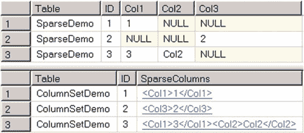

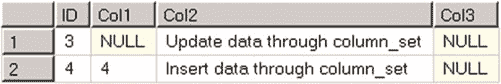

图 4-20. 稀疏列：COLUMN_SET 与选择查询

你可以通过 `COLUMN_SET` 列插入或更新稀疏列。代码清单 4-30 展示了一个示例，图 4-21 显示了执行结果。

**代码清单 4-30.** 稀疏列：使用 COLUMN_SET 操作数据

```sql
insert into dbo.ColumnSetDemo(ID, SparseColumns)
values(4, '<col1>4</col1><col2>Insert data through column_set</col2>');

update dbo.ColumnSetDemo
set SparseColumns = '<col2>Update data through column_set</col2>'
where ID = 3;

select ID, Col1, Col2, Col3 from dbo.ColumnSetDemo where ID in (3,4);
```

图 4-21. 稀疏列：使用 COLUMN_SET 操作数据

通过 `COLUMN_SET` 处理稀疏列可以简化开发和数据库管理，尤其是在表结构因业务或功能需求而发生变化时。

**注意：** `COLUMN_SET` 列存在一系列限制。详情请阅读此文档：[`technet.microsoft.com/en-us/library/cc280521.aspx`](http://technet.microsoft.com/en-us/library/cc280521.aspx)。

对于稀疏列，常规索引由于存在大量 `NULL` 值而效率低下。你应该改用筛选索引。即使在被索引的行只占极小子集的情况下，使用大量筛选索引也可能是可接受的，并且不会引入显著的数据修改和维护开销。

Microsoft 建议，只有当与非稀疏实现相比，净空间节省至少达到 20%至 40%时，才实施稀疏列。然而，稀疏列是有成本的。某些 SQL 功能，如复制、更改跟踪和变更数据捕获，在处理稀疏列和/或列集时会受到限制。此外，包含稀疏列的表无法被压缩。

处理稀疏列时需要监控数据。列中 `NULL` 值的百分比可能会随时间变化，这会使稀疏列变得低效。

对于 SQL Server 企业版，当目标是减少那些主要存储 `NULL` 值的定长列所占用的存储空间时，我倾向于使用数据压缩而不是稀疏列。在此用例中，数据压缩与稀疏列一样能减少存储空间，同时，它对其他 SQL Server 功能是透明的。

#### 总结

当 SQL Server 预计需要大量键或 RID 查找操作时，它不会使用非聚集索引。你可以通过向索引添加列，使其成为查询的覆盖索引来消除这些操作。这是一种出色的优化技术，可以显著提升系统性能。

然而，向索引添加包含列会增加叶级行的大小，这将对扫描数据的查询性能产生负面影响。它还会引入额外的索引维护开销，减慢数据修改操作，并增加系统中的锁定。

筛选索引允许你仅索引数据的一个子集，从而减少索引存储大小和维护成本。SQL Server 在筛选索引方面存在一些设计限制。尽管不是必须，但你应该将筛选条件中的所有列都作为叶级索引行的一部分，以防止生成次优的执行计划。

对筛选条件中列的修改不会增加统计信息的列修改计数器，这可能导致统计信息不准确。你需要将此行为纳入系统的统计信息维护策略中考虑。


# SQL Server 2016 特性
## Dmitri Korotkevitch with Thomas Grohser

筛选统计信息能够帮助你在查询谓词高度相关的情况下提升**基数估计**的准确性。不过，它们具有与筛选索引相同的局限性。

SQL Server 的企业版支持两种不同的数据压缩方法。行压缩通过移除行中未使用的存储空间来减小数据行的大小。页压缩则通过移除数据页中重复的字节序列来实现压缩。

数据压缩能显著减少表的存储空间，代价是额外的 CPU 负载，尤其是在修改数据时。然而，压缩数据在缓冲池中占用的空间更少，并且需要更少的 I/O 操作，这可以提升系统的性能。即使数据经常变动，在非 CPU 瓶颈的系统上，行压缩也是一个不错的选择。页压缩则非常适合静态数据。

稀疏列可以在某些列主要存储`NULL`值时减少行大小。稀疏列在存储`NULL`值时不占用存储空间，代价是存储`NOT NULL`值时需要额外的存储空间。

虽然稀疏列允许创建包含数千列的宽表，但你需要谨慎使用它们。仍然存在`8,060 字节`的行内数据大小限制，这可能会阻止你插入或更新某些行。此外，当需要频繁更改架构时，宽表通常会带来开发和管理上的开销。

最后，你应该监控存储在稀疏列中的数据，确保`NOT NULL`数据的百分比没有增加，这将使稀疏存储的效率低于非稀疏存储。

本章概述了 SQL Server 2016 的几个新特性，例如时态表、伸缩数据库、行级安全、动态数据掩码和始终加密。

#### 时态表

当今的大多数系统都在处理随时间变化的数据。新数据被收集并插入系统，旧数据被清除，目录实体被修改。

系统中通常存在两个需求。第一个是保留任何数据更改的审计跟踪，提供关于谁在何时更改了什么信息。基于现有技术（如 SQL Audit、变更跟踪和变更数据捕获）有许多构建此解决方案的方法。基于触发器的自定义实现也很常见。

不幸的是，在某些情况下，仅保留更改的审计跟踪是不够的。一些系统——例如，库存管理或金融投资组合管理解决方案——需要能够在任何特定时间点访问数据的快照。可以从审计跟踪表中重建此类快照；然而，这是一项复杂且容易出错的工作，尤其是在涉及多个相关表时。

系统版本化时态表是新的用户表类型，有助于实现这些需求。它们旨在保留数据更改的完整历史，并便于进行时间点分析。

### 系统版本化与应用版本化时态表

`ANSI SQL 2011`定义了两种类型的时态表。系统版本化时态表根据更改在系统中发生的时间来保留数据更改的历史记录。它们为你提供数据库在特定时间存在的数据的快照。而应用版本化时态表则从业务角度为你提供一个有效的数据快照。

以保险系统为例。每份保险单都有生效日期，定义了保单开始和失效（或将要失效）的时间。应用版本化时态表可以帮助识别在特定时间点生效的保单。系统版本化时态表则可以帮助查找在特定时间点存在于数据库中的保单数据行，无论该保单当时是否生效。


# 第五章 SQL SERVER 2016 功能

## 概述

每个系统版本化的时态表由两个表组成——包含当前数据的**当前表**，和存储行旧版本的**历史表**。每次在当前表中修改或删除数据时，`SQL Server`会将这些行的原始版本添加到历史表中。

当前表必须始终定义有主键。此外，当前表和历史表都应有两个`datetime2`列，称为**周期列**，用于指示行的生命周期。`SQL Server`根据事务开始时间自动填充这些列。当一行在一个事务中被多次修改时，`SQL Server`不会在历史表中保留未提交的中间行版本。

值得注意的是，周期列始终存储事务开始时间，而不是实际的`DML`操作时间。当事务修改多个相关实体时（例如`Orders`和`OrderLineItems`），这提供了时间点一致性。然而，这也引出了另一种现象，我们将在本章后面讨论。

## 创建历史表的方式

有三种方式可以创建历史表。

1.  **允许`SQL Server`生成匿名历史表**：在创建时态表时省略其名称。`SQL Server`随后会创建一个历史表，并自动生成其名称。
2.  **指定历史表的名称和架构**：允许`SQL Server`创建对应的表。

在这两种情况下，`SQL Server`都会将历史表放置在默认文件组上，并在控制行生命周期的两个`datetime2`列上创建非唯一的聚集索引。它不会在该表上创建任何其他索引。

> **重要提示**
> 在企业版和开发版中，历史表默认使用页面压缩。除非你重建索引以移除数据压缩，否则你将无法在`SQL Server`的较低版本中还原数据库。

3.  **指定现有的表作为历史表**：前提是表架构兼容。可以预见，这种方法在配置上提供了最大的灵活性。

代码清单 5-1 展示了通过指定历史表架构和表名来创建时态表的代码。其中与时态表相关的新语言构造以粗体显示。

### 代码清单 5-1 创建时态表

```sql
create table dbo.Employees
(
    EmployeeId int not null,
    FullName nvarchar(128) not null,
    Position nvarchar(128) not null,
    Salary money not null,
    SysStartTime datetime2
        generated always as row start not null
    ,
    SysEndTime datetime2
        generated always as row end not null
    ,
    constraint PK_Employees
        primary key clustered(EmployeeId)
    period for system_time(SysStartTime, SysEndTime)
)
with
(
    system_versioning = on (history_table = dbo.EmployeesHistory)
);

create nonclustered index IDX_Employees_FullName
on dbo.Employees(FullName);
```

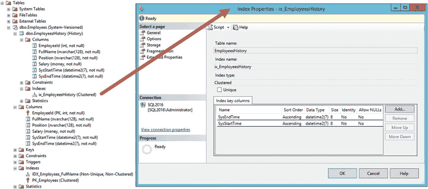

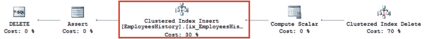

图 5-1 展示了`SSMS`中的当前表和历史表，并显示了在历史表上定义的聚集索引的属性。

### 图 5-1 SSMS 中的时态表

当前表和历史表在逻辑上是相互链接的，并且应具有匹配的列集。然而，在物理存储和索引方面没有依赖关系。这些表可以各自拥有不同的索引集，位于不同的文件组中，甚至使用不同的存储技术。例如，可以为历史数据使用聚集列存储索引，同时在当前表中保持基于行的存储。

***

*注：原始文本中包含一些无法解析的内部文档链接，已在处理中移除或调整为更通用的引用。图片引用已按原文保留。*


# 第 5 章 ■ SQL SERVER 2016 功能特性

然而，历史表不能拥有唯一索引或外键与表约束，也不能参与变更跟踪、变更数据捕获，或事务复制与合并复制。在索引和统计维护方面，你应该像对待常规表一样对待历史表，我们将在下一章讨论这个主题。

当你修改当前表的架构时，变更会传播到历史表。但是，在你使用 `ALTER TABLE SET (SYSTEM_VERSIONING = OFF)` 命令停止系统版本控制之前，无法删除时态表。此命令会将一个时态表转换为数据库中的两个常规表。

当你在当前表中更新或删除数据时，SQL Server 会将受影响的行复制到历史表。图 5-2 展示了 `DELETE FROM dbo.Employees WHERE EmployeeId = @EmployeeId` 语句的执行计划，其中包含对历史表的*聚集索引插入*操作。另外需要注意的是，SQL Server 不会在历史表中存储行的当前版本，因此，`INSERT` 语句不会向那里插入数据。

`图 5-2.` DELETE 语句的执行计划

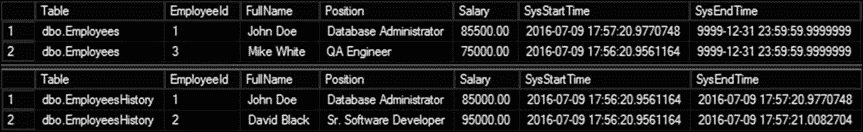

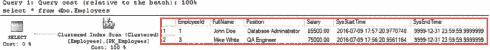

当你从时态表中选择数据时，SQL Server 会根据查询访问一个或两个表。让我们看几个例子，首先，让我们像清单 5-2 所示，用一些数据填充 `dbo.Employees` 表。图 5-3 显示了代码中 `SELECT` 语句的输出。需要注意的是，SQL Server 在生成周期列值时使用的是 UTC 时间。

`清单 5-2.` 用数据填充时态表

```
insert into dbo.Employees(EmployeeId, FullName, Position, Salary)
values
(1,'John Doe','Database Administrator',85000),
(2,'David Black','Sr. Software Developer',95000),
(3,'Mike White','QA Engineer',75000);

waitfor delay '00:01:00.000';

update dbo.Employees set Salary = 85500 where EmployeeID = 1;

delete from dbo.Employees where EmployeeId = 2;

select 'dbo.Employees' as [Table], * from dbo.Employees;

select 'dbo.EmployeesHistory' as [Table], * from dbo.EmployeesHistory;
```

你可以直接查询历史数据；但是，你应该记住它不包含行的*当前*版本。图 5-3 刚好说明了这一点——在 `dbo.EmployeesHistory` 表中，*John Doe* 只有一条旧记录，而 *Mike White* 则没有任何数据。

`图 5-3.` 表中的数据

默认情况下，当你查询当前表时，查询作用于数据的当前快照，其行为类似于常规表，并且不会访问历史数据。图 5-4 说明了这一点。

`图 5-4.` 不使用 `FOR SYSTEM_TIME` 子句查询时态表

你可以通过指定 `SELECT` 的 `FOR SYSTEM_TIME` 子句来访问历史数据。有几种可能的选项。

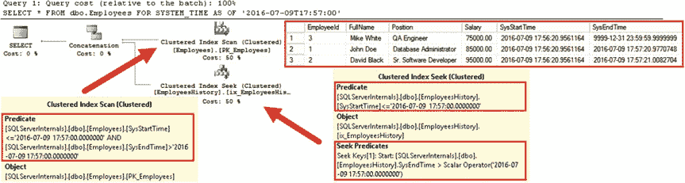

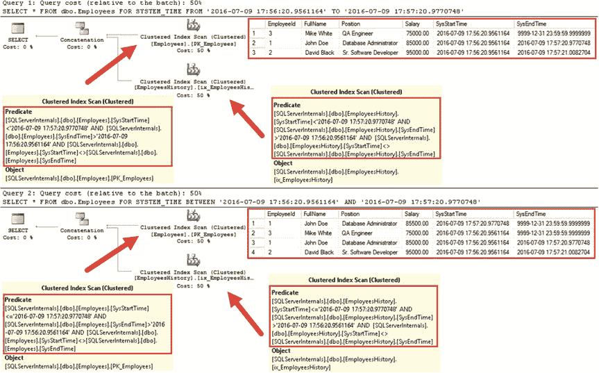

`FOR SYSTEM_TIME AS OF <time>` 选项返回与系统中特定时间点相对应的数据快照。SQL Server 在执行 `SELECT` 时会组合两个表中的数据。图 5-5 展示了 `SELECT * FROM dbo.Employees FOR SYSTEM_TIME AS OF '2016-07-09T17:57:00'` 语句的输出和执行计划。如你所见，数据代表的是初始插入之后、清单 5-2 所见的数据修改之前的状态。

`图 5-5.` 查询时态表：`FOR SYSTEM_TIME AS OF`

如图 5-5 所示，SQL Server 会在两个表的周期列上添加谓词。当你在查询中使用 `FOR SYSTEM_TIME` 选项时，你应该为这些列添加索引。

`FOR SYSTEM_TIME FROM <starttime> TO <endtime>` 和 `FOR SYSTEM_TIME BETWEEN <starttime>`


# 第 5 章 ■ SQL SERVER 2016 特性

`AND` 和 `<endtime>` 子句返回在特定时间间隔内存在的所有版本的行。它们的区别在于 `FOR SYSTEM_TIME FROM` 会从输出中排除 `<endtime>`，而 `FOR SYSTEM_TIME BETWEEN` 会将其包含在内。图 5-6 对此进行了说明。

**图 5-6.** 查询时态表：`FOR SYSTEM_TIME FROM` 和 `FOR SYSTEM_TIME BETWEEN`

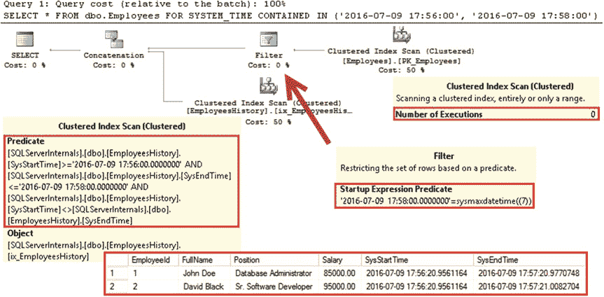

`FOR SYSTEM_TIME CONTAINED IN` 选项返回在特定时间间隔内有效的所有行版本。它不包含任何当前版本，并且应仅与历史表一起使用。图 5-7 展示了一个带有 `FOR SYSTEM_TIME CONTAINED IN` 子句的查询的执行计划。

尽管它在当前表上包含了聚集索引扫描操作符，但筛选器操作符阻止了它的执行。

**图 5-7.** 查询时态表：`FOR SYSTEM_TIME CONTAINED IN`

最后，`FOR SYSTEM_TIME ALL` 会将来自两个表的数据连接起来并返回给客户端。当您需要访问行的所有版本——包括当前版本和所有历史版本时，这可能很有用；例如，在分析随时间变化的趋势时。图 5-8 对此进行了说明。

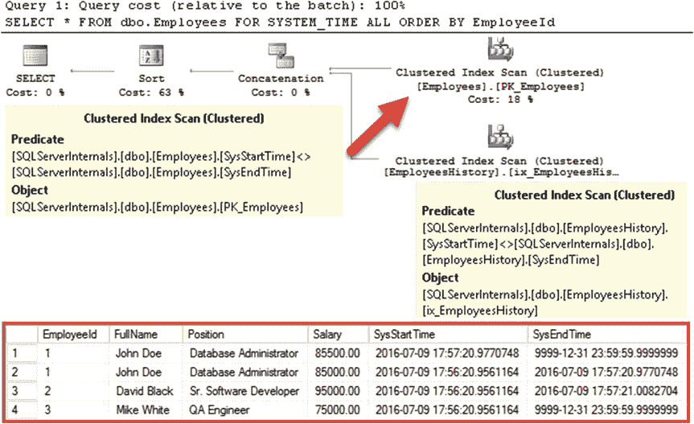

**图 5-8.** 查询时态表：`FOR SYSTEM_TIME ALL`

我想重申一个非常重要的点。使用 `FOR SYSTEM_TIME` 子句访问时态数据会在当前表和历史表的时段列上添加谓词。您需要将其纳入系统的索引策略中考量。

在处理访问时态数据的查询时，还有另一个需要注意的现象。正如我已经提到的，SQL Server 使用对应于插入、更新或删除数据的事务开始时间来填充时段列。因此，时态查询可能会返回在特定时间点尚未提交的数据。

考虑一种情况，您有一个在时间 `TStart` 开始并在时间 `TEnd` 提交的事务。此事务所做的数据修改对其他会话是不可见的，除非它们使用 `READ UNCOMMITTED` 事务隔离级别。根据隔离级别，这些会话要么会被阻塞，要么会读取在 `TStart` 时间点的数据快照。

但是，如果您使用 `FOR SYSTEM_TIME` 子句查询时态数据，SQL Server 会基于时段列筛选数据，这些列包含的是 `TStart` 而不是 `TEnd` 时间戳，这可能会导致结果不正确。

**注意** 我们将在本书的第五部分讨论事务隔离级别和并发性。

您可以在 [`msdn.microsoft.com/en-us/library/dn935015.aspx`](https://msdn.microsoft.com/en-us/library/dn935015.aspx) 阅读更多关于时态表的内容。

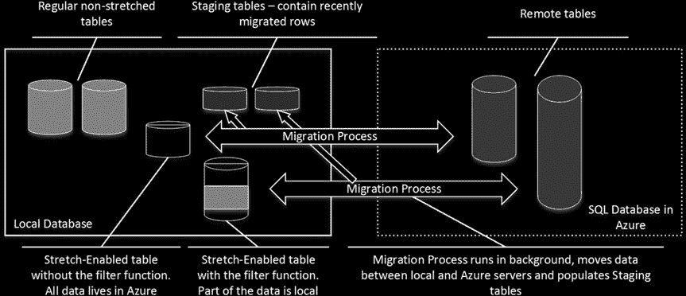

## Stretch Database

系统收集大量数据并在数据库中长期保留数据已变得很常见。在许多情况下，旧数据很少被用户访问；它只是由于合规性和法规或其他目的而被保留。设计良好的数据库会对数据进行分区，将当前数据和旧数据彼此分开；然而，也有许多实现将所有内容存储在一个未分区的表中。

这种实现方式存在许多挑战。它使得性能调整和数据库维护更加困难。它使高可用性和灾难恢复规划复杂化，同时也增加了硬件和存储成本。SQL Server 2016 的一个新功能，即 *Stretch Database*，可以通过将部分数据存储在 Microsoft Azure SQL Database 中并透明地供应用程序访问，来应对其中一些挑战。

从概念上讲，Stretch Database 类似于链接服务器设置，带有一组内部进程。


# 第五章 ■ SQL SERVER 2016 功能特性

在后台在服务器之间移动数据。你可以通过指定一个内联表值`筛选器函数`来迁移整个表或仅表数据的子集，该函数控制需要移动哪些行。

查询继续在本地数据库上工作，SQL Server 通过在需要时运行远程查询，透明地访问 Microsoft Azure 中的远程数据部分。

这项技术的一个注意事项是要求服务器之间具有连接性。如果没有连接性，访问远程数据的查询将会失败。在选择使用此功能时，你应该记住这一行为。

图 5-9 提供了 Stretch Database（延伸数据库）实现的高级概述。当数据被迁移时，SQL Server 会在本地内部暂存表中临时保留迁移行的副本，确保如果你还原本地或 Azure SQL 数据库备份时，数据可以被协调一致。默认情况下，数据会保留八小时，这与 SQL Azure 的自动备份计划相对应。你可以使用 `sys.sp_rda_set_rpo_duration` 存储过程来增加此时间。但请记住，保留时间越长，本地数据库中暂存表的大小就越大。

`图 5-9. Stretch Database 概述`

当你备份启用了 Stretch 的数据库时，SQL Server 会创建一个`浅备份`。它仅包含本地数据以及备份运行时符合迁移条件的行。Azure SQL Database 中的远程数据部分由每八小时运行一次并保留七天的、自动的、地理冗余的存储快照备份保护，为你提供了一系列恢复点。我们将在[第 31 章](http://dx.doi.org/10.1007/978-1-4842-1964-5_31)讨论 Azure 存储快照备份。

还原启用了 Stretch 的数据库后，你需要使用 `sys.sp_rda_reauthorize_db` 存储过程重新建立本地数据库与 Azure 数据库之间的连接。你可以从 Azure 门户执行 SQL 数据库的时间点还原，该处的存储备份会保留七天。

## 配置 Stretch Database

在开始使用 Stretching（延伸）之前，必须在服务器和数据库级别都启用它。执行初始设置最简单的方法可能是在 SSMS 中使用 `为数据库启用 Stretch` 向导。此向导配置服务器和数据库级别的 Stretching，并允许你选择要延伸的表。

或者，你可以使用 T-SQL 来配置它。通过运行 `EXEC SP_CONFIGURE 'remote data archive', '1'` 命令可以在服务器级别启用 Stretching，这需要 `sysadmin` 或 `serveradmin` 权限。

### 清单 5-3. 在数据库级别启用 Stretch Database

清单 5-3 展示了如何使用现有的 Microsoft Azure SQL Server 作为目标在数据库上启用 Stretching。此操作需要 `CONTROL DATABASE` 权限才能执行。

```
-- 创建主密钥
create master key encryption by password='Strong Password';

-- 使用 SQL Server 登录信息创建数据库范围凭据
create database scoped credential SQLServerLoginInfo
with
identity = 'my_azure_sql_server_login_name'
,secret = 'my_password';

-- 为数据库启用 Stretching
alter database MyDatabase
set remote_data_archive = on
(
server = 'myserver.database.windows.net'
,credential = SQLServerLoginInfo
);
```

启用该功能后，你可以选择要延伸的表。包含在 `SQL Server 2016 升级顾问` 中的 `Stretch Database Advisor` 工具可以帮助你识别哪些表最能从此技术中受益，以及任何可能阻止延伸的阻塞问题。

在 SQL Server 2016 RTM 中，存在相当多的此类阻塞问题。例如，一个表不能有 `DEFAULT`（默认）和 `CHECK`（检查）约束，也不能被外键引用。该表不能使用 `XML`、`text`、`ntext`、


# 第 5 章 ■ SQL SERVER 2016 功能

`image`、`timestamp`、`sql_variant` 或 `CLR` 数据类型不被支持，也不能包含在索引视图中。

启用 Stretch 后还有其他限制。最值得注意的是，SQL Server 不会强制执行 `UNIQUE` 和 `PRIMARY KEY` 约束，也不允许你对已迁移的数据执行 `UPDATE` 和 `DELETE` 操作。

## 注意

你可以阅读有关 Stretch Database Advisor 工具的文章：[`msdn.microsoft.com/en-us/library/dn935004.aspx`](https://msdn.microsoft.com/en-us/library/dn935004.aspx)。完整的限制列表可在此处获取：[`msdn.microsoft.com/en-us/library/mt605114.aspx`](https://msdn.microsoft.com/en-us/library/mt605114.aspx)。

当一个表兼容 Stretch 时，你可以使用 `ALTER TABLE SET (REMOTE_DATA_ARCHIVE = ON)` 命令或通过 SSMS 中的 `Stretch` 任务来拉伸它。正如我已经提到的，你可以迁移整个表或表数据的子集。后一种情况需要你指定控制哪些行需要迁移的过滤函数。当提供过滤函数时，SQL Server 会使用 `CROSS APPLY` 运算符将其应用于表中的行。当函数返回非空结果集时，该行就有资格被迁移。

### 启用表的 Stretch 功能

```
alter table dbo.AppLogs
set (remote_data_archive = on (migration_state = outbound));

create function dbo.fnOrdersOlderThanJan2016(@OrderDate datetime2(0))
returns table
with schemabinding
as
return
(
  select 1 as is_migrating
  where @OrderDate < convert(datetime2(0), '1/1/2016', 101)
)
go

alter table dbo.Orders set
(
  remote_data_archive = on
  (
    filter_predicate = dbo.fnOrdersOlderThanJan2016(OrderDate),
    migration_state = outbound
  )
);
```

如你所猜，过滤函数应该是 deterministic（确定性的），并且不应依赖于正在评估的行之外的数据。你不能从那里执行任何数据访问。此外，仅支持原始谓词和条件，例如 `AND` 和 `OR` 谓词、`IN`、`IS NULL`、`IS NOT NULL` 以及比较运算符。所有这些保证了一个函数对于相同的参数值集合总是返回相同的结果。

你可以通过修改表来更改过滤函数。但是，新函数应提供 less restrictive（限制性更少）的结果，并允许你迁移比之前更多的行。

### 替换过滤函数

```
create function dbo.fnOrdersOlderThanFeb2016(@OrderDate datetime2(0))
returns table
with schemabinding
as
return
(
  select 1 as is_migrating
  where @OrderDate < convert(datetime2(0), '2/1/2016', 101)
)
go

alter table dbo.Orders set
(
  remote_data_archive = on
  (
    filter_predicate = dbo.fnOrdersOlderThanFeb2016(OrderDate),
    migration_state = outbound
  )
);
```

再举一个例子，下面的函数不能用作原始过滤函数的替换。它添加了 `@Completed` 参数谓词，因此比原始函数限制性更强。因此，一些已经迁移的行不再符合迁移条件，这是不允许的。


### 查询伸缩数据库

尽管伸缩数据库对客户端应用程序是透明的，但它们并不保证查询性能会保持不变。在某些情况下，伸缩可以通过减少本地扫描的数据量和/或在两台服务器上并行运行扫描来提高性能。在其他情况下，由于网络延迟和跨服务器连接，它们可能会损害性能。

如果你曾使用过链接服务器，你应该意识到该技术可能存在的潜在性能问题。当谓词可以远程评估且服务器不需要通过网络推送大量数据时，分布式查询工作良好。否则，大量的网络流量和远程调用会极大地影响性能。该技术还存在连接性方面的问题。如果服务器之间没有连接，分布式查询将会失败。

所有这些对于伸缩数据库仍然成立。让我们看几个与性能和数据访问相关的例子。

#### 清单 5-6. 限制性更强的筛选函数

```sql
create function dbo.fnInvalid(@OrderDate datetime2(0), @Completed bit)
returns table
with schemabinding
as
return
(
    select 1 as is_migrating
    where
        (@Completed = 1) and
        @OrderDate < convert(datetime2(0), '2/1/2016', 101)
)
```

清单 5-7 展示了创建 `dbo.Customers` 和 `dbo.Orders` 表并用一些数据填充它们的代码。它还假设我们通过运行清单 5-5 中的代码启用了 `dbo.Orders` 表的伸缩功能，并将 2016 年 2 月之前的所有订单迁移到了 Microsoft Azure。

#### 清单 5-7. 查询伸缩数据库：表创建

```sql
create table dbo.Customers
(
    CustomerId int identity(1,1) not null,
    Name nvarchar(32) not null,
    PostalCode char(5) not null,
    constraint PK_Customers primary key clustered(CustomerId)
);

create table dbo.Orders
(
    OrderId int not null,
    CustomerID int not null,
    OrderDate datetime2(0) not null,
    Amount money not null,
    Completed bit not null,
    constraint PK_Orders primary key clustered(OrderId)
);

create nonclustered index IDX_Orders_CustomerId on dbo.Orders(CustomerId);
create nonclustered index IDX_Orders_OrderDate on dbo.Orders(OrderDate);

-- 65,536 customers total. 256 customers per Postal Code
;with N1(C) as (select 0 union all select 0) -- 2 rows
,N2(C) as (select 0 from N1 as T1 cross join N1 as T2) -- 4 rows
,N3(C) as (select 0 from N2 as T1 cross join N2 as T2) -- 16 rows
,N4(C) as (select 0 from N3 as T1 cross join N3 as T2) -- 256 rows
,IDs(ID) as (select row_number() over (order by (select null)) from N4)
insert into dbo.Customers(Name, PostalCode)
select 'Customer ' + convert(varchar(32),i1.ID * i2.Id)
    ,convert(char(5),10000 + i2.ID)
from IDs i1 cross join IDs i2;

declare
    @StartDate datetime2(0) = '2016-09-01';

;with N1(C) as (select 0 union all select 0) -- 2 rows
,N2(C) as (select 0 from N1 as T1 cross join N1 as T2) -- 4 rows
,N3(C) as (select 0 from N2 as T1 cross join N2 as T2) -- 16 rows
,N4(C) as (select 0 from N3 as T1 cross join N3 as T2) -- 256 rows
,N5(C) as (select 0 from N4 as T1 cross join N4 as T2) -- 65,536 rows
,N6(C) as (select 0 from N5 as T1 cross join N3 as T2) -- 1,048,576 rows
,IDs(ID) as (select row_number() over (order by (select null)) from N6)

insert into dbo.Orders(OrderId, CustomerId, Amount, OrderDate, Completed)
select ID, ID % 65536 + 1, Id % 50, dateadd(day,-ID % 365, getDate()), 0
from IDs;

/* 使用清单 5-5 的代码为 dbo.Orders 表启用伸缩功能 */
```

首先，让我们运行一个查询，计算 2016 年 1 月和 2 月提交了多少订单。该代码如清单 5-8 所示。

#### 清单 5-8. 查询伸缩数据库：统计订单总数

```sql
select count(*) as [Order Count]
from dbo.Orders o
where o.OrderDate >= '2016-01-01' and o.OrderDate < '2016-03-01';
```


图 5-10 illustr 展示了该查询的部分执行计划。如您所见，SQL Server 在远程执行了 `COUNT()` 聚合，远程查询仅向本地服务器返回了一行数据。

**图 5-10.** 执行计划：统计订单总数

现在，让我们运行一个查询，该查询按客户计算总销售额，如代码清单 5-9 所示。

**代码清单 5-9.** 查询拉伸数据库：按客户计算总销售额

```sql
select c.Name, sum(o.Amount) as [Total Sales]
from dbo.Customers c join dbo.Orders o on
c.CustomerId = o.CustomerId
group by c.Name
```

图 5-11 sho 展示了该查询的执行计划和执行时间。如您所见，SQL Server 决定将所有远程数据通过网络传输过来，并在本地执行聚合。您还可以看到一个基数估算错误，尽管两台服务器上的统计信息都是最新的。这是因为远程 SQL Server 向查询中添加了额外的内部谓词。

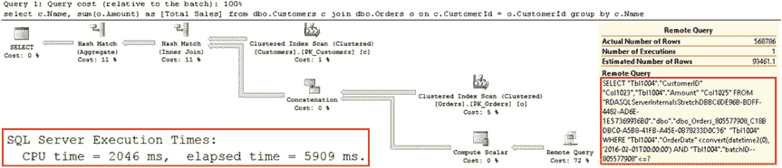

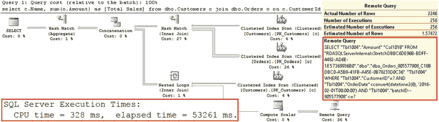

第 5 章 ■ SQL SERVER 2016 特性

**图 5-11.** 执行计划：按客户计算总销售额

最后，让我们向之前的查询添加谓词，按邮政编码筛选客户。该查询如代码清单 5-10 所示。

**代码清单 5-10.** 查询拉伸数据库：按 PostalCode 筛选

```sql
select c.Name, sum(o.Amount) as [Total Sales]
from dbo.Customers c join dbo.Orders o on
c.CustomerId = o.CustomerId
where c.PostalCode = '10050'
group by c.Name
```

如图 5-12 所示，执行计划的形状已经改变。SQL Server 使用 `nested loop` 运算符运行多个远程查询，为单个客户选择数据。尽管这种方法减少了通过网络传输的行数，但多次远程调用的开销导致了显著更长的执行时间。

**图 5-12.** 执行计划：按 PostalCode 筛选

所有这些查询都没有在 `OrderDate` 列上设置谓词，因此 SQL Server 必须同时访问本地和远程数据。添加这样的谓词将允许 SQL Server 避免不必要的远程服务器访问。例如，如果您运行 `SELECT COUNT(*) FROM dbo.Orders WHERE OrderDate >= '2016-05-01'` 语句，您将得到如图 5-13 所示的不访问远程服务器的执行计划。

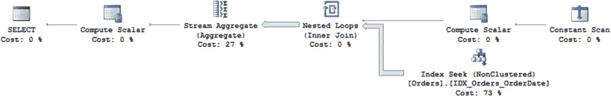

第 5 章 ■ SQL SERVER 2016 特性

**图 5-13.** 执行计划：在 `OrderDate` 列上的谓词

然而，参数化和自动参数化仍然可能导致一种情况：当执行计划被缓存时，查询必须访问远程服务器。虽然这不一定会带来巨大的性能影响——远程查询可能只需计算谓词值而不执行任何数据访问——但如果服务器之间没有连接，查询将会失败。

在决定拉伸数据时，您应该牢记这些性能和连接性影响。在许多情况下，将数据分区到单独的表中、拉伸整个 `History` 表，而不是从单个表中迁移一部分数据会更安全。然而，这种方法需要代码修改，并且违背了该技术对客户端应用程序透明的目的。

### 注意
我们将在第[16](http://dx.doi.org/10.1007/978-1-4842-1964-5_16)章更详细地讨论数据分区，并在第[26](http://dx.doi.org/10.1007/978-1-4842-1964-5_26)章讨论计划缓存。

最后，值得再次重申，默认情况下，当您查询启用拉伸功能的表时，SQL Server 不允许您指定数据位置。它也不允许您在行迁移后更新或删除远程数据。存在表提示 `—WITH (REMOTE_DATA_ARCHIVE_OVERRIDE)—`，它允许成员


# 第五章 ■ SQL SERVER 2016 功能

`db_owner` 角色的权限，以更改查询的范围。此提示可以具有以下三个值之一：

`LOCAL_ONLY` - 仅针对本地数据运行查询

`REMOTE_ONLY` - 仅针对远程数据运行查询

`STAGE_ONLY` - 针对暂存数据（迁移到 Azure 后临时保留在本地数据库中的行）运行查询

此提示可用于 `SELECT`、`UPDATE` 和 `DELETE` 查询，并允许你修改和删除远程数据。但是，如果你需要在活动事务范围内修改远程数据，请谨慎操作。此操作可能耗费大量时间，如果 SQL Server 无法访问远程数据库，甚至可能失败。最好使用 Service Broker 或其他基于队列的技术异步实现数据修改。

## Stretch Database 定价

Stretch 数据库是一项令人兴奋的功能，在许多场景中都很有用。不幸的是，它很昂贵。使用 Stretch 数据库的成本包括两部分——计算和存储。本质上，你是在选择 Microsoft Azure SQL Database 的性能层级，并为数据库文件和备份的存储付费。

Microsoft Azure 的定价可能随时变动，但截至 2016 年 9 月，具有 100 个 DSU（数据库扩展单元）的最低计算层级定价为每月 1,860 美元。存储成本为每 1TB 存储每月 164 美元。实际上，这意味着使用最低计算层级远程存储 1 TB 数据，你每月需要支付超过 2,000 美元。

你应该将此成本纳入分析考量。在许多情况下，从长远来看，实施数据分区和分层存储是一种更具成本效益的解决方案，特别是如果你使用的是 SQL Server 企业版。我们将在[第 16 章](http://dx.doi.org/10.1007/978-1-4842-1964-5_16)讨论此类实现。

> **注意** 你可以在 [`msdn.microsoft.com/en-us/library/dn935011.aspx`](https://msdn.microsoft.com/en-us/library/dn935011.aspx) 阅读更多关于 Stretch 数据库设置、维护和监控的信息。

#### 行级安全性

行级安全性根据每个用户为基础，限制对表中某些行的读写访问。与作用于整个表范围的常规 `SELECT`、`INSERT`、`UPDATE` 和 `DELETE` 权限相反，行级安全性有助于实施考虑行数据的安全模型。例如，在客户管理系统中，你可以使用行级安全性限制普通用户访问部分客户，同时允许区域经理查看该区域的所有客户。另一个常见用例是多租户设置中的安全性，此时租户的数据应对系统中的其他租户不可见。

要实现行级安全性，你必须编写一个内联表值函数，称为 `策略函数`。该函数为对用户可见的行返回单行结果集。下一步，你应该创建一个 `安全策略`，将该函数绑定到表。

让我们看一个例子，假设我们想要实现一个简单的客户管理系统。清单 5-11 中显示的代码在数据库中创建了几个用户和一个包含几行的表。

***清单 5-11.*** 行级安全性：设置用户和用于行级安全性的表

```sql
create user ClientManager1 without login;
create user RegionalManager without login;

create schema Client;
go

create table Client.Client1
(
    ClientID int not null,
    ClientManager sysname not null,
    Revenue money not null,
    OtherInfo nvarchar(100) not null
);

grant select on Client.Client1 to ClientManager1, RegionalManager;

insert into Client.Client1 values
(1, 'ClientManager1', 100000, 'abc')
,(2, 'ClientManager1', 200000, 'def')
,(3, 'ClientManager2', 300000, 'ghi')
,(4, 'ClientManager2', 400000, 'jkl')
,(5, 'ClientManager3', 500000, 'mno');
```


在当前实现下，每个用户都能看到表中的所有数据。你可以通过使用 `EXECUTE AS` 命令模拟用户来测试这一点，如代码清单 5-12 所示。

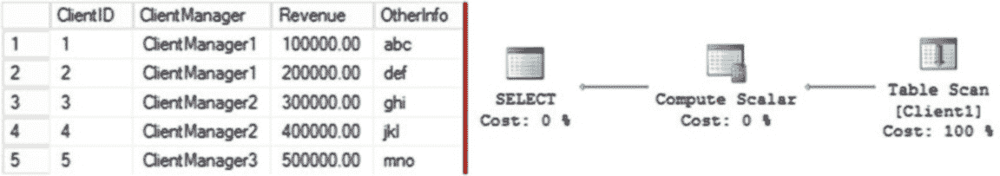

# 第 5 章 ■ SQL SERVER 2016 特性

**代码清单 5-12.** 行级安全：模拟用户以选择数据

```
execute as user = 'ClientManager1';
select * from Client.Client1;
revert;
```

如图 5-14 所示，查询返回了所有行，这在当前阶段是符合预期的。执行计划是一个简单的全*表扫描*。

**图 5-14.** 行级安全：未应用 RLS 时的数据与执行计划

让我们来设置行级安全。第一步是创建一个策略函数，用于确定某行是否可被用户看见。如代码清单 5-13 所示，该函数非常简单。它接受一个参数——经理姓名，并将其与执行查询的用户进行比较。显然，在实际场景中，检查 Active Directory 组成员资格会是更好的做法。

如果某行数据应对当前用户可见，该函数必须返回一行（返回值与列名无关紧要）。同样值得注意的是，使用 `SCHEMABINDING` 子句定义的安 全函数，不要求用户对函数内访问的表拥有 `SELECT` 权限。反之，未使用 `SCHEMABINDING` 子句定义的函数则要求用户拥有这些权限。

**代码清单 5-13.** 行级安全：安全策略函数

```
create function Client.fn_LimitToManager(@Manager as sysname)
returns table
with schemabinding
as
return
( select 1 AS fn_LimitToManagerResult
  where @Manager = user_name() or user_name() = 'RegionalManager' )
```

最后一步是创建将函数与表关联起来的安全策略。你可以在代码清单 5-14 中看到该命令的语法。安全策略中的 `FILTER` 谓词指定了负责数据读取访问的函数。`BLOCK` 谓词（我们将在本章后面讨论）则控制对数据的写入访问。

**代码清单 5-14.** 行级安全：安全策略

```
create security policy LimitMgrFilter
add filter predicate Client.fn_LimitToManager(ClientManager)
on Client.Client1
with (state = on)
```

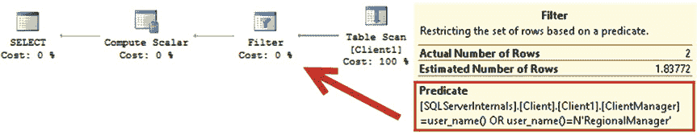

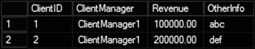

第 5 章 ■ SQL SERVER 2016 特性

如果你再次运行代码清单 5-12 中的代码，应该能看到查询仅返回由 *ClientManager1* 管理的两行数据，如图 5-15 所示。

**图 5-15.** 行级安全：应用 RLS 后的数据

## 性能影响

如你所料，行级安全会引入性能开销，其大小取决于策略函数的实现方式。图 5-16 显示了在应用安全策略后，代码清单 5-12 中查询的执行计划。你可以看到一个额外的*筛选*运算符，它对应于策略函数。

**图 5-16.** 应用行级安全后的执行计划

让我们修改示例，使用一个存储客户/经理关系的查找表，如代码清单 5-15 所示。最后一步，代码将模拟用户运行一条 `SELECT` 语句，类似于代码清单 5-12。

**代码清单 5-15.** 行级安全：安全策略函数中的引用表

```
create table Client.ClientManager
(
    ID int not null
        constraint PK_ClientManager primary key clustered,
    ManagerName nvarchar(100) not null,
    isRegionalManager bit not null
);

insert into Client.ClientManager values
(1,'ClientManager1',0), (2,'ClientManager2',0)
,(3,'ClientManager3',0), (4,'RegionalManager',1);

create table Client.Client2
(
    ClientID int not null,
    ClientManagerID int not null
        constraint FK_Client2_ClientManager
```

第 5 章 ■ SQL SERVER 2016 特性


# 第 5 章 ■ SQL SERVER 2016 功能特性

```sql
foreign key references Client.ClientManager(ID),

ClientName nvarchar(64) not null,

CreditLimit money not null,

IsVIP bit not null

constraint DEF_Client2_IsVIP default 0

);

grant select on Client.Client2 to ClientManager1, RegionalManager;

;with N1(C) as (select 0 union all select 0) -- 2 rows

,N2(C) as (select 0 from N1 as T1 cross join N1 as T2) -- 4 rows

,N3(C) as (select 0 from N2 as T1 cross join N2 as T2) -- 16 rows

,N4(C) as (select 0 from N3 as T1 cross join N3 as T2) -- 256 rows

,N5(C) as (select 0 from N4 as T1 cross join N4 as T2) -- 65,536 rows

,IDs(ID) as (select ROW_NUMBER() over (order by (select null)) from N5)

insert into Client.Client2(ClientID, ClientManagerID, ClientName, CreditLimit, IsVip)

select ID, ID % 3 + 1, convert(nvarchar(6),ID), 100000, abs(sign(ID % 10) - 1)

from IDS

go
```

```sql
create function Client.fn_LimitToManager2(@ManagerID AS int)

returns table

with schemabinding

as

return

( select 1 as fn_LimitToManagerResult

from Client.ClientManager

where ManagerName = user_name()

and ((ID = @ManagerID) or (isRegionalManager = 1)) )

go
```

```sql
create security policy LimitMgrFilter2

add filter predicate Client.fn_LimitToManager2(ClientManagerID)

on Client.Client2

with (state = on);

go
```

```sql
-- 获取数据时模拟用户身份

execute as user = 'ClientManager1';

select * from Client.Client2;

revert;
```

如图 5-17 所示的执行计划所示，行级安全通过在每次执行时对聚簇索引进行扫描，将嵌套循环连接添加到了执行计划中。可以推测，这将对查询性能产生显著影响。

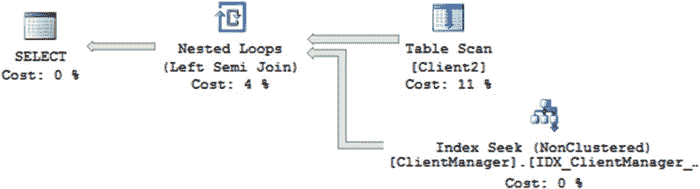

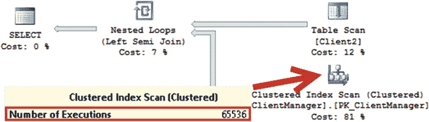

## 图 5-17. 带有查找表的执行计划

行级安全对性能的影响取决于策略函数的复杂程度，该函数将应用于结果集中的每一行。您应尽可能简化策略函数，并在可能时限制数据访问。当需要访问数据时，必须确保其已优化。例如，通过`CREATE INDEX IDX_ClientManager_ManagerName ON Client.ClientManager(ManagerName) INCLUDE(IsRegionalManager)`添加索引，可以消除聚簇索引扫描，并得到如图 5-18 所示的执行计划。

## 图 5-18. 创建索引后带有查找表的执行计划

在某些情况下，当安全模型相对静态时，您可以考虑在登录阶段填充信息，并将其存储在会话上下文中。策略函数可以使用`session_context()`函数从那里获取信息，而无需执行数据访问。您将在第 9 章看到如何使用会话上下文的示例。

其他有助于消除数据访问的有用函数包括：`user_name()`、`suser_name()`、`suser_sname()`、`original_login()`、`is_member('domain\group')`、`is_rolemember('rolename', original_login())`、`is_srvrolemember('serverrolename', original_login())`、`app_name()`、`program_name()`、`platform()`、`session_user()`、`sessionproperty()`、`database_principal_id()` 和 `@@SPID`。

## 阻塞修改

行级安全可用于防止用户在行级别修改数据。在这种情况下，安全策略应包含`BLOCK`谓词，以替代或补充`FILTER`谓词。这些谓词协同工作——被`FILTER`谓词筛选掉的行对用户不可见，因此，无论是否指定`BLOCK`谓词，都无法更新或删除这些行。然而，`FILTER`谓词无法阻止用户插入违反谓词条件的数据，此时需要使用`BLOCK`谓词来避免这种情况。

您可以为`BEFORE INSERT`、`AFTER INSERT`、`BEFORE UPDATE`、`AFTER UPDATE`指定`BLOCK`谓词。


并且用于 DELETE 操作之前。BEFORE 谓词在你想要阻止对某些行进行数据修改时非常有用。AFTER 谓词则有助于在值违反谓词时阻止操作。

`Listing 5-16` 展示了这样一个例子。BEFORE UPDATE 谓词阻止非区域经理更新 VIP 客户（`IsVIP=1`）。AFTER UPDATE 谓词则禁止非区域经理将 `CreditLimit` 值设置为高于 `100,000`。该脚本还授予了对表的 `UPDATE` 权限，并同时拒绝了两个用户更新 `ClientManagerId` 值的权利。

### 清单 5-16. 行级安全性：阻止谓词

```sql
/* 检查用户是否为区域经理 */
create function Client.fn_CurrentUserIsRegionalManager()
returns table
with schemabinding
as
return
(
    select 1 as Result
    from Client.ClientManager
    where ManagerName = user_name() and IsRegionalManager = 1
)
go

create function Client.fn_checkCanUpdateVIP(@IsVIP bit)
returns table
with schemabinding
as
return
(
    select 1 as CanUpdateClient
    where
        case
            when @IsVip = 0 then 1
            else (select Result from Client.fn_CurrentUserIsRegionalManager())
        end = 1
)
go

create function Client.fn_checkCanUpdateCreditLimit(@CreditLimit money)
returns table
with schemabinding
as
return
(
    select 1 as CanUpdateClient
    where
        case
            when @CreditLimit <= 100000 then 1
            else (select Result from Client.fn_CurrentUserIsRegionalManager())
        end = 1
)
go
```

### 第 5 章 ■ SQL SERVER 2016 功能

```sql
alter security policy LimitMgrFilter2
    add block predicate Client.fn_checkCanUpdateVIP(IsVip)
        on Client.Client2 before update,
    add block predicate Client.fn_checkCanUpdateCreditLimit(CreditLimit) on Client.Client2 after update;

grant update on Client.Client2 to ClientManager1, RegionalManager;
deny update Client.Client2(ClientManager) to ClientManager1, RegionalManager;
```

你可能已经注意到，`Listing 5-15` 中的谓词并未为非区域管理员用户验证客户所有权。该验证由 `FILTER` 谓词完成，它将使这些行不可见，从而将其排除在更新操作之外。

最后，关于 `BEFORE UPDATE` 和 `AFTER UPDATE` `BLOCK` 谓词，还有一件重要的事情需要记住。SQL Server 不会对它们进行求值，除非你更新了用作策略函数参数的列。例如，`Listing 5-15` 中的实现不会阻止非区域管理员用户更新 VIP 客户的 `ClientName`。你可以选择向函数添加额外参数，如 `Listing 5-17` 所示，或者依赖触发器来解决这个问题。

### 清单 5-17. 行级安全性：向阻止谓词添加额外列（部分）

```sql
create function Client.fn_checkCanUpdateVIP(@IsVIP bit, @ClientName nvarchar(64))
returns table
with schemabinding
as
return
(
    select 1 as CanUpdateClient
    where
        case
            when @IsVip = 0 then 1
            else (select Result from Client.fn_CurrentUserIsRegionalManager())
        end = 1
)
go

alter security policy LimitMgrFilter2
    add block predicate Client.fn_checkCanUpdateVIP(IsVip,ClientName) on Client.Client2 before update,
```

**注意** 你可以在 [`msdn.microsoft.com/en-us/library/dn765131.aspx`](https://msdn.microsoft.com/en-us/library/dn765131.aspx) 阅读更多关于行级安全性的内容。

#### 始终加密

`始终加密` 是 SQL Server 2016 企业版的新功能，允许你在系统中按列加密 *静态数据* 和 *传输中数据*。与其他类似技术相比，`始终加密` 有两个关键区别。

首先，它几乎对客户端应用程序透明地执行数据的加密和解密，并且传输中数据加密不依赖于传输安全性（如 SSL 或 TLS）。其次，也是更重要的，它允许你在管理安全性的安全管理员和...


# 第 5 章 ■ SQL SERVER 2016 特性

## 始终加密概述

始终加密使用两种类型的密钥来保护数据。列加密密钥（`CEK`）加密数据库中的数据。列主密钥（`CMK`）加密列加密密钥。加密后的 `CEK` 存储在数据库中，而 `CMK` 存储在受信任的密钥存储区中，例如 Windows 证书存储、Azure 密钥保管库或硬件安全模块。必要时，也可以实现自定义密钥存储区。

数据库中的数据始终使用 `AEAD_AES_256_CBC_HMAC_SHA_256` 算法加密存储，SQL Server 永远不会解密它。所有解密操作都由客户端应用程序完成，它需要使用支持始终加密的客户端驱动程序。截至 2016 年 8 月，Microsoft .Net 4.6、Microsoft JDBC 6.0 和 Windows ODBC 13.1 SQL Server 驱动程序支持始终加密。此列表未来可能会有变化。

应用程序需要在连接字符串中使用 `Column Encryption Setting` 属性来指明它能够处理始终加密。当 SQL Server 向此类应用程序发送加密数据时，会将一个加密的 `CEK` 以及 `CMK` 的位置附加到结果集。客户端驱动程序与密钥存储区通信，获取 `CMK`，用于解密 `CEK` 和列数据。

类似的处理过程也发生在参数化查询中。驱动程序与 SQL Server 协作，确定哪些参数需要加密。它从 SQL Server 获取 `CEK` 和 `CMK` 的位置，从密钥存储区获取 `CMK`，然后在将查询发送到 SQL Server 之前加密参数值。所有加密和解密操作对客户端应用程序都是透明的，并且数据从未以未加密形式通过网络传输。还值得注意的是，驱动程序使用本地缓存来存储已解密的列加密密钥，以减少对密钥存储区的往返调用次数。

图 5-19 展示了始终加密的组件。

**图 5-19. 始终加密工作流程**

与服务器通信会增加额外的往返调用和网络流量。图 5-20 显示了当对具有加密 `ClientName` 列的表运行查询时，客户端应用程序执行的调用。如你所见，驱动程序调用了 `sp_describe_parameter_encryption` 存储过程，该过程提供了有关加密列的信息。

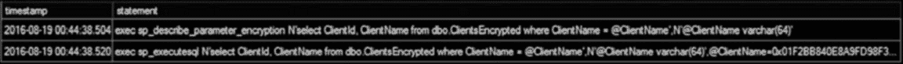

**图 5-20. 启用始终加密时的客户端/SQL Server 通信**

始终加密支持两种不同类型的加密。*确定性加密* 对于任何给定的未加密值始终生成相同的加密值，这允许你在加密列上创建索引并将其用于点查找搜索、等值连接和分组。然而，确定性加密通过允许未经授权的用户检查加密数据中的模式并猜测其值，增加了安全风险。如果可能的加密值数量相对较少，确定性加密不是最佳选择。

第二种加密类型，*随机化加密*，在每次加密时生成随机值。它比确定性加密更安全；但是，它阻止了在加密列上进行搜索、分组和连接。

与始终加密相关的还有一些其他限制。最值得注意的是：
*   以下数据类型无法加密：`xml`、`timestamp/rowversion`、`image`、`(n)text`、`sql_variant`、`hierarchyid`、`geography`、`geometry` 和用户定义类型。
*   文本列（`(n)char` 和 `(n)varchar`）必须具有二进制 `BIN2` 排序规则才能被加密。
*   加密列不能有 `DEFAULT` 或 `CHECK` 约束。


# SQL Server 2016 功能特性

使用随机化加密的列无法被索引、定义为 `UNIQUE`，或参与 `PRIMARY KEY` 或 `FOREIGN KEY` 约束。

`注意` 您可以在以下网址查看完整的限制列表：[`https://msdn.microsoft.com/en-us/library/mt163865.aspx`](https://msdn.microsoft.com/en-us/library/mt163865.aspx)

正如您可能猜到的那样，加密值需要额外的存储空间。存储开销相当显著，特别是对于较小的数据类型。所有在明文状态下存储空间小于 16 字节的数据类型，在加密后将使用 65 字节。对于使用 16 字节或更多字节的数据，存储空间可根据以下公式计算：

```
1 + 32 + 16 + (FLOOR(DATALENGTH(plain_text_length)/16) + 1) * 16
```

例如，一个 16 字节的 `uniqueidentifier` 值在加密后将使用 81 字节。显然，如果您决定加密一个宽表，应该记住 `IN_ROW` 数据的 8,060 字节行大小限制。

## 可编程性

正如我已经提到的，"始终加密"功能对应用程序几乎是*透明的*。所有的加密和解密操作都由驱动程序完成，您只需在连接字符串中设置 `Column Encryption Setting=enabled` 属性来启用始终加密。

然而，有一个陷阱。一旦数据被加密，SQL Server 就无法将其解密以执行任何需要解密数据的操作。以包含加密 `Salary` 列的 `dbo.Employees` 表为例。SQL Server 将无法执行 `SELECT * FROM dbo.Employees WHERE Salary >= @Salary` 语句，因为它无法解密 `Salary` 列的数据来评估谓词。同样，SQL Server 无法使用 `LIKE` 运算符执行子字符串搜索，也无法使用 `LEN` 函数计算加密字符串列的长度。所有这些查询都将失败，您需要更改客户端应用程序，并在数据解密后在那里实现所有逻辑。在许多情况下，这还将要求客户端应用程序通过网络传输更多数据。

使用随机化加密的列不能用于任何谓词、连接条件或分组。随机化加密对相同的输入生成不同的值，因此，SQL Server 无法在不解密的情况下比较数据。另一方面，确定性加密保证相同输入产生相同的加密值，SQL Server 可以对加密数据执行相等性比较，这允许您在点查找搜索、相等连接和分组中引用使用确定性加密的列。您还可以对使用确定性加密的列创建索引来优化这些用例。

相等性比较是确定性加密唯一支持的操作。例如，带有 `Salary = @Salary` 谓词的查询在确定性加密下可以工作，而 `Salary >= @Salary` 谓词无论使用何种加密类型都会导致查询失败。

始终加密不支持临时非参数化查询，并且要求在插入数据或更新加密列时使用参数。对于使用确定性加密的列进行相等性搜索谓词时，也应使用参数。尽管这些要求看起来像是限制，但消除临时工作负载可以减少执行计划的缓存内存消耗，并可能提高系统性能。尽管如此，这可能需要在客户端应用程序中进行代码更改。

## 安全注意事项与密钥管理

始终为工作选择正确的工具非常重要，而"始终加密"与其他 SQL Server 加密技术相比有一个关键区别。它是唯一允许您实现`职责分离`安全概念的技术，将业务中的安全管理员和数据库管理员的角色分开。当不需要这种分离时，其他 SQL Server 加密技术可能完全是可行的选择。


服务器技术会是更好的解决方案。例如，使用`透明数据加密`(TDE)和/或`列级加密`配合`SSL/TLS`来保障传输安全，可以更轻松地对静态数据进行加密。

此外，实施职责分离从来不仅限于技术层面。它要求企业定义并采纳正式的策略和流程，技术只是为这些提供支持。例如，实施`始终加密`的先决条件之一就是定义密钥管理流程，该流程概述了安全密钥应如何生成、存储、备份和轮换。

通常，安全管理员应该在独立于`SQL Server`的计算机上生成`CMK`和`CEK`。这将防止托管`始终加密`数据的计算机的恶意管理员访问磁盘或计算机内存中的密钥。在密钥生成后备份这些密钥，并将备份存储在安全的物理位置也至关重要。

密钥轮换是安全的另一个重要因素。`始终加密`允许你轮换`CMK`和`CEK`，既可以通过`SSMS`，也可以使用`T-SQL`来完成。轮换`CMK`意味着用旧密钥解密所有`CEK`，然后用新密钥重新加密它们。这是一个非常快的操作。另一方面，轮换`CEK`则需要你解密并加密所有表数据，这对于大表来说可能非常耗时。

最后，重要的是要记住，在使用`始终加密`时，数据是在驱动程序级别解密，并以明文形式存储在内存中。一些安全标准和法规要求应用程序即使在内存中也要保持某些数据的加密状态。例如，`支付卡行业`(PCI)标准要求你始终加密所有信用卡号。在这种情况下，你应该将`始终加密`与其他技术结合使用。

**注意** 你可以在 [`msdn.microsoft.com/en-us/library/mt163865.aspx`](https://msdn.microsoft.com/en-us/library/mt163865.aspx) 阅读更多关于`始终加密`以及如何配置和使用它的信息。

## 第 5 章 ■ SQL SERVER 2016 功能

#### 动态数据屏蔽

动态数据屏蔽允许你通过对结果集中的敏感列内容进行屏蔽来隐藏它。你可以混淆整个列数据或仅部分值；例如，允许用户查看信用卡号或社会安全号码的最后四位数字。

动态数据屏蔽在列级别工作，并由`UNMASK`权限控制。拥有此权限的用户将在结果集中看到未屏蔽的数据，而没有该权限的用户将看到混淆后的数据。例如，你可以将`CreditCardNumber`列上的`UNMASK`权限授予`Accounting`组，该组将看到未屏蔽的值。而`Call Center`组则不应拥有此权限，并将看到被屏蔽的值。

屏蔽规则由`屏蔽函数`控制。`SQL Server 2016 RTM`支持四种屏蔽函数，如下所述。值得注意的是，`NULL`值将始终显示为`NULL`。

-   `default()`返回数据类型的默认值。例如，该函数对数值数据类型使用`0`，对日期时间信息使用`1900-01-01`。对于文本数据，它用`XXXX`字符替换文本。
-   `email()`通过显示电子邮件的第一个实际字母，并用`xxx@XXXX.com`替换其余部分，来屏蔽电子邮件地址的值。例如，一个`tg@grohser.at`电子邮件地址将被替换为`txxx@XXXX.com`值。
-   `random()`仅适用于数字数据类型(`int`、`float`、`money`等)，并用作为函数参数指定的区间内的随机值替换数据。
-   `partial()`是最灵活的函数，允许你定义用于屏蔽的自定义字符串。它接受三个参数，如`prefix`、`padding`和`suffix`。前缀和后缀是定义数量的整数值。


文本开头和结尾的字符由原始值填充。可选的填充值控制着屏蔽模式。

清单 5-18 展示了动态数据屏蔽的实际操作。代码创建了一个表，其中多个列使用不同的屏蔽函数进行屏蔽。然后，在有和没有 `UNMASK` 权限的用户上下文中执行了两次 `SELECT` 查询。

**清单 5-18.** 动态数据屏蔽实战

```sql
create table dbo.Consultants
(
    ID int not null,
    FirstName varchar(32)
        masked with (function='partial(1,"XXXXXXXX",0)') not null,
    LastName varchar(32) not null,
    DateOfBirth date
        masked with (function='default()') not null,
    SSN char(12)
        masked with (function='partial(0,"XXX-XXX-",4)') not null,
    EMail nvarchar(255)
        masked with (function='email()') not null,
    SpendingLimit money
        masked with (function='random(500,1000)') not null
);

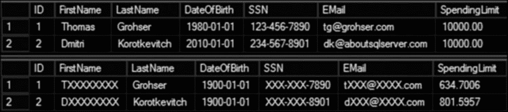

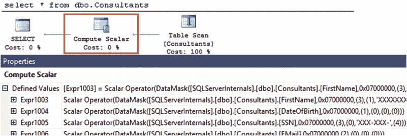

第 5 章 ■ SQL SERVER 2016 功能

insert into dbo.Consultants(ID,FirstName,LastName,DateOfBirth,SSN,Email,SpendingLimit)
values
    (1,'Thomas','Grohser','1/1/1980','123-456-7890','tg@grohser.com',10000)
    ,(2,'Dmitri','Korotkevitch','1/1/2010','234-567-8901','dk@aboutsqlserver.com',10000);

create user NonPrivUser without login;
grant select on dbo.Consultants to NonPrivUser;
go

-- 以可以 UNMASK 数据的 db_owner 身份运行
select * from dbo.Consultants;

-- 以没有 UNMASK 权限的非特权用户身份运行
execute as user = 'NonPrivUser';
select * from dbo.Consultants
revert;
```

图 5-21 展示了 两个查询的输出。结果集分别代表未屏蔽和已屏蔽的数据。

**图 5-21.** 动态数据屏蔽实战

### 性能与安全考虑

当数据需要被混淆时，`SQL Server` 会在数据访问运算符之后应用屏蔽，通常使用 `compute scalar`。图 5-22 展示了 清单 5-16 中 `SELECT` 查询的执行计划。

**图 5-22.** 使用动态数据屏蔽的查询的执行计划


第 5 章 ■ SQL SERVER 2016 功能

正如您可能猜到的，这种实现带来的性能影响相对较小；然而，它会导致安全问题。谓词是针对未屏蔽的数据进行评估的，一个能够对该表执行查询的恶意人员可以通过执行暴力攻击来获取这些值。

清单 5-19 展示了攻击者如何猜测 `dbo.Consultants` 表中 `SpendingLimit` 列的值。`SQL Server` 基于未屏蔽的值执行连接，这使得攻击者能够捕获它们。图 5-23 展示了 攻击的输出。

**清单 5-19.** 对屏蔽数据的暴力攻击

```sql
execute as user = 'NonPrivUser';

;with N1(C) as (select 0 union all select 0) -- 2 rows
,N2(C) as (select 0 from N1 as T1 cross join N1 as T2) -- 4 rows
,N3(C) as (select 0 from N2 as T1 cross join N2 as T2) -- 16 rows
,N4(C) as (select 0 from N3 as T1 cross join N3 as T2) -- 256 rows
,N5(C) as (select 0 from N4 as T1 cross join N4 as T2) -- 65,536 rows
,PossibleValues(SpendingLimit)
    as (select row_number() over (order by (select null)) from N5)
select c.ID, p.SpendingLimit, c.SpendingLimit as MaskedLimit
from dbo.Consultants c join PossibleValues p on
    c.SpendingLimit >= p.SpendingLimit - 1 and
    c.SpendingLimit < p.SpendingLimit;

revert;
```

**图 5-23.** 攻击结果

不幸的是，对于任何可以转换为文本的数据类型，都可以采取类似的方法。这种攻击可以逐个字符地实施，如清单 5-20 所示。代码将屏蔽列中的数据拆分为单个字符，并将它们与一个代表所有可能的 ASCII


# 第 5 章：SQL Server 2016 功能

清单 5-20 中的查询显示了`DateOfBirth`列和`Email`列的前 24 个字符；然而，它可以很容易地调整以处理更长的字符串。图 5-24 展示了该查询的结果。

## 清单 5-20. 基于字符的暴力攻击

```sql
execute as user = 'NonPrivUser';

;with N(n)
as
(
    select n
    from (values (0),(1),(2),(3),(4),(5),(6),(7),(8),(9),(10),(11),(12),(13),(14),(15)) n(n)
)
,C(c)
as
(
    select char(n1.n * 16 + n2.n) from n as n1 cross join n as n2
)

select
    d.id,
    bd1.c+bd2.c+bd3.c+bd4.c+'/'+bd5.c+bd6.c+'/'+bd7.c+bd8.c as DateOfBirth,
    email1.c+email2.c+email3.c+email4.c+email5.c+email6.c+
    isnull(email7.c,'')+isnull(email8.c, '')+isnull(email9.c, '')+
    isnull(email10.c, '')+isnull(email11.c, '')+isnull(email12.c, '')+
    isnull(email13.c, '')+isnull(email14.c, '')+isnull(email15.c, '')+
    isnull(email16.c, '')+isnull(email17.c, '')+isnull(email18.c, '')+
    isnull(email19.c, '')+isnull(email20.c, '')+isnull(email21.c, '')+
    isnull(email22.c, '')+isnull(email23.c, '')+isnull(email24.c, '') as Email
from dbo.Consultants d
left join c bd1 on ascii(substring(cast(d.DateOfBirth as varchar),1,1))=ascii(bd1.c)
left join c bd2 on ascii(substring(cast(d.DateOfBirth as varchar),2,1))=ascii(bd2.c)
left join c bd3 on ascii(substring(cast(d.DateOfBirth as varchar),3,1))=ascii(bd3.c)
left join c bd4 on ascii(substring(cast(d.DateOfBirth as varchar),4,1))=ascii(bd4.c)
left join c bd5 on ascii(substring(cast(d.DateOfBirth as varchar),6,1))=ascii(bd5.c)
left join c bd6 on ascii(substring(cast(d.DateOfBirth as varchar),7,1))=ascii(bd6.c)
left join c bd7 on ascii(substring(cast(d.DateOfBirth as varchar),9,1))=ascii(bd7.c)
left join c bd8 on ascii(substring(cast(d.DateOfBirth as varchar),10,1))=ascii(bd8.c)
left join c email1 on ascii(substring(d.EMail, 1, 1)) = ascii(email1.c)
left join c email2 on ascii(substring(d.EMail, 2, 1)) = ascii(email2.c)
left join c email3 on ascii(substring(d.EMail, 3, 1)) = ascii(email3.c)
left join c email4 on ascii(substring(d.EMail, 4, 1)) = ascii(email4.c)
left join c email5 on ascii(substring(d.EMail, 5, 1)) = ascii(email5.c)
left join c email6 on ascii(substring(d.EMail, 6, 1)) = ascii(email6.c)
left join c email7 on ascii(substring(d.EMail, 7, 1)) = ascii(email7.c)
left join c email8 on ascii(substring(d.EMail, 8, 1)) = ascii(email8.c)
left join c email9 on ascii(substring(d.EMail, 9, 1)) = ascii(email9.c)
left join c email10 on ascii(substring(d.EMail, 10, 1)) = ascii(email10.c)
left join c email11 on ascii(substring(d.EMail, 11, 1)) = ascii(email11.c)
left join c email12 on ascii(substring(d.EMail, 12, 1)) = ascii(email12.c)
left join c email13 on ascii(substring(d.EMail, 13, 1)) = ascii(email13.c)
left join c email14 on ascii(substring(d.EMail, 14, 1)) = ascii(email14.c)
left join c email15 on ascii(substring(d.EMail, 15, 1)) = ascii(email15.c)
left join c email16 on ascii(substring(d.EMail, 16, 1)) = ascii(email16.c)
left join c email17 on ascii(substring(d.EMail, 17, 1)) = ascii(email17.c)
left join c email18 on ascii(substring(d.EMail, 18, 1)) = ascii(email18.c)
left join c email19 on ascii(substring(d.EMail, 19, 1)) = ascii(email19.c)
left join c email20 on ascii(substring(d.EMail, 20, 1)) = ascii(email20.c)
left join c email21 on ascii(substring(d.EMail, 21, 1)) = ascii(email21.c)
left join c email22 on ascii(substring(d.EMail, 22, 1)) = ascii(email22.c)
left join c email23 on ascii(substring(d.EMail, 23, 1)) = ascii(email23.c)
left join c email24 on ascii(substring(d.EMail, 24, 1)) = ascii(email24.c)
revert;
```

## 图 5-24. 攻击结果


您可以通过拒绝用户对包含动态数据屏蔽的表的`SELECT`权限，并使用存储过程来访问数据，从而减轻此风险。然而，这种方法将需要在客户端应用程序中进行代码更改。

## 组合安全特性

SQL Server 2016 的新安全特性可以帮助您应对一些安全挑战...


您的系统。然而，它们应该与其他`经典`安全技术结合使用。您应遵循`最小权限`原则，将它们与其他 SQL Server 安全功能相结合，并在列、对象、数据库和服务器级别为用户授予`最小必需`的权限。

这对于`行级安全`和`动态数据屏蔽`尤为重要。这些功能应被视为`应用安全`特性。它们有助于实施应用安全；但是，它们并不保护数据库中的数据。只要恶意用户有能力对表执行即席查询，就有可能绕过这些保护。

您也可以组合使用这些功能。例如，可以将`行级安全`与`始终加密`和/或`动态数据屏蔽`结合使用。显然，您不能在同一列上同时结合使用`始终加密`和`动态数据屏蔽`，如果需要屏蔽，则必须在应用程序中手动实现。

最后，这三项新的安全功能都能与`透明数据库加密 (TDE)`和`备份加密`良好协作。当安全是关注点时，将`TDE`和`备份加密`与`始终加密`一起使用是有益的。这将允许您保护数据库中的所有数据，而不是像`始终加密`那样按列加密数据。

#### 总结

`系统版本控制时态表`维护表中数据更改的历史记录。它们由两张表组成：包含当前数据的`当前表`，以及存储行先前版本的`历史表`。每当当前表中的行被更新或删除时，该行的先前版本就会被复制到历史表。您可以使用`SELECT`查询中的`FOR SYSTEM_TIME`子句访问特定时间点的快照。

当前表和历史表都应有两个`datetime2`周期列，用于指示行的生命周期。当您使用`FOR SYSTEM_TIME`子句时，SQL Server 会在周期列上添加谓词，您在设计系统索引时需要考虑到这一点。

`Stretch 数据库`允许您将部分数据库数据透明地存储在 Microsoft Azure 的 SQL 数据库中，对客户端应用程序透明。您可以通过指定筛选函数来迁移整个表或部分表数据。`Stretch 数据库`的工作方式与`链接服务器`类似，具有相似的连接要求和性能影响。

SQL Server 2016 附带了三个新的安全功能。`行级安全`允许您基于单个用户控制数据的可见性。此解决方案有助于提高多租户环境中的安全性。`动态数据屏蔽`允许您在结果集中屏蔽特定列中的值。最后，`始终加密`使您能够通过实施职责分离的安全概念来加密特定列中的数据，从而防止数据库管理员访问敏感数据。

在加固系统安全性时，您应将新的安全功能与经典的 SQL Server 安全功能（如列和对象权限、`TDE`等）结合使用。

# 第六章：索引碎片

索引碎片可能是少数几个不完全属于“视情况而定”类别的主题之一。大多数数据库专业人员都同意碎片会对系统产生负面影响。虽然这是正确的，但理解索引碎片的缺点并分析您的系统如何受其影响仍然很重要。

在本章中，我们将讨论 SQL Server 中的内部和外部索引碎片，哪些代码和设计模式会增加碎片，以及在设计索引维护策略时必须考虑哪些因素。

#### 碎片类型

如您所知，SQL Server 将数据存储在数据页上，这些数据页按每对象分配单元组合成八页的区。对于索引的行内页，每个数据页都有指向上一个和


# 第六章：索引碎片

SQL Server 既不会直接从磁盘读取数据，也不会直接修改磁盘上的数据。数据页需要加载到内存中才能被访问。每次 SQL Server 访问内存中的数据页时，都会发出一次逻辑读取操作。当数据页不在内存中时，SQL Server 会执行物理读取，这将导致物理磁盘访问。

### 注意
通过使用 `set statistics io on` 命令启用 I/O 统计信息，您可以查看查询在每个表上执行的 I/O 操作数量。过多的逻辑读取通常表明由于缺少索引和/或因基数估算不准确而选择了次优的连接策略，导致了执行计划不佳。但是，在优化过程中，您不应仅将此数字作为唯一标准，还应考虑其他因素，例如资源使用率、并行度以及执行计划中的相关运算符。

逻辑读取和物理读取都会影响查询的性能。尽管逻辑读取速度很快，但并非瞬时完成。SQL Server 在访问内存中的数据页时会消耗 CPU 周期，而物理 I/O 操作则速度缓慢。即使使用快速磁盘子系统，大量的物理读取也会迅速累积延迟。

© Dmitri Korotkevitch 2016
D. Korotkevitch, *Pro SQL Server Internals*, DOI 10.1007/978-1-4842-1964-5_6

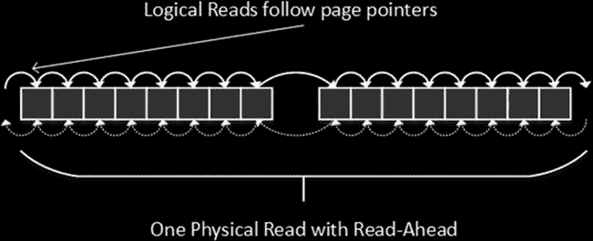

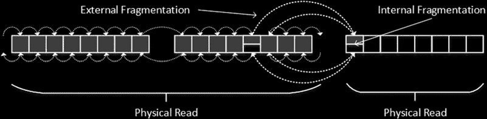

## 第六章：索引碎片

SQL Server 用来减少物理读取数量的一种优化技术称为 `read-ahead`。使用此技术，SQL Server 根据中间索引级别信息确定叶级页是否在磁盘上连续存放，并从数据文件中作为单个读取操作读取多个页面。这增加了后续读取请求引用已缓存在内存中的数据页的机会，并最小化了所需的物理读取数量。

图 6-1 说明了这种情况，显示了两个相邻的区，其中所有数据页都完全填充了数据。

### 图 6-1：逻辑读取与物理读取

让我们看看当您向索引中插入新行时会发生什么。您会记得，聚集索引和非聚集索引中的数据都是基于索引键的值排序的，SQL Server 知道该行必须插入到哪个数据页中。如果数据页有足够的可用空间来容纳新行，那么 SQL Server 只需将新行插入其中。但是，如果数据页没有足够的可用空间，则会发生以下情况：

1.  分配一个新的数据页，如果需要，还会分配一个新的区。
2.  将旧数据页中的一些数据移动到新分配的页中。
3.  更新前一页和后一页的指针，以维护索引中的逻辑排序顺序。

此过程称为 `page split`。图 6-2 说明了发生这种情况时的数据布局。值得一提的是，当您更新现有行从而增加其大小，并且数据页没有足够空间来容纳该行的新版本时，也可能发生页拆分。

### 图 6-2：页拆分与碎片

此时，您有了两种索引碎片：内部碎片和外部碎片。`External fragmentation` 意味着页面的逻辑顺序与其物理顺序不匹配，和/或逻辑上连续的页面不位于相同或相邻的区中。这种碎片迫使 SQL Server 在从磁盘读取数据时跳跃式进行，这使得预读效率降低，并增加了所需的物理读取数量。此外，它增加了随机磁盘 I/O，与顺序 I/O 相比，随机 I/O 效率要低得多，尤其是在磁性硬盘驱动器的情况下。

另一方面，`Internal fragmentation` 意味着索引中的数据页存在过多的


# 第 6 章 ■ 索引碎片

## 索引内部碎片的影响

索引的内部碎片会导致数据页的可用空间减少。因此，索引在存储数据时会使用更多的数据页，这增加了查询执行期间的逻辑读取次数。此外，SQL Server 会在缓冲池中使用更多内存来缓存索引页。

少量的内部碎片并不一定是坏事。当数据从索引的不同部分插入或更新时，它能减少插入和更新操作期间的页拆分。然而，大量的内部碎片会浪费索引空间并降低系统性能。此外，对于键值始终递增的索引（例如，在标识符列上），内部碎片是不希望出现的，因为数据总是在索引的末尾插入。

## 分析碎片的数据管理函数

有一个数据管理函数 `sys.dm_db_index_physical_stats`，可用于分析系统中的碎片情况。结果集中最重要的三个列如下：

`avg_page_space_used_in_percent` 显示页面上平均使用的数据存储空间百分比。此值向您展示了内部索引碎片的程度。

`avg_fragmentation_in_percent` 提供有关外部索引碎片的信息。对于具有聚集索引的表，它表示无序页的百分比，即索引中下一个物理分配的页与当前页的下一页指针所引用的页不同。对于堆表，它表示无序区的百分比，即区在数据文件中不是连续存放的。

`fragment_count` 表示索引有多少个连续的数据片段。每个片段由彼此相邻的区组成。相邻的数据增加了 SQL Server 在访问数据时使用顺序 I/O 和预读的可能性。

## 分析模式

`Sys.dm_db_index_physical_stats` 可以在三种不同的模式下分析数据：`LIMITED`、`SAMPLED` 和 `DETAILED`，您需要将这些模式指定为函数的参数。

- 在 `LIMITED` 模式下，SQL Server 使用非叶索引页来分析数据。这是最快的模式，尽管它不提供关于内部碎片的信息。
- 在 `DETAILED` 模式下，SQL Server 会扫描整个索引。您可以猜到，这种模式提供了最准确的结果，但也是 I/O 密集度最高的方法。
- 在 `SAMPLED` 模式下，当表具有 10,000 个或更多数据页时，SQL Server 会基于表的百分之一的数据样本来返回统计信息。它在执行期间从叶级别读取每第一百个页。对于数据页少于 10,000 个的表，SQL Server 会改用 `DETAILED` 模式扫描整个索引。

> **注意**：请查看 [Books Online 文章](http://technet.microsoft.com/en-us/library/ms188917.aspx) 以获取有关 `sys.dm_db_index_physical_stats` 的更多详细信息。

## 页拆分示例

页拆分不仅限于单页分配和数据移动。让我们看一个例子，创建一个表并用一些数据填充它，如清单 6-1 所示。

**清单 6-1.** 多次页拆分：表创建

```sql
create table dbo.PageSplitDemo
(
    ID int not null,
    Data varchar(8000) null
);

create unique clustered index IDX_PageSplitDemo_ID
on dbo.PageSplitDemo(ID);

;with N1(C) as (select 0 union all select 0) -- 2 rows
,N2(C) as (select 0 from N1 as T1 cross join N1 as T2) -- 4 rows
,N3(C) as (select 0 from N2 as T1 cross join N2 as T2) -- 16 rows
,N4(C) as (select 0 from N3 as T1 cross join N3 as T2) -- 256 rows
,N5(C) as (select 0 from N4 as T1 cross join N2 as T2) -- 1,024 rows
,IDs(ID) as (select row_number() over (order by (select NULL)) from N5)
insert into dbo.PageSplitDemo(ID)
select ID * 2 from Ids where ID <= 620

select page_count, avg_page_space_used_in_percent
from sys.dm_db_index_physical_stats(db_id(),object_id(N'dbo.PageSplitDemo'),1,null
,'DETAILED');
```


以下是代码清单 5-1 的输出结果。如你所见，只有一个数据页，并且它几乎已满。
```
page_count avg_page_space_used_in_percent
---------------- ---------------------------------------------
1 99.5552260934025
```
接下来，让我们使用代码清单 6-2 中的代码向表中插入一个大型行。

*Listing 6-2.* 多页拆分：向表中插入一个大型行
```
insert into dbo.PageSplitDemo(ID,Data) values(101,replicate('a',8000));

select page_count, avg_page_space_used_in_percent
from sys.dm_db_index_physical_stats(db_id(),object_id(N'dbo.PageSplitDemo'),1,null,'DETAILED');
```
如果你使用 SQL Server 2012 之前的版本运行代码清单 6-2，输出结果如下。如你所见，SQL Server 必须分配七个新的叶级数据页来容纳新的数据行，并保持索引中的逻辑排序顺序。

该过程以如下方式进行。SQL Server 将 `ID<=100` 的 50 行保留在原始页面上，试图将新行 (`ID=101`) 和剩余行 (`ID>=102`) 放入新分配的数据页中。它们无法放入单个页面，于是 SQL Server 继续分配页面，每次将行拆分到一半，直到最终能够容纳。

值得一提的是，SQL Server 还必须在索引中创建根级别。
```
page_count avg_page_space_used_in_percent
---------------- ---------------------------------------------
8 24.8038670620213
1 1.26019273535953
```
幸运的是，页面拆分算法在 SQL Server 2012 中得到了显著改进。如果你使用 SQL Server 2012 或更高版本运行代码清单 6-2，输出结果如下。当 SQL Server 检测到数据无法放入新分配的页面时，它会分配另一个（第三个）页面，将新行 (`ID=101`) 放入其中一个页面，将所有剩余行 (`ID >= 102`) 放入另一个页面。因此，在 SQL Server 2012-2016 中，页面拆分最多引入两个新的页面分配。
```
page_count avg_page_space_used_in_percent
---------------- ---------------------------------------------
3 99.5552260934025
1 0.457128737336299
```

### `FILLFACTOR` 和 `PAD_INDEX`
SQL Server 中的每个索引都有一个 `FILLFACTOR` 选项，允许你在叶级索引数据页上预留一些空间。将 `FILLFACTOR` 设置为小于 100 的值（默认值为 100）会增加数据页有足够空闲空间来容纳新插入或更新的数据行而无需进行页面拆分的机会。此选项可以在服务器级别和单个索引级别设置。如果索引没有显式指定 `FILLFACTOR`，则 SQL Server 会使用服务器级别的 `FILLFACTOR`。

SQL Server 仅在创建或重建索引时维护 `FILLFACTOR`。在正常工作负载期间，它仍然会将页面填充至 100%，并在需要时拆分页面。

另一个需要牢记的重要因素是，通过降低 `FILLFACTOR`，你通过增加内部索引碎片来减少外部索引碎片和页面拆分次数。索引将拥有更多的数据页，这将对扫描操作的性能产生负面影响。此外，SQL Server 将在缓冲池中使用更多内存来容纳增加的索引页数量。

`FILLFACTOR` 没有推荐的设置。你需要通过逐渐减小其值并使用 `sys.dm_db_index_physical_stats` 函数监控其对碎片的影响来进行微调。你可以从 `FILLFACTOR = 100` 开始，通过使用新的 `FILLFACTOR` 重建索引，以 5% 的增量递减，直到找到内部和外部碎片程度都最低的最佳值。显然，你需要在生产工作负载下进行此分析，并允许在两次测量之间让碎片逐渐积累。

在 SQL Server 2012 或更高版本中，你可以使用扩展事件实时监控页面拆分操作。


# 第 6 章 ■ 索引碎片整理

#### 索引维护

SQL Server 支持两种减少碎片的索引维护方法：索引重新组织和索引重建。

*索引重新组织*（通常称为索引碎片整理）将叶子级数据页按其逻辑顺序重新排列，并试图通过减少内部碎片来压缩页面。这是一项在线操作，可以随时中断而不会丢失中断点之前的进度。你可以使用 `ALTER INDEX REORGANIZE` 命令来重新组织索引。

■ **提示** SQL Server 不会从数据库中释放空的 LOB 数据页。`ALTER INDEX REORGANIZE` 默认会压缩（释放）这些页面。当大量 LOB 数据被删除或 LOB 列被删除后，重新组织索引是有益的。

*索引重建*操作（可使用 `ALTER INDEX REBUILD` 命令完成）通过创建另一个索引来替换旧的、碎片化的索引，从而消除外部碎片。默认情况下，这是一个离线操作，SQL Server 会在操作期间获取并保持架构修改（`Sch-M`）表锁，这会阻止任何其他会话访问该表。我们将在本书第三部分更详细地讨论 SQL Server 并发模型。

SQL Server 企业版可以执行在线索引重建。此操作在底层使用行版本控制，并允许其他会话在索引重建仍在进行时修改数据。

■ **注意** 在线索引重建在执行的最后阶段仍然会获取一个架构修改（`SCH-M`）锁。尽管此锁保持的时间非常短，但在非常活跃的 OLTP 系统中，它可能会增加锁定和阻塞。SQL Server 2014 引入了低优先级锁的概念，这可以在此情况下提供帮助。我们将在第 23 章“架构锁”中详细讨论低优先级锁。

索引重建比重索引重新组织能取得更好的效果，尽管它是一个*全有或全无*的操作；也就是说，如果索引重建被中断，SQL Server 会回滚整个操作。你还应该在数据库中有足够的可用空间来容纳索引重建阶段生成的另一份数据副本。

最后，索引重建会更新统计信息，而索引重新组织则不会。如果对于大表来说自动统计信息更新不是最优方案，你需要在系统的统计信息维护策略中考虑这一行为。

#### 设计索引维护策略

Microsoft 建议当外部索引碎片（`sys.dm_dm_index_physical_stats` 中的 `avg_fragmentation_in_percent` 值）超过 30% 时执行索引重建，当碎片在 5% 到 30% 之间时执行索引重新组织。虽然这可以作为一般性建议，但在设计索引维护策略时，分析系统受碎片影响的程度非常重要。

索引碎片在索引扫描期间（即 SQL Server 需要从磁盘读取大量数据时）危害最大。经过高度优化的 OLTP 系统（主要使用小型范围扫描和点查找）通常受碎片的影响较小。如果查询


# 第六章 ■ 索引碎片

只需要遍历索引树并读取少数几个数据页。此外，当数据已经缓存在缓冲池中时，外部碎片几乎无关紧要。

## 数据库文件放置

数据库文件放置是另一个需要考虑的因素。减少外部碎片的原因之一是为了提升顺序 I/O 性能。在机械硬盘的情况下，顺序 I/O 性能通常比随机 I/O 性能高一个数量级。然而，如果多个数据库文件共享同一个磁盘阵列，这就无关紧要了。多个活动数据库同时产生的 I/O 活动会*随机化*磁盘阵列上的所有 I/O 活动，使得外部碎片变得不那么关键。

## 内部碎片

尽管如此，内部碎片仍然是个问题。当数据页有大量未使用空间时，索引会占用更多内存，查询也需要扫描更多的数据页。无论数据页是否被缓存，这都会对系统性能产生负面影响。

## 系统工作负载

另一个重要因素是系统工作负载。索引维护会给 SQL Server 增加负载，最好在活动量较低的时间段进行。请记住，索引维护的开销并不仅限于单个数据库，您需要分析它对位于同一服务器和/或磁盘阵列上的其他数据库的影响。

索引的重建和重组都会产生大量的事务日志活动并生成大量日志记录。这会影响事务日志备份的大小，如果系统使用基于事务日志的高可用性技术，如 `AlwaysOn 可用性组`、`数据库镜像`、`日志传送`和`复制`，还可能产生巨大的网络流量。如果在操作期间发生故障转移到另一个节点，也会影响系统的可用性。

`注意` 我们将在第 32 章“设计高可用性策略”中更详细地讨论高可用性策略。

考虑在全天候运行的繁忙服务器上进行索引维护的开销非常重要。在某些情况下，最好降低索引维护例程的频率，在系统中保留一定程度的碎片。但是，如果开销不是问题，则应始终执行索引维护。例如，对于在非工作时间活动量低的系统，没有理由不在夜间或周末进行索引维护。

## 在线索引操作

所使用的 SQL Server 版本和版本决定了其在线执行索引维护操作的能力。表 6-1 显示了基于 SQL Server 版本和版本可用的选项。它还显示了分区级索引重建选项，这对于分区表非常有益。我们将在第 16 章详细讨论它们。

*表 6-1. 基于 SQL Server 版本和版本的索引维护选项*

| **SQL Server 版本和版本** | **索引重组** | **索引重建（索引包含 LOB 列）** | **索引重建（索引不包含 LOB 列）** | **分区级索引重建** |
| :--- | :--- | :--- | :--- | :--- |
| SQL Server 2005-2016 非企业版 | 在线 | 仅离线 | 仅离线 | 不适用 |
| SQL Server 2005-2008R2 企业版 | 在线 | 仅离线 | 离线或在线 | 仅离线 |
| SQL Server 2012 企业版 | 在线 | 离线或在线 | 离线或在线 | 仅离线 |
| SQL Server 2014-2016 企业版 | 在线 | 离线或在线 | 离线或在线 | 离线或在线 |

`注意` 小心使用 SQL Server 维护计划。它们倾向于对所有索引执行索引维护，即使这并非必要。

`提示` Ola Hallengren 的免费数据库维护脚本是一个很好的解决方案，它基于每个索引分析碎片级别，并且只在需要时执行索引重建/重组。可从 `http://ola.hallengren.com/` 下载。


综上所述，减少碎片化的最佳方式是避免在数据库设计和代码中创建会导致此类情况的模式。

## 增加碎片化的模式

导致碎片化的最常见情况之一是对完全随机的值建立索引，例如使用 `NEWID()` 生成的唯一标识符或使用 `HASHBYTE()` 函数生成的字节序列。这些函数生成的值会随机插入到索引的不同部分，从而导致过多的页面拆分和碎片化。如果可能，你应该避免使用此类索引。

**注意** 我们将在下一章讨论在随机值上建立索引对性能的影响。

另一个导致索引碎片化的常见模式是在更新过程中增加行的大小；例如，当系统收集数据并执行某种后处理，在数据行中填充额外的属性/列时。这会增加行的大小，如果页面没有足够的空间来容纳它，就会触发页面拆分。

举个例子，让我们思考一个存储 GPS 位置信息的表，其中既包含地理坐标，也包含位置的地址。我们假设地址是在位置信息已经插入系统后，在后处理阶段填充的。清单 6-3 展示了创建该表并用一些数据填充它的代码。

### 清单 6-3. 导致碎片化的模式：表创建

```sql
create table dbo.Positions
(
    DeviceId int not null,
    ATime datetime2(0) not null,
    Latitude decimal(9,6) not null,
    Longitude decimal(9,6) not null,
    Address nvarchar(200) null,
    Placeholder char(100) null,
);

;with N1(C) as (select 0 union all select 0) -- 2 rows
,N2(C) as (select 0 from N1 as T1 cross join N1 as T2) -- 4 rows
,N3(C) as (select 0 from N2 as T1 cross join N2 as T2) -- 16 rows
,N4(C) as (select 0 from N3 as T1 cross join N3 as T2) -- 256 rows
,N5(C) as (select 0 from N4 as T1 cross join N4 as T2) -- 65,536 rows
,IDs(ID) as (select row_number() over (order by (select NULL)) from N5)
insert into dbo.Positions(DeviceId, ATime, Latitude, Longitude)
select
    ID % 100 /*DeviceId*/
    ,dateadd(minute, -(ID % 657), getutcdate()) /*ATime*/
    ,0 /*Latitude - just dummy value*/
    ,0 /*Longitude - just dummy value*/
from IDs;

create unique clustered index IDX_Postitions_DeviceId_ATime
on dbo.Positions(DeviceId, ATime);

select index_level, page_count, avg_page_space_used_in_percent, avg_fragmentation_in_percent
from sys.dm_db_index_physical_stats(DB_ID(),OBJECT_ID(N'dbo.Positions'),1,null,'DETAILED')
```

此时，该表有 65,536 行。聚集索引是在执行的最后阶段创建的。因此，索引上没有碎片化。图 6-3 说明了这一点。

### 图 6-3. 表创建后的碎片化情况

让我们运行填充地址信息的代码。这段代码在清单 6-4 中展示，它模拟了后处理过程。

### 清单 6-4. 导致碎片化的模式：后处理

```sql
update dbo.Positions set Address = N'Position address';

select index_level, page_count, avg_page_space_used_in_percent, avg_fragmentation_in_percent
from sys.dm_db_index_physical_stats(DB_ID(),OBJECT_ID(N'dbo.Positions'),1,null,'DETAILED')
```

图 6-4 显示了索引碎片化情况。后处理使索引的叶级页面数量增加了一倍，导致其内部和外部都严重碎片化。

### 图 6-4. 后处理后的碎片化情况

正如你可能猜到的，你可以通过在插入阶段就填充地址信息来避免这种情况。然而，这个选项并非总是可用。

另一个选择是，你可以在插入阶段通过填充以下内容来预留行中的空间：

# 第 6 章 ■ 索引碎片

地址列具有一个默认值，从而预分配了空间。让我们通过清单 6-5 中展示的代码，来看看地址信息使用了多少空间。图 6-5 显示了结果。

## 清单 6-5. 导致碎片的模式：计算平均地址大小

```
select avg(datalength(Address)) as [Avg Address Size] from dbo.Positions
```

## 图 6-5. 后处理后的碎片情况

平均地址大小为 32 字节，即 16 个 Unicode 字符。你可以在插入阶段用一个由 16 个空格字符组成的字符串来填充它，这样就能在行中预留出所需空间。清单 6-6 中的代码演示了这种方法。

## 清单 6-6. 导致碎片的模式：在插入阶段用 16 个空格字符填充地址

```
truncate table dbo.Positions

go

;with N1(C) as (select 0 union all select 0) -- 2 rows
,N2(C) as (select 0 from N1 as T1 cross join N1 as T2) -- 4 rows
,N3(C) as (select 0 from N2 as T1 cross join N2 as T2) -- 16 rows
,N4(C) as (select 0 from N3 as T1 cross join N3 as T2) -- 256 rows
,N5(C) as (select 0 from N4 as T1 cross join N4 as T2) -- 65,536 rows
,IDs(ID) as (select row_number() over (order by (select NULL)) from N5)

insert into dbo.Positions(DeviceId, ATime, Latitude, Longitude, Address)
select
    ID % 100 /*DeviceId*/
    ,dateadd(minute, -(ID % 657), getutcdate()) /*ATime*/
    ,0 /*Latitude - just dummy value*/
    ,0 /*Longitude - just dummy value*/
    ,replicate(N' ',16) /*Address - adding string of 16 space characters*/
from IDs;
```

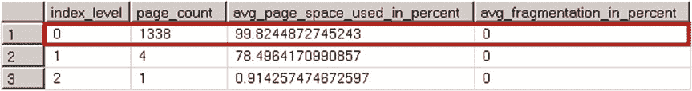

# 第 6 章 ■ 索引碎片

```
create unique clustered index IDX_Postitions_DeviceId_ATime
on dbo.Positions(DeviceId, ATime);

update dbo.Positions set Address = N'Position address';

select index_level, page_count, avg_page_space_used_in_percent, avg_fragmentation_in_percent
from sys.dm_db_index_physical_stats(DB_ID(),OBJECT_ID(N'Positions'),1,null,'DETAILED')
```

尽管你在后处理阶段更新了地址信息，但这并未增加数据行的大小。因此，表中没有产生碎片，如图 6-6 所示。

## 图 6-6. 当行在插入阶段已为地址预填充了 16 个空格字符时的碎片情况

不幸的是，在某些情况下，由于系统的业务或功能要求，你无法在插入阶段预先填充某些列。作为一种变通方法，你可以在表中创建一个可变长度列，并将其用作占位符来预留空间。清单 6-7 展示了这样一种方法。

## 清单 6-7. 导致碎片的模式：使用占位符列来预留空间

```
drop table dbo.Positions

go

create table dbo.Positions
(
    DeviceId int not null,
    ATime datetime2(0) not null,
    Latitude decimal(9,6) not null,
    Longitude decimal(9,6) not null,
    Address nvarchar(200) null,
    Placeholder char(100) null,
    Dummy varbinary(32)
);

;with N1(C) as (select 0 union all select 0) -- 2 rows
,N2(C) as (select 0 from N1 as T1 cross join N1 as T2) -- 4 rows
,N3(C) as (select 0 from N2 as T1 cross join N2 as T2) -- 16 rows
,N4(C) as (select 0 from N3 as T1 cross join N3 as T2) -- 256 rows
,N5(C) as (select 0 from N4 as T1 cross join N4 as T2) -- 65,536 rows
,IDs(ID) as (select row_number() over (order by (select NULL)) from N5)

insert into dbo.Positions(DeviceId, ATime, Latitude, Longitude, Dummy)
select
    ID % 100 /*DeviceId*/
    ,dateadd(minute, -(ID % 657), getutcdate()) /*ATime*/
    ,0 /*Latitude - just dummy value*/
    ,0 /*Longitude - just dummy value*/
    ,convert(varbinary(32),replicate('0',32)) /* Reserving the space*/
from IDs;
```

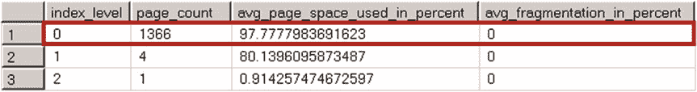

# 第 6 章 ■ 索引碎片

```
create unique clustered index IDX_Postitions_DeviceId_ATime
on dbo.Positions(DeviceId, ATime);

update dbo.Positions
set
    Address = N'Position address'
    ,Dummy = null;

select index_level, page_count, avg_page_space_used_in_percent, avg_fragmentation_in_percent
```


# 第六章 ■ 索引碎片

## 摘要

SQL Server 中存在两种类型的索引碎片。外部碎片指逻辑上连续的数据页未位于相同或相邻的区中。这种碎片会影响需要物理 I/O 读取的扫描操作的性能。

当仅执行索引查找操作时，外部碎片对性能的影响要小得多。

从 `sys.dm_db_index_physical_stats(DB_ID(),OBJECT_ID(N'Positions'),1,null,'DETAILED')` 获取数据。

后处理过程中的行大小保持不变。尽管它给 `Address` 列增加了 32 个字节，但它也将同一行的 `Dummy` 列设置为 `null`，从而减少了 32 个字节的行大小。图 6-7 展示了执行代码后的碎片情况。

*图 6-7. 使用占位列时的碎片*

值得注意的是，此方法的效率取决于几个因素。首先，当行大小增加量变化显著时，很难预测要预留的空间量。在这种情况下，你可以选择谨慎地高估。请记住，尽管高估减少了外部碎片，但它增加了内部碎片，并在数据页上留下了未使用的空间。

另一个因素是碎片是如何产生的。该方法最适用于插入碎片最小的、不断增长的索引。当页面拆分和碎片在插入阶段发生时，它的效率较低；例如，当使用 `NEWID()` 值填充 `uniqueidentifier` 列上的索引时。

最后，尽管使用占位符可以减少碎片，但它不能取代其他索引维护例程，而是与它们并行工作。

不幸的是，更新过程中行大小增加的情况比乍看起来要常见得多。SQL Server 使用行版本控制来支持其某些功能。使用行版本控制时，SQL Server 将一个或多个旧行版本存储在 `tempdb` 的一个特殊部分中，称为*版本存储区*。它还会在数据文件的行中添加一个 14 字节的版本标签，以引用版本存储区中的行。该 14 字节的版本标签在行被修改时添加，简而言之，它以类似于你在后处理示例中看到的方式增加了行大小。版本标签会一直保留在行中，直到索引被重建。

依赖于行版本控制的两个最常见的 SQL Server 功能是乐观事务隔离级别和 `AFTER` 触发器。这两个功能都会导致索引碎片，在设计索引维护策略时需要考虑到它们。我们将在本书后面讨论触发器和乐观事务隔离级别。

■ **最佳实践** 如果数据库正在使用乐观事务隔离级别和/或表定义了 `AFTER UPDATE` 或 `AFTER DELETE` 触发器，则不要使用 `FILLFACTOR=100`。这有助于减少在数据修改过程中由行版本控制引入的索引碎片。

最后，数据库收缩会极大地增加外部碎片，这是由其实现方式决定的。`DBCC SHRINK` 命令根据 GAM 分配映射定位文件中已分配的最高页面，并将其尽可能向前移动，而不考虑该页面属于哪个对象。除非绝对必要，建议避免收缩。

在收缩操作完成后，重新组织索引比重建索引更好。索引重建会创建索引的另一个副本，这会增加数据文件的大小，从而违背了收缩的目的。

作为收缩过程的替代方法，你可以创建一个新的文件组，并通过将对象移动到那里来重建索引。之后，可以删除旧的、空的文件组。这种方法以类似于收缩操作的方式减少数据库的大小，但不会引入碎片。


# 第 6 章 ■ 索引碎片

只需读取少量行和数据页。此外，当数据页缓存在缓冲池中时，它不会影响性能。

当索引中的叶级数据页存在可用空间时，就会发生内部碎片。因此，索引在磁盘和内存中使用更多的数据页来存储数据。即使数据页已被缓存，由于需要处理额外的数据页，内部碎片也会对扫描操作的性能产生负面影响。

轻微程度的内部碎片可以加速插入和更新操作，并减少页拆分的次数。你可以在创建索引或重建索引时，通过指定 `FILLFACTOR` 属性，在叶级索引页中预留一些空间。建议通过逐渐减小 `FILLFACTOR` 的值并监控其对系统碎片的影响来对其进行微调。如果你使用的是 SQL Server 2012 或更高版本，还可以使用扩展事件来监控页拆分操作。

`sys.dm_db_index_physical_stats` 数据管理函数允许你监控内部和外部碎片。有两种方法可以减少索引碎片。`ALTER INDEX REORGANIZE` 命令重新排序索引叶页。这是一个联机操作，可以随时取消而不会丢失其进度。`ALTER INDEX REBUILD` 命令用新的副本替换旧的、碎片化的索引。默认情况下，这是一个脱机操作，尽管 SQL Server 企业版可以联机重建索引。

在设计索引维护策略时，你必须考虑多种因素，例如系统工作负载和可用性、使用的 SQL Server 版本和版本，以及系统中使用的任何高可用性技术。你还应该分析碎片对系统的影响。索引维护非常耗费资源，在某些情况下，它引入的开销超过了它带来的好处。

然而，最小化碎片的最佳方法是消除其根源。考虑避免在更新期间行大小增加的情况，不要收缩数据文件，不要使用 AFTER 触发器，并避免在填充了随机值的 `uniqueidentifier` 或 `hashbyte` 列上创建索引。

# 第 7 章 ■ 索引的设计与调优

不可能定义一个在所有地方都适用的索引策略。每个系统都是独特的，需要根据工作负载、业务需求以及许多其他因素采用其自己的索引方法。

然而，有一些设计考虑因素和指导原则可以应用于每个系统。

当我们优化现有系统时，情况也是如此。虽然优化是一个迭代过程，在每种情况下都是独特的，但有一组技术可用于检测每个数据库系统中的低效之处。

在本章中，我们将介绍在设计新索引和优化现有系统时需要牢记的几个重要因素。

#### 聚集索引设计注意事项

每次更改聚集索引键的值时，都会发生两件事。首先，SQL Server 将行移动到聚集索引页链和数据文件中的不同位置。其次，它更新 `row-id`，即聚集索引键。`row-id` 被存储，并且需要更新到所有非聚集索引中。就 I/O 而言，这可能代价高昂，尤其是在批量更新的情况下。此外，它会增加聚集索引的碎片，在 `row-id` 大小增加的情况下，也会增加非聚集索引的碎片。因此，最好使用键值不会改变的*静态*聚集索引。

所有非聚集索引都使用聚集索引键作为 `row-id`。过宽的聚集索引键会增加非聚集索引行的大小，并需要更多空间来存储它们。因此，在索引或范围扫描操作期间，SQL Server 需要处理更多的数据页，这使得索引效率降低。

# 第 7 章 ■ 索引的设计与调优

在非唯一非聚集索引的情况下，`row-id`也会存储在非叶级索引层级中，这反过来会减少每页的索引记录数量，并可能导致索引中出现额外的中间层级。尽管非叶索引层级通常缓存在内存中，但每次`SQL Server`遍历非聚集索引`B-Tree`时，这都会引入额外的逻辑读取。

最终，较大的非聚集索引会在缓冲池中占用更多空间，并在索引维护期间引入更多开销。显然，不可能提供一个通用的阈值来定义可应用于任何表的键的最大可接受大小。然而，作为一般规则，最好使用`窄`的聚集索引键，并使索引键尽可能小。

将聚集索引定义为`唯一`也是有益的。其重要性的原因并不显而易见。考虑这样一种场景：一个表没有唯一的聚集索引，而你希望运行一个查询，该查询在执行计划中使用`非聚集索引 seek`。在这种情况下，如果非聚集索引中的`row-id`不是唯一的，`SQL Server`在键查找操作期间将不知道选择哪个聚集索引行。

`SQL Server`通过向非唯一聚集索引中添加另一个可为空的整数列来解决此类问题，该列称为`uniquifier`。对于键值的首次出现，`SQL Server`会用`NULL`填充`uniquifier`，对于插入表中的每个后续重复项，会自动递增该值。

© Dmitri Korotkevitch 2016
D. Korotkevitch, *Pro SQL Server Internals*, DOI 10.1007/978-1-4842-1964-5_7

## **注意**
每个聚集索引键值可能的重复项数量受整数值域限制。具有相同聚集索引键的行数不能超过 2,147,483,648。这是一个理论限制，并且创建具有如此差选择性的索引显然不是一个好主意。

让我们看看非唯一聚集索引中由`uniquifiers`引入的开销。清单 7-1 中显示的代码创建了三个结构相同但聚集索引配置不同的表，并为每个表填充了 65,536 行数据。

表`dbo.UniqueCI`是唯一定义了唯一聚集索引的表。表`dbo.NonUniqueCINoDups`没有任何重复的键值。最后，表`dbo.NonUniqueCIDups`的索引中有大量重复项。

## 清单 7-1. 非唯一聚集索引：表创建

```sql
create table dbo.UniqueCI
(
    KeyValue int not null,
    ID int not null,
    Data char(986) null,
    VarData varchar(32) not null
        constraint DEF_UniqueCI_VarData
        default 'Data'
);

create unique clustered index IDX_UniqueCI_KeyValue
    on dbo.UniqueCI(KeyValue);

create table dbo.NonUniqueCINoDups
(
    KeyValue int not null,
    ID int not null,
    Data char(986) null,
    VarData varchar(32) not null
        constraint DEF_NonUniqueCINoDups_VarData
        default 'Data'
);

create /*unique*/ clustered index IDX_NonUniqueCINoDups_KeyValue
    on dbo.NonUniqueCINoDups(KeyValue);

create table dbo.NonUniqueCIDups
(
    KeyValue int not null,
    ID int not null,
    Data char(986) null,
    VarData varchar(32) not null
        constraint DEF_NonUniqueCIDups_VarData
        default 'Data'
);

create /*unique*/ clustered index IDX_NonUniqueCIDups_KeyValue
    on dbo.NonUniqueCIDups(KeyValue);
```

## 填充数据

```sql
;with N1(C) as (select 0 union all select 0) -- 2 rows
,N2(C) as (select 0 from N1 as T1 cross join N1 as T2) -- 4 rows
,N3(C) as (select 0 from N2 as T1 cross join N2 as T2) -- 16 rows
,N4(C) as (select 0 from N3 as T1 cross join N3 as T2) -- 256 rows
,N5(C) as (select 0 from N4 as T1 cross join N4 as T2) -- 65,536 rows
,IDs(ID) as (select row_number() over (order by (select null)) from N5)
insert into dbo.UniqueCI(KeyValue, ID)
    select ID, ID from IDs;

insert into dbo.NonUniqueCINoDups(KeyValue, ID)
    select KeyValue, ID from dbo.UniqueCI;

insert into dbo.NonUniqueCIDups(KeyValue, ID)
    select KeyValue % 10, ID from dbo.UniqueCI;
```

# 第七章 ■ 索引的设计与调优

现在，让我们查看每个表的聚集索引物理统计信息。相关代码如 `清单 7-2` 所示，结果如 `图 7-1` 所示。

## 清单 7-2. 非唯一聚集索引：检查聚集索引的行大小

```sql
select index_level, page_count, min_record_size_in_bytes as [min row size]
    ,max_record_size_in_bytes as [max row size]
    ,avg_record_size_in_bytes as [avg row size]
from
    sys.dm_db_index_physical_stats(db_id(), object_id(N'dbo.UniqueCI'), 1, null ,'DETAILED');

select index_level, page_count, min_record_size_in_bytes as [min row size]
    ,max_record_size_in_bytes as [max row size]
    ,avg_record_size_in_bytes as [avg row size]
from
    sys.dm_db_index_physical_stats(db_id(), object_id(N'dbo.NonUniqueCINoDups'), 1, null
        ,'DETAILED');

select index_level, page_count, min_record_size_in_bytes as [min row size]
    ,max_record_size_in_bytes as [max row size]
    ,avg_record_size_in_bytes as [avg row size]
from
    sys.dm_db_index_physical_stats(db_id(), object_id(N'dbo.NonUniqueCIDups'), 1, null
        ,'DETAILED');
```

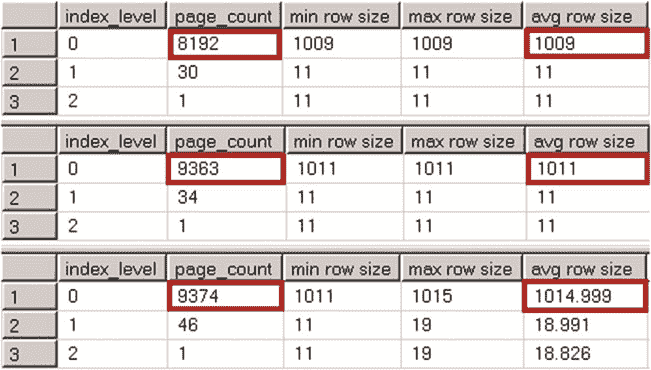

## 图 7-1. 非唯一聚集索引：聚集索引的行大小

尽管 `dbo.NonUniqueCINoDups` 表中没有重复的键值，但行中仍然增加了两个额外的字节。SQL Server 在数据的可变长度部分存储了一个唯一值添加器，并且这两个字节是通过可变长度数据偏移数组中的另一个条目添加的。

在聚集索引具有重复值的情况下，唯一值添加器又会增加四个字节，这总共造成了六个字节的开销。

值得一提的是，在某些边缘情况下，唯一值添加器使用的额外存储空间会减少数据页上可容纳的行数。我们的示例演示了这种情况。如你所见，`dbo.UniqueCI` 比另外两个表少用了大约 15% 的数据页。

现在，让我们看看唯一值添加器如何影响非聚集索引。`清单 7-3` 所示的代码在所有三个表中创建了非聚集索引。`图 7-2` 显示了这些索引的物理统计信息。

## 清单 7-3. 非唯一聚集索引：检查非聚集索引的行大小

```sql
create nonclustered index IDX_UniqueCI_ID
on dbo.UniqueCI(ID);

create nonclustered index IDX_NonUniqueCINoDups_ID
on dbo.NonUniqueCINoDups(ID);

create nonclustered index IDX_NonUniqueCIDups_ID
on dbo.NonUniqueCIDups(ID);

select index_level, page_count, min_record_size_in_bytes as [min row size]
    ,max_record_size_in_bytes as [max row size]
    ,avg_record_size_in_bytes as [avg row size]
from
    sys.dm_db_index_physical_stats(db_id(), object_id(N'dbo.UniqueCI'), 2, null
        ,'DETAILED');

select index_level, page_count, min_record_size_in_bytes as [min row size]
    ,max_record_size_in_bytes as [max row size]
    ,avg_record_size_in_bytes as [avg row size]
from
    sys.dm_db_index_physical_stats(db_id(), object_id(N'dbo.NonUniqueCINoDups'), 2, null
        ,'DETAILED');

select index_level, page_count, min_record_size_in_bytes as [min row size]
    ,max_record_size_in_bytes as [max row size]
    ,avg_record_size_in_bytes as [avg row size]
from
    sys.dm_db_index_physical_stats(db_id(), object_id(N'dbo.NonUniqueCIDups'), 2, null
        ,'DETAILED');
```

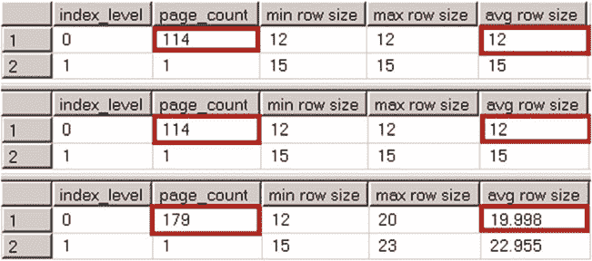

## 图 7-2. 非唯一聚集索引：非聚集索引的行大小

在 `dbo.NonUniqueCINoDups` 表的非聚集索引中没有开销。如你所忆，SQL Server 不会为存储 NULL 数据的尾随列在可变长度偏移数组中存储偏移信息。尽管如此，唯一值添加器在 `dbo.NonUniqueCIDups` 表中引入了八个字节的开销。这八个字节由一个四字节的唯一值添加器值、一个两字节的可变长度数据偏移数组条目以及一个两字节的用于存储行中可变长度列数量的条目组成。


我们可以通过以下方式总结唯一值生成器的存储开销。对于`uniquifier`为`NULL`的行，如果索引中至少有一个存储了`NOT NULL`值的可变长度列，则会产生两字节的开销。该开销来源于唯一值生成器列的变长偏移量数组条目。否则，则没有额外开销。

在唯一值生成器被赋值的情况下，如果存在存储`NOT NULL`值的可变长度列，则开销为六字节。否则，开销为八字节。

■ `提示` 如果你预计聚集索引值中会有大量重复项，可以添加一个整数`identity`列作为索引的最右列，从而使索引具有唯一性。与唯一值生成器引入的最高八字节的不可预测存储开销相比，这为每行增加了四字节的可预测存储开销。当你通过聚集索引的所有列引用该行时，这还可以提高单次查找操作的性能。

## 第 7 章 ■ 设计和优化索引

设计聚集索引时，以最小化因插入新行而导致的索引碎片是有益的。实现此目标的方法之一是使聚集索引值保持`单调递增`。`identity`列上的索引就是一个例子。另一个例子是使用插入时当前系统时间填充的`datetime`列。

然而，单调递增的索引存在两个潜在问题。第一个与统计信息有关。正如你在第 3 章所学，当参数值不在直方图中时，SQL Server 的旧版基数估计器会低估基数。除非你使用的是 SQL Server 2014-2016 的新版基数估计器（它假定直方图外的数据分布与表中其他数据相似），否则你应该将此行为纳入系统的统计信息维护策略中。

下一个问题更为复杂。对于单调递增的索引，数据总是插入到索引的末尾。一方面，这可以防止页拆分并减少碎片。另一方面，它可能导致`热点`，即当多个会话试图修改同一数据页和/或分配新页或区时发生的序列化延迟。SQL Server 不允许多个会话更新相同的数据结构，而是将这些操作序列化。

除非系统以极高的速率收集数据，并且索引每秒处理数百次插入，否则热点通常不是问题。我们将在第 27 章“系统故障排除”中讨论如何检测此类问题。

最后，如果系统有一组频繁执行且重要的查询，考虑使用针对它们进行优化的聚集索引可能是有益的。这消除了昂贵的`键查找`操作，并提高了系统性能。

尽管此类查询可以通过使用覆盖非聚集索引来优化，但这并非总是理想的解决方案。在某些情况下，这需要你创建非常宽的非聚集索引，从而在磁盘和缓冲池中占用大量存储空间。

另一个重要因素是列的修改频率。将频繁修改的列添加到非聚集索引中，会迫使 SQL Server 在多个地方更改数据，这对系统的更新性能产生负面影响并增加阻塞。

综上所述，设计出满足所有这些指导原则的聚集索引并不总是可能的。此外，你不应将这些指导原则视为绝对要求。你应该分析系统、业务需求、工作负载和查询，并选择对你有益的聚集索引，即使它们违反了一些指导原则。

##### 标识符、序列和唯一标识符


# 第七章 设计与优化索引

人们通常选择标识符（identity）、序列（sequence）和唯一标识符（uniqueidentifier）作为聚簇索引键。一如既往，这种方法有其自身的优缺点。

在这些列上定义的聚簇索引是`unique`（唯一）、`static`（静态）且`narrow`（窄）的。此外，标识符和序列是单调递增的，这减少了索引碎片。目录实体表是它们的理想用例之一。你可以将存储客户、文章或设备列表的表视为示例。这些表存储数千行甚至数百万行数据，尽管数据相对静态，因此热点问题不是问题。此外，此类表通常被外键引用并在连接（join）中使用。在整型（`integer`）或大整型（`bigint`）列上的索引非常紧凑和高效，这将提高查询性能。

> **注意** 我们将在第 8 章 “[约束](http://dx.doi.org/10.1007/978-1-4842-1964-5_8)” 中更详细地讨论外键约束。

对于事务性表，即以极高速率收集大量数据的表，在标识符或序列列上的聚簇索引效率较低，因为它们可能引入潜在的热点。

另一方面，唯一标识符很少是索引（无论是聚簇还是非聚簇）的良好选择。由`NEWID()`函数生成的随机值会大大增加索引碎片。此外，唯一标识符上的索引会降低批处理操作的性能。让我们看一个例子，创建两个表：一个在标识符列上有聚簇索引，另一个在唯一标识符列上有聚簇索引。下一步，我们将向两个表中插入 65,536 行。你可以参考清单 7-4 中的代码来完成此操作。

## 清单 7-4. 唯一标识符：表创建

```sql
create table dbo.IdentityCI
(
    ID int not null identity(1,1),
    Val int not null,
    Placeholder char(100) null
);

create unique clustered index IDX_IdentityCI_ID
on dbo.IdentityCI(ID);

create table dbo.UniqueidentifierCI
(
    ID uniqueidentifier not null
        constraint DEF_UniqueidentifierCI_ID
        default newid(),
    Val int not null,
    Placeholder char(100) null,
);

create unique clustered index IDX_UniqueidentifierCI_ID
on dbo.UniqueidentifierCI(ID)
go

;with N1(C) as (select 0 union all select 0) -- 2 rows
,N2(C) as (select 0 from N1 as T1 cross join N1 as T2) -- 4 rows
,N3(C) as (select 0 from N2 as T1 cross join N2 as T2) -- 16 rows
,N4(C) as (select 0 from N3 as T1 cross join N3 as T2) -- 256 rows
,N5(C) as (select 0 from N4 as T1 cross join N4 as T2) -- 65,536 rows
,IDs(ID) as (select row_number() over (order by (select null)) from N5)
insert into dbo.IdentityCI(Val)
select ID from IDs;

;with N1(C) as (select 0 union all select 0) -- 2 rows
,N2(C) as (select 0 from N1 as T1 cross join N1 as T2) -- 4 rows
,N3(C) as (select 0 from N2 as T1 cross join N2 as T2) -- 16 rows
,N4(C) as (select 0 from N3 as T1 cross join N3 as T2) -- 256 rows
,N5(C) as (select 0 from N4 as T1 cross join N4 as T2) -- 65,536 rows
,IDs(ID) as (select row_number() over (order by (select null)) from N5)
insert into dbo.UniqueidentifierCI(Val)
select ID from IDs;
```

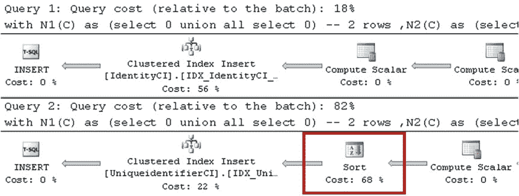

## 表 7-1. 向表中插入数据：执行统计

| **指标** | **标识符 (Identity)** | **唯一标识符 (Uniqueidentifier)** |
| :--- | :--- | :--- |
| **读取次数** | 158,438 | 181,879 |
| **执行时间 (毫秒)** | 173 | 256 |

## 图 7-3. 向表中插入数据：执行计划

如你所见，在唯一标识符列索引的情况下，执行计划中多了一个排序运算符。SQL Server 在插入前对随机生成的唯一标识符值进行排序，这降低了查询性能。

让我们再向表中插入一批行，并检查索引碎片。执行此操作的代码...


# 第 7 章 ■ 索引的设计与优化

如代码清单 7-5 所示。图 7-4 展示了查询的结果。

## 代码清单 7-5. Uniqueidentifier（唯一标识符）：插入行并检查碎片

```sql
;with N1(C) as (select 0 union all select 0) -- 2 行
,N2(C) as (select 0 from N1 as T1 cross join N1 as T2) -- 4 行
,N3(C) as (select 0 from N2 as T1 cross join N2 as T2) -- 16 行
,N4(C) as (select 0 from N3 as T1 cross join N3 as T2) -- 256 行
,N5(C) as (select 0 from N4 as T1 cross join N4 as T2) -- 65,536 行
,IDs(ID) as (select row_number() over (order by (select null)) from N5)
insert into dbo.IdentityCI(Val)
select ID from IDs;

;with N1(C) as (select 0 union all select 0) -- 2 行
,N2(C) as (select 0 from N1 as T1 cross join N1 as T2) -- 4 行
,N3(C) as (select 0 from N2 as T1 cross join N2 as T2) -- 16 行
,N4(C) as (select 0 from N3 as T1 cross join N3 as T2) -- 256 行
,N5(C) as (select 0 from N4 as T1 cross join N4 as T2) -- 65,536 行
,IDs(ID) as (select row_number() over (order by (select null)) from N5)

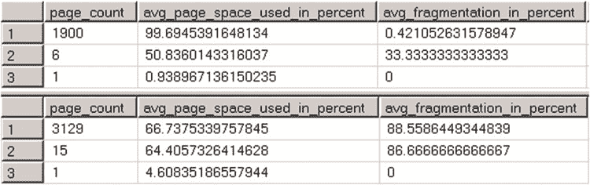

insert into dbo.UniqueidentifierCI(Val)
select ID from IDs;

select page_count, avg_page_space_used_in_percent, avg_fragmentation_in_percent
from sys.dm_db_index_physical_stats(db_id(),object_id(N'dbo.IdentityCI'),1,null,'DETAILED');

select page_count, avg_page_space_used_in_percent, avg_fragmentation_in_percent
from sys.dm_db_index_physical_stats(db_id(),object_id(N'dbo.UniqueidentifierCI'),1,null,'DETAILED');
```

## 图 7-4. 索引的碎片情况

如你所见，在`uniqueidentifier`列上的索引碎片化严重，与在标识列上的索引相比，它多使用了大约 40%的数据页。

对`uniqueidentifier`列上的索引进行批量插入时，会在数据文件的不同位置插入数据，这在大型表的情况下会导致大量的随机物理 I/O。这会显著降低操作性能。

## 个人经验

不久前，我参与了一个系统的优化工作。该系统有一个 250 GB 的表，包含一个聚集索引和三个非聚集索引。其中一个非聚集索引建立在`uniqueidentifier`列上。通过移除这个索引，我们将 50,000 行的批量插入时间从 45 秒加速到了 7 秒。

通常，在以下两种常见场景中，你会希望在`uniqueidentifier`列上创建索引。第一种是为了支持跨多个数据库的值唯一性。想象一个分布式系统，行可以插入到每个数据库中。开发人员通常使用`uniqueidentifier`来确保每个键值在整个系统范围内都是唯一的。

这种实现的关键要素在于键值是如何生成的。正如你已经看到的，使用`NEWID()`函数或在客户端代码中生成的随机值会对系统性能产生负面影响。但是，你可以使用`NEWSEQUENTIALID()`函数，它生成唯一且*通常*递增的值（SQL Server 会不时重置它们的基数）。使用`NEWSEQUENTIALID()`函数生成的`uniqueidentifier`列上的索引与标识列和序列列上的索引类似；然而，你需要记住，`uniqueidentifier`数据类型使用 16 字节的存储空间，而`int`类型为 4 字节，`bigint`类型为 8 字节。

作为替代方案，你可以考虑创建一个包含两个列 (`InstallationId`, `Unique_Id_Within_Installation`) 的复合索引。这种列组合保证了跨多个安装和数据库的唯一性，并且比`uniqueidentifier`占用的存储空间更少。你可以使用整型标识或序列来生成`Unique_Id_Within_Installation`值，这将减少索引的碎片化。

在你需要为数据库中所有实体生成唯一键值的情况下，你可以


考虑在所有实体间使用单一的序列对象。此方法满足了需求，但使用的数据类型比 `uniqueidentifier` 更小。

另一个常见用例是安全性，其中 `uniqueidentifier` 值被用作安全令牌或随机对象 ID。不幸的是，你无法在此场景中使用 `NEWSEQUENTIALID()` 函数，因为有可能猜出该函数返回的下一个值。

此场景中一种可能的改进是，使用 `CHECKSUM()` 函数创建一个计算列，随后对其建立索引，而无需在 `uniqueidentifier` 列上直接创建索引。代码如清单 7-6 所示。

***清单 7-6.*** 使用 `CHECKSUM()`：表结构

```
create table dbo.Articles
(
    ArticleId int not null identity(1,1),
    ExternalId uniqueidentifier not null
        constraint DEF_Articles_ExternalId
            default newid(),
    ExternalIdCheckSum as checksum(ExternalId),
    /* 其他列 */
);

create unique clustered index IDX_Articles_ArticleId
    on dbo.Articles(ArticleId);

create nonclustered index IDX_Articles_ExternalIdCheckSum
    on dbo.Articles(ExternalIdCheckSum);
```

■ **提示** 你可以对计算列创建索引而无需持久化它。

尽管 `IDX_Articles_ExternalIdCheckSum` 索引会产生严重的碎片，但与在 `uniqueidentifier` 列上的索引相比（4 字节键对比 16 字节键），它将更紧凑。由于排序更快，它也提高了批量操作的性能，这同时也需要更少的内存来进行。

你必须牢记的一点是，`CHECKSUM()` 函数的结果不能保证唯一。你应该在查询中包含两个谓词，如清单 7-7 所示。

***清单 7-7.*** 使用 `CHECKSUM()`：选择数据

```
select ArticleId /* 其他列 */
from dbo.Articles
where checksum(@ExternalId) = ExternalIdCheckSum and ExternalId = @ExternalId
```

## 第 7 章 ■ 索引的设计与调优

■ **提示** 在需要对大于 900/1,700 字节的字符串列（这是非聚集索引键的最大大小）建立索引的情况下，你可以使用相同的技术。尽管这样的索引不支持 `范围扫描` 操作，但它可以用于 `点查找`。

#### 非聚集索引设计注意事项

很难找到那个转折点，即连接多个非聚集索引比使用单个非聚集 `索引查找` 和 `键查找` 操作更高效。当索引选择性高且 SQL Server 估计索引查找操作将返回少量行时，键查找的成本相对较低。在这种情况下，没有理由使用另一个非聚集索引。反之，当索引选择性低时，索引查找会返回大量行，SQL Server 通常不会使用它，因为效率不高。

让我们看一个例子，我们将创建一个表并填充 1,048,576 行。`Col1` 列中存储 50 个不同的值，`Col2` 存储 150 个值，`Col3` 存储 200 个值。最后，我们将在表上创建三个不同的非聚集索引。执行此操作的代码如清单 7-8 所示。

***清单 7-8.*** 多个非聚集索引：表创建

```
create table dbo.IndexIntersection
(
    Id int not null,
    Placeholder char(100),
    Col1 int not null,
    Col2 int not null,
    Col3 int not null
);

create unique clustered index IDX_IndexIntersection_ID
    on dbo.IndexIntersection(ID);

;with N1(C) as (select 0 union all select 0) -- 2 行
,N2(C) as (select 0 from N1 as T1 cross join N1 as T2) -- 4 行
,N3(C) as (select 0 from N2 as T1 cross join N2 as T2) -- 16 行
,N4(C) as (select 0 from N3 as T1 cross join N3 as T2) -- 256 行
,N5(C) as (select 0 from N4 as T1 cross join N4 as T2) -- 65,536 行
,N6(C) as (select 0 from N3 as T1 cross join N5 as T2) -- 1,048,576 行
,IDs(ID) as (select row_number() over (order by (select null)) from N6)
insert into dbo.IndexIntersection(ID, Col1, Col2, Col3)
```


# 第 7 章 ■ 索引的设计与调优

```sql
select ID, ID % 50, ID % 150, ID % 200 from IDs;

create nonclustered index IDX_IndexIntersection_Col1
on dbo.IndexIntersection(Col1);

create nonclustered index IDX_IndexIntersection_Col2
on dbo.IndexIntersection(Col2);

create nonclustered index IDX_IndexIntersection_Col3
on dbo.IndexIntersection(Col3);
```

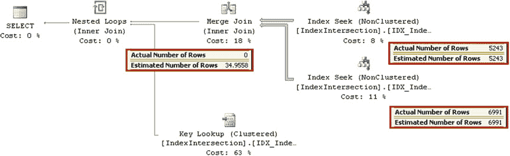

## 多个非聚集索引：数据查询

接下来，让我们看一个查询的执行计划，该查询从表中选择数据，其 where 子句中使用了三个谓词。每个谓词都可以在单独的索引上使用索引查找操作。实现此功能的代码如清单 7-9 所示，执行计划如图 7-5 所示。需要说明的是，根据您安装的 SQL Server 版本和补丁包，您环境中看到的执行计划和基数估计可能会有所不同。

***清单 7-9.*** 多个非聚集索引：数据查询

```sql
select ID
from dbo.IndexIntersection
where Col1 = 42 and Col2 = 43 and Col3 = 44;
```

***图 7-5.*** 多个非聚集索引：使用索引交叉的执行计划

这里有几个值得注意的地方。尽管在 `Col1` 上有另一个非聚集索引，并且所有索引都包含 `ID` 列（即行 ID），但 SQL Server 选择使用键查找操作，而不是执行第三次索引查找操作。表中 `Col1=42` 的行有 20,971 行，这使得键查找成为更好的选择。

另一个重要因素是基数估计。尽管 SQL Server 正确估计了两次索引查找操作的基数，但连接操作符之后的估计是错误的。SQL Server 没有任何关于表中列值相关性的数据，这可能导致基数估计错误，并可能产生非最优的执行计划。

让我们添加另一个包含索引，它将包含 where 子句中的所有三个列，并再次运行清单 7-9 中的查询。创建该索引的代码如清单 7-10 所示。执行计划如图 7-6 所示。

**■ 注意** 包含两个附加列的新索引使得 `IDX_IndexIntersection_Col1` 索引变得冗余。我们将在本章后面讨论这种情况。

***清单 7-10.*** 多个非聚集索引：添加一个包含索引

```sql
create nonclustered index IDX_IndexIntersection_Col3_Included
on dbo.IndexIntersection(Col3)
include (Col1, Col2)
```

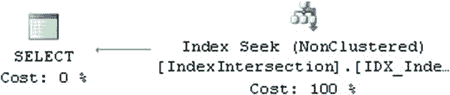

***图 7-6.*** 多个非聚集索引：使用包含索引的执行计划

CPU 时间和读取次数如表 7-2 所示。

***表 7-2.*** 索引交叉与包含索引对比

|   | 读取次数 | CPU 时间（毫秒） |
|---|---|---|
| 索引交叉 | 9 ms | |
| 包含索引 | 1 ms | |

尽管两种情况下的读取次数差别不大，但使用索引交叉的查询 CPU 时间远高于使用包含索引的查询。

采用多个狭窄的非聚集索引（导致索引交叉）的设计仍然有帮助，特别是在数据仓库工作负载的情况下，这些查询需要扫描和聚合大量数据。然而，与包含索引相比，它们的效率较低。通常，创建一小部分包含多个列的宽索引比创建大量狭窄的（可能是单列的）索引更好。

虽然理想的索引应该覆盖查询，但这并不是必需的。少量的键查找操作是完全可以接受的。理想情况下，SQL Server 会执行非聚集索引查找，通过评估索引中包含列的其它谓词进一步过滤行。这将减少所需的键查找次数。这里的关键词是针对查询谓词进行评估

## 设计与优化索引

### 不同工作负载下的索引策略

数据在键查找阶段之后来自非聚集索引，而非其本身。这可以通过在索引中包含谓词列来实现。

无法建议每个表应创建多少个索引。此外，对于 OLTP、数据仓库或混合工作负载的系统，这个数量也各不相同。无论如何，这个数量属于“视情况而定”的范畴。

在数据高度易变的 OLTP 系统中，您应该只拥有**最必需**的索引集。虽然拥有足够的索引以提供充足的系统查询性能很重要，但您必须考虑它们引入的数据修改开销。在某些情况下，忍受很少执行的查询的次优性能，比忍受每次数据修改操作时的开销更可取。

在数据仓库环境中，您可以创建大量索引和/或索引视图，特别是在数据相对静态并根据给定计划刷新的情况下。在某些情况下，通过在更新前删除索引并在更新后重新创建，您可以获得更好的更新性能。还值得一提的是，在专用数据仓库系统中，使用列存储索引通常会带来显著更好的性能。

> **注意** 我们将在[第 9 章](http://dx.doi.org/10.1007/978-1-4842-1964-5_9)“视图”中讨论索引视图。列存储索引将在本书的第八部分介绍。

在混合工作负载环境中工作总是一个挑战。我倾向于为 OLTP 活动优化它们，这通常是面向客户的，因此更为关键。然而，在处理此类系统时，您始终需要牢记报告/数据仓库方面的因素。设计一组表来存储聚合数据，然后将它们用于报告和分析目的，或者使用结合了基于行和基于列存储的数据分区来处理不同类型的数据，这种情况并不少见。我们将在[本书第 16 章](http://dx.doi.org/10.1007/978-1-4842-1964-5_16)讨论后一种场景。

最后，记住尽可能将索引定义为唯一。唯一的非聚集索引更紧凑，因为它们不在非叶级别存储行 ID。此外，唯一性有助于查询优化器生成更高效的执行计划。

### 优化与调优索引

系统优化和性能调优是一个迭代的、永无止境的过程，特别是在系统处于开发阶段的情况下。新特性和功能通常需要您重新评估和重构代码，并更改系统中的索引。

虽然索引调优是系统优化的重要组成部分，但它几乎不是您必须关注的唯一领域。除了不良或缺失的索引之外，还有许多其他因素可能导致性能欠佳。在排查系统问题时，您必须分析整个技术栈，包括硬件、操作系统、SQL Server 和数据库配置。

> **注意** 我们将在[第 27 章](http://dx.doi.org/10.1007/978-1-4842-1964-5_27)“系统故障排除”中更详细地讨论系统故障排除。

与开发新系统相比，对现有系统进行索引调优可能需要略有不同的方法。对于新开发，通常将索引调优推迟到后期阶段更有意义，此时数据库模式和查询已基本定型。这种方法有助于避免在因代码重构而变得过时的优化上花费时间。在敏捷开发环境中尤其如此，因为此类重构在每次迭代中都会例行进行。

在新开发的最初阶段，您仍然应该创建最必需的索引集。这包括主键约束以及用于支持系统中唯一性和引用完整性的索引和/或约束。然而，所有进一步的索引调优都可以推迟到后期的开发阶段。


# 第 7 章 ■ 索引的设计与调优

在新系统的索引调优过程中，有两个`必备`要素。首先，数据库应存储足够的数据，理想情况下其数据分布应与生产环境预期相似。其次，你应该能够模拟工作负载，这有助于定位系统中最常见的查询和低效之处。

优化现有系统则需要略有不同的方法。显然，在某些情况下，你必须修复关键的生产问题，此时除了快速添加或调整索引外别无选择。然而，作为一般规则，在向系统添加新索引之前，应先执行索引分析和整合，移除未使用和低效的索引，有时甚至需要重构查询。让我们详细看看所有这些步骤。

##### 检测未使用和低效的索引

索引提升了读取操作的性能。不过，`读取`一词在数据库世界中有些令人困惑。每一个 DML 查询，如`SELECT`、`INSERT`、`UPDATE`、`DELETE`或`MERGE`，都会读取数据。例如，当你从表中删除一行时，SQL Server 会读取少量数据页，在每个索引中定位该行。

**注意** 每一个数据库系统，即使是那些数据高度易变的系统，处理的读取操作也远多于写入操作。

与此同时，索引在数据修改时会带来额外开销。行数据需要插入到每个索引中或从每个索引中删除。列值必须在它们出现的每个索引中进行更新。显然，我们希望减少这种开销，并删除那些不常使用的索引。

SQL Server 在内部跟踪索引使用统计信息，并通过 `sys.dm_db_index_usage_stats` 和 `sys.dm_db_index_operation_stats` 这两个 DMO（动态管理对象）将其公开。

第一个数据管理视图——`sys.dm_db_index_usage_stats`——提供了关于不同类型索引操作的信息以及上次执行该操作的时间。让我们看一个例子：创建一个表，填充一些数据，然后查看索引使用统计信息。执行此操作的代码如清单 7-11 所示。

### 清单 7-11. 索引使用统计信息：表创建

```
create table dbo.UsageDemo
(
ID int not null,
Col1 int not null,
Col2 int not null,
Placeholder char(8000) null
);

create unique clustered index IDX_CI on dbo.UsageDemo(ID);

create unique nonclustered index IDX_NCI1 on dbo.UsageDemo(Col1);

create unique nonclustered index IDX_NCI2 on dbo.UsageDemo(Col2);

;with N1(C) as (select 0 union all select 0) -- 2 rows
,N2(C) as (select 0 from N1 as T1 cross join N1 as T2) -- 4 rows
,N3(C) as (select 0 from N2 as T1 cross join N2 as T2) -- 16 rows
,IDs(ID) as (select row_number() over (order by (select null)) from N3)
insert into dbo.UsageDemo(ID, Col1, Col2)
select ID, ID, ID from IDs;

select
s.Name + N'.' + t.name as [Table] ,i.name as [Index]
,ius.user_seeks as [Seeks], ius.user_scans as [Scans]
,ius.user_lookups as [Lookups]
,ius.user_seeks + ius.user_scans + ius.user_lookups as [Reads]
,ius.user_updates as [Updates], ius.last_user_seek as [Last Seek]
,ius.last_user_scan as [Last Scan], ius.last_user_lookup as [Last Lookup]
,ius.last_user_update as [Last Update]
from
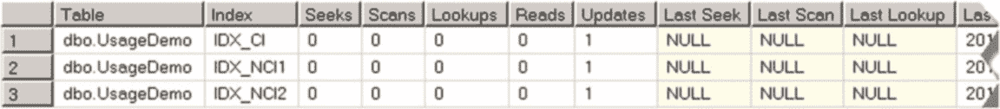
sys.tables t join sys.indexes i on
t.object_id = i.object_id
join sys.schemas s on
t.schema_id = s.schema_id
left outer join sys.dm_db_index_usage_stats ius on
ius.database_id = db_id() and
ius.object_id = i.object_id and
ius.index_id = i.index_id
where
s.name = N'dbo' and t.name = N'UsageDemo'
order by
s.name, t.name, i.index_id
```

`sys.dm_db_index_usage_stats` 中的 `user_seeks`、`user_scans` 和 `user_lookups` 列分别指示该索引被用于索引查找、索引扫描和键查找操作的次数。`User_updates` 表示该索引处理的插入、更新和删除次数。`sys.dm_index_usage_stats` DMV 还返回有关系统使用索引的统计信息以及上次操作发生的时间。


# 第 7 章 ■ 索引的设计与调优

如图 7-7 所示，聚集索引和非聚集索引均被更新了一次，在我们的案例中对应于那条`INSERT`语句。两个索引均未被用于任何类型的读操作。

## 图 7-7. 表创建后的索引使用统计

有一点值得提及：我们在查询中使用了外连接。如果自统计计数器重置以来索引未被使用过，`sys.dm_db_index_usage_stats`和`sys.dm_index_operation_stats`这两个动态管理对象（DMO）不会返回任何关于该索引的信息。

> **重要提示**
>
> 索引使用统计信息会在 SQL Server 重启时重置。此外，当数据库被分离，或当`AUTO_CLOSE`数据库属性启用且数据库被关闭时，统计信息也会被清除。而且，SQL Server 2012 和 2014 存在一个错误，会在索引重建时重置统计信息。此错误在 SQL Server 2012 SP3 CU3、SQL Server 2014 SP2 和 SQL Server 2016 中已修复。

在进行索引分析时，你必须牢记此特性。支持按特定计划执行的查询的索引，其统计信息显示未被使用的情况并不少见。例如，想象一个支持每两周或每月运行一次的薪资处理进程的索引。如果 SQL Server 最近重启过，或者在 SQL Server 2012 RTM–SP3 CU2 及 SQL Server 2014 RTM 和 SP1 版本中如果索引最近重建过，索引统计信息可能会显示该索引未被用于读操作。

> **提示**
>
> 你可以考虑按计划创建和删除此类索引，以避免在进程执行间隔期间产生更新开销。

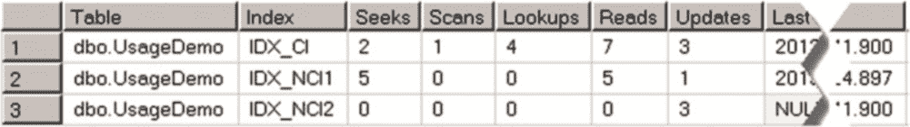

现在，让我们对`dbo.UsageDemo`表运行一些查询，如代码清单 7-12 所示。

## 代码清单 7-12. 索引使用统计：查询

```sql
-- 查询 1: CI 寻找（点查找）
select Placeholder from dbo.UsageDemo where ID = 5;

-- 查询 2: CI 寻找（范围扫描）
select count(*)
from dbo.UsageDemo with (index=IDX_CI)
where ID between 2 and 6;

-- 查询 3: CI 扫描
select count(*) from dbo.UsageDemo with (index=IDX_CI);

-- 查询 4: NCI 寻找（点查找 + 键查找）
select Placeholder from dbo.UsageDemo where Col1 = 5;

-- 查询 5: NCI 寻找（范围扫描 - 表中所有数据）
select count(*) from dbo.UsageDemo where Col1 > -1;

-- 查询 6: NCI 寻找（范围扫描 + 键查找）
select sum(Col2)
from dbo.UsageDemo with (index = IDX_NCI1)
where Col1 between 1 and 5;

-- 查询 7-8: 更新操作
update dbo.UsageDemo set Col2 = -3 where Col1 = 3;
update dbo.UsageDemo set Col2 = -4 where Col1 = 4;
```

如果再次运行显示索引使用统计信息的`SELECT`语句，你会看到如图 7-8 所示的结果。

## 图 7-8. 执行若干查询后的索引使用统计

这里有几个重要的注意事项。首先，`sys.dm_db_index_usage_stats`返回的是相应操作在执行计划中出现的次数。例如，对于`IDX_CI`索引，只返回了四次查找操作，这意味着有四条查询的执行计划中包含键查找操作，而不管查询执行期间实际进行了多少次键查找。

其次，`sys.dm_db_index_usage_stats`这个动态管理视图（DMV）将点查找和范围扫描都计为“寻找”，这对应于索引寻址操作符。这可能会掩盖索引寻址操作在大量行上执行范围扫描的情况。例如，在我们的示例中，第五条查询扫描了`IDX_NCI1`索引的所有行，但它被计为“寻找”而非“扫描”。

当你在生产系统中进行此类分析时，可以考虑删除那些处理更新多于读取的索引，类似于我们示例中的`IDX_NCI2`。在某些情况下，特别是在 OLTP 环境中，不将扫描操作计入读取次数也是有益的，因为执行索引扫描的查询通常应该被优化。


虽然 `sys.dm_db_index_usage_stats` 能从执行计划的角度提供索引使用情况的良好高层概览，但 `sys.dm_db_index_operation_stats` 则更深入地提供了关于索引的详细 I/O、访问方法和锁统计信息。

这两个 DMO（动态管理对象）的关键区别在于数据收集方式。`Sys.dm_db_index_usage_stats` 记录的是某个操作在执行计划中出现的次数。相比之下，`sys.dm_db_index_operation_stats` 在行级别跟踪操作。在我们的索引查找示例中，`sys.dm_db_index_operation_stats` 会报告八次操作，而非四次。

尽管 `sys.dm_db_index_operation_stats` 提供了关于索引使用、I/O 和锁开销的极其详细的信息，但这可能会让人应接不暇，尤其是在初始性能调优阶段。通常，先使用 `sys.dm_db_index_usage_stats` 进行初步分析，然后在后续对系统进行微调时再使用 `sys.dm_db_index_operation_stats` 会更简单。

■ **注意** 你可以在在线丛书中阅读更多关于 `sys.dm_db_index_operation_stats` DMF 的信息：[`technet.microsoft.com/en-us/library/ms174281.aspx`](http://technet.microsoft.com/en-us/library/ms174281.aspx)

■ **重要提示** 在进行分析之前，请确保使用统计数据已收集到足以代表典型系统工作负载的信息。

## 索引整合

正如我们在第 2 章 “表与索引：内部结构与访问方法”(http://dx.doi.org/10.1007/978-1-4842-1964-5_2) 中所讨论的，只要查询在最左侧的查询列上具有 `SARGable` 谓词，SQL Server 就可以将复合索引用于索引查找操作。

让我们看一下清单 7-13 中所示的表。有两个非聚集索引，`IDX_Employee_LastName_FirstName` 和 `IDX_Employee_LastName`，它们都定义了 `LastName` 列作为最左侧列。只要在 `LastName` 列上存在 `SARGable` 谓词，第一个索引 `IDX_Employee_LastName_FirstName` 就可以用于索引查找操作，即使查询没有针对 `FirstName` 列的谓词。因此，`IDX_Employee_LastName` 索引是冗余的。

***清单 7-13.*** 冗余索引示例

```
create table dbo.Employee
(
EmployeeId int not null,
LastName nvarchar(64) not null,
FirstName nvarchar(64) not null,
DateOfBirth date not null,
Phone varchar(20) nul
);

CHAPTER 7 ■ DESIGNING AND TUNING THE INDEXES

create unique clustered index IDX_Employee_EmployeeId
on dbo.Employee(EmployeeId);

create nonclustered index IDX_Employee_LastName_FirstName
on dbo.Employee(LastName, FirstName);

create nonclustered index IDX_Employee_LastName
on dbo.Employee(LastName);
```

作为一般规则，你可以从系统中移除冗余索引。尽管这类索引由于其紧凑的大小在扫描期间可能稍微更高效，但更新开销通常超过这一优点。

显然，规则总有例外。考虑一个购物车系统，它允许根据产品名称的一部分进行搜索。有几种方法可以实现此功能，但当表足够小时，在 `Name` 列上的非聚集索引上执行的索引扫描操作可能会提供可接受的性能。在这种情况下，你会希望索引尽可能紧凑，以减少其大小和扫描操作期间所需的读取次数。因此，你可能会考虑在 `Name` 列上保留一个单独的非聚集索引，即使该索引可以与其他索引合并。

清单 7-14 中显示的脚本返回关于具有相同最左侧列定义的潜在冗余索引的信息。图 7-9 展示了执行结果。

***清单 7-14.*** 检测潜在的冗余索引

```
select
s.Name + N'.' + t.name as [Table]
,i1.index_id as [Index1 ID], i1.name as [Index1 Name]
,dupIdx.index_id as [Index2 ID], dupIdx.name as [Index2 Name]
,c.name as [Column]
from
sys.tables t join sys.indexes i1 on
t.object_id = i1.object_id
```


```sql
join sys.index_columns ic1 on
    ic1.object_id = i1.object_id and
    ic1.index_id = i1.index_id and
    ic1.index_column_id = 1
join sys.columns c on
    c.object_id = ic1.object_id and
    c.column_id = ic1.column_id
join sys.schemas s on
    t.schema_id = s.schema_id
cross apply
(
    select i2.index_id, i2.name
    from
        sys.indexes i2 join sys.index_columns ic2 on
            ic2.object_id = i2.object_id and
            ic2.index_id = i2.index_id and
            ic2.index_column_id = 1
    where
        i2.object_id = i1.object_id and
        i2.index_id > i1.index_id and
        ic2.column_id = ic1.column_id
) dupIdx
order by
    s.name, t.name, i1.index_id
```

`图 7-9.` 潜在冗余索引

在检测到潜在冗余索引后，你应该对所有索引进行逐案分析。在某些情况下，合并操作是显而易见的。例如，如果系统有两个索引 `IDX1(LastName, FirstName) include (Phone)` 和 `IDX2(LastName) include(DateOfBirth)`，你可以将它们合并为 `IDX3(LastName, FirstName) include(DateOfBirth, Phone)`。

在其他情况下，合并需要进一步分析。例如，如果系统有两个索引 `IDX1(OrderDate, WarehouseId)` 和 `IDX2(OrderDate, OrderStatus)`，你有三个选项。你可以将其合并为 `IDX3(OrderDate, WarehouseId) include(OrderStatus)` 或 `IDX4(OrderDate, OrderStatus) include(WarehouseId)`。最终，你也可以保留这两个索引。决策主要取决于最左列的选择性和索引使用统计信息。

`提示`
`sys.dm_db_index_operation_stats` 函数提供了行级别的索引使用情况信息。此外，它还单独跟踪点查找的次数与范围扫描的次数。在分析索引合并方案时，使用此函数非常有益。

最后，你应该记住，索引合并的目标是移除冗余和不必要的索引。虽然减少索引更新开销很重要，但保留一个不必要的索引总比删除一个必要的索引更安全。在此过程中，你应始终宁可保守一些。

##### 检测次优查询

有很多方法可以使用 SQL Server 标准工具和第三方工具来检测次优查询。在检测次优查询时，有两个主要指标需要分析：I/O 操作数和查询的 CPU 时间。

大量的 I/O 操作通常是次优或缺失索引的迹象，尤其是在 OLTP 系统中。它还会影响查询的 CPU 时间——需要处理的数据越多，消耗的 CPU 时间就越多。然而，反之则并非总是如此。除了 I/O，还有许多因素会导致高 CPU 时间。最常见的有多语句用户定义函数、命令式代码以及计算。

`注意` 我们将在第 10 章“函数”中更详细地讨论用户定义函数。

SQL Profiler 也许是检测次优查询最常用的工具。你可以设置 SQL 跟踪来捕获 `SQL:Stmt Completed` 事件，并按 `Reads`、`CPU` 或 `Duration` 列进行筛选。然而，CPU 时间和持续时间之间是有区别的。`CPU` 列指示查询使用的 CPU 时间量。`Duration` 列存储总的查询执行时间。对于并行执行计划，CPU 时间由所有 CPU 所花费的时间组成，可能超过持续时间。然而，高持续时间并不一定表示高 CPU 时间，因为阻塞和 I/O 延迟会影响查询的执行时间。

从 SQL Server 2008 开始，最好使用 Extended Events 而不是 SQL Profiler。与 SQL 跟踪相比，Extended Events 更灵活且引入的开销更少。

`注意` 我们将在第 28 章“Extended Events”中更详细地讨论 Extended Events。


# 第 7 章：索引的设计与调优

SQL Server 会跟踪查询的执行统计信息，并通过 `sys.dm_exec_query_stats` DMV（动态管理视图）来公开这些信息。查询此 DMV 或许是找出系统中最耗资源查询的最简单方法。

`代码清单 7-15` 展示了一个查询示例，该查询返回系统中按每次执行的平均 I/O 排序的前 50 个最耗资源的查询信息。

`代码清单 7-15. 使用 sys.dm_exec_query_stats`
```sql
select top 50

substring(qt.text, (qs.statement_start_offset/2)+1,

((

case qs.statement_end_offset

when -1 then datalength(qt.text)

else qs.statement_end_offset

end - qs.statement_start_offset)/2)+1) as [Sql]

,qs.execution_count as [Exec Cnt]

,(qs.total_logical_reads + qs.total_logical_writes)

/ qs.execution_count as [Avg IO]

,qp.query_plan as [Plan]

,qs.total_logical_reads as [Total Reads]

,qs.last_logical_reads as [Last Reads]

,qs.total_logical_writes as [Total Writes]

,qs.last_logical_writes as [Last Writes]

,qs.total_worker_time as [Total Worker Time]

,qs.last_worker_time as [Last Worker Time]

,qs.total_elapsed_time/1000 as [Total Elps Time]

,qs.last_elapsed_time/1000 as [Last Elps Time]

,qs.creation_time as [Compile Time]

,qs.last_execution_time as [Last Exec Time]

from

sys.dm_exec_query_stats qs with (nolock)

cross apply sys.dm_exec_sql_text(qs.sql_handle) qt

cross apply sys.dm_exec_query_plan(qs.plan_handle) qp

order by

[Avg IO] desc

option (recompile)
```

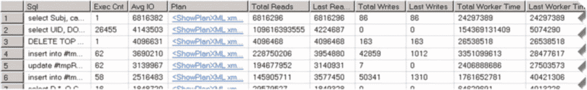

查询结果如 图 7-10 所示，可帮助您快速识别系统中的优化目标。

在我们的示例中，结果集中的第二个查询执行非常频繁，这使它成为理想的优化候选对象，即使它不是系统中最耗资源的查询。显然，您也可以根据其他标准对结果进行排序，例如执行次数、执行时间等。

`图 7-10. Sys.dm_exec_query_stats 查询结果`

不幸的是，`sys.dm_exec_query_stats` 只返回有关执行计划已缓存的查询的信息。因此，对于那些使用 `option (recompile)` 进行语句级重编译的语句，没有统计信息。此外，如果查询最近被重编译过，`execution_count` 数据可能会产生误导。您可以通过关联 `execution_count` 和 `creation_time` 列来检测执行最频繁的查询。

`注意` 我们将在 [第 26 章](http://dx.doi.org/10.1007/978-1-4842-1964-5_26) “计划缓存”中更详细地讨论计划缓存。

从 SQL Server 2008 开始，提供了另一个 DMV `sys.dm_exec_procedure_stats`，它返回有关已缓存执行计划的存储过程的类似信息。`代码清单 7-16` 展示了一个查询，该查询返回前 50 个 I/O 最密集的存储过程列表。图 7-11 显示了该查询在其中一台生产服务器上的运行结果。

`代码清单 7-16. 使用 sys.dm_exec_procedure_stats`
```sql
select top 50

s.name + '.' + p.name as [Procedure]

,qp.query_plan as [Plan]

,(ps.total_logical_reads + ps.total_logical_writes) /

ps.execution_count as [Avg IO]

,ps.execution_count as [Exec Cnt]

,ps.cached_time as [Cached]

,ps.last_execution_time as [Last Exec Time]

,ps.total_logical_reads as [Total Reads]

,ps.last_logical_reads as [Last Reads]

,ps.total_logical_writes as [Total Writes]

,ps.last_logical_writes as [Last Writes]

,ps.total_worker_time as [Total Worker Time]

,ps.last_worker_time as [Last Worker Time]

,ps.total_elapsed_time as [Total Elapsed Time]

,ps.last_elapsed_time as [Last Elapsed Time]

from

sys.procedures as p with (nolock) join sys.schemas s with (nolock) on

p.schema_id = s.schema_id

join sys.dm_exec_procedure_stats as ps with (nolock) on

p.object_id = ps.object_id

outer apply sys.dm_exec_query_plan(ps.plan_handle) qp

order by

[Avg IO] desc

option (recompile);
```

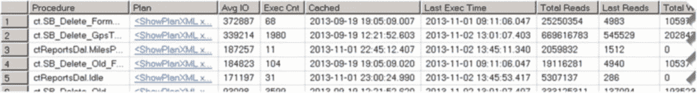

`图 7-11. Sys.dm_exec_procedure_stats 查询结果`


# 第 7 章 ■ 索引的设计与优化

#### 总结

**注意** 我们将在[第 28 章](http://dx.doi.org/10.1007/978-1-4842-1964-5_28) "系统故障排除"中更详细地讨论 `sys.dm_exec_query_stats` 和 `sys.dm_exec_procedure_stats` 视图。

SQL Server 在系统中收集有关缺失索引的信息，并通过一组名称以 `sys.dm_db_missing_index` 开头的 DMV（动态管理视图）来公开这些信息。此外，你可以在 Management Studio 显示的执行计划中看到创建此类索引的建议。

处理有关缺失索引的建议时，有两个注意事项。首先，SQL Server 提出的索引建议仅对正在执行的特定查询有帮助。它并未考虑更新开销、其他查询以及现有索引。例如，如果一个表已经有一个能覆盖查询的索引，只是缺少一个列，SQL Server 会建议创建一个新索引，而不是修改现有索引。

此外，建议的索引有助于提高特定执行计划的性能。SQL Server 不考虑那些可能改变执行计划形态的索引，例如，为查询使用更高效的联接类型。

**重要提示** 严格根据缺失索引 DMV 的建议来创建索引，将导致系统中出现大量冗余和低效的索引。

数据库引擎优化顾问 (DTA) 结果的质量在很大程度上取决于用于分析的工作负载质量。良好且具有代表性的工作负载数据会带来可靠的结果，这远比缺失索引 DMV 提供的建议要好。如果你使用 DTA，请确保捕获的工作负载不仅包含查询，还包含数据修改语句。

无论工具的质量如何，它们都有相同的局限性：它们都是基于现有的数据库架构和代码来分析和调整索引的。除了索引调优之外，通过执行数据库架构和代码重构，你通常可以取得更好的效果。

理想的聚集索引应该是窄的、静态的、唯一的。此外，它应针对表的最重要查询进行优化，并减少碎片。设计一个满足本章提供的所有五项设计准则的聚集索引通常是不可能的。你应该分析系统、业务需求和工作负载，并选择最高效的聚集索引——即使它们违反了其中一些准则。

递增型聚集索引通常具有较低的碎片，因为数据被插入到表的末尾。这类索引的良好示例包括标识列、序列以及持续递增的日期/时间值。虽然对于包含数千甚至数百万行的目录实体来说，这类索引可能是一个不错的选择，但对于插入率很高的超大表，你应该考虑其他选项。

具有随机值的 `Uniqueidentifier` 列由于其高碎片率，很少是索引的良好候选者。如果需要在 `uniqueidentifier` 数据类型上创建索引，你应该使用 `NEWSEQUENTIALID()` 函数来生成键值。

SQL Server 很少使用索引交叉，特别是在 OLTP 工作负载中。通常，拥有一小组包含列的宽复合非聚集索引比一大组窄的单列索引更有益。

在 OLTP 系统中，你应该创建满足最低要求的索引集，以避免索引更新开销。在数据仓库系统中，索引的数量在很大程度上取决于数据刷新策略。你还需要考虑在专用的数据仓库数据库中使用列存储索引。

在向系统添加新索引之前，删除未使用和低效的索引并执行索引整合是很重要的。这可以简化优化过程并减少数据修改开销。SQL Server 通过 `sys.dm_db_index_usage_stats` 和 `sys.dm_db_index_operation_stats` DMO（动态管理对象）提供索引使用统计信息。


# 第二部分

## 其他重要事项

# 第 8 章

## 约束

设计数据库时，使其能够高效地处理和查询数据非常重要。然而，仅此一点还不够。我们必须确保从数据库中获取的数据是可信的。例如，想象一个订单录入系统。我们可以查询 `OrderLineItems` 表来获取我们销售产品的信息，但除非我们知道该表中没有不属于系统中任何订单的孤立行，否则我们无法信任这些结果。

约束允许我们为数据库声明数据完整性和业务规则，并让 SQL Server 强制实施这些规则。它们确保数据在`逻辑上`是正确的，帮助我们在开发早期阶段发现缺陷，并提高系统的可维护性和性能。让我们更详细地了解不同类型的约束。

#### 主键约束

从概念上讲，数据库设计可以分为逻辑设计和物理设计两个阶段。在逻辑数据库设计阶段，我们根据业务需求识别系统中的实体，并定义它们的属性和关系。之后，在物理数据库设计阶段，我们将这些实体映射到数据库表，通过索引定义数据访问策略，并设计跨不同文件组和存储阵列的物理数据放置。

尽管逻辑和物理数据库设计阶段常常混合在一起，但从概念上讲它们是相互独立的，甚至可以由不同的团队执行，尤其是在大型项目中。

`主键约束`定义了在实体或物理数据库设计范围（即表中的一行）中唯一标识一个对象的属性或属性集。在内部，主键约束是作为唯一索引实现的。默认情况下，SQL Server 将主键创建为唯一的聚集索引，尽管这不是必须的。我们可以拥有非聚集主键，甚至可以有没有主键的表。

你可能已经注意到，本书第一部分没有提到主键，而是常规性地使用了`聚集索引`。这是有意为之的。主键在概念上属于逻辑数据库设计范畴，而聚集索引和非聚集索引则是物理数据库设计的一部分。

然而，数据库专业人员常常将两者混为一谈，将聚集索引定义为主键，尽管在某些情况下，从逻辑设计的角度看这是不正确的。例如，考虑一个订单录入系统，其中 `Orders` 表有一个 `OrderId` 标识列。该列唯一标识订单行，将是主键约束的完美候选者。它是聚集还是非聚集主键取决于其他因素，主要是我们如何查询和处理数据。最终，我们会得到类似于代码清单 8-1 所示的结果。

© Dmitri Korotkevitch 2016

D. Korotkevitch, *Pro SQL Server Internals*, DOI 10.1007/978-1-4842-1964-5_8

第 8 章 ■ 约束

***代码清单 8-1.*** `Orders` 表

```
create table dbo.Orders
(
    OrderId int not null identity(1,1),
    -- 其他列
    constraint PK_Orders
        primary key clustered(OrderId)
)
```

`OrderLineItems` 表可能有两个关键列：引用 `Orders` 表行的 `OrderId`，以及 `OrderLineItemId` 标识列。在大多数情况下，我们将使用 `OrderLineItems` 表来


# 第 8 章 ■ 约束

在特定订单的上下文中，查询将以 `OrderId` 作为谓词。因此，该表中聚集索引的自然候选键是 (`OrderId`, `OrderLineItemId`)。然而，将该聚集索引定义为主键在*逻辑上*是错误的——该行可以通过单一的 `OrderLineItemId` 标识列唯一标识，为此我们并不需要 `OrderId`。

我们是否要在 `OrderLineItemId` 上定义非聚集主键，这取决于其他因素。从逻辑设计的角度来看，这样做是正确的，特别是当该表被其他表通过外键约束引用时（我们将在本章后面讨论这一点）。然而，这会引入另一个非聚集索引，我们需要对其进行存储和维护。最终的实现可能类似于代码清单 8-2 中所示的代码。

### 代码清单 8-2. OrderLineItems 表

```sql
create table dbo.OrderLineItems
(
    OrderId int not null,
    OrderLineItemId int not null identity(1,1),
    -- other columns
    constraint PK_OrderLineItems
        primary key nonclustered(OrderLineItemId)
);

create unique clustered index IDX_OrderLineItems_OrderId_OrderLineItemId
    on dbo.OrderLineItems(OrderId,OrderLineItemId);
```

虽然从物理实现的角度来看，主键可以表示为唯一索引，但它们之间存在细微差别。主键列不可为空。另一方面，唯一索引可以在可为空的列上创建，并将 `NULL` 视为常规值。

要记住非常重要的一点是，我们无法更改主键的定义，实际上也无法在不删除并重新创建的情况下更改任何约束的定义。因此，如果主键约束是聚集的，将导致两次表重建。删除约束会移除聚集索引并将表转换为堆表。添加聚集主键会在堆表上创建聚集索引。或者，更改聚集索引的定义将导致一次索引重建。

■ **提示** 如果需要删除并重新创建聚集主键约束，请先禁用非聚集索引。在两个操作都完成后，再启用（重建）它们。这将加快进程，因为非聚集索引只会在操作完成后重建一次，而不是在每个步骤中都重建。

主键通常对系统有益。它们提供更好的数据完整性并提高系统的可维护性。我建议在能够承担在主键列上拥有额外索引的代价时，定义主键。

■ **注意** 某些 SQL Server 功能（如事务复制）要求表必须定义主键。仅定义聚集索引而没有主键是不够的。

因为主键是作为常规索引实现的，所以没有专门针对它们的目录视图。您可以通过查看 `sys.indexes` 目录视图中的 `is_primary_key` 列来确定索引是否被定义为主键。

■ **注意** SQL Server 目录视图允许我们以编程方式获取有关数据库和服务器元数据的信息。[参见 http://technet.microsoft.com/en-us/library/ms174365.aspx](http://technet.microsoft.com/en-us/library/ms174365.aspx) 了解详情。

#### 唯一约束

唯一约束强制实体中的一个或多个属性（在物理世界中即表中的列）值的唯一性。类似于主键，唯一约束也唯一地标识表中的行，但它们可以在可为空的列上创建，从而将 `NULL` 视为可能的值之一。与主键类似，唯一约束属于逻辑数据库设计，在物理级别上实现为唯一的、非聚集索引。


# 第 8 章 ■ 约束

#### 唯一约束

代码清单 8-3 中的代码 展示了一个定义了两个唯一约束的表：一个约束定义在 `SSN` 列上，另一个定义在 `DepartmentCode` 和 `IntraDepartmentCode` 列的组合上。

***代码清单 8-3.*** 定义唯一约束

```sql
create table dbo.Employees
(
    EmployeeId int not null
        constraint PK_Employees primary key clustered,
    Name nvarchar(64) not null,
    SSN char(9) not null
        constraint UQ_Employees_SSN unique,
    DepartmentCode varchar(32) not null,
    IntraDepartmentCode varchar(32) not null,
    constraint UQ_Employees_Codes
        unique(DepartmentCode, IntraDepartmentCode)
)
```

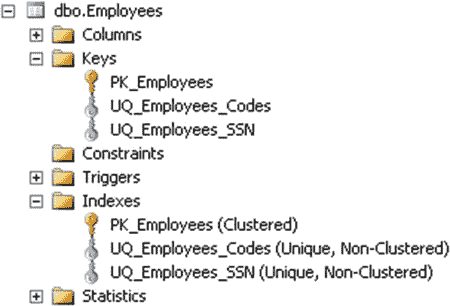

如 图 8-1 所示，SQL Server Management Studio 将唯一（和主键）约束列在两个不同的位置：既在 `键` 节点下，也在 `索引` 节点下。

***图 8-1.** SQL Server Management Studio 中的唯一约束*

通常，当数据具有唯一性时，强制实施唯一性是一个好主意。这有助于保持数据的清洁并避免数据完整性问题。唯一约束还可以帮助查询优化器生成更高效的执行计划。缺点在于，你为定义的每一个唯一性条件都必须维护另一个非聚集索引。在选择实现约束时，需要考虑由此引入的数据修改和索引维护开销。

选择唯一约束还是唯一索引很大程度上取决于个人偏好。唯一性通常以业务需求的形式出现，通过约束来强制实施唯一性有助于提高系统的可维护性。另一方面，唯一索引更灵活。除了强制实施唯一性之外，你还可以包含列并使用这些索引进行查询优化。你还可以指定排序顺序，这在少数情况下会有所帮助。

另外，不删除并重新创建约束，就不可能更改唯一约束的定义。尽管删除约束是一项元数据操作，不会引起数据移动，但在删除约束时有可能会违反唯一性规则。或者，你可以使用 `CREATE INDEX .. WITH (DROP_EXISTING=ON)` 语句，通过原子操作来更改唯一索引的定义。

与主键约束类似，没有专门用于唯一约束的目录视图。`sys.indexes` 目录视图中有一个 `is_unique_constraint` 列，它显示索引是否是作为唯一约束创建的。

#### 外键约束

*外键约束* 标识并强制实施实体/表之间的关系。回想一下我们的 `Orders` 和 `OrderLineItems` 表示例。每个 `OrderLineItems` 行都属于一个对应的 `Orders` 表行，不能独立存在。这类关系就是通过外键约束来强制实施的。

与其他约束一样，外键强制实施数据完整性。处理干净、正确的数据总是比临时清理数据更容易。此外，在开发和测试阶段，外键有助于捕获大量与错误数据处理相关的缺陷。

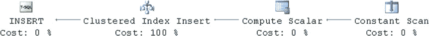

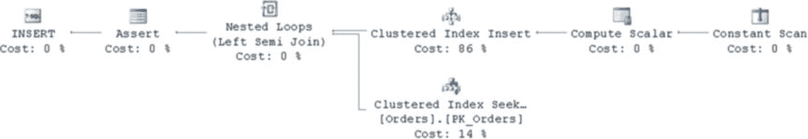

然而，外键是有代价的。每次向*引用*表中插入数据时，你都需要检查*被引用*表中是否存在相应的行。让我们来看一个使用本章前面创建的相同的 `Orders` 和 `OrderLineItems` 表的示例。如 图 8-2 所示，如果在未定义任何外键的情况下向 `OrderLineItems` 表插入一行，查询只需要执行一次聚集索引插入操作。

***图 8-2.** 在未定义外键约束的情况下向引用表插入一行*

现在，让我们给表添加一个外键约束。代码清单 8-4 展示了执行此任务的 `ALTER TABLE` 语句。

### 代码清单 8-4.
向 OrderLineItems 表添加外键约束

```sql
alter table dbo.OrderLineItems with check
add constraint FK_OrderLineItems_Orders
foreign key(OrderId)
references dbo.Orders(OrderId)
```

当你再次运行插入操作时，会看到执行计划发生了变化，如图 8-3 所示。

### 图 8-3.
在定义了外键约束的引用表中插入一行

如你所见，现在的执行计划包含了对 `被引用` (`Orders`) 表的聚集索引查找操作。

SQL Server 需要验证外键约束，确保你正在插入的行项目对应有一个存在的订单行。

现在，让我们看看当你从 `Orders` 表中删除一行时会发生什么。如你在图 8-4 所见，我们的执行计划现在包含了对 `引用` (`OrderLineItems`) 表的聚集索引查找。SQL Server 需要检查是否存在引用了你正在删除的那行的行项目。如果存在这样的行项目，SQL Server 会中止删除操作或执行一些级联操作，这取决于外键约束的规则。

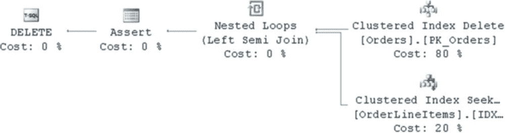

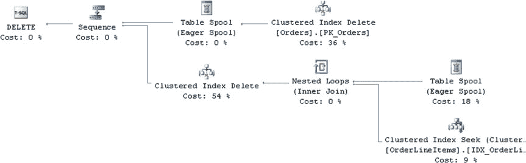

## 第 8 章 ■ 约束

### 图 8-4.
从被引用表中删除一行（无级联操作）

让我们给这个外键约束添加一个 `ON DELETE CASCADE` 操作，如代码清单 8-5 所示。现在当你从 `Orders` 表中删除一行时，SQL Server 需要查找并删除 `OrderLineItems` 表中引用该行的所有行。执行计划如图 8-5 所示。

### 代码清单 8-5.
将约束替换为 `ON DELETE CASCADE` 操作

```sql
alter table dbo.OrderLineItems drop constraint FK_OrderLineItems_Orders;
alter table dbo.OrderLineItems with check
add constraint FK_OrderLineItems_Orders
foreign key(OrderId)
references dbo.Orders(OrderId)
on delete cascade;
```

### 图 8-5.
从被引用表中删除一行（`ON DELETE CASCADE` 操作）

有一件非常重要的事需要记住：当你创建外键约束时，SQL Server 要求你在 `被引用` (`Orders`) 表的 `被引用` (`OrderId`) 列上有一个唯一索引。

然而，并不要求在 `引用` (`OrderLineItems`) 表上也有一个类似的索引。如果你没有这样的索引，任何在引用表上进行的引用完整性检查都会引入扫描操作。为了证明这一点，让我们使用 `DROP INDEX IDX_OrderLineItems_OrderId_OrderLineItemId ON dbo.OrderLineItems` 语句删除 `OrderLineItems` 表上的聚集索引。

现在，当你再次运行删除操作时，会看到如图 8-6 所示的执行计划。

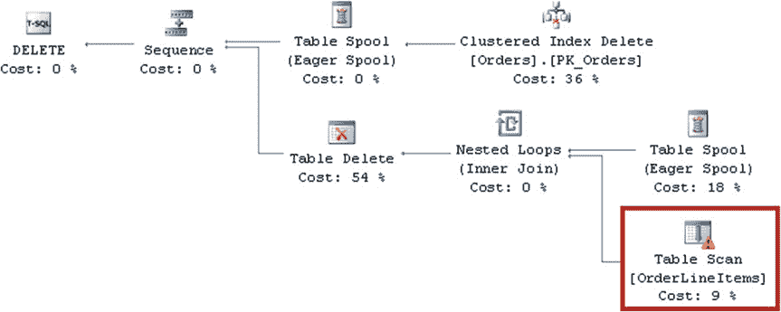

## 第 8 章 ■ 约束

### 图 8-6.
从被引用表中删除一行，但引用列上未指定索引

在表数据量很大的情况下，引用列上缺失索引可能会对性能产生巨大影响。这会导致过多且不必要的 I/O 负载，并可能引发阻塞。此外，除了支持引用完整性，这些索引在表之间的联接操作中也可能很有用。除了极少数例外情况，你应该在创建外键约束时创建这些索引。

在某些情况下，外键约束可以辅助查询优化器。它们可以帮助消除不必要的联接，尤其是在涉及视图时，也能提升数据仓库环境中某些查询的性能。

**注意：** 我们将在[第 10 章](http://dx.doi.org/10.1007/978-1-4842-1964-5_10)“视图”中更详细地讨论联接消除。

不幸的是，外键与某些 SQL Server 功能不兼容。例如，当一个表被分区并且被外键引用时，你无法修改该表并将其分区切换到另一个

# 第 8 章 ■ 约束

## CHECK 约束

*CHECK 约束*通过限制可以放入列或多列组合中的值来强制域完整性。它们指定了一个逻辑表达式，该表达式在每次插入行或修改对应列时都会被计算，当表达式计算结果为 `FALSE` 时，操作将失败。

请参阅清单 8-6 中的示例。

**清单 8-6.** CHECK 约束：表创建

```sql
create table dbo.Accounts
(
  AccountId int not null identity(1,1),
  AccountType varchar(32) not null,
  CreditLimit money null,
  constraint CHK_Accounts_AccountType
    check (AccountType in ('Checking','Saving','Credit Card')),
  constraint CHK_Accounts_CreditLimit_For_CC
    check ((AccountType <> 'Credit Card') or (CreditLimit > 0))
)
```

这里指定了两个 CHECK 约束。第一个约束 `CHK_Accounts_AccountType` 强制 `AccountType` 必须属于三个值之一。第二个约束更复杂，它强制对于信用卡账户，必须提供一个正的 `CreditLimit`。需要记住的一个关键点是，只有当约束表达式计算结果为 `FALSE` 时，数据才会被拒绝。计算结果为 `NULL` 是被接受的。例如，清单 8-7 中所示的 `INSERT` 语句可以正常执行。

**清单 8-7.** CHECK 约束：插入 `NULL` 值

```sql
insert into dbo.Accounts(AccountType, CreditLimit)
values('Credit Card',null)
```

CHECK 约束的主要目的是强制数据完整性，尽管在某些情况下，它们也可以帮助查询优化器并简化执行计划。假设有两张表：一张包含正数，另一张包含负数，如清单 8-8 所示。

**清单 8-8.** CHECK 约束：`PositiveNumbers` 和 `NegativeNumbers` 表创建

```sql
create table dbo.PositiveNumbers
( PositiveNumber int not null );

create table dbo.NegativeNumbers
( NegativeNumber int not null );

insert into dbo.PositiveNumbers(PositiveNumber) values(1);
insert into dbo.NegativeNumbers(NegativeNumber) values(-1);
```

现在，让我们运行一个联接这两张表数据的 `SELECT` 查询。你可以在清单 8-9 中看到该 `SELECT` 语句，在图 8-7 中看到其执行计划。

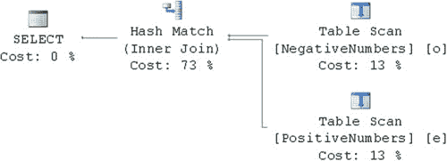
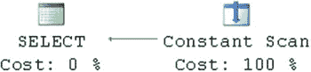

**清单 8-9.** CHECK 约束：未创建 CHECK 约束时联接两张表

```sql
select *
from dbo.PositiveNumbers e join dbo.NegativeNumbers o on
e.PositiveNumber = o.NegativeNumber
```

**图 8-7.** 没有 CHECK 约束时的执行计划

如你所见，`SQL Server` 扫描并联接了两张表。这是合理的。即使我们之前定义了（CHECK 约束）...

### 定义外键约束

定义外键约束通常是件好事，当然，前提是你能接受额外的索引，并且系统能够处理在引用完整性检查期间由索引查找操作带来的轻微性能开销。在 OLTP 系统中，我建议你在引用目录实体（数据量相对较小且静态）时总是创建外键。例如，订单录入系统的目录实体可能包括 `Articles`（商品）、`Customers`（客户）、`Warehouses`（仓库）等。然而，在处理存储数十亿行数据且每秒处理数千次插入的事务性实体时，你需要谨慎。尽管如此，我仍然会在可能的情况下使用外键，不过我会根据具体情况分析其对性能的影响。

有几张目录视图，`sys.foreign_keys` 和 `sys.foreign_key_columns`，提供了数据库中定义的任何外键约束的相关信息。

只要不涉及分区切换，你仍然可以对表进行分区。另一个例子是表截断。当一个表被外键引用时，你无法截断该表。

# 第 8 章 ■ 约束

## 清单 8-10. 检查约束：向表中添加检查约束

```sql
alter table dbo.PositiveNumbers
add constraint CHK_IsNumberPositive
check (PositiveNumber > 0);

alter table dbo.NegativeNumbers
add constraint CHK_IsNumberNegative
check (NegativeNumber < 0);
```

如果再次运行查询，你会看到一个不同的执行计划，如图 8-8 所示。

## 图 8-8. 带有检查约束的执行计划

SQL Server 评估了检查约束，确定它们是**互斥**的，并移除了任何不必要的连接。

> **注意：** 一个必须定义检查约束的非常重要的场景是分区视图的情况。检查约束可以防止访问不必要的表，并极大地提高查询性能。我们将在第 16 章“数据分区”中更详细地讨论分区视图。

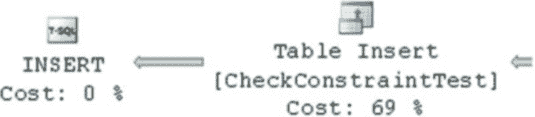

显然，检查约束在数据修改时会引入开销，特别是当从约束中调用函数时。它们会显著降低执行插入或更新数据的批处理操作的性能。

让我们创建一个表，并在不使用检查约束的情况下向其中插入 65,536 行数据。代码如清单 8-11 所示。

## 清单 8-11. 检查约束：创建 CheckConstraintTest 表

```sql
create table dbo.CheckConstraintTest
( Value varchar(32) not null );

with N1(C) as (select 0 union all select 0) -- 2 rows
,N2(C) as (select 0 from N1 as T1 cross join N1 as T2) -- 4 rows
,N3(C) as (select 0 from N2 as T1 cross join N2 as T2) -- 16 rows
,N4(C) as (select 0 from N3 as T1 cross join N3 as T2) -- 256 rows
,N5(C) as (select 0 from N4 as T1 cross join N4 as T2) -- 65,536 rows
,IDs(ID) as (select row_number() over (order by (select null)) from N5)
insert into dbo.CheckConstraintTest(Value)
select 'ABC' from IDs;
```

你可以在图 8-9 中看到将数据插入表的那部分执行计划。

## 图 8-9. 执行计划的一部分：无检查约束的插入

在我的计算机上，执行时间如下：
SQL Server 执行时间：
CPU 时间 = 78 毫秒，经过时间 = 87 毫秒。

现在，我们向该表添加一个检查约束，看看它如何影响 `INSERT` 操作的性能。代码如清单 8-12 所示。

## 清单 8-12. 检查约束：向 CheckConstraintTest 表添加检查约束

```sql
alter table dbo.CheckConstraintTest with check
add constraint CHK_CheckConstraintTest_Value
check (Value = 'ABC')
```

如图 8-10 所示，执行计划中由检查约束引入了两个额外的操作，这导致了更长的执行时间。

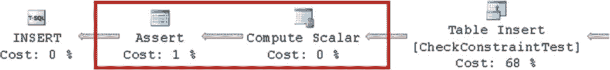

## 图 8-10. 执行计划的一部分：带检查约束的插入

在我的计算机上，执行时间如下：
SQL Server 执行时间：
CPU 时间 = 93 毫秒，经过时间 = 118 毫秒。

现在，让我们看看当从检查约束中调用系统函数时会发生什么。我们更改约束定义，如清单 8-13 所示。

## 清单 8-13. 检查约束：用一个调用系统函数的约束替换原检查约束

```sql
alter table dbo.CheckConstraintTest
drop constraint CHK_CheckConstraintTest_Value;

alter table dbo.CheckConstraintTest with check
add constraint CHK_CheckConstraintTest_Value
check (Right(Value, 1) = 'C');
```

我们再次运行插入操作后，执行时间如下：
SQL Server 执行时间：
CPU 时间 = 109 毫秒，经过时间 = 131 毫秒。

# 第 8 章 ■ 约束

虽然系统函数不一定会带来巨大的 CPU 负载和执行时间开销，但用户定义函数（UDF）的情况就不同了。让我们创建一个简单的 UDF，看看它如何影响性能。代码如清单 8-14 所示。

**清单 8-14.** 检查约束：用调用 UDF 函数的约束替换原有的检查约束

```sql
create function dbo.DummyCheck(@Value varchar(32))
returns bit
with schemabinding
as
return (1);
go

alter table dbo.CheckConstraintTest
drop constraint CHK_CheckConstraintTest_Value;

alter table dbo.CheckConstraintTest
add constraint CHK_CheckConstraintTest_Value
check (dbo.DummyCheck(Value) = 1);
```

当我们再次运行相同的 `INSERT` 语句时，执行时间如下：

```text
SQL Server 执行时间:
CPU 时间 = 375 ms，耗时 = 475 ms。
```

可以看到，与未指定检查约束时相比，现在运行所需时间是原来的五倍。

> **注意** 我们将在[第 11 章](http://dx.doi.org/10.1007/978-1-4842-1964-5_11)“函数”中更详细地讨论用户定义函数的性能影响。

与其他约束类型一样，检查约束有助于我们强制执行数据完整性，并且在某些情况下可以带来更好的执行计划。只要您能接受它们在数据修改期间引入的开销，使用它们是一个好主意。您可以从 `sys.check_constraints` 目录视图获取有关检查约束的信息。

#### 总结

在处理外键和检查约束时，另一件需要牢记的重要事情是约束是否受信任。当约束不受信任时，SQL Server 不会保证表中的所有数据都符合约束规则。此外，在查询优化阶段，SQL Server 不会考虑不受信任的约束。您可以通过检查相应目录视图中的 `is_not_trusted` 列来查看约束是否受信任。

无论约束是否受信任，SQL Server 都会在数据修改期间对其进行验证。拥有不受信任的约束并不意味着 SQL Server 允许违反它。它意味着在创建约束时，旧数据未被验证。

> **注意** 在某些情况下，SQL Server 仍然可以从不受信任的外键约束中受益。当表结构属于数据仓库环境中的星型或雪花型模式时，它们可以触发查询优化器探索额外的连接策略（星型连接扩展）。

您可以通过使用 `ALTER TABLE` 语句的 `WITH CHECK` / `WITH NOCHECK` 参数来控制约束是否创建为受信任。使用 `WITH CHECK` 条件，您强制 SQL Server 验证现有数据是否符合约束规则，这将导致表扫描。这里的问题是，此类操作需要架构修改（`Sch-M`）锁，这使得其他会话无法访问该表。对于大表，这种扫描可能非常耗时。或者，使用 `WITH NOCHECK` 条件创建不受信任的约束是一项元数据操作。

> **注意** 我们将在[第 23 章](http://dx.doi.org/10.1007/978-1-4842-1964-5_23)“架构锁”中更详细地讨论架构锁。

最后，您始终需要显式命名约束，即使这不是强制性要求，因为处理自动生成的名称很不方便。对于自动生成的名称，每次以编程方式访问约束时，您都需要查询目录视图。使用自动生成的名称也会降低系统的可支持性。例如，如果不深入探究细节，很难知道名为 `CK__A__3E52440B` 的约束是做什么的。

我建议您选择最适合您的命名约定，并在整个系统中使用。细节并不重要，只要它是一致的，并且最好能提供关于

# 摘要

主键约束定义了表中唯一标识一行的列或列集。在内部，主键约束是作为唯一索引实现的，可以是聚集索引或非聚集索引。

外键约束定义了系统中表之间的关系。它们有助于提高数据库中的数据质量；然而，它们会在引用完整性检查时引入一些开销。在可能的情况下，重要的是在引用表的引用列上定义索引。

检查约束通过限制你可以放入列或行中多列的值来强制域完整性。与外键约束一样，它们有助于提高系统中的数据质量，代价是在数据修改期间进行验证的开销。你应该考虑这种开销，尤其是在使用用户定义函数来验证约束的情况下。

外键和检查约束可以是可信的或不可信的。SQL Server 在创建阶段不会验证不可信的约束；但是，它会在约束创建后执行验证。在大多数情况下，查询优化器在查询优化期间不依赖于不可信的约束。

# 第 9 章 触发器

触发器定义了响应特定事件而运行的代码。SQL Server 中有三种类型的触发器，如下所示：

1.  DML 触发器在发生数据修改时触发。当你需要在数据修改期间强制执行特定的业务规则，并且系统没有实现专用的数据访问层时，可以使用 DML 触发器。你可以将捕获谁更改了表中数据的审计跟踪功能视为一个示例。当多个应用程序直接与数据库交互时，基于触发器的审计跟踪实现是最简单的。
2.  DDL 触发器在响应更改数据库和服务器对象的事件时触发。你可以使用 DDL 触发器来防止或审计这些更改；例如，删除表、修改存储过程或创建新登录名。
3.  登录触发器在用户登录过程中触发。你可以将触发器用于审计目的，也可以在需要时阻止用户登录系统。

## DML 触发器

DML 触发器允许你定义在数据修改操作（如 `INSERT`、`UPDATE`、`DELETE` 或 `MERGE`）期间将执行的代码。DML 触发器有两种类型：`INSTEAD OF` 和 `AFTER` 触发器。

`INSTEAD OF` 触发器作为对表或视图上实际数据修改操作的*替代*运行。使用这些类型的触发器，你可以评估和/或实施业务规则。如果你希望修改数据，还需要对表发出实际的 DML 语句。`AFTER` 触发器在数据修改操作之后、表中的数据已被更改时触发。

© Dmitri Korotkevitch 2016

D. Korotkevitch, *Pro SQL Server Internals*, DOI 10.1007/978-1-4842-1964-5_9

第 9 章 ■ 触发器

让我们看看当我们将数据插入到具有已定义触发器和约束的表中时会发生什么。首先，让我们使用清单 9-1 中显示的代码创建一个表。

***清单 9-1.*** 将数据插入表：创建表和两个触发器

```
create table dbo.OrderLineItems
(
    OrderId int not null,
    OrderLineItemId int identity(1,1) not null,
    ProductId int not null,
```


# 第 9 章 ■ 触发器

```sql
(
    ProductName nvarchar(64) not null,
    CreationDate smalldatetime not null,
    constraint DEF_OrderLineItems_CreationDate
        default GetUtcDate(),
    Quantity decimal(9,3) not null,
    Price smallmoney not null,
    constraint PK_OrderLineItems
        primary key clustered(OrderId, OrderLineItemId),
    constraint CHK_OrderLineItems_PositiveQuantity
        check (Quantity > 0),
    constraint FK_OrderLineItems_Orders
        foreign key(OrderId)
            references dbo.Orders(OrderId),
    constraint FK_OrderLineItems_Products
        foreign key(ProductId)
            references dbo.Products(ProductId)
)
go

create trigger trg_OrderLineItems_InsteadOfInsert on dbo.OrderLineItems
instead of insert
as
begin
    if @@rowcount = 0
        return;

    set nocount on

    if not exists(select * from inserted)
        return;

    insert into dbo.OrderLineItems(OrderId, ProductId, ProductName, Quantity, Price)
    select i.OrderId, i.ProductId, p.ProductName, i.Quantity, i.Price
    from inserted i join dbo.Products p on
        i.ProductId = p.ProductId;
end
go

create trigger trg_OrderLineItems_AfterInsert on dbo.OrderLineItems
after insert
as
begin
    if @@rowcount = 0
        return;

    set nocount on

    if not exists(select * from inserted)
        return;

    if exists
    (
        select *
        from inserted i join dbo.Orders o on
            i.OrderId = o.OrderId
        where o.Status = 'CLOSED'
    )
    begin
        raiserror('Cannot change the closed order',16,1);
        rollback tran;
        return;
    end
end
go
```

该表既有主键和外键，也有默认值和检查约束。同时还定义了 `INSTEAD OF` 和 `AFTER` 触发器。让我们来看看当我们对该表执行一条 `INSERT` 语句时会发生什么，如代码清单 9-2 所示。

### 代码清单 9-2. 向表中插入数据：Insert 语句

```sql
insert into dbo.OrderLineItems(OrderId, ProductId, ProductName, Quantity, Price)
values(@OrderId, @ProductId, @ProductName, @Quantity, @Price)
```

第一步，SQL Server 会创建并填充 `inserted` 和 `deleted` 虚拟表，这些表包含了受 `DML` 语句影响的行的新版本和旧版本的信息。这些表在 `INSTEAD OF` 触发器中是可访问的。在我们的例子中，`inserted` 表将包含一行，其值就是我们在 `INSERT` 语句中提供的值，而 `deleted` 表将为空，因为在插入时不存在该行的“旧”版本。我们将在本章后面讨论这些表，但现在让我们记住一件非常重要的事情：`DML 触发器具有语句作用域，无论影响了多少行，它都只会被激发一次。虚拟表可能包含多行，其实现需要正确处理这种情况。`

下一步，SQL Server 激发 `trg_OrderLineItems_InsteadOfInsert` 这个 `INSTEAD OF` 触发器。在触发器中，我们实现了业务逻辑并对实际表执行了一条 `INSERT` 语句。我们实现的这个触发器忽略了原始 `INSERT` 语句提供的 `ProductName` 值，并用从 `Products` 表中获取的实际产品名称替换了它。内连接也过滤掉了在系统中没有对应产品的行。即使我们通过外键约束强制实施相同的规则，这种实现的行为也是不同的。违反外键约束会终止整个批处理而不插入任何行，而触发器中的连接只是过滤掉不正确的行并插入正确的行。

**提示** 是否应该采用这种方法——即忽略不正确的行而不是终止整个批处理，取决于业务需求。尽管在某些情况下这可能有帮助，但它会使系统故障排查变得复杂。至少，我建议你在系统中的某个地方记录有关被跳过行的信息。

当 `INSTEAD OF` 触发器运行 `INSERT` 语句时，SQL Server 按顺序执行以下任务：

1.  它将默认约束值赋给 `CreationDate` 列。
2.  它验证表中的 `not null`、主键、唯一、检查约束以及唯一索引，如果发生约束或唯一性违规，则终止该语句。


# 第 9 章 ■ 触发器

它会检查引用完整性，并在外键约束违规时终止语句。否则，它会将新行插入表中。

**注意**

在发生约束或索引唯一性违规时，`AFTER`触发器不会触发。

最后，我们创建了新的`inserted`和`deleted`表，并且`AFTER`触发器被触发。此时，新行已被插入表中，如果我们需要回滚更改，`SQL Server`将撤销`INSERT`操作。在前面的例子中，将订单状态检查实现为`INSTEAD OF`触发器的一部分，会比实现为`AFTER`触发器更高效。

正如我已经提到的，触发器是在语句级别而非行级别运行的。我们的实现需要在`inserted`和`deleted`表包含多行时也能正确工作。例如，代码清单 9-3 中的实现会失败并抛出异常，因为如果更新了多行，在集合运算符中使用的子查询返回了多行。

**代码清单 9-3.** 触发器实现：错误的实现

```sql
create trigger Trg_OrderLineItems_AfterUpdate_Incorrect on dbo.OrderLineItems
after update
as
begin
-- Some code here
declare
    @OrderId int;
set @OrderId = (select OrderId from inserted);
-- Some code here
end
```

错误信息：
`Msg 512, Level 16, State 1, Procedure Trg_OrderLineItems_AfterUpdate_Incorrect, Line 9`
`Subquery returned more than 1 value. This is not permitted when the subquery follows =, !=, <, <= , >, >= or when the subquery is used as an expression.`

另外，即使`DML`语句没有改变（`INSERT`、`UPDATE`或`DELETE`）任何数据，触发器也会触发。在这种情况下，`inserted`表和`deleted`表都将是空的。为了创建高效的实现，你需要在触发器开头进行一些检查，以防止执行不必要的代码。让我们再次看一下我们的实现，如代码清单 9-4.所示。

**代码清单 9-4.** 触发器实现：防止执行不必要的代码

```sql
create trigger trg_OrderLineItems_InsteadOfInsert on dbo.OrderLineItems
instead of insert
as
begin
    if @@rowcount = 0
        return;
    set nocount on
    if not exists(select * from inserted)
        return;
    -- Some code here
end
```

触发器中的第一条语句——`if @@rowcount = 0`——检查`INSERT`语句是否确实插入了任何行。例如，你可以考虑`insert/select`模式，其中`SELECT`查询没有返回任何数据。你希望避免在这种情况下执行触发器代码。

第二条语句——`set nocount on`——阻止`SQL Server`返回显示触发器中代码影响行数的消息。某些客户端库无法正确处理多条消息。

最后一条语句——`if not exists(select * from inserted)`——则更为微妙。虽然`@@rowcount`可以帮助你检测到没有行受`INSERT`、`UPDATE`或`DELETE`语句影响的情况，但它对`MERGE`操作符不太有效。该操作符在`SQL Server 2008`中引入，允许你将所有三个操作合并到单个语句中。即使没有相应的操作，触发器也会触发。触发器中的`@@rowcount`代表`MERGE`语句影响的总行数。

让我们创建一个简单的表和三个触发器，用于显示`@@rowcount`的值以及`inserted`和`deleted`表中的行数。你可以在代码清单 9-5 中看到此代码。同样值得指出的是，从触发器中返回任何结果集是非常糟糕的做法，因为它很容易破坏客户端应用程序。

**代码清单 9-5.** 触发器与`MERGE`语句：创建表和三个触发器

```sql
create table dbo.Data(Col int not null);
create trigger trg_Data_AI on dbo.Data
after insert
as
select
    'After Insert' as [Trigger]
    ,@@RowCount as [RowCount]
    ,(select count(*) from inserted) as [Inserted Cnt]
```

# 第 9 章：触发器

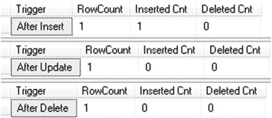

```sql
create trigger trg_Data_AU on dbo.Data
after update
as
select
    'After Update' as [Trigger]
    ,@@RowCount as [RowCount]
    ,(select count(*) from inserted) as [Inserted Cnt]
    ,(select count(*) from deleted) as [Deleted Cnt];
```

```sql
create trigger trg_Data_AD on dbo.Data
after delete
as
select
    'After Delete' as [Trigger]
    ,@@RowCount as [RowCount]
    ,(select count(*) from inserted) as [Inserted Cnt]
    ,(select count(*) from deleted) as [Deleted Cnt];
```

现在，让我们运行`MERGE`语句，如清单 9-6 所示。

***清单 9-6.*** 触发器与`MERGE`语句：`MERGE`

```sql
merge into dbo.Data as Target
using (select 1 as [Value]) as Source
on Target.Col = Source.Value
when not matched by target then
    insert(Col) values(Source.Value)
when not matched by source then
    delete
when matched then
    update set Col = Source.Value;
```

由于`dbo.Data`表为空，`MERGE`语句将在其中插入一行。让我们看看触发器的输出，如图 9-1 所示。

***图 9-1.** `@@rowcount`、`inserted`和`deleted`表与`MERGE`运算符*

如您所见，所有三个触发器都被触发了。在每个触发器中，`@@rowcount`代表了受`MERGE`影响的行数。然而，对于`AFTER UPDATE`和`AFTER DELETE`触发器，`inserted`和`deleted`表是空的。为了防止触发器中的代码执行，您需要检查这些表的内容。

正如您所猜测的，触发器存在开销。至少，当存在触发器时，SQL Server 需要创建`inserted`和`deleted`虚拟表。SQL Server 不会分析触发器内是否有引用这些表的逻辑，而是简单地始终创建它们。

虽然`INSTEAD OF`触发器相关的开销并不特别大，但`AFTER`触发器的情况并非如此。`AFTER`触发器将这些表中的数据存储在`tempdb`的特殊部分，称为*版本存储*，并将其保留到事务完成之后。

> **注意** SQL Server 使用版本存储来维护行的多个版本，并支持多种功能，例如乐观事务隔离级别、在线索引、多个活动结果集（MARS）和触发器。我们将在[第 21 章](http://dx.doi.org/10.1007/978-1-4842-1964-5_21)“乐观隔离级别”中更详细地讨论它。

虽然版本存储的使用引入了额外的`tempdb`负载，但还有另一个重要因素您需要牢记。为了维护行的新旧版本之间的链接，`AFTER UPDATE`和`AFTER DELETE`触发器向它们修改或删除的行添加一个 14 字节的版本标记指针，该指针将一直保留到索引被重建。这可能会增加行的大小并引入类似于[第 6 章“索引碎片”](http://dx.doi.org/10.1007/978-1-4842-1964-5_6)中讨论的插入/更新模式的碎片。

让我们看一个例子，并创建一个包含一些数据的表，如清单 9-7 所示。

***清单 9-7.*** 触发器和碎片：表创建

```sql
create table dbo.Data
(
    ID int not null identity(1,1),
    Value int not null,
    LobColumn varchar(max) null,
    constraint PK_Data
        primary key clustered(ID)
);

;with N1(C) as (select 0 union all select 0) -- 2 rows
,N2(C) as (select 0 from N1 as T1 cross join N1 as T2) -- 4 rows
,N3(C) as (select 0 from N2 as T1 cross join N2 as T2) -- 16 rows
,N4(C) as (select 0 from N3 as T1 cross join N3 as T2) -- 256 rows
,N5(C) as (select 0 from N4 as T1 cross join N4 as T2 ) -- 65,536 rows
,Numbers(Num) as (select row_number() over (order by (select null)) from N5)
insert into dbo.Data(Value)
select Num from Numbers;
```

现在，让我们删除表中每隔一行的数据，在操作前后查看索引的物理统计信息。


# 第 9 章 ■ 触发器

## 清单 9-8. 触发器与碎片化：删除前后的物理索引统计信息

```sql
select
    alloc_unit_type_desc as [分配单元],
    index_level,
    page_count,
    avg_page_space_used_in_percent as [空间使用率],
    avg_fragmentation_in_percent as [碎片 %]
from sys.dm_db_index_physical_stats(DB_ID(),OBJECT_ID(N'dbo.Data'),1,null,'DETAILED');

delete from dbo.Data where ID % 2 = 0;

select
    alloc_unit_type_desc as [分配单元],
    index_level,
    page_count,
    avg_page_space_used_in_percent as [空间使用率],
    avg_fragmentation_in_percent as [碎片 %]
from sys.dm_db_index_physical_stats(DB_ID(),OBJECT_ID(N'dbo.Data'),1,null,'DETAILED');
```

## 图 9-2. 无 AFTER DELETE 触发器时，执行 DELETE 语句后的聚集索引物理统计信息


您应该记得，`DELETE` 操作并不会从页面物理移除行；它只是将行标记为幽灵行。在我们的示例中，唯一改变的是页面上的可用空间量。

现在，让我们截断该表，并使用 **清单 9-9** 中所示的代码，用与之前相同的数据重新填充它。

## 清单 9-9. 触发器与碎片化：用数据填充表

```sql
truncate table dbo.Data;

;with N1(C) as (select 0 union all select 0) -- 2 行
,N2(C) as (select 0 from N1 as T1 cross join N1 as T2) -- 4 行
,N3(C) as (select 0 from N2 as T1 cross join N2 as T2) -- 16 行
,N4(C) as (select 0 from N3 as T1 cross join N3 as T2) -- 256 行
,N5(C) as (select 0 from N4 as T1 cross join N4 as T2 ) -- 65,536 行
,Numbers(Num) as (select row_number() over (order by (select null)) from N5)
insert into dbo.Data(Value)
select Num from Numbers;
```


接下来，让我们在表上创建一个空的 `AFTER DELETE` 触发器，如 **清单 9-10** 所示。

## 清单 9-10. 触发器与碎片化：创建触发器

```sql
create trigger trg_Data_AfterDelete
on dbo.data
after delete
as
return;
```

如果您运行与之前相同的删除语句，您将看到如 **图 9-3** 所示的结果。

## 图 9-3. 有 AFTER DELETE 触发器时，执行 DELETE 语句后的聚集索引物理统计信息

版本控制标签增大了行的大小，并导致在 `DELETE` 操作期间发生大量的页拆分和碎片化。此外，最终我们几乎使索引中的页数翻了一番。

**注意** 在某些情况下，当只涉及行内分配时（例如，当表没有 `LOB` 列或可变长度列——这些列可能需要将数据存储在行溢出页中），SQL Server 会优化该行为，不会向行添加 14 字节的版本控制标签。

触发器始终与触发生它的语句在同一个事务中运行。我们需要使触发器执行时间尽可能短，以最小化锁的持有时间。如果触发器包含可以在事务外执行的复杂逻辑，您可以考虑使用 Service Broker 来实现该逻辑。触发器可以向 Service Broker 发送一条消息，Service Broker 随后可以执行一个实现该逻辑的激活存储过程。

**注意** Service Broker 的内容超出了本书的范围。您可以在 [`msdn.microsoft.com/en-us/library/bb522893.aspx`](https://msdn.microsoft.com/en-us/library/bb522893.aspx) 上阅读相关信息。

## DDL 触发器

DDL 触发器允许您定义响应各种 DDL 事件（如数据库对象的创建、更改或删除；权限更改；以及更新统计信息）而执行的代码。您可以将这些触发器用于审核目的，以及限制对数据库架构的某些操作。


# 第 9 章 ■ 触发器

例如，清单 9-11 中所示的触发器可以防止意外修改或删除表，它可以作为生产环境中的一个安全特性来使用。

### 清单 9-11. DDL 触发器：防止在生产环境中修改和删除表

```sql
create trigger trg_PreventAlterDropTable on database
for alter_table, drop_table
as
begin
    print 'Table cannot be altered or dropped with trgPreventAlterDropTable trigger enabled' ;
    rollback;
end
```

虽然这种方法有助于保持表及其架构的完整性，但它引入了一个潜在问题。DDL 触发器是在操作完成后*触发*的。因此，以我们的示例为例，如果你有一个会话正在修改表，SQL Server 会先执行修改操作，然后触发器才会触发并回滚所有更改。

现在让我们来验证一下。第一步，我们修改触发器，以便在执行期间捕获有关表结构的信息，然后在触发时显示表中的列列表。你可以在清单 9-12 中看到完成此操作的代码。

### 清单 9-12. DDL 触发器：触发器代码

```sql
alter trigger trg_PreventAlterDropTable on database
for alter_table
as
begin
    declare
        @objName nvarchar(257) =
            eventdata().value('/EVENT_INSTANCE[1]/SchemaName[1]','nvarchar(128)') +
            '.' + eventdata().value('/EVENT_INSTANCE[1]/ObjectName[1]','nvarchar(128)');

    select column_id, name
    from sys.columns
    where object_id = object_id(@objName);

    print 'Table cannot be altered or dropped with trgPreventAlterDropTable trigger enabled'
    rollback;
end
```


现在，我们运行 `ALTER TABLE` 语句，向表中添加一个持久化计算列，在执行期间捕获 I/O 统计信息。你可以在清单 9-13 中看到执行此操作的代码。

### 清单 9-13. DDL 触发器：ALTER TABLE 语句

```sql
set statistics io on;
alter table Delivery.Addresses add NewColumn as AddressId persisted;
```

此次修改为表中的每一行数据都添加了另一个列。我们可以在图 9-4 中看到结果。

### 图 9-4. 包含操作 I/O 统计信息的 DDL 触发器中的表结构

如你所见，当触发器触发时，表已经被修改，并且创建了一个名为 `NewColumn` 的新列。因此，当触发器回滚事务时，SQL Server 需要撤销表修改操作。这个过程可能效率非常低，尤其是对于大表。

正如你已经看到的，我们正在触发器内部使用 `EVENTDATA()` 函数来获取有关 DDL 事件的信息。该函数返回一个 `xml` 值，其中包含事件类型、会话和 DDL 命令、受影响对象以及其他属性的信息。例如，在我们的示例中，你会得到以下 XML 代码：

```xml
<EVENT_INSTANCE>
    <EventType>ALTER_TABLE</EventType>
    <PostTime>2015-11-28T12:26:44.453</PostTime>
    <SPID>54</SPID>
    <ServerName>SQL2016</ServerName>
    <LoginName>SQL2016\Administrator</LoginName>
    <UserName>dbo</UserName>
    <DatabaseName>SqlServerInternals</DatabaseName>
    <SchemaName>Delivery</SchemaName>
    <ObjectName>Addresses</ObjectName>
    <ObjectType>TABLE</ObjectType>
    <AlterTableActionList>
        <Create>
            <Columns>
                <Name>NewColumn</Name>
            </Columns>
        </Create>
    </AlterTableActionList>
    <TSQLCommand>
        <SetOptions ANSI_NULLS="ON" ANSI_NULL_DEFAULT="ON" ANSI_PADDING="ON" QUOTED_IDENTIFIER="ON" ENCRYPTED="FALSE" />
        <CommandText>alter table Delivery.Addresses add NewColumn as AddressId persisted</CommandText>
    </TSQLCommand>
</EVENT_INSTANCE>
```

DDL 触发器可以在服务器或数据库范围内创建。某些 DDL 事件——例如 `CREATE_DATABASE`——要求触发器具有服务器范围。其他事件——例如 `ALTER_TABLE`——则可以使用两者中的任一范围。当在此类触发器在服务器范围内创建时，它会在该服务器上任何数据库中发生相应事件时触发。


在 SQL Server Management Studio 中，数据库级 DDL 触发器位于数据库的 *可编程性* 节点下。服务器级 DDL 触发器则显示在 *服务器对象* 节点下。您也可以使用 `sys.triggers` 和 `sys.server_triggers` 目录视图通过 T-SQL 来查找它们。

#### 登录触发器

登录触发器在用户成功通过服务器验证后、但会话建立之前触发。您可以使用登录触发器的场景包括：防止同一用户打开多个数据库连接，或根据某些自定义标准限制对系统的访问。

清单 9-14 中的触发器可防止 `HRLogin` 登录名在非工作时间访问系统。

### 清单 9-14. 登录触发器

```sql
create trigger trg_Logon_BusinessHoursOnly
on all server
for logon
as
begin
    declare
        @currTime datetime = current_timestamp;
    if original_login() = 'HRLogin' and
       ( -- Check if today is weekend
         ((@@datefirst + datepart(dw, @currTime)) % 7 in (0,1)) or
         (cast(@currTime as time) >= '18:00:00') or
         (cast(@currTime as time) < '8:00:00')
       )
        rollback;
end
```

与 DDL 触发器类似，有一个 `EVENTDATA()` 函数，它返回包含有关登录事件附加信息的 XML。以下是此 XML 代码的示例：

```xml
<EVENT_INSTANCE>
    <EventType>LOGON</EventType>
    <PostTime>2016-11-18T17:55:40.090</PostTime>
    <SPID>55</SPID>
    <ServerName>SQL2016</ServerName>
    <LoginName>SQL2016\Administrator</LoginName>
    <LoginType>Windows (NT) Login</LoginType>
    <SID>sid</SID>
    <ClientHost>&lt;local machine&gt;</ClientHost>
    <IsPooled>0</IsPooled>
</EVENT_INSTANCE>
```

您需要确保登录触发器执行得尽可能快，以防止可能的连接超时。如果触发器访问响应时间无法保证的外部资源，则必须非常小心。例如，考虑一个执行额外公司 Active Directory 身份验证的 CLR 函数。该函数需要为 AD 查询设置短超时时间，并正确处理可能的异常。否则，将无人能登录到 SQL Server。

#### UPDATE() 和 COLUMNS_UPDATED() 函数

`UPDATE()` 和 `COLUMNS_UPDATED()` 函数允许您检查特定列是否受到 `INSERT` 或 `UPDATE` 操作的影响。

`UPDATE()` 函数接受列名作为参数，并返回一个布尔值，显示该列是否受到触发触发器的语句的影响。对于 `INSERT` 操作，它总是返回 `TRUE`。对于 `UPDATE` 操作，如果尝试更新某列，或者更具体地说，如果该列出现在需要更新的列列表中，**无论其值是否发生了变化**，它都会返回 `TRUE`。例如，在清单 9-15 中，`UPDATE` 语句并未更改行中列 `C` 的值。然而，触发器中的 `UPDATE(C)` 函数返回 `TRUE`，因为列 `C` 被包含在 `UPDATE` 语句的列列表中。

### 清单 9-15. UPDATE() 函数行为

```sql
create trigger trg_T_AU
on dbo.T
after update
as
begin
    -- Some code here
    if update(C)
    -- Some code here
end
go

declare @V int = null;
update T set C = IsNull(@V, C) where ID = 1;
```

清单 9-16 展示了一个触发器的示例，当订单项价格或数量发生变化时，该触发器会重新计算订单总额。

### 清单 9-16. UPDATE() 函数实现示例

```sql
create trigger trg_OrderLineItems_AfterUpdate
on dbo.OrderLineItems
after update
as
begin
    -- Some code here
    if update(Quantity) or update(Price)
    begin
        -- recalculating order total
        update o
        set
            o.Total =
            ( select sum(li.Price * li.Quantity)
              from dbo.OrderLineItems li
              where li.OrderId = o.OrderId )
        from dbo.Orders o
        where o.OrderId in (select OrderId from inserted);
    end;
    -- Some code here
end
```

`COLUMNS_UPDATED()` 函数返回一个 `varbinary` 值，它表示一个位掩码，其中每一位...


如果列受语句影响，则设置为 1。位的顺序，从最低有效位到最高有效位，对应于 `sys.columns` 目录视图中的 `column_id` 值。

假设 `Quantity` 列的 `column_id` 为 4，`Price` 列的 `column_id` 为 5，我们可以将 `if` 运算符替换为以下位掩码比较：`if columns_updated() & 24 <> 0`。

整数值 24 代表二进制值 11000。如果 `columns_updated` 函数返回的相应位中任一为 1，则按位 `&`（与）运算符的结果将不等于 0。

#### 嵌套和递归触发器

当 DDL 和 DML 触发器的操作引发其他表中的触发器时，它们就是嵌套的。例如，你可以在表 A 上有一个 `AFTER UPDATE` 触发器，该触发器更新表 B，而表 B 自己定义了 `AFTER UPDATE` 触发器。启用嵌套触发器时，表 B 上的触发器将被触发。你可以通过设置 `nested triggers` 服务器配置选项来控制该行为。清单 9-17 中的代码禁用了嵌套触发器的执行。

***清单 9-17.*** 禁用嵌套触发器

```sql
EXEC sp_configure 'show advanced options', 1;
GO
RECONFIGURE;
GO
EXEC sp_configure 'nested triggers', 0;
GO
RECONFIGURE;
GO
```

默认情况下，嵌套触发器执行是启用的。在无限循环的情况下，当嵌套层级超过 32 时，SQL Server 会终止执行并回滚事务。

另一个数据库选项 `recursive_triggers` 控制 `AFTER` 触发器是否可以触发自身。有两种类型的递归。对于*直接递归*，触发器通过对其定义所在的表执行相同操作来触发自身；例如，当一个 `AFTER UPDATE` 触发器更新同一张表时。默认情况下，直接递归是禁用的。而*间接递归*发生在表 A 执行操作引发表 B 中的触发器，而表 B 中的触发器执行操作又引发表 A 中的同一触发器时。为了防止间接递归发生，我们需要在服务器级别禁用 `nested triggers` 配置选项。

■ **注意** 更改 `nested triggers` 或 `recursive triggers` 选项时需要小心。开发人员通常依赖默认的触发器行为，更改这些选项可能会破坏现有系统。

## 首个和最后一个触发器

当一个表有多个 `AFTER` 触发器时，你可以使用系统存储过程 `sp_settriggerorder` 来指定哪些触发器最先和最后触发。例如，清单 9-18 中的代码使 `trg_Data_AUAudit` 成为执行中的第一个触发器。

***清单 9-18.*** 指定触发器的执行顺序

```sql
sp_settriggerorder @triggername = 'trg_Data_AUAudit', @order = 'first',
                   @stmttype = 'UPDATE'
```

每个操作——`INSERT`、`UPDATE` 和 `DELETE`——都可以指定各自的首个和最后一个触发器。当触发器被修改时，该值将被清除。

无法以任何其他方式控制触发器的触发顺序。

#### CONTEXT_INFO 和 SESSION_CONTEXT

每个会话最多关联 128 字节的二进制数据值，称为上下文信息。该值具有会话范围，当你需要向触发器传递参数或从触发器传出参数时可以使用它。

你可以使用 `SET CONTEXT_INFO` 语句设置该值，并使用 `CONTEXT_INFO` 函数检索它。

例如，让我们修改 DDL 触发器 `trg_PreventAlterDropTable`，以允许当上下文信息包含字符串 `ALLOW_TABLE_ALTERATION` 时修改表。实现此目的的代码如清单 9-19 所示。

***清单 9-19.*** CONTEXT_INFO：触发器代码

```sql
create trigger trg_PreventAlterDropTable on database
for alter_table
as
begin
    if isnull(convert(varchar(22), context_info()), '') <> 'ALLOW_TABLE_ALTERATION'
    begin
        print 'Table alteration is not allowed in such context';
        rollback;
    end
end
```


要能够修改表，会话需要设置 `CONTEXT_INFO`，如清单 9-20 所示。

### 清单 9-20. `CONTEXT_INFO`：设置 `CONTEXT_INFO` 值

```sql
declare
@CI varbinary(128) = convert(varbinary(22),'ALLOW_TABLE_ALTERATION');
set context_info @CI
alter table Delivery.Addresses add NewColumn int null
```

上下文二进制数据也通过 `sys.dm_exec_request`、`sys.dm_exec_sessions` 和 `sys.processes` 系统视图中的 `CONTEXT_INFO` 列公开。

SQL Server 2016 引入了称为 `session context` 的会话特定存储概念，它允许每个会话以键值对的形式存储最多 256 KB 的数据。可以想见，与上下文信息相比，`session context` 更加灵活且更易于使用。

清单 9-21 展示了一个 DDL 触发器的示例，该触发器基于会话上下文数据允许表的修改。

### 清单 9-21. 会话上下文：触发器代码

```sql
create table dbo.AlterationEvents
(
    OnDate datetime2(7) not null
        constraint DEF_AlterationEvents_OnDate
        default sysutcdatetime(),
    Succeed bit not null,
    RequestedBy varchar(255) not null,
    Description varchar(8000) not null,
    constraint PK_AlterationEvents
        primary key clustered(OnDate)
)
go

CHAPTER 9 ■ TRIGGERS

create trigger trg_PreventAlterDropTable_WithAudit on database
for alter_table
as
begin
    set nocount on

    declare
        @AlterationAllowed bit = 1
        ,@RequestedBy varchar(255)
        ,@Description varchar(8000)

    select
        @AlterationAllowed = convert(bit,session_context(N'AlterationAllowed'))
        ,@RequestedBy = convert(varchar(255),session_context(N'RequestedBy'))
        ,@Description = convert(varchar(255),session_context(N'Description'));

    if (
        @AlterationAllowed != 1) or (IsNull(@RequestedBy,'') = '') or
        (IsNull(@Description,'') = '')
    begin
        set @AlterationAllowed = 0;
        print 'Table alteration is not allowed in such context';
        rollback;
    end;

    insert into dbo.AlterationEvents(Succeed,RequestedBy,Description)
    values(@AlterationAllowed,IsNull(@RequestedBy,'Not Provided')
          ,IsNull(@Description,'Not Provided'));
end
```

清单 9-22 展示了用允许执行修改操作的值填充会话上下文的代码。

### 清单 9-22. 会话上下文：填充会话上下文数据

```sql
exec sp_set_session_context @key = N'AlterationAllowed', @value = 1, @read_only = 0
exec sp_set_session_context @key = N'RequestedBy', @value = 'Developers', @read_only = 0
exec sp_set_session_context @key = N'Description', @value = 'Client App v1.0.1 Support', @read_only = 0

alter table dbo.Config add SyncURL nvarchar(1024) not null;
```

**注意** 您可以在 [`msdn.microsoft.com/en-us/library/mt605113.aspx`](https://msdn.microsoft.com/en-us/library/mt605113.aspx) 了解更多关于 `session context` 的信息。

## 第 9 章 ■ 触发器

#### 总结

触发器在某些场景下可以提供帮助。DDL 触发器可以验证并防止系统中发生不需要的元数据更改。登录触发器可以帮助实现自定义身份验证。DML 触发器有助于将某些逻辑集中在代码中，尤其是在系统中没有专门的数据访问层时。一个例子是实现审计跟踪功能，当您想要捕获有关更改数据的用户的信息时。虽然实现此类任务还有其他方法，但基于触发器的实现可能是最简单的。

不幸的是，触发器的代价很高。AFTER DML 触发器引入了与维护 `inserted` 和 `deleted` 虚拟表相关的开销。这会导致额外的 `tempdb` 负载和索引碎片。INSTEAD OF 触发器可能导致系统可维护性问题。很容易忘记或忽略在此类触发器中实现的逻辑。

DDL 触发器在模式更改完成后运行。虽然您可以从触发器内部回滚这些更改，但此类操作在 I/O、CPU 和事务日志活动方面可能非常昂贵，尤其是在处理大表时。


# 第十章

#### 视图

最后，如果实现不当，登录触发器可能会阻止用户登录系统——特别是当这些触发器访问外部资源时，由于逻辑错误或执行时间过长导致的连接超时。

触发器总是在事务的上下文中运行。在触发器运行期间及事务完成之前，所有活动的锁（即数据和架构锁）都将被保持。你需要使触发器尽可能快速高效，并避免任何可能耗时的操作。例如，将审计跟踪功能实现为使用外部（链接）服务器进行日志记录是个坏主意。如果该服务器宕机，连接尝试将花费很长时间才能超时。此外，如果未妥善处理异常，它将回滚原始事务。

考虑到所有这些影响，在处理触发器时需要非常小心。除非绝对必要，否则最好避免使用它们。

视图代表由基础查询定义的虚拟表，它们为系统增加了另一层抽象。视图隐藏了实现细节，并可以将带有复杂连接和聚合的查询呈现为单个表。此外，视图可用于限制对数据的访问，仅向用户提供行和列的子集。

在 `SQL Server` 中有两种不同类型的视图：常规视图和索引（物化）视图。让我们详细看看它们。

常规视图只是元数据。当你在查询中引用视图时，`SQL Server` 会将其替换为视图定义中的查询，然后优化并执行该语句，因为视图本身实际上并不存在。视图的工作方式类似于 `C` 编程语言中的 `#define` 宏，在编译期间预处理器会用其定义替换宏。

视图提供了两个主要好处。首先，它们简化了系统中的安全管理。你可以将视图作为另一安全层，并向用户授予对视图的权限，而不是对实际表的权限。此外，视图可以仅向用户提供数据的子集，从原始表中过滤掉某些行和列。

考虑这样一种情况：你有一个包含公司员工信息的表，该表包含私有和公共属性。创建此表的代码如代码清单 10-1 所示。

**代码清单 10-1.** 视图与安全性：表创建

```sql
create table dbo.Employees
(
    EmployeeId int not null,
    Name nvarchar(100) not null,
    Position nvarchar(100) not null,
    Email nvarchar(256) not null,
    DateOfBirth date not null,
    SSN varchar(10) not null,
    Salary money not null,
    -- specifies if employee info needs to be listed in the intranet
    PublishProfile bit not null,
    constraint PK_Employee
        primary key clustered(EmployeeID)
)
```

© Dmitri Korotkevitch 2016
D. Korotkevitch, *Pro SQL Server Internals*, DOI 10.1007/978-1-4842-1964-5_10

假设你有一个在公司内网上显示公司通讯录的系统。你可以定义一个视图，从该表中选择公共信息，过滤掉那些不希望其个人资料被发布的员工，然后授予用户对该视图的 `SELECT` 权限，而不是对表的权限。你可以在代码清单 10-2 中看到此代码。

**代码清单 10-2.** 视图与安全性：视图创建

```sql
create view dbo.vPublicEmployeeProfiles(EmployeeId, Name, Position, Email)
as
    select EmployeeId, Name, Position, Email
    from dbo.Employees
    where PublishProfile = 1
go

grant select on object::dbo.vPublicEmployeeProfiles to [IntranetUsers];
```

虽然你可以通过使用列级权限和在查询中添加额外过滤器来在不使用视图的情况下完成此任务，但视图方法更易于开发和维护。

**注意** 在 `SQL Server 2016` 中，你可以使用行级安全性从结果集中排除行。


# 第 10 章 ■ 视图

## 视图与连接：表的创建

视图的另一个好处是，它们将数据库模式从客户端应用程序中抽象出来。您可以通过修改视图和改变底层查询来更改数据库模式，同时对应用程序保持透明。只要视图的接口保持不变，这对客户端应用程序就是透明的。

此外，您可以隐藏复杂的实现细节和表连接，将视图作为客户端应用程序的简单接口使用。然而，这种方法有点危险，可能会导致系统中不必要且意外的性能开销。您还应避免创建在底层查询中引用其他视图的嵌套视图，因为这可能会带来优化挑战和性能问题。

让我们看几个例子。假设我们有一个包含两个表的订单录入系统：`dbo.Orders` 和 `dbo.Clients`。创建这些表的代码如 **清单 10-3** 所示。

### 清单 10-3. 视图与连接：表的创建

```sql
create table dbo.Clients
(
    ClientId int not null,
    ClientName varchar(32),
    constraint PK_Clients
    primary key clustered(ClientId)
);
```


```sql
create table dbo.Orders
(
    OrderId int not null identity(1,1),
    Clientid int not null,
    OrderDate datetime not null,
    OrderNumber varchar(32) not null,
    Amount smallmoney not null,
    constraint PK_Orders
    primary key clustered(OrderId)
);
```

让我们创建一个返回订单信息（包括客户名称）的视图，如 **清单 10-4** 所示。

### 清单 10-4. 视图与连接：vOrders 视图的创建

```sql
create view dbo.vOrders(OrderId, Clientid, OrderDate, OrderNumber, Amount, ClientName)
as
select o.OrderId, o.ClientId, o.OrderDate, o.OrderNumber, o.Amount, c.ClientName
from dbo.Orders o join dbo.Clients c on
o.Clientid = c.ClientId;
```

这种实现对开发人员来说非常方便。通过引用视图，他们可以获得订单的完整信息，而无需担心底层的连接操作。当客户端应用程序想要选择特定订单时，它可以执行一个 `SELECT` 语句，如 **清单 10-5** 所示，并获得如 **图 10-1** 所示的执行计划。

### 清单 10-5. 视图与连接：从 vOrders 视图中选择所有列

```sql
select OrderId, Clientid, ClientName, OrderDate, OrderNumber, Amount
from dbo.vOrders
where OrderId = @OrderId
```

### 图 10-1. 从视图中选择所有列时的执行计划

这正是您所期望的。SQL Server 用底层的查询替换了视图，该查询从 `dbo.Orders` 表中选择数据，并将其与 `dbo.Clients` 表中的数据连接起来。然而，如果您运行一个只返回 `dbo.Orders` 表中列的查询，如 **清单 10-6** 所示，您会得到一个意想不到的执行计划，如 **图 10-2** 所示。


### 清单 10-6. 视图与连接：使用 vOrders 视图选择 Orders 表中的列

```sql
select OrderId, OrderNumber, Amount
from dbo.vOrders
where OrderId = @OrderId
```

### 图 10-2. 仅选择属于 Orders 表的列时的执行计划

如您所见，即使您不需要 `ClientName` 列的数据，SQL Server 仍然执行了连接操作。这是有道理的；因为您在视图中使用了内连接，SQL Server 需要排除 `dbo.Orders` 表中在 `dbo.Clients` 表中没有对应行的行。

有两种方法可以解决这个问题并从执行计划中消除不必要的连接。第一种是使用外连接而不是内连接，如 **清单 10-7** 所示。

### 清单 10-7. 视图与连接：vOrders2 视图的创建

```sql
create view dbo.vOrders2(OrderId, Clientid, OrderDate, OrderNumber, Amount, ClientName)
as
select o.OrderId, o.ClientId, o.OrderDate, o.OrderNumber, o.Amount, c.ClientName
from dbo.Orders o
left outer join
dbo.Clients c on
```


# 第十章 ■ 视图

`o.Clientid = c.ClientId;`

现在，如果你运行如清单 10-8 所示的`SELECT`语句，你将得到一个不含内连接的执行计划，如图 10-3 所示。

## 清单 10-8. 视图与连接：使用`vOrders2`视图从 Orders 表中选择列

```sql
select OrderId, OrderNumber, Amount
from dbo.vOrders2
where OrderId = @OrderId
```

## 图 10-3. 使用左外连接的执行计划


虽然这种方法有效，但外连接限制了查询优化器在生成执行计划时的可选方案。另一件需要记住的事情是，你改变了视图的行为。如果你现在可以拥有不属于系统中客户的订单，那么新的实现方式将不会将它们从结果集中排除。这可能会引入副作用，并破坏那些引用该视图并依赖于原有内连接行为的其他代码。在使用外连接实现连接消除之前，你必须分析数据和业务领域。

一个更好的选择是向`dbo.Orders`表添加一个外键约束，如清单 10-9 所示。

## 清单 10-9. 视图与连接：添加外键约束

```sql
alter table dbo.Orders with check
add constraint FK_Orders_Clients
foreign key(ClientId)
references dbo.Clients(ClientId)
```

一个受信任的外键约束保证了每个订单都有对应的客户行。因此，SQL Server 可以从执行计划中消除该连接。图 10-4 显示了如果你使用清单 10-6 中的代码查询`dbo.vOrders`视图时的执行计划，该视图仅从`dbo.Orders`表中选择数据。

## 图 10-4. 存在外键约束时使用内连接的执行计划

不幸的是，无法保证 SQL Server 会消除所有不必要的连接，尤其是在涉及多张表的非常复杂的情况下。此外，如果外键约束包含多个列，SQL Server 则不会消除连接。

现在，让我们来看一个情况：一个系统收集属于多家公司的设备的位置信息。创建表的代码如清单 10-10 所示。

## 清单 10-10. 连接消除与多列外键约束：表创建

```sql
create table dbo.Devices
(
CompanyId int not null,
DeviceId int not null,
DeviceName nvarchar(64) not null,
);

create unique clustered index IDX_Devices_CompanyId_DeviceId
on dbo.Devices(CompanyId, DeviceId);

create table dbo.Positions
(
CompanyId int not null,
OnTime datetime2(0) not null,
RecId bigint not null,
DeviceId int not null,
Latitude decimal(9,6) not null,
Longitute decimal(9,6) not null,
constraint FK_Positions_Devices
foreign key(CompanyId, DeviceId)
references dbo.Devices(CompanyId, DeviceId)
);

create unique clustered index IDX_Positions_CompanyId_OnTime_RecId
on dbo.Positions(CompanyId, OnTime, RecId);

create nonclustered index IDX_Positions_CompanyId_DeviceId_OnTime
on dbo.Positions(CompanyId, DeviceId, OnTime);
```

让我们创建一个连接这些表的视图，如清单 10-11 所示。

## 清单 10-11. 连接消除与多列外键约束：视图创建

```sql
create view dbo.vPositions(CompanyId, OnTime, RecId, DeviceId, DeviceName, Latitude,
Longitude)
as
select p.CompanyId, p.OnTime, p.RecId, p.DeviceId, d.DeviceName, p.Latitude, p.Longitude
from dbo.Positions p join dbo.Devices d on
p.CompanyId = d.CompanyId and p.DeviceId = d.DeviceId;
```

现在，让我们运行[清单 10-12]中所示的`SELECT`语句。该语句仅返回`dbo.Positions`表中的列，并生成如图 10-5 所示的执行计划。

## 清单 10-12. 连接消除与多列外键约束：从`vPositions`视图中选择

```sql
select OnTime, DeviceId, Latitude, Longitude
```


from dbo.vPositions

where CompanyId = @CompanyId and OnTime between @StartTime and @StopTime

**图 10-5.** 具有多列外键约束的执行计划

即使存在外键约束，联接仍然存在。当外键约束包含多个列时，SQL Server 不会执行联接消除。遗憾的是，在这种情况下，你几乎无法采取太多措施来实现联接消除。你可以采用外连接的方法，尽管在这种情况下，值得考虑直接查询表而非使用视图。

# 第 10 章 ■ 视图

最后，当表是在 `tempdb` 中创建时，即使存在单列外键约束，SQL Server 也不会执行联接消除。如果你在从外部源加载数据时，将 `tempdb` 用作 ETL 过程的暂存区，进行一些处理和数据转换后再插入到用户数据库中，你需要牢记这一点。

## 索引视图（物化视图）

与仅是元数据的视图相反，`索引视图`会将视图查询的数据物化，以类似于表的方式存储在数据库中。然后，每当基础表更新时，SQL Server 会同步刷新索引视图中的数据，从而保持它们是最新的。

为了定义索引视图，你需要使用 `schemabinding` 选项创建常规视图。此选项会将视图和基础表“绑定”在一起，并防止任何影响视图的表更改。

接下来，你需要在视图上创建唯一的聚集索引。此时，SQL Server 会将视图数据`物化`到数据库中。在创建聚集索引后，如果需要，你还可以创建非聚集索引。当索引被定义为唯一时，SQL Server 会强制实施该规则，如果存在唯一性冲突，则会使任何基础表的修改失败。你可以依赖此行为在 SQL Server 2005 中支持值子集的唯一性，或用于筛选索引不支持的复杂情况。其中一个例子是包含 `OR` 条件的筛选器。

为了让视图可被索引化，存在大量要求和限制。仅举几例，视图不能包含子查询、半连接或外连接，不能引用 LOB 列，也不能指定 `UNION`、`DISTINCT` 或 `TOP`。对可以在视图中使用的聚合函数也有限制。最后，视图需要使用特定的 `SET` 选项来创建，并且只能引用确定性函数，这些函数在使用特定参数值调用时总是返回相同的结果。

**注意** 有关完整的要求和限制列表，请查阅在线手册：`http://technet.microsoft.com/en-us/library/ms191432.aspx`。

**提示** 你可以使用 `OBJECTPROPERTY` 函数和参数 `IsIndexable` 来确定是否可以在视图上创建聚集索引。如果视图 `vPositions` 是可索引的，下面的查询将返回 1：

```
SELECT OBJECTPROPERTY (OBJECT_ID(N'dbo.vPositions'), 'IsIndexable')
```

索引视图有用的一个场景是优化在大表上包含联接和聚合的查询。让我们看一下这种情况，假设系统中存在 `dbo.OrderLineItems` 和 `dbo.Products` 表。创建这些表的代码如清单 10-13 所示。

**清单 10-13.** 索引视图：表创建

```
create table dbo.Products
(
ProductID int not null identity(1,1),
Name nvarchar(100) not null,
constraint PK_Product
primary key clustered(ProductID)
);
```


# 第 10 章 ■ 视图

```
create table dbo.OrderLineItems
(
OrderId int not null,
OrderLineItemId int not null identity(1,1),
Quantity decimal(9,3) not null,
Price smallmoney not null,
ProductId int not null,
constraint PK_OrderLineItems
primary key clustered(OrderId,OrderLineItemId),
constraint FK_OrderLineItems_Products
foreign key(ProductId)
```


# 第 10 章 ■ 视图

## 清单 10-14. 索引视图：仪表板查询

`references dbo.Products(ProductId)`;

`create index IDX_OrderLineItems_ProductId on dbo.OrderLineItems(ProductId)`;

现在，让我们设想一个显示迄今为止销量前十名产品的仪表板。该仪表板可以使用清单 10-14 中所示的查询。

```sql
select top 10 p.ProductId, p.name as ProductName, sum(o.Quantity) as TotalQuantity
from
dbo.OrderLineItems o join dbo.Products p on
o.ProductId = p.ProductId
group by
p.ProductId, p.Name
order by
TotalQuantity desc
```

如果你在系统中运行此仪表板查询，你将收到如图 10-6 所示的执行计划。

## 图 10-6. 选择前 10 名最畅销产品查询的执行计划


如你所见，此计划扫描并聚合来自 `dbo.OrderLineItems` 表的数据，这在 I/O 和 CPU 方面开销很大。或者，你可以创建一个执行相同聚合的索引视图，并将结果物化在数据库中。创建此视图的代码如清单 10-15 所示。顺便提一下，索引视图的要求之一是当存在 `GROUP BY` 子句时，必须包含 `COUNT_BIG(*)` 聚合。

## 清单 10-15. 索引视图：索引视图创建

```sql
create view dbo.vProductSaleStats(ProductId, ProductName, TotalQuantity, Cnt)
with schemabinding
as
select p.ProductId, p.Name, sum(o.Quantity), count_big(*)
from dbo.OrderLineItems o join dbo.Products p on
o.ProductId = p.ProductId
group by
p.ProductId, p.Name
go

create unique clustered index IDX_vProductSaleStats_ProductId
on dbo.vProductSaleStats(ProductId);

create nonclustered index IDX_vClientOrderTotal_TotalQuantity
on dbo.vProductSaleStats(TotalQuantity desc)
include(ProductName);
```

清单 10-15 中的代码在 `ProductId` 列上创建了一个唯一的聚集索引，并在 `TotalQuantity` 列上创建了一个非聚集索引。

现在你可以直接从视图中选择数据，如清单 10-16 所示。

## 清单 10-16. 索引视图：从索引视图中选择数据

```sql
select top 10 ProductId, ProductName, TotalQuantity
from dbo.vProductSaleStats
order by TotalQuantity desc
```

如图 10-7 所示的执行计划则高效得多。

## 图 10-7. 利用索引视图选择前 10 名最畅销产品查询的执行计划


一如既往，“天下没有免费的午餐。” 现在，SQL Server 需要维护该视图。每次你在 `dbo.OrderLineItem` 中插入或删除行，或者修改数量或产品时，SQL Server 除了更新主表中的数据外，还需要更新索引视图中的数据。

让我们看一下 `INSERT` 操作的执行计划，如图 10-8 所示。

## 图 10-8. 向 OrderLineItems 表插入数据查询的执行计划

计划高亮区域的部分负责索引视图的维护。当表中的数据高度易变时，这部分计划可能会引入大量开销，这引出了一个非常重要的结论：*当我们在选择数据时获得的收益超过在数据修改期间维护视图的开销时，索引视图的效果最好。* 简单来说，当底层数据相对静态时，索引视图最为有益。例如，考虑数据仓库系统，其典型工作负载需要大量连接和聚合，且数据更新不频繁，可能是基于某种计划进行的。

**提示：** 当存在引用某个表的索引视图时，务必测试批量数据更新的性能。在某些情况下，删除然后重新创建视图比在此类操作期间保留它更快。


# 第 10 章 ■ 视图

在联机事务处理（OLTP）系统中，你需要仔细权衡索引视图的利弊，具体情况具体分析。如果底层数据变动过于频繁，最好避免使用索引视图。我们之前创建的视图就是一个例子，在数据（此处特指 `dbo.OrderLineItems` 表中的数据）持续变化的系统中，这类视图是**不应**被采用的。

索引视图的另一个有益应用场景是连接优化。我曾接触过一个系统，它采用了一个包含五个层级的安全模型。有五个不同的表，每个表都存储了层级中每一级的特定权限信息。系统中几乎每个请求都需要通过连接这些表的数据来检查权限。我通过创建一个执行五表连接的索引视图优化了这部分系统，这样每个请求只需对索引视图执行一次索引查找操作。尽管这是一个 OLTP 系统，但底层表中的数据相对静态，所获得的收益超过了维护索引视图带来的开销。


虽然可以在 SQL Server 的每个版本中创建索引视图，但其行为确实因版本而异。非企业版的 SQL Server 需要在查询中直接引用视图并使用 `WITH (NOEXPAND)` 提示，才能利用索引视图中的数据。若不使用此提示，SQL Server 会展开索引视图定义，并将其替换为类似于常规视图的底层查询。企业版和开发者版则不需要此类提示。即使你在查询中不引用索引视图，SQL Server 也能利用它们。

现在，让我们回到之前的例子。在企业版中，当你运行如**代码清单 10-17**所示的查询时，你仍然会得到一个利用了索引视图的执行计划，如**图 10-9**所示。

***代码清单 10-17.*** 索引视图：仪表板查询
```sql
select top 10 p.ProductId, p.name as ProductName, sum(o.Quantity) as
TotalQuantity
from
dbo.OrderLineItems o join dbo.Products p on
o.ProductId = p.ProductId
group by
p.ProductId, p.Name
order by
TotalQuantity desc
```

***图 10-9.*** 一个未引用索引视图的查询的执行计划（`企业版或开发者版`）

实际上，SQL Server 企业版可以将索引视图用于任何查询，无论这些查询与视图定义有多接近。例如，让我们运行一个查询，选择系统中曾经售出的所有产品的列表。该查询如**代码清单 10-18**所示。

***代码清单 10-18.*** 索引视图：返回系统中所有曾经售出产品列表的查询
```sql
select p.ProductId, p.Name
from dbo.Products p
where
exists ( select *
from dbo.OrderLineItems o
where p.ProductId = o.ProductId )
```

SQL Server 会识别出扫描索引视图比在两张表之间执行连接更高效，并会生成一个执行计划，如**图 10-10**所示。

***图 10-10.*** 该查询的执行计划（`企业版或开发者版`）

在某些情况下，如果你需要优化那些无法更改数据库架构和查询的系统，可以利用此行为。如果你使用的是企业版，你可以创建索引视图，优化器将开始为某些查询使用这些视图，即使这些查询并未直接引用这些视图。显然，你需要仔细考虑采用这种方法所引入的索引视图维护开销。

##### 分区视图

*分区视图*通过 `UNION ALL` 组合存储在相同或不同数据库服务器上的多个表中的数据。这种实现方式的常见应用场景之一是数据分区；即根据某些标准（例如数据的新旧程度）将数据拆分到多个表中，然后通过视图将它们组合起来。


# 第 10 章 ■ 视图

通过分区视图获取所有表的数据。

另一种情况是`数据分片`，即你根据某些标准将数据分离（分片）到多个服务器之间。例如，一个大型的、基于 Web 的购物车系统可以根据客户的地理位置来分片数据。在这种情况下，`分区视图`可以合并来自所有分片的数据，用于分析和报告目的。

■ **注意** 我们将在第 16 章“数据分区”中更详细地讨论`分区视图`。

#### 可更新视图

客户端应用程序可以通过`视图`修改底层表中的数据。它可以在`DML`语句中引用`视图`，但需要满足一系列要求。仅举几例，所有修改必须只引用一个基表中的列。这些列应该是物理列，不应参与计算和聚合。

■ **注意** 你可以在在线手册中查看完整的要求列表：[`technet.microsoft.com/en-us/library/ms187956.aspx`](http://technet.microsoft.com/en-us/library/ms187956.aspx)。

这些限制是此方法最大的缺点。我们使用`视图`的原因之一是为了增加一个抽象层，以隐藏实现细节。通过直接对`视图`进行更新，我们在更改它们的方式上受到了限制。如果我们的更改违反了使`视图`可更新的某些要求，客户端应用程序发出的`DML`语句将会失败。

另一种使`视图`可更新的方法是定义一个`INSTEAD OF`触发器。虽然这给了我们按意愿重构`视图`的灵活性，但这种方法通常比直接更新底层表更慢。它也使得系统更难支持和维护；你必须记住，表中的数据可以通过`视图`进行修改。

最后，你可以使用`CHECK OPTION`参数创建`视图`。指定此选项后，`SQL Server`会检查通过`视图`插入或更新的数据是否符合`视图的 SELECT`语句中设定的标准。它保证事务提交后，这些行将通过`视图`可见。例如，查看清单 10-19 中定义的表和`视图`。

***清单 10-19.*** `CHECK OPTION`：表和视图创建

```sql
create table dbo.Numbers(Number int)
go

create view dbo.PositiveNumbers(Number)
as
select Number
from dbo.Numbers
where Number > 0
with check option
go
```

清单 10-20 中显示的任意一条语句都会失败，因为它们违反了`视图`查询中指定的`Number > 0`标准。

***清单 10-20.*** `CHECK OPTION`：失败的语句

```sql
insert into dbo.PositiveNumbers(Number) values(-1)
update dbo.PositiveNumbers set Number = -1 where Number = 1
```

当`视图`用于防止访问数据的一个子集，并且客户端应用程序通过`视图`更新数据时，你应该考虑创建带`CHECK OPTION`的`视图`。客户端应用程序将无法修改允许范围之外的数据。

## 小结

`视图`是一个强大且有用的工具，可以在多种不同情况下提供帮助。常规`视图`可以从安全和实现的角度提供抽象层。索引`视图`可以帮助优化系统，减少需要执行的连接和聚合操作。

与其他`SQL Server`对象一样，`视图`也有其代价。常规`视图`可能通过引入不必要的连接而对性能产生负面影响。索引`视图`在数据修改期间会带来开销，你需要以类似于维护常规表上定义的索引的方式来维护它们的索引。在设计`视图`时，你需要牢记这些因素。

`视图`通常更适合读取数据。通过`视图`更新数据是一种值得商榷的


实践中，使用 `INSTEAD OF` 触发器通常比直接更新底层表更慢。

如果没有触发器，你必须遵循一些限制才能使视图可更新。更改视图的实现可能会带来副作用并破坏客户端应用程序。

与其他数据库对象一样，你需要权衡视图的利弊，尤其是在设计专用的数据访问层时。你还可以考虑使用存储过程。尽管在客户端应用程序中视图通常更易于使用（例如，你可以在客户端添加另一个筛选谓词，而无需更改视图定义），但存储过程在开发和优化阶段提供了更多的灵活性和实现控制权。

# 第 11 章 用户自定义函数

本章讨论多语句和内联用户自定义函数。它分析了 `SQL Server` 如何执行多语句函数及其带来的性能影响。随后，本章演示了一种通过将多语句函数转换为内联函数来解决这些性能问题的技术。

## 关于代码复用的讨论

开发者职业生涯中最早了解到的概念之一就是代码复用的好处。将代码封装并复用到独立的库中可以加速开发和测试过程，并减少系统中的错误数量。

不幸的是，这种方法在 `T-SQL` 中并不总是有效。从开发和测试的角度看，代码复用无疑是有益的。然而，从性能角度看，如果实现不当，它可能会引入不必要的开销。一个这样的例子是“一刀切”的方法，即开发者创建一个存储过程或函数，然后用它来支持不同的用例。

例如，考虑一个包含两个表的系统——`dbo.Orders` 和 `dbo.Clients`——如代码清单 11-1 所示。

### 代码清单 11-1. 代码复用：表创建

```sql
create table dbo.Clients
(
    ClientId int not null,
    ClientName varchar(32),
    constraint PK_Clients
        primary key clustered(ClientId)
);

create table dbo.Orders
(
    OrderId int not null identity(1,1),
    Clientid int not null,
    OrderDate datetime not null,
    OrderNumber varchar(32) not null,
    Amount smallmoney not null,
    IsActive bit not null,
    constraint PK_Orders
        primary key clustered(OrderId)
);

create index IDX_Orders_OrderNumber
    on dbo.Orders(OrderNumber)
        include(IsActive, Amount)
    where IsActive = 1;
```

让我们假设该系统有一个基于存储过程的数据访问层，其中一个过程提供系统中所有活动订单的信息。该存储过程的代码如代码清单 11-2 所示。

### 代码清单 11-2. 代码复用：返回系统中活动订单列表的存储过程

```sql
create proc dbo.usp_Orders_GetActiveOrders
as
    select o.OrderId, o.ClientId, c.ClientName, o.OrderDate, o.OrderNumber, o.Amount
    from dbo.Orders o join dbo.Clients c on
        o.Clientid = c.ClientId
    where IsActive = 1;
```

每当需要订单列表时，客户端应用程序都可以调用此存储过程。例如，它可以有一个显示所有订单属性的页面，以及一个仅显示订单号和金额的下拉控件。在这两种情况下，都可以使用相同的存储过程——应用程序在填充下拉列表时，只需忽略输出中任何不必要的列即可。

虽然这种方法有助于我们复用代码，但它也复用了执行计划。当我们运行该存储过程时，将得到如图 11-1.所示的计划。

### 图 11-1. `dbo.usp_Orders_GetActiveOrders` 存储过程的执行计划

© Dmitri Korotkevitch 2016
D. Korotkevitch, *Pro SQL Server Internals*, DOI 10.1007/978-1-4842-1964-5_11


# 第十一章：用户自定义函数

在上述两种情况下，此执行计划都会被使用。然而，下拉控件不需要所有的订单属性或客户信息，它可以通过代码清单 11-3 中所示的查询来获取所需信息。


## 代码清单 11-3：代码重用——返回下拉控件所需信息的查询

```sql
select OrderId, OrderNumber, Amount
from dbo.Orders
where IsActive = 1
```

这样的查询将会拥有一个高效得多的执行计划，因为它没有连接操作符，如图 11-2 所示。

**图 11-2：** 返回下拉控件所需订单号和金额的查询的执行计划

如你所见，通过重用同一个存储过程，我们为其中一个用例引入了一个次优的执行计划，其中包含不必要的连接以及一个`聚集索引扫描`，而不是过滤后的`非聚集索引扫描`。我们在用户自定义函数中也可能遇到非常类似的问题，这将是本章讨论的内容。

SQL Server 中可用的用户自定义函数有三种类型：`标量`函数、`多语句表值`函数和`内联表值`函数。不过，我更倾向于根据它们的执行行为和影响使用不同的分类方式：即`多语句`函数和`内联`函数。

#### 多语句函数

`多语句函数`中的代码以`BEGIN`关键字开始，以`END`关键字结束。无论它们包含多少条语句，只要存在`BEGIN`和`END`关键字，即使只有一条`RETURN`语句的函数也被视为多语句函数。

多语句函数有两种不同的类型。第一种是`标量`函数，它返回单个标量值。第二种是`表值`函数，它构建并返回一个表结果集，该结果集可以在语句的任何地方使用。

不幸的是，多语句函数调用开销昂贵，会带来显著的 CPU 额外负担。

让我们用 100,000 行数据填充我们已经定义的`dbo.Orders`表，并创建一个用于截断`OrderDate`列时间部分的标量函数。函数代码如代码清单 11-4 所示。

### 代码清单 11-4：多语句函数的开销——标量函数创建

```sql
create function dbo.udfDateOnly(@Value datetime)
returns datetime
with schemabinding
as
begin
    return (convert(datetime,convert(varchar(10),@Value,121)));
end
```

此函数接受`datetime`参数，并通过一种截断值的时间部分的方式将其转换为`varchar`。最后一步，它将该`varchar`转换回`datetime`，并将该值返回给调用者。这种实现方式效率极低，它引入了函数调用和类型转换的双重开销。然而，我们经常在各种生产系统中看到这种做法。

现在，让我们运行代码清单 11-5 中所示的语句。该查询计算`OrderDate`为 2013 年 3 月 1 日的订单数量。

### 代码清单 11-5：多语句函数的开销——使用标量函数的查询

```sql
select count(*)
from dbo.Orders
where dbo.udfDateOnly(OrderDate) = '2013-03-01'
```

在我的计算机上的执行时间如下：

> SQL Server 执行时间:
>
> CPU 时间 = 468 毫秒， elapsed time = 509 毫秒

接下来，让我们尝试在不使用标量函数的情况下进行类型转换，如代码清单 11-6 所示。

### 代码清单 11-6：多语句函数的开销——不使用标量函数的查询

```sql
select count(*)
from dbo.Orders
where convert(datetime,convert(varchar(10),OrderDate,121))) = '2013-03-01'
```

此查询的执行时间如下：

> SQL Server 执行时间:
>
> CPU 时间 = 75 毫秒， elapsed time = 82 毫秒。

你可以看到，在不涉及任何多语句调用开销的情况下，该语句的运行速度快了六倍。


# 第 11 章：用户定义函数

## 清单 11-7. 多语句函数的开销：无类型转换的查询

有一种更好的方式来编写此查询。你可以检查`OrderDate`是否在日期区间内，如清单 11-7 所示。

```sql
select count(*)
from dbo.Orders
where OrderDate >= '2013-03-01' and OrderDate < '2013-03-02'
```

这种方法将执行时间缩短至如下：

```
SQL Server Execution Times:
CPU time = 0 ms, elapsed time = 5 ms.
```

如你所见，用户定义的多语句函数和类型转换操作（可被视为系统函数）引入了巨大的开销，并显著增加了查询执行时间。然而，你在执行计划中几乎察觉不到这一点。图 11-3 展示了使用用户定义函数（清单 11-5）和日期区间（清单 11-7）的查询的执行计划。


## 图 11-3. 使用和不使用标量用户定义函数的执行计划

用户定义函数向执行计划中添加了*筛选器*运算符。然而，运算符和查询的成本估计都极不准确。

如果你运行`SQL Server Profiler`并捕获`SP:Starting`事件，你将看到如图 11-4 所示的屏幕。如你所见，`SQL Server`调用了该函数 100,000 次——每行调用一次。

## 图 11-4. 带有 SP:Starting 事件的 SQL 跟踪

另一个重要因素是多语句函数使谓词变得不可使用索引查找（non-SARGable）。让我们用`CREATE NONCLUSTERED INDEX IDX_Orders_OrderDate ON dbo.Orders(OrderDate)`语句在`OrderDate`列上添加一个索引，然后检查查询的执行计划。


如图 11-5 所示，两个查询现在都在使用非聚集索引。然而，第一个查询扫描了整个索引，并为其中的每一行调用函数，而第二个查询则执行了*索引查找*操作。

## 图 11-5. 在 OrderDate 列上带有非聚集索引的查询的执行计划

`查询优化器`处理多语句函数的方式也存在一些限制。首先，它不会将函数执行开销纳入计划成本估算中。正如你在图 11-4 中看到的，执行计划中有一个额外的`筛选器`运算符，尽管`SQL Server`预计该运算符的成本非常低，但这与其实际引入的开销相去甚远。此外，`SQL Server`也不会将函数内部运算符的成本计入调用查询的执行计划成本中。

为了说明这种行为，让我们创建一个函数，该函数基于作为参数提供的`ClientId`返回特定客户的订单数量。该函数如清单 11-8 所示。

## 清单 11-8. 多语句函数的成本与估算：函数创建

```sql
create function dbo.ClientOrderCount(@ClientId int)
returns int
with schemabinding
as
begin
    return
    (
        select count(*)
        from dbo.Orders
        where ClientId = @ClientId
    )
end
```

现在，让我们用`SELECT dbo.ClientOrderCount(1)`语句调用此函数，并查看其执行计划，如图 11-6 所示。


## 图 11-6. 多语句函数的估计执行计划

如你所见，`SQL Server`显示了两个查询的执行计划。`ClientId`列上没有索引，即使`查询优化器`没有将函数的估计成本计入外部查询成本，该函数仍需对`dbo.Orders`表执行聚集索引扫描。

另一个非常重要的限制是，使用旧版基数估算器（70）时，`查询优化器`...


# 第 11 章 ■ 用户定义函数

旧版基数估计器总是估计多语句表值函数只返回一行，而不管可用的统计信息如何。SQL Server 2014 和 2016 中的新基数估计器模型（120 和 130）则总是估计多语句表值函数返回 100 行。

为了演示这一点，让我们在使用旧版基数估计器的数据库中，使用 `CREATE NONCLUSTERED INDEX IDX_Orders_ClientId ON dbo.Orders(ClientId)` 语句在 `ClientId` 列上创建一个非聚集索引。

在这个演示中，我们的系统中有 100 个客户，每个客户有 1,000 个订单。你应该还记得，统计信息直方图最多保留 200 个步骤，因此它会存储每个 `ClientId` 的信息。你可以通过运行 `DBCC SHOW_STATISTICS('dbo.Orders', 'IDX_Orders_ClientId')` 命令来确认这一点。部分输出如图 11-7 所示。

## 图 11-7. `IDX_Orders_ClientId` 直方图

现在，让我们创建一个返回特定客户订单信息的多语句表值函数，并在单客户端作用域中调用它。实现此目的的代码如清单 11-9 所示。

## 清单 11-9. 多语句函数的成本与估计：返回所提供 clientid 的订单的函数

```sql
create function dbo.udfClientOrders(@ClientId int)
returns @Orders table
(
    OrderId int not null,
    OrderDate datetime not null,
    OrderNumber varchar(32) not null,
    Amount smallmoney not null
)
with schemabinding
as
begin
    insert into @Orders(OrderId, OrderDate, OrderNumber, Amount)
    select OrderId, OrderDate, OrderNumber, Amount
    from dbo.Orders
    where ClientId = @ClientId
    return
end
go

select c.ClientName, o.OrderId, o.OrderDate, o.OrderNumber, o.Amount
from dbo.Clients c cross apply dbo.udfClientOrders(c.ClientId) o
where c.ClientId = 1
```

**注意**
`APPLY` 运算符为外部表的每一行调用一个表值函数。该表值函数可以接受来自该行的值作为参数。SQL Server 将外部表的行与函数输出的每一行连接起来，类似于两个表的连接。`CROSS APPLY` 的工作方式类似于内连接。因此，如果函数不返回任何行，则外部表的行将从输出中排除。`OUTER APPLY` 的工作方式类似于外连接。

尽管有足够的统计信息来正确估计 `ClientId=1` 客户的订单数量，但估计的行数是错误的。图 11-8 展示了这一点。当函数返回大量行时，这种行为可能导致执行计划效率极低。还值得一提的是，SQL Server 2014 和 2016 中的新基数估计器在此示例中会估计为 100 行，这也是不正确的。

## 图 11-8. 带多语句表值函数的查询执行计划（旧版基数估计器）

你应该记住这个限制，并在基数估计错误可能导致低效计划时避免使用多语句表值函数。一个常见场景是当函数参与连接时。在许多情况下，通过将函数结果集存储到临时表中，并在连接中使用该临时表，你会获得更好的结果，我们将在第 13 章讨论这一点。

你可能已经注意到，所有函数都是使用 `schemabinding` 选项创建的。虽然这不是必需的，但指定此选项可以在几个方面提供帮助。它将函数与其引用的对象“绑定”在一起，并防止任何可能破坏代码的元数据更改。此外，当函数不访问数据时，`schemabinding` 会强制 SQL Server 分析函数主体。SQL Server 将知道该函数不访问任何数据，这有助于生成更高效的计划。


# 第 11 章 ■ 用户自定义函数

执行计划。我们将在[第 25 章](http://dx.doi.org/10.1007/978-1-4842-1964-5_25) “查询优化与执行”中详细探讨这种情况。

#### 内联表值函数

`内联表值函数`的工作方式与多语句函数完全不同。

有时，这些函数甚至被称为`参数化视图`。这个定义很有道理。与作为独立代码块执行的多语句函数相反，`SQL Server`会将内联表值函数展开并嵌入到实际查询中，类似于常规视图，并且会将其语句作为查询的一部分进行优化。因此，不存在对函数的单独调用，你也不必处理其相关的开销。

让我们将多语句表值函数重写为内联表值函数，如清单 11-10 所示。然后我们将检查其执行计划，如图 11-9 所示。

***清单 11-10.*** 内联表值函数：为提供的 clientid 返回订单的函数

```sql
create function dbo.udfClientOrdersInline(@ClientId int)
returns table
as
return
(
    select OrderId, OrderDate, OrderNumber, Amount
    from dbo.Orders
    where ClientId = @ClientId
)
go

select c.ClientName, o.OrderId, o.OrderDate, o.OrderNumber, o.Amount
from dbo.Clients c cross apply dbo.udfClientOrdersInline(c.ClientId) o
where c.ClientId = 1;
```

***图 11-9.*** *带有内联表值函数的查询的执行计划*


如你所见，执行计划中没有对该函数的引用，现在估计的行数也是正确的。实际上，如果你根本不使用内联表值函数，将会得到完全相同的执行计划。清单 11-11 和图 11-10 阐明了这一点。

***清单 11-11.*** 内联表值函数：不使用内联表值函数的 Select 语句

```sql
select c.ClientName, o.OrderId, o.OrderDate, o.OrderNumber, o.Amount
from dbo.Clients c join dbo.Orders o on
    c.ClientId = o.Clientid
where c.ClientId = 1
```

***图 11-10.*** *不使用内联表值函数的查询的执行计划*

■ **注意** 在某些情况下，基于内联表值函数的代码复用可能是可接受的。`SQL Server`会将这些函数与外部语句一起展开并优化，从而消除不必要的开销和连接。但是，请记住我们在前一章讨论的连接消除问题。

虽然内联表值函数可以帮助我们封装和复用代码，避免不必要的副作用，但它们不能包含多个语句。幸运的是，在某些情况下，你可以重构代码，将多语句函数转换为内联表值函数。

一般规则是，标量函数可以替换为返回单行单列表的内联表值函数。例如，看一下 `dbo.udfDateOnly` 函数的实现。你可以将其转换为内联表值函数，如表 11-1 所示。


***表 11-1.*** *将多语句标量函数转换为内联表值函数*

`多语句标量函数` | `内联表值函数`
--- | ---
`create function dbo.udfDateOnly (@Value datetime) returns datetime with schemabinding as begin return convert(datetime, convert(varchar(10),@Value,121)) end` | `create function dbo.udfDateOnlyInline (@Value datetime) returns table as return ( select convert(datetime, convert(varchar(10),@Value,121)) as [OrderDate] )`
`select count(*) from dbo.Orders where dbo.udfDateOnly(OrderDate) = '2013-03-01'` | `select count(*) from dbo.Orders o cross apply dbo.udfDateOnlyInline(o.OrderDate) udf where udf.OrderDate = '2013-03-01'`

如果你运行带有内联表值函数的 `SELECT` 语句，其执行计划如图 11-11 所示


# 第 11 章 ■ 用户定义函数

仍然会使用索引扫描运算符而非索引查找。即使对于内联表值函数，由于调用了`convert`系统函数，你也无法使谓词具备 SARG 性。

`图 11-11. 使用内联表值函数的查询的执行计划`

如果你将图 11-11 所示的执行计划与使用多语句标量函数的计划（如图 11-5 所示）进行比较，你会发现图 11-11 中没有筛选运算符。SQL Server 作为索引扫描运算符的一部分来检查谓词。在代码清单 11-6 的查询中，这种行为是相同的。

在我的计算机上，执行时间如下：
SQL Server 执行时间：
CPU 时间 = 78 ms，经过时间 = 84 ms。

虽然由于执行了扫描操作，这远非最优，但这些数字比我们使用多语句函数调用时要好得多。

当然，当函数由多个语句组成时，情况要棘手得多。幸运的是，在某些情况下，你可以发挥创意，将这些函数重构为内联函数。一个`IF`语句通常可以被`CASE`运算符替代，而公共表表达式有时可以处理过程式代码。

例如，让我们看一个多语句函数，它接受地理位置作为输入参数，并返回一个包含附近兴趣点（POI）信息的表。此表包含按名称字母顺序排列的第一个 POI 的信息，以及一个可选的`XML`列，该列包含该位置所属的所有 POI ID 的列表。在数据库中，每个 POI 由一对最小和最大纬度、经度值指定。代码清单 11-12 展示了这个多语句表值函数的实现。

`代码清单 11-12. 将多语句函数转换为内联函数：多语句函数实现`

```sql
create function dbo.GetPOIInfo(@Lat decimal(9,6), @Lon decimal(9,6), @ReturnList bit)
returns @Result table
(
    POIID int not null,
    POIName nvarchar(64) not null,
    IDList xml null
)
as
begin
    declare @POIID int, @POIName nvarchar(64), @IDList xml

    select top 1 @POIID = POIID, @POIName = Name
    from dbo.POI
    where @Lat between MinLat and MaxLat and @Lon between MinLon and MaxLon
    order by Name;

    if @@rowcount > 0
    begin
        if @ReturnList = 1
            select @IDList = (
                select POIID as [@POIID]
                from dbo.POI
                where @Lat between MinLat and MaxLat and @Lon between MinLon and MaxLon
                for xml path('POI'), root('POIS')
            );

        insert into @Result(POIID, POIName, IDList) values(@POIID, @POIName, @IDList);
    end

    return;
end
```

如你所见，实现中针对该表有两个独立的查询。如果你想将此函数转换为内联表值函数，可以将这两个查询作为两个公共表表达式运行，或者作为子查询然后交叉连接它们的结果。`IF @ReturnList = 1`语句可以用`CASE`运算符替换，如代码清单 11-13 所示的实现。

`代码清单 11-13. 将多语句函数转换为内联函数：内联函数实现`

```sql
create function dbo.GetPOIInfoInline(@Lat decimal(9,6), @Lon decimal(9,6), @ReturnList bit)
returns table
as
return
(
    with TopPOI(POIID, POIName)
    as
    (
        select top 1 POIID, Name
        from dbo.POI
        where @Lat between MinLat and MaxLat and @Lon between MinLon and MaxLon
        order by Name
    )
    ,IDList(IDList)
    as
    (
        select case
                 when @ReturnList = 1
                 then ( select POIID as [@POIID]
                        from dbo.POI
                        where @Lat between MinLat and MaxLat and @Lon between MinLon and MaxLon
                        for xml path('POI'), root('POIS'), type )
                 else null
               end
    )
    select TopPOI.POIID, TopPOI.POIName, IDList.IDList
    from TopPOI cross join IDList
)
```

然而，这两种实现之间有一个非常重要的区别。当第一个查询没有返回结果时，多语句函数将不会运行第二个`SELECT`（该语句生成 XML）。


没有任何行。它没有理由这么做：位置不属于任何 POI。或者，内联实现总会运行两个查询。如果位置不属于某个 POI，且针对 POI 表的底层查询开销很大时，这种做法甚至会降低性能。更好的做法是将函数拆分成两个独立的函数，`GetPOINameInline` 和 `GetPOIIDListInline`，并按照清单 11-14 所示的方式重构外部查询。

### 清单 11-14. 将多语句函数转换为内联函数：外部查询的重构

```
from
dbo.Locations l
outer apply dbo.GetPOINameInline(l.Latitude, l.Longitude) pn
outer apply
(
select
case
when @ReturnList = 1 and pn.POIID is not null
then ( select IDList from dbo.GetPOIIDListInline(l.latitude,l.longitude) )
else null
end
) pids
```

第二个 `OUTER APPLY` 操作符中的 `CASE` 语句保证了只有在 `dbo.GetPOINameInline` 函数返回数据时（即 `pn.POIID is not null`，表明该位置至少存在一个 POI）才会执行第二个函数。

# 第 11 章 ■ 用户定义函数

■ **注意** 您可以在[第 14 章](http://dx.doi.org/10.1007/978-1-4842-1964-5_14)“CLR”以及本书的配套资料中看到将复杂多语句函数转换为内联表值函数的其他示例。

#### 总结

虽然封装和代码重用是能够简化并降低开发成本的优秀流程，但它们并不总是非常适合 T-SQL 代码。为了在一个方法中支持多个用例而对实现进行泛化，有时会导致次优的执行计划。这对于多语句函数（无论是标量函数还是表值函数）尤其如此。调用它们存在很大的开销，当函数被大量行调用时，这反过来会引发严重的性能问题。此外，SQL Server 不会将它们展开到引用的查询中，并且总是估计表值函数将返回单行（使用传统基数估计器时）或 100 行（在 SQL Server 2014 和 2016 中使用新的基数估计器时）。

包含多语句函数的谓词始终是非 SARGable 的，无论表上定义了何种索引。这会导致查询的执行计划次优，并且由于函数调用而产生额外的 CPU 负载。在创建多语句函数时，您需要牢记所有这些因素。

另一方面，内联表值函数会被展开到外部查询中，类似于常规视图。它们没有多语句函数那样的开销，并且作为查询的一部分被优化。只要可能，您就应该将多语句函数重构为内联表值函数。

# 第 12 章

## XML 与 JSON

我们生活在一个充满信息的世界里。企业不断从多种来源收集大量数据，对其进行处理，并与其他系统交换。XML 及其流行的替代方案 JSON 已成为信息交换的事实标准。它们跨平台工作，并且在当今存在的每一个开发平台中都得到支持。

此外，并非所有数据都容易融入结构化的关系数据模型。例如，我们可以考虑一个物联网系统，它从不同类型的传感器收集指标。有些传感器可能提供温度信息，而另一些则提供湿度数据。尽管有几种方法可以在数据库中存储此类数据，但 XML 和 JSON 绝对是值得考虑的选择。

在本章中，我们将讨论 XML 和 JSON 数据类型、系统设计考量，以及在 SQL Server 中处理 XML 数据时，有助于提高系统性能的几种方法。

## 是否使用 XML 或 JSON？这是个问题！

当在数据库中处理 XML 和 JSON 数据时，您需要回答的关键问题之一是


# 第 12 章 ■ XML 与 JSON

当需要在 `SQL Server` 中处理 `XML` 或 `JSON` 数据时，你有几种选择。如果数据适合结构化的关系模型，最佳做法是将其分解并存储为关系表格式。例如，你可以将 `XML` 或类似的 `JSON` 数据（如 `清单 12-1` 所示）分解并存储到两个表中：`Orders` 和 `OrderLineItems`。

## `清单 12-1`. 适合关系模型的 `XML`

```xml
<Order OrderId="42" OrderTotal="49.96">
    <CustomerId>123</CustomerId>
    <OrderNum>10025</OrderNum>
    <OrderDate>2016-07-15T10:05:20</OrderDate>
    <OrderLineItems>
        <OrderLineItem>
            <ArticleId>250</ArticleId>
            <Quantity>3</Quantity>
            <Price>9.99</Price>
        </OrderLineItem>
        <OrderLineItem>
            <ArticleId>404</ArticleId>
            <Quantity>1</Quantity>
            <Price>19.99</Price>
        </OrderLineItem>
    </OrderLineItems>
</Order>
```

在某些情况下，当数据是半结构化时，你可以将结构化部分分解到非 `XML`/非 `JSON` 列中，而将半结构化部分保留为 `XML`/`JSON`。`清单 12-2` 展示了此情况的一个例子。在这种情况下，你可以考虑分解并将位置相关信息保存在非 `XML` 列中，而将 `DeviceData` 信息保留为 `XML`。

## `清单 12-2`. 半结构化 `XML`

```xml
<Locations>
    <Location DeviceId="321432345" Timestamp="2016-07-10T09:01:03">
        <Latitude>47.609102</Latitude>
        <Longitude>-122.321503</Longitude>
        <DeviceData>
            <Ignition>1</Ignition>
            <Sensor1>0</Sensor1>
            <Sensor2>1</Sensor2>
        </DeviceData>
    </Location>
    <Location DeviceId="1563287" Timestamp="2016-07-10T09:02:00">
        <Latitude>47.610611</Latitude>
        <Longitude>-122.201202</Longitude>
        <DeviceData>
            <Speed>56</Speed>
            <Temperature>29</Temperature>
        </DeviceData>
    </Location>
</Locations>
```

### 存储选项

你需要支持哪些用例。尽管 `XML` 和 `JSON` 这两种技术都为你提供了处理半结构化数据的灵活性，但它们是有代价的。`XQuery` 是 CPU 密集型的，其性能无法与针对关系数据的查询相媲美。你可以通过创建 `XML` 索引来克服其中一些限制，这些索引在内部将 `XML` 数据分解为关系格式，但这些索引需要大量的存储空间——通常是 `XML` 数据本身大小的数倍。

另一方面，`JSON` 对 CPU 的开销较小，但它在 `SQL Server` 中的支持相当有限。它在 2016 之前的 `SQL Server` 版本中不受支持，并且需要数据库兼容级别为 130 才能启用所有功能。此外，`SQL Server` 不支持原生的 `JSON` 数据类型，你必须将其存储为字符串。`SQL Server` 也不允许你为 `JSON` 数据创建索引。你可以为一些 `JSON` 属性创建计算持久化列，然后为其建立索引；然而，不可能像 `XML` 索引那样自动将 `JSON` 数据分解为关系格式。

### 存储 `XML` 数据

在唯一要求是保存 `XML` 数据而无需进一步处理的情况下，最佳方法是将其作为常规 `BLOB` 存储在 `varbinary(max)` 列中。这允许重建原始文档，而不会引入由 `varchar` / `nvarchar` 数据类型导致的编码相关问题。`XML` 数据类型不是一个好选择，因为它不保留原始文档。即使可以接受，解析 `XML` 数据相关的开销也是你希望避免的。

如果你决定以二进制格式存储 `XML` 数据，请考虑将其放入一个单独的表中，该表与主表具有一对一关系。这有助于减小主表中的行大小，并在许多场景下提高系统性能。你还可以在客户端代码中压缩它，或使用 `SQL Server 2016` 中的 `COMPRESS` 和 `DECOMPRESS` 函数，或者在早期版本的 `SQL Server` 中构建基于 `CLR` 的压缩。压缩也有助于减小数据库中大型 `JSON` 片段的大小。

© Dmitri Korotkevitch 2016

D. Korotkevitch, `Pro SQL Server Internals`, DOI 10.1007/978-1-4842-1964-5_12


使用稀疏列是另一种选择。你可以创建一个包含大量稀疏列的宽表，这些列代表 XML/JSON 数据中所有可能的属性，而不会引入与存储`NULL`值相关的存储开销。

你可以在插入或更新数据时，在代码中分解（shred）XML/JSON。或者，你可以创建一组标量用户定义函数，这些函数从 XML/JSON 中提取数据并将其存储在持久化的计算列中。两种方法各有优缺点。第一种方法需要在每次 XML/JSON 数据更新时分解 XML 数据并更新列，这可能发生在代码中不同的地方。另一方面，第二种方法可能会导致一些性能问题。

将数据分解到计算列中的用户定义函数，会阻止任何引用该表的查询使用并行执行计划，即使这些查询并未使用计算列。此外，在某些情况下，当你引用计算列时，SQL Server 会重新计算它们的值，而不是使用持久化字段。

尽管 XML 和 JSON 数据为我们数据模型增加了灵活性，但它们会影响系统的性能。在设计解决方案时，你必须始终牢记这一点。

## XML 数据类型

`XML` 数据类型以内部格式存储数据，使用 UTF-16 编码并涉及一些压缩，它不保留原始 XML 文档。代码清单 12-3 展示了这样一个例子。

***代码清单 12-3.*** `XML` 数据类型不保留原始 XML 文档

```sql
select cast(
N'<script>
  <![CDATA[
    function max(a,b)
    {
        if (a <= b) then { return b; } else { return a; }
    }]]>
</script>' as xml)
```

结果：

```xml
<script>
  function max(a,b)
  {
      if (a &lt;= b) then { return b; } else { return a; }
  }
</script>
```

如你所见，输出中没有`CDATA`部分，**<** 字符已被字符实体 `&lt;` 替换。

`XML` 数据类型使用的总存储空间是变化的。即使采用压缩，当原始文本使用 UTF-8 编码时，它也可能超过原始文本大小。然而，对于 UTF-16 数据，与文本表示形式相比，XML 可能会节省一些空间。

SQL Server 中有两种类型的 XML 数据：*非类型化* 和 *类型化*。非类型化 XML 只要格式有效就可以存储数据，而类型化 XML 则受 XML 架构约束。你可以使用`CREATE XML SCHEMA COLLECTION`语句创建 XML 架构，并将其分配给`XML`数据类型的列、参数或变量。

类型化 XML 允许 SQL Server 利用来自 XML 节点的数据类型信息。虽然它提高了`XQuery`性能，但在插入或修改数据时，也引入了架构验证的开销。通常，当数据符合特定的 XML 架构并且你能承担这种开销时，你会希望使用类型化 XML。

XML 架构以内部格式存储在系统表中。与常规 XML 数据一样，SQL Server 不会持久化原始的架构定义。你需要单独存储它，或许作为一个`BLOB`，以防将来需要重建它。

正如我已经提到的，你可以在 XML 数据上创建索引。有两种 XML 索引：*主* 索引 和 *辅助* 索引。主 XML 索引将 XML 数据分解为关系格式，每个 XML 节点对应一到两行。辅助 XML 索引是在存储主 XML 索引数据的关系表上定义的非聚集索引。它们可以提高针对 XML 数据的某些操作的性能。

现在，让我们创建如代码清单 12-4 所示的表。我们将使用来自代码清单 12-1 的 XML 插入一行数据。

***代码清单 12-4.*** 在非类型化 XML 上创建主 XML 索引

```sql
create table dbo.XmlDemo
(
    ID int not null identity(1,1),
    XMLData xml not null,
    constraint PK_XmlDemo primary key clustered(ID)
);

insert into dbo.XMLDemo(XMLData)
values(/*XML From Listing 12-1*/);
```


# 第 12 章 ■ XML 与 JSON

```sql
create primary xml index XML_Primary_XmlDemo on dbo.XmlDemo(XMLData);
```

接下来，我们来看主 XML 索引的内部结构。你可以通过查询 `sys.internal_tables` 视图来找到存储该索引的内部表名称。你会看到与图 12-1 所示类似的结果。

## 图 12-1. `sys.internal_tables` 内容


现在，如果你从主 XML 索引表中查询数据，将会看到如图 12-2 所示的结果。你需要通过专用的管理员连接才能执行此操作。

## 图 12-2. 主 XML 索引数据（非类型化 XML）

如你所见，原始表中的一行数据在主 XML 索引中生成了二十五行，每行有十二列。主 XML 索引的聚集索引由原始表中的主键（输出中的 `pk1` 列）和内部节点 ID（输出中的 `id` 列）组成。`HID` 列代表层次结构 ID，包含指向节点的二进制格式反向路径。

还值得一提的是，主 XML 索引要求表必须定义聚集主键。唯一的聚集索引或非聚集主键都不起作用。

现在，让我们创建一个架构集合，并使用类型化 XML 构建表。实现此目的的代码如代码清单 12-5 所示。

## 代码清单 12-5. 类型化 XML 上的主 XML 索引

```sql
create xml schema collection XmlDemoCollection as
N'<xs:schema attributeFormDefault="unqualified" elementFormDefault="qualified">
  <xs:element name="Order">
    <xs:complexType>
      <xs:sequence>
        <xs:element type="xs:int" name="CustomerId"/>
        <xs:element type="xs:string" name="OrderNum"/>
        <xs:element type="xs:dateTime" name="OrderDate"/>
        <xs:element name="OrderLineItems">
          <xs:complexType>
            <xs:sequence>
              <xs:element name="OrderLineItem" maxOccurs="unbounded" minOccurs="0">
                <xs:complexType>
                  <xs:sequence>
                    <xs:element type="xs:short" name="ArticleId"/>
                    <xs:element type="xs:int" name="Quantity"/>
                    <xs:element type="xs:float" name="Price"/>
                  </xs:sequence>
                </xs:complexType>
              </xs:element>
            </xs:sequence>
          </xs:complexType>
        </xs:element>
      </xs:sequence>
      <xs:attribute type="xs:int" name="OrderId"/>
      <xs:attribute type="xs:float" name="OrderTotal"/>
    </xs:complexType>
  </xs:element>
</xs:schema>';

create table dbo.XmlTypedDemo
(
  ID int not null identity(1,1),
  XMLData xml (document xmldemocollection) not null,
  constraint PK_XmlTypedDemo primary key clustered(ID)
);

insert into dbo.XMLTypedDemo(XMLData)
values(/*XML From Listing 12-1*/);

create primary xml index XML_Primary_XmlTypedDemo
on dbo.XmlDemo(XMLData);
```

现在，我们来看类型化 XML 的主 XML 索引，如图 12-3 所示。

## 图 12-3. 主 XML 索引数据（类型化 XML）

如你所见，主 XML 索引现在只有十六行——原始数据中的每个 XML 节点对应一行。它还为每个节点指定了类型信息（`tid` 列）。

让我们比较一下类型化和非类型化 XML 中，以元素为中心和以属性为中心的 XML 所需的存储空间。让我们创建两个 XML 架构集合和四个带有主 XML 索引的表。然后，我们将用 65,536 行数据填充这些表。代码清单 12-6 展示了所有这些步骤。

## 代码清单 12-6. 比较类型化与非类型化 XML 所需的存储空间

```sql
create xml schema collection ElementCentricSchema as
'<xs:schema attributeFormDefault="unqualified" elementFormDefault="qualified">
  <xs:element name="Order">
    <xs:complexType>
      <xs:sequence>
        <xs:element type="xs:int" name="OrderId"/>
        <xs:element type="xs:float" name="OrderTotal"/>
        <xs:element type="xs:int" name="CustomerId"/>
        <xs:element type="xs:string" name="OrderNum"/>
        <xs:element type="xs:dateTime" name="OrderDate"/>
        <xs:element name="OrderLineItems">
          <xs:complexType>
            <xs:sequence>
```


# 第 12 章 ■ XML 与 JSON

创建以元素为中心的 XML 模式集合：

```sql
create xml schema collection ElementCentricSchema as
'<xs:schema attributeFormDefault="unqualified" elementFormDefault="qualified">
    <xs:element name="Order">
        <xs:complexType>
            <xs:sequence>
                <xs:element name="OrderLineItem" maxOccurs="unbounded" minOccurs="0">
                    <xs:complexType>
                        <xs:sequence>
                            <xs:element type="xs:int" name="ArticleId"/>
                            <xs:element type="xs:int" name="Quantity"/>
                            <xs:element type="xs:float" name="Price"/>
                        </xs:sequence>
                    </xs:complexType>
                </xs:element>
            </xs:sequence>
            <xs:attribute type="xs:int" name="OrderId"/>
            <xs:attribute type="xs:float" name="OrderTotal"/>
            <xs:attribute type="xs:int" name="CustomerId"/>
            <xs:attribute type="xs:string" name="OrderNum"/>
            <xs:attribute type="xs:dateTime" name="OrderDate"/>
        </xs:complexType>
    </xs:element>
</xs:schema>';
```

创建以属性为中心的 XML 模式集合：

```sql
create xml schema collection AttributeCentricSchema as
'<xs:schema attributeFormDefault="unqualified" elementFormDefault="qualified">
    <xs:element name="Order">
        <xs:complexType>
            <xs:sequence>
                <xs:element name="OrderLineItem" maxOccurs="unbounded" minOccurs="0">
                    <xs:complexType>
                        <xs:simpleContent>
                            <xs:extension base="xs:string">
                                <xs:attribute type="xs:int" name="ArticleId" use="optional"/>
                                <xs:attribute type="xs:int" name="Quantity" use="optional"/>
                                <xs:attribute type="xs:float" name="Price" use="optional"/>
                            </xs:extension>
                        </xs:simpleContent>
                    </xs:complexType>
                </xs:element>
            </xs:sequence>
            <xs:attribute type="xs:int" name="OrderId"/>
            <xs:attribute type="xs:float" name="OrderTotal"/>
            <xs:attribute type="xs:int" name="CustomerId"/>
            <xs:attribute type="xs:string" name="OrderNum"/>
            <xs:attribute type="xs:dateTime" name="OrderDate"/>
        </xs:complexType>
    </xs:element>
</xs:schema>';
```

创建示例表。

```sql
create table dbo.ElementCentricUntyped
(
    ID int not null identity(1,1),
    XMLData xml not null,
    constraint PK_ElementCentricUntyped primary key clustered(ID)
);

create primary xml index XML_Primary_ElementCentricUntyped
on dbo.ElementCentricUntyped(XMLData);

create table dbo.ElementCentricTyped
(
    ID int not null identity(1,1),
    XMLData xml (document ElementCentricSchema) not null,
    constraint PK_ElementCentricTyped primary key clustered(ID)
);

create primary xml index XML_Primary_ElementCentricTyped
on dbo.ElementCentricTyped(XMLData);

create table dbo.AttributeCentricUntyped
(
    ID int not null identity(1,1),
    XMLData xml not null,
    constraint PK_AttributeCentricUntyped primary key clustered(ID)
);

create primary xml index XML_Primary_AttributeCentricUntyped
on dbo.AttributeCentricUntyped(XMLData);

create table dbo.AttributeCentricTyped
(
    ID int not null identity(1,1),
    XMLData xml (document AttributeCentricSchema) not null,
    constraint PK_AttributeCentricTyped primary key clustered(ID)
);

create primary xml index XML_Primary_AttributeCentricTyped
on dbo.AttributeCentricTyped(XMLData);
```

使用递归公用表表达式生成大量数据并插入到`dbo.ElementCentricUntyped`表中。

```sql
;with N1(C) as (select 0 union all select 0) -- 2 rows
,N2(C) as (select 0 from N1 as T1 CROSS JOIN N1 as T2) -- 4 rows
,N3(C) as (select 0 from N2 as T1 CROSS JOIN N2 as T2) -- 16 rows
,N4(C) as (select 0 from N3 as T1 CROSS JOIN N3 as T2) -- 256 rows
,N5(C) as (select 0 from N4 as T1 CROSS JOIN N4 as T2) -- 65,536 rows
,IDs(ID) as (select row_number() over (order by (select NULL)) from N5)

insert into dbo.ElementCentricUntyped(XMLData)
select '
<Order>
    <OrderId>42</OrderId>
    <OrderTotal>49.96</OrderTotal>
    <CustomerId>123</CustomerId>
    <OrderNum>10025</OrderNum>
    <OrderDate>2016-07-15T10:05:20</OrderDate>
    <OrderLineItems>
        <OrderLineItem>
            <ArticleId>250</ArticleId>
            <Quantity>3</Quantity>
            <Price>9.99</Price>
        </OrderLineItem>
        <OrderLineItem>
            <ArticleId>404</ArticleId>
            <Quantity>1</Quantity>
            <Price>19.99</Price>
        </OrderLineItem>
    </OrderLineItems>
</Order>'
from Ids;
```

将数据从`dbo.ElementCentricUntyped`复制到`dbo.ElementCentricTyped`。

```sql
insert into dbo.ElementCentricTyped(XMLData)
select XMLData from dbo.ElementCentricUntyped;
```

再次使用递归公用表表达式，并插入数据到`dbo.AttributeCentricUntyped`表。

```sql
with N1(C) as (select 0 union all select 0) -- 2 rows
,N2(C) as (select 0 from N1 as T1 CROSS JOIN N1 as T2) -- 4 rows
,N3(C) as (select 0 from N2 as T1 CROSS JOIN N2 as T2) -- 16 rows
,N4(C) as (select 0 from N3 as T1 CROSS JOIN N3 as T2) -- 256 rows
,N5(C) as (select 0 from N4 as T1 CROSS JOIN N4 as T2) -- 65,536 rows
,IDs(ID) as (select row_number() over (order by (select NULL)) from N5)

insert into dbo.AttributeCentricUntyped(XMLData)
select
N'<Order OrderId="42" OrderTotal="49.96" CustomerId="123"
    OrderNum="10025" OrderDate="2016-07-15T10:05:20">
    <OrderLineItem ArticleId="250" Quantity="3" Price="9.99"/>
    <OrderLineItem ArticleId="404" Quantity="1" Price="19.99"/>
</Order>'
from Ids;
```


# 12.4 处理 XML 数据

```sql
insert into dbo.AttributeCentricTyped(XMLData)

select XMLData from dbo.AttributeCentricUntyped;
```

当我们比较所有四个表使用的存储空间时，我们看到的结果如表 12-1 所示。

`表 12-1. 类型化与非类型化 XML 存储需求`

| 类型 | 群集索引大小 (KB) | 主要 XML 索引大小 (KB) | 总大小 (KB) |
| :--- | :--- | :--- | :--- |
| 非类型化 元素中心 XML | 28,906 | 90,956 | 119,862 |
| 类型化 元素中心 XML | 45,760 | 52,595 | 99,355 |
| 非类型化 属性中心 XML | 26,021 | 57,390 | 83,411 |
| 类型化 属性中心 XML | 36,338 | 54,105 | 90,443 |

如你所见，类型化 XML 在表的群集索引中使用了更多空间，因为 `XML` 数据类型列中存储了额外的信息。同时，向元素中心 XML 添加类型信息可以显著减小主要 XML 索引的大小。不幸的是，即使在最理想的情况下，XML 索引也需要大量的存储空间，这超过了 `XML` 数据类型本身所需的存储空间。

## 12.5 XML 索引

> **注意** 主要 XML 索引的实际大小取决于 XML 数据中的节点数量和数据类型。

*次要 XML 索引* 是表中的非群集索引，并由主要 XML 索引表示。请查看表 12-2，它展示了图 12-3 中主要 XML 索引表数据的简化版本。

`表 12-2. 主要 XML 索引简化版`

| PK | ID | NodeId | 类型 | 值 | HID |
| :--- | :--- | :--- | :--- | :--- | :--- |
| 1 (Order) | Null | Null | 1.1 |  |  |
| 2 (OrderId) | xs:int | #@OrderId#Order | 1.5 |  |  |
| 3 (OrderLineItems) | SectionT | Null | #OrderLineItems#Order | 1.5.1 |  |
| 4 (OrderLineItem) | SectionT | Null | #OrderLineItem#OrderLineItems#Order | 1.5.1.1 |  |
| 5 (ArticleId) | xs:int | #ArticleId #OrderLineItem#OrderLineItems#Order |  |  |  |

`VALUE` 次要 XML 索引是一个包含两列的非群集索引：`Value` 和 `HID`。正如你猜到的，这类索引的最佳用例是当你想要根据节点的值和可选路径来定位行时。在我们的例子中，如果你想要查找所有包含具有特定 `ArticleID` 的订单项的订单，`VALUE` 次要 XML 索引将会很有用。

`PATH` 次要 XML 索引有两列：`HID` 和 `Value`。与 `VALUE` 索引类似，`PATH` 索引可用于查找在特定路径中具有特定值的所有行，尽管这些索引之间存在一些差异。`VALUE` 索引可用于在不引用路径的情况下，在 XML 中的任何位置查找具有特定值的 XML 元素或属性。而 `PATH` 索引对于这种用例来说不是一个好选择。然而，当你基于特定路径检查元素是否存在时，`PATH` 索引非常有用。例如，如果你有一个名为 `Comments` 的可选可空节点，并且你希望选择所有存在该节点的订单，那么 `PATH` 索引就很有优势。此外，当你在路径中使用 `//` 快捷方式时，`PATH` 索引也很有用。例如，`Order//ArticleId` 会在 `Order` 节点内的任何位置查找 `ArticleId` 元素。`HID` 存储了反转的路径，因此，SQL Server 在处理此类查询时可以在索引上执行前缀查找。

`PROPERTY` 次要 XML 索引有三列：`PK`、`HID` 和 `Value`。当你已经知道 XML 所属的行，并且想要获取特定路径的值和潜在的节点信息时，这个索引很有用。

SQL Server 2012 及以上版本支持选择性 XML 索引，它允许你仅对 XML 节点的子集进行索引。当大多数查询只处理 XML 数据的子集时，这些索引有助于节省存储空间。有关选择性 XML 索引的更多信息，请查看此链接：[`msdn.microsoft.com/en-us/library/jj670108.aspx`](http://msdn.microsoft.com/en-us/library/jj670108.aspx)。


# 第 12 章 ■ XML 与 JSON

> **注意**：代数化阶段负责名称解析、类型推导、绑定，并将 XML 运算符转换为关系运算符树，供查询优化器进一步使用。

当存在 XML 索引时，SQL Server 总是从索引中检索数据。否则，它会使用表值函数将 XML 数据分解为关系格式。在这两种情况下，数据库引擎在优化和执行查询时都使用 XML 数据的关系表示形式。

SQL Server 中的 XML 数据类型支持五种不同的方法。其中四种——`value()`、`exist()`、`query()` 和 `nodes()`——可用于访问和转换数据。最后一种 `modify()` 使用 XML DML 来修改数据。

## value() 方法

`value()` 方法从 XML 实例中返回标量值。XPath 是一个定义值路径的表达式，它应通过引用 XML 中的单个元素或属性来静态表示单例。

代码清单 12-7 提供了未类型化 XML 中单例的示例。

**代码清单 12-7.** 未类型化 XML 中的 XPath 引用单例

```sql
declare
@X xml =
'<Order OrderId="42" OrderTotal="49.96">
    <Customer Id="123"/>
    <OrderLineItems>
        <OrderLineItem>
            <ArticleId>250</ArticleId>
            <Quantity>3</Quantity>
            <Price>9.99</Price>
        </OrderLineItem>
    </OrderLineItems>
</Order>'

-- 成功：从第一个订单的第一个客户获取 @Id
select @X.value('/Order[1]/Customer[1]/@Id','int')

-- 错误：不是单例；XML 可以包含关于多个订单和/或客户的信息
select @X.value('/Order/Customer/@Id','int')

-- 成功：从第一个订单的第一个行项获取第一个 ArticleId
select @X.value('/Order[1]/OrderLineItems[1]/OrderLineItem[1]/ArticleId[1]','int')

-- 错误：不是单例；SQL Server 不知道 ArticleId 是一个元素而不是一个节
select @X.value('/Order[1]/OrderLineItems[1]/OrderLineItem[1]/ArticleId','int')
```

> **注意**：XML 模式帮助 SQL Server 检测 XPath 是否引用了单例，而无需在路径表达式中指定索引/序数。

一个关键的 XQuery 概念称为 *节点原子化*。当 XPath 表达式在未类型化 XML 中识别一个元素时，XQuery 不知道该元素是一个节还是它有任何子节点。因此，它尝试解析并连接该节下所有 XML 子节点的值，通过在执行计划中添加另一个表值函数来实现。这样做可能会给查询引入明显的性能影响。作为解决方法，可以使用 XQuery 函数 `text()`，该函数返回元素的文本表示形式，并消除表值函数调用。

代码清单 12-8 展示了这种行为的示例，图 12-4 显示了这两个调用的执行计划。

**代码清单 12-8.** 节点原子化的开销

```sql
declare
@X xml =
'<Order OrderId="42" OrderTotal="49.96">
    <CustomerId>123</CustomerId>
    <OrderNum>10025</OrderNum>
    <OrderDate>2016-07-15T10:05:20</OrderDate>
    <OrderLineItems>
        <OrderLineItem>
            <ArticleId>250</ArticleId>
            <Quantity>3</Quantity>
            <Price>9.99</Price>
        </OrderLineItem>
        <OrderLineItem>
            <ArticleId>404</ArticleId>
            <Quantity>1</Quantity>
            <Price>19.99</Price>
        </OrderLineItem>
    </OrderLineItems>
</Order>'

select @X.value('(/Order/CustomerId)[1]','int')
select @X.value('(/Order/CustomerId/text())[1]','int')
```

**图 12-4.** 节点原子化的开销

节点原子化仅在 XML 实例是未类型化时发生。让我们看看类型化 XML 数据会发生什么，如代码清单 12-9 和图 12-5 所示。

**代码清单 12-9.** 类型化 XML 数据与节点原子化


# 第 12 章 ■ XML 与 JSON

声明
`@X xml` (文档 `ElementCentricSchema`) =
'<Order>
<OrderId>42</OrderId>
<OrderTotal>49.96</OrderTotal>
<CustomerId>123</CustomerId>
<OrderNum>10025</OrderNum>
<OrderDate>2016-07-15T10:05:20</OrderDate>
<OrderLineItems>
<OrderLineItem>
<ArticleId>250</ArticleId>
<Quantity>3</Quantity>
<Price>9.99</Price>
</OrderLineItem>
<OrderLineItem>
<ArticleId>404</ArticleId>
<Quantity>1</Quantity>
<Price>19.99</Price>
</OrderLineItem>
</OrderLineItems>
</Order>'

select `@X.value('(/Order/CustomerId)[1]','int')`

***图 12-5.** 类型化 XML 与节点原子化*

如你所见，不存在节点原子化的额外开销。SQL Server 知道 `CustomerId` 是一个整数，而不是一个片段。这是通过 XML 架构集合保留 XML 类型信息的另一个好处。

最后，让我们看看当我们定义了主 XML 索引，并对 `ElementCentricTyped` 表中的一行运行相同方法时会发生什么，如代码清单 12-10 所示。执行计划如图 12-6 所示。

***代码清单 12-10.** 存在 XML 索引时调用 XML 数据类型方法*
```
select XmlData.value('(/Order/CustomerId)[1]','int')
from dbo.ElementCentricTyped
where ID = 1
```


***图 12-6.** 存在 XML 索引时的执行计划*

如你所见，SQL Server 从主 XML 索引中检索数据，而不是使用表值函数。

## exists() 方法

`exist()` 方法在 XQuery/XPath 返回非空结果时返回 `1`。虽然你可以在需要检查 XML 节点是否存在时使用此方法，但该方法的典型用例是检查具有特定值的元素或属性的存在性。

这种方法通常比先使用 `value()` 方法解析 XML 然后再比较结果的方法性能更好。这是因为你是在 XML Reader 中评估 XPath 谓词，而不是在解析 XML 之后进行评估。你还可以使用 `sql:column()` 和 `sql:variable()` 函数将变量或表列中的值传递给 XPath 谓词。

另一个重要因素是，`exist()` 方法可以利用辅助的 `FOR VALUE` XML 索引，而 `value()` 方法则不能。

现在，让我们创建该索引并比较这两种方法的性能。实现此目标的代码如代码清单 12-11 所示，执行计划如图 12-7 所示。

***代码清单 12-11.** 比较 exist() 和 value() 方法*
```
create xml index XML_Value on dbo.ElementCentricUntyped(XMLData)
using xml index XML_Primary_ElementCentricUntyped for value;

select count(*)
from dbo.ElementCentricUntyped
where XmlData.exist('/Order/OrderNum/text()[.="10025"]') = 1;

select count(*)
from dbo.ElementCentricUntyped
where XmlData.value('(/Order/OrderNum/text())[1]','varchar(32)') = '10025';
```


***图 12-7.** 比较 exist() 和 value() 方法*

然而，在没有 `FOR VALUE` 辅助 XML 索引的情况下，`value()` 方法可能比 `exist()` 方法更高效。还有一点需要注意。XQuery 将字符串数据比较为 Unicode 区分大小写的字符串，并且不考虑数据库排序规则。因此，在 XQuery `value()` 方法内执行比较时，你可能会得到不同的结果。代码清单 12-12 所示的代码展示了此类行为的一个例子。

***代码清单 12-12.** XQuery 中的字符串比较*
```
declare
  @X xml = '<Order OrderNum="Order1"><OrderId>1</OrderId></Order>'
  ,@V varchar(32) = 'ORDER1'

select 'exist(): found' as [Result]
where @X.exist('/Order/@OrderNum[.=sql:variable("@V")]') = 1

select 'value(): found' as [Result]
where @X.value('/Order[1]/@OrderNum','varchar(16)') = @V
```


# 第 12 章 ■ XML 与 JSON

## exist() 方法

如图 12-8 所示，`exist()` 方法以区分大小写的方式比较 `OrderNum` 属性和 `@V` 变量，当使用不区分大小写的排序规则时，它在 T-SQL 中会产生不同的比较结果。

**图 12-8.** XQuery 中的字符串比较

与 `value()` 方法一样，节点的原子化规则也适用于 `exist()` 方法。在处理无类型 XML 时，最好将节点路径移到谓词部分之外，并使用 *当前节点* 符号 '.' 来引用它。这有助于避免类型转换，类型转换会在执行计划中引入一个实现 XQuery/XPath 操作的额外 UDX 运算符。


清单 12-13 所示的代码执行三个查询。第一个查询在谓词内部引用元素，并执行节点的原子化，这导致对表值 XML Reader 函数的额外调用。第二个查询不执行节点的原子化，尽管它执行了将值转换为 `xs:int` 类型的比较转换。这会将 UDX 运算符添加到执行计划中。最后一个查询将值作为字符串进行比较，这是最高效的方法。再次记住，字符串比较使用的是 Unicode、区分大小写的比较规则。图 12-9 展示了所有三个查询的执行计划。

**清单 12-13.** 节点的原子化和类型转换

```sql
declare
    @X xml = '<Order OrderNum="Order1"><OrderId>1</OrderId></Order>'

select 'Atomization of nodes'
where @X.exist('/Order[OrderId=1]') = 1;

select 'No text() function'
where @X.exist('/Order/OrderId[.=1]') = 1;

select 'With text() function'
where @X.exist('/Order/OrderId/text()[.=1]') = 1;
```

**图 12-9.** 节点的原子化和类型转换


## query() 方法

`query()` 方法返回该查询指定的无类型 XML。您可以使用此方法获取原始 XML 的一部分，或将其转换为另一个 XML。清单 12-14 所示的代码演示了这两种用例。结果如图 12-10 所示。

**清单 12-14.** `query()` 方法

```sql
declare
    @X xml =
N'<Order OrderId="42" OrderTotal="49.96">
    <CustomerId>123</CustomerId>
    <OrderNum>10025</OrderNum>
</Order>'

select
    @X.query('/Order/CustomerId') as [Part of XML]
    ,@X.query('<Customer Id="{/Order/CustomerId/text()}"/>') as [Transform]
```

**图 12-10.** `query()` 方法

## nodes() 方法

`nodes()` 方法将 XML 拆解为关系数据。它返回一个行集，其中的行表示由路径表达式标识的节点。此外，您可以使用其他 XML 方法（例如 `value()`）将这些行拆解为单个元素和属性。

清单 12-15 所示的代码展示了如何从行集中访问单个节点，并将它们拆解为单个值。您可以在图 12-11 中看到结果。

**清单 12-15.** `nodes()` 方法

```sql
declare
    @X xml =
'<Order OrderId="42" OrderTotal="49.96">
    <CustomerId>123</CustomerId>
    <OrderNum>10025</OrderNum>
    <OrderDate>2016-07-15T10:05:20</OrderDate>
    <OrderLineItems>
        <OrderLineItem>
            <ArticleId>250</ArticleId>
            <Quantity>3</Quantity>
            <Price>9.99</Price>
        </OrderLineItem>
        <OrderLineItem>
            <ArticleId>404</ArticleId>
            <Quantity>1</Quantity>
            <Price>19.99</Price>
        </OrderLineItem>
    </OrderLineItems>
</Order>'

select
    t.c.query('.') as [Raw Node]
    ,t.c.value('(ArticleId/text())[1]','int') as [ArticleId]
from @X.nodes('/Order/OrderLineItems/OrderLineItem') as t(c)
```

**图 12-11.** `nodes()` 方法

当您将 `nodes()` 方法与表中的 XML 列一起使用时，必须使用 `APPLY` 运算符。您可以在清单 12-16 中看到一个例子。

**清单 12-16.** 将 `nodes()` 方法与 `APPLY` 运算符一起使用

```sql
select
    t.ID
```


# 第 12 章 ■ XML 与 JSON

## 向下钻取方法

```xquery
,sum(Items.Item.value('(Quantity/text())[1]','int') *
    Items.Item.value('(Price/text())[1]','float')) as [Total]
from
    dbo.ElementCentricUntyped t cross apply
    t.XMLData.nodes('/Order/OrderLineItems/OrderLineItem')
        as Items(Item)
group by
    t.ID
```

在路径表达式中，应避免使用后代轴来引用父节点；相反，应使用多个`nodes()`方法的向下钻取方法。

现在，让我们比较这两种方法。假设你有一个包含多个订单信息的 XML，如代码清单 12-17 所示。

### 代码清单 12-17. 向下钻取方法：XML

```xml
declare
@X xml =
N'<Orders>
    <Order OrderId="42" CustomerId="123" OrderNum="10025">
        <OrderLineItem ArticleId="250" Quantity="3" Price="9.99"/>
        <OrderLineItem ArticleId="404" Quantity="1" Price="19.99"/>
    </Order>
    <Order OrderId="54" CustomerId="234" OrderNum="10025">
        <OrderLineItem ArticleId="15" Quantity="1" Price="14.99"/>
        <OrderLineItem ArticleId="121" Quantity="2" Price="6.99"/>
    </Order>
</Orders>'
```

假设你想要得到一个包含`OrderId`、`CustomerId`、`ArticleId`、`Quantity`和`Price`列的结果集。第一种方法使用`nodes()`方法来分解`OrderLineItems`节点，并将使用后代轴从那里访问`CustomerId`和`OrderId`。第二种方法将使用两个`nodes()`方法：一个用于分解各个`Order`节点，第二个用于从这些节点分解`OrderLineItems`。实现这两种方法所需的代码如代码清单 12-18 所示。

### 代码清单 12-18. 向下钻取方法：查询

```sql
select
    LineItems.Item.value('../@OrderId','int') as [OrderId]
    ,LineItems.Item.value('../@OrderNum','varchar(32)') as [OrderNum]
    ,LineItems.Item.value('@ArticleId','int') as [ArticleId]
    ,LineItems.Item.value('@Quantity','int') as [Quantity]
    ,LineItems.Item.value('@Price','float') as [Price]
from
    @X.nodes('/Orders/Order/OrderLineItem') as LineItems(Item);
```

```sql
select
    Orders.Ord.value('@OrderId','int') as [OrderId]
    ,Orders.Ord.value('@OrderNum','varchar(32)') as [CustomerId]
    ,LineItems.Item.value('@ArticleId','int') as [ArticleId]
    ,LineItems.Item.value('@Quantity','int') as [Quantity]
    ,LineItems.Item.value('@Price','float') as [Price]
from
    @X.nodes('/Orders/Order') as Orders(Ord) cross apply
    Orders.Ord.nodes('OrderLineItem') as LineItems(Item)
```

图 12-12 显示了这些查询的执行计划。后代轴在执行计划中引入了一对额外的 XML 读取器，这显著降低了查询的性能。


## modify()方法

最后，`modify()`方法允许你使用**XML 数据修改语言（XML DML）**来修改 XML 数据。我不会深入讲解 DML XML 语法。你可以在联机丛书[`msdn.microsoft.com/en-us/library/ms177454.aspx`](http://msdn.microsoft.com/en-us/library/ms177454.aspx)中找到关于 XML DML 的详细信息。

前面讨论的所有 XQuery/XPath 性能注意事项在这里同样适用。

#### OPENXML

**OPENXML**是在 SQL Server 中处理 XML 数据的另一种方式。它利用 MSXML 解析器（`Msxmlsql.dll`），并将文档保存在内存缓存中，该缓存最多可使用 SQL Server 内存的八分之一。

所有 XML 文档都需要使用`sp_xml_preparedocument`存储过程单独解析。因此，你不能使用`OPENXML`来处理来自多个表行的 XML 数据。对于单个 XML 文档，`OPENXML`的性能优于 XQuery，尽管`OPENXML`的内存使用模式使其成为一个危险的选择。如果你的代码没有使用`sp_xml_removedocument`存储过程将文档从缓存中移除，你可能会丢失大量 SQL Server 内存。除非 XQuery 的性能不足以完成要执行的任务，否则我建议避免使用`OPENXML`。


# 第 12 章 ■ XML 与 JSON

#### SELECT FOR XML

你可以通过使用 `FOR XML` 子句，以 XML 格式检索 `SELECT` 查询的结果。有四种模式可以控制生成的 XML 的形态：`RAW`、`AUTO`、`EXPLICIT` 和 `PATH`。当你需要为复杂结构生成 XML 时，我推荐使用 `PATH` 模式。清单 12-19 中展示的代码演示了如何使用 `FOR XML PATH` 来实现这一点。

### 清单 12-19. 使用 `FOR XML PATH`

```sql
declare
@Orders table
(
    OrderId int not null primary key,
    CustomerId int not null,
    OrderNum varchar(32) not null,
    OrderDate date not null
)

declare
@OrderLineItems table
(
    OrderId int not null,
    ArticleId int not null,
    Quantity int not null,
    Price money not null,
    primary key(OrderId, ArticleId)
)

insert into @Orders(OrderId, CustomerId, OrderNum, OrderDate)
values
    (42,123,'10025','2016-07-15T10:05:20'),
    (54,25,'10032','2016-07-15T11:21:00')

insert into @OrderLineItems(OrderId, ArticleId, Quantity, Price)
values
    (42,250,3,9.99), (42,404,1,19.99),
    (54,15,1,14.99), (54,121,2,6.99)

select
    o.OrderId as [@OrderId]
    ,o.OrderNum as [OrderNum]
    ,o.CustomerId as [CustomerId]
    ,o.OrderDate as [OrderDate]
    ,( select
        i.ArticleId as [@ArticleId]
        ,i.Quantity as [@Quantity]
        ,i.Price as [@Price]
        from @OrderLineItems i
        where i.OrderId = o.OrderId
        for xml path('OrderLineItem'),root('OrderLineItems'), type )
from @Orders o
for xml path('Order'),root('Orders');
```

### 结果：

```xml
<Orders>
  <Order OrderId="42">
    <OrderNum>10025</OrderNum>
    <CustomerId>123</CustomerId>
    <OrderDate>2016-07-15</OrderDate>
    <OrderLineItems>
      <OrderLineItem ArticleId="250" Quantity="3" Price="9.99" />
      <OrderLineItem ArticleId="404" Quantity="1" Price="19.99" />
    </OrderLineItems>
  </Order>
  <Order OrderId="54">
    <OrderNum>10032</OrderNum>
    <CustomerId>25</CustomerId>
    <OrderDate>2016-07-15</OrderDate>
    <OrderLineItems>
      <OrderLineItem ArticleId="15" Quantity="1" Price="14.99" />
      <OrderLineItem ArticleId="121" Quantity="2" Price="6.99" />
    </OrderLineItems>
  </Order>
</Orders>
```

你可以使用 `FOR XML PATH` 子句生成一个由分隔符分隔的值列表。清单 12-20 中的代码从表中生成了一个以逗号分隔的 `RecId` 值列表。

### 清单 12-20. 使用 `FOR XML PATH` 生成逗号分隔的值列表

```sql
select LEFT(Data,LEN(Data) - 1) -- 移除最右边的逗号
from
(   select convert(varchar(max),
        ( select RecId as [text()], ',' as [text()]
          from dbo.Data
          for XML PATH('') ) ) as Data
) List
```

与在代码中使用常规的字符串连接相比，这种方法非常快。然而，你需要小心，因为 SQL Server 会在必要时用字符实体替换字符。例如，如果存在 `<` 字符，它会将其替换为 `&lt;`。

有关 `FOR XML` 子句及其生成的 XML 形状的更多信息，请阅读此文：`http://msdn.microsoft.com/en-us/library/ms178107.aspx`。

## 处理 JSON 数据 (SQL Server 2016)

SQL Server 2016 提供了几种有助于处理 JSON 数据的方法。它没有原生的 JSON 数据类型，你需要将 JSON 数据作为文本存储在数据库中。但是，你可以使用 `SELECT FOR JSON` 操作符以 JSON 格式选择数据，使用 `OPENJSON` 表值函数将 JSON 数据解析为行集，并使用几个内置函数操作 JSON 数据。

在 XML 和 JSON 之间的选择取决于许多因素。尽管这两种技术都允许你处理半结构化数据，但它们有所不同。XML，代表 `可扩展标记语言`，是一种允许你描述、验证和操作数据的 `语言`。一个结构良好的 XML 文档是自包含且自解释的，并且可以通过 XML 架构进行强类型化。


# SQL Server 中的 XML 与 JSON 支持

## XML 与 JSON 对比

SQL Server 中的 XML 支持更为成熟。你可以通过 XML 架构（**XML schema**）来实施强类型检查，并使用 XQuery 进行操作。你还可以为其创建索引，以提升处理 XML 数据的查询性能。当你期望在 T-SQL 中查询或修改半结构化数据，和/或希望在查询中受益于 XML 索引时，XML 是更好的选择。

另一方面，JSON 代表 `JavaScript Object Notation`。它不是一种语言，而是一种为系统间数据通信优化的数据格式。与 XML 相比，它更易读、更轻量，并且分解和解析速度更快。然而，它并非设计用于复杂的数据操作和转换。

相比之下，SQL Server 2016 对 JSON 的支持相当有限。无法验证 JSON 架构或为 JSON 数据创建索引。当你无需强制实施特定的 JSON 架构，也不期望在数据库中分解或解析大量 JSON 数据时，它可能是一个不错的选择。

#### SELECT FOR JSON

你可以使用 `FOR JSON` 子句，并选择 `AUTO` 或 `PATH` 模式，将查询结果格式化为 JSON 格式。在 `AUTO` 模式下，JSON 输出基于 `SELECT` 语句的结构进行格式化。而 `PATH` 模式则让你能完全控制输出格式。

有三个附加选项用于控制格式化，如下所示：
-   `ROOT` 向 JSON 输出添加顶级元素。
-   `INCLUDE_NULL_VALUES` 允许你将 `NULL` 属性添加到输出中。默认情况下，`NULL` 值会被省略。
-   `WITHOUT_ARRAY_WRAPPER` 移除用于包裹输出的数组方括号。

清单 12-21 展示了 `SELECT FOR JSON AUTO` 操作符的示例。它使用了在清单 12-19 中定义的 `@Orders` 和 `@OrderLineItems` 表变量。

***清单 12-21.*** 使用 `SELECT FOR JSON AUTO`
```sql
select
    o.OrderId as [OrderId]
    ,o.OrderNum as [OrderNum]
    ,o.CustomerId as [CustomerId]
    ,o.OrderDate as [OrderDate]
    ,(
        select
            i.ArticleId as [ArticleId]
            ,i.Quantity as [Quantity]
            ,i.Price as [Price]
        from @OrderLineItems i
        where i.OrderId = o.OrderId
        for json auto
    ) as LineItems
from @Orders o
for json auto
```
```json
-- 部分结果：
[
  {
    "OrderId":42,
    "OrderNum":"10025",
    "CustomerId":123,
    "OrderDate":"2016-07-15",
    "LineItems":
    [
      {
        "ArticleId":250,
        "Quantity":3,
        "Price":9.9900
      },
      {
        "ArticleId":404,
        "Quantity":1,
        "Price":19.9900
      }
    ]
  },
  {
    "OrderId":54,
    -- 已跳过
  }
]
```
与 `SELECT FOR XML PATH` 类似，`SELECT FOR JSON PATH` 让你能完全控制生成 JSON 的形状。你可以在 [`msdn.microsoft.com/en-us/library/dn921882.aspx`](https://msdn.microsoft.com/en-us/library/dn921882.aspx) 阅读更多相关内容。

#### 内置函数

SQL Server 2016 提供了多个处理 JSON 数据的函数，如下所示：
-   `ISJSON` 测试字符串是否包含有效的 JSON。如果需要强制列存储有效的 JSON 数据，可以在 `CHECK` 约束中使用此函数。
-   `JSON_VALUE` 从 JSON 字符串中提取标量值。你可以使用此函数将 JSON 属性提取到持久化计算列中，随后为其创建索引。
-   `JSON_QUERY` 从 JSON 字符串中提取对象或数组。
-   `JSON_MODIFY` 更新 JSON 字符串中属性的值，并返回修改后的 JSON 字符串。

清单 12-22 展示了这些函数的实际应用。

***清单 12-22.*** 使用内置函数
```sql
declare
    @Data nvarchar(max) = N'
    {
        "Book":{
            "Title":"Pro SQL Server Internals 2nd Edition",
            "ISBN":"978-1484219638",
            "Author": {
                "Name":"Dmitri Korotkevitch",
                "Blog":"http://aboutsqlserver.com"
            }
        }
    }'

select
    isjson(@Data) as [Is JSON]
    ,json_value(@Data,'$.Book.Title') as [Title]
    ,json_query(@Data,'$.Book.Author') as [Author in JSON]
    ,json_modify(@Data,'$.Book.Year',2016) as [Modified JSON];
```


你可以在 [`msdn.microsoft.com/en-us/library/dn921890.aspx`](https://msdn.microsoft.com/en-us/library/dn921890.aspx) 阅读更多相关内容。

#### OPENJSON

`OPENJSON` 表值函数可让你将 JSON 值分解为行集。它仅在兼容级别为 `130` 的数据库中可用。你可以调用此函数，无论是否通过 `WITH` 子句为输出提供显式的架构定义。

清单 12-23 展示了一个示例，该示例分解了清单 12-20 中生成的 JSON 数据。

***清单 12-23.*** 使用 `OPENJSON`

```sql
declare
    @Data varchar(max) = '/* JSON FROM LISTING 12-20 */'

select
    Orders.OrderId, Orders.CustomerId, Orders.OrderNum
    ,Orders.OrderDate, Orders.LineItems
    ,sum(Items.Quantity * Items.Price) as Total
from
    openjson(@Data,'$')
    with
    (
        OrderId int '$.OrderId',
        CustomerId int '$.CustomerId',
        OrderNum varchar(32) '$.OrderNum',
        OrderDate date '$.OrderDate',
        LineItems nvarchar(max) '$.LineItems' as json
    ) as Orders
    cross apply
        openjson(Orders.LineItems,'$')
        with
        (
            Quantity int '$.Quantity',
            Price float '$.Price'
        ) as Items
group by
    Orders.OrderId, Orders.CustomerId, Orders.OrderNum
    ,Orders.OrderDate, Orders.LineItems
```


第 12 章 ■ XML 和 JSON

图 12-13 展示了此查询的输出。如你所见，第一个结果集中的 `LineItems` 列是 JSON 格式，然后被第二个 `OPENJSON` 函数分解。

***图 12-13.** `OPENJSON`：查询输出*

图 12-14 展示了查询的部分执行计划。如你所见，SQL Server 为 `OPENJSON` 函数的输出估计了五十行。这个值是硬编码的，即使你在数据库中启用了旧版基数估计器，它也不会改变。如果你预期输出包含大量行，你应该意识到这种行为。

***图 12-14.** `OPENJSON`：查询执行计划*

你可以使用 JSON 从客户端应用程序传递一批行，然后使用 `OPENJSON` 函数进行分解。与表值参数相比，它的*效率较低*；但是，如果 SQL 客户端库不支持表值参数，可以使用此方法。我们将在下一章比较这种方法与其他方法的性能。

你可以在 [`msdn.microsoft.com/en-us/library/mt629158.aspx`](https://msdn.microsoft.com/en-us/library/mt629158.aspx) 阅读更多相关内容。

第 12 章 ■ XML 和 JSON

#### 总结

虽然 XML 和 JSON 为数据模型增加了灵活性，但其代价*高昂*。针对 XML 数据的查询比针对关系数据的查询更慢且更耗费 CPU。你可以使用 XML 索引来改进 XQuery 性能，尽管它们需要大量的存储空间——通常是 XML 数据本身大小的数倍。JSON 数据操作给 CPU 增加的开销较少；但是，它仅在 SQL Server 2016 中受支持，且支持相当有限。SQL Server 2016 不提供原生 JSON 数据类型，也不允许对 JSON 数据建立索引。

建议在 XML 数据相对静态、索引维护不会引入大量开销、XML 数据被足够频繁地查询、并且你有足够的存储空间来容纳索引时，创建主 XML 索引。二级 XML 索引（在主 XML 索引的内部表上的非聚集索引）对于优化代码中的特定查询模式可能很有用。

你可以通过指定 XML 符合特定的 XML 架构集合来使 XML 具有类型。针对类型化 XML 的查询通常更高效。类型化 XML 需要更多的存储空间，因为 XML 数据类型保留类型信息，即使它减少了主 XML 索引的大小，尤其是在以元素为中心的 XML 的情况下。在创建类型化 XML 之前，你需要考虑架构验证的开销。

在设计高效的 XQuery 和 XPath 表达式时，必须遵循几个规则。


在未类型化的 XML 中，最大的性能损耗之一是节点的原子化。这会导致对 XML Reader 的表值函数的额外调用。此外，路径中的后代轴、路径中间的表达式以及类型转换也会对 XQuery 性能产生负面影响。

除非绝对必要，否则必须避免使用存储名称/值对的属性容器设计模式，例如 `<props><name>color</name> <value>black</value></props>`。原因在于，当您访问此类 XML 中存储在值元素中的数据时，属性容器设计模式通常会在路径中间引入表达式。

最重要的决策是在设计阶段做出的。您必须评估是否需要使用 XML 或 JSON，然后必须定义哪些数据应以 XML 或 JSON 格式存储。当数据符合关系模型时，通过分解全部或部分数据，并将独立的元素和属性保留为常规的非 XML/非 JSON 列，您将获得更好的性能。虽然在系统中拥有灵活性是件好事，但您必须记住，没有什么是免费的，灵活性是以性能为代价的。

# 第 13 章

## 临时对象与 TempDB

临时对象是 SQL Server 的重要组成部分。SQL Server 有时会在查询执行过程中创建它们来存储工作表和中间结果集。其他时候，它们由开发人员创建。在本章中，我们将讨论用户可以创建的几种不同类型的临时对象：局部临时表和全局临时表、表变量、用户定义的表类型以及表值参数。我们还将讨论 `tempdb` 及其性能优化方法。

#### 临时表

我们创建*临时表*来存储短期信息，例如数据处理过程中的中间结果和临时数据。临时表位于 `tempdb` 中，其行为与常规表非常相似。不过，它们之间存在一些细微差别，我们将在本章后面讨论。

临时表有两种：局部和全局。*局部临时表*以 `#` 符号开头命名，并且仅在创建它们的会话以及从该会话调用的模块中可见。当多个会话同时创建同名的局部临时表时，每个会话都将拥有自己独立的表实例。

例如，当您在存储过程中创建临时表时，您可以在该特定存储过程中以及从该存储过程调用的其他存储过程中访问它。

**注意** 如果存储过程执行了触发某些表上定义触发器的操作，则可以从这些触发器中访问在存储过程中创建的临时表。然而，这显然不是一个好主意，因为如果临时表尚未创建，数据修改操作将会失败。

清单 13-1 提供了一个演示临时表作用域的示例。

***清单 13-1.*** 局部临时表的作用域和可见性

```
create table #SessionScope(C1 int not null)
go
create proc dbo.P1
as
begin
    -- 成功: #SessionScope 可见，因为它是在会话作用域中创建的
    select * from #SessionScope
    -- 结果取决于如何调用 P1
    select * from #P2Scope
end
go
create proc dbo.P2
as
begin
    create table #P2Scope(ID int)
    -- 成功: #SessionScope 可见，因为它是在会话作用域中创建的
    select * from #SessionScope;
    -- 成功 - P1 从 P2 中调用，因此表 #P2Scope 在其中可见
    exec dbo.P1;
    -- 成功 #P2Scope 从 P2 内部调用的动态 SQL 中可见
    exec sp_executesql N'select * from #P2Scope';
end
go
-- 成功: #SessionScope 可见，因为它是在会话作用域中创建的
select * from #SessionScope;
-- 成功
exec dbo.P2;
```


# 第 13 章 ■ 临时对象与 TEMPDB

## 错误示例与基础概念

-- 错误：无效的对象名 '`#P2Scope`'

```sql
exec dbo.P1;
```

`#SessionScope` 是在连接/会话级别创建的临时表。此表在该会话内的任何位置都是可见且可访问的。另一个临时表 `#P2Scope` 是在存储过程 `dbo.P2` 中创建的。该表在创建后，在存储过程 `dbo.P2` 内部以及从 `dbo.P2` 调用的其他存储过程和动态 SQL 中都是可见的。最后，如你所见，存储过程 `dbo.P1` 引用了 `#SessionScope` 和 `#P2Scope` 表。因此，当该存储过程从 `dbo.P2` 存储过程内部调用时可以正常工作，但如果从其他任何地方调用，而临时表 `#P2Scope` 尚未被创建，则会失败。

## 临时表的删除时机

你可以使用 `DROP TABLE` 语句来删除临时表。或者，当会话断开连接或在创建它们的模块执行完毕后，SQL Server 会自动删除它们。在前面的例子中，`#SessionScope` 表会在会话断开时被删除，而 `#P2Scope` 会在 `dbo.P2` 存储过程执行完毕后被删除。

## 全局临时表

全局临时表的名称以 `##` 开头，它们对所有会话可见。它们会在创建它们的会话断开连接**并且**其他会话停止引用它们后被删除。

## 临时表的特性与限制

无论是全局还是局部临时表，都不能在它们上面定义触发器，也不能参与视图。尽管如此，与常规表一样，你可以在临时表上创建聚集索引和非聚集索引并定义约束。

## 统计信息与查询优化

SQL Server 维护临时表上定义的索引的统计信息，其方式与常规表类似。临时表有一个额外的统计信息更新阈值（最左边统计信息列有六次变更），这是常规表所没有的。`KEEP PLAN` 查询提示可以让我们防止基于该阈值的统计信息更新，从而匹配常规表的行为。

临时表通常用于通过将大型复杂查询拆分成更小更简单的查询来简化它们。这有助于查询优化器在几个方面找到更好的执行计划。首先，更简单的查询通常具有更少数量的可能执行计划，这减少了查询优化器的搜索范围，并提高了找到更好执行计划的机会。此外，更简单的查询通常具有更好的基数估算，因为当计划中出现越来越多的运算符时，错误的数量往往会快速增长。而且，临时表维护的统计信息允许查询优化器使用实际的基数数据，而不是依赖那些经常不正确的估算。

## 使用示例：创建表与填充数据

让我们来看一个这样的例子。第一步，如代码清单 13-2 所示，我们创建一个表并填充数据。

***代码清单 13-2.*** 使用临时表优化查询：表创建

```sql
create table dbo.Orders
(
    OrderId int not null,
    CustomerId int not null,
    Amount money not null,
    Placeholder char(100),
    constraint PK_Orders
        primary key clustered(OrderId)
);

create index IDX_Orders_CustomerId on dbo.Orders(CustomerId);

;with N1(C) as (select 0 union all select 0) -- 2 rows
,N2(C) as (select 0 from N1 as T1 cross join N1 as T2) -- 4 rows
,N3(C) as (select 0 from N2 as T1 cross join N2 as T2) -- 16 rows
,N4(C) as (select 0 from N3 as T1 cross join N3 as T2) -- 256 rows
,N5(C) as (select 0 from N4 as T1 cross join N4 as T2) -- 65,536 rows
,IDs(ID) as (select row_number() over (order by (select null)) from N5)
insert into dbo.Orders(OrderId, CustomerId, Amount)
select ID, ID % 250 + 1, Id % 50 from IDs;
```

此时，表中已有 65,536 行订单数据，均匀分布在 250 个客户中。在下一步中，我们将创建一个多语句表值函数，它接受一个以逗号分隔的 ID 值列表作为参数，并返回一个包含各行 ID 值的表。


# 第 13 章 ■ 临时对象与 TEMPDB

## 清单 13-3. 使用临时表优化查询：创建函数

```sql
create function dbo.ParseIDList(@List varchar(8000))
returns @IDList table
(
    ID int
)
as
begin
    if (IsNull(@List,'') = '')
        return;

    if (right(@List,1) <> ',')
        select @List += ',';

    ;with CTE(F, L)
    as
    (
        select 1, charindex(',',@List)
        union all
        select L + 1, charindex(',',@List,L + 1)
        from CTE
        where charindex(',',@List,L + 1) <> 0
    )
    insert into @IDList(ID)
    select distinct convert(int,substring(@List,F,L-F))
    from CTE
    option (maxrecursion 0);

    return;
end
```


现在，让我们运行一条 SELECT 语句来计算所有客户的所有订单总额。我们将构建一个从 1 到 250 的逗号分隔值列表，并使用`dbo.ParseIDList`函数来解析它。我们将`dbo.Orders`表与该函数进行联接，如清单 13-4 所示，然后检查如图 13-1 所示的执行计划。

## 图 13-1. 联接表与函数的查询执行计划（旧版基数估计器）

## 清单 13-4. 使用临时表优化查询：将 Orders 表与多语句表值函数联接

```sql
declare
    @List varchar(8000)

-- 用从 1 到 250 的逗号分隔整数列表填充@List
;with N1(C) as (select 0 union all select 0) -- 2 行
,N2(C) as (select 0 from N1 as T1 cross join N1 as T2) -- 4 行
,N3(C) as (select 0 from N2 as T1 cross join N2 as T2) -- 16 行
,N4(C) as (select 0 from N3 as T1 cross join N3 as T2) -- 256 行
,IDs(ID) as (select row_number() over (order by (select null)) from N4)
select @List = convert(varchar(8000),
    ( select ID as [text()], ',' as [text()]
      from IDs
      where ID <= 250
      for xml path('') ));

select sum(o.Amount)
from dbo.Orders o join dbo.ParseIDList(@List) l on
    o.CustomerID = l.ID;
```

如您所知，旧版基数估计器总是估计多语句表值函数只返回一行。这将在我们的示例中导致非常低效的执行计划。

在我的计算机上，I/O 统计信息和执行时间产生了以下结果：

```
Table 'Orders'. Scan count 250, logical reads 201295
Table '#25869641'. Scan count 1, logical reads 1
SQL Server Execution Times:
   CPU time = 249 ms,  elapsed time = 239 ms.
```

现在，让我们改变方法，用`dbo.ParseIDList`函数返回的值填充一个临时表，如清单 13-5 所示。

## 清单 13-5. 使用临时表优化查询：临时表方法

```sql
declare
    @List varchar(8000)

-- 用从 1 到 250 的逗号分隔整数列表填充@List
;with N1(C) as (select 0 union all select 0) -- 2 行
,N2(C) as (select 0 from N1 as T1 cross join N1 as T2) -- 4 行
,N3(C) as (select 0 from N2 as T1 cross join N2 as T2) -- 16 行
,N4(C) as (select 0 from N3 as T1 cross join N3 as T2) -- 256 行
,IDs(ID) as (select row_number() over (order by (select null)) from N4)
select @List = convert(varchar(8000),
    ( select ID as [text()], ',' as [text()]
      from IDs
      where ID <= 250
      for xml path('') ));

create table #Customers(ID int not null primary key);

insert into #Customers(ID)
select ID from dbo.ParseIDList(@List);

select sum(o.Amount)
from dbo.Orders o join #Customers c on
    o.CustomerID = c.ID;

drop table #Customers;
```


正如您在图 13-2 中所看到的，SQL Server 正确估计了 ID 的数量，因此最终得到了一个高效得多的执行计划。

## 图 13-2. 使用临时表的查询执行计划

在我的计算机上，I/O 统计信息和执行时间如下：

```
SQL Server Execution Times:
   CPU time = 0 ms,  elapsed time = 1 ms.
Table '#Customers__________00000000001D'. Scan count 0, logical reads 501
Table '#25869641'. Scan count 1, logical reads 1
```


# 第 13 章 ■ 临时对象与 TempDB

SQL Server 执行时间：

`CPU 时间 = 0 ms，耗时 = 6 ms。`

`表 'Orders'。扫描计数 1，逻辑读取 1029`

`表 '#Customers__________00000000001D'。扫描计数 1，逻辑读取 2`

你可以看到，与使用多语句表值函数的查询相比，使用临时表后，我们的查询速度提升了 30 多倍，I/O 消耗降低了两个数量级。

显然，使用临时表是需要付出开销的，特别是在插入大量数据时。在某些情况下，这种开销即使使用了生成的更高效的执行计划，也会降低查询性能。例如，如果你的大多数情况都是为单个或极少数客户计算总订单金额，那么使用临时表的方法可能比不用它更慢。最终你会得到相似的执行计划，但必须处理创建和填充临时表带来的开销。另一方面，你可能宁愿承受这种开销，也不愿在偶尔为大型客户列表运行查询时，面对由此产生的糟糕性能。

临时表的创建和删除都需要访问并修改分配映射页（如 `IAM`、`SGAM` 和 `PFS`）以及系统表。虽然在用户数据库中创建常规表时也会发生相同的操作，但系统很少以高速率创建和删除用户表。而临时表则可能被相当频繁地创建和删除。在繁忙的系统上，当多个会话试图修改分配映射页时，这可能导致争用。

■ **注意** 本书第五部分“实用故障排除”中，我们将讨论如何检测此类争用。

为了提高性能，SQL Server 引入了 `临时对象缓存` 的概念。这个术语有点令人困惑。它指的是临时对象的分配，而非数据页的缓存，后者与常规表类似，在缓冲池中进行缓存。


简而言之，通过 `临时对象缓存`，SQL Server 不会删除表，而是对其进行截断，为每个索引保留两个预分配的页面：一个 `IAM` 页和一个数据页。下次创建该表时，SQL Server 将重用这些页面，这有助于减少分配映射页所需的修改次数。

让我们看看清单 13-6 所示的例子。第一步，我们定义创建和删除临时表的存储过程。

## 清单 13-6. 临时对象缓存：存储过程

```
create proc dbo.TempTableCaching
as
create table #T(C int not null primary key);
drop table #T;
```

下一步，让我们运行该存储过程，并检查它产生的事务日志活动。执行此操作的代码见清单 13-7。

## 清单 13-7. 临时对象缓存：运行存储过程

```
checkpoint;
go
exec dbo.TempTableCaching;
go
select Operation, Context, AllocUnitName, [Transaction Name], [Description]
from sys.fn_dblog(null, null);
```

首次运行此代码时，你将看到类似于图 13-3 的结果。

## 图 13-3. 临时表未缓存时的日志活动

如你所见，第一次调用存储过程产生了 51 条日志记录。其中 40 条（高亮部分）与临时表创建期间更新分配映射页和系统表有关。


如果你第二次运行清单 13-7 中的代码，你将看到不同的情况，如图 13-4 所示。

## 图 13-4. 临时表已缓存时的日志活动

这一次，由于临时表已被缓存，表创建仅引入了几条日志记录，所有


# 第 13 章 ■ 临时对象与 TEMPDB

这些操作是针对系统表进行的，但不涉及分配映射页。

SQL Server 不会缓存全局临时表的 `IAM` 或数据页，也不会缓存在会话范围内创建的局部临时表。只有在存储过程和触发器内创建的临时表才会被缓存。

对于表和代码也有一些要求，包括以下几点：

-   该表需要小于八兆字节。大表不会被缓存。
-   不存在更改表结构的 DDL 语句。代码中的任何架构修改语句，除了 `DROP TABLE *`，都将阻止临时对象缓存。但是，你可以在表上创建索引，并且如前所述，SQL Server 会缓存它们。
-   表中没有定义*命名*约束。未命名的约束不会阻止缓存。

如你所见，遵循使临时表可缓存的指导原则非常简单。在繁忙的系统上，这可以显著提高性能并减少对 `tempdb` 分配映射页的争用。

#### 表变量

尽管存在表变量是内存中对象的误解，但它们实际上是在 `tempdb` 中创建和存在的，类似于常规临时表。你可以将它们视为轻量级的临时表，尽管这种轻量级伴随着一系列限制和约束。

■ **注意** SQL Server 2014 中引入的内存优化 OLTP 技术允许你创建内存优化表变量。这些对象仅存在于内存中，不使用 `tempdb`。我们将在本书的第八部分讨论内存优化 OLTP。

临时表和表变量之间的第一个主要区别是作用域。表变量仅存在于创建它们的批处理中。与临时表不同，它们不能从批处理外部访问。例如，当你在存储过程中定义表变量时，你无法从动态 SQL 或从原始存储过程调用的其他存储过程中引用它。

你无法在表变量上创建索引，主键和唯一约束除外。

■ **重要提示** SQL Server 不会在表变量上维护任何统计信息，并且它总是估计表变量只有一行，除非使用了语句级重新编译。

看一下 `清单 13-8` 所示的例子。在这里，我们创建了一个临时表和一个表变量，用一些数据填充它，并检查 SQL Server 的基数估计。

### 清单 13-8. 临时表和表变量的基数估计

```sql
declare
@TTV table(ID int not null primary key)
create table #TT(ID int not null primary key);
;with N1(C) as (select 0 union all select 0) -- 2 rows
,N2(C) as (select 0 from N1 as T1 cross join N1 as T2) -- 4 rows
,N3(C) as (select 0 from N2 as T1 cross join N2 as T2) -- 16 rows
,N4(C) as (select 0 from N3 as T1 cross join N3 as T2) -- 256 rows
,IDs(ID) as (select row_number() over (order by (select null)) from N4)
insert into #TT(ID)
select ID from IDs;
insert into @TTV(ID)
select ID from #TT;
select count(*) from #TT;
select count(*) from @TTV;
select count(*) from @TTV option (recompile);
```

如 `图 13-5` 所示，除非你使用语句级重新编译，否则 SQL Server 会估计表变量只有一行。基数估计错误通常会在执行计划中快速传播，这可能导致在使用表变量时生成效率极低的计划。语句级重新编译为查询优化器提供了总行数的信息，尽管没有保存任何统计信息，且查询优化器对表变量中的数据分布一无所知。


### 图 13-5. 临时表和表变量的基数估计


# 第 13 章：临时对象与 tempdb

现在，让我们修改之前的示例，在三个 SELECT 查询中都添加一个`where ID > 0`子句。两个表中的所有 ID 值都是正数。当你运行这些查询时，你将收到如图 13-6 所示的基数估计结果。

**图 13-6. 临时表与表变量的基数估计**

普通临时表在索引上维护统计信息，因此，SQL Server 能够访问直方图并正确估计第一个 SELECT 中的行数。如前所述，如果没有语句级重新编译，系统会假定表变量只有一行。然而，即使进行了语句级重新编译，估计值也偏差很大。由于没有统计信息，SQL Server 假设`greater`运算符将返回表中三分之一的行，这在我们的案例中是错误的。

临时表和表变量之间的另一个区别在于它们处理事务的方式。临时表是完全事务感知的，类似于常规表。而表变量仅支持语句级回滚。任何语句级错误——例如“键冲突”——都会回滚该语句，尽管显式事务回滚会使表变量数据保持完整。

让我们看几个例子。在第一个例子中，我们将在 INSERT 操作期间产生一个`primary key violation`错误。相关代码如清单 13-9 所示。


**清单 13-9. 表变量：语句级回滚**
```sql
declare
    @T table(ID int not null primary key)

-- Success
insert into @T(ID) values(1);

-- Error: primary key violation
insert into @T(ID) values(2),(3),(3);

-- 1 row
select * from @T;
```

如图 13-7 所示，第二个 INSERT 语句没有向表中添加行。

**图 13-7. 表变量：语句级回滚**

现在，让我们检查当回滚一个显式事务时会发生什么。执行此操作的代码如清单 13-10 所示。

**清单 13-10. 表变量：显式事务**
```sql
declare
    @Errors table
    (
        RecId int not null primary key,
        [Error] nvarchar(512) not null
    )

begin tran
    -- Insert error information
    insert into @Errors(RecId, [Error])
    values
        (11,'Price mistake'),
        (42,'Insufficient stock');

rollback

/* Do something with errors */
select RecId, [Error] from @Errors;
```

如图 13-8 所示，显式的`rollback`语句没有影响表变量的数据。当你需要收集一些错误或日志信息，并希望这些信息在事务回滚后仍然保留时，你可以受益于这种行为。


**图 13-8. 表变量：显式事务**

> **注意**：虽然表变量在某些情况下因其开销较低而可能比临时表性能更好，但你需要极其小心地使用它们，尤其是在表变量中存储大量数据时。单行基数估计规则和缺失的统计信息可能导致涉及大量行时生成高度低效的执行计划。语句级重新编译有助于解决一些基数估计问题，尽管在需要分析数据分布时它无济于事。

作为一般规则，当你需要将临时对象与其他表进行连接时，使用临时表比使用表变量更安全。由于单行基数估计，当连接中存在表变量时，查询优化器通常会选择`nested loop`连接。当两个连接输入中都存储了大量数据时，这种连接类型效率极低。

当你需要处理大量行且不涉及与其他表连接时，表变量是一个不错的选择。例如，考虑一个存储过程，你在其中暂存数据，进行...


## 临时对象与表变量

在某些情况下，无论使用何种对象类型，数据库都必须进行全表扫描，此时你会得到相同的执行计划。在这些情况下，表变量的性能可能优于临时表。**然而，在大多数情况下，临时表是更稳妥的选择。**

最后，表变量与临时表以相同的方式被缓存。

## 用户定义表类型与表值参数

你可以在数据库中定义表类型。当你在代码中声明该表类型的变量时，其工作方式与表变量相同。

此外，你可以将表类型的变量（称为*表值参数 (TVPs)*）传递给 T-SQL 模块。虽然表值参数在底层实现为表变量，但它们实际上是只读的。你无法在表值参数中插入、更新或删除数据。

代码清单 13-11 展示了如何使用表值参数。它创建了表类型 `dbo.tvpErrors`、一个带有表值参数的存储过程，并展示了如何将该参数传递给存储过程和动态 SQL。

### 代码清单 13-11. 表值参数

```sql
create type dbo.tvpErrors as table
(
RecId int not null primary key,
[Error] nvarchar(512) not null,
)
go

create proc dbo.TvpDemo
(
@Errors dbo.tvpErrors readonly
)
as
select RecId, [Error] from @Errors;

exec sp_executesql
N'select RecId, [Error] from @Err'
,N'@Err dbo.tvpErrors readonly'
,@Err = @Errors;
go

declare
@Errors dbo.tvpErrors
insert into @Errors(RecId, [Error])
values
(11,'Price mistake'),
(42,'Insufficient stock')

exec dbo.TvpDemo @Errors
```

正如你所见，在存储过程和动态 SQL 的参数列表中，你都需要明确声明表值参数是只读的。

表值参数是从客户端应用程序向 T-SQL 例程传递一批行数据的最快方法之一。表值参数比单独的 DML 语句快一个数量级，在某些情况下，它们甚至可以胜过批量操作。

现在，让我们运行一些测试，比较使用不同方法和不同批处理大小将数据插入表的性能。第一步，让我们创建一个用于存储数据的表，如代码清单 13-12 所示。测试中使用的实际表有 21 个数据列。为节省空间，代码清单中省略了部分数据列。实际的测试应用程序和所有脚本都包含在本书的配套资料中。

### 代码清单 13-12. 插入一批行：创建表

```sql
create table dbo.Data
(
ID int not null,
Col1 varchar(20) not null,
Col2 varchar(20) not null,
/* Seventeen more columns Col3 - Col19 */
Col20 varchar(20) not null,
constraint PK_DataRecords
primary key clustered(ID)
)
```

第一种方法在事务中调用单独的 `INSERT` 语句。执行此操作的 .NET 代码如代码清单 13-13 所示。值得一提的是，此代码的唯一目的是生成虚拟数据并测试不同方法插入数据到数据库的性能。

### 代码清单 13-13. 插入一批行：使用单独的插入语句

```csharp
using (SqlConnection conn = GetConnection())
{
/* Generating SqlCommand and parameters */
SqlCommand cmd = new SqlCommand(
@"insert into dbo.Data(ID,Col1,Col2,/*…*/Col20)
values(@ID,@Col1,@Col2,/*…*/@Col20)",conn);

cmd.Parameters.Add("@ID", SqlDbType.Int);
for (int i = 1; i <= 20; i++)
cmd.Parameters.Add("@Col" + i.ToString(), SqlDbType.VarChar, 20);

/* Running individual insert statements in the loop
within explicit transaction */
using (SqlTransaction tran =
conn.BeginTransaction(IsolationLevel.ReadCommitted))
{
try
{
cmd.Transaction = tran;
for (int i = 0; i < packetSize; i++)
cmd.Parameters[0].Value = i;

for (int p = 1; p <= 20; p++)
```


# 第 13 章 ■ 临时对象与 TEMPDB

第二种方法以**以元素为中心的** XML 格式一次性发送整个批处理，并使用存储过程来解析它。.Net 代码已省略，存储过程如清单 13-14 所示。

**清单 13-14.** 插入一批行：使用以元素为中心的 XML

```sql
create proc dbo.InsertDataXmlElementCentric
(
    @Data xml
)
as
-- @Data 格式如下：
-- <Rows><R><ID>{0}</ID><C1>{1}</C1><C2>{2}</C2>..<C20>{20}</C20></R></Rows>

insert into dbo.Data(ID,Col1,Col2,/*…*/ Col20)
select
    rows.n.value('(ID/text())[1]', 'int')
    ,rows.n.value('(C1/text())[1]', 'varchar(20)')
    ,rows.n.value('(C2/text())[1]', 'varchar(20)')
    /* 其他 17 列 */
    ,rows.n.value('(C20/text())[1]', 'varchar(20)')
from
    @Data.nodes('//Rows/R') rows(n)
```

第三种方法与第二种非常相似，但它使用的是**以属性为中心的** XML。其代码如清单 13-15 所示。

**清单 13-15.** 插入一批行：使用以属性为中心的 XML

```sql
create proc dbo.InsertDataXmlAttributeCentric
(
    @Data xml
)
as
-- @Data 格式如下：
-- <Rows><R ID="{0}" C1="{1}" C2="{2}"..C20="{20}"/></Rows>

insert into dbo.Data(ID,Col1,Col2,/*…*/Col20)
select
    rows.n.value('@ID', 'int')
    ,rows.n.value('@C1', 'varchar(20)')
    ,rows.n.value('@C2', 'varchar(20)')
    /* 其他 17 列 */
    ,rows.n.value('@C20', 'varchar(20)')
from
    @Data.nodes('//Rows/R') rows(n)
```

第四种方法使用 `SqlBulkCopy` .Net 类，以 `DataTable` 作为源并使用行级锁。其代码如清单 13-16 所示。

**清单 13-16.** 插入一批行：使用 `SqlBulkCopy` .Net 类

```csharp
using (SqlConnection conn = GetConnection())
{
    /* 创建并填充带有模拟数据的 DataTable 对象 */
    DataTable tbl = new DataTable();
    tbl.Columns.Add("ID", typeof(Int32));
    for (int i = 1; i <= 20; i++)
        tbl.Columns.Add("Col" + i.ToString(), typeof(string));
    for (int i = 0; i < packetSize; i++)
        tbl.Rows.Add(i, "Parameter: 1", /* 其他列 */ "Parameter: 20");

    /* 将数据保存到数据库中 */
    using (SqlBulkCopy bc = new SqlBulkCopy(conn))
    {
        bc.BatchSize = packetSize;
        bc.DestinationTableName = "dbo.Data";
        bc.WriteToServer(tbl);
    }
}
```

下一种方法使用表值参数。清单 13-17 显示了 T-SQL 代码，清单 13-18 显示了实现的 .Net 部分。

**清单 13-17.** 插入一批行：表值参数 T-SQL 代码

```sql
create type dbo.tvpData as table
(
    ID int not null primary key,
    Col1 varchar(20) not null,
    Col2 varchar(20) not null,
    /* 另外十七列：Col3 - Col19 */
    Col20 varchar(20) not null
)
Go

create proc dbo.InsertDataTVP
(
    @Data dbo.tvpData readonly
)
as
insert into dbo.Data(ID,Col1,Col2,/*…*/Col20)
select ID,Col1,Col2,/*…*/Col20
from @Data;
```

**清单 13-18.** 插入一批行：表值参数 .Net 代码

```csharp
using (SqlConnection conn = GetConnection())
{
    DataTable tbl = new DataTable();
    tbl.Columns.Add("ID", typeof(Int32));
    for (int i = 1; i <= 20; i++)
        tbl.Columns.Add("Col" + i.ToString(), typeof(string));
    for (int i = 0; i < packetSize; i++)
        tbl.Rows.Add(i, "Parameter: 1", /* 其他列 */ "Parameter: 20");

    /* 调用带有 TVP 参数的存储过程 */
    SqlCommand cmd = new SqlCommand("dbo.InsertDataTVP", conn);
    cmd.Parameters.Add("@Data", SqlDbType.Structured);
    cmd.Parameters[0].TypeName = "dbo.tvpData";
    cmd.Parameters[0].Value = table;
    cmd.ExecuteNonQuery();
}
```

最后，最后一种方法将以 JSON 格式传递这批行，并使用 `OPENJSON` 函数来拆解它。如您所记，此方法仅在 SQL Server 2016 中有效，并且要求数据库的兼容级别为 130。清单 13-19 展示了导入数据的存储过程。


# 清单 13-19. 插入一批行：使用 JSON 与 `OPENJSON` 函数

```sql
create proc dbo.InsertDataRecordsJSON
(
@Data nvarchar(max)
)
as
insert into dbo.Data(ID,Col1,Col2,/*…*/Col20)
select ID,Col1,Col2,/*…*/Col20
from openjson(@Data,'$')
with (
ID int '$.ID',
Col1 varchar(20) '$.F1',
Col2 varchar(20) '$.F2',
/* Col3 - Col19 */
Col20 varchar(20) '$.F20' );
```

我在 SQL Server 2016 RTM 上进行了两系列测试，测量了不同方法和不同批处理量的平均执行时间。在第一次测试中，应用程序与 SQL Server 运行在同一台服务器上。在第二次测试中，应用程序通过网络连接到 SQL Server。您可以在表 13-1 和 13-2 中看到这两项测试的执行时间（以毫秒计）。

## 表 13-1. 应用程序本地运行时的执行时间（毫秒）

| 行数 | 单独插入 | 以元素为中心的 XML | 以属性为中心的 XML | SQLBulkCopy | 表值参数 | JSON |
| :--- | :--- | :--- | :--- | :--- | :--- | :--- |
| 1,000 | 5,000 | 2,525 | 1,409 | 10,000 | 1,844 | 5,365 |
| 10,000 | 51,030 | 29,125 | 2,219 | 1,946 | 6,479 | |
| 100,000 | | | | | | |

## 表 13-2. 应用程序远程运行时的执行时间（毫秒）

| 行数 | 单独插入 | 以元素为中心的 XML | 以属性为中心的 XML | SQLBulkCopy | 表值参数 | JSON |
| :--- | :--- | :--- | :--- | :--- | :--- | :--- |
| 1,000 | 5,000 | 2,089 | 2,561 | 1,478 | 10,000 | 4,302 |
| 10,000 | 5,203 | 2,964 | 43,644 | 52,860 | 28,534 | 2,275 |
| 100,000 | 1,998 | 6,491 | | | | |

### 性能分析
单独 `INSERT` 语句的性能在很大程度上取决于网络速度。这种方法会引入大量网络活动，尤其是在网络速度较慢时，表现不佳。其他方法的性能则不太依赖于网络。

正如预期的那样，以属性为中心的 XML 性能优于以元素为中心的 XML。即使在网络开销为零的情况下，它在大批量插入时也会优于单独的插入操作。值得一提的是，XML 实现的性能在很大程度上取决于数据模式。每个 XML 元素都会在执行计划中增加一个运算符，这会减慢 XML 解析速度。

### 第 13 章 ■ 临时对象与 TEMPDB
`SQLBulkCopy` 和表值参数是迄今为止最快的方法。在我的测试中，表值参数效率略高；然而，性能上的差异可以忽略不计，并且取决于 SQL Server 版本和 `tempdb` 性能。

最后，SQL Server 2016 中的 `OPENJSON` 实现性能优于单独的 `INSERT` 语句和 XML 方法。尽管与表值参数和 `SQLBulkCopy` 相比仍然较慢，但在某些情况下，如果 `SQL Client` 库不支持 TVP，它可能是一个不错的选择。

**■ 注意** 内存中 OLTP 允许您使用*内存优化表值参数*，它们比其基于磁盘的对应物更快，尤其是在处理大批数据时。我们将在第 37 章“内存中 OLTP 可编程性”中讨论它们。

### 使用表值参数
在客户端代码中使用表值参数时，您需要将一个 `DataTable` 对象分配给相应的 `SqlParameter` 对象。`DataTable` 对象在模式和数据方面都应与数据库中定义的相应表类型定义相匹配。`DataTable` 对象应具有相同数量的列，并且这些列的名称、顺序应与数据库中定义的表类型一致。它们还需要支持相应的 .Net 和 SQL 数据类型之间的类型转换。

表中的数据需要符合表类型的主键和唯一约束，并且不应超过定义的列大小和 `T-SQL` 数据类型的域值。

最后，表类型不应包含 `sql_variant` 列。不幸的是，.Net SQL 客户端无法正确处理这些类型，当表值类型定义了 `sql_variant` 列时，调用期间会引发异常。

### TempDB 中的常规表
您可以在 `tempdb` 中直接创建常规表，或者通过 `model` 数据库创建。`tempdb` 中的用户表


# 第 13 章：临时对象与 tempdb

它们在所有会话中可见。

`tempdb`在每次`SQL Server`重启时都会重建，正因如此，它不需要支持崩溃恢复。因此，`tempdb`使用`SIMPLE`恢复模型，并且具有一些额外的日志记录优化，使其比写入用户数据库的日志记录更高效。

## 注意

我们将在[第 30 章](http://dx.doi.org/10.1007/978-1-4842-1964-5_30)“事务日志内部原理”中讨论恢复模型以及`tempdb`与用户数据库在日志记录上的差异。

`tempdb`可以作为`ETL`进程的暂存区选项，当你需要尽可能快地加载和处理大量数据，并希望日志开销最小时使用。当整个过程作为单个会话完成时，可以使用临时表；然而，在更复杂的情况下，你需要使用常规表。

虽然`tempdb`有助于提高暂存区的性能，但客户端应用程序需要处理`tempdb`被重建且存储数据的表消失的情况。如果`SQL Server`重启或故障转移到另一个节点，就可能发生这种情况。

更糟糕的是，在某些情况下，这对于客户端应用程序可能是透明发生的。应用程序需要通过检查暂存表是否存在，或者，如果你是自动创建表，则将状态信息持久化到其他地方来处理这些情况。

假设我们有一个名为`dbo.ETLStatuses`的表，其中包含有关`ETL`进程状态的信息。创建这样的表有几种方法。一种是使用`model`数据库。在`model`数据库中创建的所有对象都会在`SQL Server`启动时复制到`tempdb`中。

## 小心

在`model`数据库中创建的所有对象都将被复制到之后创建的用户数据库中。

或者，你可以使用在`SQL Server`启动时执行的存储过程在`tempdb`中创建对象。**代码清单 13-20** 展示了一个这样的例子。

## 代码清单 13-20：使用启动存储过程在 tempdb 中创建表

```sql
use master;
go

-- 启用扫描启动存储过程
exec sp_configure 'show advanced option', '1';
reconfigure;
exec sp_configure 'scan for startup procs', '1';
reconfigure;
go

create proc dbo.CreateETLStatusesTable
as
create table tempdb.dbo.ETLStatuses
(
    ProcessId int not null,
    ActivityTime datetime not null,
    StageNo smallint not null,
    [Status] varchar(16) not null,
    constraint PK_ETLStatuses
        primary key clustered (ProcessID)
)
go

-- 标记该过程在 SQL Server 启动时运行
exec sp_procoption N'CreateETLStatusesTable', 'startup', 'on';
```

**代码清单 13-21** 展示了一个可能的存储过程实现，该过程使用`dbo.ETLStatuses`表来验证进程状态信息，从而执行`ETL`处理的其中一个阶段。

## 代码清单 13-21：ETL 存储过程示例

```sql
-- 可以定义在用户数据库或 tempdb 中
create proc dbo.ETL_Process1Stage2
as
begin
    -- 返回值
    -- 0: 成功
    -- -1: ETL 表不存在 – 出了问题
    -- -2: ETLStatuses 表中没有该进程的记录
    -- -3: 无效的阶段

    set xact_abort on
    declare
        @StageNo smallint
        ,@Status varchar(16)

    if object_id(N'tempdb.dbo.ETLStatuses') is null or
       object_id(N'tempdb.dbo.ETLData') is null
        return -1;

    select @StageNo = StageNo, @Status = [Status]
    from tempdb.dbo.ETLStatuses
    where ProcessId = 1;

    if @@rowcount = 0
        return -2;

    if @StageNo <> 1 or @Status <> 'COMPLETED'
        return -3;

    -- 此实现在发生错误时回滚所有更改，
    -- 并向客户端应用程序抛出异常。
    begin tran
        update tempdb.dbo.ETLStatuses
        set ActivityTime = getutcdate(), StageNo = 2, [Status] = 'STARTED'
        where ProcessId = 1;

        /* 进行一些处理 */

        update tempdb.dbo.ETLStatuses
        set ActivityTime = getutcdate(), [Status] = 'COMPLETED'
        where ProcessId = 1;
    commit

    return 0;
end
```

当然，还有其他方法可以完成相同的任务。然而，这里的要点是需要


让你的代码能够应对 `tempdb` 被重新创建且暂存数据丢失的情况。

## 优化 TempDB 性能

`Tempdb` 通常是服务器上最繁忙的数据库之一。除了用户创建的临时对象外，`SQL Server` 还使用此数据库在查询执行期间存储内部结果集、版本存储区、用于排序、哈希和数据库一致性检查等的内部临时表。`Tempdb` 性能是服务器整体健康与性能的关键组成部分。因此，在大多数情况下，你应该将 `tempdb` 放在你可用的最快磁盘阵列上。

如果你在 `Standard Edition`（标准版）上使用内存超过 `SQL Server` 可利用量的服务器，可以考虑创建 `RAM drive`（RAM 磁盘）并将 `tempdb` 放置其上。在这种情况下，请确保 `RAM drive` 有足够空间来容纳 `tempdb` 的增长。然而，在 `Enterprise Edition`（企业版）中，最好将内存留给 `SQL Server`，而将 `tempdb` 放在最快的磁盘阵列上。

# 第 13 章 ■ 临时对象与 TEMPDB

阵列的冗余是另一个问题。一方面，你无需太担心存储在 `tempdb` 中的数据。另一方面，如果 `tempdb` 磁盘阵列发生故障，`SQL Server` 将变得不可用。因此，作为一般规则，你会希望磁盘阵列具备冗余性。

然而，在某些情况下，当 `tempdb` 性能成为瓶颈，且你的 `High Availability`（高可用性）策略支持两个或更多节点同时故障，并且有备件可用，同时存在一个流程允许你快速将故障节点恢复上线时，你可以考虑将 `tempdb` 磁盘阵列设置为非冗余模式。但这是一条危险的途径，你需要非常仔细地权衡此决策的利弊，尽可能避免不必要的故障转移。

有一个跟踪标志 `T1118`，它可以防止 `SQL Server` 使用混合区进行空间分配。通过仅分配统一区，你可以减少在对象创建期间分配映射页所需的更改数量。此外，即使临时对象缓存只保留一个数据页在缓存中，该页也将属于其自己的空闲统一区。因此，当分配表的第二到第八个数据页时，`SQL Server` 不需要搜索并可能分配带有可用空闲页的混合区。这些页可以存储在第一个缓存数据页所属的同一个统一区内。

关键点在于，跟踪标志 `T1118` 可以显著减少 `tempdb` 中的分配映射页争用。在每个早于 `SQL Server 2016` 的 `SQL Server` 实例中，都应启用此跟踪标志；也就是说，这样做没有坏处。

另一方面，`SQL Server 2016` 即使在未启用 `T1118` 的情况下，在 `tempdb` 中也不使用混合区分配。因此，在 `SQL Server 2016` 中不需要此跟踪标志。

另一种减少争用的方法是创建多个 `tempdb` 数据文件。每个数据文件都有自己的一组分配映射页，因此，分配会分散在这些文件和页之间。这减少了争用的可能性，因为更少的线程会同时竞争访问相同的分配映射页。

没有通用规则来定义 `tempdb` 数据文件的最优数量——一切都取决于实际的系统工作负载和行为。旧的建议——让数据文件数量等于逻辑处理器数量——已不再是最佳建议。虽然这种方法仍然有效，但极其大量的数据文件可能会因文件管理开销而降低系统性能。

当 `SQL Server` 使用 `tempdb` 在 `Sort`（排序）和 `Hash`（哈希）操作期间存储内部记录集时，拥有多个数据文件也可能降低 `tempdb` 溢出操作的性能。作为一般规则，你需要执行查询优化以减少系统中的溢出操作；然而，如果这不可能，你可以考虑


# 第 13 章 ■ 临时对象与 TEMPDB

使用 `-E` SQL Server 启动参数，该参数会增加比例填充算法中每个数据文件分配的范围数。请谨慎使用此启动参数，仅作为最后手段，并验证其对工作负荷的影响。我们将在 [第 25 章](http://dx.doi.org/10.1007/978-1-4842-1964-5_25) 中详细讨论溢出问题。

Microsoft CSS 团队使用一台具有 64 个逻辑处理器的服务器，在 500 个连接的高负载下执行了 `tempdb` 性能压力测试，这些连接在循环中创建、填充和删除临时表。表 13-3 显示了基于 `tempdb` 中文件数量和跟踪标志 `T1118` 配置的执行时间。

```
表 13-3. 基于 tempdb 中数据文件数量的执行时间

1 个数据文件        8 个数据文件       32 个数据文件      64 个数据文件
无 T1118           1,080 秒          45 秒             17 秒             15 秒
有 T1118           525 秒            38 秒             15 秒             15 秒
```

如您所见，创建多个数据文件显著提升了 `tempdb` 性能，尽管性能在某个点后趋于稳定。例如，32 个和 64 个数据文件的场景之间性能差异很小。

通常，如果系统具有八个或更少的逻辑处理器，您应从与逻辑处理器数量相等的文件数开始。否则，从八个数据文件开始，如果系统中仍然存在争用，则以四个为一组进行添加。确保文件使用相同的初始大小和相同的自动增长参数创建，增长大小以兆字节（MB）而非百分比设置。这有助于避免文件不成比例增长的情况，导致某些文件处理比其他文件更多的分配。

SQL Server 2016 在任何一个 `tempdb` 数据文件需要增长时，会同时增长所有 `tempdb` 数据文件。这减少了 `tempdb` 数据文件增长不均匀和分配不成比例的可能性。您仍应确保所有文件都指定了完全相同的自动增长参数。

您可以使用跟踪标志 `T1117` 在早期版本的 SQL Server 中启用相同的自动增长行为。但请注意，此行为将应用于整个服务器并影响用户数据库。文件组中的所有数据文件在自动增长事件发生时将一起增长。

将最新的 SQL Server 服务包和累积更新应用到系统也是有益的。Microsoft 在各种用例中不断优化 `tempdb` 性能并减少 `tempdb` 磁盘活动。

当然，优化 `tempdb` 性能的最佳方法是减少不必要的活动。您可以重构代码以避免不必要地使用临时表，避免由于触发器或不必要的乐观事务隔离级别而向版本存储区发送额外负载，通过优化查询和简化执行计划来减少 SQL Server 创建的内部工作表数量，等等。`tempdb` 的不必要活动越少，其性能就越好。

#### 总结

用户可以在 `tempdb` 中创建许多不同类型的对象。临时表的行为类似于常规表。它们可用于在处理期间存储中间数据。在某些情况下，您可以通过将中间结果保存在临时表中来将复杂查询拆分为较小的查询。虽然这引入了创建和填充临时表的开销，但它可以帮助查询优化器生成更简单、更高效的执行计划。

表变量是临时表的轻量级版本。虽然它们在某些情况下可能比临时表性能更好，但它们有一系列限制和约束。这些限制可能导致次优的执行计划，特别是当您将表变量与其他表连接时。

表值参数允许您将行集作为参数传递给存储过程和函数。


# 第 14 章

## CLR（公共语言运行时）

它们是向 T-SQL 例程传递客户端应用程序数据批次的最快方式之一。

`tempdb`中的用户表可以用作 ETL 过程中的数据暂存区。这种方法可能比用户数据库中的暂存表性能更高，因为`tempdb`中的日志记录更高效。

但是，客户端应用程序需要处理这些表和/或数据在 SQL Server 重启或故障转移到另一个节点后消失的情况。

与用户数据库中的常规表相反，临时对象可能以极高的速率创建，并可能在`tempdb`中引入分配映射页和系统对象争用。您应该创建多个`tempdb`数据文件，并且对于 SQL Server 2014 及更早版本，使用跟踪标志`T1118`来减少争用。

最后，您应该利用临时对象缓存，这可以进一步减少争用。您需要避免在临时表中使用具名约束，并且不要修改它们以使它们可缓存。

如今存在几种不同的编程范式。有些语言，如 SQL 或 XQuery，是声明式的。它们定义了*需要做什么*，而无需指定*如何实现*。

其他语言，如 C#或 Java，是命令式的。这种模型需要指定精确的、逐步的控制执行流，定义*如何*达到结果。

举个例子，考虑一个场景：您需要读取属于特定客户的所有数据。在 SQL 实现的声明式模型中，您会在`where`子句中使用针对`CustomerId`列的谓词。在命令式模型中，您将逐条处理所有记录，使用`IF`运算符比较`CustomerId`。

SQL 是一种声明式语言，并且已经为基于集合的声明式逻辑进行了优化。尽管 Transact SQL 有一套允许我们开发命令式代码的结构，但这些结构效率不高。此外，与现代命令式开发语言相比，T-SQL 语言非常有限。公共语言运行时（CLR）通过提供在 SQL Server 内执行.Net 代码的环境来帮助解决其中的一些挑战，并允许我们使用.Net 编程语言开发各种数据库对象。

在 CLR 中实现命令式、过程式风格的代码通常比在 T-SQL 中更高效。此外，在计算密集型领域，如数学计算、字符串操作、序列化、大对象的字节级操作等，CLR 的性能优于 T-SQL。

涵盖 CLR 开发的所有方面很容易就能单独写成一本书。本章概述了 SQL Server 中的 CLR 集成，讨论了一些与安全性相关的问题，并在几个不同领域比较了 T-SQL 和 CLR 例程的性能。

### CLR 集成概述

SQL Server 将.Net 运行时环境加载到其自身进程内，并在那里管理内存和其他资源。它对该环境有完全的控制权，并且可以在需要时关闭.Net 应用程序域。

> **注意**：*应用程序域*是.Net 中的一个关键概念，它代表执行.Net 代码的隔离环境。它为原生 Windows 代码中的 Windows 进程提供了类似的隔离级别。

CLR 代码被编译成程序集 DLL，这些 DLL 存储在数据库中。您可以使用`CREATE ASSEMBLY`语句在那里注册和编录程序集，指定文件路径或表示程序集代码的二进制序列。然后，SQL Server 将程序集加载到单独的应用程序域中进行验证，并检查 DLL 或程序集位是否表示已编译的.Net 代码。此外，SQL Server 执行代码验证以确保程序集不会执行未经授权的操作。

© Dmitri Korotkevitch 2016

D. Korotkevitch, *Pro SQL Server Internals*, DOI 10.1007/978-1-4842-1964-5_14

第 14 章 ■ CLR


# 第 14 章 ■ CLR（公共语言运行时）

程序集属于三种不同的安全类别之一，称为`权限集`。你需要在`CREATE ASSEMBLY`语句中指定相应的权限集。类别如下：

`SAFE`：此代码完全可靠，并且仅在进程内工作。这里只能使用标准 .NET 库和类的一个子集。这是程序集的默认权限集，也是 Microsoft Azure SQL 数据库中唯一支持的权限集。

`EXTERNAL_ACCESS`：此代码可以执行一些进程外调用以访问外部资源，例如文件系统、注册表、Web 服务和 Windows 事件日志。与`SAFE`程序集类似，只能使用 .NET 库和类的一个子集。代码也保证是可靠的。

`UNSAFE`：在不安全的 CLR 代码中没有限制。它可以进行进程外调用，利用几乎所有的 .NET 库，启动自己的线程，并执行可能导致代码不可靠的其他操作。

当你运行 CLR 代码时，SQL Server 会根据数据库和程序集所有者创建一个独立的应用域。例如，如果用户 `Mary` 是程序集 `A1` 的所有者，用户 `Bob` 是程序集 `A2` 和 `A3` 的所有者，那么无论有多少用户调用 CLR 例程，你都将拥有两个运行 CLR 代码的应用域——一个用于 Bob 的程序集，另一个用于 Mary 的程序集。

当发生未处理的异常时，SQL Server 可以关闭整个应用域。这将影响在该域中运行 CLR 代码的其他会话。导致这种情况的条件通常只出现在`UNSAFE`权限集中，在处理此类异常时需要格外小心。

你可以用与排查 T-SQL 代码类似的方式来排查 CLR 例程的性能问题。探查器事件（以及相应的扩展事件），例如`SQL:Batch Starting`、`Completed`、`SP:Starting`、`Completed`、`StmtStarting`和`StmtCompleted`，可以监控 T-SQL 和 CLR 代码的执行。数据管理视图（DMV），例如`sys.dm_exec_query_stats`、`sys.dm_exec_requests`和`sys.dm_os_memory_*`，其工作原理相同。

■ **注意** 我们将在本书第五部分“实用故障排除”中，讨论如何使用这些 DMV 进行性能排查。

性能计数器`SQL Server: CLR\CLR Execution`显示了在 CLR 执行中花费的总时间。

SQL Server 的 T-SQL 线程使用协作式非抢占调度并会主动让出（yield）。而托管的 CLR 线程则使用抢占式调度，并依赖宿主（SQL Server）来中断它们。即使 SQL Server 有能力检测并中断不让出的线程，失控的 CLR 代码对系统性能的影响也可能比 T-SQL 代码大得多。你必须避免这种情况，并通过在 CLR 代码中调用`System.Threading.Thread.Sleep(0)`方法，让 CLR 不时地主动让出。

你可以使用`sys.dm_clr_tasks` DMV 来识别运行非让出 CLR 代码的会话，如代码清单 14-1 所示。

***代码清单 14-1.*** 识别具有非让出 CLR 代码的会话

```
select
    er.session_id, ct.forced_yield_count,
    w.task_address, w.[state], w.last_wait_type, ct.state
from
    sys.dm_clr_tasks ct with (nolock) join
    sys.dm_os_workers w with (nolock) on
        ct.sos_task_address = w.task_address
    join sys.dm_exec_requests er with (nolock) on
        w.task_address = er.task_address
where
    ct.type = 'E_TYPE_USER'
```

图 14-1 所示的结果包含了当前正在运行的 CLR 任务的信息。`forced_yield_count`列表示调度器强制 CLR 代码让出的次数。

***图 14-1.*** 识别具有非让出 CLR 代码的会话

#### 安全注意事项

默认情况下，SQL Server 的 CLR 集成是禁用的。虽然这不会阻止你部署包含程序集和 CLR 对象的数据库，但在启用 CLR 之前，你将无法调用 CLR 例程。


# CLR 集成

## 启用 CLR 集成

可以在服务器级别启用 CLR，如清单 14-2 所示。

**清单 14-2.** 启用 CLR 集成

```sql
sp_configure 'show advanced options', 1;
reconfigure;
go

sp_configure 'clr enabled', 1;
reconfigure;
go

sp_configure 'show advanced options', 0;
reconfigure;
go
```

在服务器级别启用 CLR 的要求可能会给试图在企业环境中部署系统的独立软件供应商（ISV）带来阻碍。在这种环境中，数据库和安全管理员在处理 ISV 的此类要求时常常持反对意见。

另外值得一提的是，系统级 CLR 代码始终是启用的。无论配置设置如何，都可以使用系统 CLR 类型，例如 `HierarchyId`、`Geometry` 和 `Geography`。我们将在下一章详细讨论这些类型。

访问数据的 CLR 对象会以类似于动态 SQL 的方式打破所有权链。这会导致系统中额外的安全管理开销。让我们看一下清单 14-3 和 14-4 中的示例。

## 所有权链问题

**清单 14-3.** 所有权链：CLR 部分

```csharp
[Microsoft.SqlServer.Server.SqlFunction(DataAccess = DataAccessKind.Read)]
public static SqlMoney GetOrderTotalCLR(SqlInt32 orderId)
{
    using (SqlConnection conn = new SqlConnection("context connection=true"))
    {
        conn.Open();
        SqlCommand cmd = new SqlCommand(
            @"select @Result = sum(Quantity * Price)
              from dbo.OrderLineItems
              where OrderId = @OrderId", conn);
        cmd.Parameters.Add("@OrderId", SqlDbType.Int).Value = orderId;
        cmd.Parameters.Add("@Result", SqlDbType.Float).Direction = ParameterDirection.Output;
        cmd.ExecuteNonQuery();
        return new SqlMoney((double)cmd.Parameters[1].Value);
    }
}
```

**清单 14-4.** 所有权链：T-SQL 部分

```sql
create function dbo.GetOrderTotal(@OrderId int)
returns money
as
return
(
    select sum(Quantity * Price) as Total
    from dbo.OrderLineItems
    where OrderId = @OrderId
)
go

create view dbo.vOrdersTSQL(OrderId, OrderTotal)
as
select o.OrderId, dbo.GetOrderTotal(o.OrderId)
from dbo.Orders o
go

create view dbo.vOrdersCLR(OrderId, OrderTotal)
as
select o.OrderId, dbo.GetOrderTotalCLR(o.OrderId)
from dbo.Orders o
go

grant select on object::dbo.vOrdersTSQL to [Bob];
grant select on object::dbo.vOrdersCLR to [Bob];
go

execute as user='Bob';
-- Success
select * from dbo.vOrdersTSQL;
-- Failure - Bob needs to have SELECT permission on dbo.OrderLineItems table
select * from dbo.vOrdersCLR;
```

在清单 14-4 中，我们创建了两个视图 `dbo.vOrdersTSQL` 和 `dbo.vOrdersCLR`，它们分别使用了 T-SQL 和 CLR 用户定义函数。两个函数都从 `dbo.OrderLineItems` 表中选择数据。

当用户 *Bob* 查询 `dbo.vOrdersTSQL` 视图时，它工作正常。只要 *Bob* 对视图本身拥有 SELECT 权限，并且视图和表具有相同的拥有者，SQL Server 就不要求*Bob*对视图引用的表拥有 SELECT 权限。这就是 *所有权链* 的一个例子。

然而，*Bob* 无法查询 `dbo.vOrdersCLR` 视图，因为所有权链在 CLR 例程中不起作用，为了使 `dbo.GetOrderTotalCLR` 方法能够工作，他需要对 `dbo.OrderLineItems` 表拥有 SELECT 权限。

当 CLR 代码访问外部资源时，它是在 SQL Server 启动账户的上下文中完成的，这可能需要授予额外的权限。您可以通过在.Net 代码中使用模拟来规避此类要求，但这仅在使用 Windows 身份验证时有效。

最后，`EXTERNAL_ACCESS` 或 `UNSAFE` 程序集必须使用与已授予 `EXTERNAL_ACCESS` 或 `UNSAFE` 权限的 SQL Server 登录名相同的密钥进行签名。让我们看看如何做到这一点。

## 程序集签名与密钥对

第一步，如图 14-2 所示，您需要生成一个 *密钥对* 文件。Visual Studio 和 Windows SDK 提供了实用程序 `sn.exe` 可供使用。

**图 14-2.** 使用`sn.exe`生成密钥对文件


# 第 14 章 ■ CLR

你应在 CLR 项目属性中指定生成的文件，如图 14-3 和图 14-4 所示。


*图 14-3. 签名 CLR 项目：步骤 1*


*图 14-4. 签名 CLR 项目：步骤 2*

之后，你可以从密钥对文件创建非对称密钥，并创建具有相应权限的登录名，如代码清单 14-5 所示。

*代码清单 14-5. 从密钥对文件创建具有 `EXTERNAL ACCESS` 权限的登录名*

```sql
use master
go

-- 如果不存在则创建主密钥
if not exists
(
    select *
    from sys.symmetric_keys
    where name = '##MS_DatabaseMasterKey##'
)
create master key encryption by password = '$tr0ngPas$word1';
go

create asymmetric key KeyExternalAccess from file = 'c:\SQL\CLRSecurity\CLRSecurityKey.snk';
create login CLRExtAccessLogin from asymmetric key KeyExternalAccess;
grant external access assembly to CLRExtAccessLogin;
```

现在，你应该能够成功注册需要 `EXTERNAL_ACCESS` 权限集的已签名程序集了。

> **注意** 注册具有 `EXTERNAL_ACCESS` 或 `UNSAFE` 权限集的程序集的另一种选项是将宿主数据库标记为 `TRUSTWORTHY`。但是，此操作违反了安全最佳实践。

当你决定在系统中开始使用 CLR 集成时，尤其是如果你是独立软件供应商 (ISV) 并且计划将软件部署给大量客户，所有这些安全要求都必须加以考虑。

##### 性能考量

比较 CLR 和 T-SQL 例程的性能并非易事。这两项技术本质上有所不同，应用于不同的任务。T-SQL 是一种解释型语言，针对基于集合的逻辑和数据访问进行了优化。而 CLR 产生的是编译代码，最适合处理命令式逻辑。

即使使用命令式代码，你也需要决定是在 CLR 中实现它，还是在客户端（可能运行在应用服务器上）实现。CLR 在 SQL Server 进程内工作。一方面，它消除了网络流量，并且由于相较于在应用服务器上运行的代码更“接近”数据，可能提供最佳性能；但另一方面，CLR 会增加 SQL Server 的负载。增加更多的应用服务器可能比升级 SQL Server 服务器更容易且成本更低。

然而，在某些情况下，你必须使用 CLR 代码。一个例子是在 `where` 子句中执行 `RegEx`（正则表达式）评估的查询。将此类评估移动到客户端代码中效率低下，并且 SQL Server 中没有正则表达式支持。在这种情况下，CLR 是你唯一的选择。但在其他情况下，当命令式逻辑可以移动到应用服务器时，你应该考虑这种选项，特别是当这些服务器靠近 SQL Server 且网络延迟和吞吐量不是问题时。

在本节中，我们将比较 CLR 和 T-SQL 在几个不同领域的性能。与其他 SQL Server 技术类似，CLR 和 T-SQL 之间的选择属于“视情况而定”的范畴。

开始之前，让我们先看表 14-1，比较两种技术支持的对象类型。

*表 14-1. CLR 和 T-SQL 对象类型*

| T-SQL | CLR |
| :--- | :--- |
| 标量用户定义函数 | 是 | 是 |
| 多语句表值用户定义函数 | 是 | 是 |
| 内联表值用户定义函数 | 是 | 否 |
| 存储过程 | 是 | 是 |
| 触发器 | 是 | 是 |
| 用户定义聚合 | 否 | 是 |
| 用户定义类型 | 否 | 是 |

> **注意** 尽管你可以使用 `CREATE TYPE` 语句创建 T-SQL 类型，但 T-SQL 用户定义类型派生自标量 T-SQL 类型。而 CLR 用户定义类型则是 .Net 类，可以具有多个属性和/或方法。我们将在下一节更深入地讨论 T-SQL 和 CLR 用户定义类型。


# 第 14 章 ■ CLR

[第 15 章](http://dx.doi.org/10.1007/978-1-4842-1964-5_15)，“CLR 类型”。

CLR 允许你创建用户定义的聚合和复杂类型，这是 T-SQL 无法做到的。

用户定义聚合是扩展标准 SQL Server 函数库的好方法，并且，正如你将在本章后面看到的，与 T-SQL 代码相比，它可以提供非常好的性能。在某些情况下，用户定义类型也能有所帮助。

让我们创建一个简单的表并填充一些数据，如代码清单 14-6 所示。

### 代码清单 14-6. 测试表创建

```sql
create table dbo.Numbers
(
    Num int not null,
    constraint PK_Numbers
    primary key clustered(Num)
);

;with N1(C) as (select 0 union all select 0)
,N2(C) as (select 0 from N1 as T1 cross join N1 as T2)
,N3(C) as (select 0 from N2 as T1 cross join N2 as T2)
,N4(C) as (select 0 from N3 as T1 cross join N3 as T2)
,N5(C) as (select 0 from N4 as T1 cross join N4 as T2)
,N6(C) as (select 0 from N4 as T1 cross join N4 as T2 cross join N2 as T3) -- 262,144 行
,Nums(Num) as (select row_number() over (order by (select null)) from N6)

insert into dbo.Numbers(Num)
select Num from Nums;
```

调用 T-SQL 标量函数与其 CLR 对应函数相比，会引入更高的开销。让我们用一个测试来证明这一点：我们将使用接受整数值作为参数并在该值为偶数时返回 1 的函数。CLR 实现如代码清单 14-7 所示。

### 代码清单 14-7. 调用开销：CLR 函数

```csharp
[Microsoft.SqlServer.Server.SqlFunction(
    IsDeterministic=true,
    IsPrecise=true,
    DataAccess=DataAccessKind.None
) ]
public static SqlInt32 EvenNumberCLR(SqlInt32 num)
{ return new SqlInt32((num % 2 == 0) ? 1 : 0); }

[Microsoft.SqlServer.Server.SqlFunction(
    IsDeterministic=true,
    IsPrecise=true,
    DataAccess=DataAccessKind.Read
) ]
public static SqlInt32 EvenNumberCLRWithDataAccess(SqlInt32 num)
{ return new SqlInt32((num % 2 == 0) ? 1 : 0); }
```

为每个函数指定了一组属性。这些属性描述了函数的行为，它们可以帮助查询优化器生成更高效的执行计划。

在我们的例子中，指定了三个属性。`IsDeterministic`指明函数是否是确定性的，即对于特定的参数值和数据库状态，它是否总是返回相同的结果。我们的函数是确定性的——偶数总是偶数。作为反例，你可以想想`getdate()`系统函数，它不是确定性的——每次调用的结果都会不同。

`IsPrecise`描述函数是否涉及不精确的计算；例如，使用浮点运算。

最后，`DataAccess`属性表明函数是否执行任何数据访问。如果是这种情况，SQL Server 会在一个不同的上下文中调用该函数，该上下文将允许它访问数据库中的数据。建立这样的上下文会在函数调用期间引入额外的开销，这将在我们的测试中看到。

这些函数的 T-SQL 实现如代码清单 14-8 所示。

### 代码清单 14-8. 调用开销：T-SQL 函数

```sql
create function dbo.EvenNumber(@Num int)
returns int
with schemabinding
as
return (case when @Num % 2 = 0 then 1 else 0 end);

create function dbo.EvenNumberInline(@Num int)
returns table
as
return
(
    select (case when @Num % 2 = 0 then 1 else 0 end) as Result
);
```

让我们在测试中使用标量函数和内联表值函数，并测量代码清单 14-9 中所示语句的平均执行时间。我在我的环境中的结果如表 14-2 所示。

### 代码清单 14-9. 调用开销：测试语句

```sql
-- CLR UDF - 无数据访问上下文
select count(*)
from dbo.Numbers
where dbo.EvenNumberCLR(Num) = 1

-- CLR UDF - 有数据访问上下文
select count(*)
from dbo.Numbers
where dbo.EvenNumberCLRWithDataAccess(Num) = 1

-- TSQL - 标量 UDF
select count(*)
from dbo.Numbers
where dbo.EvenNumber(Num) = 1;
```


# T-SQL - 多语句 UDF

```sql
select count(*)
from
dbo.Numbers n cross apply
dbo.EvenNumberInline(n.Num) e
where
e.Result = 1;
```

**表 14-2. T-SQL 和 CLR 例程的调用开销：执行时间**

| **CLR UDF** | **T-SQL** |
| :--- | :--- |
| **无数据访问上下文** | **有数据访问上下文** | **标量 UDF** | **多语句** |
| 167 ms | 246 ms | 675 ms | 18 ms |

每个语句都对 `dbo.Numbers` 表执行一次`聚集索引扫描`，并检查表中每一行的 `Num` 列是否为偶数。对于 CLR 和 T-SQL 标量用户定义函数，这将引入函数调用。另一方面，内联表值函数在查询内联中执行计算。

可以看出，没有数据访问上下文的 CLR UDF 的运行速度比 T-SQL 标量函数快大约四倍。即使存在数据访问上下文的开销，CLR 实现仍然比 T-SQL 标量 UDF 快，尽管在此特定示例中，停止使用函数而转换为 CLR 可以实现最佳性能。函数调用的开销远高于内联计算。

虽然你应该始终考虑将代码重构作为一种选项，但在某些情况下，即使涉及所有开销，CLR 的性能也会超过内联 T-SQL 实现。最常见的两个领域是数学计算和字符串操作。

让我们测试一个计算两点之间距离的函数的性能，这两点由经纬度坐标定义。CLR 实现见清单 14-10。T-SQL 实现见清单 14-11。我们将测试两种 T-SQL 方法：标量函数和内联表值函数。

## 第 14 章 ■ CLR

**清单 14-10.** 计算两点之间的距离：CLR 函数

```csharp
[Microsoft.SqlServer.Server.SqlFunction(IsDeterministic=true, IsPrecise=false,
DataAccess=DataAccessKind.None) ]
public static SqlDouble CalcDistanceCLR
(SqlDouble fromLat, SqlDouble fromLon, SqlDouble toLat, SqlDouble toLon)
{
    double fromLatR = Math.PI / 180 * fromLat.Value;
    double fromLonR = Math.PI / 180 * fromLon.Value;
    double toLatR = Math.PI / 180 * toLat.Value;
    double toLonR = Math.PI / 180 * toLon.Value;
    return new SqlDouble(
        2 * Math.Asin(
            Math.Sqrt(
                Math.Pow(Math.Sin((fromLatR - toLatR) / 2.0),2) +
                (
                    Math.Cos(fromLatR) * Math.Cos(toLatR) * Math.Pow(Math.Sin((fromLonR -
                    toLonR) / 2.0),2) )
            )
        ) * 20001600.0 / Math.PI
    );
}
```

**清单 14-11.** 计算两点之间的距离：T-SQL 函数

```sql
create function dbo.CalcDistance
    (@FromLat decimal(9,6), @FromLon decimal(9,6),@ToLat decimal(9,6), @ToLon decimal(9,6))
returns float
with schemabinding
as
declare
    @Dist float
    ,@FromLatR float = radians(@FromLat)
    ,@FromLonR float = radians(@FromLon)
    ,@ToLatR float = radians(@ToLat)
    ,@ToLonR float = radians(@ToLon)
set @Dist =
    2 * asin(
        sqrt(
            power(sin( (@FromLatR - @ToLatR) / 2.), 2) +
            ( cos(@FromLatR) * cos(@ToLatR) * power(sin((@FromLonR - @ToLonR) / 2.0), 2))
        )
    ) * 20001600. / pi();
return @Dist;
```

```sql
create function dbo.CalcDistanceInline
    (@FromLat decimal(9,6), @FromLon decimal(9,6),@ToLat decimal(9,6), @ToLon decimal(9,6))
returns table
as
return
(
    with Rads(FromLatR, FromLonR, ToLatR, ToLonR)
    as
    (
        select radians(@FromLat), radians(@FromLon), radians(@ToLat), radians(@ToLon)
    )
    select
        2 * asin(
            sqrt(
                power(sin((FromLatR - ToLatR) / 2.), 2) +
                (
                    cos(FromLatR) * cos(ToLatR) * power(sin((FromLonR - ToLonR) / 2.0),2))
            )
        ) * 20001600. / pi() as Distance
    from Rads
);
```

## 第 14 章 ■ CLR

当你比较 262,144 行的计算结果时，如表 14-3 所示，你可以看到 CLR UDF 的执行速度比内联表值函数快近两倍，比 T-SQL 标量 UDF 快五倍以上。

**表 14-3. 计算两点之间的距离：执行时间**

| **CLR UDF** | **TSQL 标量 UDF** | **TSQL 内联表值函数** |
| :--- | :--- | :--- |
| 347 ms | 1,955 ms | 721 ms |

现在，让我们来看数据访问性能。第一次测试比较了来自 T-SQL 和 CLR 存储过程的单独 DML 语句的执行时间。在此测试中，我创建了用于计算 `dbo.Numbers` 表中特定数字范围内行数的存储过程。T-SQL 和 CLR 实现分别见清单 14-12 和清单 14-13。

***清单 14-12.*** 数据访问性能：T-SQL 存储过程（单独语句）

```sql
create proc dbo.ExistInInterval(@MinNum int, @MaxNum int, @RowCount int output)
as
set @RowCount = 0;
while @MinNum <= @MaxNum
begin
if exists( select * from dbo.Numbers where Num = @MinNum )
set @RowCount += 1
set @MinNum += 1
end;
```

第 14 章 ■ CLR

***清单 14-13.*** 数据访问性能：CLR 存储过程（单独语句）

```csharp
[Microsoft.SqlServer.Server.SqlProcedure]
public static void ExistInIntervalCLR(SqlInt32 minNum, SqlInt32 maxNum, out SqlInt32 rowCnt)
{
int result = 0;
using (SqlConnection conn = new SqlConnection("context connection=true"))
{
conn.Open();
SqlCommand cmd = new SqlCommand
("select Num from dbo.Numbers where Num between @minNum and @maxNum", conn);
cmd.Parameters.Add("@Result", SqlDbType.Int).Direction = ParameterDirection.Output;
cmd.Parameters.Add("@Number", SqlDbType.Int);
for (int i = minNum.Value; i <= maxNum.Value; i++)
{
cmd.Parameters[1].Value = i;
cmd.ExecuteNonQuery();
result += (int)cmd.Parameters[0].Value;
System.Threading.Thread.Sleep(0);
}
}
rowCnt = new SqlInt32(result);
}
```

表 14-4 显示了导致 50,000 个单独 `SELECT` 语句的存储过程调用的平均执行时间。如你所见，使用 CLR 代码的数据访问比使用 T-SQL 的数据访问慢大约五倍。

***表 14-4.*** 数据访问性能（单独语句）：执行时间

**T-SQL 存储过程**
**CLR 存储过程**
410 ms
2,330 ms

在设计需要从数据库访问数据的用户定义函数时，你需要记住这一点。虽然 CLR 在调用方面比 T-SQL 更高效，但数据访问代码的运行速度会显著变慢。你需要测试两种实现方式，以确定哪种解决方案对你的目的更有效。此外，你还需要考虑代码重构和从查询中移除 UDF 作为另一种可能性。

下一步，让我们看看 `.Net SqlDataReader` 类的性能，并将其与 T-SQL 中的游标实现进行比较。你可以在清单 14-14 中看到 CLR 代码，在清单 14-15 中看到 T-SQL 实现。

***清单 14-14.*** 数据访问性能：CLR 存储过程（SQL Reader）

```csharp
[Microsoft.SqlServer.Server.SqlProcedure]
public static void ExistInIntervalReaderCLR
( SqlInt32 minNum, SqlInt32 maxNum, out SqlInt32 rowCnt )
{
int result = 0;
using (SqlConnection conn = new SqlConnection("context connection=true"))
{
conn.Open();
SqlCommand cmd = new SqlCommand
("select Num from dbo.Numbers where Num between @MinNum and @MaxNum", conn);
cmd.Parameters.Add("@MinNum", SqlDbType.Int).Value = minNum;
cmd.Parameters.Add("@MaxNum", SqlDbType.Int).Value = maxNum;
using (SqlDataReader reader = cmd.ExecuteReader())
{
while (reader.Read())
{
result++;
// 每 500 行让出一次执行权
if (result % 500 == 0) System.Threading.Thread.Sleep(0);
}
}
}
rowCnt = new SqlInt32(result);
}
```

***清单 14-15.*** 数据访问性能：T-SQL 存储过程（游标）

```sql
create proc dbo.ExistInIntervalCursor(@MinNum int, @MaxNum int, @RowCount int output)
as
declare
@Num int
declare
curWork cursor fast_forward
for
select Num
from dbo.Numbers
where Num between @MinNum and @MaxNum
set @RowCount = 0;
open curWork;
fetch next from curWork into @Num;
while @@fetch_status = 0
begin
set @RowCount += 1;
fetch next from curWork into @Num;
end
close curWork;
deallocate curWork;
```

正如你在表 14-5 中看到的那样，使用 `SqlDataReader` 进行逐行处理比使用 T-SQL 游标高效得多。

# 第 14 章 ■ CLR

## 表 14-5. 数据访问性能（SQLReader 与 Cursor 对比）：执行时间

| T-SQL 存储过程 | CLR 存储过程 |
| :--- | :--- |
| 556 毫秒 | 116 毫秒 |

最后，让我们看看 CLR 聚合的性能。我们将使用一个将值连接成逗号分隔字符串的聚合。实现此功能的代码见清单 14-16。

## 清单 14-16. CLR 聚合

```csharp
[Serializable]
[SqlUserDefinedAggregate(
    Format.UserDefined, IsInvariantToNulls=true, IsInvariantToDuplicates=false,
    IsInvariantToOrder=false, MaxByteSize=-1) ]
public class Concatenate : IBinarySerialize
{
    // 用于存储中间结果的缓冲区
    private StringBuilder intermediateResult;

    // 初始化缓冲区
    public void Init() { this.intermediateResult = new StringBuilder(); }

    // 如果值不为 null，则累加下一个值
    public void Accumulate(SqlString value)
    {
        if (value.IsNull)
            return;

        this.intermediateResult.Append(value.Value).Append(',');
    }

    // 合并部分完成的聚合
    public void Merge(Concatenate other)
    { this.intermediateResult.Append(other.intermediateResult);
    }

    // 在聚合结束时调用
    public SqlString Terminate()
    {
        string output = string.Empty;
        if (this.intermediateResult != null && this.intermediateResult.Length > 0)
        { // 删除尾部的逗号
            output = this.intermediateResult.ToString(0, this.intermediateResult.Length - 1);
        }

        return new SqlString(output);
    }

    // 反序列化数据
    public void Read(BinaryReader r)
    { intermediateResult = new StringBuilder(r.ReadString()); }

    // 序列化数据
    public void Write(BinaryWriter w)
    { w.Write(this.intermediateResult.ToString()); }
}
```

与用户定义函数一样，设置属性以告知查询优化器 CLR 聚合的行为和实现方式极为重要。这有助于生成更高效的执行计划，并防止因优化而导致的结果不正确。同样重要的是指定 `MaxByteSize` 属性，该属性定义聚合输出的最大大小。在我们的例子中，我们将其设置为 `-1`，这意味着该聚合最多可容纳 2 GB 的数据。

让我们比较两种不同的 T-SQL 实现的性能。在第一种实现中，我将使用一个 SQL 变量来保存中间结果。这种方法在底层实现了逐行的命令式处理。第二种方法利用了我们在第 13 章讨论的 `FOR XML PATH` 技术。代码见清单 14-17。

## 清单 14-17. 字符串连接：T-SQL 实现

```sql
-- 使用 SQL 变量
declare
    @V nvarchar(max) = N''
    ,@MaxNum int -- 测试批处理大小

select @V = @V + convert(nvarchar(32), Num) + ','
from dbo.Numbers
where Num <= @MaxNum;

-- 删除尾部的逗号
select @V = case when @V = '' then '' else left(@V,len(@V) - 1) end;

-- 显示结果
select @v;


-- 使用 FOR XML PATH
select case when Result is null then '' else left(Result,len(Result) - 1) end
from
(
    select convert(nvarchar(max),
        (
            select Num as [text()], ',' as [text()]
            from dbo.Numbers
            where Num <= @MaxNum
            for xml path('')
        )) as Result
) r
```

表 14-6 显示了连接不同行数时的平均执行时间。

## 表 14-6. 字符串连接：执行时间

| | CLR 聚合 | SQL 变量 | FOR XML PATH |
| :--- | :--- | :--- | :--- |
| 1,000 行 | 3 毫秒 | 1 毫秒 | <1 毫秒 |
| 10,000 行 | 12 毫秒 | 129 毫秒 | 3 毫秒 |
| 25,000 行 | 33 毫秒 | 840 毫秒 | 6 毫秒 |
| 50,000 行 | 63 毫秒 | 37,182 毫秒 | 21 毫秒 |
| 100,000 行 | 146 毫秒 | 535,040 毫秒 | 43 毫秒 |

如你所见，与 T-SQL 变量方法相比，CLR 聚合的启动成本略高，尽管在处理较大的行集时这种差异迅速消失。CLR 聚合和 `FOR XML PATH` 方法的性能都与行数呈线性关系，而 SQL 变量方法的性能则呈指数级下降。SQL Server 每次连接新值时都需要重新实例化字符串，尤其是在字符串变得很大时，这种方式效率不高。


最终，无论拼接的行数多少，`FOR XML PATH` 方法都是最高效的。

关键点在于，你需要始终审视可用的选项，尝试用声明式的集合逻辑来替代命令式的代码。虽然 `CLR` 通常优于命令式的 `T-SQL` 代码，但集合逻辑的性能则更胜一筹。

由此可见，`T-SQL` 和 `CLR` 各有优劣。`CLR` 擅长处理命令式代码和复杂计算，并且用户定义函数的调用开销要低得多。而另一方面，在数据访问领域，除了逐行处理（在此场景下，`.Net` 的 `SqlDataReader` 类比 `T-SQL` 游标更快）之外，`T-SQL` 的表现优于 `CLR`。

#### 总结
`CLR` 代码为 `SQL Server` 增添了灵活性。它有助于提升需要复杂计算的函数的性能，并通过添加新方法来扩展标准函数库。它还允许你从数据库代码内部访问外部资源。

然而，`CLR` 代码会带来性能和安全方面的代价。`CLR` 代码在 `SQL Server` 进程内运行，这会增加额外负载，如果编码不当，可能导致显著的性能问题。此外，`CLR` 也带来了安全挑战。它需要在服务器级别启用，这违背了安全最佳实践。它还会中断所有权链，这意味着在使用权限时需要格外小心。

考虑到所有这些因素，在使用 `CLR` 代码之前，你应该始终评估其他选项。你需要考虑将命令式逻辑移至客户端应用程序，并/或尽可能重构查询以使用声明式的集合逻辑。

与 `SQL Server` 中的其他技术一样，"`T-SQL` 和 `CLR` 哪个更好？"这个问题没有标准答案。不同的用例需要不同的解决方案，在决策阶段评估并测试所有可用的选项总是有益的。

## 第十五章
### CLR 类型
`CLR` 类型是公共语言运行时 (`CLR`) 与 `SQL Server` 集成的另一个领域。用户定义的 `CLR` 类型允许我们通过开发 `.Net` 类并将其注册到数据库中来扩展标准类型库。标准的 `CLR` 类型，如 `Geometry`、`Geography` 和 `HierarchyId`，为地理空间和层次数据提供了内置支持。在本章中，你将了解用户定义和系统 `CLR` 类型。

### 用户定义的 CLR 类型
`SQL Server` 多年来一直支持用户定义类型 (`UDT`)。历史上，基于 `T-SQL` 的用户定义类型被用于强制类型一致性。例如，当你需要将美国邮政地址持久化存储在多个表中时，你可以使用以下语句创建一个用户定义类型来存储州信息：

```sql
CREATE TYPE dbo.PostalState FROM char(2) NOT NULL.
```

现在，你可以使用 `dbo.PostalState` 作为定义表列、参数和 `SQL` 变量的数据类型。这保证了数据库中对邮政州的每一次引用都具有完全相同的格式：一个非空的、双字符的字符串。

不过，这种方法有一些缺点。`SQL Server` 不允许修改类型定义。如果在任何时候你需要让 `dbo.PostalState` 可为空，或者允许使用完整的州名而非缩写，唯一的选项是删除并重新创建该类型。而且，为了执行此操作，你必须先删除数据库中对该类型的任何引用。

`提示` 你可以将列的类型更改为 `UDT` 所使用的基础数据类型。这仅涉及元数据操作。例如，你可以运行 `ALTER TABLE ... ALTER COLUMN ...`。

`T-SQL` 用户定义类型总是派生自标量 `T-SQL` 类型。例如，你无法创建一个名为 `Address` 的 `T-SQL` 用户定义数据类型，使其包含多个属性。你也不能在类型级别上定义检查约束。尽管这种方式不太方便，但仍然可以在列级别单独定义约束。考虑到所有这些，我们可以得出结论：`T-SQL` 用户定义类型在 `SQL Server` 中的用途非常有限。


# 第 15 章 ■ CLR 类型

**注意** 你可以通过将规则对象绑定到 UDT 来在类型级别执行验证。然而，**不推荐这样做**，因为规则已被弃用，并将在未来版本的 SQL Server 中移除。

© Dmitri Korotkevitch 2016

D. Korotkevitch, `Pro SQL Server Internals`, DOI 10.1007/978-1-4842-1964-5_15

另一方面，CLR 用户定义类型解决了其中一些问题。它们允许你创建具有多个属性/特性的复杂类型，为类型定义数据验证规则，并实现可用于增强类型功能的方法。

例如，让我们看一个表示简化版美国邮政地址的类型的实现。其代码如 清单 15-1 所示。

## 清单 15-1. CLR 用户定义类型

```csharp
[Serializable]
[Microsoft.SqlServer.Server.SqlUserDefinedType(
    Format.UserDefined,
    ValidationMethodName = "ValidateAddress",
    MaxByteSize=8000) ]
public struct USPostalAddress : INullable, IBinarySerialize
{
    // 需要排序以支持二分查找
    private static readonly List<string> _validStates = new List<string>
    {
        "AK","AL","AR","AZ","CA","CO","CT","DC","DE","FL","GA","HI","IA"
        ,"ID","IL","IN","KS","KY","LA","MA","MD","ME","MI","MN","MO","MS"
        ,"MT","NC","ND","NE","NH","NJ","NM","NV","NY","OH","OK","OR","PA"
        ,"PR","RI","SC","SD","TN","TX","UT","VA","VT","WA","WI","WV","WY"
    };

    private bool _null;
    private string _address;
    private string _city;
    private string _state;
    private string _zipCode;

    public bool IsNull { get { return _null; } }

    public string Address
    {
        [SqlMethod(IsDeterministic = true, IsPrecise = true)]
        get { return _address; }
    }

    public string City
    {
        [SqlMethod(IsDeterministic = true, IsPrecise = true)]
        get { return _city; }
    }

    public string State
    {
        [SqlMethod(IsDeterministic = true, IsPrecise=true)]
        get { return _state; }
    }

    public string ZipCode
    {
        [SqlMethod(IsDeterministic = true, IsPrecise = true)]
        get { return _zipCode; }
    }

    public override string ToString()
    { return String.Format("{0}, {1}, {2}, {3}", _address, _city, _state, _zipCode); }

    // Null 对象的静态表示
    public static USPostalAddress Null
    {
        get
        {
            USPostalAddress h = new USPostalAddress();
            h._null = true;
            return h;
        }
    }

    // 验证地址信息是否正确
    private bool ValidateAddress()
    {
        // 检查是否指定了所有属性且州有效
        return
            !( String.IsNullOrEmpty(_address) || String.IsNullOrEmpty(_city) ||
               String.IsNullOrEmpty(_state) || String.IsNullOrEmpty(_zipCode) ||
               _validStates.BinarySearch(_state.ToUpper()) == -1 );
    }

    // 从字符串创建对象
    public static USPostalAddress Parse(SqlString s)
    {
        if (s.IsNull) return Null;

        USPostalAddress u = new USPostalAddress();

        string[] parts = s.Value.Split(",".ToCharArray());
        if (parts.Length != 4)
            throw new ArgumentException("格式不正确。应为 <地址>, <城市>, <州>, <邮政编码>");

        u._address = parts[0].Trim();
        u._city = parts[1].Trim();
        u._state = parts[2].Trim();
        u._zipCode = parts[3].Trim();

        if (!u.ValidateAddress())
            throw new ArgumentException("格式不正确。属性为空或州不正确");

        return u;
    }

    // 类方法示例
    [SqlMethod(OnNullCall = false, IsDeterministic = true, DataAccess=DataAccessKind.None)]
    public double CalculateShippingCost(USPostalAddress destination)
    {
        // 计算两个地址之间的运输成本
        return (destination.State == this.State)?15.0:25.0;
    }

    // IBinarySerializer.Read
    public void Read(System.IO.BinaryReader r)
    {
        _address = r.ReadString();
        _city = r.ReadString();
        _state = r.ReadString();
        _zipCode = r.ReadString();
    }

    // IBinarySerializer.Write
    public void Write(System.IO.BinaryWriter w)
    {
        w.Write(_address);
        w.Write(_city);
        w.Write(_state);
        w.Write(_zipCode);
    }
}
```

如你所见，该类型包含四个不同的公共属性/特性（`Street`、`City`、`State` 和 `ZIPCode`）以及几个方法。其中一些方法（`ToString`、`Parse`、`Read` 和 `Write`）是必需的。


# CLR 类型

## 类型创建与序列化

以支持类型创建与序列化。另一个（`CalculateShippingCost`）是类型功能增强的示例。

在数据库中，定义表列、变量和参数时可以使用此类型。

清单 15-2 和图 15-1 展示了一个示例。

### 清单 15-2. CLR 用户定义类型用法

```sql
declare
 @MicrosoftAddr dbo.USPostalAddress = 'One Microsoft Way, Redmond, WA, 98052'
,@GoogleAddr dbo.USPostalAddress = '1600 Amphitheatre Pkwy, Mountain View, CA, 94043'
select
 @MicrosoftAddr as [Raw Data]
,@MicrosoftAddr.ToString() as [Text Data]
,@MicrosoftAddr.Address as [Address]
,@MicrosoftAddr.CalculateShippingCost(@GoogleAddr) as [ShippingCost]
```

**图 15-1.** CLR 用户定义类型用法

## 维护与注意事项

CLR 用户定义类型使你能够轻松地使用以面向对象方式开发和使用的自定义类型来扩展 SQL Server 类型库。从开发角度来看，这听起来好得令人难以置信，但不幸的是，有几点注意事项你需要了解。

正如我已经提到的，SQL Server 不允许你在创建类型后对其进行修改。你可以使用 `ALTER ASSEMBLY` 命令重新部署新版本的程序集。这允许你更改方法的实现和/或修复实现中的任何错误，尽管你将无法更改现有方法的接口，除非删除并重新创建类型，否则也无法利用新的公共方法。这需要从数据库代码中删除所有类型引用。

所有这些意味着你必须执行以下一系列操作来重新部署类型：

1.  从 T-SQL 代码中删除所有对该类型的引用。
2.  将该类型列的所有数据保存到其他地方，可以通过将类型属性分解为关系格式或将其强制转换为 `varbinary` 来实现。对于后一种方法，你需要小心，并确保可以从旧对象的二进制数据反序列化新版本的类型对象。
3.  删除所有该类型的列。
4.  删除类型，重新部署程序集，然后再次创建类型。
5.  重新创建列并用数据重新填充它们。
6.  重建索引，回收旧列的空间并减少碎片。
7.  重新创建引用该类型的 T-SQL 代码。

如你所见，这带来了大量的维护开销，并可能导致系统长时间停机。

##### 性能考量

性能是另一个需要考虑的重要方面。SQL Server 以二进制格式存储 CLR 类型。每次访问 CLR 类型的属性或方法时，SQL Server 都会反序列化对象并调用 CLR 方法，这会导致类似于你在第 14 章看到的开销。

让我们运行一些测试并创建两个包含地址信息的表：一个使用常规 T-SQL 数据类型，另一个使用 `dbo.USPostalAddress` CLR 用户定义类型。你可以在清单 15-3 中看到实现此目的的代码。

### 清单 15-3. UDT 性能：表创建

```sql
create table dbo.Addresses
(
 ID int not null identity(1,1),
 Address varchar(128) not null,
 City varchar(64) not null,
 State char(2) not null,
 ZipCode varchar(10) not null,
 constraint CHK_Address_State check
 ( State in ( 'AK','AL','AR','AZ','CA','CO','CT','DC','DE','FL','GA','HI','IA','ID'
 ,'IL','IN','KS','KY','LA','MA','MD','ME','MI','MN','MO','MS','MT','NC','ND','NE','NH'
 ,'NJ','NM','NV','NY','OH','OK','OR','PA','PR','RI','SC','SD','TN','TX','UT','VA'
 ,'VT','WA','WI','WV','WY') ),
 constraint PK_Addresses primary key clustered(ID)
);

create table dbo.AddressesCLR
(
 ID int not null identity(1,1),
 Address dbo.USPostalAddress not null,
 constraint PK_AddressesCLR primary key clustered(ID)
);

;with Streets(Street)
as
(
 select v.v
 from (values('Street 1'),('Street 2'),('Street 3'),('Street 4'),('Street 5')
 ,('Street 6'),('Street 7'),('Street 8'),('Street 9'),('Street 10')) v(v)
)
,Cities(City)
as
(
 select v.v
```


# 第 15 章 ■ CLR 类型

```sql
from (values('City 1'),('City 2'),('City 3'),('City 4'),('City 5')
,('City 6'),('City 7'),('City 8'),('City 9'),('City 10')) v(v)
)
,ZipCodes(Zip)
as
(
select v.v
from (values('99991'),('99992'),('99993'),('99994'),('99995')
,('99996'),('99997'),('99998'),('99999'),('99990')) v(v)
)
,States(state)
as
(
select v.v
from (values('AL'),('AK'),('AZ'),('AR'),('CA'),('CO'),('CT'),('DE'),('FL'),('GA'),('HI')
,('ID'),('IL'),('IN'),('IA'),('KS'),('KY'),('LA'),('ME'),('MD'),('MA'),('MI'),('MN')
,('MS'),('MO'),('MT'),('NE'),('NV'),('NH'),('NJ'),('NM'),('NY'),('NC'),('ND'),('OH')
,('OK'),('OR'),('PA'),('RI'),('SC'),('SD'),('TN'),('TX'),('UT'),('VT'),('VA'),('WA')
,('WV'),('WI'),('WY'),('DC'),('PR')) v(v)
)
insert into dbo.Addresses(Address,City,State,ZipCode)
select Street,City,State,Zip
from Streets cross join Cities cross join States cross join ZipCodes;

insert into dbo.AddressesCLR(Address)
select Address + ', ' + City + ', ' + State + ', ' + ZipCode from dbo.Addresses;
```

现在，让我们运行一个测试，看看针对这两个表的查询性能如何。我们将使用清单 15-4 中所示的查询。


## **清单 15-4.** UDT 性能：查询数据

```sql
select State, count(*)
from dbo.Addresses
group by State

select Address.State, count(*)
from dbo.AddressesCLR
group by Address.State
```

如图 15-2 所示，第二个`SELECT`语句对每一行都引入了一个`CLR`方法调用，这显著影响了查询的性能。你可以在`计算标量`运算符属性中看到有关该调用的信息，如图 15-3 所示。

## **图 15-2.** UDT 性能：查询数据

## **图 15-3.** UDT 性能：计算标量运算符属性


部分性能问题可以通过持久化计算列来解决，如果需要，这些列甚至可以创建索引。让我们通过向`dbo.AddressesCLR`表添加一个`State`列并在两个表中创建索引来测试这一点。执行此操作的代码如清单 15-5 所示。

## **清单 15-5.** UDT 性能：添加持久化计算列

```sql
alter table dbo.AddressesCLR add State as Address.State persisted;

-- 重建索引以减少因表修改导致的索引碎片
alter index PK_AddressesCLR on dbo.AddressesCLR rebuild;

create index IDX_AddressesCLR_State on dbo.AddressesCLR(State);

create index IDX_Addresses_State on dbo.Addresses(State);
```

现在，如果你再次运行清单 15-4 中的查询，你将看到如图 15-4 所示的结果。在第二个执行计划中仍然存在一个`计算标量`运算符，尽管这次它与`CLR`方法调用无关，而是用作列引用占位符，如图 15-5 所示。

## **图 15-4.** UDT 性能：持久化计算列

## **图 15-5.** UDT 性能：带有计算列的计算标量运算符

尽管持久化计算列有助于提高性能，但它们会增加行的大小。你将相同的信息存储了多次：一次作为`UDT`二进制值的一部分，另一次在聚集索引中，还可能存储在非聚集索引中。当`UDT`数据被频繁修改时，这些列还会引入维护计算列的额外开销。

考虑到可支持性和性能方面，在系统中引入`CLR`用户定义类型时应非常谨慎。该类型的公共方法应在初始部署前确定，并且代码必须经过仔细测试。这将有助于你避免需要重新部署该类型的情况。

此外，你需要通过创建并可能索引持久化计算列来最小化`CLR`调用的次数。


#### 空间数据类型

计算列，用于存储那些频繁被查询调用的用户定义类型（UDT）属性和方法的值。

SQL Server 支持两种数据类型来存储空间信息：`geometry` 和 `geography`。`geometry` 支持平面的、或欧几里得的、flat-earth 数据。`geography` 支持椭球体的、round-earth 表面。这两种数据类型都可用于存储位置信息，例如 GPS 纬度和经度坐标。`geography` 数据类型考虑了地球的曲率，因此精度略高，尽管它对数据有更严格的要求。例如，数据必须位于单一半球内，且多边形必须以特定的环方向定义。客户端应用程序需要知晓这些要求，并在代码中正确处理它们。

将位置信息存储在 `geometry` 数据类型中会带来其特有的问题。当你需要判断一个位置是否属于特定区域，或者区域之间是否相交时，它工作良好，并且通常比 `geography` 数据类型性能更好。但是，你无法计算点之间的距离：结果的单位是十进制度数，这在非平坦表面上是无用的。

**注意** 空间数据类型方法的详细讲解超出了本书范围。如果你有兴趣了解更多，请访问此站点以获取更多详情：[`msdn.microsoft.com/en-us/library/bb933790.aspx`](http://msdn.microsoft.com/en-us/library/bb933790.aspx)

#### 性能注意事项

尽管空间数据类型提供了一套丰富的方法来处理数据，但在使用它们时，你必须考虑性能方面的问题。空间数据类型是基于 `CLR` 的；然而，`SQL Server 2012 SP3`、`SQL Server 2014 SP2` 和 `SQL Server 2016 RTM` 允许你为一些空间方法使用原生实现，这在某些场景下可以显著提升性能。你应该使用跟踪标志 `T6533` 和 `T6534` 来在 `SQL Server 2012 SP3` 和 `SQL Server 2014 SP2` 中启用原生实现。在 `SQL Server 2016` 中，原生实现默认启用。

## 性能比较

让我们来比较计算两点之间距离的方法的性能。此类场景的一个典型用例是搜索特定位置附近的兴趣点（`POI`）。作为第一步，让我们创建三个存储 `POI` 信息的不同表。

第一个表 `dbo.Locations` 使用 `decimal(9,6)` 数据类型存储坐标。另外两个表使用 `geography` 数据类型。最后，表 `dbo.LocationsGeoIndexed` 的 `Location` 列使用一种称为 `空间索引` 的特殊索引类型进行了索引。这些索引有助于提升某些操作的性能，例如距离计算或检查对象是否相交的操作。代码如 **清单 15-6** 所示。

### 清单 15-6. POI 查找：创建测试表

```sql
create table dbo.Locations
(
    Id int not null identity(1,1),
    Latitude decimal(9,6) not null,
    Longitude decimal(9,6) not null,
    constraint PK_Locations primary key clustered(Id)
);

create table dbo.LocationsGeo
(
    Id int not null identity(1,1),
    Location geography not null,
    constraint PK_LocationsGeo primary key clustered(Id)
);

create table dbo.LocationsGeoIndexed
(
    Id int not null identity(1,1),
    Location geography not null,
    constraint PK_LocationsGeoIndexed primary key clustered(Id)
);

-- 241,402 行
;with Latitudes(Lat)
as
(
    select convert(float,40.0)
    union all
    select convert(float,Lat + 0.01)
    from Latitudes
    where Lat < 48
)
,Longitudes(Lon)
as
(
    select convert(float,-120.0)
    union all
    select Lon - 0.01
    from Longitudes
    where Lon > -123
)
insert into dbo.Locations(Latitude, Longitude)
select Latitudes.Lat, Longitudes.Lon
from Latitudes cross join Longitudes
option (maxrecursion 0);

insert into dbo.LocationsGeo(Location)
select geography::Point(Latitude, Longitude, 4326)
from dbo.Locations;

insert into dbo.LocationsGeoIndexed(Location)
select Location
```


# 第 15 章 CLR 类型

```sql
from dbo.LocationsGeo;

create spatial index Idx_LocationsGeoIndexed_Spatial
on dbo.LocationsGeoIndexed(Location);
```

■ `提示` 我们使用 `decimal(9,6)` 数据类型以关系格式存储位置信息，而非 `float`。`Decimal` 数据类型每对数值可节省六字节存储空间，并且其精度超过了商用级 GPS 接收器。

代码清单 15-6 中各表的存储空间使用情况如表 15-1 所示。

### 表 15-1. 代码清单 15-6 中各表的存储空间使用情况

| dbo.Locations | dbo.LocationsGeo | dbo.LocationsGeoIndexed |
|---------------|------------------|-------------------------|
| 5,488 KB      | 9,368 KB         | 13,936 KB               |

如你所见，空间类型的二进制表示比关系格式占用更多空间。正如预期的那样，空间索引需要额外空间，不过其开销远不及你在[第 12 章](http://dx.doi.org/10.1007/978-1-4842-1964-5_12) “XML 与 JSON”中所看到的 XML 索引产生的开销。

让我们运行测试，测量计算西雅图市中心一英里内位置数量的查询性能。在 `dbo.Locations` 表中，我们将使用 [第 14 章](http://dx.doi.org/10.1007/978-1-4842-1964-5_14) 定义的 `dbo.CalcDistanceCLR` 函数。对于另外两个表，我们将调用空间方法 `STDistance`，分别在启用和不启用通过跟踪标志实现的本地化实现两种情况下进行。完成此操作的测试代码如代码清单 15-7 所示。查询执行计划如图 15-6 所示。

### 代码清单 15-7. POI 查找：测试查询

```sql
/* 在 SQL Server 2012 SP3 和 SQL Server 2014 SP2 中，使用 T6533 和 T6534 启用本地化实现 */

declare
    @Lat decimal(9,6) = 47.620309
    ,@Lon decimal(9,6) = -122.349563

declare
    @G geography = geography::Point(@Lat,@Lon,4326)

select ID
from dbo.Locations
where dbo.CalcDistanceCLR(Latitude, Longitude, @Lat, @Lon) < 1609;

select ID
from dbo.LocationsGeo
where Location.STDistance(@G) < 1609;

select ID
from dbo.LocationsGeoIndexed
where Location.STDistance(@G) < 1609;
```


### 图 15-6. POI 查找：执行计划

第一和第二个查询执行*聚集索引扫描*，并为表中的每一行计算距离。最后一个查询使用空间索引来查找这些行。在我的环境中，查询的执行时间如表 15-2 所示。

### 表 15-2. POI 查找：执行时间

|                  | dbo.Locations | dbo.LocationsGeo | dbo.LocationsGeoIndexed |
|------------------|---------------|------------------|-------------------------|
| SQL Server 2014 SP1 | 245 ms        | 9,477 ms         | 42 ms                   |
| SQL Server 2014 SP2 （未启用 `T6533` 和 `T6534`） | 245 ms | 9,652 ms | 15 ms |
| SQL Server 2014 SP2 （启用 `T6533` 和 `T6534`） | 245 ms | 224 ms | 15 ms |
| SQL Server 2016 | 241 ms        | 222 ms           | 12 ms                   |

如你所见，空间索引极大地提升了查询性能。还值得一提的是，在没有索引且未启用本地化实现的情况下，`CalcDistanceCLR` 方法的性能明显优于 `STDistance` 方法。

尽管空间索引能极大提升性能，但它也有其局限性。它在整表范围内工作，并且所有其他谓词都在空间索引操作之后进行评估。这在某些情况下可能导致次优计划。

举个例子，让我们看一个按客户存储 POI 信息的用例，如代码清单 15-8 所示。值得注意的是，此代码执行将花费大量时间，并会产生大量事务日志记录。

### 代码清单 15-8. 基于客户的 POI 查找：表创建

```sql
create table dbo.LocationsGeo2
(
    CompanyId int not null,
    Id int not null identity(1,1),
    Location geography not null,
    constraint PK_LocationsGeo2
    primary key clustered(CompanyId,Id)
);

-- 12,070,100 行; 50 家公司; 每家公司 241,402 行
;with Companies(CID)
as
(
    select 1
    union all
```

# 第 15 章 ■ CLR 类型

## 基于客户的 POI 查询

执行以下查询：

```sql
select CID + 1 from Companies where CID < 50

)

insert into dbo.LocationsGeo2(CompanyId,Location)

select c.CID, l.Location

from dbo.LocationsGeo l cross join Companies c;

create spatial index Idx_LocationsGeo2_Spatial

on dbo.LocationsGeo2(Location);
```

在这种情况下，当我们对特定公司执行 POI（兴趣点）查询时，`CompanyId`列必须作为查询的谓词。SQL Server 有两种处理方式。第一种是基于`CompanyId`值的`clustered index seek`（聚集索引查找），并为该公司的每个 POI 调用`STDistance`方法。第二种是使用空间索引，查找指定距离内的所有 POI，无论其所属公司，最后再与聚集索引数据进行连接。

让我们运行清单 15-9 中显示的查询。

**清单 15-9.** 基于客户的 POI 查找：测试查询

```sql
declare
@Lat decimal(9,6) = 47.620309
,@Lon decimal(9,6) = -122.349563
,@CompanyId int = 15

declare
@g geography = geography::Point(@Lat,@Lon,4326)

select count(*)
from dbo.LocationsGeo2 with (index= PK_LocationsGeo2)
where Location.STDistance(@g) < 1609 and CompanyId = @CompanyId;

select count(*)
from dbo.LocationsGeo2 with (index=Idx_LocationsGeo2_Spatial)
where Location.STDistance(@g) < 1609 and CompanyId = @CompanyId;
```


当表为大量公司存储大量数据时，这两种方法效率都不高。第一个查询使用聚集索引查找的执行计划显示，它执行了 241,402 次`STDistance`调用，即每个公司 POI 调用一次。执行计划如图 15-7 所示。

**图 15-7.** 基于客户的 POI 查找：第一个查询的执行计划

第二个查询的执行计划（如图 15-8 所示）表明，空间索引查找返回了 550 行；即该区域内的所有 POI，无论其所属公司。然后，SQL Server 必须在评估`CompanyId`谓词之前，将这些行与聚集索引进行连接。

**图 15-8.** 基于客户的 POI 查找：第二个查询的执行计划

解决此类问题的方法之一称为`bounding box`（边界框）方法。该方法通过过滤掉兴趣区域外的 POI，来最小化计算次数。

如图 15-9 所示，我们需要选择的点都位于以位置为中心点、以距离为半径的圆内。我们唯一需要评估的点位于包围该圆的方框内。

**图 15-9.** 基于客户的 POI 查找：边界框

我们可以计算方框角点的坐标，将其持久化在表中，并使用常规的非聚集索引来预过滤数据。这使我们能够将需要执行的昂贵距离计算次数降至最少。

边界框角点坐标的计算可以通过 CLR 表值函数完成，如清单 15-10 所示。清单 15-11 展示了修改表并创建非聚集索引的 T-SQL 代码。

**清单 15-10.** 基于客户的 POI 查找：计算边界框坐标

```csharp
private struct BoundingBox
{
    public double minLat;
    public double maxLat;
    public double minLon;
    public double maxLon;
}

private static void CircleBoundingBox_FillValues(
    object obj, out SqlDouble MinLat, out SqlDouble MaxLat,
    out SqlDouble MinLon, out SqlDouble MaxLon)
{
    BoundingBox box = (BoundingBox)obj;
    MinLat = new SqlDouble(box.minLat);
    MaxLat = new SqlDouble(box.maxLat);
    MinLon = new SqlDouble(box.minLon);
    MaxLon = new SqlDouble(box.maxLon);
}

[Microsoft.SqlServer.Server.SqlFunction(
    DataAccess = DataAccessKind.None, IsDeterministic = true, IsPrecise = false,
    SystemDataAccess = SystemDataAccessKind.None,
```


```
FillRowMethodName = `CircleBoundingBox_FillValues`,

TableDefinition = `MinLat float, MaxLat float, MinLon float, MaxLon float`
```

```csharp
public static IEnumerable CalcCircleBoundingBox(SqlDouble lat, SqlDouble lon, SqlInt32 distance)
{
    if (lat.IsNull || lon.IsNull || distance.IsNull) return null;

    BoundingBox[] box = new BoundingBox[1];

    double latR = Math.PI / 180 * lat.Value;
    double lonR = Math.PI / 180 * lon.Value;

    double rad45 = 0.785398163397448300; // RADIANS(45.)
    double rad135 = 2.356194490192344800; // RADIANS(135.)
    double rad225 = 3.926990816987241400; // RADIANS(225.)
    double rad315 = 5.497787143782137900; // RADIANS(315.)

    double distR = distance.Value * 1.4142135623731 * Math.PI / 20001600.0;

    double latR45 = Math.Asin(Math.Sin(latR) * Math.Cos(distR) + Math.Cos(latR) *
    Math.Sin(distR) * Math.Cos(rad45));

    double latR135 = Math.Asin(Math.Sin(latR) * Math.Cos(distR) + Math.Cos(latR) *
    Math.Sin(distR) * Math.Cos(rad135));

    double latR225 = Math.Asin(Math.Sin(latR) * Math.Cos(distR) + Math.Cos(latR) *
    Math.Sin(distR) * Math.Cos(rad225));

    double latR315 = Math.Asin(Math.Sin(latR) * Math.Cos(distR) + Math.Cos(latR) *
    Math.Sin(distR) * Math.Cos(rad315));

    double dLonR45 = Math.Atan2(Math.Sin(rad45) * Math.Sin(distR) * Math.Cos(latR),
    Math.Cos(distR) - Math.Sin(latR) * Math.Sin(latR45));

    double dLonR135 = Math.Atan2(Math.Sin(rad135) * Math.Sin(distR) * Math.Cos(latR),
    Math.Cos(distR) - Math.Sin(latR) * Math.Sin(latR135));

    double dLonR225 = Math.Atan2(Math.Sin(rad225) * Math.Sin(distR) * Math.Cos(latR),
    Math.Cos(distR) - Math.Sin(latR) * Math.Sin(latR225));

    double dLonR315 = Math.Atan2(Math.Sin(rad315) * Math.Sin(distR) * Math.Cos(latR),
    Math.Cos(distR) - Math.Sin(latR) * Math.Sin(latR315));

    double lat45 = latR45 * 180.0 / Math.PI;
    double lat225 = latR225 * 180.0 / Math.PI;

    double lon45 = (((lonR - dLonR45 + Math.PI) % (2 * Math.PI)) - Math.PI) * 180.0 / Math.PI;
    double lon135 = (((lonR - dLonR135 + Math.PI) % (2 * Math.PI)) - Math.PI) * 180.0 / Math.PI;
    double lon225 = (((lonR - dLonR225 + Math.PI) % (2 * Math.PI)) - Math.PI) * 180.0 / Math.PI;
    double lon315 = (((lonR - dLonR315 + Math.PI) % (2 * Math.PI)) - Math.PI) * 180.0 / Math.PI;

    box[0].minLat = Math.Min(lat45, lat225);
    box[0].maxLat = Math.Max(lat45, lat225);
    box[0].minLon = Math.Min(Math.Min(lon45, lon135), Math.Min(lon225,lon315));
    box[0].maxLon = Math.Max(Math.Max(lon45, lon135), Math.Max(lon225, lon315));

    return box;
}
```

清单 15-11. 基于客户的 POI 查找：修改表

```sql
alter table dbo.LocationsGeo2 add MinLat decimal(9,6);
alter table dbo.LocationsGeo2 add MaxLat decimal(9,6);
alter table dbo.LocationsGeo2 add MinLon decimal(9,6);
alter table dbo.LocationsGeo2 add MaxLon decimal(9,6);

update t
set
t.MinLat = b.MinLat
,t.MinLon = b.MinLon
,t.MaxLat = b.MaxLat
,t.MaxLon = b.MaxLon
from
dbo.LocationsGeo2 t cross apply
dbo.CalcCircleBoundingBox(t.Location.Lat,t.Location.Long,1609) b;

create index IDX_LocationsGeo2_BoundingBox
on dbo.LocationsGeo2(CompanyId, MinLon, MaxLon)
include (MinLat, MaxLat);
```

现在，你可以修改查询以利用边界框。该查询展示在清单 15-12 . 中。对应的执行计划显示在图 15-10 中。](#index_split_000.html#345)


清单 15-12. 基于客户的 POI 查找：利用边界框的查询

```sql
declare
@Lat decimal(9,6) = 47.620309
,@Lon decimal(9,6) = -122.349563
,@CompanyId int = 15

declare
@g geography = geography::Point(@Lat,@Lon,4326)

select count(*)
from dbo.LocationsGeo2
where
Location.STDistance(@g) < 1609 and
CompanyId = @CompanyId and
@Lat between MinLat and MaxLat and
@Lon between MinLon and MaxLon;
```

图 15-10. 基于客户的 POI 查找：执行计划（边界框方法）

如你所见，最后一个查询仅计算了 15 次距离。相比原始查询中的 241,402 次计算，这是一个显著的改进。在我环境中的执行时间如表 15-3](#index_split_000.html#345) 所示。


# 第 15 章：CLR 类型

## 表格 15-3. 基于客户的 POI 查找：执行时间

| 聚集索引查找 | 空间索引 | 边界框 |
| :--- | :--- | :--- |
| **SQL Server 2014 SP1** | 9,923 ms | 55 ms | 13 ms |
| **SQL Server 2014 SP2**<br>（不含 T6533 和 T6534） | 10,337 ms | 19 ms | 10 ms |
| **SQL Server 2014 SP2**<br>（含 T6533 和 T6534） | 231 ms | 18 ms | 10 ms |
| **SQL Server 2016** | 222 ms | 16 ms | 5 ms |

正如你所看到的，即使启用了原生实现，边界框的性能也优于聚集索引查找和空间索引查找。显然，只有当边界框减少计算量的程度足以抵消 `nonclustered index seek` 和 `key lookup` 操作的开销时，才会出现这种情况。同样值得注意的是，这种方法不需要空间索引。


你也可以将边界框用于其他用例；例如，当你检查一个位置是否属于由多边形定义的区域时。边界框的角坐标应存储多边形角点的最小和最大纬度及经度坐标。与距离计算类似，在执行昂贵的空间方法调用（该调用用于验证点是否在多边形区域内）之前，你会先过滤掉框外的位置。

#### HierarchyId

`HierarchyId` 数据类型帮助你处理层次数据结构。它针对表示树（最常见的层次数据类型）进行了优化。

> **注意** 对 `HierarchyId` 数据类型方法的详细讲解超出了本书的范围。你可以访问 [`technet.microsoft.com/en-us/library/bb677173.aspx`](http://technet.microsoft.com/en-us/library/bb677173.aspx) 了解更多关于 `HierarchyId` 数据类型的信息。

有几种技术可以让我们在数据库中存储层次信息。让我们看看最常见的几种，如下所示：

### 邻接表

这可能是最常用的技术。它在每个子节点中保留对父节点的引用。这种结构如图 15-11 和代码清单 15-13 所示。

**图 15-11. 邻接表**

**代码清单 15-13.** 邻接表 DDL

```sql
create table dbo.OrgChart
(
    ID int not null,
    Name nvarchar(64) not null,
    Title nvarchar(64) not null,
    ParentID int null,
    constraint PK_OrgChart primary key clustered(ID),
    constraint FK_OrgChart_OrgChart
        foreign key(ParentId)
        references dbo.OrgChart(ID)
);
```

### 闭包表

这与邻接表类似；然而，父子关系是单独存储的。图 15-12 和代码清单 15-14 展示了一个闭包表的例子。

**图 15-12. 闭包表**

**代码清单 15-14.** 闭包表 DDL

```sql
create table dbo.OrgChart
(
    ID int not null,
    Name nvarchar(64) not null,
    Title nvarchar(64) not null,
    constraint PK_OrgChart primary key clustered(ID),
);

create table dbo.OrgTree
(
    ParentId int not null,
    ChildId int not null,
    constraint PK_OrgTree primary key clustered(ParentId, ChildId),
    constraint FK_OrgTree_OrgChart_Parent
        foreign key(ParentId)
        references dbo.OrgChart(ID),
    constraint FK_OrgTree_OrgChart_Child
        foreign key(ChildId)
        references dbo.OrgChart(ID)
);
```

### 嵌套集

在嵌套集中，每个节点包含两个值，称为 `left` 和 `right bower`。子节点的 `bower` 值位于父节点 `bower` 值的区间内。因此，当你需要找到父节点的所有子节点时，你可以选择所有 `bower` 值在父节点值之间的节点。图 15-13 和代码清单 15-15 展示了一个嵌套集的例子。

**图 15-13. 嵌套集**

**代码清单 15-15.** 嵌套集 DDL

```sql
create table dbo.OrgChart
(
    ID int not null,
    Name nvarchar(64) not null,
    Title nvarchar(64) not null,
    LeftBower float not null,
    RightBower float not null,
    constraint PK_OrgChart primary key clustered(ID),
);
```

### 物化路径

这种方法通过在每个节点中拼接层次路径来持久化层次路径...


# 第 15 章 ■ CLR 类型

……关于父节点的信息一直上溯到层级的根节点。因此，你可以通过基于父路径的前缀查找来找到所有子节点。一些实现在路径中存储节点的实际键值，而另一些则存储节点在层级中的相对位置。图 15-14 展示了后一种方法的例子。代码清单 15-16 展示了这种方法的一种可能实现。


**图 15-14.** 具体化（层级）路径

**代码清单 15-16.** 具体化路径 DDL

```sql
create table dbo.OrgChart
(
    ID int not null,
    Name nvarchar(64) not null,
    Title nvarchar(64) not null,
    Path varchar(256) not null,
    constraint PK_OrgChart primary key clustered(ID),
);
```

每种层级结构方法都有其优缺点。邻接表和闭包表易于维护；在层级中添加或移除新成员，以及子树的移动，只影响单个或极少数节点。然而，查询这些结构通常需要递归或命令式代码。

相比之下，嵌套集和具体化路径非常易于查询，尽管层级维护的开销很大。例如，如果你将一个子树移动到另一个父节点下，你必须更新该子树中每个子节点对应的 `bower` 或 `path` 值。

`HierarchyId` 类型采用了具体化路径技术，以类似于图 15-14 所示示例的方式持久化相对路径信息。路径信息以二进制格式存储。实际的存储空间各不相同，取决于几个因素。首先，层级中的每一级都会在路径中添加一个额外的节点并增加其大小。

另一个重要因素是如何生成新的 `HierarchyId` 值。如前所述，`HierarchyId` 存储的是节点的相对位置，而不是它们的绝对键值。因此，如果你需要在父节点最右侧的节点处添加一个新的子节点，你可以递增前一个最右侧节点的值。但是，如果你需要在两个现有节点之间插入节点，就需要在路径中持久化额外的信息。图 15-15 展示了这方面的示例。


## 第 15 章 ■ CLR 类型

**图 15-15.** 插入数据

让我们通过创建代码清单 15-17 所示的表来测试 `HierarchyId` 的生成如何影响路径大小。

**代码清单 15-17.** `HierarchyId`：测试表

```sql
create table dbo.HierarchyTest
(
    ID hierarchyid not null,
    Level tinyint not null
)
```

代码清单 15-18 和 15-19 中所示的代码创建了一个八层级的层级结构，每个节点有八个子节点。我们将比较当子节点作为最右侧节点插入（代码清单 15-18）和当子节点在现有节点之间插入（代码清单 15-19）时，`HierarchyId` 数据的平均数据大小。

**代码清单 15-18.** `HierarchyId`：将子节点作为最右侧节点添加

```sql
declare
    @MaxLevels int = 8
    ,@ItemPerLevel int = 8
    ,@Level int = 2

insert into dbo.HierarchyTest(ID, Level) values(hierarchyid::GetRoot(), 1);

while @Level <= @MaxLevels
begin
    ;with CTE(ID, Child, Num)
    as
    (
        select ID, ID.GetDescendant(null,null), 1
        from dbo.HierarchyTest
        where Level = @Level - 1
        union all
        select ID, ID.GetDescendant(Child,null), Num + 1
        from CTE
        where Num < @ItemPerLevel
    )
    insert into dbo.HierarchyTest(ID, Level)
    select Child, @Level from CTE
    option (maxrecursion 0);

    set @Level += 1;
end;

select avg(datalength(ID)) from dbo.HierarchyTest;
```

结果：

**代码清单 15-19.** `HierarchyId`：在现有节点之间添加子节点

```sql
truncate table dbo.HierarchyTest
go

declare
    @MaxLevels int = 8
    ,@ItemPerLevel int = 8
    ,@Level int = 2

insert into dbo.HierarchyTest(ID, Level) values(hierarchyid::GetRoot(), 1);

while @Level <= @MaxLevels
begin
```


## 第 15 章 ■ CLR 类型

```sql
;with CTE(ID, Child, PrevChild, Num)

as

(

select ID, ID.GetDescendant(null,null), convert(hierarchyid,null), 1

from dbo.HierarchyTest

where Level = @Level - 1

union all

select ID,

case

when PrevChild < Child

then ID.GetDescendant(PrevChild, Child)

else ID.GetDescendant(Child, PrevChild)

end, Child, Num + 1

from CTE

where Num < @ItemPerLevel

)

insert into dbo.HierarchyTest(ID, Level)

select Child, @Level from CTE

option (maxrecursion 0);

set @Level += 1;

end;

select avg(datalength(ID)) from dbo.HierarchyTest;
```

如你所见，在层次结构中的现有节点之间添加子节点，使得存储路径的大小增加了一倍多。

■ **注意**

`HierarchyId` 数据类型在每一行的变长偏移数组中额外存储了两个字节的开销。

你需要记住的关键点是，`HierarchyId` 数据类型持久化了一个层次结构路径，并提供了一组在处理层次结构数据时很有用的方法。它并不强制保证表中存储的层次结构的正确性，也不保证值的唯一性。你有责任在代码中强制实现这一点。

层次结构数据的维护开销很大。更改带有子节点的节点路径，需要更新每一个子节点中的路径。这会导致表中多行数据被更新。此外，`HierarchyId` 列通常会被索引，这会引起物理数据移动和额外的索引碎片，尤其是当 `HierarchyId` 列是聚簇索引的一部分时。在为包含 `HierarchyId` 列的表设计索引维护策略时，尤其是在数据易变的情况下，你需要牢记这一点。

#### 总结

用户定义的 CLR 数据类型允许我们扩展标准的 SQL Server 类型库。不幸的是，这种灵活性是有代价的。CLR 数据类型在数据库中以二进制格式存储，访问对象属性和方法会导致反序列化和 CLR 方法调用。当这些调用针对大量行执行时，可能会引发严重的性能问题。

你可以通过添加持久化计算列来减少 CLR 调用的数量，这些列存储了经常访问的属性和方法的结果。同时，这会增加行的大小，并在数据修改时引入开销。

另一个重要方面是可维护性。SQL Server 不支持 `ALTER TYPE` 操作。在删除并重新创建类型之前，无法更改现有方法的接口或使用类型的新方法。

`Geometry` 和 `geography` 类型帮助我们处理空间数据。它们提供了一套丰富的方法用于操作数据，尽管这些方法通常开销较大，并且在针对大量行调用时可能导致性能不佳。SQL Server 2012 SP3、SQL Server 2014 SP2 和 SQL Server 2016 允许你对某些方法使用本机实现，这可以显著提高空间调用的性能。它在 SQL Server 2016 中默认启用。在 SQL Server 2012 SP3 和 SQL Server 2014 SP2 中，你可以使用跟踪标志 `T6533` 和 `T6534` 来启用它。

空间索引可以解决一些性能问题，尽管它们在整个表的范围内工作。所有进一步的谓词求值都在后续的执行阶段完成。这导致在对数据子集执行空间操作时性能不佳。你可以使用边界框方法来解决此问题，在调用空间方法之前过滤掉不需要的行。

`HierarchyId` 类型为层次结构数据提供了内置支持。尽管其查询性能优异，但层次结构维护的开销很大。层次结构中的每次更改都需要更新每一个子节点中的层次结构路径。当数据易变时，你必须考虑这种开销。

`HierarchyId` 类型并不强制保证层次结构的正确性。这必须在代码中完成。你还应避免在现有节点之间插入新节点，因为这会增加存储路径的大小。


最终，对系统定义和用户定义的 CLR 类型的支持在不同开发平台上并不一致。在决定使用它们之前，您需要确保客户端应用程序能够利用这些类型。或者，在可能且可行的情况下，您可以借助 T-SQL 存储过程，将这些类型隐藏在数据访问层之后。

# 第 16 章

## 数据分区

关系数据库中存储的数据量每年都在呈指数级增长。客户正在收集更多的数据，并且处理和保留这些数据的时间也更长。作为数据库专业人员，我们面对的数据库随着时间的推移变得越来越大。

从开发的角度来看，数据库大小并不是那么关键。未优化的查询无论数据库大小如何都会超时。然而，从数据库管理的角度来看，管理大型数据库会带来额外的挑战。数据分区有助于解决其中一些挑战。

在本章中，我们将讨论我们想要对数据进行分区的原因，并介绍 SQL Server 中可用的不同数据分区技术。我们将重点讨论 SQL Server 中的实际实现场景和典型的数据分区用例。

#### 数据分区的原因

假设我们的系统将数据存储在一个大的未分区表中。这种方法极大地简化了开发。所有数据都在同一个地方，您可以从同一个表读取数据并向其写入数据。然而，采用这种设计，所有数据都存储在同一位置。该表驻留在单个文件组中，该文件组由一个或多个存储在同一磁盘阵列上的文件组成。尽管从技术上讲，您可以将索引分布在不同文件组上，或者将数据文件分布在不同磁盘阵列上，但这会带来额外的数据库管理挑战，降低了灾难情况下的数据可恢复性，并且很少对性能有所帮助。

同时，在几乎每个系统中，存储在大表中的数据可以分为两个不同的类别：*操作型* 数据和 *历史型* 数据。第一个类别包含公司当前运营期间的数据，处理了表中大部分的客户请求。另一方面，历史数据属于较早的运营期间，系统出于各种原因（例如法规和业务要求等）必须保留这些数据。

表中的大部分活动是针对操作型数据执行的，即使它相对于表的总大小可能非常小。显然，将操作型数据存储在快速且昂贵的磁盘阵列上是有益的。另一方面，历史型数据不需要这样的 I/O 性能。

当数据未分区时，您无法将其分隔在不同的磁盘阵列之间。您要么需要为您不需要的快速存储支付额外费用，要么妥协并购买更大但更慢的存储。

操作型数据和历史型数据通常具有不同的工作负载。操作型数据通常支持面向客户系统部分的 OLTP 事务。历史数据主要用于分析和报告。这两种工作负载产生不同的查询集合，这些查询将受益于不同的索引集合，有时甚至受益于不同的存储格式。例如，操作型数据可以从内存 OLTP 中受益，而历史数据则可以利用列存储索引。

© Dmitri Korotkevitch 2016

D. Korotkevitch, *Pro SQL Server Internals*, DOI 10.1007/978-1-4842-1964-5_16

第 16 章 ■ 数据分区

不幸的是，对表中数据的一个子集进行索引几乎是不可能的。尽管您可以使用筛选索引和/或索引视图，但这两种方法都有几个限制。在大多数情况下，您必须在表范围内创建一组覆盖两种工作负载的索引。这需要额外的存储空间。


## 第 16 章 ■ 数据分区

并为系统中的操作活动引入了更新开销。此外，易变的`操作型数据`与静态的`历史数据`相比，需要进行不同且更频繁的索引维护，而在未分区的情况下，这是无法实现的。

### 注意
`SQL Server 2016`允许你创建过滤索引，这有助于加速针对历史数据的分析和报表查询。我们将在本书的第七部分详细讨论它们。

数据压缩是另一个需要考虑的重要因素。静态历史数据通常能从页面压缩中受益，这可以显著减少所需的存储空间。此外，在非 CPU 受限的系统中，通过减少读取数据所需的 I/O 操作次数，它还可以提升针对历史数据的查询性能。与此同时，当数据易变时，页面压缩会引入不必要的 CPU 开销。

### 提示
在某些情况下，即使数据是易变的操作型数据，如果页面压缩能节省大量空间且系统工作在高 I/O 负载下，使用它也是有益的。和往常一样，你应该测试并监控它对系统的影响。

遗憾的是，无法只压缩表中的部分数据。你必须选择压缩整个表（这会为操作型数据引入 CPU 开销），或者让历史数据保持未压缩状态，从而付出额外的存储和 I/O 成本。

在历史数据为只读的情况下，将其排除在完整数据库备份之外可能是有益的。这将减小备份文件的大小，减少备份操作期间的 I/O 和网络负载。遗憾的是，部分数据库备份是在文件组级别工作的，当数据未分区时，这是无法实现的。

`SQL Server`的企业版支持分段还原，允许你以文件组为基础逐个还原数据库并使其上线。拥有一个灾难恢复策略是极好的，该策略允许你单独还原操作型数据并使其对客户可用，而无需等待历史数据还原。这可以显著减少大型数据库的灾难恢复时间。

遗憾的是，这样的设计要求将操作型数据和历史数据分离到不同的文件组中，而当数据未分区时，这是无法实现的。

### 注意
我们将在[第 31 章](http://dx.doi.org/10.1007/978-1-4842-1964-5_31)“设计备份策略”中更详细地讨论备份和灾难恢复策略。

另一个重要因素是统计信息。如你所知，无论表大小如何，统计信息直方图最多存储 200 个步骤。因此，大表上的直方图步骤必须覆盖更大的键值区间。这使得统计信息和基数估计的准确性降低，并可能导致大表产生非最优的执行计划。此外，除非你使用的是`SQL Server 2016`中兼容级别为`130`的数据库，或者启用了跟踪标志`T2371`，否则`SQL Server`不会使统计信息过时，除非你修改了表中约 20%总行数所涉及的统计列。

这个列表绝不是完整的，关于为什么数据分区有益，还有其他因素，尽管上述任何一个理由都足以让我们开始考虑它。

## 何时进行分区？

数据库专业人员通常认为只有非常大的数据库才需要数据分区。尽管数据库大小绝对是一个因素，但它几乎不是唯一需要考虑的因素。

*服务级别协议*是决定是否分区的关键因素之一。当系统有一个基于可用性的 SLA 条款时，数据分区就变得至关重要。可能的停机时间取决于灾难发生后你能多快地从备份中恢复数据库并使其上线。这段时间取决于为使系统上线而必须恢复在线的核心文件组的总大小。


# 数据分区

数据分区是唯一能够在不同文件组之间分离数据，并使用分段还原以最小化停机时间的方法。

基于性能的 SLA 条款是另一个重要因素。数据分区可以帮助解决性能调优中的一些挑战。例如，通过在多个表之间分区数据，你将提高统计信息的准确性，并且可以为历史数据和操作数据使用不同的索引策略。此外，数据分区允许你实现**分层存储**方法，并将数据的操作部分放在更快的磁盘上，从而提高系统性能。我们将在本章后面更详细地讨论分层存储。

需要记住的关键点是，你不应仅以数据库大小作为分区的唯一标准。将数据分区仅仅视为帮助你应对某些挑战的工具。无论数据库大小如何，这个工具都可能是有用的。

然而，数据分区是有成本的。它会改变查询的执行计划，并且通常需要重构代码。你需要记住这一点，特别是在新开发的情况下。当你预计系统在未来会收集大量数据时，通常最好在开发的早期阶段就实现数据分区。尽管数据分区会带来开发开销，但这种开销可能远小于对包含大量数据的生产系统进行代码重构和重新测试所涉及的开销。

最后，在保持数据库在线并可供用户访问的同时对数据进行分区通常非常困难，甚至不可能。移动大量数据可能非常耗时，并导致长时间的停机。这是在开发初始阶段实施数据分区的另一个理由。

#### 数据分区技术

在 SQL Server 中有两种可用的数据分区技术：**分区表**和**分区视图**。我们将在本节详细讨论它们。

在数据分区的背景下，不可能不提及 SQL Server 2016 的`Stretch Database`。尽管它们允许我们应对一些 VLDB 管理挑战并减少存储成本和灾难恢复时间，但我认为它们是一种与**经典**数据分区不同的技术。`Stretch Database`允许你通过将部分数据移动到云中来*透明地*构建分布式数据库系统，而不是在一个中心位置对数据进行分区。正如我们在第 5 章已经讨论过的，这种方法有一系列的优点和缺点，在选择系统中使用的技术时，你需要对其进行分析。

> **注意** 在本章中，我们将使用一个存储了两年半订单信息的订单录入系统作为示例。假设我们希望按月对数据进行分区，并且我们的操作周期包括两个月：2016 年 5 月和 6 月。

##### 分区表

表分区是企业版在 SQL Server 2005 中引入的一项功能。你可以将分区表视为由多个独立的内部物理表（即分区）组成的逻辑表。虽然这个术语——**逻辑**表和**物理**表——并非标准，但它完美地描述了这一点。

SQL Server 中的每个表都是分区的。当一个表未被用户分区时，SQL Server 在内部将其视为单个分区表。

SQL Server 为每个分区单独跟踪分配单元，例如`IN-ROW`、`ROW-OVERFLOW`和`LOB`数据。例如，一个有 10 个分区的表，每个数据文件会有 30 条不同的 IAM 链——每个分区每个分配单元一条。

还有两个额外的数据库对象与表分区一起使用。一个*分区函数*和一个*分区方案*。


`function` 用于指定边界值，这是数据如何进行分区的标准。`partition scheme` 指定存储物理分区表的文件组。

清单 16-1 展示了创建分区表 `dbo.OrdersPT` 的代码，该表按月对数据进行分区。此代码假设数据库有四个不同的文件组：`FG2014` 和 `FG2015` 分别存储 2014 年和 2015 年的数据。`FG2016` 存储 2016 年前四个月的数据。最后，`FASTSTORAGE` 文件组存储从 2016 年 5 月开始的运营数据。

`清单 16-1.` 创建分区表

```sql
create partition function pfOrders(datetime2(0))
as range right for values
('2014-02-01', '2014-03-01','2014-04-01','2014-05-01','2014-06-01','2014-07-01'
,'2014-08-01','2014-09-01','2014-10-01','2014-11-01','2014-12-01','2015-01-01'
,'2015-02-01','2015-03-01','2015-04-01','2015-05-01','2015-06-01','2015-07-01'
,'2015-08-01','2015-09-01','2015-10-01','2015-11-01','2015-12-01','2016-01-01'
,'2016-02-01','2016-03-01','2016-04-01','2016-05-01','2016-06-01','2016-07-01');

create partition scheme psOrders
as partition pfOrders
to (FG2014 /* FileGroup to store data <'2014-02-01' */
,FG2014 /* FileGroup to store data >='2014-02-01' and <'2014-03-01' */
,FG2014,FG2014,FG2014,FG2014,FG2014
,FG2014,FG2014,FG2014,FG2014,FG2014
,FG2015 /* FileGroup to store data >='2015-01-01' and <'2015-02-01' */
,FG2015,FG2015,FG2015,FG2015,FG2015
,FG2015,FG2015,FG2015,FG2015,FG2015,FG2015
,FG2016 /* FileGroup to store data >='2016-01-01' and <'2016-02-01' */
,FG2016,FG2016,FG2016
,FASTSTORAGE /* FileGroup to store data >='2016-05-01' and <'2016-06-01' */
,FASTSTORAGE /* FileGroup to store data >='2016-06-01' and <'2016-07-01' */
,FASTSTORAGE /* FileGroup to store data >='2016-07-01' */ );

create table dbo.OrdersPT
(
    OrderId int not null,
    OrderDate datetime2(0) not null,
    OrderNum varchar(32) not null,
    OrderTotal money not null,
    CustomerId int not null,
    /* Other Columns */
);
```


`第 16 章 ■ 数据分区`

```sql
create unique clustered index IDX_OrdersPT_OrderDate_OrderId
on dbo.OrdersPT(OrderDate, OrderId)
with
(
    data_compression = page on partitions(1 to 28),
    data_compression = row on partitions(29 to 31)
)
on psOrders(OrderDate);

create nonclustered index IDX_OrdersPT_CustomerId
on dbo.OrdersPT(CustomerId)
with
(
    data_compression = page on partitions(1 to 28),
    data_compression = row on partitions(29 to 31)
)
on psOrders(OrderDate);
```

通过指定分区函数的 `RANGE LEFT` 或 `RANGE RIGHT` 参数，可以控制边界值的存储方式。在我们的示例中，使用了 `RANGE RIGHT` 参数，这表明边界值存储在右侧分区。使用此选项，如果 `2014-02-01` 是第一个边界值，则最左侧分区存储该日期之前的数据。所有等于边界值的数据存储在从左数第二个分区中。或者，如果我们使用 `RANGE LEFT` 参数，边界值数据将存储在左分区中。

`图 16-1` 展示了 `dbo.OrdersPT` 表的物理数据布局。

`图 16-1.` `dbo.OrdersPT` 表的数据布局

`第 16 章 ■ 数据分区`

每个分区可以驻留在自己的文件组中，并拥有自己的数据压缩方法。但是，所有分区都具有完全相同的模式和由逻辑表控制的索引集。此外，SQL Server 不会在分区级别维护单独的统计信息。无论是否分区，索引上都有一个单一的、200 步的直方图。

SQL Server 2014 和 2016 引入了 `incremental statistics` 的概念，它允许您为每个分区创建统计信息。启用后，SQL Server 开始跟踪分区级别的统计信息列更新次数，并在超出单个分区的阈值时将统计信息标记为过时。

# 表分区技术详解

## 增量统计与分区

分区后，后续的统计信息更新将仅刷新各个分区上的统计信息，而非整个表。此行为需要分别启用 `statistics_incremental` 索引选项和 `incremental statistics` 选项。

尽管增量统计改善了分区表上的统计信息维护，但直方图步骤数在整个索引上仍被限制为 200 步，无论是否启用了增量统计。

## 分区的透明性

表分区可以以对客户端应用程序透明的方式实现。代码继续引用逻辑表，而 SQL Server 在底层管理内部的数据布局。

然而，在某些情况下，您仍然需要在查询优化阶段引用单个分区。我们将在本章后面讨论这些情况。

## 拆分与合并分区

您可以通过更改分区方案和函数来创建新的（`split`）或删除现有的（`merge`）分区。清单 16-2 中的代码合并了 `dbo.OrdersPT` 表中最左侧的两个分区，并拆分了最右侧的分区。拆分后，最左侧分区将存储 `OrderDate` 在 2014 年 3 月 1 日之前的数据，而表的两个最右侧分区将分别存储 `OrderDate` 为 2016 年 7 月的数据和大于等于 2016-08-01 的数据。

**清单 16-2.** 拆分与合并分区

```sql
/* 合并最左侧的两个分区 */
alter partition function pfOrders() merge range('2014-02-01');

/* 拆分最右侧分区 */
-- 步骤 1: 修改分区方案 - 指定新分区需要存储在哪个文件组
alter partition scheme psOrders next used [FASTSTORAGE];

-- 步骤 2: 拆分分区函数
alter partition function pfOrders() split range('2016-08-01');
```

## 在表之间切换分区

表分区最强大的功能之一是能够在表之间切换分区。这极大地简化了某些操作的实现，例如清除旧数据或将数据导入表中。我们将在本章后面讨论实现数据清除和滑动窗口模式。

清单 16-3 展示了如何通过将另一个暂存表 `dbo.StagingData` 作为新分区切换进入表 `dbo.MainData` 来导入新数据。当您需要将数据从外部源导入表中时，这种方法非常有用。尽管您可以直接将数据插入表中，但分区切换是一项元数据操作，可以最大限度地减少导入过程中的锁定。

**清单 16-3.** 将暂存表切换为新分区

```sql
create partition function pfMainData(datetime)
as range right for values
('2016-02-01', '2016-03-01','2016-04-01','2016-05-01','2016-06-01','2016-07-01'
,'2016-08-01','2016-09-01','2016-10-01','2016-11-01','2016-12-01');

create partition scheme psMainData
as partition pfMainData
all to (FG2016);

/* 尽管我们有 12 个分区——每月一个，但假设只有
1 月到 4 月的数据已填充。例如，当前时间是年中 */
create table dbo.MainData
(
ADate datetime not null,
ID bigint not null,
CustomerId int not null,
/* 其他列 */
constraint PK_MainData
primary key clustered(ADate, ID)
on psMainData(ADate)
);

create nonclustered index IDX_MainData_CustomerId
on dbo.MainData(CustomerId)
on psMainData(ADate);

create table dbo.StagingData
(
ADate datetime not null,
ID bigint not null,
CustomerId int not null,
/* 其他列 */
constraint PK_StagingData
primary key clustered(ADate, ID),
constraint CHK_StagingData
check(ADate >= '2016-05-01' and ADate < '2016-06-01')
) on [FG2016];

create nonclustered index IDX_StagingData_CustomerId
on dbo.StagingData(CustomerId)
on [FG2016];

/* 切换分区 */
alter table dbo.StagingData
switch to dbo.MainData
partition 5;
```

两个表必须具有完全相同的模式和索引。暂存表应放置在 `FG2016` 文件组中。

# 第十六章 ■ 数据分区

##### 分区视图

与分区表不同，分区视图可在 SQL Server 的所有版本中使用。在此类架构中，您创建独立的表，并通过使用 `union all` 运算符的分区视图来组合所有表中的数据。

> **注意** SQL Server 允许您通过组合来自多个数据库甚至 SQL Server 实例的数据来定义分区视图。后一种情况称为*分布式分区视图*。对此类场景的讨论超出了本书范围。然而，它们的行为与在单一数据库范围内定义的分区视图类似。

代码清单 16-4 展示了使用分区视图方法对 *Orders* 实体进行数据分区的示例。

**代码清单 16-4.** 创建分区视图

```sql
create table dbo.Orders2014_01
(
    OrderId int not null,
    OrderDate datetime2(0) not null,
    OrderNum varchar(32) not null,
    OrderTotal money not null,
    CustomerId int not null,
    /* Other Columns */

    constraint PK_Orders2014_01
        primary key clustered(OrderId),
    constraint CHK_Orders2014_01
        check (OrderDate >= '2014-01-01' and OrderDate < '2014-02-01')
) on [FG2014];

create nonclustered index IDX_Orders2014_01_CustomerId
    on dbo.Orders2014_01(CustomerId)
    on [FG2014];

create table dbo.Orders2014_02
(
    OrderId int not null,
    OrderDate datetime2(0) not null,
    OrderNum varchar(32) not null,
    OrderTotal money not null,
    CustomerId int not null,
    /* Other Columns */

    constraint PK_Orders2014_02
        primary key clustered(OrderId)
        with (data_compression=page),
    constraint CHK_Orders2014_02
        check (OrderDate >= '2014-02-01' and OrderDate < '2014-03-01')
) on [FG2014];

create nonclustered index IDX_Orders2014_02_CustomerId
    on dbo.Orders2014_02(CustomerId)
    with (data_compression=page)
    on [FG2014];

/* Other tables */

create table dbo.Orders2016_06
(
    OrderId int not null,
    OrderDate datetime2(0) not null,
    OrderNum varchar(32) not null,
    OrderTotal money not null,
    CustomerId int not null,
    /* Other Columns */

    constraint PK_Orders2016_06
        primary key clustered(OrderId)
        with (data_compression=row),
    constraint CHK_Orders2016_06
        check (OrderDate >= '2016-06-01' and OrderDate < '2016-07-01')
) on [FASTSTORAGE];

create nonclustered index IDX_Orders2016_04_CustomerId
    on dbo.Orders2016_06(CustomerId)
    with (data_compression=row)
    on [FASTSTORAGE]
go

create view dbo.Orders(OrderId, OrderDate, OrderNum, OrderTotal, CustomerId /*Other Columns*/)
with schemabinding
as
    select OrderId, OrderDate, OrderNum, OrderTotal, CustomerId /*Other Columns*/
    from dbo.Orders2014_01
    union all
    select OrderId, OrderDate, OrderNum, OrderTotal, CustomerId /*Other Columns*/
    from dbo.Orders2014_02
    /* union all -- Other tables */
    union all
    select OrderId, OrderDate, OrderNum, OrderTotal, CustomerId /*Other Columns*/
    from dbo.Orders2016_06;
```

图 16-2 展示了表的物理数据布局。


**图 16-2.** 使用分区视图方法的数据布局

如您所见，不同的表可以放置在不同的文件组中，甚至可以根据需要将其标记为只读。每个表可以拥有自己的一组索引，并维护各自、更精确的统计信息。分区视图为所有底层表提供了一个统一的查询界面。

暂存表必须与分区表中目标分区所在的文件组相同。最后，暂存表必须有一个 `CHECK` 约束，该约束阻止超出分区边界范围的值。

您可能已经注意到，所有`非聚集`索引都已按照与`聚集`索引相同的方式进行了分区。这类索引被称为*对齐索引*。尽管没有强制要求保持索引对齐，但如果表定义了非对齐的`非聚集`索引，SQL Server 将无法切换分区。

最后，如果一个表被其他表中定义的`外键`约束所引用，则分区切换操作将不起作用。然而，当表本身具有引用其他表的`外键`约束时，是允许进行分区切换的。

# 第 16 章 数据分区

统计信息。此外，每个表都可以拥有自己的架构。这在操作活动需要表包含额外列时是有益的——例如用于数据处理——之后你可以再将这些列删除。这种架构上的差异可以在分区视图层面进行抽象。

**提示** 你可以在同一个分区视图中结合使用内存优化表（In-Memory OLTP memory-optimized tables）、基于列存储的表（columnstore-based tables）和常规的磁盘 B-Tree 表（on-disk B-Tree tables）。这有助于提高具有混合工作负载的系统性能。

为每个表定义 `CHECK` 约束是极其重要的。这些约束有助于 SQL Server 在查询数据时避免访问不必要的表。清单 16-5 展示了一个查询分区视图的示例。

## 清单 16-5：查询分区视图

```sql
select count(*) from dbo.Orders;

select count(*) from dbo.Orders where OrderDate = '2016-06-03'
```

如图 `Figure 16-3` 所示，第一个查询要求 SQL Server 访问分区视图中的所有表。而第二个查询以 `OrderDate` 作为参数，允许 SQL Server 精确指向需要查询的单个表。


**图 16-3：分区视图查询的执行计划**

你应该始终添加谓词，以减少查询需要处理的表数量。

让我们看一个实际的例子，第一步是创建另一个名为 `OrderLineItems` 的实体。显然，你会希望以与 `Orders` 实体相同的方式对其进行分区，即按月分区。

**提示** 你应该对相关实体进行分区，并将它们放置在支持 piecemeal restore 并允许你同时将实体联机的文件组中。

清单 16-6 展示了创建表集合和分区视图的代码。尽管 `OrderDate` 列在 `OrderLineItems` 表中是冗余的，但你需要将其添加到所有表中，以便创建与 `Orders` 表一致的分区布局。

## 清单 16-6：OrderLineItems 分区视图

```sql
create table dbo.OrderLineItems2014_01
(
    OrderId int not null,
    OrderLineItemId int not null,
    OrderDate datetime2(0) not null,
    ArticleId int not null,
    Quantity decimal(9,3) not null,
    Price money not null,
    /* Other Columns */
    constraint CHK_OrderLineItems2014_01
        check (OrderDate >= '2014-01-01' and OrderDate < '2014-02-01'),
    constraint FK_OrderLineItems_Orders_2014_01
        foreign key(OrderId)
        references dbo.Orders2014_01(OrderId),

constraint FK_OrderLineItems2014_01_Articles
    foreign key(ArticleId)
    references dbo.Articles(ArticleId)
);

create unique clustered index IDX_Orders2014_01_OrderId_OrderLineItemId
    on dbo.OrderLineItems2014_01(OrderId, OrderLineItemId)
    on [FG2014];

create nonclustered index IDX_Orders2014_01_ArticleId
    on dbo.OrderLineItems2014_01(ArticleId)
    on [FG2014];

/* Other tables */

create view dbo.OrderLineItems(OrderId, OrderLineItemId, OrderDate, ArticleId, Quantity,
Price)
    with schemabinding
as
    select OrderId, OrderLineItemId, OrderDate, ArticleId, Quantity, Price
        from dbo.OrderLineItems2014_01
    /*union all other tables*/
    union all
    select OrderId, OrderLineItemId, OrderDate, ArticleId, Quantity, Price
        from dbo.OrderLineItems2016_06;
```

假设你有一个查询，它返回在 2016 年 1 月由特定客户购买的包含特定商品的订单列表。这种查询的典型实现如清单 16-7 所示。

## 清单 16-7：选择包含特定商品的客户订单列表：非优化版本

```sql
select o.OrderId, o.OrderNum, o.OrderDate, i.Quantity, i.Price
from dbo.Orders o join dbo.OrderLineItems i on
    o.OrderId = i.OrderId
where
    o.OrderDate >= '2016-01-01' and
    o.OrderDate < '2016-02-01' and
    o.CustomerId = @CustomerId and
    i.ArticleId = @ArticleId
```


# 第 16 章 ■ 数据分区

如图 16-4 所示，在搜紧行项目记录时，SQL Server 必须对每个`OrderLineItems`表执行一次`索引查找`。`查询优化器`并不知道所有需要的行都存储在`dbo.OrderLineItems2016_01`表中。


**图 16-4.** 未优化查询的执行计划

你可以通过在`OrderDate`列上添加另一个联接谓词来优化此查询，如代码清单 16-8 所示。`CHECK`约束允许`查询优化器`排除访问那些无法存储特定月份数据的表。其执行计划如图 16-5 所示。

**代码清单 16-8.** 选择包含特定商品的客户订单列表：优化版本

```sql
select o.OrderId, o.OrderNum, o.OrderDate, i.Quantity, i.Price
from dbo.Orders o join dbo.OrderLineItems i on
    o.OrderId = i.OrderId and
    o.OrderDate = i.OrderDate
where
    o.OrderDate >= '2016-01-01' and
    o.OrderDate < '2016-02-01' and
    o.CustomerId = @CustomerId and
    i.ArticleId = @ArticleId
```

**图 16-5.** 优化后查询的执行计划

不幸的是，在大多数情况下，使用分区视图需要修改客户端代码，尤其是在更新数据时。在某些情况下，你可以直接通过视图更新数据；然而，分区视图需要满足一些限制条件才能可更新。例如，视图中的表应具有定义分区条件的`CHECK`约束，并且该约束中的列必须是主键的一部分。

另一个重要的要求是，视图应仅传递表中的所有列；不允许有计算列。有了这个要求，你就无法拥有不同架构的表来在视图层面抽象差异。

即使满足所有要求并能创建可更新的视图，仍然存在可维护性问题。在修改视图以避免意外破坏客户端代码的情况时，你需要格外小心。

另一种使视图可更新的方法是在视图上定义一个`INSTEAD OF`触发器。然而，这种方法通常比客户端代码直接更新基表的效率要低。此外，通过客户端代码，你可以从不同线程同时更新不同的表，这可以提高批处理操作的性能。

## 比较分区表和分区视图

表 16-1 更详细地比较了分区表和分区视图。

**表 16-1.** 分区表与分区视图对比

| 分区表 | 分区视图 |
| :--- | :--- |
| 仅限企业版和开发人员版 | 所有版本 |
| 根据 SQL Server 版本不同，最多 1,000 或 15,000 个分区 | 最多 255 个表/分区 |
| 所有分区的表架构和索引相同 | 每个表/分区可以有自己的架构和索引集 |
| 统计信息保存在表级别 | 每个表/分区有独立的统计信息 |
| SQL Server 2014 之前没有分区级别的联机索引重建 | 在 SQL Server 企业版中，可以对表/分区进行联机索引重建 |
| 对客户端代码透明（可能需要一些查询重构） | 通常需要修改客户端代码 |
| 对复制透明 | 当创建新表/分区和/或删除现有表/分区时，需要在发布中进行更改 |

如你所见，与分区表相比，分区视图更加灵活。分区视图适用于 SQL Server 的所有版本，这对于向使用不同版本 SQL Server 的多个客户部署系统的独立软件供应商（`ISV`）来说很重要。然而，分区视图实现起来更困难，并且通常需要对现有系统进行大量的代码重构。


# 第 16 章 ■ 数据分区

系统的可维护性是另一个因素。考虑一种情况，你需要更改实体的模式。使用分区表时，主逻辑表控制模式，只需要一条 `ALTER TABLE` 语句。而分区视图则需要多条 `ALTER TABLE` 语句——每个基础表一条。

不过，这未必是坏事。通过多条 `ALTER TABLE` 语句，你在单个表级别获取架构修改 (`SCH-M`) 锁，这可以缩短锁的持有时间，并减少对表访问的阻塞。我们将在第 23 章“架构锁”中更详细地讨论架构锁。

有时你可以在分区视图级别抽象模式变更，从而避免修改某些表。例如，考虑添加一个带有默认约束的 `NOT NULL` 列。在 SQL Server 2005-2008R2 中，此操作将修改表中的每一行数据，并在操作期间持续持有架构修改 (`SCH-M`) 锁。它还会产生大量的事务日志活动。

对于分区视图，你可以仅使用视图中带有历史数据表的常量来修改操作数据表。代码清单 16-9 展示了这种方法。请记住，这种方法会阻止分区视图可更新。

### 代码清单 16-9. 在分区视图中抽象模式变更

```sql
alter table dbo.Orders2016_06
add IsReviewed bit not null
constraint DEF_Orders2016_06_IsReviewed
default 0;

alter view dbo.Orders(OrderId, OrderDate, OrderNum, OrderTotal, CustomerId, IsReviewed)
with schemabinding
as
select OrderId, OrderDate, OrderNum, OrderTotal, CustomerId,
0 as [IsReviewed]
from dbo.Orders2014_01
/* union all -- 其他表 */
union all
select OrderId, OrderDate, OrderNum, OrderTotal, CustomerId,
IsReviewed
from dbo.Orders2016_06;
```

## 结合使用分区表和分区视图

通过结合使用分区表和分区视图，你可以提高系统的可维护性并减少所需表的数量。采用这种方法，你将一个或多个分区表中存储历史数据，而在常规表中存储操作数据，并将它们全部组合到一个分区视图中。

代码清单 16-10 展示了一个这样的例子。有三个分区表，`dbo.Orders2014`、`dbo.Orders2015` 和 `dbo.Orders2016`，它们按月存储历史数据。还有两个存储操作数据的常规表：`dbo.Orders2016_05` 和 `dbo.Orders2016_06`。

### 代码清单 16-10. 结合使用分区表和视图

```sql
create partition function pfOrders2014(datetime2(0))
as range right for values
('2014-02-01', '2014-03-01','2014-04-01','2014-05-01','2014-06-01','2014-07-01'
,'2014-08-01','2014-09-01','2014-10-01','2014-11-01','2014-12-01');

create partition scheme psOrders2014
as partition pfOrders2014
all to ([FG2014]);

create table dbo.Orders2014
(
OrderId int not null,
OrderDate datetime2(0) not null,
OrderNum varchar(32) not null,
OrderTotal money not null,
CustomerId int not null,
/* 其他列 */
constraint CHK_Orders2014
check(OrderDate >= '2014-01-01' and OrderDate < '2015-01-01')
);

create unique clustered index IDX_Orders2014_OrderDate_OrderId
on dbo.Orders2014(OrderDate, OrderId)
with (data_compression = page)
on psOrders2014(OrderDate);

create nonclustered index IDX_Orders2014_CustomerId
on dbo.Orders2014(CustomerId)
with (data_compression = page)
on psOrders2014(OrderDate);
go

/* dbo.Orders2015 表定义 – 已跳过 */

create partition function pfOrders2016(datetime2(0))
as range right for values
('2016-02-01', '2016-03-01','2016-04-01','2016-05-01','2016-06-01','2016-07-01'
,'2016-08-01','2016-09-01','2016-10-01','2016-11-01','2016-12-01');

create partition scheme psOrders2016
as partition pfOrders2016
all to ([FG2016]);

create table dbo.Orders2016
(
```


## 第 16 章 ■ 数据分区

```sql
OrderId int not null,
OrderDate datetime2(0) not null,
OrderNum varchar(32) not null,
OrderTotal money not null,
CustomerId int not null,
/* 其他列 */
constraint CHK_Orders2016
check(订单日期 >= '2016-01-01' and 订单日期 < '2016-05-01')
);

create unique clustered index IDX_Orders2016_OrderDate_OrderId
on dbo.Orders2016(订单日期, OrderId)
with (data_compression = page)
on psOrders2016(订单日期);

create nonclustered index IDX_Orders2016_CustomerId
on dbo.Orders2016(CustomerId)
with (data_compression = page)
on psOrders2016(订单日期);

create table dbo.Orders2016_05
(
OrderId int not null,
OrderDate datetime2(0) not null,
OrderNum varchar(32) not null,
OrderTotal money not null,
CustomerId int not null,
/* 其他列 */
constraint CHK_Orders2016_05
check(订单日期 >= '2016-05-01' and 订单日期 < '2016-06-01')
);

create unique clustered index IDX_Orders2016_05_OrderDate_OrderId
on dbo.Orders2016_05(订单日期, OrderId)
with (data_compression = row)
on [FASTSTORAGE];

create nonclustered index IDX_Orders2016_05_CustomerId
on dbo.Orders2016_05(CustomerId)
with (data_compression = row)
on [FASTSTORAGE]

/* dbo.Orders2016_06 表定义 */

create view dbo.Orders(OrderId, OrderDate, OrderNum, OrderTotal, CustomerId /*其他列*/)
with schemabinding
as
select OrderId, OrderDate, OrderNum, OrderTotal, CustomerId /*其他列*/
from dbo.Orders2014
union all
select OrderId, OrderDate, OrderNum, OrderTotal, CustomerId /*其他列*/
from dbo.Orders2015
union all
select OrderId, OrderDate, OrderNum, OrderTotal, CustomerId /*其他列*/
from dbo.Orders2016
union all
select OrderId, OrderDate, OrderNum, OrderTotal, CustomerId /*其他列*/
from dbo.Orders2016_05
union all
select OrderId, OrderDate, OrderNum, OrderTotal, CustomerId /*其他列*/
from dbo.Orders2016_06;
```

值得一提的是，表 `dbo.Orders2016` 是按月分区的，一直分到年底，即使它只存储到五月开始的运营期间的数据。该表中的 `CHECK` 约束表明了这一点。

数据布局如图 16-6 所示。


`图 16-6. 结合使用分区表和视图：数据布局`

正如您所见，与分区视图实现相比，这种方法显著减少了表的数量，同时保持了分区视图的灵活性。

#### 分层存储

数据分区的一个关键好处是降低系统中的存储成本。您可以通过两种不同的方式实现这一点。首先，您可以通过对数据的历史部分使用数据压缩来减少数据大小。此外，更重要的是，您可以在系统中的不同存储阵列之间分离数据。

系统中不同数据具有不同的性能和可用性要求，这很常见。在我们的例子中，操作数据可能定义有 `99.99%` 的可用性和 `20 毫秒` 延迟的 SLA。然而，对于较早的历史数据，要求可能大不相同。例如，2014 年的订单必须保留在系统中，但没有性能要求，并且可用性 SLA 远低于操作数据。

您可以根据这些要求设计数据布局和存储子系统。图 16-7 展示了一种可能的解决方案。您可以为包含操作数据的 `FASTSTORAGE` 文件组使用基于 SSD 的快速 `RAID-10` 阵列。2016 年 1-4 月的数据相对静态，可以存储在速度较慢的、使用 `15,000 RPM` 磁盘的 `RAID-5` 阵列上。最后，您可以为 2015 年和 2014 年的数据使用缓慢且廉价的 `5,400 RPM` 磁盘组成的 `RAID-1` 阵列。


`图 16-7. 分层存储`

*分层存储* 可以显著降低系统的存储成本。最后，它也更容易...


# 第 16 章 ■ 数据分区

由于成本较低，可以申请到已批准的预算来购买容量较低但速度更快的磁盘阵列。分层存储设计的关键问题在于，如何在运营周期变化时，在不同层级之间移动数据，同时保持系统在线并对客户可用。让我们更详细地看一下可用的选项。

## 在文件组之间移动非分区表

您可以通过重建所有索引，将非分区表移动到另一个文件组，并将新文件组指定为目标。在 SQL Server 企业版中，此操作可以使用 `CREATE INDEX WITH (ONLINE=ON, DROP_EXISTING=ON)` 命令在线上完成。在联机索引重建期间，其他会话仍可以访问该表。因此，系统对客户是可用的。

■ `注意` 在线索引重建会在执行的最后阶段获取架构修改（`SCH-M`）锁。尽管这个锁的持有时间非常短，但在非常活跃的 OLTP 系统中，它可能会增加锁定和阻塞。SQL Server 2014 引入了低优先级锁的概念，可用于在在线索引重建操作期间提高系统并发性。我们将在[第 23 章](http://dx.doi.org/10.1007/978-1-4842-1964-5_23)“架构锁”中详细讨论它们。

不幸的是，在线索引重建有两个需要注意的地方。首先，即使是在企业版中，如果索引定义了大对象（`LOB`）列，例如 `(n)text`、`image`、`(n)varchar(max)`、`varbinary(max)`、`xml` 和其他几种类型，SQL Server 2005-2008R2 也不支持在线索引重建。

第二个问题更复杂。索引重建不会将 `LOB_DATA` 分配单元移动到新的文件组。让我们看一个例子，在 `FG1` 文件组上创建一个包含 `LOB` 列的表。`清单 16-11` 显示了相关代码。

`清单 16-11.` 将包含 `LOB` 列的表移动到不同的文件组：表创建

```
create table dbo.RegularTable
(
    OrderDate date not null,
    OrderId int not null identity(1,1),
    OrderNum varchar(32) not null,
    LobColumn varchar(max) null,
    Placeholder char(50) null,
) textimage_on [FG1];
```


create unique clustered index `IDX_RegularTable_OrderDate_OrderId`
on `dbo.RegularTable`(`OrderDate`, `OrderId`)
on [`FG1`];

接下来，让我们检查所有分配单元是否都位于 `FG1` 文件组中。代码如 `清单 16-12` 所示。您可以在 `图 16-8` 中看到查询结果。

`清单 16-12.` 将包含 `LOB` 列的表移动到不同的文件组：检查分配单元的位置

```
select
    p.partition_number as [Partition]
    ,object_name(p.object_id) as [Table]
    ,filegroup_name(a.data_space_id) as [FileGroup]
    ,a.type_desc as [Allocation Unit]
from
    sys.partitions p join sys.allocation_units a on
        p.partition_id = a.container_id
where
    p.object_id = object_id('dbo.RegularTable')
order by
    p.partition_number
```

`图 16-8.` 表创建后的分配单元位置

现在，让我们重建聚集索引，将数据移动到 `FG2` 文件组。实现这一点的代码如 `清单 16-13` 所示。

`清单 16-13.` 通过将数据移动到不同文件组来重建索引

```
create unique clustered index IDX_RegularTable_OrderDate_OrderId
on dbo.RegularTable(OrderDate, OrderId)
with (drop_existing=on, online=on)
on [FG2]
```

现在，如果您再次运行 `清单 16-12` 中的查询，您将看到如 `图 16-9` 所示的结果。如您所见，索引重建将 `IN_ROW_DATA` 和 `ROW_OVERFLOW_DATA` 分配单元移动到了新的文件组，而 `LOB_DATA` 保持不变。


`图 16-9.` 索引重建后的分配单元位置

幸运的是，有一个可用的解决方法。您可以将 `LOB_DATA` 分配单元移动到另一个文件组。


# 第 16 章 ■ 数据分区

通过执行在线索引重建，使用分区方案而非文件组作为目标，来将索引迁移到不同的文件组。

代码清单 16-14 展示了这样一种方法。第一步，你需要创建一个具有一个边界值和两个分区的分区函数，使得其中一个分区为空。之后，你需要创建一个分区方案，让两个分区都使用目标文件组，然后将索引重建到这个分区方案中。最后，你需要通过修改分区函数来合并两个分区。由于其中一个分区是空的，这只是一个快速的元数据操作。

**代码清单 16-14.** 在分区方案中重建索引

```
create partition function pfRegularTable(date)
as range right for values ('2100-01-01');

create partition scheme psRegularTable
as partition pfRegularTable
all to ([FG2]);

create unique clustered index IDX_RegularTable_OrderDate_OrderId
on dbo.RegularTable(OrderDate, OrderId)
with (drop_existing=on, online=on)
on psRegularTable(OrderDate);

alter partition function pfRegularTable()
merge range('2100-01-01');
```

图 16-10 显示了索引重建后分配单元的位置。

**图 16-10.** 在分区方案中重建索引后的分配单元位置

显然，此方法需要 SQL Server 企业版。由于涉及 LOB 列，还需要 SQL Server 2012 或更高版本才能作为联机操作运行。

如果没有 SQL Server 企业版，移动 `LOB_DATA` 分配单元的唯一选择是在目标文件组中创建一个新表，然后将数据从原表复制过去。

## 在文件组之间移动分区

你可以通过修改分区方案和分区函数，将分区表中的单个分区移动到另一个文件组。修改分区方案会标记新创建的分区必须放置到的文件组。拆分和合并分区函数会触发数据移动。

在 `SPLIT RANGE` 和 `MERGE RANGE` 操作期间，数据在分区之间移动的方式取决于分区函数的 `RANGE LEFT` 和 `RANGE RIGHT` 参数。让我们看一个例子，假设你有一个数据库，包含四个文件组：`FG1`、`FG2`、`FG3` 和 `FG4`。数据库中有一个使用 `RANGE LEFT` 值的分区函数，如代码清单 16-15 所示。

**代码清单 16-15.** `RANGE LEFT` 分区函数

```
create partition function pfLeft(int) as range left for values (10,20);

create partition scheme psLeft
as partition pfLeft
to ([FG1],[FG2],[FG3]);

alter partition scheme psLeft next used [FG4];
```

在 `RANGE LEFT` 分区函数中，边界值代表一个分区中的最大值。当你拆分一个 `RANGE LEFT` 分区时，具有最高新边界值的新分区会被移动到 `NEXT USED` 文件组。

表 16-2 显示了各种 `SPLIT` 操作对应的分区和文件组布局。

**表 16-2.** `RANGE LEFT` 分区函数与 `SPLIT` 操作

```
FG1         FG2         FG3         FG4
原始分区
{min..10}   {11..20}    {21..max}
SPLIT RANGE(0)
{1..10}     {11..20}    {21..max}   {min..0}
SPLIT RANGE(15)
{min..10}   {16..20}    {21..max}   {11..15}
SPLIT RANGE(30)
{min..10}   {11..20}    {31..max}   {21..30}
```

现在，让我们看看当使用具有相同边界值的 `RANGE RIGHT` 分区函数时会发生什么，其定义如代码清单 16-16 所示。

**代码清单 16-16.** `RANGE RIGHT` 分区函数

```
create partition function pfRight(int) as range right for values (10,20);

create partition scheme psRight
as partition pfRight
to ([FG1],[FG2],[FG3]);

alter partition scheme psRight next used [FG4];
```

在 `RANGE RIGHT` 分区函数中，边界值代表一个分区中的最小值。当你拆分一个 `RANGE RIGHT` 分区时，具有新的最低边界值的新分区会被移动到 `NEXT USED` 文件组。

`表 16-3` 展示了不同 `SPLIT` 操作下的分区与文件组布局。

***表 16-3.** `RANGE RIGHT` 分区函数与 `SPLIT` 操作*

`FG1`

`FG2`

`FG3`

`FG4`

原始状态

{min..9}

{10..19}

{20..max}

`SPLIT RANGE(0)`

{min.. -1}

{10..19}

{20..max}

{0..9}

`SPLIT RANGE(15)`

{min..9}

{10..14}

{20..max}

{15..19}

`SPLIT RANGE(30)`

{min..9}

{10..19}

{20..29}

{30..max}

现在，让我们来看一个 `MERGE` 操作，假设你的分区函数的边界值为 (10, 20, 30)。对于 `RANGE RIGHT` 分区函数，来自右侧分区的数据会移动到左侧分区的文件组中。`表 16-4` 说明了这一点。

***表 16-4.** `RANGE RIGHT` 分区函数与 `MERGE` 操作*

`FG1`

`FG2`

`FG3`

`FG4`

原始状态

{min..9}

{10..19}

{20..29}

{30..max}

`MERGE RANGE(10)`

{min.. 19}

{20..29}

{30..max}

`MERGE RANGE(20)`

{min..9}

{10..29}

{30..max}

`MERGE RANGE(30)`

{min..9}

{10..19}

{20..max}

相反，对于 `RANGE LEFT` 分区函数，来自左侧分区的数据会移动到右侧分区的文件组，如 `表 16-5` 所示。

***表 16-5.** `RANGE LEFT` 分区函数与 `MERGE` 操作*

`FG1`

`FG2`

`FG3`

`FG4`

原始状态

{min..10}

{11..20}

{21..30}

{31..max}

`MERGE RANGE(10)`

{min..20}

{21..30}

{31..max}

`MERGE RANGE(20)`

{min..10}

{11..30}

{31..max}

`MERGE RANGE(30)`

{min..10}

{11..20}

{21..max}

当你要将一个分区移动到不同的文件组时，应该选择一个边界值来对分区函数执行 `SPLIT` 和 `MERGE` 操作。例如，如果你想将存储 `dbo.OrdersPT` 表中 2016 年 5 月数据的分区从 `FASTSTORAGE` 文件组移动到 `FG2016` 文件组，你需要针对边界值 `2016-05-01` 执行 `MERGE` 和 `SPLIT`。分区函数定义为 `RANGE RIGHT`，因此 `MERGE` 操作会将 2016 年 5 月的数据移动到包含 2016 年 4 月数据的分区（该分区位于 `FG2016` 文件组上）。之后，通过修改分区方案，`SPLIT` 操作会将 2016 年 5 月的数据移动到你指定为 `NEXT USED` 的文件组。

你可以在 `清单 16-17` 中看到实现这一点的代码。提醒一下，`dbo.OrdersPT` 表是在 `清单 16-1` 中创建的。

# 第 16 章 ■ 数据分区

***清单 16-17.*** 移动单个分区的数据

```sql
-- 将 2016 年 5 月的分区数据移动到 2016 年 4 月的文件组
alter partition function pfOrders() merge range ('2016-05-01');

-- 标记下一个要使用的文件组
alter partition scheme psOrders next used [FG2016];

-- 为 2016 年 5 月创建新分区并将其移动到 FG2016
alter partition function pfOrders() split range ('2016-05-01');
```

尽管代码非常简单，但这种方法存在几个问题。首先，当你对分区函数执行 `MERGE` 和 `SPLIT` 时，数据会被移动两次。另一个问题是，在数据移动期间，SQL Server 会获取并持有架构修改 (`SCH-M`) 锁，这会阻止其他会话访问该表。

对于在数据移动过程中保持表在线的问题，没有简单的解决方法。`清单 16-18` 所示的一个选项是使用不同的分区方案重建索引。尽管此操作可以在线执行，但它会引入巨大的 I/O 和事务日志开销，因为你重建的是整个表的索引，而不是仅仅移动一个分区。此外，如果表包含 LOB 列，此操作在 SQL Server 2005 至 2008R2 中无法在线运行。

***清单 16-18.*** 移动单个分区的数据

```sql
create partition scheme psOrders2
as partition pfOrders
to (FG2014,FG2014,FG2014,FG2014,FG2014,FG2014,FG2014,FG2014,FG2014,FG2014
,FG2014,FG2014,FG2015,FG2015,FG2015,FG2015,FG2015,FG2015,FG2015,FG2015,FG2015
,FG2015,FG2015,FG2015,FG2016,FG2016,FG2016,FG2016,FASTSTORAGE,FASTSTORAGE);

create unique clustered index IDX_OrdersPT_OrderDate_OrderId
on dbo.OrdersPT(OrderDate, OrderId)
with
(
```


# 第 16 章 ■ 数据分区

## 使用临时表移动分区数据

```sql
create partition function pfOrders(datetime2(0))
as range right for values
('2016-02-01','2016-03-01','2016-04-01','2016-05-01','2016-06-01','2016-07-01');

create partition scheme psOrders
as partition pfOrders
to (FG1,FG1,FG1,FG1,FG2,FG2,FG2);

create table dbo.tblOrders
(
OrderId int not null,
OrderDate datetime2(0) not null,
OrderNum varchar(32) not null,
OrderTotal money not null,
CustomerId int not null,
/* 其他列 */
);

create unique clustered index IDX_tblOrders_OrderDate_OrderId
on dbo.tblOrders(OrderDate, OrderId)
on psOrders(OrderDate);

create nonclustered index IDX_tblOrders_CustomerId
on dbo.tblOrders(CustomerId)
on psOrders(OrderDate);

go

create view dbo.Orders(OrderId, OrderDate, OrderNum, OrderTotal, CustomerId /*其他列*/)
with schemabinding
as
select OrderId, OrderDate, OrderNum, OrderTotal, CustomerId /*其他列*/
from dbo.tblOrders;
```

如您所见，该脚本除了创建表之外，还创建了一个可更新的 `dbo.Orders` 视图。所有数据访问操作都应通过该视图进行。

假设您希望将 2016 年 5 月的数据移动到 `FG1` 文件组。第一步，您需要创建一个暂存表，并将 5 月份的分区切换到该表所在的位置。该表必须驻留在 `FG2` 文件组中，并定义一个 `CHECK` 约束。实现此目标的代码如 **代码清单 16-20** 所示。

### 代码清单 16-20. 将分区切换到暂存表

```sql
create table dbo.tblOrdersStage
(
OrderId int not null,
OrderDate datetime2(0) not null,
OrderNum varchar(32) not null,
OrderTotal money not null,
CustomerId int not null,
/* 其他列 */
constraint CHK_tblOrdersStage
check(OrderDate >= '2016-05-01' and OrderDate < '2016-06-01')
);

create unique clustered index IDX_tblOrdersStage_OrderDate_OrderId
on dbo.tblOrdersStage(OrderDate, OrderId)
on [FG2];

create nonclustered index IDX_tblOrdersStage_CustomerId
on dbo.tblOrdersStage(CustomerId)
on [FG2];

alter table dbo.tblOrders switch partition 5 to dbo.tblOrdersStage;
```

现在，数据位于两个不同的表中，您需要修改视图，使其成为分区视图。这种变更允许客户端应用程序透明地从两张表中读取数据。然而，这会使视图无法更新。解决此问题的最简单方法是创建 `INSTEAD OF` 触发器。

您可以在 **代码清单 16-21** 中看到执行此操作的代码。为了节省本书篇幅，这里只展示了一个 `INSTEAD OF INSERT` 触发器语句。

### 代码清单 16-21. 修改视图

```sql
alter view dbo.Orders(OrderId, OrderDate, OrderNum, OrderTotal, CustomerId /*其他列*/)
```

另一种变通方法是：将分区切换到暂存表，通过在线索引重建将该表移动到新的文件组，然后将该表作为分区切换回原表。这种方法需要进行一些规划，并编写额外的代码来使其对客户端应用程序透明。


# 第 16 章 ■ 数据分区

```sql
with schemabinding

as

select OrderId, OrderDate, OrderNum, OrderTotal, CustomerId /*Other Columns*/

from dbo.tblOrders

union all

select OrderId, OrderDate, OrderNum, OrderTotal, CustomerId /*Other Columns*/

from dbo.tblOrdersStage

go
```

```sql
create trigger dbo.trgOrdersView_Ins

on dbo.Orders

instead of insert

as

if @@rowcount = 0 return

set nocount on

if not exists(select * from inserted)

return
```

```sql
insert into dbo.tblOrders(OrderId, OrderDate, OrderNum, OrderTotal, CustomerId)

select OrderId, OrderDate, OrderNum, OrderTotal, CustomerId

from inserted

where OrderDate < '2016-05-01' or OrderDate >= '2016-06-01';

insert into dbo.tblOrdersStage(OrderId, OrderDate, OrderNum, OrderTotal, CustomerId)

select OrderId, OrderDate, OrderNum, OrderTotal, CustomerId

from inserted

where OrderDate >= '2016-05-01' and OrderDate < '2016-06-01';
```

现在，你可以通过执行索引重建，将暂存表移动到 `FG1` 文件组，如 代码清单 16-22 所示。值得重申的是，如果表包含 `LOB` 列，在 `SQL Server 2005-2008R2` 中无法以在线操作方式工作。此外，你将需要使用变通方法，并重建索引到新的分区方案，以移动 `LOB_DATA` 分配单元，如 前面代码清单 16-14 所示。

**代码清单 16-22.** 使用临时表移动分区数据：移动暂存表

```sql
create unique clustered index IDX_tblOrdersStage_OrderDate_OrderId

on dbo.tblOrdersStage(OrderDate, OrderId)

with (drop_existing=on, online=on)

on [FG1];

create nonclustered index IDX_tblOrdersStage_CustomerId

on dbo.tblOrdersStage(CustomerId)

with (drop_existing=on, online=on)

on [FG1];
```

作为最后一步，你需要通过合并和拆分分区函数，将 `dbo.tblOrders` 表的 `五月` 数据分区移动到 `FG1` 文件组。该分区是空的，因此架构修改 (`SCH-M`) 锁不会被长时间持有。之后，你可以将暂存表切换回 `dbo.tblOrders` 表的一个分区，删除触发器，并再次修改视图。实现此操作的代码如 代码清单 16-23 所示。

**代码清单 16-23.** 使用临时表移动分区数据：移动暂存表

```sql
alter partition function pfOrders() merge range ('2016-05-01');

alter partition scheme psOrders next used [FG1];

alter partition function pfOrders() split range ('2016-05-01');

alter table dbo.tblOrdersStage switch to dbo.tblOrders partition 5;

drop trigger dbo.trgOrdersView_Ins;

alter view dbo.Orders(OrderId, OrderDate, OrderNum, OrderTotal, CustomerId /*Other Columns*/)

with schemabinding

as

select OrderId, OrderDate, OrderNum, OrderTotal, CustomerId /*Other Columns*/

from dbo.tblOrders;
```

如果你需要将数据归档到另一个表，同样的技术也适用。只要表结构和索引相同，你可以将暂存表切换为那个表的一个分区。

## 在磁盘阵列之间移动数据文件

正如你所看到的，即使在 `SQL Server` 的企业版中，也有许多限制会阻碍在线的跨文件组数据移动。在非企业版中，这根本不可能完成，因为这些版本完全不支持在线索引重建。

幸运的是，仍然有一个变通方法可以让你构建分层存储，不受这些限制的影响。你可以通过将文件组的数据库文件移动到不同的磁盘阵列，来让对象保持在相同的文件组中。

有两种方法可以实现这一点。首先，你可以手动复制数据文件，然后修改数据库以指定它们的新位置。不幸的是，这种方法需要系统在文件复制操作期间停机，除非系统使用数据库镜像作为高可用性技术，否则对于大量数据来说，这可能需要很长时间。在后一种情况下，你可以使用以下一系列操作来移动数据库文件：

1.  使用 `ALTER DATABASE MODIFY FILE (FILENAME=...)` 修改文件路径。


# 第 16 章 ■ 数据分区

在辅助（镜像）服务器上执行命令。这是一个元数据操作，它会在系统目录中更改文件的位置。

2. 关闭辅助（镜像）实例，并将数据库文件复制到新位置。

3. 启动辅助（镜像）实例并执行故障转移，使其成为主（主体）服务器。

4. 在先前的主（主体）服务器和现在的辅助（镜像）服务器上重复此过程。

尽管此方法对客户端应用程序几乎是透明的，但它需要您关闭整个 SQL Server 实例并执行故障转移操作。如果在辅助（镜像）服务器离线时，主（主体）服务器发生故障，也存在数据丢失的可能性。

还有另一种方法允许您通过向文件组添加新文件并使用 `DBCC SHRINKFILE(EMPTYFILE)` 命令收缩原始文件来在线移动数据。SQL Server 会透明地将数据在文件之间移动，对客户端应用程序保持系统在线，无论 SQL Server 的版本如何。

清单 16-24 展示了将数据文件从文件组 `FG2015` 移动到磁盘 `S:` 的代码。它假设在执行前，该文件组有两个逻辑名称为 `Orders2015_01` 和 `Orders2015_02` 的文件。

***清单 16-24.*** 在磁盘阵列间移动数据文件

```
use master
go

alter database OrderEntryDB
add file ( name = N'Orders2015_03', filename = N'S:\Orders2015_03.ndf' )
to filegroup [FG1];

alter database OrderEntryDB
add file ( name = N'Orders2015_04', filename = N'S:\Orders2015_04.ndf' )
to filegroup [FG1];
go

use OrderEntryDb
go

-- 防止第二个旧文件增长
-- 这将停止数据在旧数据文件之间的移动
declare
    @MaxFileSizeMB int
    ,@SQL nvarchar(max)

-- 获取当前文件大小
select @MaxFileSizeMB = size / 128 + 1
from sys.database_files
where name = 'Orders2015_02';

set @SQL = N'alter database OrderEntryDb
modify file(name=N''Orders2015_02'',maxsize=' +
convert(nvarchar(32),@MaxFileSizeMB) + N'MB);';

exec sp_executesql @SQL;

-- 步骤 1：收缩并移除第一个旧文件
dbcc shrinkfile(Orders2015_01, emptyfile);
alter database OrderEntryDb remove file Orders2015_01;

-- 步骤 2：收缩并移除第二个旧文件
dbcc shrinkfile(Orders2015_02, emptyfile);
alter database OrderEntryDb remove file Orders2015_02;
```

■ **重要提示** 务必使用相同的初始大小和自动增长参数（增长大小以 MB 为单位）创建新文件。这有助于 SQL Server 在数据文件之间均匀分布数据。

当您使用 `DBCC SHRINKFILE` 命令清空一个文件时，它会将数据分散到文件组中的所有其他文件，包括您将在后续步骤中清空并移除的文件。您可以通过限制最大文件大小并防止您要移除的文件自动增长来避免这种开销，如清单 16-24 所示。

不幸的是，此方法会导致索引碎片。在 `DBCC SHRINKFILE` 操作之后，新数据文件中的数据将高度碎片化。您应在数据移动完成后执行索引维护。

■ **提示**

在这种情况下，`REORGANIZE` 可能是比 `REBUILD` 更好的选择。`REORGANIZE` 是一个在线操作，不会阻止对表的访问。此外，它不会增加数据文件的大小。

`DBCC SHRINKFILE` 和索引维护都会产生大量的事务日志活动。您需要牢记此行为，并定期进行日志备份，以便事务日志能够截断。

■ **注意** 我们将在第 30 章 “事务日志内部原理” 中更深入地讨论事务日志管理。

最后，值得注意的是，此技术不适用于移动数据库中的主数据文件（MDF）。SQL Server 不允许您从数据库中移除此文件。这是另一个


# 实战中的分层存储

避免在任何用户对象存储于主文件组中的原因。

**提示** 你依然可以在主（MDF）数据文件上运行 `DBCC SHRINKFILE(EMPTYFILE)` 命令。该命令会将主文件组中大部分数据移动到其他文件中，并在执行的最后阶段失败。

你可以使用清单 16-25 所示的脚本来监控 `SHRINK` 操作的进度。此脚本会显示每个数据库文件当前分配的文件大小和可用空间。

### 清单 16-25. 监控数据库文件的大小
```sql
select
name as [FileName], physical_name as [Path], size / 128.0 as [CurrentSizeMB]
,size / 128.0 - convert(int,fileproperty(name,'SpaceUsed')) / 128.0 as [FreeSpaceMb]
from sys.database_files
```

## 实战中的分层存储

表 16-6 展示了根据所使用的 SQL Server 版本和版本，对不同数据库对象可用的联机数据移动选项。

### 表 16-6. 基于 SQL Server 版本和版本的数据库对象联机数据移动

| | 将分区移动到不同的文件组 | 将带有大对象列的表移动到不同的文件组 | 将不带大对象列的表移动到不同的文件组 | 将数据移动到不同的磁盘阵列 |
| :--- | :--- | :--- | :--- | :--- |
| **SQL Server 2012-2016 企业版** （引入了架构修改（SCH-M）锁。可以通过临时表和分区视图实现） | 支持直接方法 | 支持 | 支持 | 所有版本均支持 |
| **SQL Server 2005-2008R2 企业版** （在 SQL Server 2005-2008R2 中受大对象列脱机索引重建的限制） | | 不支持 | 支持 | |
| **非企业版** | 不适用 | 不支持 | 不支持 | |

如你所见，使用非分区表通常比分区表更容易实现联机数据移动。这使得我们在本章“结合使用分区表和视图”一节中讨论的方法成为最优化的解决方案之一。采用这种方法，你使用非分区表来存储操作数据，将历史数据保留在分区表中，如图 16-6 所示。


# 第 16 章 ■ 数据分区

让我们更深入地看看更改操作周期的过程，假设你需要归档 2016 年 5 月的数据并将操作周期延长至 2016 年 7 月。

在图 16-11 所示的第一步中，你将 `dbo.Orders2016_05` 表从 `FASTSTORAGE` 移动到 `FG2016` 文件组。

### 图 16-11. 实战中的分层存储：移动 dbo.Orders2016_05 表

之后，你将 `dbo.Orders2016_05` 表切换为 `dbo.Orders2016` 表的一个分区，在 `FASTSTORAGE` 文件组中创建一个新的 `dbo.Orders2016_07` 表，并重新创建分区视图。你可以在图 16-12 中看到这些步骤的演示。

### 图 16-12. 实战中的分层存储：后续步骤

所有这些操作都可以在 SQL Server 2012 及以上版本的企业版中联机完成。只要表不包含大对象列，它们也可以在 SQL Server 2005-2008R2 中联机完成。

在将 `dbo.Orders2016_05` 切换到 `dbo.Orders2016` 表时，仍有可能长时间持有架构修改（SCH-M）锁。在此过程中你需要做的一件事是更改 `dbo.Orders2016` 表上的 `CHECK` 约束，以指示该表现在存储的是 2016 年 5 月的数据。不幸的是，SQL Server 总是扫描表中的一个索引来验证 `CHECK` 约束，并在扫描期间持有架构修改（SCH-M）锁。

解决此问题的一种方法是在 `CREATE`


## 清单 16-26

在表上创建多个 `CHECK` 约束。

```sql
create table dbo.Orders2016
(
    OrderId int not null,
    OrderDate datetime2(0) not null,
    OrderNum varchar(32) not null,
    OrderTotal money not null,
    CustomerId int not null,
    constraint CHK_Orders2016_01 check(OrderDate >= '2016-01-01' and OrderDate < '2016-02-01'),
    constraint CHK_Orders2016_02 check(OrderDate >= '2016-01-01' and OrderDate < '2016-03-01'),
    constraint CHK_Orders2016_03 check(OrderDate >= '2016-01-01' and OrderDate < '2016-04-01'),
    constraint CHK_Orders2016_04 check(OrderDate >= '2016-01-01' and OrderDate < '2016-05-01'),
    constraint CHK_Orders2016_05 check(OrderDate >= '2016-01-01' and OrderDate < '2016-06-01'),
    constraint CHK_Orders2016_06 check(OrderDate >= '2016-01-01' and OrderDate < '2016-07-01'),
    constraint CHK_Orders2016_07 check(OrderDate >= '2016-01-01' and OrderDate < '2016-08-01'),
    constraint CHK_Orders2016_08 check(OrderDate >= '2016-01-01' and OrderDate < '2016-09-01'),
    constraint CHK_Orders2016_09 check(OrderDate >= '2016-01-01' and OrderDate < '2016-10-01'),
    constraint CHK_Orders2016_10 check(OrderDate >= '2016-01-01' and OrderDate < '2016-11-01'),
    constraint CHK_Orders2016_11 check(OrderDate >= '2016-01-01' and OrderDate < '2016-12-01'),
    constraint CHK_Orders2016 check(OrderDate >= '2016-01-01' and OrderDate < '2017-01-01')
)
on [FG2016]
```

`SQL Server` 在优化期间会评估所有约束，并选择限制性最强的那个。

> **注意**
> 尽管 `SQL Server` 不阻止你在每张表上创建数百甚至数千个 `CHECK` 约束，但你应该谨慎操作。极大量的 `CHECK` 约束会减慢查询优化的速度。此外，在某些情况下，优化可能会因堆栈大小限制而失败。尽管如此，这种方法在约束数量不过多的情况下运行良好。

## 第 16 章：数据分区

### 分层存储与高可用技术

尽管我们将在第 32 章更深入地讨论高可用性（HA）技术，但在本章提及它们与分层存储和数据移动的兼容性很重要。需要考虑两个不同的因素：数据库文件和文件组管理，以及数据移动开销。

对于 `SQL Server` 故障转移集群（你只有一个数据库副本），这两者都不影响。然而，对于基于事务日志的 HA 技术（如 `AlwaysOn Availability Groups`、数据库镜像和日志传送）情况则不同。

高可用技术都不阻止你创建数据库文件。但是，对于基于事务日志的 HA 技术，你必须在所有节点上维护完全相同的文件夹和磁盘结构，并且 `SQL Server` 必须能在各处相同路径下创建新文件。否则，HA 数据流将被挂起。

另一个重要因素是由索引重建或 `DBCC SHRINKFILE` 命令引入的开销。这些操作 I/O 密集度很高，并产生大量的事务日志记录。所有这些记录都需要传输到辅助节点，这可能会使网络饱和。

不过，有一个较少人知的问题。基于事务日志的 HA 技术只处理事务日志记录。有一组线程，称为 `REDO threads`，它们以 `asynchronously`（异步）方式重做事务日志记录，并在辅助节点上将更改应用到数据文件。即使在 `AlwaysOn Availability Groups` 和数据库镜像中提供的同步（同步）模式下，`SQL Server` 也仅是 `synchronously`（同步）保存（硬化）日志记录到事务日志中。`REDO threads` 以 `asynchronously`（异步）方式在数据库文件中应用更改。


# 第 16 章 数据分区

这里，REDO 线程的性能是限制因素。数据移动产生事务日志记录的速度可能超过 REDO 线程在数据文件中应用更改的速度。REDO 进程需要几分钟甚至几小时才能追上进度的情况并不少见。这可能导致故障切换时系统停机时间延长，因为在新主节点中的数据库在 REDO 阶段完成之前会一直保持恢复状态。

如果你正在使用 AlwaysOn 可用性组的可读次要副本，也应该小心。尽管数据在 REDO 过程中可用，但它不是最新的，并且针对主节点和次要节点的查询会返回不同的结果。

■ **注意** 任何类型的繁重事务日志活动都可能给可读次要副本带来此类问题。

当使用基于事务日志的高可用性技术时，实施分层存储应谨慎。你应该将故障切换期间潜在的停机时间纳入可用性 SLA，并通过逐个索引移动数据来最小化它，让次要副本在操作间隙追赶进度。你还应该在数据移动期间阻止对只读次要副本的访问。

#### 实现滑动窗口场景和数据清除

OLTP 系统通常需要将数据保留特定时长。例如，一个订单录入系统可能保留一年的订单，并运行一个每月第一天执行的进程来删除更早的订单。通过这种称为*滑动窗口*场景的实现方式，你有一个在数据上*滑动*的窗口，并根据给定的时间表清除最旧的数据。

对于非分区数据，实现滑动窗口场景的唯一方法是使用`DELETE`语句清除数据。这种方法会带来巨大的 I/O 和事务日志开销。此外，它还可能引发系统中的并发和阻塞问题。幸运的是，数据分区极大地简化了这项任务，使清除操作变成仅涉及元数据的操作。

当你实现滑动窗口场景时，通常根据清除间隔对数据进行分区。尽管这不是强制要求，但它有助于将清除过程保持在元数据级别。例如，在刚才描述的订单录入系统中，你可以按月对数据进行分区。

对于分区视图，清除过程很简单。你需要删除最旧的表，为*下一个分区周期*的数据创建另一个表，然后重新创建分区视图。必须预先定义好下一个分区周期的表，以确保始终有地方可以插入数据。

分区表的实现是类似的。你可以通过将相应的分区切换到临时表来清除旧数据，然后可以截断该临时表。对于下个月的数据，你需要使用拆分分区功能。

不过，有一个注意事项。为了将操作保持在元数据级别并减少持有架构修改（`SCH-M`）锁的时间，你应该保持最右侧的分区为空。这可以防止 SQL Server 在拆分过程中移动数据，这对于大表来说可能非常耗时。

■ **注意** 即使是元数据级别的分区切换，在非常活跃的 OLTP 系统中也可能导致锁和阻塞。SQL Server 2014 引入了低优先级锁的概念，可用于在此类操作期间提高系统并发性。我们将在[第 23 章](http://dx.doi.org/10.1007/978-1-4842-1964-5_23)“架构锁”中详细讨论它们。

让我们看一个例子，假设现在是 2016 年 6 月，清除过程将在 7 月 1 日运行。

如清单 16-27 所示，分区函数`pfOrderData`的边界值是 2016-07-01 和 2016-08-01。这些值预定义了两个分区：一个用于 2016 年 7 月的数据，另一个是空的、最右侧的分区，你将在清除过程中拆分它。


# 数据分区

## 滑动窗口场景

预先定义好两个分区非常重要。数据将在 purge 过程运行之前，于 2016 年 7 月 1 日午夜插入到 2016 年 7 月的分区中。空的右侧最末分区保证了在 purge 过程中进行的分区拆分将在元数据级别完成。

脚本中还创建了一个 `dbo.OrderDataTmp` 表，我们将用它作为分区切换和 purge 的目标。该表必须与左侧最末分区位于同一文件组中，并具有相同的模式和索引定义。

***清单 16-27.*** 滑动窗口场景：对象创建

```sql
create partition function pfOrderData(datetime2(0))
as range right for values
('2015-07-01','2015-08-01','2015-09-01','2015-10-01','2015-11-01','2015-12-01'
,'2016-01-01','2016-02-01','2016-03-01','2016-04-01','2016-05-01','2016-06-01'
,'2016-07-01','2016-08-01' /* One extra empty partition */ );

create partition scheme psOrderData as partition pfOrderData all to ([FG1]);

create table dbo.OrderData
(
    OrderId int not null,
    OrderDate datetime2(0) not null,
    OrderNum varchar(32) not null,
    OrderTotal money not null,
    CustomerId int not null,
    /* Other Columns */
);

create unique clustered index IDX_OrderData_OrderDate_OrderId
    on dbo.OrderData(OrderDate, OrderId)
    on psOrderData(OrderDate);

create nonclustered index IDX_OrderData_CustomerId
    on dbo.OrderData(CustomerId)
    on psOrderData(OrderDate);

create table dbo.OrderDataTmp
(
    OrderId int not null,
    OrderDate datetime2(0) not null,
    OrderNum varchar(32) not null,
    OrderTotal money not null,
    CustomerId int not null,
    /* Other Columns */
);

create unique clustered index IDX_OrderDataTmp_OrderDate_OrderId
    on dbo.OrderDataTmp(OrderDate, OrderId)
    on [FG1];

create nonclustered index IDX_OrderDataTmp_CustomerId
    on dbo.OrderDataTmp(CustomerId)
    on [FG1];
```

Purge 过程如清单 16-28 所示。它将左侧最末分区切换到临时表，并拆分右侧最末分区，为下个月的运行创建一个新的空分区。

***清单 16-28.*** 滑动窗口场景：Purge 过程

```sql
-- Purging old partition
alter table dbo.OrderData switch partition 1 to dbo.OrderDataTmp;
truncate table dbo.OrderDataTmp;

-- Creating new partition
alter partition scheme psOrderData next used [FG1];
alter partition function pfOrderData() split range('2016-09-01');
```

#### 潜在问题

尽管数据分区带来诸多好处，但它们也是有代价的。首先，SQL Server 要求分区表中的分区列必须是聚集索引键的一部分。这反过来又会将该列添加到行 ID 中，并增加每个非聚集索引中的行大小。例如，在一个存储 3.65 亿行的表中，一个 `datetime` 类型的分区列会为每个非聚集索引增加 2.7 GB 的空间，这还不计算碎片开销和非叶级存储空间。

■ **提示** 始终根据业务需求选择最节省存储的数据类型。在上面的例子中，如果可以接受一分钟或一秒的精度，你可以使用 `smalldatetime`（4 字节）或 `datetime2(0)`（6 字节）来代替 `datetime`（8 字节）。

尽管在某些情况下，你可以通过在历史数据上实施数据压缩来缓解这种空间增长，但行 ID 大小的增加也可能为索引添加新的非叶级，并在 SQL Server 遍历索引 B 树时导致额外的读取操作。

唯一性支持是另一个问题。你无法在分区视图上创建唯一约束或索引。对于分区表，SQL Server 要求分区列是已对齐的唯一非聚集索引的一部分。这仅在单个分区范围内强制唯一性。虽然你可以定义未对齐的唯一索引，但这会阻止你使用分区切换——这是分区表最大的好处之一。

不幸的是，对于这个问题没有简单的解决方案。在需要支持...


为了在多个数据分区之间实现唯一性，你必须实现复杂的代码，通常需要使用`SERIALIZEABLE`事务隔离级别，这会在系统中引入阻塞问题。我们将在第 17 章“锁类型”中更深入地讨论事务隔离级别。

最终，数据分区的最大问题是它会改变查询的执行计划。对于某些查询，它可能引入次优的性能，而这些查询在数据未分区时运行良好。

让我们看一个这样的例子，创建一个非分区表，然后用一些随机数据填充它，如清单 16-29 所示。

### 清单 16-29. 数据分区的潜在问题：创建非分区表
```sql
create table dbo.Data
(
    Id int not null,
    DateCreated datetime not null
        constraint DEF_Data_DateCreated default getutcdate(),
    DateModified datetime not null
        constraint DEF_Data_DateModified default getutcdate(),
    Placeholder char(500) null
);

create unique clustered index IDX_Data_Id
    on dbo.Data(DateCreated, Id);

create unique nonclustered index IDX_Data_DateModified_Id
    on dbo.Data(DateModified, Id);

declare @StartDate datetime = '2016-01-01';

;with N1(C) as (select 0 union all select 0) -- 2 rows
,N2(C) as (select 0 from N1 as T1 cross join N1 as T2) -- 4 rows
,N3(C) as (select 0 from N2 as T1 cross join N2 as T2) -- 16 rows
,N4(C) as (select 0 from N3 as T1 cross join N3 as T2) -- 256 rows
,N5(C) as (select 0 from N4 as T1 cross join N4 as T2) -- 65,536 rows
,N6(C) as (select 0 from N5 as T1 cross join N2 as T2 cross join N1 as T3) -- 524,288 rows
,IDs(ID) as (select row_number() over (order by (select NULL)) from N6)
insert into dbo.Data(ID, DateCreated, DateModified)
select ID, dateadd(second,35 * Id,@StartDate),
    case
        when ID % 10 = 0
        then
            dateadd(second, 24 * 60 * 60 * (ID % 31) + 11200 + ID % 59 + 35 * ID,
            @StartDate)
        else dateadd(second,35 * ID,@StartDate)
    end
from IDs;
```

假设我们有一个从表中读取修改数据并将其导出到某处的进程。虽然实现此任务有几种不同的方法，但也许最简单的方法是使用查询，如清单 16-30 所示，其中`@DateModified`参数代表上一次读取记录集中最近的`DateModified`值。

### 清单 16-30. 数据分区的潜在问题：读取修改的数据
```sql
select top (@Top) Id, DateCreated, DateModified, PlaceHolder
from dbo.Data
where DateModified > @LastDateModified
order by DateModified, Id
```

该查询（选择 100 行）的执行计划如图 16-13 所示。该计划非常高效，它利用了一个带范围扫描的`nonclustered index seek`。SQL Server 找到第一行`DateModified`值超过`@LastDateModified`的行，然后扫描索引，从中选择前 100 行。

**图 16-13.** 非分区表的执行计划

现在，让我们按月对表进行分区，如清单 16-31 所示。

### 清单 16-31. 数据分区的潜在问题：对表进行分区
```sql
create partition function pfData(datetime)
as range right for values
('2016-02-01', '2016-03-01','2016-04-01','2016-05-01','2016-06-01','2016-07-01','2016-08-01');

create partition scheme psData as partition pfData all to ([FG1]);

create unique clustered index IDX_Data_DateCreated_Id
    on dbo.Data(DateCreated,ID)
    on psData(DateCreated);

create unique nonclustered index IDX_Data_DateModified_Id_DateCreated
    on dbo.Data(DateModified, ID, DateCreated)
    on psData(DateCreated);
```

如果你再次运行清单 16-30 中的代码，执行计划将发生变化，如...


如图 16-14 所示，SQL Server 决定使用`clustered index scan`（聚集索引扫描），这显著降低了查询的性能。

**图 16-14.** 分区表的执行计划

问题的根本原因在于，聚集索引和非聚集索引中的数据现在是在分区内排序，而不是在整个表上排序。你可以将每个分区视为一个独立的表，拥有自己的数据集和索引。在这种情况下，SQL Server 认为`clustered index scan`是成本最低的执行选项。

让我们看看如果你通过索引提示强制 SQL Server 使用非聚集索引会发生什么，如清单 16-32 所示。

**清单 16-32.** 数据分区可能导致的潜在问题：使用带提示的非聚集索引

```sql
declare
    @LastDateModified datetime = '2016-05-25'

select top 100 Id, DateCreated, DateModified, PlaceHolder
from dbo.Data with (index=IDX_Data_DateModified_Id_DateCreated)
where DateModified > @LastDateModified
order by DateModified, Id
```

如图 16-15 所示，执行计划甚至比之前效率更低。SQL Server 从每个分区定位并读取了所有`DateModified`大于`@LastDateModified`的行，并对所有这些行执行了`key lookup`（键查找）操作，之后还进行了排序。

**图 16-15.** 使用索引提示的执行计划


**第 16 章 ■ 数据分区**

没有简单的方法可以解决此问题。你可以使用未对齐的非聚集索引，即不分区的索引。不幸的是，在这种情况下，你无法使用分区切换，也无法执行部分数据库恢复，从而无法使数据子集对客户可用。因此，你唯一的选择是重构代码。

■ **提示** 你可以在分区切换之前删除一个未对齐的非聚集索引，并在切换完成后重新创建它。

`$PARTITION`系统函数根据作为参数提供的值返回分区号。你可以在查询的`where`子句中使用此函数，从而排除其他分区，并生成与针对非分区表的查询类似的执行计划。你可以查看从分区 5 中读取修改行的查询，如清单 16-33 所示。

**清单 16-33.** 数据分区可能导致的潜在问题：从单个分区选择数据

```sql
declare
    @LastDateModified datetime = '2016-05-25'

select top 100 Id, DateCreated, DateModified, PlaceHolder
from dbo.Data with (index=IDX_Data_DateModified_Id_DateCreated)
where
    DateModified > @LastDateModified and
    $partition.pfData(DateCreated) = 5
order by DateModified, Id
```

如图 16-16 所示，执行计划与从非分区表中读取修改数据的查询非常相似。

**图 16-16.** 查询“从单个分区选择数据”的执行计划

在某些情况下，你可以利用此行为来优化针对分区表的查询。在我们的案例中，你可以使用以下算法：

1.  使用`$PARTITION`函数从每个分区读取前 100 个修改行，将执行范围限制在单个分区内。
2.  对上一步中读取的行进行排序，并从所有分区中选择前 100 行。
3.  从聚集索引中选择由上一步返回的 100 行的数据。

**第 16 章 ■ 数据分区**

该算法的第一步要求你了解表中的分区数量。你可以使用`sys.partition_range_values` DMV 来查找分区函数中边界值的数量，该数量比表中的分区数少一。

清单 16-34 中的代码展示了一个优化后的查询版本。`Partitions` CTE 返回表中对应的分区编号，这些编号在`CROSS APPLY`中用作筛选器。


`Steps1and2` CTE 的 `CROSS APPLY` 运算符。`CROSS APPLY` 运算符实现了算法的第一步。`CROSS APPLY` 中的 `SELECT` 语句对每个分区执行一次。

`Steps1and2` CTE 中的外部 `select` 语句对 `CROSS APPLY` 运算符跨所有分区返回的数据进行排序，这是算法的第二步。

最后，CTE 之外的最后一个 `SELECT` 是算法的第三步。

***清单 16-34.*** 数据分区可能存在的问题：优化后的查询

```
declare
    @LastDateModified datetime = '2016-05-25'
    ,@BoundaryValuesCount int

-- 获取分区函数中的边界值数量
select @BoundaryValuesCount = max(boundary_id)
from sys.partition_functions pf join sys.partition_range_values prf on
    pf.function_id = prf.function_id
where pf.name = 'pfData';

;with Partitions(PartitionNum)
as
(
    select 1
    union all
    select PartitionNum + 1
    from Partitions
    where PartitionNum <= @BoundaryValuesCount
)
,Steps1and2(Id, DateCreated, DateModified)
as
(
    select top 100 PartData.ID, PartData.DateCreated, PartData.DateModified
    from Partitions p
    cross apply
    (   -- 步骤 1 - 每个分区执行一次
        select top 100 Id, DateCreated, DateModified
        from dbo.Data
        where
            DateModified > @LastDateModified and
            $Partition.pfData(DateCreated) = p.PartitionNum
        order by DateModified, ID
    ) PartData
    order by PartData.DateModified, PartData.Id
)
-- 步骤 3 - CI 索引查找作为键查找操作
select s.Id, s.DateCreated, s.DateModified, d.Placeholder
from Steps1and2 s join dbo.Data d on
    d.Id = s.Id and s.DateCreated = d.DateCreated
order by s.DateModified, s.Id
```


第 16 章 ■ 数据分区

你可以在图 16-17 中看到该查询的执行计划。该计划的效率几乎与针对非分区表的计划一样高。

***图 16-17.*** 优化后查询的执行计划

不幸的是，SQL Server 低估了递归 CTE 的执行次数和返回的行数。在某些情况下，这可能导致进一步的基数估计错误和次优的执行计划。你可以通过使用临时表来存储分区号来避免此错误，如清单 16-35 所示。

***清单 16-35.*** 在临时表中存储分区号

```
declare
    @LastDateModified datetime = '2016-05-25',
    @BoundaryValuesCount int

create table #Partitions(PartitionNum smallint not null primary key);

-- 获取分区函数中的边界值数量
select @BoundaryValuesCount = max(boundary_id)
from sys.partition_functions pf join sys.partition_range_values prf on
    pf.function_id = prf.function_id
where pf.name = 'pfData';

;with Partitions(PartitionNum)
as
(
    select 1
    union all
    select PartitionNum + 1
    from Partitions
    where PartitionNum <= @BoundaryValuesCount
)
insert into #Partitions(PartitionNum)
select PartitionNum from Partitions;

第 16 章 ■ 数据分区

;with Steps1and2(Id, DateCreated, DateModified)
as
(
    select top 100 PartData.ID, PartData.DateCreated, PartData.DateModified
    from #Partitions p
    cross apply
    (
        select top 100 Id, DateCreated, DateModified
        from dbo.Data
        where
            DateModified > @LastDateModified and
            $Partition.pfData(DateCreated) = p.PartitionNum
        order by DateModified, ID
    ) PartData
    order by PartData.DateModified, PartData.Id
)
-- 步骤 3 - CI 索引查找作为键查找操作
select s.Id, s.DateCreated, s.DateModified, d.Placeholder
from Steps1and2 s join dbo.Data d on
    d.Id = s.Id and s.DateCreated = d.DateCreated
order by s.DateModified, s.Id
```

或者，如果分区数量是静态且预定义的，你可以将其硬编码在 `Partitions` CTE 中，如清单 16-36 所示。

***清单 16-36.*** 硬编码分区号

```
declare
    @LastDateModified datetime = '2016-05-25'

;with Partitions(PartitionNum)
as
(
    select v.V from (values(1),(2),(3),(4),(5),(6),(7),(8)) v(V)
)
,Steps1and2(Id, DateCreated, DateModified)
as
(
    select top 100 PartData.ID, PartData.DateCreated, PartData.DateModified
    from Partitions p
    cross apply
    (
        select top 100 Id, DateCreated, DateModified
        from dbo.Data
        where
            DateModified > @LastDateModified and
```


```markdown
$Partition.pfData(DateCreated) = p.PartitionNum

order by DateModified, ID

) PartData

order by PartData.DateModified, PartData.Id

)

## 第 16 章 ■ 数据分区

```
-- 步骤 3 - 作为键查找操作的 CI 查找

select s.Id, s.DateCreated, s.DateModified, d.Placeholder

from Steps1and2 s join dbo.Data d on

d.Id = s.Id and s.DateCreated = d.DateCreated

order by s.DateModified, s.Id
```

回顾一下，数据分区会改变查询的执行计划。您应该在预发布环境中，使用与生产环境规模及数据分布相似的数据库，仔细测试系统。这将有助于避免在生产服务器上实施变更时出现令人不快的意外。

#### 总结

管理大量数据是一项具有挑战性的任务，尤其是在数据未分区的情况下。将大量数据存放在同一位置，效率低下，原因有多种。它会增加存储成本，并因数据不同部分的工作负载和索引管理需求不同而引入额外开销。此外，它还阻碍了分段数据库恢复，这使得满足可用性 SLA 变得复杂。

SQL Server 提供了两种主要的数据分区技术。分区表在 SQL Server 企业版中可用。它允许您将表数据分区到单独的内部表/分区中，这对客户端应用程序是透明的。每个分区可以放在自己的文件组中，并拥有自己的数据压缩设置。但是，数据库架构、索引和统计信息在所有分区中是相同的。

或者，您可以通过将数据分隔到多个表中来进行分区，并使用 `union all` 运算符通过分区视图将它们全部组合起来。每个表可以有自己的架构、索引集和统计信息。分区视图在 SQL Server 的所有版本中都受支持。

尽管分区视图更加灵活，但这种实现需要重构代码，并且由于涉及大量表而增加了系统维护成本。您可以通过结合使用分区表和分区视图来降低该成本。

数据分区通过实施分层存储，有助于降低存储子系统成本。采用这种方法，您可以将活动操作数据放在快速磁盘阵列上，同时将很少访问的历史数据放在更便宜的磁盘上。您应该设计一种策略，允许在需要时在不同磁盘阵列之间移动数据。SQL Server 的不同版本和 edition 需要不同的任务实现方法。

当使用基于事务日志的高可用性技术时，移动大量数据应谨慎。大量的事务日志记录会导致辅助节点上的 REDO 进程积压，并且在发生故障转移时可能增加系统停机时间。此外，在积压的情况下，您应防止查询访问可读辅助副本。

您可以使用数据分区来提高数据导入和清除操作的性能及并发性。在系统中实施滑动窗口场景时，请确保保持最右侧分区为空。

最后，数据分区是有成本的。对于分区表，分区列必须包含在聚集索引中，这会增加非聚集索引行的大小。此外，索引在各个分区内排序。这可能导致次优执行计划，并在分区实施后出现性能下降。`$PARTITION` 函数可用于访问各个分区中的数据，这有助于优化。

## 第三部分 锁定、阻塞与并发

### 第 17 章 锁类型与事务隔离级别

并发模型可能是 SQL Server 内部最不为人所理解的部分。它常常令人困惑；几乎在每个 SQL Server 安装中，您都可能遇到难以解释的阻塞问题。
```


# 第 17 章 ■ 锁类型与事务隔离级别

然而在内部，SQL Server 的并发模型是基于几个定义明确的原则构建的，我们将在本书的这一部分对此进行讨论。

本章从 SQL Server 并发性的关键概念——锁——开始。它将概述 SQL Server 中的主要锁类型，解释其兼容性，并最终演示不同的事务隔离级别如何影响系统中锁的生命周期。

## 第三部分代码

本书第三部分的所有代码示例都将依赖于此处定义的 `Delivery.Orders` 表。该表在 `OrderId` 列上有一个聚集主键，且未定义任何非聚集索引。

```sql
create table Delivery.Orders
(
    OrderId int not null identity(1,1),
    OrderDate smalldatetime not null,
    OrderNum varchar(20) not null,
    Reference varchar(64) null,
    CustomerId int not null,
    PickupAddressId int not null,
    DeliveryAddressId int not null,
    Amount smallmoney not null,
    ModTime datetime2(0) not null,
    Placeholder char(100) not null
    constraint PK_Orders
    primary key clustered(OrderId)
)
```

© Dmitri Korotkevitch 2016
D. Korotkevitch, *Pro SQL Server Internals*, DOI 10.1007/978-1-4842-1964-5_17

## 事务与 ACID

事务是读取和修改数据库中数据的工作单元，有助于确保系统中数据的一致性和持久性。在一个正确实现的事务管理系统中，每个事务都具有四个不同的特性，即原子性、一致性、隔离性和持久性，通常合称为 ACID。

-   **原子性**保证每个事务都以“全有或全无”的方式执行。事务中所做的所有更改要么全部提交，要么全部回滚。考虑在支票账户和储蓄账户之间转账的经典例子。该操作包含两个独立的操作：减少支票账户的余额和增加储蓄账户的余额。事务原子性保证这两个操作要么同时成功，要么同时失败，系统永远不会出现资金已从支票账户扣除但从未添加到储蓄账户的情况。
-   **一致性**确保任何数据库事务都将数据库从一个一致状态带到另一个一致状态，并且不违反任何已定义的数据库规则和约束。
-   **隔离性**确保事务中所做的更改是隔离的，并且在事务提交之前对其他事务不可见。
-   **持久性**保证事务提交后，该事务所做的所有更改都是永久性的，并且能够在系统崩溃后幸存。SQL Server 通过在提交阶段将事务日志记录刷写到磁盘来实现持久性。

隔离性，也许是最复杂的实现要求。理论上，事务隔离应保证多个事务的并发执行使系统达到与这些事务串行执行相同的状态。然而，在大多数数据库系统中，这一规则通常被放宽，并通过事务隔离级别进行控制。

从历史上看，SQL Server 支持六个隔离级别，可分为两个不同的类别。**悲观隔离级别**，如 `READ UNCOMMITTED`、`READ COMMITTED`、`REPEATABLE READ` 和 `SERIALIZABLE` 严格依赖于锁机制。**乐观隔离级别**——`READ COMMITTED SNAPSHOT` 和 `SNAPSHOT`——除了锁之外，还利用行版本控制。

我们将在本章详细讨论悲观隔离级别，并在本书第 21 章介绍乐观隔离级别。

#### 主要锁类型

SQL Server 使用锁来支持事务的隔离要求。锁在资源（如数据行、页、表（对象）、数据库等）上获取和持有。默认情况下，SQL Server 在访问资源时获取锁。


# SQL Server 中的锁类型与事务隔离级别

服务器在对数据行获取锁时使用行级锁定，这最大限度地减少了系统中可能的并发问题。然而，你应该记住，SQL Server 提供的唯一保证是基于事务隔离级别来强制数据隔离和一致性。锁行为并未被完整记录，并且在某些情况下，SQL Server 可能会选择使用比行级锁定更低的锁定粒度。尽管如此，锁兼容性规则总是会被强制执行，理解锁定模型足以帮助你排查和解决系统中的大多数并发问题。

在内部，SQL Server 使用超过 20 种不同的锁类型。然而，根据其类型和用途，它们可以被分为几个主要类别。

## 排他 (X) 锁

排他锁由**写入者**获取——即修改数据的 `INSERT`、`UPDATE`、`DELETE` 和 `MERGE` 语句。这些查询在受影响的行上获取排他锁，并持有它们直到事务结束。正如其名——*排他*意味着*独占*——在任何给定时间点，只有一个会话可以持有某个资源上的排他锁。此行为强制了系统中最重要的并发规则——多个会话不能同时修改相同的数据。就是这样。

在第一个事务完成并释放被修改行上的排他锁之前，其他会话无法在该行上获取排他锁。

事务隔离级别不影响排他锁的行为。即使在 `READ UNCOMMITTED` 模式下，排他锁也会被获取并持有直到事务结束。你的事务持续时间越长，排他锁被持有的时间也就越长。

## 意向锁

尽管行级锁定提高了数据一致性，但只将锁保持在行级别从性能角度来看是糟糕的。考虑一种情况，一个会话需要独占访问整个表——例如，在修改表结构时。在这种情况下，如果只有行级锁定存在，该会话将不得不扫描整个表，检查是否有任何行级锁被持有。正如你可以想象的，这将是一个效率极低的过程，尤其是在大表上。

SQL Server 通过引入**意向锁**的概念来解决这种情况。意向锁在数据页和表级别持有，它们指示了子对象上存在锁。让我们运行清单 17-1 中的代码，并检查在更新表中一行后持有的锁。该代码使用 `sys.dm_tran_locks` 动态管理视图，它返回系统中当前锁请求的信息。

***清单 17-1.*** 更新一行并检查持有的锁

```sql
set transaction isolation level read uncommitted
begin tran
update Delivery.Orders
set Reference = 'New Reference'
where OrderId = 100;

select resource_type, resource_description,
request_type, request_mode, request_status
from sys.dm_tran_locks
where request_session_id = @@spid;
commit
```

图 17-1 展示了此 `SELECT` 语句的输出。如你所见，SQL Server 在行（键）上持有一个排他锁，并在页和对象（表）上各持有一个意向排他锁。这些意向排他锁指示了存在的行级排他锁。最后，在数据库上还有一个共享锁，我们将在本章后面介绍。


***图 17-1.** 排他锁和意向排他锁*

`resource_description` 列指示了这些锁所获取的资源。对于页，它指示其物理位置（数据库文件 1 中的页 944），对于行（键），它指示索引键的哈希值。


当一个会话需要获取对象或页面级别的锁时，它可以检查与表或页面上持有的其他锁（意向锁或完整锁）的兼容性，而无需扫描表/页面并在那里检查行级锁。

## 更新 (U) 锁

在数据修改过程中，SQL Server 会使用另一种锁类型——`更新 (U) 锁`，在搜索需要更新的行时获取。获取 `更新 (U)` 锁后，SQL Server 会读取该行，并通过将行数据与查询谓词进行比对来评估该行是否需要更新。如果需要更新，SQL Server 会将 `更新 (U)` 锁转换为 `排他 (X)` 锁，然后执行数据修改。否则，`更新 (U)` 锁将被释放。

让我们看下面的例子，并运行代码清单 17-2 中的代码。

**代码清单 17-2.** 使用聚集索引键作为谓词来更新多行

```sql
begin tran

update Delivery.Orders
set Reference = 'New Reference'
where OrderId in (1000, 5000);

commit
```

图 17-2 说明了在查询执行期间锁是如何获取和释放的。SQL Server 首先在表上获取了 `意向排他 (IX)` 锁，然后在页面上获取了 `意向更新 (IU)` 锁，在行上获取了 `更新 (U)` 锁，随后将它们转换为 `意向排他 (IX)` 和 `排他 (X)` 锁。这些锁一直持有到事务结束，并在 `COMMIT` 时释放。


第 17 章 ■ 锁类型与事务隔离级别

**图 17-2.** `更新 (U)` 锁和 `排他 (X)` 锁

`更新 (U)` 锁的行为取决于执行计划。在某些情况下，SQL Server 会首先在所有行上获取 `更新 (U)` 锁，然后才将它们转换为 `排他 (X)` 锁。在其他情况下——例如，当你根据聚集索引值只更新一行时——SQL Server 可能完全不使用 `更新 (U)` 锁，而是直接获取一个 `排他 (X)` 锁。

获取的锁数量也极大地取决于执行计划。让我们运行语句 `UPDATE Delivery.Orders SET Reference = 'Ref' WHERE OrderNum='1000'`，该语句基于 `OrderNum` 列来过滤数据。图 17-3 说明了在执行过程中获取和释放的锁，以及处理的锁总数。


第 17 章 ■ 锁类型与事务隔离级别

**图 17-3.** 查询执行期间的锁

`OrderNum` 列上没有索引，SQL Server 需要执行一次 `聚集索引扫描`，从而在表的每一行上获取一个 `更新 (U)` 锁。尽管该语句只更新了一行，但获取的锁数量却超过了一百万个。

这种行为是典型的阻塞场景之一。设想这样一种情况：一个会话在单行上持有一个 `排他 (X)` 锁。如果另一个会话尝试通过运行一个未优化的 `UPDATE` 语句来更新不同的行，SQL Server 将在其扫描的每一行上获取一个 `更新 (U)` 最终在读取那行持有 `排他 (X)` 锁的行时被阻塞。即使第二个会话不需要更新那一行；SQL Server 仍然需要获取一个 `更新 (U)` 锁来评估该行是否需要更新。

## 共享 (S) 锁

`共享 (S) 锁` 由系统中的读取者——即 `SELECT` 查询——获取。顾名思义，`共享 (S)` 锁彼此兼容，多个会话可以同时对同一资源持有 `共享 (S)` 锁。

让我们运行表 17-1 中的代码来演示这一点。

**表 17-1.** `共享 (S)` 锁

**会话 1 (SPID=53)**

**会话 2 (SPID=55)**

`set transaction isolation level repeatable read`

`set transaction isolation level repeatable read`

`begin tran`

`begin tran`

`select OrderNum`

`select OrderNum`

`from Delivery.Orders`

`from Delivery.Orders`

`where OrderId = 500;`

`where OrderId = 500;`

`select request_session_id, resource_type, resource_description, request_type, request_mode, request_status`

`from sys.dm_tran_locks;`

`commit;`


# 第十七章 锁类型与事务隔离级别

图 17-4 展示了`sys.dm_tran_locks`视图的输出。如你所见，两个会话都在数据库上获取了共享锁(S)，在表和页(1:955)上获取了意向共享锁(IS)，并在行上获取了共享锁(S)，彼此之间都没有发生阻塞。

**图 17-4.** 会话获取的锁

#### 锁的兼容性、行为与生命周期

表 17-2 展示了锁兼容性矩阵。

**表 17-2.** 锁兼容性矩阵 (I, S, U, X 锁)

| | **(IS)** | **(S)** | **(IU)** | **(U)** | **(IX)** | **(X)** |
| :--- | :--- | :--- | :--- | :--- | :--- | :--- |
| **(IS)** | 是 | 是 | 是 | 是 | 是 | 否 |
| **(S)** | 是 | **是** | 是 | **是** | 否 | **否** |
| **(IU)** | 是 | 是 | 是 | 否 | 是 | 否 |
| **(U)** | 是 | **是** | 否 | **否** | 否 | **否** |
| **(IX)** | 是 | 否 | 是 | 否 | 是 | 否 |
| **(X)** | 否 | **否** | 否 | **否** | 否 | **否** |

关键的锁兼容性规则如下：

- 意向锁(IS/IU/IX)彼此兼容。意向锁表示子对象上存在锁，多个会话可以同时在对象和页级别持有意向锁。
- 排他锁(X)彼此不兼容，并且与其他任何锁类型也不兼容。多个会话不能同时更新同一行。此外，获取了共享锁(S)的读取器无法读取持有排他锁(X)的未提交行。
- 更新锁(U)彼此不兼容，并且与排他锁(X)也不兼容。写入器无法同时评估行是否需要更新，也无法访问持有排他锁(X)的行。
- 更新锁(U)与共享锁(S)兼容。写入器可以评估行是否需要更新而不会被阻塞或阻塞读取器。值得注意的是，(S)/(U)锁的兼容性是 SQL Server 在内部使用更新锁(U)的主要原因，它们减少了读取器和写入器之间的阻塞。


如你所知，排他锁(X)的行为不依赖于事务隔离级别。**写入器总是获取排他锁(X)并一直持有到事务结束。** 除了`SNAPSHOT`隔离级别，对于更新锁(U)也是如此；写入器在评估行是否需要更新时会使用它们。

另一方面，共享锁(S)的行为取决于事务隔离级别。

> **注意** SQL Server 总是在事务上下文中处理数据。在这种情况下，当应用程序不使用`BEGIN TRAN`/`COMMIT`语句启动显式事务时，SQL Server 对语句持续期间使用隐式事务。即使是`SELECT`语句也在其自己的轻量级事务中运行。SQL Server 不会将它们写入事务日志，尽管所有锁定和并发规则仍然适用。

在`READ UNCOMMITTED`隔离级别下，不会获取共享锁(S)。因此，读取器可以读取已被其他会话修改并持有排他锁(X)的行。这种隔离级别通过消除读取器和写入器之间的冲突来减少系统中的阻塞，代价是数据一致性。读取器会读取行的当前（已修改）版本，而不管接下来发生什么——无论更改是否会被回滚，或者一行是否被多次修改。这就是为什么这个隔离级别通常被称为*脏读*。

表 17-3 中的代码说明了这一点。第一个会话运行一条`DELETE`语句，在行上获取一个排他锁(X)。第二个会话在`READ UNCOMMITTED`模式下运行一条`SELECT`语句。

**表 17-3.** 事务隔离级别与并发性

| **会话 1** | **会话 2** |
| :--- | :--- |
| `begin tran` | |
| `delete from Delivery.Orders where OrderId = 95;` | |
| -- 成功 / 无阻塞 | |
| | `set transaction isolation level read uncommitted;` |
| | `select OrderId, Amount from Delivery.Orders where OrderId between 94 and 96;` |
| `rollback;` | |

在`READ UNCOMMITTED`隔离级别下，读取器不会获取共享锁(S)。会话 2 将不会


## 第 17 章 ■ 锁类型与事务隔离级别

会被阻塞，并返回如图 17-5 所示的结果集。它不包括`OrderId`=95 的行，该行已在第一个会话的未提交事务中被删除，即使该事务随后被回滚。

### 图 17-5. `READ UNCOMMITTED`与共享（`S`）锁的行为


值得再次注意的是，排他（`X`）锁和更新（`U`）锁的行为不受事务隔离级别的影响。即使在`READ UNCOMMITTED`模式下，你仍然会遇到写入器/写入器阻塞。

在`READ COMMITTED`隔离级别中，SQL Server 在读取行后立即获取并释放共享（`S`）锁。这保证了事务不能读取来自其他会话的未提交数据。让我们运行代码清单 17-3 中的代码。

### 代码清单 17-3. 在`READ COMMITTED`隔离级别下读取数据

```sql
set transaction isolation level read committed;

select OrderId, Amount
from Delivery.Orders
where OrderId in (90,91);
```

图 17-6 说明了 SQL Server 如何获取和释放锁。如你所见，行级锁被立即获取和释放。

### 图 17-6. `READ COMMITTED`模式下的共享（`S`）锁行为

值得注意的是，在某些情况下，在`READ COMMITTED`模式下，SQL Server 可以在整个`SELECT`语句期间持有共享（`S`）锁。其中一个例子是从表中读取 LOB 数据的查询。

在`REPEATABLE READ`隔离级别中，SQL Server 获取共享（`S`）锁并一直持有到事务结束。这保证了其他会话在数据被读取后无法修改它。如果你运行代码清单 17-3 中的代码，但将隔离级别改为`REPEATABLE READ`，就能看到这种行为。

图 17-7 说明了 SQL Server 如何获取和释放锁。如你所见，SQL Server 首先获取两个共享（`S`）锁，并在事务结束时释放它们。


### 图 17-7. `REPEATABLE READ`模式下的共享（`S`）锁行为

在`SERIALIZABLE`隔离级别中，共享（`S`）锁同样持有到事务结束。然而，SQL Server 使用另一种锁的变体，称为*范围锁*。范围锁（包括共享和排他）保护的是索引键范围，而不是单个行。

考虑一种情况：`Delivery.Orders`表只有两行，`OrderId`值分别为 1 和 10。在`REPEATABLE READ`隔离级别中，一个`SELECT`语句会获取两个行级锁。其他会话将无法修改这些行，但仍可以在这些值之间插入新行。在`SERIALIZABLE`隔离级别中，一个`SELECT`语句会获取一个范围共享（`RangeS-S`）锁，阻止其他会话在`OrderId` 1 和 10 之间插入任何行。

图 17-8 说明了 SQL Server 如何在`SERIALIZABLE`隔离级别下获取和释放锁。

### 图 17-8. `SERIALIZABLE`隔离级别下的共享（`S`）锁行为

表 17-4 总结了 SQL Server 在悲观隔离级别下如何处理共享（`S`）锁。

### 表 17-4. 悲观事务隔离级别与共享（`S`）锁行为

**事务隔离级别** | **表提示** | **共享锁行为**
---|---|---
`READ UNCOMMITTED` | `(``NOLOCK``)` | 不获取（`S`）锁
`READ COMMITTED` (默认) | `(``READCOMMITTED``)` | 立即获取并释放（`S`）锁
`REPEATABLE READ` | `(``REPEATABLEREAD``)` | 获取（`S`）锁并持有到事务结束
`SERIALIZABLE` | `(``SERIALIZABLE``)` 或 `(``XLOCK``)` | 获取范围锁并持有到事务结束

你可以通过使用`SET`命令在事务级别控制隔离级别和锁行为。


# 事务隔离级别

`TRANSACTION ISOLATION LEVEL` 语句，或在表级别使用表锁提示来设置。在同一个查询中，也可以对不同的表使用不同的隔离级别，正如 清单 17-4 所示。

## 清单 17-4：使用表提示控制锁行为

```sql
select c.CustomerName, sum(o.Total) as [Total]
from dbo.Customers c with (READCOMMITTED)
join dbo.Orders o with (SERIALIZABLE) on
  o.CustomerId = c.CustomerId
group by
  c.CustomerName;
```

你可以使用 `(UPDLOCK)` 和 `(XLOCK)` 表提示来控制读取者获取的锁类型。这些提示强制 `SELECT` 查询分别使用更新 (`U`) 锁和排他 (`X`) 锁，而不是共享 (`S`) 锁。当你需要防止多个 `SELECT` 查询同时访问数据时，这可能很有用。

清单 17-5 展示了如何在系统中实现自定义计数器。该 `SELECT` 语句使用排他 (`X`) 锁，这将阻止其他会话读取同一计数器行，直到事务提交。

`注意`：此代码仅用于演示，它没有处理特定计数器在表中不存在的情况。最好使用 `SEQUENCE` 对象代替。

## 清单 17-5：计数器表管理

```sql
begin tran
select @Value = Value
from dbo.Counters with (XLOCK)
where CounterName = @CounterName;

update dbo.Counters
set Value += @ReserveCount
where CounterName = @CounterName;
commit
```

## 第 17 章：锁类型与事务隔离级别

另一个锁提示 (`READPAST`) 允许会话跳过持有不兼容锁的行，而不是被阻塞。你将在本书的 [第 22 章](http://dx.doi.org/10.1007/978-1-4842-1964-5_22) 看到这种提示何时有用的示例。

`注意`：有关表提示的更多信息，请访问 [`msdn.microsoft.com/en-us/library/ms187373.aspx`](http://msdn.microsoft.com/en-us/library/ms187373.aspx)。

#### 事务隔离级别与数据一致性

最后，让我们分析一下多用户环境中常见的数据不一致问题。

**脏读**：当一个事务读取其他未提交事务的未提交（脏）数据时，就会出现此问题。目前尚不清楚那些活动事务是会提交还是回滚，或者数据在逻辑上是否一致。设想一个用户将资金从支票账户转账到储蓄账户的例子。数据有两个物理操作：减少支票账户余额和增加储蓄账户余额，它们在逻辑上组合在一个事务中。如果另一个会话在这两次更新之间读取账户余额，结果将是不正确的。

从锁的角度来看，当会话不获取共享 (`S`) 锁并忽略其他会话的排他 (`X`) 锁时，在 `READ UNCOMMITTED` 隔离级别中可能发生这种现象。所有其他悲观隔离级别都使用共享 (`S`) 锁，因此可以防止脏读。

**不可重复读**：在同一事务中后续尝试读取相同数据时，返回不同的结果。当其他事务在读取之间修改甚至删除数据时，就会出现这种数据不一致问题。考虑这样一种情况：你正在生成一份报告显示特定客户的订单列表以及一些汇总信息（例如，客户每月的消费总额）。如果另一个会话在这些查询之间修改或删除了这些订单，结果集将不一致。

从锁的角度来看，当会话在读取之间不保护/锁定数据时，就可能发生这种现象。这可能发生在不使用共享 (`S`) 锁的 `READ UNCOMMITTED` 隔离级别中，也可能发生在会话立即获取并释放共享 (`S`) 锁的 `READ COMMITTED` 隔离级别中。`REPEATABLE READ` 和 `SERIALIZABLE` 隔离级别


# 第 17 章 - 锁类型与事务隔离级别

## 事务隔离级别与数据不一致现象

`将共享（S）锁保持到事务结束，这可以防止数据在读取后被修改。`

### 幻读 (Phantom Reads)

这种现象发生在同一事务中后续读操作返回了新的行（即该事务之前未读取过的行）。回想一下之前的例子，另一个会话在查询执行之间插入了一个新订单。只有采用范围锁的 `SERIALIZABLE` 隔离级别能避免这种现象。

### 重复读 (Duplicated Reads)

这个问题发生在一个查询多次返回同一行时。想象一个查询返回特定时间间隔内的订单列表，在执行过程中扫描 `OrderDate` 列上的索引。如果另一个查询更改了 `OrderDate` 值，将该行从已处理（已扫描）的索引部分移动到未处理部分，那么该行将被读取两次。

这种状况类似于不可重复读，可能在 `READ UNCOMMITTED` 和 `READ COMMITTED` 隔离级别下发生，因为读操作在读取行后不持有共享（`S`）锁。

### 跳过行 (Skipped Rows)

这种现象发生在查询不返回某些行时。它可能出现在与上述重复读类似的情景中，即行从索引的未处理部分移动到了已处理部分。只有 `SERIALIZABLE` 隔离级别能避免这种现象，因为它会锁定索引键范围区间。

### 总结表格

表 17-5 总结了不同事务隔离级别下的数据不一致问题。

**表 17-5. 事务隔离级别与数据不一致异常**

| 隔离级别 | 脏读 | 不可重复读 | 重复读 | 幻读 | 跳过行 |
| :--- | :--- | :--- | :--- | :--- | :--- |
| `READ UNCOMMITTED` | 是 | 是 | 是 | 是 | 是 |
| `READ COMMITTED` | 否 | 是 | 是 | 是 | 是 |
| `REPEATABLE READ` | 否 | 否 | 否 | 是 | 是 |
| `SERIALIZABLE` | 否 | 否 | 否 | 否 | 否 |

`SERIALIZABLE` 是唯一能保护你免受数据不一致问题的悲观事务隔离级别。然而，由于在数据易变的系统中存在过度的锁定，这个隔离级别会引入主要的并发问题。幸运的是，乐观隔离级别（我们将在第 21 章讨论）可以在不引入过多阻塞的情况下解决不一致现象。

#### 总结

SQL Server 使用锁来支持数据隔离和一致性规则，使用行级锁作为最高粒度级别。

写入器在修改数据时获取排他（`X`）锁。无论隔离级别如何，排他（`X`）锁总是在获取后一直持有到事务结束。写入器在评估数据是否需要修改时获取更新（`U`）锁。如果需要更新行，这些锁会被转换为排他（`X`）锁。意向（`I*`）锁在对象和页级别获取，它们指示存在相同类型的子行级锁。

除了 `READ UNCOMMITTED` 隔离级别外，SQL Server 在悲观隔离级别下读取数据时会获取共享（`S`）锁。事务隔离级别控制共享（`S`）锁的释放时机。在 `READ COMMITTED` 隔离级别中，这些锁在行被读取后立即释放。在 `REPEATABLE READ` 和 `SERIALIZABLE` 隔离级别中，共享（`S`）锁会一直持有到事务结束。此外，在 `SERIALIZABLE` 隔离级别中，SQL Server 使用范围锁，锁定索引键的范围而不是单个行。

你可以在事务级别使用 `SET TRANSACTION ISOLATION LEVEL` 语句，或在单个查询中对每个表使用表锁定提示来控制事务隔离级别。

---

# 第 18 章 - 故障排除：阻塞问题

阻塞是系统中遇到的最常见问题之一。当发生阻塞时，多个...


查询相互阻塞，这会增加查询的执行时间并导致超时。所有这些都对用户体验产生负面影响。

本章概述了如何在系统中对阻塞问题进行故障排除。

## 通用故障排除方法

当多个会话争夺同一资源时，就会发生阻塞。尽管在某些情况下这是正确且预期的行为（例如，多个会话无法同时更新同一行），但更多情况下，它是由于非优化查询导致的不必要扫描而发生的。

一定程度的阻塞在系统中始终存在，这完全正常。然而，不正常的是过度阻塞。从最终用户的角度来看，过度阻塞表现为其总体性能问题。系统变慢，查询超时，并且存在死锁。除了死锁，性能缓慢并不一定就是阻塞问题的征兆；很可能只是查询本身未优化。但是，阻塞问题肯定会加剧系统整体的缓慢。

**注意** 确定系统是否遭受阻塞的最简单方法之一是查看等待统计信息中的锁等待，我们将在本书第五部分中讨论。

简而言之，要排除阻塞问题，必须遵循以下步骤：

1.  检测涉及阻塞的查询。
2.  找出阻塞发生的原因。
3.  修复问题的根本原因。

## 故障排除工具

SQL Server 提供了多种可帮助你在系统中排查阻塞问题的工具。这些工具可分为两类。第一类包括你可以用来排查系统当前状况的动态管理视图 (`DMVs`)。当你在阻塞发生时有权访问系统，并希望执行实时故障排除时，这些工具非常有用。

第二类工具允许你收集系统中有关阻塞问题的信息并保留以供进一步分析。让我们详细看看这两类工具。

© Dmitri Korotkevitch 2016
D. Korotkevitch, *Pro SQL Server Internals*, DOI 10.1007/978-1-4842-1964-5_18


## 实时故障排除阻塞问题

实时排查阻塞的关键工具是 `sys.dm_tran_locks` 动态管理视图，它提供有关当前发送给锁管理器的活动请求的信息。它返回锁请求列表及其状态（例如 `GRANT` 或 `WAIT`）、请求锁的资源信息以及其他几个有用的属性。

表 18-1 显示了导致阻塞情况的代码。

***表 18-1.** 导致阻塞情况的代码*

**会话 1 (SPID=52)** | **会话 2 (SPID=53)** | **说明**
---|---|---
`set transaction isolation level read uncommitted` | | 会话 1 获取 `OrderId=95` 行上的排他 (`X`) 锁
`begin tran` | |
`delete from Delivery.Orders where OrderId = 95` | |
| `select OrderId, Amount from Delivery.Orders with (readcommitted) where OrderNum = '1000'` | 会话 2 被阻塞，尝试获取 `OrderId=95` 行上的共享 (`S`) 锁
`rollback` | |

图 18-1 显示了阻塞发生时 `sys.dm_tran_locks`、`sys.dm_os_waiting_tasks` 和 `sys.dm_exec_requests` 视图的部分输出。如你所见，会话 53 正在等待由会话 52 持有的 `OrderId=95` 行上的共享 (`S`) 锁。输出中的 `LCK_M_S` 等待类型表示共享 (`S`) 锁等待。我们将在本书第五部分更详细地讨论等待类型。

***图 18-1.** 阻塞发生时系统视图的输出*

`sys.dm_tran_locks` 视图提供的信息对于故障排除来说有点过于晦涩，你需要将其与其他动态管理视图（如 `sys.dm_exec_requests` 和 `sys.dm_os_waiting_tasks`）连接起来。


# 第 18 章 ■ 排查阻塞问题

`waiting_tasks`，以获得更清晰的图景。代码清单 18-1 提供了所需的代码。

## 代码清单 18-1. 获取关于被阻塞和阻塞会话的更多信息

```sql
select
    tl.resource_type as [Resource Type]
    ,db_name(tl.resource_database_id) as [DB Name]
    ,case tl.resource_type
        when 'OBJECT' then object_name(tl.resource_associated_entity_id
                                       ,tl.resource_database_id)
        when 'DATABASE' then 'DB'
        else
            case when tl.resource_database_id = db_id()
                then
                    ( select object_name(object_id, tl.resource_database_id)
                      from sys.partitions
                      where hobt_id = tl.resource_associated_entity_id )
                else '(Run under DB context)'
            end
    end as [Object]
    ,tl.resource_description as [Resource]
    ,tl.request_session_id as [Session]
    ,tl.request_mode as [Mode]
    ,tl.request_status as [Status]
    ,wt.wait_duration_ms as [Wait (ms)]
    ,qi.sql
    ,qi.query_plan
from
    sys.dm_tran_locks tl with (nolock)
    left outer join sys.dm_os_waiting_tasks wt with (nolock) on
        tl.lock_owner_address = wt.resource_address and tl.request_status = 'WAIT'
    outer apply
        (
            select
                substring(s.text, (er.statement_start_offset / 2) + 1,
                         (( case er.statement_end_offset
                                when -1 then datalength(s.text)
                                else er.statement_end_offset
                            end - er.statement_start_offset) / 2) + 1) as sql
                , qp.query_plan
            from
                sys.dm_exec_requests er with (nolock)
                cross apply sys.dm_exec_sql_text(er.sql_handle) s
                outer apply sys.dm_exec_query_plan(er.plan_handle) qp
            where
                tl.request_session_id = er.session_id
        ) qi
where
    tl.request_session_id <> @@spid
order by
    tl.request_session_id
option (recompile)
```


## 图 18-2. 连接 `sys.dm_tran_locks` 与其他 DMV

**注意** 您需要在涉及阻塞的数据库上下文中运行查询，才能正确解析对象名称。同样重要的是，对于已授予锁请求的会话，`SQL` 和 `Query Plan` 代表的是当前正在执行的批处理，而不是触发原始锁定请求的批处理。

`sys.dm_tran_locks` 视图会为系统中的每个活动锁请求返回一行，当您在繁忙的服务器上运行时，这可能导致结果集非常大。您可以基于 `resource_description` 和 `resource_associated_entity_id` 列对此视图进行自联接，从而减少信息量，并识别出竞争相同资源的会话。这种方法允许您筛选结果，只查看涉及阻塞链的会话。

代码清单 18-2 和 图 18-3 说明了代码和查询结果。

## 代码清单 18-2. 筛选出被阻塞和阻塞会话信息

```sql
select
    tl1.resource_type as [Resource Type]
    ,db_name(tl1.resource_database_id) as [DB Name]
    ,case tl1.resource_type
        when 'OBJECT' then object_name(tl1.resource_associated_entity_id
                                       ,tl1.resource_database_id)
        when 'DATABASE' then 'DB'
        else
            case when tl1.resource_database_id = db_id()
                then
                    ( select object_name(object_id, tl1.resource_database_id)
                      from sys.partitions
                      where hobt_id = tl1.resource_associated_entity_id )
                else '(Run under DB context)'
            end
    end as [Object]
    ,tl1.resource_description as [Resource]
    ,tl1.request_session_id as [Session]
    ,tl1.request_mode as [Mode]
    ,tl1.request_status as [Status]
    ,wt.wait_duration_ms as [Wait (ms)]
    ,qi.sql
    ,qi.query_plan
from
    sys.dm_tran_locks tl1 with (nolock)
    join sys.dm_tran_locks tl2 with (nolock) on
```


```sql
tl1.resource_associated_entity_id = tl2.resource_associated_entity_id

left outer join sys.dm_os_waiting_tasks wt with (nolock) on

tl1.lock_owner_address = wt.resource_address and tl1.request_status = 'WAIT'

outer apply

(

select

substring(s.text, (er.statement_start_offset / 2) + 1,

(( case er.statement_end_offset

when -1

then datalength(s.text)

else er.statement_end_offset

end - er.statement_start_offset) / 2) + 1) as sql

, qp.query_plan

from

sys.dm_exec_requests er with (nolock)

cross apply sys.dm_exec_sql_text(er.sql_handle) s

outer apply sys.dm_exec_query_plan(er.plan_handle) qp

where

tl1.request_session_id = er.session_id

) qi

where

tl1.request_status <> tl2.request_status and

(

tl1.resource_description = tl2.resource_description or

( tl1.resource_description is null and tl2.resource_description is null )

)

option (recompile)
```

## 图 18-3. 被阻塞和阻塞的会话

正如你已了解的，当两个或多个会话竞争同一资源时，就会发生阻塞。

在故障排除时，你需要回答两个问题：

为什么*阻塞*会话持有该资源上的锁？

为什么*被阻塞*会话要获取该资源上的锁？

通常，从检查*被阻塞*会话开始故障排除会更容易，因为你可以获取到被阻塞的语句及其执行计划。在许多情况下，通过分析其执行计划，你可以识别出阻塞的根本原因。你可以从动态管理视图（如刚刚演示的那样）获取该执行计划，或者通过重新运行查询来获取。

图 18-4 展示了我们示例中被阻塞查询的执行计划。


# 第 18 章 ■ 故障排除阻塞问题

## 图 18-4. 被阻塞查询的执行计划

从执行计划中可以看到，被阻塞查询正在扫描整个表，根据 `OrderNum` 列上的谓词来查找订单。该查询使用了 `READ COMMITTED` 事务隔离级别，并在表中的每一行上获取共享 (`S`) 锁。因此，在某个时刻，该查询会被第一个 `DELETE` 查询阻塞，因为该查询在其中一行上持有排他 (`X`) 锁。值得注意的是，即使持有排他 (`X`) 锁的行其 `OrderNum` 不等于 `'1000'`，该查询也会被阻塞。在获取共享 (`S`) 锁并读取该行之前，SQL Server 无法评估谓词。

你可以通过优化查询并在 `OrderNum` 列上添加索引来解决这个问题，这将在执行计划中用 `非聚集索引查找` 操作符替换 `聚集索引扫描`。只要查询不删除和选择相同的行，这将消除锁冲突和阻塞。

尽管在许多情况下，通过分析和优化*被阻塞*查询，你可以检测并解决阻塞的根本原因，但并非总是如此。考虑这样一种情况：一个会话更新了表中的大量行，从而在这些行上获取并持有了大量的排他 (`X`) 锁。其他需要访问这些行的会话将会被阻塞，即使其执行计划是高效的，不会执行不必要的扫描。这种情况下，阻塞的根本原因是*阻塞*会话，而不是*被阻塞*会话。

不幸的是，要检测获取了锁的语句要困难得多。清单 18-1 和 18-2 中的查询为你提供的是`阻塞`会话中当前正在运行的语句信息，而不是导致阻塞状况的语句信息。此外，在某些情况下，如果客户端应用程序存在错误并保持一个未提交的事务处于空闲状态，查询可能根本不返回任何信息。你可以在图 18-2 和 18-3 中看到这种情况，其中 SQL 语句和执行计划都是 `NULL`。在这种情况下，你需要分析阻塞会话中的什么代码导致了该问题。


# 第 18 章 ■ 阻塞问题的故障排除

#### 收集阻塞信息以供进一步分析

阻塞。你可以使用 `sys.dm_exec_sessions` 视图来获取有关阻塞会话的主机和应用程序的信息。当你知道阻塞会话当前正在执行哪条语句后，就可以分析客户端和 T-SQL 代码，定位到该语句所属的事务。该事务中之前执行过的某条语句，很可能就是导致阻塞情况发生的根源。

我们即将讨论的 `阻塞进程报告`，也能在此类故障排除中提供帮助。

尽管动态管理视图（DMVs）在提供系统当前状态信息方面非常有用，但如果你没有在阻塞发生的确切时刻运行它们，帮助就不大了。幸运的是，SQL Server 可以通过 `阻塞进程报告` 自动捕获阻塞信息。该报告提供了有关阻塞情况的信息，你可以将其保留以供进一步分析。

有一个名为 `阻塞进程阈值` 的配置设置，它指定了 SQL Server 检查系统中阻塞情况并生成报告的频率。清单 18-3 展示了将阈值设置为十秒的代码。


### 清单 18-3. 指定阻塞进程阈值

```sql
sp_configure 'show advanced options', 1;
go
reconfigure;
go
sp_configure 'blocked process threshold', 10; -- 以秒为单位
go
reconfigure;
go
```

你需要在生产环境中对 `阻塞进程阈值` 的值进行微调。关键是要避免误报，同时又能捕捉到问题。微软建议最低不要低于五秒作为最小值，并且你显然需要将此值设置得小于查询超时时间。

有几种方法可以在系统中捕获该报告。你可以使用 SQL Trace —— 在“错误和警告”部分有一个“阻塞进程报告”事件，如图 18-5 所示。

### 图 18-5. SQL Trace 中的阻塞进程报告事件

或者，你可以使用 `blocked_process_report` 事件创建一个扩展事件会话，如图 18-6 所示。此会话将为你提供除 SQL Trace 提供的信息之外的几个额外属性。


### 图 18-6. 使用扩展事件捕获阻塞进程报告

■ **注意** 我们将在本书第五部分更详细地讨论扩展事件。

`阻塞进程报告` 包含 XML，显示了系统中有关阻塞进程和被阻塞进程的信息（其中最重要的部分在清单 18-4 中以粗体突出显示）。

### 清单 18-4. 阻塞进程报告 XML

```xml
<blocked-process-report monitorLoop="224">
<blocked-process>
<process id="process3e576c928" taskpriority="0" logused="0"
waitresource="KEY: …
"
waittime="14102
" ownerId="…" transactionname="SELECT" lasttranstarted="…" XDES="…"
lockMode="S"
schedulerid="1" kpid="…" status="suspended"
spid="53"
sbid="0" ecid="0"
priority="0" trancount="0" lastbatchstarted="…" lastbatchcompleted="…" lastattention="…"
clientapp="…" hostname="…" hostpid="…" loginname="…"
isolationlevel="read committed (2)"
xactid="…" currentdb="14" lockTimeout="…" clientoption1="…" clientoption2="…">
<executionStack>
<frame line="3" stmtstart="46" sqlhandle="…"/>
<frame line="3" stmtstart="100" sqlhandle="…"/>
</executionStack>
<inputbuf>
set transaction isolation level read committed
select OrderId, Amount
from Delivery.Orders
where OrderNum = '1000'
</inputbuf>
</process>
</blocked-process>
<blocking-process>
<process status="sleeping" spid="54"
sbid="0" ecid="0" priority="0"
trancount="1"
lastbatchstarted="..." lastbatchcompleted="..." lastattention="..." clientapp="..."
hostname="..." hostpid="..." loginname="..."
isolationlevel="read uncommitted (1)"
```


# 第 18 章 ■ 故障排除阻塞问题

## 阻塞进程报告分析

```sql
xactid="..." currentdb="14" lockTimeout="..." clientoption1="..." clientoption2="...">

<executionStack/>

<inputbuf>

set transaction isolation level read uncommitted

begin tran

delete from Delivery.Orders

where OrderId = 95

</inputbuf>

</process>

</blocking-process>

</blocked-process-report>
```

与实时故障排除一样，您应该同时分析阻塞进程和被阻塞进程，并找出问题的根本原因。从被阻塞进程的角度来看，最重要的信息如下：

``waittime`` ：查询等待的时间长度，以毫秒为单位

``lockMode`` ：正在等待的锁类型

``isolationlevel`` ：事务隔离级别

``executionStack`` 和 ``inputBuf`` ：查询和/或执行堆栈。您将在清单 18-5 中看到如何获取涉及阻塞的实际 SQL 语句。

从阻塞进程的角度来看，您必须查看以下内容：

``status`` ：状态指进程是 ``running``（运行中）、``sleeping``（睡眠中）还是 ``suspended``（挂起）。在进程处于睡眠状态的情况下，存在未提交的事务。当进程挂起时，该进程要么在等待资源（例如，来自磁盘的数据页），要么涉及阻塞链。我们将在本书第五部分更详细地讨论 SQL Server 执行模型。

``trancount`` ：``trancount`` 值大于 1 表示存在嵌套事务。如果进程状态同时是 ``sleeping``，那么很可能客户端没有正确提交嵌套事务（例如，代码中提交语句的数量少于 ``begin tran`` 语句的数量）。

``executionStack`` 和 ``inputBuf`` ：正如我们已经讨论过的，在某些情况下，您需要分析阻塞进程中发生了什么。一些常见问题包括失控的事务（例如，嵌套事务中缺少提交语句）；可能涉及某些用户界面的长时间运行事务；或过度扫描（例如，详细信息表中引用列上缺少索引会导致在引用完整性检查期间进行扫描）。此时，有关来自阻塞会话的查询信息可能很有用。请记住，在被阻塞进程的情况下，``executionStack`` 和 ``inputBuf`` 将对应于生成被阻塞进程报告时正在运行的查询，而不是阻塞发生时的查询。

## 通过执行计划检测低效操作

然而，在大量情况下，阻塞是由于非优化查询导致的不必要扫描而发生的，您可以通过分析被阻塞的查询来检测到它。因此，下一个合理的步骤是查看被阻塞查询的执行计划并检测低效之处。您可以运行查询并检查执行计划，也可以使用 DMV 并基于执行堆栈中的 ``sql_handle``、``stmtStart`` 和 ``stmtEnd`` 元素从 ``sys.dm_exec_query_stats`` 获取执行计划。清单 18-5 和 图 18-7 展示了此策略的代码和查询输出。


***清单 18-5.*** 获取查询文本和执行计划

```sql
declare
    @H varbinary(max) = /* 从执行堆栈顶行插入 sql_handle */
    ,@S int = /* 从执行堆栈顶行插入 stmtStart */
    ,@E int = /* 从执行堆栈顶行插入 stmtEnd */

select
    substring(qt.text, (qs.statement_start_offset / 2) + 1,
        (( case qs.statement_end_offset
            when -1 then datalength(qt.text)
            else qs.statement_end_offset
            end - qs.statement_start_offset) / 2) + 1) as sql
    ,qp.query_plan
    ,qs.creation_time
    ,qs.last_execution_time
from
    sys.dm_exec_query_stats qs with (nolock)
    cross apply sys.dm_exec_sql_text(qs.sql_handle) qt
    outer apply sys.dm_exec_query_plan(qs.plan_handle) qp
where
    qs.sql_handle = @H and
    qs.statement_start_offset = @S
    and qs.statement_end_offset = @E
option (recompile)
```

***图 18-7.*** 从 ``sys.dm_exec_query_stats`` 获取信息

您应该注意 ``sys.dm_exec_query_stats`` 视图存在一些潜在问题。首先，此视图依赖于执行计划缓存。如果执行计划不在缓存中，您将无法获取它；例如，如果查询使用了带 ``option (recompile)`` 子句的语句级重编译。其次，您可能会返回多个缓存计划。在某些情况下，即使发生重编译后，SQL Server 仍会保留执行统计信息，这可能会在结果集中产生多行。此外，当会话使用不同的 ``SET`` 选项时，您可能会有多个缓存计划。有两列——``creation_time`` 和 ``last_execution_time``——可以帮助您确定正确的计划。

在故障排除期间对计划缓存的这种依赖是阻塞进程报告最大的缺点。在查询重编译和/或计划不再被重用后，SQL Server 最终会从计划缓存中删除旧计划。因此，您等待故障排除的时间越长，计划存在于缓存中的机会就越小。

解决此问题的方法之一是构建基于扩展事件和/或事件通知的监控解决方案。这允许您在阻塞发生时解析阻塞进程报告，与稍后开始分析相比，增加了捕获正确执行计划的机会。我在本书的配套材料中包含了一个示例，展示了如何使用事件通知设置监控。

SQL Server 2016 允许您在名为*查询存储*（*Query Store*）的新组件中收集和持久化有关正在运行的查询及其执行计划和统计信息的信息。查询存储不依赖于计划缓存，在系统故障排除期间非常有用。我们将在本书第五部分更深入地讨论查询存储。

## 小结

在系统中故障排除阻塞问题的过程需要您检测涉及阻塞的查询，找出问题的根本原因，并解决该问题。

``sys.dm_tran_locks`` 数据管理视图为您提供了系统中所有活动锁请求的信息。它可以帮助您实时检测阻塞情况。您可以将此视图与其他 DMV（如 ``sys.dm_exec_requests``、``sys.dm_exec_query_stats``、``sys.dm_exec_sessions`` 和 ``sys.dm_os_waiting_tasks``）联接，以获取有关涉及阻塞情况的会话和查询的更多信息。

SQL Server 可以生成*阻塞进程报告*，为您提供有关阻塞的信息，您可以收集并保留以供进一步分析。您可以使用 SQL 跟踪、扩展事件和事件通知来捕获它。

在大量情况下，阻塞是由于非优化查询导致的过度扫描而发生的。您应该分析阻塞查询和被阻塞查询的执行计划，以检测和优化低效操作。

另一个导致阻塞的常见问题是代码中不正确的事务管理，这包括失控的事务、在打开的事务中间与用户交互等。


# 第 19 章 ■ 死锁

*死锁*是一种特殊的阻塞情况，此时多个会话（有时是单个会话内的多个执行线程）相互阻塞。当这种情况发生时，SQL Server 会终止其中一个会话，从而允许其他会话继续。

本章演示了为什么系统中会发生死锁，并解释了如何进行故障排除和解决它们。

#### 经典死锁

经典死锁发生在两个或更多会话争用同一组资源时。让我们看一个典型的例子，假设您有两个会话以相反的顺序更新表中的两行。


# 第 19 章 ■ 死锁

首先，会话 1 更新行`R1`，会话 2 更新行`R2`。如你所知，此时两个会话都获取并持有了行上的排他锁。你可以在图 19-1 中看到这一过程。

**图 19-1. 经典死锁，步骤 1**

接下来，假设会话 1 想要更新行`R2`。它将尝试获取`R2`上的排他锁，但由于会话 2 已持有该锁，它将被阻塞。如果会话 2 想要更新`R1`，同样的事情将会发生——它会因为会话 1 持有的排他锁而被阻塞。

如你所见，此时两个会话都在互相等待，无法继续执行。这就构成了经典的死锁，如图 19-2 所示。


**图 19-2. 经典死锁，步骤 2**

系统有一个名为`死锁监视器`的任务，它每五秒唤醒一次，检查系统中是否存在死锁。当检测到死锁时，SQL Server 会回滚其中一个事务。这将释放该事务持有的所有锁，并允许其他会话继续执行。

> **注意：** 如果系统中存在死锁，死锁监视器的唤醒间隔会缩短。在某些情况下，它可能每秒唤醒多达十次。

选择哪个会话作为死锁牺牲品取决于几个因素。默认情况下，SQL Server 会回滚使用较少日志空间的事务对应的会话。你可以在一定程度上控制这一行为，方法是通过 `SET DEADLOCK_PRIORITY` 命令为会话设置死锁优先级。

## 由于非优化查询导致的死锁

经典死锁通常发生在数据高度易变且多个会话更新相同行的情况下，但死锁还有另一个常见原因。它们是由于非优化查询引入的扫描操作导致的。让我们看一个例子：假设你有一个进程在订单录入系统中更新一个订单行，下一步是查询该客户有多少订单。让我们看看当两个这样的会话使用 `READ COMMITTED` 事务隔离级别并行运行时会发生什么。

第一步，两个会话分别运行两条 `UPDATE` 语句。两条语句都顺利执行，没有涉及阻塞。如你所记得的，该表在 `OrderId` 列上有一个聚集索引，因此执行计划中会有一个*聚集索引查找*操作。图 19-3 说明了这一步。


**图 19-3. 由于扫描导致的死锁，步骤 1**

此时，两个会话都持有了它们各自更新行上的排他锁。在第二步中，每个会话根据 `CustomerId` 过滤器运行 `SELECT` 语句。该表上没有非聚集索引，因此执行计划将包含一个*聚集索引扫描*操作。在 `READ COMMITTED` 隔离级别下，SQL Server 在读取数据时会获取共享锁，因此，一旦某个会话尝试读取被持有排他锁的行，它就会被阻塞。图 19-4 说明了这一点。

**图 19-4. 由于扫描导致的死锁，步骤 2**

如果在两个会话都被阻塞之后、死锁监视器任务唤醒之前运行清单 19-1 中所示的查询，你将看到图 19-5 所示的结果。


**清单 19-1. 两个会话都被阻塞时的锁请求**

```sql
select
    tl.request_session_id as [SPID], tl.resource_type as [Resouce Type]
    ,tl.resource_description as [Resource], tl.request_mode as [Mode]
    ,tl.request_status as [Status], wt.blocking_session_id as [Blocked By]
from
    sys.dm_tran_locks tl with (nolock) left outer join
```


```markdown
sys.dm_os_waiting_tasks wt with (nolock) on
tl.lock_owner_address = wt.resource_address and
tl.request_status = 'WAIT'
where
tl.request_session_id <> @@SPID and tl.resource_type = 'KEY'
order by
tl.request_session_id

***图 19-5.** 死锁发生时的锁请求*

如你所见，会话之间相互阻塞。即使这些会话并不打算将那些行包含在计数计算中，这也没有关系。在获取共享（S）锁并读取行之前，SQL Server 无法评估 `CustomerId` 谓词。

在任何读者需要获取共享（S）锁的事务隔离级别中，你都会遇到这种死锁。在 `READ UNCOMMITTED` 隔离级别中不会发生这种死锁，因为该级别不使用共享（S）锁。然而，在 `READ UNCOMMITTED` 隔离级别中，由于写入者的冲突，你仍然可能出现死锁。你可以通过将 `SELECT` 语句替换为引入了前述示例中扫描操作的 `UPDATE` 语句来触发它。

查询优化有助于解决由扫描和非优化查询引起的死锁。在前面的情况下，你可以通过在 `CustomerId` 列上添加一个非聚集索引来解决问题。这将改变 `SELECT` 语句的执行计划，用 *非聚集索引查找* 替换聚集索引扫描。结果，会话将无需读取已被其他会话修改并持有不相容锁的行。

## 键查找死锁

在某些情况下，当多个会话试图同时读取和更新同一行时，可能会发生死锁。

假设你在表上有一个非聚集索引，并且一个会话想使用此索引读取该行。如果该索引不是覆盖索引，并且会话需要从聚集索引中获取一些数据，那么你将得到一个包含 *非聚集索引查找* 和 *键查找* 操作的执行计划。会话将先在非聚集索引行上获取共享（S）锁，然后再在聚集索引行上获取共享（S）锁。

与此同时，如果你有另一个会话更新基于聚集键值的非聚集索引中包含的列之一，该会话将以相反的顺序获取独占（X）锁；即，先在聚集索引行上获取锁，然后再在非聚集索引行上获取锁。


第 19 章 ■ 死锁

图 19-6 显示了第一步之后的情况。两个会话都已成功获取了在聚集和非聚集索引中行的锁。

***图 19-6.** 键查找死锁，第 1 步*

在下一步中，每个会话都试图获取另一个索引中行的锁，这将被阻塞，如图 19-7 所示。

***图 19-7.** 键查找死锁，第 2 步*

如果这恰好在同一时刻发生，你将遇到死锁，并且读取数据的会话将被选为死锁牺牲品。这里的解决方案是使非聚集索引成为覆盖索引，从而避免 `键查找` 操作。

不幸的是，该解决方案会增加非聚集索引中叶行的大小，并在数据修改和索引维护期间引入额外的开销。或者，你可以使用乐观隔离级别并切换到 `READ COMMITTED SNAPSHOT` 模式。我们将在第 21 章“乐观隔离级别”中更详细地介绍这种方法。

## 因多次更新同一行导致的死锁

另一种类似的死锁模式可能由多次更新同一行引入，前提是后续的更新访问或更改了不同非聚集索引中的列。这可能导致类似于你已见过的死锁情况，即另一个会话在更新之间锁定了非聚集索引行。一个常见的场景是 `AFTER UPDATE` 触发器更新了同一行。


第 19 章 ■ 死锁
```


## 处理包含聚簇与非聚簇索引及`AFTER UPDATE`触发器的死锁场景

我们来看一个场景：你有一个表，其中定义了聚簇索引、非聚簇索引以及`AFTER UPDATE`触发器。假设会话 1 更新了一个不属于非聚簇索引的列。

如图 19-8 所示，此步骤仅对聚簇索引的行获取排他锁（X 锁）。

**图 19-8. 因对同一行多次更新导致的死锁，步骤 1**

该更新操作触发了`AFTER UPDATE`触发器。同时，假设另一个会话正尝试使用非聚簇索引选择相同的行。此会话在非聚簇索引的查找操作中成功获取了该非聚簇索引行上的共享锁（S 锁）。然而，在如图 19-9 所示的关键查找过程中，当它尝试在聚簇索引行上获取共享锁（S 锁）时，将会被阻塞。

**图 19-9. 因对同一行多次更新导致的死锁，步骤 2**

最后，如果会话 1 的触发器尝试再次更新同一行，修改存在于非聚簇索引中的列，它将会被会话 2 持有的共享锁（S 锁）所阻塞。图 19-10 展示了这种情况。

**图 19-10. 因对同一行多次更新导致的死锁，步骤 3**

### 使用代码验证

让我们用清单 19-2 中展示的代码来证明这一点。

**清单 19-2.** 对同一行的多次更新

```sql
create table dbo.T1
(
    CI_Key int not null,
    NCI_Key int not null,
    CI_Col varchar(32),
    NCI_Included_Col int
);

create unique clustered index IDX_T1_CI on dbo.T1(CI_Key);

create nonclustered index IDX_T1_NCI
    on dbo.T1(NCI_Key)
    include (NCI_Included_Col);

insert into dbo.T1(CI_Key,NCI_Key,CI_Col,NCI_Included_Col)
    values(1,1,'a',0), (2,2,'b',0), (3,3,'c',0), (4,4,'d',0);

begin tran

update dbo.T1 set CI_Col = 'abc' where CI_Key = 1;

select
    l.request_session_id as [SPID], object_name(p.object_id) as [Object]
    ,i.name as [Index]
    ,l.resource_type as [Lock Type], l.resource_description as [Resource]
    ,l.request_mode as [Mode], l.request_status as [Status]
    ,wt.blocking_session_id as [Blocked By]
from
    sys.dm_tran_locks l join sys.partitions p on
        p.hobt_id = l.resource_associated_entity_id
    join sys.indexes i on
        p.object_id = i.object_id and p.index_id = i.index_id
    left outer join sys.dm_os_waiting_tasks wt with (nolock) on
        l.lock_owner_address = wt.resource_address and
        l.request_status = 'WAIT'
where
    resource_type = 'KEY' and request_session_id = @@SPID;

update dbo.T1 set NCI_Included_Col = 1 where NCI_Key = 1

select
    l.request_session_id as [SPID], object_name(p.object_id) as [Object]
    ,i.name as [Index]
    ,l.resource_type as [Lock Type], l.resource_description as [Resource]
    ,l.request_mode as [Mode], l.request_status as [Status]
    ,wt.blocking_session_id as [Blocked By]
from
    sys.dm_tran_locks l join sys.partitions p on
        p.hobt_id = l.resource_associated_entity_id
    join sys.indexes i on
        p.object_id = i.object_id and p.index_id = i.index_id
    left outer join sys.dm_os_waiting_tasks wt with (nolock) on
        l.lock_owner_address = wt.resource_address and
        l.request_status = 'WAIT'
where
    resource_type = 'KEY' and request_session_id = @@SPID;

commit
```

清单 19-2 中的代码更新了同一行两次。如果查看第一次更新后持有的行级锁，你将只会看到聚簇索引上有一个锁，如图 19-11 所示。

**图 19-11. 第一次更新后的行级锁**

第二次更新（更新了存在于非聚簇索引中的列）在此处放置了另一个排他锁（X 锁），如图 19-12 所示。这证明了只有在实际更新索引列时才会获取非聚簇索引行上的锁。

**图 19-12. 第二次更新后的行级锁**

# 第 19 章 ■ 死锁

## 清单 19-3：导致死锁的代码

```sql
select CI_Key, CI_Col

from dbo.T1 with (index = IDX_T1_NCI)

where NCI_Key = 1
```

正如你在图 19-13 中所看到的，该查询成功获取了非聚集索引行上的共享锁(`S`)，但试图获取聚集索引行上的锁时被阻塞。

## 图 19-13：SELECT 查询被阻塞时的行级锁


现在，让我们看看另一个 `SPID = 55` 的会话，它在两次更新之间运行了清单 19-3 所示的 `SELECT`，此时你只有一个行级锁被持有。

如果你现在在原始会话（`SPID = 56`）中运行第二次更新，它将尝试获取非聚集索引上的排他锁(`X`)，并会被第二个（`SELECT`）会话阻塞，如图 19-14 所示。这导致了死锁情况。

## 图 19-14：运行第二个更新时的行级锁（死锁）

避免此类问题的最佳方法是消除对相同行的多次更新。你可以使用变量或临时表来存储初步数据，并在事务接近尾声时运行单个 `UPDATE` 语句。或者，你可以更改代码，在第一次 `UPDATE` 语句中为 `NCI_Included_Col` 分配一个临时值，这将同时获取两个索引上的排他锁(`X`)。来自第二个会话的 `SELECT` 将无法在非聚集索引上获取锁，而第二次更新则可以正常运行。

作为最后的手段，你可以使用一个利用两个索引的计划来读取行，并使用 `XLOCK` 锁定提示，这将在两行上都放置排他锁(`X`)，如清单 19-4 和图 19-15 所示。显然，你需要考虑这带来的额外开销。

## 清单 19-4：在两个索引的行上获取排他锁(X 锁)

```sql
begin tran

declare

@Dummy varchar(32)

select @Dummy = CI_Col

from dbo.T1 with (XLOCK index=IDX_T1_NCI)

where NCI_Key = 1;

select

l.request_session_id as [SPID], object_name(p.object_id) as [Object]

,i.name as [Index]

,l.resource_type as [Lock Type], l.resource_description as [Resource]

,l.request_mode as [Mode], l.request_status as [Status]

,wt.blocking_session_id as [Blocked By]

from

sys.dm_tran_locks l join sys.partitions p on

p.hobt_id = l.resource_associated_entity_id

join sys.indexes i on

p.object_id = i.object_id and p.index_id = i.index_id

left outer join sys.dm_os_waiting_tasks wt with (nolock) on

l.lock_owner_address = wt.resource_address and

l.request_status = 'WAIT'

where

resource_type = 'KEY' and request_session_id = @@SPID;

update dbo.T1 set CI_Col = 'abc' where CI_Key = 1;

/* some code */

update dbo.T1 set NCI_Included_Col = 1 where NCI_Key = 1;

commit
```


## 图 19-15：使用 (XLOCK) 提示的 SELECT 语句之后的行级锁

# 死锁故障排查

简而言之，死锁故障排查与阻塞问题排查非常相似。你需要分析死锁涉及的进程和查询，识别问题的根本原因，并最终解决它。

与 *阻塞进程报告* 类似，还有 *死锁图*，它以 XML 格式提供有关死锁的信息。获取死锁图的方法有很多，如下所示：

-   跟踪标志 1222：此跟踪标志将死锁信息保存到 SQL Server 错误日志中。你可以使用 `DBCC TRACEON(1222,-1)` 命令为所有会话启用它，或使用启动 *参数 -T1222*。这是在生产环境中使用的完全安全的方法。
-   `xml_deadlock_report` 扩展事件。
-   死锁图 SQL Trace 事件。值得注意的是，SQL Profiler 会以图形方式显示死锁。通过事件上下文菜单（鼠标右键单击）中的 *提取事件数据* 操作，你可以提取 XML 死锁图。


- 您可以创建一个在死锁发生时触发的事件通知。

从 SQL Server 2008 开始，每个系统默认都启用了 `system_health` 扩展事件会话。此会话捕获基本的服务器运行状况信息，包括 `xml_deadlock_report` 事件。如果没有启用其他收集方法，这可能是开始进行故障排除的理想位置。

在 SQL Server 2012 及更高版本中，您可以从 Management Studio 的 `Management` 节点访问 `system_health` 会话数据，如图 19-16 所示。您可以通过搜索 `xml_deadlock_report` 事件来分析目标数据。


# 第 19 章 ■ 死锁

## 图 19-16. 访问 `system_health` 扩展事件会话

■ **注意** 我们将在第 27 章更详细地讨论扩展事件。

死锁图的 XML 表示包含两个不同的部分，如清单 19-5 所示。`<process-list>` 和 `<resource-list>` 部分包含有关死锁中涉及的进程和资源的信息。

## 清单 19-5. 死锁图格式

```
<deadlock-list>
<deadlock
victim="..."
>
<process-list>
<process id="...">
...
</process>
<process id="...">
...
</process>
</process-list>
<resource-list>
<
*有关死锁中涉及资源的信息*
>
...
</
*有关死锁中涉及资源的信息*
>
<
*有关死锁中涉及资源的信息*
>
...
</
*有关死锁中涉及资源的信息*
>
</resource-list>
</deadlock>
</deadlock-list>
```

让我们使用表 19-1 中所示的代码在系统中触发一次死锁。您需要并行运行两个会话，先运行 `UPDATE` 语句，然后运行 `SELECT` 语句。

## 表 19-1. 在系统中触发死锁

| 会话 1 | 会话 2 |
|-----------|-----------|
| `begin tran` | `begin tran` |
| `update Delivery.Orders` | `update Delivery.Orders` |
| `set OrderStatusId = 1` | `set OrderStatusId = 1` |
| `where OrderId = 100001;` | `where OrderId = 100050;` |
| `select count(*) as [Cnt]` | `select count(*) as [Cnt]` |
| `from Delivery.Orders` | `from Delivery.Orders` |
| `where CustomerId = 317;` | `where CustomerId = 766;` |
| `commit` | `commit` |

死锁图中的每个 `<process>` 节点都会显示特定进程的详细信息，如清单 19-6 所示。我移除了一些属性的值以便于阅读。我已用粗体突出显示了在故障排除时特别有用的那些属性。

## 清单 19-6. 死锁图：`<Process>` 节点

```
<process id="process3e4b29868"
taskpriority="0" logused="264"
waitresource="KEY: ..."
waittime="..." ownerId="..." transactionname="... " lasttranstarted="..." XDES="..."
lockMode="S"
schedulerid="..." kpid="..." status="suspended" spid="55" sbid="..."
ecid="..." priority="0" trancount="1" lastbatchstarted="..." lastbatchcompleted="..."
lastattention="..." clientapp="..." hostname="..." hostpid="..." loginname="..."
isolationlevel="read committed (2)"
xactid="..." currentdb="..." lockTimeout="..."
clientoption1="..." clientoption2="...">
<executionStack>
<frame procname="adhoc" line="1" stmtstart="26" sqlhandle="...">
SELECT COUNT(*) [Cnt] FROM [Delivery].[Orders] WHERE [CustomerId]=@1
</frame>
</executionStack>
<inputbuf>
select count(*) as [Cnt]
from Delivery.Orders
where CustomerId = 766
commit
</inputbuf>
</process>
```

`id` 属性唯一标识该进程。`waitresource` 和 `lockMode` 提供有关进程正在等待的锁类型和资源的信息。在我们的示例中，您可以看到该进程正在等待某一行（键）上的共享 (S) 锁。

`isolationlevel` 属性显示当前的事务隔离级别。最后，`executionStack` 和 `inputBuf` 允许您找到死锁发生时执行的 SQL 语句。在某些情况下，特别是当涉及存储过程时，您将需要使用 sys。


# 第 19 章 ■ 死锁

`dm_exec_sql_text` 函数用于获取 SQL 语句，其方法与我们在前一章的 [清单 18-5](http://dx.doi.org/10.1007/978-1-4842-1964-5_18#Par51) 中所做的一样。

死锁图的 `<resource-list>` 部分包含了涉及死锁的资源信息。该信息展示在 清单 19-7 中。

## 清单 19-7. 死锁图：`<Resource-list>` 节点

```xml
<resource-list>
  <keylock hobtid="72057594039500800" dbid="14" objectname="SqlServerInternals.
Delivery.Orders" indexname="PK_Orders" id="lock3e98b5d00" mode="X"
associatedObjectId="72057594039500800">
    <owner-list>
      <owner id="process3e6a890c8" mode="X"/>
    </owner-list>
    <waiter-list>
      <waiter id="process3e4b29868" mode="S" requestType="wait"/>
    </waiter-list>
  </keylock>
  <keylock hobtid="72057594039500800" dbid="14" objectname="SqlServerInternals.
Delivery.Orders" indexname="PK_Orders" id="lock3e98ba500" mode="X"
associatedObjectId="72057594039500800">
    <owner-list>
      <owner id="process3e4b29868" mode="X"/>
    </owner-list>
    <waiter-list>
      <waiter id="process3e6a890c8" mode="S" requestType="wait"/>
    </waiter-list>
  </keylock>
</resource-list>
```

XML 元素的名称标识了资源的类型。`keylock`、`pagelock` 和 `objectlock` 分别代表行级锁、页锁和对象锁。你还可以看到这些锁属于哪些对象和索引。最后，`owner-list` 和 `waiter-list` 节点提供了拥有锁和等待锁的进程信息，以及所获取和请求的锁类型。你可以将这些信息与死锁图的 `process-list` 部分的数据关联起来。

你可能已经猜到，接下来的步骤与**阻塞进程故障排除**非常相似；也就是说，你需要找出涉及死锁的查询，并弄清楚死锁发生的原因。

然而，有一个重要因素需要考虑。在大多数情况下，一个会话中的死锁涉及同一事务内运行的多条语句。死锁图仅为你提供最后一条语句的信息——即触发死锁的那条语句。

你可以在 `resource-list` 节点中看到其他语句的*迹象*。它显示进程在行上持有排他锁（X），但没有告诉你获取这些锁的语句。在分析问题的根本原因时，识别涉及死锁的语句非常有用。

在我们的示例中，当你查看 表 19-1 中的列表时，你会看到两条语句。`UPDATE` 语句更新单行——它获取并持有该行上的排他锁（X）。你可以在死锁图的 `resource-list` 节点中看到两个进程都拥有那些排他锁（X）。

下一步，你需要理解为什么 `SELECT` 查询试图在已经持有排他锁（X）的行上获取共享锁（S）。你可以通过运行查询或使用 `sys.dm_exec_query_stats` DMV 来查看进程节点中 `SELECT` 语句的执行计划，如前一章的 [清单 18-5](http://dx.doi.org/10.1007/978-1-4842-1964-5_18#Par51) 所示。结果，你将得到如 图 19-17 所示的执行计划。该图还显示了查询执行期间获取的锁数量。


## 图 19-17. 查询的执行计划

如你所见，计划中有一个聚集索引扫描，这为你提供了足够的数据分析。`SELECT` 查询扫描了整个表。因为两个进程都使用 `READ COMMITTED` 隔离级别，所以查询试图对表中的每一行获取共享锁（S），并被另一个会话持有的排他锁（X）阻塞。即使这些行没有查询正在查找的 `CustomerId` 也无关紧要。为了评估这个谓词，查询必须读取这些行，这


# 第十九章 ■ 死锁

需要在其上获取共享（S）锁。

你可以通过在 `CustomerID` 列上添加一个非聚集索引来解决这种死锁情况。这将消除聚集索引扫描，并用一个 `索引查找` 运算符替代，如图 19-18 所示。

**图 19-18.** 使用非聚集索引的查询执行计划

查询将不再获取表中每一行的共享（S）锁，而是只读取属于特定客户的行。这将大幅减少需要获取的共享（S）锁的数量，并防止查询被其他客户行上的排他（X）锁阻塞。

在某些情况下，你可能会遇到查询内并行死锁——即具有并行执行计划的查询自身发生死锁。幸运的是，这种情况很少见，并且通常是由 SQL Server 中的错误而非应用程序或数据库问题引起的。当死锁图中出现两个以上具有相同 `SPID` 的进程，并且 `resource-list` 中列出 `exchangeEvent` 和/或 `threadPoll` 作为资源，且没有任何关联的锁资源时，你就可以检测到这些情况。当这种情况发生时，你可以通过使用 `MAXDOP 提示` 降低查询的并行度来规避问题。也有可能该问题已在最新的服务包或累积更新中得到修复。

## 降低死锁的几率

最后，我可以提供一些实用的建议来帮助你降低系统中发生死锁的几率，如下所示：

1.  **优化查询。** 非优化查询引入的扫描是死锁最常见的原因。正确的索引不仅能提高查询性能，还能减少需要读取的行数和需要获取的锁的数量，从而降低与其他会话发生锁冲突的可能性。

2.  **尽可能缩短锁的持有时间。** 正如你所记得的，所有排他（X）锁都会一直持有到事务结束。保持事务简短，并尝试在尽可能接近事务结束时才更新数据，以减少锁冲突的机会。在我们的例子中，你可以修改代码，交换 `SELECT` 和 `UPDATE` 语句的顺序。这将解决这个特定的死锁问题，因为在获取排他（X）锁之后，事务中将没有任何可能被阻塞的语句。

3.  **使用满足所需数据一致性的最低事务隔离级别。** 这可以缩短共享（S）锁的持有时间。即使在我们的例子中交换了 `SELECT` 和 `UPDATE` 语句，在 `可重复读` 或 `可序列化` 隔离级别下，你仍然可能出现死锁。在这些隔离级别下，共享（S）锁会一直持有到事务结束，从而会阻塞 `UPDATE` 语句。在 `读已提交` 模式下，共享（S）锁在行被读取后就会释放，`UPDATE` 语句不会被阻塞。在某些情况下，你可以切换到乐观隔离级别，我们将在[第 22 章](http://dx.doi.org/10.1007/978-1-4842-1964-5_22)中讨论。

4.  **当涉及多个索引时，避免在同一事务中多次更新同一行。** 正如你在本章前面所见，当索引列未被更新时，SQL Server 不会在非聚集索引行上放置排他（X）锁。其他会话可以在那里放置不兼容的锁，从而阻塞后续的更新，导致死锁。

5.  **使用重试逻辑。** 将关键代码封装在 `TRY..CATCH` 块中，如果发生死锁则重试该操作。由死锁引起的异常错误编号是 `1205`。清单 19-8 中的代码展示了如何实现这一点。

**清单 19-8.** 使用 `TRY..CATCH` 块在发生死锁时重试操作

```sql
-- 声明并设置变量，以在退出前跟踪重试次数。
declare
@retry int = 5
```


```sql
-- 如果此任务被选为死锁受害者，则持续尝试更新表。

while (@retry > 0)

begin

begin try

begin tran

-- 可能导致死锁的某些代码

commit

end try

begin catch

-- 检查错误号。如果是死锁受害者错误，则减少下一次更新重试的重试计数。
-- 如果发生其他错误，则退出 WHILE 循环。

if (error_number() = 1205)

set @retry = @retry – 1;

else

set @retry = 0;

if xact_state() <> 0

rollback;

end catch

end
```

# 第 19 章 死锁

## 摘要

除了被视为 SQL Server 代码中缺陷的查询内并行死锁外，当多个会话竞争同一组资源时，就会发生死锁。

死锁故障排除的关键元素是死锁图，它提供了有关死锁中涉及的进程和资源的信息。您可以通过启用跟踪标志 `T1222`、捕获 `xml_deadlock_report` 扩展事件和 `Deadlock graph` SQL 跟踪事件，或在系统中设置死锁事件通知来收集死锁图。在 SQL Server 2008 及更高版本中，`xml_deadlock_report` 事件包含在 `system_health` 扩展事件会话中，该会话在每个 SQL Server 安装中默认启用。

死锁图将为您提供有关触发死锁的查询的信息。然而，您应该记住，在大多数情况下，死锁涉及在同一事务内获取并持有锁的多个语句。

尽管死锁可能由多种原因引起，但它们通常是由未优化查询中的扫描期间过度加锁导致的。查询优化可以帮助解决这些问题。

# 第 20 章 锁升级

尽管行级锁从并发性角度来看非常棒，但它的开销很大。在内存中，一个锁结构在 32 位操作系统中使用 64 字节，在 64 位操作系统中使用 128 字节。保存关于数百万行级和页级锁的信息将需要 SQL Server 分配千兆字节的 RAM 来存储它们。SQL Server 使用一种称为 `锁升级` 的技术来减少内存中持有的锁数量，我们将在本章中讨论此技术。

#### 锁升级概述

一旦一个语句在同一个对象上获取了至少 5,000 个行级和页级锁，SQL Server 就会尝试升级，或者更准确地说，将这些锁替换为单个表级锁，在某些情况下是分区级锁。如果没有其他会话在该对象或分区上持有不兼容的锁，此操作就会成功。

当此类操作成功时，SQL Server 会释放事务在该对象（或分区）上持有的所有行级和页级锁，仅保留对象级（或分区级）锁。如果操作失败，SQL Server 将继续使用行级锁，并在大约每获取 1,250 个新锁后重复升级尝试。除了获取的锁数量外，当实例中的锁总数超过内存或配置阈值时，SQL Server 也可能升级锁。

### 注意

锁数量的阈值 5,000/1,250 是一个近似值。触发锁升级的实际获取锁数量会有所不同。

让我们看一个例子。第一个会话在 `REPEATABLE READ` 事务隔离级别下启动一个事务，并运行一个 `SELECT` 语句来计算 `Delivery.Orders` 表中的行数。您会记得，在此隔离级别下，SQL Server 会一直持有共享锁直到事务结束。

让我们使用 `ALTER TABLE SET (LOCK_ESCALATION=DISABLE)` 命令为此表禁用锁升级（稍后会详细介绍），并查看 SQL Server 获取的锁数量以及存储它们所需的内存。我们将使用 `WITH (ROWLOCK)` 提示来防止 SQL Server 通过获取页级共享锁而不是行级锁来优化加锁的情况。此外，在事务仍处于活动状态时，让我们从另一个会话插入另一行，以演示锁升级如何影响系统中的并发性。


# 第 20 章 ■ 锁升级

表 20-1 展示了两个会话的代码以及来自动态管理视图（DMV）的输出。图 20-1 显示了在事务活动期间的`锁内存（KB）`系统性能计数器。

© Dmitri Korotkevitch 2016

D. Korotkevitch, *Pro SQL Server Internals*, DOI 10.1007/978-1-4842-1964-5_20


## 表 20-1. 禁用锁升级的测试代码

**会话 1**

**会话 2**

```sql
alter table Delivery.Orders set (lock_escalation=disable);
```

```sql
set transaction isolation level repeatable read
begin tran
select count(*) from Delivery.Orders with (rowlock);
-- 成功

insert into Delivery.Orders
(OrderDate,OrderNum,CustomerId)
values(getUTCDate(),'99999',100);
-- 结果: 10,212,326

select count(*) as [Lock Count]
from sys.dm_tran_locks;
-- 结果: 1,940,272 KB

select sum(pages_kb) as [Memory, KB]
from sys.dm_os_memory_clerks
where type = 'OBJECTSTORE_LOCK_MANAGER';

commit
```

## 图 20-1. 锁内存（KB）系统性能计数器

正如您所见，从并发性的角度来看，行级锁定是完美的。只要会话不争夺相同的行，它们就不会相互阻塞。同时，保持大量的锁是内存密集型的，而内存是 SQL Server 中最宝贵的资源之一。这对于非企业版尤其重要，因为非企业版对可以使用的内存量有限制。在我们的示例中，SQL Server 需要保留数百万个锁结构，占用近 2 GB 的 RAM。这个数字包括了行级共享（S）锁以及页级意向共享（IS）锁。此外，维护锁信息和系统中大量锁结构也有开销。

让我们看看如果使用 `ALTER TABLE SET (LOCK_ESCALATION=TABLE)` 命令启用锁升级，并运行表 20-2 所示的代码，会发生什么。图 20-2 显示了 `sys.dm_tran_locks` 视图的输出。


## 表 20-2. 启用锁升级的测试代码

**会话 1**

**会话 2**

```sql
alter table Delivery.Orders set (lock_escalation=table);
```

```sql
set transaction isolation level repeatable read
begin tran
select count(*) from Delivery.Orders with (rowlock);
-- 会话被阻塞

insert into Delivery.Orders
(OrderDate,OrderNum,CustomerId)
values(getUTCDate(),'100000',100);

select
    request_session_id as [SPID]
    ,resource_type as [Resource]
    ,request_mode as [Lock Mode]
    ,request_status as [Status]
from sys.dm_tran_locks;

commit
```

## 图 20-2. 启用锁升级时的 Sys.dm_tran_locks 输出

SQL Server 用对象级共享（S）锁替换了行级和页级锁。虽然从内存使用角度来看这很棒——只需要维护一个锁——但它影响了并发性。正如您所见，第二个会话被阻塞；它无法在表上获取意向排他（IX）锁，因为它与第一个会话持有的完整共享（S）锁不兼容。还值得一提的是，`WITH (ROWLOCK)` 提示不会影响锁升级行为。

锁升级默认是启用的，并且可能引入阻塞问题，这对开发人员和数据库管理员来说可能会令人困惑。我们来讨论几种典型情况。

第一种情况是为了数据一致性目的，使用 `REPEATABLE READ` 或 `SERIALIZABLE` 隔离级别进行报表查询。如果报表查询在无会话更新数据时读取大量数据，这些查询可能会将共享（S）锁升级到表级别。之后，所有写入者都将被阻塞，即使试图插入新数据或修改报表查询未读取的数据，正如您在本章前面所见。解决此问题的一种方法是切换到*乐观事务隔离*。


# 第 20 章 ■ 锁升级

## 锁升级

*级别*，我们将在下一章讨论。

第二种情况是清除（purge）过程的实现。假设你需要使用一条 `DELETE` 语句来清除大量数据。如果实现方式是一次性删除大量行，那么可能会有一个排他（`X`）锁升级到表级别。这会阻止所有写入者访问该表，也会阻止处于 `READ COMMITTED`、`REPEATABLE READ` 或 `SERIALIZABLE` 隔离级别的读取者访问，即使这些查询处理的数据集与你正在清除的数据完全不同。

最后，考虑一下使用单条 `INSERT` 语句插入大量行的过程。与清除过程类似，它可能会将一个排他（`X`）锁升级到表级别，并阻止其他会话访问该表。

所有这些模式都有一个共同点：它们在单条语句中获取并持有大量的行级和页级锁。这会触发锁升级，如果当时没有其他会话在表（或分区）级别持有不兼容的锁，升级就会成功。然后，这会阻止其他会话在该表（或分区）上获取不兼容的意向锁或完全锁，直到第一个会话完成其事务为止，无论被阻塞的会话是否试图访问受第一个会话影响的数据。

值得重申的是，锁升级是由语句获取的锁数量触发的，而不是由事务触发的。如果各个语句获取的行级和页级锁各自少于 5,000 个，则不会触发锁升级，无论事务总共持有多少锁。

清单 20-1 展示了一个在单个事务中循环运行多条更新语句的示例。

### 清单 20-1. 锁升级与多条语句

```sql
declare
@id int = 1

begin tran

while @id < 100000
begin
    update Delivery.Orders
    set OrderStatusId = 1
    where OrderId between @id and @id + 4998;

    select @id += 4999
end

select count(*) as [Lock Count]
from sys.dm_tran_locks
where request_session_id = @@SPID;

commit
```

图 20-3 显示了清单 20-1 中 `SELECT` 语句的输出。即使事务持有的锁总数远超阈值，也未触发锁升级。

### 图 20-3. 事务持有的锁数量


#### 锁升级故障排除

有几种方法可以排除因锁升级而引起的阻塞问题。潜在问题的一个迹象是等待统计中意向锁等待的百分比很高。

你可以使用扩展事件（Extended Events）来监控和捕获锁升级。图 20-4 展示了 `lock_escalation` 扩展事件及其部分可用事件字段。

■ **注意** 我们将在本书第五部分讨论等待统计分析和扩展事件。

### 图 20-4. Lock_escalation 扩展事件

图 20-5 展示了该事件捕获的数据。


### 图 20-5. Lock_escalation 扩展事件数据

类似地，你可以使用 SQL 跟踪（SQL Traces）来捕获锁升级事件。图 20-6 展示了在 *SQL Profiler* 应用程序中此事件的输出。

### 图 20-6. SQL Server Profiler 中的锁升级事件

SQL 跟踪提供以下属性：

-   `EventSubClass` 指示是什么触发了锁升级——是锁数量达到阈值还是内存阈值。
-   `IntegerData` 和 `IntegerData2` 显示了升级发生时存在的锁数量以及在升级过程中转换了多少个锁。值得注意的是，在我们的示例中，锁升级是在语句获取了 6,248 个锁而非 5,000 个锁时发生的。
-   `Mode` 告知升级的是哪种类型的锁。


# 第 20 章 ■ 锁升级


-   `ObjectID` 是触发锁升级的表的 `object_id`。
-   `ObjectID2` 是触发锁升级的 `HoBT` ID。
-   `Type` 代表锁升级的粒度。
-   `TextData`、`LineNumber` 和 `Offset` 提供了关于触发锁升级的批处理和语句的信息。

在“SQL Server 访问方法”部分中，还有一个 `Table Lock Escalations/sec` 性能计数器，这对于建立系统基线可能很有用。

从被阻塞会话的角度来看，如果你运行如代码清单 18-2（第 18 章）所示的代码，你将看到如图 20-7 所示的结果。

**图 20-7.** 由锁升级导致的阻塞与被阻塞会话

这里的关键点是，你拥有两个对象级锁。被阻塞的会话正试图获取对象级别的意向锁，而阻塞会话则持有一个不兼容的完全锁。

如果你查看被阻塞进程报告，可以看到被阻塞的进程正在等待对象上的意向锁，如代码清单 20-2 所示。

**代码清单 20-2.** 被阻塞进程报告（部分）

```xml
<blocked-process-report>
<blocked-process>
<process id="..." taskpriority="0" logused="0"
waitresource="OBJECT: ..."
waittime="..."
ownerId="..." transactionname="user_transaction" lasttranstarted="..." XDES="..."
lockMode="IX"
schedulerid="..." ...>
```

请记住，会话获取完全对象级锁或被阻塞等待表上的意向锁可能有其他原因。你必须关联来自其他来源（扩展事件、SQL 跟踪等）的信息，以确定阻塞确实是由于锁升级引起的。

尽管锁升级可能引入阻塞问题，但它有助于保护 SQL Server 内存。如果没有锁升级，实例持有的大量锁会减少缓冲池的大小。结果，缓存中的数据页变少，这可能导致更多的物理 I/O 操作并降低查询性能。此外，当没有可用内存来存储锁信息时，SQL Server 可能会以错误 1204 终止查询。图 20-8 显示了这样一个错误消息。

**图 20-8.** 错误 1204

## 第 20 章 ■ 锁升级

在 SQL Server 2008 及更高版本中，你可以使用 `ALTER TABLE SET LOCK_ESCALATION` 语句在表级别控制锁升级行为。此选项影响为表定义的所有聚集和非聚集索引的锁升级行为。有三个可用选项：

-   `DISABLE`：此选项禁用特定表的锁升级。
-   `TABLE`：SQL Server 将锁升级到表级别。这是默认选项。
-   `AUTO`：当表已分区时，SQL Server 将锁升级到分区级别；当表未分区时，则升级到表级别。对于大型分区表，特别是当有大型报表查询运行在旧数据上时，使用此选项。

不幸的是，SQL Server 2005 不支持此选项，此版本中禁用锁升级的唯一方法是在实例或会话级别使用已记录的跟踪标志 `T1211` 或 `T1224`。请记住，你需要拥有 `sysadmin` 权限才能调用 `DBCC TRACEON` 命令并在会话级别设置跟踪标志。

-   `T1211` 无论内存状况如何都禁用锁升级。
-   `T1224` 根据锁数量阈值禁用锁升级，尽管在内存压力情况下锁升级仍可能被触发。

**注意** 你可以在联机丛书中阅读更多关于跟踪标志 `T1211` 和 `T1224` 的信息：[`technet.microsoft.com/en-us/library/ms188396.aspx`](http://technet.microsoft.com/en-us/library/ms188396.aspx)。


# 锁升级问题的分析与解决方案

## 概述

与其他阻塞问题一样，您应当找出导致锁升级发生的根本原因。同时，您也应该权衡在系统特定对象上禁用锁升级的利弊。

虽然这样做可以减少系统中的阻塞，但 SQL Server 将消耗更多内存来存储锁信息。当然，您也可以将代码重构视为另一种备选方案。

## 针对写操作导致的锁升级

如果锁升级是由写操作（writers）触发的，您可以通过减小批处理量来使其在每个对象上获取的行锁和页锁少于 5,000 个。您仍然可以在同一个事务中处理多个批次——5,000 个锁的阈值是针对每条语句而言的。同时，您需要记住，较小的批次通常不如大的批次高效。您需要微调批处理大小并找到最佳值。只要对象级锁没有被持有过长的时间，和/或它不影响其他会话，那么触发锁升级是正常现象。

## 针对读操作导致的锁升级

至于由读操作（readers）触发的锁升级，您应避免出现持有大量共享（S）锁的情况。一个例子是由于非优化查询或报表查询在 `REPEATABLE READ` 或 `SERIALIZABLE` 事务隔离级别下进行扫描，这些查询会持有共享（S）锁直到事务结束。示例 清单 20-3 r 使用 `REPEATABLE READ` 隔离级别对 `Delivery.Orders` 表执行 `SELECT`。图 图 20-9 展示了该查询的输出。

**清单 20-3.** 由非优化查询触发的锁升级

```sql
set transaction isolation level repeatable read

begin tran

select OrderId, OrderDate, Amount
from Delivery.Orders
where OrderNum = '1';

select
    resource_type as [Resource Type]
    ,case resource_type
        when 'OBJECT' then object_name(resource_associated_entity_id,resource_database_id)
        when 'DATABASE' then 'DB'
        else
            ( select object_name(object_id, resource_database_id)
              from sys.partitions
              where hobt_id = resource_associated_entity_id )
    end as [Object]
    ,request_mode as [Mode]
    ,request_status as [Status]
from sys.dm_tran_locks
where request_session_id = @@SPID;

commit
```

**图 20-9.** 在 `REPEATABLE READ` 隔离级别下选择数据

即使该查询只返回了一行，您也可以看到共享（S）锁已被升级到表级。让我们看一下图 图 20-10 . 中展示的执行计划。

**图 20-10.** 查询的执行计划

`OrderNum` 列上没有索引，SQL Server 使用了 *聚集索引扫描* 操作符。即使查询只返回一行，它也会获取并持有其读取的所有行的共享（S）锁。结果便是触发了锁升级。如果您在 `OrderNum` 列上添加一个索引，它会将执行计划更改为 *非聚集索引查找*。此时只读取一行，获取并持有的行级和页级锁极少，因此不再需要锁升级。

## 高级解决方案与替代方法

在某些情况下，您可以考虑对表进行分区，并使用 `ALTER TABLE SET (LOCK_ESCALATION=AUTO)` 语句将锁升级选项设置为使用分区级升级，而非表级。这在必须使用 `DELETE` 语句清除旧数据或在 `REPEATABLE READ` 或 `SERIALIZABLE` 隔离级别下针对旧数据运行报表查询的场景中可能有所帮助。在这些情况下，语句会将锁升级到分区而非表，而那些不访问这些分区的查询就不会被阻塞。

在其他情况下，您可以切换到乐观隔离级别，这将在 [第 21 章](http://dx.doi.org/10.1007/978-1-4842-1964-5_21) 中讨论。

最后，在 `READ UNCOMMITTED` 事务隔离级别下，您将不会遇到任何与读操作相关的阻塞问题，因为该级别不获取共享（S）锁。尽管这种方法由于引入的所有其他数据一致性问题而不被推荐。

# 第 20 章 ■ 锁升级

#### 总结

SQL Server 会进行**锁升级**，通常会在一条语句获取并持有大约 5,000 个行级和页级锁之后升级到对象级别。当升级成功时，SQL Server 会保留一个单独的对象级锁，从而阻止其他持有不兼容锁类型的会话访问该表。如果升级失败，SQL Server 会在每获取大约 1,250 个新锁后重复尝试升级。

锁升级完全符合“视情况而定”的类别。它能减少 SQL Server 锁管理器的内存使用以及维护大量锁的开销。同时，由于持有的对象级或分区级锁，它也可能增加系统中的阻塞。

除非你发现它导致了系统中明显的阻塞问题，否则应保持锁升级处于启用状态。即便如此，你也应进行根本原因分析，探究为何会发生因锁升级导致的阻塞，并评估禁用它的利弊。你还应考虑其他可用选项，例如代码和数据库架构重构、查询优化或切换到乐观事务隔离级别。这些选项中的任何一个都可能是解决阻塞问题的更佳选择，而不是禁用锁升级。


# 第 21 章 ■ 乐观隔离级别

#### 乐观事务隔离级别

*乐观事务隔离级别*在 SQL Server 2005 中引入，作为一种处理阻塞问题和解决数据一致性问题的新方法。使用乐观事务隔离级别时，查询在访问被其他会话修改的数据时，会读取行的“旧”已提交版本，而不是被共享锁和排他锁的不兼容性所阻塞。

本章将解释乐观隔离级别的实现方式及其如何影响系统的锁行为。

#### 行版本控制概述

使用乐观事务隔离级别时，当发生更新操作，SQL Server 会将行的旧版本存储在 `tempdb` 中一个称为*版本存储区*的特殊区域。数据库中的原始行也会被修改，添加一个 14 字节的指针，该指针引用行的旧版本。根据情况，版本存储区中可能为一行存储多个版本记录。图 21-1 说明了这种行为。

***图 21-1.** 版本存储区*

现在，当读取器（有时也包括写入器）访问持有排他锁的行时，它们会从版本存储区读取旧版本，而不是被阻塞，如图 21-2 所示。

© Dmitri Korotkevitch 2016

D. Korotkevitch, *Pro SQL Server Internals*, DOI 10.1007/978-1-4842-1964-5_21


## 第 21 章 ■ 乐观隔离级别

***图 21-2.** 读取器与版本存储区*

正如你所猜测的，虽然乐观隔离级别有助于减少阻塞，但也需要付出一些权衡。其中最显著的是它们增加了 `tempdb` 的负载。在高度易变的系统上使用乐观隔离级别可能导致非常繁重的 `tempdb` 活动，并显著增加 `tempdb` 的大小。我们将在本章后面更详细地探讨这个问题。

在数据修改和检索期间也存在开销。SQL Server 需要将数据复制到 `tempdb`，并维护版本记录的链表。同样，在读取数据时，它也需要遍历该列表。这增加了额外的 CPU 和 I/O 负载。你需要记住这些权衡，尤其是在将系统托管在云中时，因为 I/O 性能可能迅速成为系统的瓶颈。

最后，乐观隔离级别会导致索引碎片。当一行被修改时，由于版本控制标签指针，SQL Server 会使行大小增加 14 字节。如果页面被紧密打包，并且行的新版本无法放入该页面，将导致页面拆分和进一步的碎片。这非常类似于我们在第 6 章“索引碎片”中讨论的插入/更新模式。这 14 字节将保留在行中，即使版本存储区中的记录已被删除，直到索引被重建。

■ **提示** 如果使用乐观隔离级别，建议使用小于 100 的 `FILLFACTOR` 在页面上预留一些空间。这可以减少因版本存储区指针导致行大小增加而引起的页面拆分。

#### 乐观事务隔离级别

有两种乐观事务隔离级别：`READ COMMITTED SNAPSHOT` 和 `SNAPSHOT`。严格来说，`SNAPSHOT` 是一个独立的事务隔离级别，而 `READ COMMITTED SNAPSHOT` 是一个数据库选项，它改变了读取器在 `READ COMMITTED` 事务隔离级别下的行为。

让我们深入探讨这些级别。

### READ COMMITTED SNAPSHOT 隔离级别

两种乐观隔离级别都需要在数据库级别启用。你可以使用 `ALTER DATABASE SET READ_COMMITTED_SNAPSHOT ON` 命令来启用 `READ COMMITTED SNAPSHOT`。该语句需要获取数据库上的排他锁以更改数据库选项，如果还有其他用户连接到数据库，它将被阻塞。你可以通过运行 `ALTER DATABASE SET READ_COMMITTED_SNAPSHOT ON WITH ROLLBACK AFTER X SECONDS` 命令来解决此问题。这将回滚所有活动事务并终止现有数据库连接，从而允许更改数据库选项。


## 第 21 章 ■ 乐观隔离级别

如前所述，`RCSI` 改变了读取器在 `READ COMMITTED` 模式下的行为。然而，它并不影响写入器的行为。

如图 21-3 所示，读取器不再获取共享锁并被行上持有的排他锁阻塞，而是使用版本存储区中行的旧版本。写入器仍然以与悲观隔离级别相同的方式获取更新锁和排他锁。再次说明，如你所见，不同会话的写入器之间仍然存在阻塞，尽管写入器不会阻塞读取器，其行为类似于 `READ UNCOMMITTED` 模式。

***图 21-3.** Read Committed Snapshot 隔离级别行为*

然而，`READ UNCOMMITTED` 和 `READ COMMITTED SNAPSHOT` 隔离级别之间有一个主要区别。`READ UNCOMMITTED` 是以牺牲数据一致性为代价来消除阻塞的。许多一致性异常是可能的，包括读取未提交的数据、重复读和丢失行。另一方面，`READ COMMITTED SNAPSHOT` 隔离级别为你提供了完整的语句级一致性。在此隔离级别下运行的语句既不会访问未提交的数据，也不会访问语句开始后提交的数据。

一个明显的结论是，你应该避免在使用 `READ COMMITTED SNAPSHOT` 隔离级别的查询中使用 `NOLOCK` 提示。虽然在 `READ UNCOMMITTED` 中使用 `NOLOCK` 本身就是一种不好的实践，但在 `READ COMMITTED SNAPSHOT` 模式下完全无用，因为它提供了相同的阻塞行为而不会丢失查询的数据一致性。

■ **提示** 将数据库切换到 `READ COMMITTED SNAPSHOT` 隔离级别可以是一个很好的应急技术，当系统正遭受阻塞问题时。它可以在不更改任何代码的情况下消除写入器/读取器的阻塞，前提是读取器运行在 `READ COMMITTED` 隔离级别下。显然，这只是临时解决方案，你需要检测并消除问题的根本原因。

### SNAPSHOT 隔离级别

`SNAPSHOT` 是一个独立的事务隔离级别，需要在代码中通过 `SET TRANSACTION ISOLATION LEVEL SNAPSHOT` 语句或使用 `WITH (SNAPSHOT)` 表提示来显式设置。

默认情况下，禁止使用 `SNAPSHOT` 隔离级别。你必须使用 `ALTER DATABASE` 命令来启用它。


`SET ALLOW_SNAPSHOT_ISOLATION ON` 语句不需要独占数据库锁，可以在其他用户连接到数据库时执行。

快照隔离级别提供事务级别的一致性。无论事务活跃时间多长、其他事务在此期间做了多少数据更改，事务都将看到其启动时刻数据的快照。


# 第 21 章 ■ 乐观隔离级别

在图 21-4 所示的例子中，我们有一个会话 1，它在时间 T1 启动事务并读取一行。在时间 T2，有会话 2 在隐式事务中修改了该行。此时，该行的旧（原始）版本被移动到 tempdb 中的版本存储区。

## 图 21-4. 快照隔离级别与读取者行为

下一步，我们在时间 T3 有会话 3 启动另一个事务并读取同一行。它看到的是由会话 2（在时间 T2）修改并提交的行版本。在时间 T4，有会话 4 在隐式事务中再次修改该行。此时，版本存储区中有两个行版本——一个存在于 T2 到 T4 之间，另一个是 T2 之前存在的原始版本。现在，如果会话 3 再次运行`SELECT`，它将使用存在于 T2 到 T4 之间的版本，因为这个版本在会话 3 事务启动时已经提交。类似地，会话 1 将使用 T2 之前存在的原始行版本。在会话 1 和会话 3 提交后的某个时刻，版本存储区清理任务会将这两条记录都从版本存储区中移除——当然，前提是没有任何其他事务需要它们。

`SERIALIZABLE`和`SNAPSHOT`隔离级别针对数据不一致问题提供相同级别的保护；然而，它们的行为有细微差别。快照隔离级别的事务看到的数据是事务开始时的数据。而`SERIALIZABLE`隔离级别的事务看到的数据是首次访问数据时的数据。考虑这样一种情况：某个会话在事务中途从表中读取数据。如果另一个会话在事务启动后、但数据被读取前更改了该表中的数据，`SERIALIZABLE`隔离级别的事务会看到这些更改，而`SNAPSHOT`事务则不会。

快照隔离级别无需阻塞即可提供事务级别的数据一致性，尽管它可能在 tempdb 中生成大量数据。如果一个会话从表中删除数百万行，所有这些行都需要复制到版本存储区，即使原始的`DELETE`语句运行在非快照隔离模式下，也只是为了可能存在的快照或`RCSI`事务保留数据状态。

现在，让我们检查一下写入者的行为。假设会话 1 启动事务并更新其中一行。如图 21-5 所示，该会话在该行上持有一个排他锁。


# 第 21 章 ■ 乐观隔离级别

## 图 21-5. 快照隔离级别与写入者行为 (1)

会话 2 想要更新所有`Cancelled = 1`的行。它开始扫描表，当它需要读取`OrderId = 10`的数据时，它从版本存储区读取该行，即会话 2 事务启动前最后提交的版本。这个版本是原始的（未更新的）行版本，并且它的`Cancelled = 0`，因此会话 2 不需要更新它。会话 2 继续扫描行，不受更新锁和排他锁不兼容性的影响。

类似地，会话 3 想要更新所有`Amount = 29.95`的行。当它读取该行的版本时，


从版本存储中，系统判断该行需要更新。同样地，会话 1 也修改了同一行的金额这一事实并不重要。此时，该行的“新版本”尚未提交，对其他会话不可见。现在，会话 3 试图更新数据库中的该行，尝试获取一个排他锁（`X`），但被阻塞，因为会话 1 已经持有了该行的排他锁（`X`）。

然而，还存在另一种可能性。让我们考虑以下场景，同时记住`SNAPSHOT`隔离级别所保证的事务一致性。

在如图 21-6 所示的例子中，会话 1 启动一个事务并更新了其中一行。下一步，会话 2 启动了另一个事务。实际上，哪个会话先启动事务并不重要，只要`OrderId = 10`的行的新版本尚未提交。

### 图 21-6. 快照隔离级别与写入者行为（2）


## 第 21 章 ■ 乐观隔离级别

无论哪种情况，会话 1 在下一步提交了事务。此时，该行上的排他锁（`X`）被释放。如果会话 2 尝试读取该行，它仍然会使用版本存储中的版本，因为那是会话 2 事务启动时最后提交的版本。然而，如果会话 2 尝试修改该行，则会生成`3960`错误并回滚事务，如图 21-7 所示。

### 图 21-7. 错误 3960

> **提示** 如果业务需求允许，你可以使用`TRY/CATCH`语句实现重试逻辑来处理`3960`错误。

当在一个数据易变的系统中，于`SNAPSHOT`隔离级别下更新数据时，你需要牢记这种行为。如果在你的事务启动后，其他会话更新了你正在修改的行，你最终会遇到这个错误，即使你在更新前并未访问过那些行。一种可能的解决方法是在`UPDATE`语句中使用`READCOMMITTED`或其他非乐观隔离级别的表提示，如代码清单 21-1 所示。

### 代码清单 21-1. 使用 READCOMMITTED 提示防止 3960 错误

```sql
set transaction isolation level snapshot
begin tran
select count(*) from Delivery.Drivers;
update Delivery.Orders
with (readcommitted)
set Cancelled = 1
where OrderId = 10;
commit
```

`SNAPSHOT`隔离级别可以改变系统的行为。假设有一个表`dbo.Colors`，包含两行数据：`Black`和`White`。创建该表的代码如代码清单 21-2 所示。

### 代码清单 21-2. 快照隔离级别更新行为：表创建

```sql
create table dbo.Colors
(
    Id int not null,
    Color char(5) not null
);
insert into dbo.Colors(Id, Color) values(1,'Black'),(2,'White')
```

现在，让我们同时运行两个会话。在第一个会话中，我们运行更新语句`UPDATE dbo.Colors SET Color='White' WHERE Color='Black'`，将当前为黑色的行颜色设置为白色。在第二个会话中，我们执行相反的操作，使用语句`UPDATE dbo.Colors SET Color='Black' WHERE Color='White'`。


## 第 21 章 ■ 乐观隔离级别

让我们在`READ COMMITTED`或任何其他悲观事务隔离级别下同时运行这两个会话。如图 21-8 所示，在第一步中，我们遇到了竞态条件。其中一个会话对其更新的行放置了排他锁（`X`），而另一个会话在尝试获取同一行的更新锁（`U`）时将被阻塞。

### 图 21-8. 悲观锁行为：步骤 1

一旦第一个会话提交了事务，排他锁（`X`）将被释放。此时，该行的`Color`值将被第一个会话更新，因此第二个会话更新的行数将是两行而不是...


# 第二十一章 ■ 乐观隔离级别

如图 21-9 所示，最终，表中的两行数据要么都会变成`黑色`，要么都会变成`白色`，这取决于哪个会话先获得锁。

**图 21-9.** 悲观锁行为：第二步


然而，使用`SNAPSHOT`隔离级别时，情况会有些不同，如图 21-10 所示。当第一个会话更新该行时，它会将该行的旧版本移动到版本存储中。第二个会话将从那里读取该行，而不是被阻塞，反之亦然。因此，颜色将会被交换。

**图 21-10.** 快照隔离级别的锁行为

你需要了解`RCSI`和`SNAPSHOT`隔离级别的行为，特别是如果你有依赖阻塞的代码。一个例子是基于触发器的参照完整性实现。你可以在被引用表上创建一个`ON DELETE`触发器，在其中运行一条`SELECT`语句，以检查在另一张表中是否有引用了被删除行的行。在乐观隔离级别下，该触发器可能会跳过在事务启动后插入的行。这里的解决方案再次是在被引用表和引用表的触发器中，将`READ COMMITTED`或其他悲观隔离级别表提示作为`SELECT`语句的一部分使用。

> **注意**
> SQL Server 在验证外键约束时使用 `READ COMMITTED` 隔离级别。这意味着即使使用乐观隔离级别，写入者和读取者之间仍然可能发生阻塞，特别是如果引用列上没有索引导致对引用表进行表扫描。

#### 版本存储行为

如前所述，你需要监控乐观隔离级别如何影响系统中的 `tempdb`。例如，让我们运行 `DELETE FROM Delivery.Orders WITH (NOLOCK)` 语句，该语句会从 `Delivery.Orders` 表中删除所有行。

`WITH (NOLOCK)` 提示强制该语句以 `READ UNCOMMITTED` 事务隔离级别运行。即使没有其他使用乐观隔离级别的事务，在 `DELETE` 事务提交之前，它们仍然有可能启动。因此，SQL Server 需要维护版本存储，无论是否有活动事务在使用乐观隔离级别。


图 21-11 显示了 `tempdb` 的可用空间和版本存储大小。如你所见，一旦删除操作开始，版本存储就会增长并占据 `tempdb` 中的所有可用空间。

**图 21-11.** Tempdb 可用空间与版本存储大小

在图 21-12 中，你可以看到版本存储的生成速率和清理速率。生成速率在执行期间大致保持不变，而清理任务则在事务提交后清理版本存储。默认情况下，清理任务每分钟运行一次，并且在 `tempdb` 满时，也会在自动增长事件之前运行。

**图 21-12.** 版本生成与清理速率

还有其他三个与乐观隔离级别相关的性能计数器，如下所示：

1.  **快照事务**。显示活动快照事务的总数。
2.  **更新冲突比率**。显示更新冲突次数与更新快照事务总数的比率。
3.  **最长事务运行时间**。显示使用行版本控制的最旧活动事务的持续时间（秒）。

有几个动态管理视图（DMV）对于排查与版本存储和事务相关的各种问题很有用。请参阅 [`technet.microsoft.com/en-us/library/ms178621.aspx`](http://technet.microsoft.com/en-us/library/ms178621.aspx) 上的“与事务相关的动态管理视图和函数”部分。


[进一步阅读](http://technet.microsoft.com/en-us/library/ms178621.aspx)。

#### 总结

SQL Server 使用采用乐观隔离级别的行版本控制模型。查询访问的是行的“旧”已提交版本，而不会因为共享（S）、更新（U）和排他（X）锁的不兼容性而被阻塞。有两种可用的乐观事务隔离级别：`READ COMMITTED SNAPSHOT` 和 `SNAPSHOT`。

`READ COMMITTED SNAPSHOT` 是一个数据库选项，它会更改 `READ COMMITTED` 模式下读取者的行为。它不改变写入者的行为——由于（U）/（U）和（U）/（X）锁的不兼容性，仍然存在阻塞。`READ COMMITTED SNAPSHOT` 不需要任何代码更改，可以在系统遇到阻塞问题时作为一种紧急技术使用。

`READ COMMITTED SNAPSHOT` 提供语句级一致性；也就是说，查询读取的是该语句开始时数据的快照。

`SNAPSHOT` 隔离级别是一个独立的事务隔离级别，需要在代码中显式指定。此级别提供事务级一致性；也就是说，查询访问的是该事务开始时数据的快照。

使用 `SNAPSHOT` 隔离级别时，写入者不会相互阻塞，除非两个会话正在更新相同的行。这种情况要么导致阻塞，要么导致 3960 错误。

虽然乐观隔离级别减少了阻塞，但它们会显著增加 `tempdb` 的负载，尤其是在数据不断变化的 OLTP 系统中。它们还会通过向数据行添加 14 字节的版本控制标签指针而导致索引碎片。在实施阶段，您应考虑使用它们的权衡取舍，执行 `tempdb` 优化，并监控系统以确保版本存储区不被滥用。

# 第 22 章

## 应用程序锁

本章讨论 SQL Server 的另一个锁定功能，称为 `应用程序锁`，它允许您根据名称对应用程序的资源放置锁。应用程序锁最常见的应用场景之一是对客户端应用程序中的 T-SQL 代码访问进行序列化，类似于临界区和互斥体。

#### 应用程序锁概述

应用程序锁允许应用程序在 `应用程序资源` 上放置锁，该资源与数据库对象无关，仅通过名称标识。该锁在锁兼容性方面遵循常规规则，可以是以下类型之一：共享（S）、更新（U）、排他（X）、意向共享（IS）和意向排他（IX）。

应用程序需要调用 `sp_getapplock()` 存储过程来获取锁，使用以下参数：

- `@Resource`：指定应用程序锁的名称。
- `@LockMode`：指定锁的类型。
- `@LockOwner`：应为两个值之一——`Transaction` 或 `Session`——并控制锁的所有者（和范围）。
- `@LockTimeout`：指定超时时间（以毫秒为单位）。如果存储过程无法在此间隔内获取锁，将返回错误。
- `@DbPrincipal`：指定安全上下文（调用者需要是 `database_principal`、`dbo` 或 `db_owner` 角色的成员）。

该过程在成功时返回大于或等于零的值，在失败时返回负值。与常规锁一样，存在死锁的可能性，尽管这不会回滚被选为牺牲品的会话的事务，而是返回一个指示死锁状况的错误代码。

应用程序需要调用 `sp_releaseapplock()` 存储过程来释放应用程序锁。或者，如果锁的 `@LockOwner` 是事务，则当事务提交或回滚时，锁会自动释放。这与常规锁类似。

#### 应用程序锁用法

计算机科学中有一个概念叫做 `互斥执行`。它表示多个线程或进程


无法同时执行特定的代码。举例来说，想象一个多线程应用程序，其中线程使用共享对象。在这些系统中，你通常需要将访问这些对象的代码串行化，以防止多个线程同时读取和更新它们而产生的竞态条件。

© Dmitri Korotkevitch 2016

D. Korotkevitch, *SQL Server Internals 实战指南*, DOI 10.1007/978-1-4842-1964-5_22

## 第 22 章 ■ 应用锁

每种开发语言都有一套可以完成此类任务的同步原语（例如，互斥锁和临界区）。当你需要将部分 T-SQL 代码串行化时，应用锁也能起到同样的作用。

例如，让我们考虑一个系统，它收集一些数据，将其保存到数据库中，并有一组应用服务器用于数据处理。每个应用服务器读取一批数据包，进行处理，最后从原始表中删除已处理的数据。显然，你不想让不同的应用服务器处理相同的行，而将数据加载过程串行化是可选的方案之一。排他（`X`）表锁将不起作用，因为它会阻止任何表访问，而不仅仅是数据加载。

在应用服务器层面实现串行化也并非易事。幸运的是，应用锁可以帮助解决这个问题。

假设你有一个如清单 22-1 所示的表。为简单起见，有一个名为 `Attributes` 的列，它代表了所有的行数据。

### ***清单 22-1.*** 表结构

```sql
create table dbo.RawData
(
    ID int not null,
    Attributes char(100) not null
        constraint DEF_RawData_Attributes default 'Row Data',
    ProcessingTime datetime not null
        constraint DEF_RawData_ProcessingTime default '2000-01-01',
    constraint PK_RawData
        primary key clustered(ID)
)
```

有两个重要的列：`ID`，它是主键；以及 `ProcessingTime`，它表示行被加载进行处理的时间。你应该使用 UTC 时间而不是本地时间，以支持应用服务器位于不同时区的情况，并防止因时钟调整为夏令时而产生的问题。此列还有助于防止其他会话在数据仍在处理时重新读取数据。最好避免为此类目的使用布尔（`bit`）列，因为如果应用服务器崩溃，该行将永远留在表中。使用时间列，系统可以在超时一段时间后重新读取它。

现在，让我们创建读取数据的存储过程，如清单 22-2 所示。

### ***清单 22-2.*** 读取数据的存储过程

```sql
create proc dbo.LoadRawData(@PacketSize int)
as
    set nocount, xact_abort on

    declare
        @EarliestProcessingTime datetime
        ,@ResCode int

    declare
        @Data table
        (
            ID int not null primary key,
            Attributes char(100) not null
        )

    begin tran
        exec @ResCode = sp_getapplock
            @Resource = 'LoadRowDataLock'
            ,@LockMode = 'Exclusive'
            ,@LockOwner = 'Transaction'
            ,@LockTimeout = 15000; -- 15 seconds

        if @ResCode >= 0 -- success
        begin
            -- We assume that app server processes the packet within 1 minute unless crashed
            select @EarliestProcessingTime = dateadd(minute,-1,getutcdate());

            ;with DataPacket(ID, Attributes, ProcessingTime)
            as
            (
                select top (@PacketSize) ID, Attributes, ProcessingTime
                from dbo.RawData
                where ProcessingTime <= @EarliestProcessingTime
                order by ID
            )
            update DataPacket
                set ProcessingTime = getutcdate()
                output inserted.ID, inserted.Attributes into @Data(ID, Attributes);
        end

    -- we don't need to explicitly release application lock because @LockOwner is
    -- Transaction
    commit

    select ID, Attributes from @Data;
```

该存储过程在事务开始时获取一个排他（`X`）应用锁。因此，所有其他调用此存储过程的会话都将被阻塞，直到事务提交。


# 应用锁

## 第 22 章

此时应用锁会被释放。它保证了只有一个会话能够从存储过程内部同时更新和读取数据。与此同时，其他会话仍然可以操作该表（例如，插入新行或删除已处理的行）。应用锁独立于数据锁，除非会话尝试通过调用 `sp_getapplock` 来获取同一 `@Resource` 上的应用锁，否则会话不会被阻塞。

图 22-1 展示了当两个会话同时调用 `dbo.LoadRawData` 存储过程时，`sys.dm_tran_locks` 数据管理视图的输出情况。`SPID=58` 的会话成功获取了应用锁，而另一个 `SPID=63` 的会话则被阻塞。`resource_type` 值为 `APPLICATION` 表示一个应用锁。

*图 22-1. `Sys.dm_tran_locks` 输出*

值得一提的是，如果我们的目标只是简单地保证多个会话不能同时读取相同的行，而不是将整个读取过程串行化，那么还有另一种更简单的解决方案。你可以使用锁定表提示，如清单 22-3 所示。

### 清单 22-3. 使用表锁定提示串行化数据访问

```sql
;with DataPacket(ID, Attributes, ProcessingTime)
as
(
    select top (@PacketSize) ID, Attributes, ProcessingTime
    from dbo.RawData with (
        updlock, readpast
    )
    where ProcessingTime <= @EarliestProcessingTime
    order by ID
)
update DataPacket
set ProcessingTime = getutcdate()
output inserted.ID, inserted.Attributes into @Data(ID, Attributes)
```

`UPDLOCK` 提示强制 SQL Server 在 `SELECT` 操作期间使用更新锁（`U`）而非共享锁（`S`）。这可以防止其他会话同时读取相同的行。同时，`READPAST` 提示强制会话跳过持有不兼容锁的行，而不是被阻塞。

尽管两种实现都达到了相同的目标，但它们采用了不同的方法。后者通过使用数据（行级别）锁来串行化对相同行的访问。应用锁则串行化对代码的访问，并阻止多个会话同时执行该语句。在你希望防止某些代码并行执行的情况下，这可能非常有用。

#### 总结

应用锁允许应用程序对一个应用资源放置锁；它与数据库对象无关，并通过名称来标识。它是一个有用的工具，帮助你实现*互斥执行*代码模式，类似于客户端应用程序中的临界区和互斥量，将对 T-SQL 代码的访问串行化。

你可以使用 `sp_getapplock` 存储过程创建应用锁，并使用 `sp_releaseapplock` 存储过程释放它们。应用锁可以具有会话或事务作用域，并且它们遵循与数据锁相同的常规锁兼容性规则。

## 第 23 章

# 架构锁

SQL Server 使用两种额外的锁类型，称为*架构锁*，以防止在查询执行期间更改表和元数据。本章将深入探讨架构锁，以及其他主题，例如在超过 16 个 CPU 的系统中发生的锁分区，以及在 SQL Server 2014 中引入的、旨在减少在线索引重建和分区切换操作期间阻塞的低优先级锁。

#### 架构修改锁

SQL Server 需要保护数据库元数据，以防止在查询执行过程中表结构被更改的情况。然而，这个问题比看起来更复杂。尽管理论上，独占表锁（`X`）可以在 `ALTER TABLE` 操作期间阻止对表的访问，但在 `READ UNCOMMITTED` 隔离级别下它们将不起作用，因为读取者不获取意向共享锁（`IS`）。

SQL Server 使用两种额外的锁类型来解决这个问题：架构稳定性锁（`Sch-S`）和架构修改锁（`Sch-M`）。


# 模式修改（Sch-M）锁

模式修改（Sch-M）锁在发生任何元数据更改之前，以及在执行 `TRUNCATE TABLE` 语句期间获取。你可以将这种锁类型视为一种“超级锁”。它与任何其他锁类型都不兼容，并且会完全阻止对对象的访问。

与排他（`X`）锁类似，模式修改（`Sch-M`）锁会一直持有到事务结束。当你在显式事务中运行 DDL 语句时，需要牢记这一点。虽然显式事务允许你在发生错误时回滚所有模式更改，但它也会在事务提交前阻止对受影响对象的任何访问。

**重要提示** 许多数据库模式比较工具在更改脚本中使用显式事务。如果你在其他用户访问系统的同时，在实时服务器上运行该脚本，这可能会导致严重的阻塞。

SQL Server 在修改分区函数时也会使用模式修改（`Sch-M`）锁。如果此类修改引入了数据移动或扫描，这可能会严重影响系统的可用性。在操作完成之前，对整个分区表的访问都会被阻塞。

# 模式稳定性（Sch-S）锁

模式稳定性（`Sch-S`）锁在 DML 查询编译和执行期间使用。SQL Server 会获取它们，而不考虑事务隔离级别，即使在 `READ UNCOMMITTED` 模式下也是如此。模式稳定性（`Sch-S`）锁与除模式修改（`Sch-M`）锁以外的任何锁类型都兼容。

SQL Server 可以执行一些优化以减少获取的锁数量。虽然查询编译期间始终使用模式稳定性（`Sch-S`）锁，但 SQL Server 可以在查询执行期间用意向对象锁替换它。让我们看一下表 23-1 中所示的示例。

第一个会话启动事务并修改表，在那里获取一个模式修改（`Sch-M`）锁。在下一步中，另外两个会话分别在 `READ UNCOMMITTED` 隔离级别运行一个 `SELECT` 语句和一个 `DELETE` 语句。

© Dmitri Korotkevitch 2016
D. Korotkevitch, `Pro SQL Server Internals`, DOI 10.1007/978-1-4842-1964-5_23

第 23 章 ■ 模式锁

**表 23-1.** 模式锁：查询编译

**会话 1 (SPID=64)**
**会话 2 (SPID=65)**
**会话 3 (SPID=66)**

```
begin tran
alter table Delivery.Orders
add Dummy int;
```

```
select count(*)
from Delivery.Orders with (nolock);
```

```
delete from Delivery.Orders
where OrderId = 1;
```

```
select request_session_id
,resource_type, request_type
,request_mode, request_status
from sys.dm_tran_locks
where resource_type = 'OBJECT';
```

```
rollback
```

如图 23-1 所示，会话 2 和 3 在等待查询编译所需的模式稳定性（`Sch-S`）锁时被阻塞。

**图 23-1.** 查询编译期间的模式锁

如果你第二次运行该示例，当查询已编译且计划在缓存中时，你会看到略有不同的情况，如图 23-2 所示。

**图 23-2.** 执行计划被缓存时的模式锁

第二个会话仍将等待模式稳定性（`Sch-S`）锁。在 `READ UNCOMMITTED` 模式下没有共享（`S`）锁，而模式稳定性（`Sch-S`）锁是在执行期间保持模式稳定的唯一方式。然而，运行 `DELETE` 语句的会话将改为等待一个意向排他（`IX`）锁。无论如何都需要获取这种锁类型，并且它可以替代模式稳定性（`Sch-S`）锁，因为它也与模式修改（`Sch-M`）锁不兼容，并能防止模式被更改。

# 将模式修改锁与其他锁类型混合使用

在同一事务中混合使用模式修改锁与其他锁类型会增加死锁的可能性。假设有两个会话。第一个会话启动事务并更新表中的一行。此时，它持有该行上的排他（`X`）锁和两个意向排他


# 第 23 章 ■ 模式锁

（IX）锁，分别在页面和表上各有一个。如果另一个会话尝试读取（或更新）同一行，它将被阻塞。此时，它将等待该行上的共享（S）锁，然后在页面和表上持有意向共享（IS）锁。该阶段如图 23-3 所示。（省略了页面级意向锁。）

**图 23-3.** 混合使用 DDL 和 DML 语句导致的死锁：步骤 1

如果此时第一个会话想要修改表，它将需要获取一个模式修改（Sch-M）锁。这种锁类型与任何其他锁类型都不兼容，该会话将被第二个会话持有的意向共享（IS）锁阻塞，从而导致死锁情况，如图 23-4 所示。

**图 23-4.** 混合使用 DDL 和 DML 语句导致的死锁：步骤 2

#### 多会话与锁兼容性

我们尚未涉及的一个重要点是，当超过两个会话竞争同一资源时的锁兼容性。让我们看几个例子。

如表 23-2 所示，第一个会话（`SPID=55`）在该行上持有一个共享（S）锁。第二个会话（`SPID=54`）正试图在同一行上获取一个独占（X）锁，但由于锁不兼容而被阻塞。第三个会话（`SPID=53`）在`READ COMMITTED`事务隔离级别下读取同一行。该会话未被阻塞。

**表 23-2.** 多会话与锁兼容性（READ COMMITTED 隔离级别）

**会话 1 (SPID=55)**
```sql
begin tran
select OrderId, Amount
from Delivery.Orders
with (repeatableread)
where OrderId = 1;
```

**会话 2 (SPID=54)**
```sql
-- Blocked
delete from Delivery.Orders
where OrderId = 1;
```

**会话 3 (SPID=53)**
```sql
-- Success
select OrderId, Amount
from Delivery.Orders
with (readcommitted)
where OrderId = 1;

select
    l.request_session_id as [SPID],
    l.resource_description,
    l.resource_type, l.request_mode,
    l.request_status,
    r.blocking_session_id
from
    sys.dm_tran_locks l join
    sys.dm_exec_requests r on
        l.request_session_id = r.session_id
where l.resource_type = 'KEY';

rollback
```

图 23-5 展示了在`OrderId=1`的行上持有的行级锁。

**图 23-5.** 超过两个会话时的锁兼容性

如图 23-6 所示，第三个会话甚至没有尝试在该行上获取共享（S）锁。该行上已经有一个由第一个会话（`SPID=55`）持有的共享（S）锁，这保证了该行未被未提交的事务修改。在`READ COMMITTED`隔离级别下，共享（S）锁在行被读取后立即释放。因此，会话 3（`SPID=53`）在读取行后不需要持有自己的共享（S）锁，它可以依赖会话 1 的锁。

**图 23-6.** 操作期间获取的锁

让我们修改示例，看看如果第三个会话在`REPEATABLE READ`隔离级别下尝试读取该行会发生什么。在这种隔离级别下，共享（S）锁需要持有到事务结束，如表 23-3 所示。这种情况下，第三个会话将需要获取自己的共享（S）锁，并且由于队列中第二个会话的不兼容独占（X）锁而被阻塞。

**表 23-3.** 多会话与锁兼容性（REPEATABLE READ 隔离级别）

**会话 1 (SPID=55)**
```sql
begin tran
select OrderId, Amount
from Delivery.Orders
with (repeatableread)
where OrderId = 1;
```

**会话 2 (SPID=54)**
```sql
-- Blocked
delete from Delivery.Orders
where OrderId = 1;
```

**会话 3 (SPID=53)**
```sql
-- Blocked
select OrderId, Amount
from Delivery.Orders
with (repeatableread)
where OrderId = 1;

select
    l.request_session_id as [SPID],
    l.resource_description,
    l.resource_type, l.request_mode,


