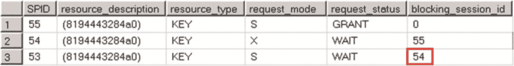
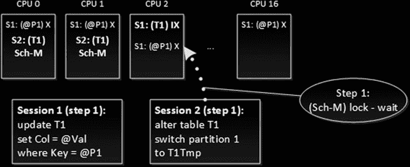
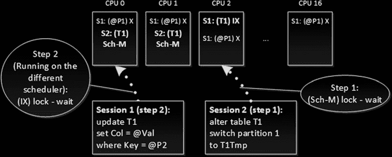
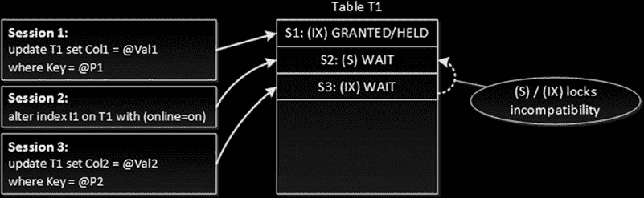
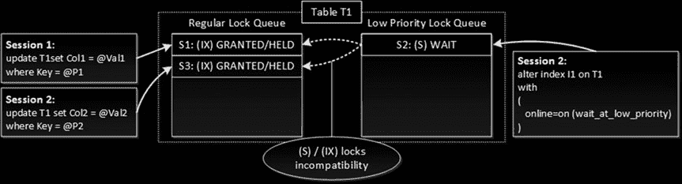

# 第 23 章 ■ 架构锁

```sql
l.request_status,
r.blocking_session_id
from
sys.dm_tran_locks l join
sys.dm_exec_requests r on
l.request_session_id =
r.session_id
where l.resource_type = 'KEY';

rollback
```

图 23-7 展示了此时的行级锁请求情况。



**图 23-7.** 超过两个会话时的锁兼容性

这引出了一个非常重要的结论：为了被授予，一个锁需要与该资源上所有已授予或未授予的锁请求都兼容。

同样值得注意的是，在第一个场景中，第三个会话在`READ COMMITTED`隔离级别下运行，并未在该资源上获取锁，这可以被视为一种内部优化，你不应依赖于此。在某些情况下，即使已存在另一个共享（`S`）锁，SQL Server 在`READ COMMITTED`模式下仍会获取另一个共享（`S`）锁。在这种情况下，查询将被阻塞，类似于`REPEATABLE READ`隔离级别的示例。

#### 锁分区

我们刚刚观察到的行为意味着锁请求是序列化的，因此同一对象上的请求不应相互导致死锁。不幸的是，还有一个因素使事情复杂化。当系统有 16 个或更多逻辑处理器时，SQL Server 开始使用一种称为*锁分区*的技术。这个术语有点令人困惑，因为它与表分区或锁升级无关。启用锁分区后，SQL Server 开始基于每个调度器（逻辑 CPU）存储锁信息。在此模式下，意向共享（`IS`）、意向排他（`IX`）和架构稳定性（`Sch-S`）锁是基于批处理执行所在的 CPU（调度器）在单个分区上获取和存储的。所有其他锁类型需要在所有分区上获取。从锁兼容性的角度来看，这不会改变任何事情。例如，当一个会话需要获取表的排他（`X`）锁时，它将遍历所有锁分区，并在任何分区持有不兼容的意向锁时被阻塞。

但是，有两个后果你需要了解。首先，SQL Server 需要更多内存来存储锁信息。非分区锁在每个分区中单独存储，例如，如果一个系统有 20 个 CPU，它将维护 20 个锁结构，而不是仅仅一个。所有可在行级别获取的锁类型都是非分区的。

第二个问题更为复杂。锁分区在涉及对象级锁时增加了死锁的可能性。

我们来看一个例子，假设第一个会话在使用锁分区的系统中更新一行。如果此批处理在 CPU 2 上执行，该会话获取一个意向排他（`IX`）表锁，此锁被分区并仅存储在 CPU 2 上。它还会获取一个行级排他（`X`）锁，此锁是非分区的，并存储在所有 CPU 上。（为简化起见，我再次省略了页级意向锁。）

第二个会话正尝试更改表，它需要获取一个架构修改（`Sch-M`）锁。此锁类型是非分区的，因此该会话需要在每个 CPU 上获取它。它成功获取并持有了 CPU 0 和 1 上的锁，但在 CPU 2 上由于与该处持有的意向排他（`IX`）锁不兼容而被阻塞。图 23-8 说明了这种情况。





### 图 23-8. 由锁分区导致的死锁：步骤 1

如果第一个会话现在尝试在 CPU 0 或 1 上获取另一个表意向锁，它将被阻塞，因为第二个会话已在该处持有一个架构修改（`Sch-M`）锁。我们再次出现了死锁，如图 23-9 所示。

### 图 23-9. 由锁分区导致的死锁：步骤 2

虽然这可能发生在任何对象级、非意向锁类型上，但最常见的场景之一是与分区表相关的操作，例如分区切换或分区函数更改。这些操作需要架构修改（`Sch-M`）锁，在许多会话访问同一对象的繁忙系统上，这常常会导致死锁。

不幸的是，你能做的很少。无法通过公开的方法禁用锁分区。未公开的跟踪标志`T1229`可以做到这一点；但是，不建议在生产环境中使用未公开的跟踪标志。此外，在那些 CPU 数量庞大的系统中，禁用锁分区可能会导致锁结构管理期间因过度序列化而引发性能问题。

启用锁分区后，你最好的选择是在 DDL 语句周围使用`TRY/CATCH`实现重试逻辑。提升`SET DEADLOCK_PRIORITY`也可以降低 DDL 会话被选为死锁牺牲品的几率。



在你拥有专用数据访问层并完全控制它的场景中，你也可以使用应用程序锁，它们不受锁分区限制，来序列化对表的访问。通过这种实现，所有 DML 查询都需要获取共享（`S`）应用程序锁，而 DDL 代码将使用排他（`X`）应用程序锁。显然，这种方法引入了相当多的额外实现工作。

关于锁分区的信息可在`sys.dm_tran_locks` DMV 的`resource_lock_partition`列、`lock_acquired`扩展事件的`resource_2`字段以及 SQL 跟踪锁事件的`BigIntData1`列中获取。它也出现在死锁图中。

#### 低优先级锁

SQL Server 2014 引入了*低优先级锁*的概念，可以在联机索引重建和分区切换操作期间提高系统的并发性。你已经知道分区切换会获取一个架构修改（`Sch-M`）锁。联机索引重建也是如此。尽管在重建过程中它持有意向共享（`IS`）表锁，但它需要在开始时获取一个共享（`S`）表锁，并在执行的最后阶段获取一个架构修改（`Sch-M`）锁。这两个锁的持有时间都非常短；然而，在繁忙的 OLTP 环境中，它们可能会引入阻塞问题。

考虑这样一种情况：你在另一个活动事务正在修改表中数据时启动了联机索引重建。该初始事务将持有表上的意向排他（`IX`）锁，这会阻止联机索引重建获取共享（`S`）表锁。该锁请求将在队列中等待，并阻塞所有其他想要修改该表数据的事务，而这些事务仍需要在该处获取意向排他（`IX`）锁。图 23-10 说明了这种情况。

### 图 23-10. 索引重建初始阶段的阻塞

这种阻塞情况只有在第一个事务完成并且联机索引重建获取并释放了共享（`S`）表锁后才会清除。类似的阻塞情况也可能发生在联机索引重建的最后阶段，当时它需要获取一个架构修改（`Sch-M`）锁以在元数据中替换索引引用。在索引重建等待架构修改（`Sch-M`）锁被授予期间，读写操作都将被阻塞。

虽然这种行为在所有版本的 SQL Server 中都会发生，但你可以在 SQL Server 2014 和 2016 中通过使用低优先级锁来缓解阻塞问题。低优先级锁在等待获取此类锁时，不会阻塞其他希望获取不兼容锁类型的会话。从概念上讲，你可以


可以将低优先级锁视为驻留在与常规锁不同的锁定队列中。图 23-11 阐释了这一概念。




