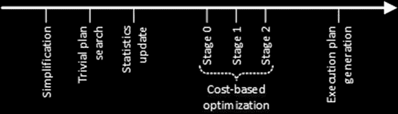

# 第 25 章

## 查询优化与执行

`SQL Server 查询处理器`是 `SQL Server` 中最不显眼和最不为人所知的部分。它没有公开大量的公共功能，并且以有文档记载和支持的方式提供非常有限的控制。它接受查询作为输入，编译并优化它以生成执行计划，最后执行该计划。

本章讨论查询生命周期，并提供查询优化过程的高层概述。它解释了 `SQL Server` 如何执行查询，讨论了几个常用的操作符，并介绍了可用于微调查询优化某些方面的查询和表提示。

#### 查询生命周期

提交到 `SQL Server` 的每个查询都会经历一个编译和执行的过程。该过程包括如图 25-1 所示的步骤。

*图 25-1. 查询生命周期*

当 `SQL Server` 接收到一个查询时，它会经过 **解析** 阶段。`SQL Server` 编译并验证查询的语法，并将其转换为一种称为 *逻辑查询树* 的结构。该树由各种 *逻辑* 关系代数操作符组成，例如内连接和外连接、聚合等。

在下一步，称为 **绑定**，`SQL Server` 将逻辑树节点绑定到实际的数据库对象，将逻辑树转换为 *绑定树*。它验证查询中引用的所有对象都是有效的，它们存在于数据库中，并且所有列都是正确的。最后，`SQL Server` 加载与表和列关联的各种元数据属性；例如，`CHECK` 和 `NOT NULL` 约束。

查询优化器在 **优化** 阶段使用绑定树作为输入，此时会生成实际的 *执行计划*。执行计划也是一个树状结构，由 *物理* 操作符组成；`SQL Server` 使用它来执行查询。物理操作符在查询执行期间执行实际工作，它们与逻辑操作符不同。例如，一个逻辑内连接可以转换为三种物理连接之一，例如嵌套循环、合并或哈希连接。

您需要记住的一个关键要素是，查询优化器并不是在寻找查询的 *最佳执行计划*。查询优化是一个复杂且昂贵的过程，通常无法评估所有可能的执行策略。

© Dmitri Korotkevitch 2016

D. Korotkevitch, *Pro SQL Server Internals*, DOI 10.1007/978-1-4842-1964-5_25

**第 25 章** ■ **查询优化与执行**

例如，内连接是可交换的，因此 `(A join B)` 的结果等于 `(B join A)` 的结果。因此，`SQL Server` 执行两表连接有两种可能的方式；执行三表连接有六种方式；对于 `N` 个表，则有 `N!`（即 `N * (N - 1) * (N - 2) * ...`）种组合方式。

