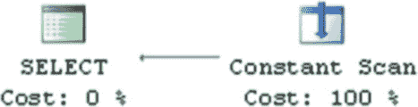

# 查询优化与执行

#### 查询优化过程

查询优化过程包含多个阶段，如图 25-2 所示。

*图 25-2. 查询优化阶段*

在*简化*阶段，SQL Server 以一种能进一步简化优化过程的方式转换查询树。查询优化器会移除查询中的矛盾条件、进行计算列匹配，并处理连接操作，根据统计信息和基数数据选择一个初始连接顺序。



## 查询优化示例

列表 25-1 提供了从执行计划中移除矛盾部分的示例。`dbo.NegativeNumbers` 和 `dbo.PositiveNumbers` 表都有 `CHECK` 约束，这些约束定义了值的域范围。SQL Server 可以检测到域值矛盾，并理解内连接操作不会返回任何数据。它会生成一个不访问任何表的执行计划，如图 25-3 所示。

**列表 25-1.** 从执行计划中移除矛盾部分

```
create table dbo.PositiveNumbers
(
    PositiveNumber int not null
        constraint CHK_PositiveNumbers check (PositiveNumber > 0)
);

create table dbo.NegativeNumbers
(
    NegativeNumber int not null
        constraint CHK_NegativeNumbers check (NegativeNumber < 0)
);

select *
from dbo.PositiveNumbers e join dbo.NegativeNumbers o on
    e.PositiveNumber = o.NegativeNumber
```

*图 25-3. 该查询的执行计划*

简化阶段完成后，查询优化器会检查该查询是否有*简易执行计划*可用。当查询只有一个可用的执行计划，或者执行计划的选择显而易见时，就会发生这种情况。列表 25-2 显示了这样一个例子。

**列表 25-2.** 具有简易执行计划的查询

```
create table dbo.Data
(
```


