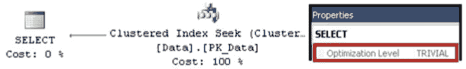
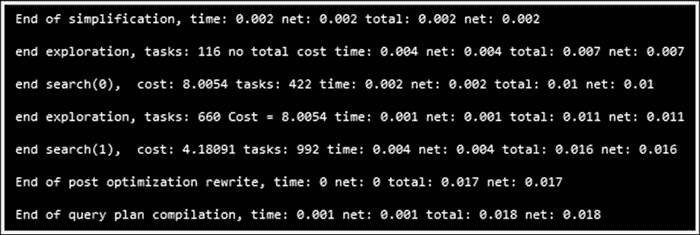

# 第 25 章 ■ 查询优化与执行

```sql
CREATE TABLE Data (
    ID int not null,
    Col1 int not null,
    Col2 int not null,
    constraint PK_Data primary key clustered(ID)
);

select ID, Col1, Col2 from dbo.Data where ID = 11111;
```

SQL Server 生成了**简单执行计划**，该计划使用 `聚集索引查找` 运算符，如 `图 25-4` 所示。



`图 25-4.` 简单执行计划

尽管从技术上讲存在两种不同的执行计划选择，即 `聚集索引查找` 和 `聚集索引扫描`，但查询优化器并未考虑扫描选项，因为它显然开销更大。此外，在 `Col1` 或 `Col2` 上添加非聚集索引会引入额外的、非最优的执行计划选项。尽管如此，查询优化器仍然能够检测到这种情况，并转而生成一个简单执行计划。你可以通过根运算符的属性或执行计划的 XML 表示形式来检查一个执行计划是否是简单的。

如果没有找到简单计划，SQL Server 会检查是否有任何自动更新的统计信息已过期，并在需要时触发统计信息更新。如果统计信息需要同步更新（这是默认选项），查询优化器会等待统计信息更新完成。否则，优化将基于旧的、过时的统计信息进行，同时统计信息在另一个线程中异步更新。之后，SQL Server 开始基于成本的优化，其中包括几个不同的阶段。每个阶段探索更多的规则，因此执行时间可能更长。

`阶段 0` 称为 `事务处理`，其目标场景是具有 OLTP 工作负载的情况：使用索引进行多表（至少三表）连接，选择相对较少的行。此阶段通常使用嵌套循环连接，尽管在某些情况下可能会考虑哈希连接。在此阶段只探索有限数量的优化规则。

`阶段 1` 称为 `快速计划`，它应用 SQL Server 中可用的大多数优化规则。如果需要，它可能会运行两次，分别查找串行和并行执行计划。SQL Server 中的大多数查询都在此阶段找到执行计划。

`阶段 2` 称为 `完全优化`，它执行最全面、因此运行时间最长的分析，探索所有可用的优化规则。

每个阶段都有其自身的进入和终止条件。例如，`阶段 0` 要求查询至少具有三表连接；否则，它将不会被执行。或者，如果在优化过程中计划成本超过某个阈值，则该阶段终止，查询优化器继续进入下一个更全面的阶段。一旦找到“足够好”的计划，优化可以在任何阶段完成。

你可以使用未文档化的跟踪标志 `T8675` 来检查优化过程的细节。关于未文档化跟踪标志的通常免责声明在此适用：请谨慎使用，不要在生产环境中使用。你还需要使用跟踪标志 `T3604` 将输出重定向到控制台。

`图 25-5` 展示了一个查询的优化统计信息。如你所见，SQL Server 执行了 `阶段 0` 和 `阶段 1` 的优化，并在 `阶段 1` 之后生成了执行计划。



`图 25-5.` 跟踪标志 8675 返回的优化统计信息

**注意：** 已文档化的数据管理视图 (DMV) `sys.dm_exec_query_optimizer_info` 允许你检索与查询优化器相关的统计信息。虽然此 DMV 在服务器范围内提供了很好的概览，但它不允许你按特定会话过滤信息，这使得在繁忙的环境中很难使用。你可以在 [`technet.microsoft.com/en-us/library/ms175002.aspx`](http://technet.microsoft.com/en-us/library/ms175002.aspx) 获取关于此 DMV 的更多信息。


