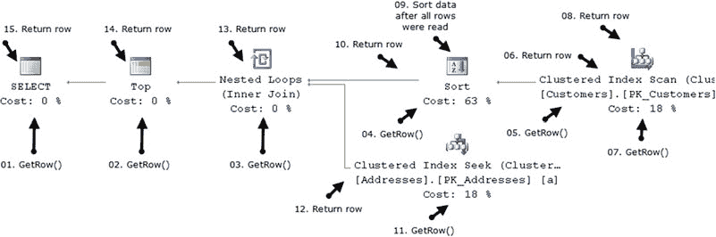
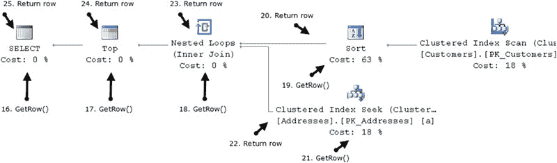

# 查询优化与执行

## 查询优化

最终，当**查询优化器**对优化结果满意时，它会生成执行计划。

正如您所料，在查询优化阶段，**SQL Server** 会分析并探索大量备选的执行策略。这些备选方案是查询树的一部分，存储在**查询优化器**称为 `Memo` 的部分中。SQL Server 会对 `Memo` 中的每一个组进行成本估算，这使其能够在生成执行计划时定位成本最低的方案。

成本计算基于一个复杂的数学模型，该模型考虑了各种因素，例如：
*   基数（`cardinality`）
*   行大小（`row size`）
*   预期内存使用量
*   顺序和随机 I/O 操作的数量
*   并行开销
等。成本数值和计划成本本身并无意义；它们仅应用于比较目的。

成本模型中有相当多的假设，旨在使其更加一致，如下所示：

*   随机 I/O 被预期在数据库文件中均匀分布。例如，如果一个执行计划需要在堆表中执行十次 `RID lookup` 操作，成本模型将预计需要十次随机物理 I/O 操作。实际上，数据可能驻留在相同的数据页上，这可能导致查询优化器高估计划中某些运算符的成本。
*   **查询优化器**期望所有查询都从冷缓存开始，并在访问数据时执行物理 I/O。在生产系统中，数据页通常缓存在缓冲池中，这种假设可能不正确。在极少数情况下，这可能导致 SQL Server 选择一个效率较低但需要较少 I/O，而以较高的 CPU 或内存使用为代价的计划。
*   **查询优化器**假设顺序 I/O 性能显著快于随机 I/O 性能。这对于磁性硬盘驱动器通常成立，但对于固态介质则不完全如此，与磁性硬盘相比，后者的随机 I/O 性能与顺序 I/O 性能更为接近。SQL Server 不考虑驱动器类型，在基于固态硬盘的磁盘阵列情况下会高估随机 I/O 操作的成本。对于某些查询，它可能生成使用聚集索引扫描而不是 `nonclustered index seek` 和 `key lookup` 的执行计划，而这在基于 SSD 的磁盘子系统中效率可能较低。还值得注意的是，对于具有大量驱动器且随机 I/O 性能非常好的现代高性能磁盘阵列，也可能发生同样的情况。

综上所述，SQL Server 中的成本模型 `generally` 能产生正确且一致的结果。然而，与任何数学模型一样，输出的质量高度取决于输入数据的质量。例如，当由于统计信息过时而导致基数估算不正确时，就不可能提供正确的成本估算。保持统计信息最新有助于 SQL Server 生成高效的执行计划。

#### 查询执行

SQL Server 在查询优化的最终阶段生成执行计划。然后，执行计划被传递给 `query executor`，顾名思义，它负责执行查询。

执行计划是一个树状结构，包含一组 `operators`，有时也称为 `iterators`。通常，SQL Server 使用 `row-based` 执行模型，其中每个运算符通过从一个或多个子节点请求行来生成单个行，并将生成的行传递给其父节点。

> **注意**：SQL Server 2012 引入了一种新的批处理模式执行模型，该模型用于某些数据仓库查询。我们将在本书的第八部分讨论这种执行模型。

让我们看一个例子来说明基于行的执行模型，假设您有如 清单 25-3 所示的查询。

***清单 25-3.*** 基于行的执行：示例查询


```sql
select top 10 c.CustomerId, c.Name, a.Street, a.City, a.State, a.ZipCode
from dbo.Customers c join dbo.Addresses a on
c.PrimaryAddressId = a.AddressId
order by c.Name
```

此查询将生成如图 25-6 所示的执行计划。SQL Server 从 `dbo.Customers` 表中选取所有数据，根据 `Name` 列进行排序，获取前十行，然后与 `dbo.Addresses` 的数据进行联接，最后将结果返回给客户端。





