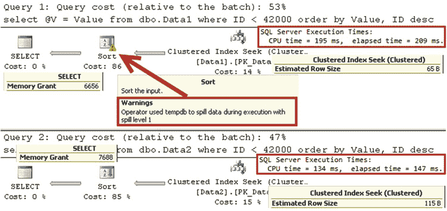
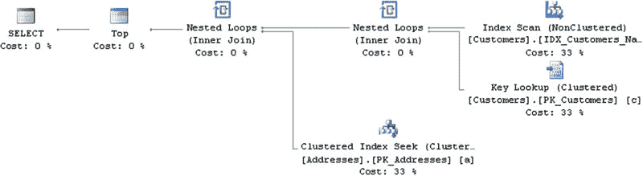

# 第 25 章 查询优化与执行

内存估算不准确会对系统产生负面影响。高估会浪费服务器内存，并可能增加查询等待内存授权的时间。另一方面，低估会迫使 SQL Server 在`tempdb`而非内存中执行排序或哈希操作，这显著更慢。这种情况被称为 `tempdb 溢出`。

算子的内存估算依赖于基数和平均行大小的估算。任何一种错误都会导致不正确的内存授权请求。基数估算错误的典型来源包括：统计信息不准确、`WHERE`子句和连接条件中存在非 SARGable 谓词和函数，以及查询优化器模型的局限性。这些问题通常可以通过统计信息维护、查询简化和优化来解决。然而，处理行大小估算错误则更为棘手。

SQL Server 知道行中定长数据部分的大小。但对于变长列，它估算数据平均填充了所定义列大小的 50%。例如，如果你有两个定义为`varchar(100)`和`nvarchar(200)`的列，SQL Server 会估算每个数据行在这些列中分别存储 50 和 200 个字节。对于`(n)varchar(max)`和`varbinary(max)`列，SQL Server 使用 4000 字节作为基准数值。

> **提示：** 你可以通过将变长列定义为所存储数据平均大小的两倍来改善行大小估算。

让我们看一个例子，创建两个表，如清单 25-4 所示。

### 清单 25-4. 变长列与内存授权：创建表

```sql
create table dbo.Data1
(
    ID int not null,
    Value varchar(100) not null,
    constraint PK_Data1 primary key clustered(ID)
);

create table dbo.Data2
(
    ID int not null,
    Value varchar(200) not null,
    constraint PK_Data2 primary key clustered(ID)
);
```



```sql
;with N1(C) as (select 0 union all select 0) -- 2 rows
,N2(C) as (select 0 from N1 as T1 cross join N1 as T2) -- 4 rows
,N3(C) as (select 0 from N2 as T1 cross join N2 as T2) -- 16 rows
,N4(C) as (select 0 from N3 as T1 cross join N3 as T2) -- 256 rows
,N5(C) as (select 0 from N4 as T1 cross join N4 as T2 ) -- 65,536 rows
,Nums(Num) as (select row_number() over (order by (select null)) from N5)
insert into dbo.Data1(ID, Value)
select Num, replicate('0',100) from Nums;

insert into dbo.Data2(ID, Value)
select ID, Value from dbo.Data1;
```

在下一步中，让我们对这两个表运行两个相同的查询，如清单 25-5 所示。我使用变量来丢弃结果集。

### 清单 25-5. 变长列与内存授权：查询

```sql
declare
    @V varchar(200)

select @V = Value from dbo.Data1 where ID < 42000 order by Value, ID desc;

select @V = Value from dbo.Data2 where ID < 42000 order by Value, ID desc;
```

如图 25-8 所示，不正确的内存授权迫使 SQL Server 将数据溢出到`tempdb`，从而增加了执行时间。

### 图 25-8. 变长列与内存授权：执行计划

> **提示：** 你可以通过 SQL 跟踪和扩展事件中的“排序和哈希警告”来监控数据溢出到`tempdb`的情况。如果你使用的是 SQL Server 2012 SP3、SQL Server 2014 SP2 或 SQL Server 2016，还可以使用`MIN_GRANT_PERCENT`和`MAX_GRANT_PERCENT`查询提示来指定内存授权的最小和最大大小。



当阻塞算子出现在执行计划的并行部分时，它们会对查询性能产生负面影响。`并行`算子会合并来自并行执行线程的数据，并会等待所有线程完成执行。因此，执行时间将取决于最慢的线程。阻塞算子会加剧延迟，尤其是在发生`tempdb 溢出`的情况下。


在并行线程工作负载因基数估计错误而分布不均的情况下，经常会出现条件问题。

■ **提示** 在 `SQL Server Management Studio` 图形执行计划的并行部分中，打开运算符的 `属性窗口` 时，您可以看到线程之间的工作负载分布。

在某些情况下，添加索引可以从执行计划中移除阻塞运算符。例如，如果你添加了索引 `CREATE INDEX IDX_Customers_Name ON dbo.Customers(Name)`，`SQL Server` 就不再需要对客户数据进行排序，而清单 25-3 中的查询最终会得到一个不含阻塞运算符的执行计划，如图 25-9 所示。

**图 25-9.** 不含阻塞运算符的执行计划

在 `SQL Server Management Studio` 中，有三种方法可以分析执行计划。最常见的方法是图形执行计划表示法，可以通过 `查询` 菜单中的 `包含实际执行计划` 菜单项启用。图形执行计划将执行计划树逆时针旋转 90 度来表示。树的顶级根元素是计划中最左侧的图标，其子节点位于父节点的右侧。

当你在计划中选择一个运算符时，会弹出一个小窗口，显示该运算符的部分属性。但是，通过在 `Management Studio` 中打开运算符的 `属性窗口`，你可以获得更全面的信息。

■ **提示** SentryOne “Plan Explorer” 是一款出色的免费工具，可以简化执行计划分析。你可以从这里下载：`http://sentryone.com`。

除了执行计划的图形表示外，`SQL Server` 还可以将其显示为文本或 XML。文本表示法将每个运算符放在单独的行上，并使用缩进和 `|` 符号显示父子关系。当你需要分享一个紧凑且易于理解的执行计划表示，而无需担心图形执行计划的图像大小和比例时，文本执行计划可能很有用。

