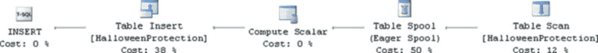
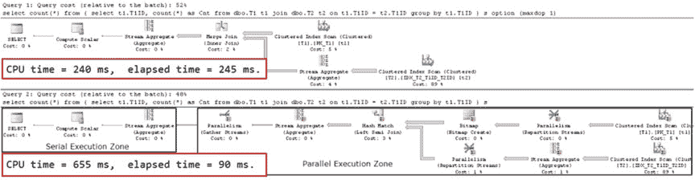
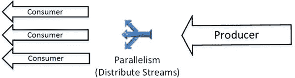
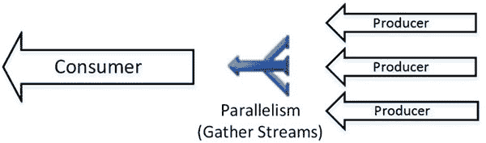
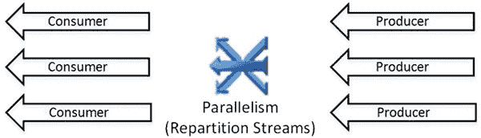
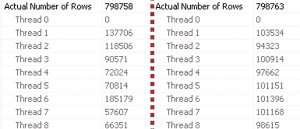

# 第 25 章 ■ 查询优化与执行

## 排序操作符

| 特性 | 流聚合 | 哈希聚合 |
| :--- | :--- | :--- |
| 输入要求 | `排序`操作符或预排序输入 | 要求排序输入 |
| 阻塞性 | 否。但通常需要一个阻塞性的 `排序`操作符。 | 是 |
| 使用内存 | 否 | 是 |
| 使用 tempdb | 否 | 是，在溢出情况下 |

在性能调优期间，如果使用`排序`操作符仅仅是为了支持流聚合的先决条件，你应该考虑其成本。排序的成本通常超过流聚合本身的成本。你通常可以通过创建索引来移除它，这些索引会按照流聚合所需的顺序对数据进行排序。

## 假脱机

简而言之，`假脱机`操作符是内部的内存中或 tempdb 中的缓存/临时表。SQL Server 通常出于性能原因使用假脱机来缓存复杂子表达式的结果，这些结果在查询执行过程中需要多次使用。

让我们看一个例子，使用我们在清单 25-11 中创建的表。我们将运行一个查询，返回所有订单的信息，以及每个客户的销售总额，如清单 25-13 所示。

### 清单 25-13. 表假脱机示例

```sql
select OrderId, CustomerID, Total, sum(Total) over(partition by CustomerID) as [Customer Sales]
from dbo.Orders
```

查询的执行计划如图 25-11 所示。如你所见，SQL Server 扫描表，根据`CustomerID`顺序对数据进行排序，并使用`表假脱机`操作符来缓存结果。这使得 SQL Server 可以访问缓存的数据，并避免之后昂贵的排序操作。

### 图 25-11. 查询的执行计划



尽管执行计划中多次显示了`表假脱机`操作符，但它本质上是同一个假脱机/缓存。SQL Server 在第一次构建它，并在之后使用其数据。

当修改数据时，SQL Server 会使用假脱机来实现`万圣节保护`。`万圣节保护`有助于避免数据修改影响需要更新的数据的情况。这种情形的一个经典例子如清单 25-14 所示。如果没有`万圣节保护`，`INSERT`语句将陷入无限循环，读取它正在插入的行。

### 清单 25-14. 万圣节保护

```sql
create table dbo.HalloweenProtection
(
    Id int not null identity(1,1),
    Data int not null
);

insert into dbo.HalloweenProtection(Data)
select Data from dbo.HalloweenProtection;
```

`INSERT`语句的执行计划如图 25-12 所示。SQL Server 在`INSERT`之前使用`表假脱机`操作符来缓存表中的数据，以避免执行期间的无限循环。

### 图 25-12. 万圣节保护执行计划

正如我在第 11 章“用户定义函数”中提到的，在定义标量用户定义函数时，使用`WITH SCHEMABINDING`选项非常重要。此选项强制 SQL Server 分析用户定义函数是否执行数据访问，并避免执行计划中额外的、与`万圣节保护`相关的`假脱机`操作符。

清单 25-15 展示了一个代码示例，它创建了两个用户定义函数，并在`UPDATE`语句的`where`子句中使用它们。

### 清单 25-15. 万圣节保护和用户定义函数

```sql
create function dbo.ShouldUpdateData(@Id int)
returns bit
as
    return (1);
go

create function dbo.ShouldUpdateDataSchemaBound(@Id int)
returns bit
with schemabinding
as
    return (1);
go

update dbo.HalloweenProtection set Data = 0 where dbo.ShouldUpdateData(ID) = 1;
update dbo.HalloweenProtection set Data = 0 where dbo.ShouldUpdateDataSchemaBound(ID) = 1;
```

这两个函数都没有访问数据，因此不会引入万圣节效应。然而，对于非架构绑定的函数，SQL Server 并不知道这一点，因此它会添加一个`假脱机`操作符。


操作符到执行计划的映射，如图 25-13 所示。

### 图 25-13. 万圣节保护与用户定义函数：执行计划

`Spool`临时表在查询的 I/O 统计中通常被称为`worktables`。在进行查询性能调优时，你应该分析与表 Spool 相关的读取操作。虽然 Spool 可以提升查询性能，但不必要的 Spool 也会带来管理和`tempdb`的开销。你通常可以通过在表上创建适当的索引来移除它们。

SQL Server 2016 引入了新的查询提示`NO_PERFORMANCE_SPOOL`，它可以防止`Spool`操作符被添加到执行计划中。这在某些情况下可能很有帮助，尤其是在`tempdb`负载非常重的系统中，当创建内部 Spool 临时表的开销变得不可接受时。然而，这个提示会改变执行计划的形状，并可能在其他情况下降低查询性能。请谨慎使用，并务必分析它对查询执行计划和性能的影响。

### 并行度

SQL Server 可以同时使用多个 CPU 来执行查询。尽管并行查询执行可以减少查询的响应时间，但这是有代价的。并行度总是会引入管理多个执行线程的开销。

让我们看一个例子，创建两个表，如清单 25-16 所示。该脚本向表`dbo.T1`插入 65,536 行，向表`dbo.T2`插入 1,048,576 行。

#### 清单 25-16. 并行度：创建表

```sql
create table dbo.T1
(
    T1ID int not null,
    Placeholder char(100),
    constraint PK_T1 primary key clustered(T1ID)
);

create table dbo.T2
(
    T1ID int not null,
    T2ID int not null,
    Placeholder char(100)
);

create unique clustered index IDX_T2_T1ID_T2ID
on dbo.T2(T1ID, T2ID);

;with N1(C) as (select 0 union all select 0) -- 2 rows
,N2(C) as (select 0 from N1 as T1 cross join N1 as T2) -- 4 rows
,N3(C) as (select 0 from N2 as T1 cross join N2 as T2) -- 16 rows
,N4(C) as (select 0 from N3 as T1 cross join N3 as T2) -- 256 rows
,N5(C) as (select 0 from N4 as T1 cross join N4 as T2) -- 65,536 rows
,Nums(Num) as (select row_number() over (order by (select null)) from N5)
insert into dbo.T1(T1ID)
select Num from Nums;

;with N1(C) as (select 0 union all select 0) -- 2 rows
,N2(C) as (select 0 from N1 as T1 cross join N1 as T2) -- 4 rows
,N3(C) as (select 0 from N2 as T1 cross join N2 as T2) -- 16 rows
,Nums(Num) as (select row_number() over (order by (select null)) from N3)
insert into dbo.T2(T1ID, T2ID)
select T1ID, Num from dbo.T1 cross join Nums;
```

下一步，让我们运行两个`SELECT`语句，如清单 25-17 所示。

#### 清单 25-17. 并行度：测试查询

```sql
select count(*)
from
(
    select t1.T1ID, count(*) as Cnt
    from dbo.T1 t1 join dbo.T2 t2 on
        t1.T1ID = t2.T1ID
    group by t1.T1ID
) s
option (maxdop 1);

select count(*)
from
(
    select t1.T1ID, count(*) as Cnt
    from dbo.T1 t1 join dbo.T2 t2 on
        t1.T1ID = t2.T1ID
    group by t1.T1ID
) s;
```

我们对第一个查询使用`MAXDOP 1`作为查询提示来强制执行串行计划。第二个查询具有并行执行计划。图 25-14 说明了这种情况。





### 图 25-14. 并行执行：查询计划

如你所见，第一个查询的响应（总耗时）时间比第二个查询慢得多：245 毫秒对 90 毫秒。然而，第一个查询的总 CPU 时间比第二个查询低得多：240 毫秒对 655 毫秒。我们正在为并行度管理使用 CPU 资源。

并行执行计划并不一定意味着所有操作符都在并行执行。一个执行计划可以同时包含并行和串行执行区域。图 25-14 中所示的并行计划


在并行区域内运行子查询，并在外部以串行方式执行 `COUNT(*)` 计算。

`Parallelism` 操作符，有时也称为 `Exchange`，在查询执行期间管理并行操作。它从一个或多个 `producer`（生产者）线程接收输入数据，并将其分配给一个或多个 `consumer`（消费者）线程，该操作符可以三种不同模式运行。

## 图 25-15. 并行性：分发流模式

在 `distribute streams`（分发流）模式下，`Parallelism` 操作符从一个 `producer` 线程接收数据，并将其分发到多个 `consumer` 线程。此模式通常是执行计划中并行执行区域的入口点。图 25-15 说明了这一概念。

## 图 25-16. 并行性：汇聚流模式

在 `gather streams`（汇聚流）模式下，`Parallelism` 操作符合并来自多个 `producer` 线程的数据，并将其传递给单个 `consumer` 线程。此模式通常是执行计划中并行执行区域的出口点。图 25-16 阐释了这一思想。



## 图 25-17. 并行性：重分布流模式

最后，在 `repartition streams`（重分布流）模式下，`Parallelism` 操作符从多个 `producer` 线程接收数据，并将其分发到多个 `consumer` 线程。这发生在执行计划的并行区域中部，当需要在执行线程之间重新分配数据时。图 25-17 说明了这一概念。

数据在 `consumer` 线程之间有多种不同的分配方式。表 25-4 总结了这些方法。

## 表 25-4. 并行操作符中的数据重分布方法

| **重分布方法** | **描述** |
| :--- | :--- |
| 广播 | 将行发送到所有 `consumer` 线程 |
| 轮询 | 按顺序将行发送到下一个 `consumer` 线程 |
| 按需 | 将行发送到下一个请求该行的 `consumer` 线程 |
| 范围 | 使用 `range` 函数确定哪个 `consumer` 线程应获得一行 |
| 哈希 | 使用 `hash` 函数确定哪个 `consumer` 线程应获得一行 |

`Parallelism` 操作符使用的执行模型与其他操作符不同。它采用基于推送的模型，由 `producer` 线程将行推送给他。这与基于拉取的模型相反，在拉取模型中，父操作符调用子操作符的 `GetRow()` 方法来获取数据。

均匀分布的工作负载是并行执行计划获得良好性能的关键因素。你可以在 Management Studio 中操作符属性窗口的“实际行数”部分看到每个线程处理的行数。该信息在图形执行计划的工具提示中不显示。线程 0 是并行管理线程，其处理的行数始终显示为零。

不均匀的数据分布和过时的统计信息是导致线程间工作负载分布不均的常见原因。图 25-18 展示了在其中一个表上更新统计信息后工作负载分布的变化情况。左侧显示的是更新统计信息前的分布，右侧显示的是更新后的分布。



## 图 25-18. 统计信息更新前后的工作负载分布情况

### 查询和表提示

查询优化器通常能很好地生成合理的执行计划。然而，在某些情况下，你可以决定使用 `query hints`（查询提示）和 `table hints`（表提示）来微调执行计划的形状。例如，`query` 和 `table hints` 允许你强制查询优化器为查询选择特定的索引或联接类型。

`Query hints` 是一个非常有用但非常危险的工具。它们可以帮助你提高执行计划的质量；然而，如果应用不当，它们也可能显著降低系统的性能。在使用它们之前，你应该对 SQL Server 的工作原理有非常深入的理解，并了解你的系统和数据。


