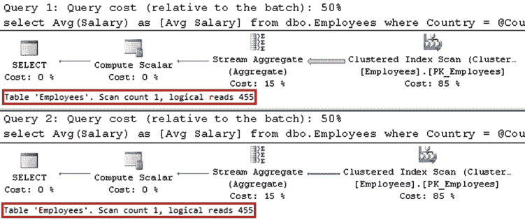

# 参数嗅探与计划缓存

当数据分布不均匀时，会导致生成并缓存的执行计划仅对非典型的、不常用的参数值是最优的。这些缓存的计划对于后续使用更常见值作为参数的调用来说，可能不是最优的。

大多数数据库专业人员都经历过这样的情况：某些查询或存储过程的执行时间突然比之前长了很多，尽管近期并没有向生产环境部署更改。在大多数情况下，这些情况是由于统计信息更新导致查询重新编译时，发生了参数嗅探而引起的。

让我们看一个例子，并创建如 **清单 26-1** 所示的表。我们将用数据填充它，使得大多数行的 `Country` 值设置为 `'USA'`。然后，我们将在 `Country` 列上创建一个非聚集索引。

**清单 26-1.** 参数嗅探：表创建

```sql
create table dbo.Employees
(
    ID int not null,
    Number varchar(32) not null,
    Name varchar(100) not null,
    Salary money not null,
    Country varchar(64) not null,
    constraint PK_Employees primary key clustered(ID)
);

;with N1(C) as (select 0 union all select 0) -- 2 rows
,N2(C) as (select 0 from N1 as T1 cross join N1 as T2) -- 4 rows
,N3(C) as (select 0 from N2 as T1 cross join N2 as T2) -- 16 rows
,N4(C) as (select 0 from N3 as T1 cross join N3 as T2) -- 256 rows
,N5(C) as (select 0 from N4 as T1 cross join N4 as T2 ) -- 65,536 rows
,Nums(Num) as (select row_number() over (order by (select null)) from N5)
insert into dbo.Employees(ID, Number, Name, Salary, Country)
select Num, convert(varchar(5),Num)
, 'USA Employee: ' + convert(varchar(5),Num), 40000, 'USA'
from Nums;

CHAPTER 26 ■ PLAN CACHING

;with N1(C) as (select 0 union all select 0) -- 2 rows
,N2(C) as (select 0 from N1 as T1 cross join N1 as T2) -- 4 rows
,N3(C) as (select 0 from N2 as T1 cross join N2 as T2) -- 16 rows
,Nums(Num) as (select row_number() over (order by (select null)) from N3)
insert into dbo.Employees(ID, Number, Name, Salary, Country)
select 65536 + Num, convert(varchar(5),65536 + Num)
, 'Canada Employee: ' + convert(varchar(5),Num), 40000, 'Canada'
from Nums;

create nonclustered index IDX_Employees_Country
on dbo.Employees(Country);
```

作为下一步，让我们创建一个计算特定国家员工平均工资的存储过程。实现此功能的代码如 **清单 26-2** 所示。尽管在此示例中我们使用的是存储过程，但从客户端应用程序调用的参数化查询也可能发生相同的情况。

**清单 26-2.** 参数嗅探：存储过程

```sql
create proc dbo.GetAverageSalary @Country varchar(64)
as
select Avg(Salary) as [Avg Salary]
from dbo.Employees
where Country = @Country;
```

在当前数据分布下，当使用 `@Country='USA'` 调用存储过程时，最优的执行计划是 `clustered index scan`。然而，对于 `@Country='Canada'`，更好的执行计划是带有 `key lookup` 操作的 `nonclustered index seek`。

让我们调用该存储过程两次：第一次使用 `@Country='USA'`，第二次使用 `@Country='Canada'`，如 **清单 26-3** 所示。

**清单 26-3.** 参数嗅探：调用存储过程

```sql
exec dbo.GetAverageSalary @Country='USA';
exec dbo.GetAverageSalary @Country='Canada';
```

如图 **26-1** 所示，SQL Server 编译存储过程并缓存第一次调用时的计划，然后在以后重用它。尽管这样的计划在使用 `@Country='Canada'` 参数值时效率较低，但如果此类调用很少（根据这种数据分布预期如此），那可能也是可以接受的。



**图 26-1.** 参数嗅探：针对 `@Country='USA'` 的缓存计划

现在，让我们看看如果在计划未被缓存时交换这些调用顺序会发生什么。清单 26-4


