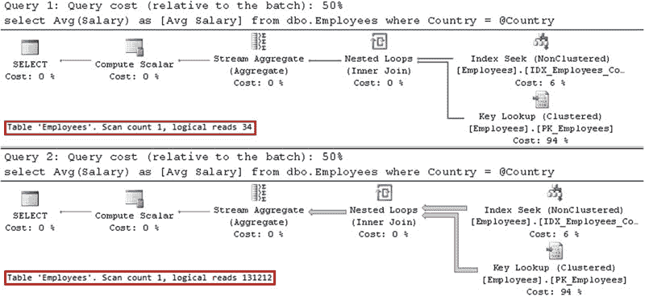
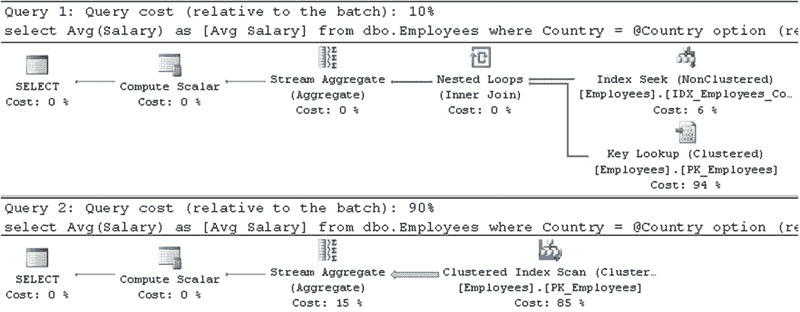
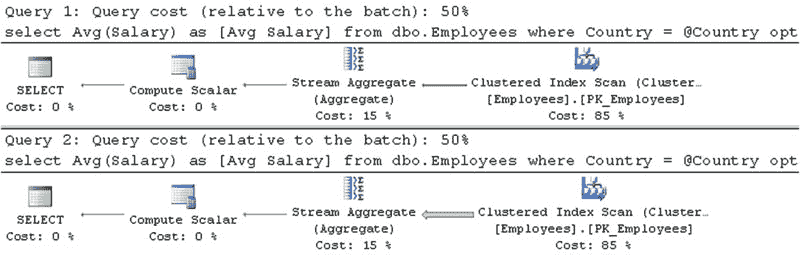
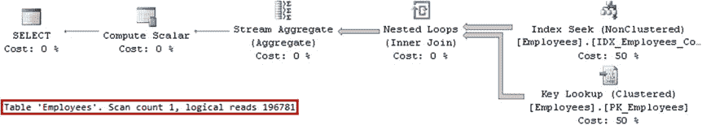
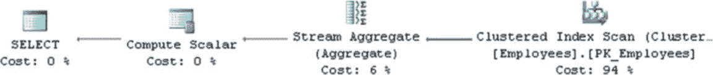

# 第 26 章 ■ 计划缓存

展示了实现此目标的代码。我们将使用 `DBCC FREEPROCCACHE` 命令，它会清空计划缓存。另一种可能发生此情况的场景是统计信息更新导致查询重新编译时。

**重要** 请勿在生产环境中使用 `DBCC FREEPROCCACHE` 命令。

## 代码清单 26-4. 参数嗅探：使用不同参数顺序调用存储过程

```sql
dbcc freeproccache
go

exec dbo.GetAverageSalary @Country='Canada';
exec dbo.GetAverageSalary @Country='USA';
```

如图 26-2 所示，SQL Server 现在基于 `@Country='Canada'` 参数值编译并缓存该计划。尽管当使用 `@Country='Canada'` 调用存储过程时此计划效率更高，但对于 `@Country='USA'` 的调用则效率极低。



## 图 26-2. 参数嗅探：为 `@Country='Canada'` 缓存的计划

有几种方法可以解决此问题。你可以使用 `EXECUTE WITH RECOMPILE` 强制重新编译存储过程，或者使用 `OPTION (RECOMPILE)` 子句进行语句级重编译。显然，语句级重编译更好，因为它在较小的范围内执行重编译。SQL Server 在重编译时*嗅探*参数值，为每个参数值生成最优执行计划。代码清单 26-5 展示了语句级重编译方法。

## 代码清单 26-5. 参数嗅探：语句级重编译

```sql
alter proc dbo.GetAverageSalary @Country varchar(64)
as
select Avg(Salary) as [Avg Salary]
from dbo.Employees
where Country = @Country
option (recompile);
go

exec dbo.GetAverageSalary @Country='Canada';
exec dbo.GetAverageSalary @Country='USA';
```

如图 26-3 所示，SQL Server 不缓存执行计划，而是在每次调用时重新编译语句，为每个参数值生成最高效的执行计划。




## 图 26-3. 参数嗅探：语句级重编译

当查询不经常执行，或者对于复杂查询而言编译时间仅占总执行时间的一小部分时，语句级重编译可能是一个不错的选择。然而，对于频繁执行的 OLTP 查询而言，由于重编译会带来额外的 CPU 负载，这几乎算不上最佳方法。

另一种选择是使用 `OPTIMIZE FOR` 提示，它强制 SQL Server 根据提示中提供的特定参数值来优化查询。代码清单 26-6 说明了这种方法。

## 代码清单 26-6. 参数嗅探：`OPTIMIZE FOR` 提示

```sql
alter proc dbo.GetAverageSalary @Country varchar(64)
as
select Avg(Salary) as [Avg Salary]
from dbo.Employees
where Country = @Country
option (optimize for(@Country='USA'));
go

exec dbo.GetAverageSalary @Country='Canada';
exec dbo.GetAverageSalary @Country='USA';
```

如图 26-4 所示，SQL Server 在编译期间忽略参数值并优化查询，然后缓存针对 `@Country='USA'` 值的执行计划。

## 图 26-4. 参数嗅探：`OPTIMIZE FOR` 提示




不幸的是，`OPTIMIZE FOR` 提示引入了可维护性问题，并且在数据分布发生变化的情况下可能导致次优的执行计划。代码清单 26-7 展示了这样一个例子。让我们考虑一种情况（尽管是不现实的），一家公司及其所有员工从美国搬到了德国。

## 代码清单 26-7. 参数嗅探：`OPTIMIZE FOR` 与数据分布变化

```sql
update dbo.Employees set Country='Germany' where Country='USA';

exec dbo.GetAverageSalary @Country='Germany';
```

在执行更新时，统计信息已过时，这迫使 SQL Server 重新编译该语句。


