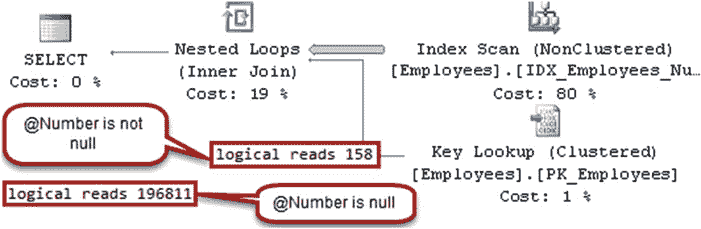
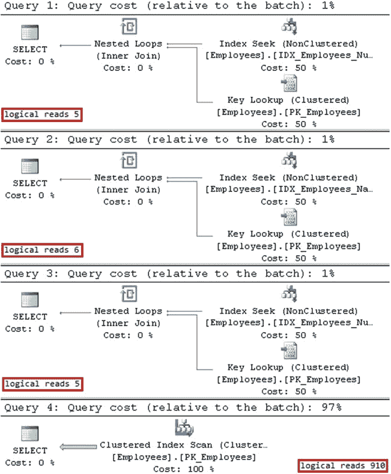

# 第 26 章 计划缓存

((`@Number` is null) or (`Number`=`@Number`)) and
((`@Name` is null) or (`Name`=`@Name`));

```sql
go
```



创建唯一非聚集索引 `IDX_Employees_Number`：
```sql
create unique nonclustered index IDX_Employees_Number
on dbo.Employees(Number);
```

创建非聚集索引 `IDX_Employees_Name`：
```sql
create nonclustered index IDX_Employees_Name
on dbo.Employees(Name);
```

SQL Server 缓存的执行计划应该能够适用于任何输入参数的组合，而不受查询编译时参数值的影响。如果多次调用存储过程，例如使用清单 26-11 中的代码，SQL Server 将决定生成并缓存一个带有 `IDX_Employees_Number` *索引扫描*和*键查找*操作的计划。

## 清单 26-11. 计划重用：存储过程调用

```sql
exec dbo.SearchEmployee @Number = '10000';
exec dbo.SearchEmployee @Name = 'Canada Employee: 1';
exec dbo.SearchEmployee @Number = '10000', @Name = 'Canada Employee: 1';
exec dbo.SearchEmployee @Number = NULL, @Name = NULL;
```

图 26-7 展示了清单 26-11 中存储过程调用的执行计划。如你所见，即使`@Number`参数有非空值，查询也没有使用`IDX_Employees_Number` *非聚集索引查找*操作，因为当`@Number`为`NULL`时，此计划将无效。

此外，当未提供`@Number`时，SQL Server 必须对表中的每一行执行一次*键查找*操作，这是非常低效的。

## 图 26-7. 计划重用：存储过程调用的执行计划

与参数嗅探问题类似，你可以使用 `OPTION (RECOMPILE)` 子句通过语句级重新编译来解决此问题。图 26-8 显示了这种情况下的执行计划。



## 图 26-8. 计划重用：使用语句级重编译的执行计划

如你所见，SQL Server 在每次调用时都会重新编译查询，因此可以为每个参数集选择最有利的执行计划。值得再次提及的是，当使用语句级重新编译时，计划不会被缓存。

尽管语句级重新编译解决了问题，但它引入了持续重新编译的开销，当存储过程被频繁调用时，你需要避免这种开销。你可用的一个选项是编写多个使用 `IF` 语句的查询，以覆盖所有可能的参数组合。在这种情况下，SQL Server 将为每个语句缓存计划。

清单 26-12 展示了这种方法；然而，当参数数量很多时，它很快变得难以管理。需要覆盖的组合数量等于参数数量的平方。

## 清单 26-12. 计划重用：覆盖所有可能的参数组合

```sql
alter proc dbo.SearchEmployee
( @Number varchar(32) = null, @Name varchar(100) = null )
as
if @Number is null and @Name is null
    select Id, Number, Name, Salary, Country
    from dbo.Employees;
else if @Number is not null and @Name is null
    select Id, Number, Name, Salary, Country
    from dbo.Employees
    where Number=@Number;
else if @Number is null and @Name is not null
    select Id, Number, Name, Salary, Country
    from dbo.Employees
    where Name=@Name;
else
    select Id, Number, Name, Salary, Country
    from dbo.Employees
    where Number=@Number and Name=@Name;
```

在参数数量很多的情况下，动态 SQL 成为唯一的选择。SQL Server 将为每个动态生成的 SQL 语句缓存执行计划。清单 26-13 展示了这种方法。请记住，使用动态 SQL 会破坏所有权链，并且它总是在 `CALLER` 的安全上下文中执行。

## 清单 26-13. 计划重用：使用动态 SQL

```sql
alter proc dbo.SearchEmployee
( @Number varchar(32) = null, @Name varchar(100) = null )
as
declare
    @SQL nvarchar(max) = N'
    select Id, Number, Name, Salary, Country
    from dbo.Employees
    where 1=1' +
```


