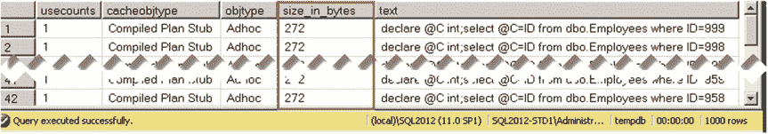
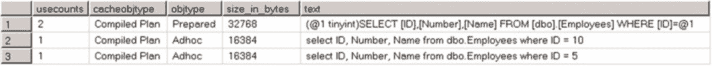
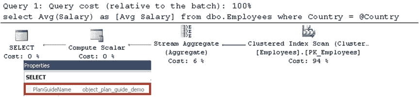

# 第 26 章 ■ 计划缓存

*即席工作负载优化*设置默认是禁用的。然而，在大多数系统中应该启用它。尽管它会在第二次即席查询重新编译时引入轻微的 CPU 开销，但对于即席活动频繁的系统，它可以显著减少计划缓存内存的使用。这些节省出来的内存可以用于缓冲池，从而减少物理 I/O 操作次数并提升系统性能。

你可以使用清单 26-17 所示的代码启用此设置。此外，也可以在 Management Studio 的“服务器属性”窗口的“高级”选项卡中启用它。

## 清单 26-17. 启用“即席工作负载优化”设置

```sql
exec sys.sp_configure N'optimize for ad hoc workloads', N'1';
reconfigure with override;
```





如果在启用了*即席工作负载优化*设置的情况下运行清单 26-16 中的代码，你会看到如图 26-10 所示的计划缓存内容。如你所见，它现在只使用 272 KB 内存，而不是之前的 32 MB。

## 图 26-10. 启用“即席工作负载优化”时的计划缓存内容

#### 自动参数化

在某些情况下，SQL Server 可能会决定将即席查询中的一些常量替换为参数，并缓存编译后的计划，就好像查询已被参数化一样。当这种情况发生时，使用不同常量的类似即席查询可以重用缓存的计划。

清单 26-18 展示了两个可以被参数化并共享一个编译计划的查询。

## 清单 26-18. 参数化

```sql
select ID, Number, Name from dbo.Employees where ID = 5
go

select ID, Number, Name from dbo.Employees where ID = 10
go
```

在内部，SQL Server 存储的编译计划如下所示：

```sql
(@1 tinyint)SELECT [ID],[Number],[Name] FROM [dbo].[Employees] WHERE [ID]=@1
```

默认情况下，SQL Server 根据常量值定义参数数据类型，选择能容纳该值的最小数据类型。例如，查询 `SELECT ID, Number, Name FROM dbo.Employees WHERE ID = 10000` 将引入另一个缓存计划，如下所示：

```sql
(@1 smallint)SELECT [ID],[Number],[Name] FROM [dbo].[Employees] WHERE [ID]=@1
```

当发生参数化时，除了参数化查询的编译计划外，SQL Server 还会在计划缓存中存储另一个结构，称为 *Shell 查询*。Shell 查询使用大约 16 KB 内存，存储有关原始查询的信息，将其链接到编译计划。

在图 26-11 中，你可以看到运行清单 26-18 中的查询后计划缓存的内容。如你所见，它存储了一个编译计划和两个 Shell 查询。

## 图 26-11. 发生参数化后的计划缓存内容

默认情况下，SQL Server 使用*简单参数化*，并且它在参数化查询时非常保守。简单参数化仅在缓存计划被认为是*安全可参数化*时发生，这意味着即使常量/参数值发生变化，该计划在计划形状和基数估计方面也会保持相同。例如，在唯一索引上具有*非聚集索引查找*和*密钥查找*的计划是安全的，因为无论参数值如何，它返回的行数永远不会超过一行。相反，在非唯一索引上进行相同操作则不安全。不同的参数值会导致不同的基数估计，这使得*聚集索引扫描*成为其中一些参数值的更好选择。

此外，有许多语言构造会阻止简单参数化，例如 `IN`、`TOP`、`DISTINCT`、`JOIN`、`UNION`、子查询以及相当多的其他构造。

或者，SQL Server 可以使用*强制参数化*，可以在数据库级别通过 `ALTER DATABASE SET PARAMETERIZATION FORCED` 命令启用，或者在查询级别通过...


## 参数化强制提示

在此模式下，SQL Server 会自动参数化大多数即席查询，只有极少数例外。

正如所料，强制参数化带来了一系列好处和缺点。一方面，它可以显著减少计划缓存的大小和 CPU 负载；另一方面，由于参数嗅探问题，它也增加了生成次优执行计划的可能性。

强制参数化的另一个问题是，SQL Server 在替换常量为参数时，不会给你任何关于要参数化哪些常量的控制权。这对于筛选索引尤其关键，因为参数化可能会阻止 SQL Server 生成并缓存一个利用筛选索引的计划，方法是用参数替换语句中的常量值。我在本书的配套材料中包含了一个这样的示例。

强制参数化的一个良好用例是客户端应用程序提交的复杂即席查询，特别是在执行计划的选择不依赖于常量值的情况下。虽然最好修改客户端应用程序并参数化查询，但这并非总是可行。

清单 26-19 展示了一个此类查询的示例。每次查询执行都会导致一次编译，并向计划缓存添加一个条目。这样的查询受益于强制参数化，因为该查询的最佳执行计划是聚集索引查找，并且它不会基于常量/参数值而改变。

### 清单 26-19. 一个受益于强制参数化的查询示例

```sql
select top 100 RecId, /* Other Columns */
from dbo.RawData
where RecID > 432312 -- Client application uses different values at every call
order by RecId
```

综上所述，在数据库级别启用强制参数化时，你需要小心谨慎。如果需要，在单个查询级别启用它会更安全。

#### 计划指南

查询提示在帮助解决各种与计划缓存相关的问题时非常有用。不幸的是，在某些情况下，你无法修改查询文本，要么是因为你无法访问应用程序代码，要么是因为重新编译和重新部署不可行或不切实际。

你可以通过使用计划指南来解决此类问题，它允许你在不更改查询文本的情况下向查询添加提示，甚至强制特定的执行计划。你可以使用 `sp_create_plan_guide` 存储过程创建它们，并使用 `sp_control_plan_guide` 存储过程管理它们。



### 第 26 章 ■ 计划缓存

有三种类型的计划指南可用，如下所示：

- **对象** 计划指南允许你为存在于 T-SQL 对象（如存储过程、触发器或用户定义函数）中的查询指定提示。
- **SQL** 计划指南允许你为特定的 SQL 查询（独立或作为批处理的一部分）指定提示。
- **模板** 计划指南允许你为特定的查询模板指定强制或简单的参数化类型，覆盖数据库设置。

清单 26-20 中的代码 从 `dbo.GetAverageSalary` 存储过程中删除了查询提示，并创建了一个带有 `OPTIMIZE FOR UNKNOWN` 提示的计划指南。`@Stmt` 参数应指定需要添加提示的查询，而 `@module_or_batch` 应指定对象的名称。

### 清单 26-20. 对象计划指南

```sql
alter proc dbo.GetAverageSalary @Country varchar(64)
as
select Avg(Salary) as [Avg Salary]
from dbo.Employees
where Country = @Country;
go

exec sp_create_plan_guide
@type = N'OBJECT'
,@name = N'object_plan_guide_demo'
,@stmt = N'select Avg(Salary) as [Avg Salary]
from dbo.Employees
where Country = @Country'
,@module_or_batch = N'dbo.GetAverageSalary'
,@params = null
,@hints = N'OPTION (OPTIMIZE FOR (@Country UNKNOWN))';
```

现在，如果你对 `@Country = 'Canada'` 运行存储过程，你将获得执行计划。


