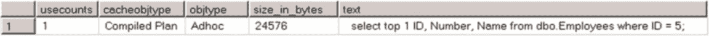
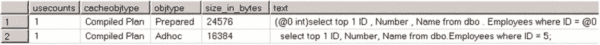
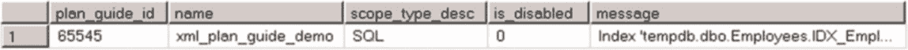

# 第 26 章 ■ 计划缓存

图 26-12 显示了这与在存储过程中使用查询提示的情况类似。你可以在图形化计划中顶级运算符的属性中，以及在其 XML 表示中看到，在优化过程中使用了计划指南。

**图 26-12.** 使用对象计划指南的执行计划



代码清单 26-21 展示了一个 SQL 计划指南的示例，该指南为查询设置了 MAXDOP 选项。在此模式下，`@module_or_batch`参数应设置为 null。

**代码清单 26-21.** SQL 计划指南

```sql
exec sp_create_plan_guide
    @type = N'SQL'
    ,@name = N'SQL_plan_guide_demo'
    ,@stmt = N'select Country, count(*) as [Count]
from dbo.Employees
group by Country'
    ,@module_or_batch = NULL
    ,@params = null
    ,@hints = N'OPTION (MAXDOP 2)' ;
```

使用模板计划指南则稍微复杂一些。与 SQL 和对象计划指南不同（在后者中，`@stmt`参数需要与查询逐字符匹配），模板计划指南要求你提供查询的模板。幸运的是，你可以使用另一个系统存储过程`sp_get_query_template`来准备它。

让我们看一个例子，假设我们希望 SQL Server 自动参数化代码清单 26-22 中的查询。尽管该查询的执行计划是安全的——在唯一索引上的聚集索引查找总会返回一行——但 TOP 子句阻止了 SQL Server 对其进行参数化。你可以在图 26-13 中看到这个即席缓存的计划。

**代码清单 26-22.** 模板计划指南：示例查询

```sql
select top 1 ID, Number, Name from dbo.Employees where ID = 5;
go
select p.usecounts, p.cacheobjtype, p.objtype, p.size_in_bytes, t.[text]
from sys.dm_exec_cached_plans p cross apply
sys.dm_exec_sql_text(p.plan_handle) t
where t.[text] like '%Employees%'
order by p.objtype desc
option (recompile);
```

**图 26-13.** 创建模板计划指南之前的计划缓存

代码清单 26-23 展示了如何创建模板计划指南并覆盖 PARAMETERIZATION 数据库选项。

**代码清单 26-23.** 模板计划指南：创建计划指南

```sql
declare
    @stmt nvarchar(max)
    ,@params nvarchar(max)

-- 获取查询的模板
exec sp_get_query_template
    @querytext = N'select top 1 ID, Number, Name from dbo.Employees where ID = 5;'
    ,@templatetext = @stmt output
    ,@params = @params output;

-- 创建计划指南
exec sp_create_plan_guide
    @type = N'TEMPLATE'
    ,@name = N'template_plan_guide_demo'
    ,@stmt = @stmt
    ,@module_or_batch = null
    ,@params = @params
    ,@hints = N'OPTION (PARAMETERIZATION FORCED)'
```

现在，如果你运行代码清单 26-22 中的代码，该语句将被参数化，如图 26-14 所示。

**图 26-14.** 创建模板计划指南之后的计划缓存



作为最后的选项，你可以通过在计划指南中指定或使用 USE PLAN 查询提示，强制 SQL Server 使用特定的执行计划。代码清单 26-24 展示了这两种方法的示例。完整的 XML 计划因节省书籍篇幅而被省略。

**代码清单 26-24.** 强制 XML 查询计划

```sql
-- 使用 USE PLAN 查询提示
select Avg(Salary) as [Avg Salary]
from dbo.Employees
where Country = 'Germany'
option (use plan N'<?xml version="1.0"?>
<ShowPlanXML><!-- 实际执行计划在此 --></ShowPlanXML>');
go

-- 使用计划指南
declare
    @Xml xml = N'<?xml version="1.0"?>
<ShowPlanXML><!-- 实际执行计划在此 --> </ShowPlanXML>';

declare
    @XmlAsNVarchar nvarchar(max) = convert(nvarchar(max),@Xml)

exec sp_create_plan_guide
    @type = N'SQL'
    ,@name = N'xml_plan_guide_demo'
    ,@stmt = N'select Avg(Salary) as [Avg Salary]
from dbo.Employees
where Country = ''Germany'''
    ,@module_or_batch = NULL
    ,@params = null
    ,@hints = @XmlAsNVarchar;
```




虽然查询提示和计划指南都强制 SQL Server 使用特定的执行计划，但在 SQL Server 2008 及以上版本中，当计划变得不正确时，它们表现出不同的行为。查询优化器会忽略不正确的计划指南，并生成一个如同未指定计划指南的计划。另一方面，带有 `USE PLAN` 提示的查询则会产生错误。此处显示了此类错误的一个示例。而在 SQL Server 2005 中，如果指定了无效的计划指南，查询会直接失败。

```
Msg 8712, Level 16, State 0, Line 1
USE PLAN 提示中指定的索引 'tempdb.dbo.Employees.IDX_Employees_Country' 不存在。请指定一个现有索引，或用指定名称创建索引。
```

当更改计划指南和 `USE PLAN` 提示中引用的对象的架构时，需要小心。即使你的更改不直接影响查询使用的索引和列，也完全有可能使计划失效。例如，唯一索引或约束可以消除计划中的某些断言，因此当你删除它们时会使计划失效。另一个常见示例是分区架构和函数的更改。

## 验证计划指南

从 SQL Server 2008 开始，你可以使用 `sys.fn_validate_plan_guide` 系统函数来检查计划指南是否仍然有效。清单 26-25 中的代码展示了一个示例。

**清单 26-25.** 验证计划指南

```sql
select pg.plan_guide_id, pg.name, pg.scope_type_desc, pg.is_disabled, vpg.message
from sys.plan_guides pg cross apply
( select message from sys.fn_validate_plan_guide(pg.plan_guide_id) ) vpg;
```

如果计划指南不正确，`sys.fn_validate_plan_guide` 函数会返回一行。你可以在图 26-15 中看到其输出的示例。

**图 26-15.** 验证计划指南

最后需要注意的是，计划指南仅在 SQL Server 的标准版、企业版和开发版中受支持。你仍然可以在不受支持的版本中创建计划指南，但查询优化器会忽略它们。

#### 计划缓存内部机制

SQL Server 将计划缓存分为四个不同的内存区域，称为*缓存存储*。每个缓存存储缓存不同的实体和计划，如下所示：

-   *SQL 计划*缓存存储（内部名称 `CACHESTORE_SQLCP`）存储参数化、即席查询和批处理的计划，以及自动参数化计划。
-   *对象计划*缓存存储（`CACHESTORE_OBJCP`）存储 T-SQL 对象（如存储过程、触发器和用户定义函数）的计划。
-   *扩展存储过程*缓存存储（`CACHESTORE_XPROC`）存储扩展存储过程的计划。
-   *绑定树*缓存存储（`CACHESTORE_PHDR`）存储在查询优化阶段生成的绑定树。

请注意，SQL Server 使用其他与计划缓存无关的缓存存储。你可以使用 `sys.dm_os_memory_cache_counters` 数据管理视图来检查它们的内容。

你可以使用 `SELECT` 语句来监控每个缓存存储的大小，如清单 26-26 所示。

**清单 26-26.** 检查缓存存储的大小

```sql
select type as [Cache Store], sum(pages_in_bytes) / 1024.0 as [Size in KB]
from sys.dm_os_memory_objects
where type in ( 'MEMOBJ_CACHESTORESQLCP','MEMOBJ_CACHESTOREOBJCP'
,'MEMOBJ_CACHESTOREXPROC','MEMOBJ_SQLMGR' )
group by type ;
```

每个缓存存储使用一个哈希表，其中哈希桶保存零个或多个计划。在 64 位实例的对象计划存储和 SQL 计划存储中，大约有 40,000 个桶，而在 SQL Server 的 32 位实例中大约有 10,000 个桶。绑定树缓存存储的大小约为该数字的十分之一，扩展存储过程存储中的桶数始终为 127。你可以使用 `sys.dm_os_memory_cache_hash_tables` 视图检查缓存存储属性。

SQL Server 使用一个非常简单的算法来计算计划的哈希值，基于以下公式：`(object_id * database_id) mod hash_table_size`。


