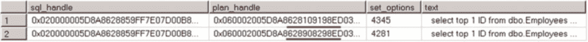

# 第 26 章 ■ 计划缓存

当缓冲池大小达到 50%时，`惰性写入器`进程会开始定期扫描计划缓存，在每次扫描时将每个计划的成本减少 1，并移除成本为零的计划。或者，对于即席查询，每次重用计划会将其成本增加 1，对于其他类型的计划，则增加原始的计划生成成本。

清单 26-27 展示了如何检查 SQL 和对象计划缓存存储中缓存条目的当前成本和原始成本。

***清单 26-27.*** 检查缓存条目的原始成本和当前成本

```sql
select
    q.Text as [SQL], p.objtype, p.usecounts, p.size_in_bytes, mce.Type as [Cache Store]
    ,mce.original_cost, mce.current_cost, mce.disk_ios_count
    ,mce.pages_kb /* 在 2012 年之前的 SQL Server 版本中使用 pages_allocation_count */
    ,mce.context_switches_count, qp.query_plan
from
    sys.dm_exec_cached_plans p with (nolock) join
    sys.dm_os_memory_cache_entries mce with (nolock) on
        p.memory_object_address = mce.memory_object_address
    cross apply sys.dm_exec_sql_text(p.plan_handle) q
    cross apply sys.dm_exec_query_plan(p.plan_handle) qp
where
    p.cacheobjtype = 'Compiled plan' and
    mce.type in (N'CACHESTORE_SQLCP',N'CACHESTORE_OBJCP')
order by
    p.usecounts desc
```

#### 检查计划缓存

有几个提供计划缓存相关信息的数据管理视图。让我们深入了解其中一些。

正如你已经看到的，`sys.dm_exec_cached_plans` 视图提供了存储在 SQL 和对象计划缓存存储中的每个计划的信息。该视图中的关键列是 `plan_handle`，它唯一标识该计划。对于批处理，即使该批处理中的一些语句被重新编译，该值也保持不变。除了 `plan_handle`，此视图还在 `cacheobjtype` 列中提供计划类型（Compiled Plan、Compiled Plan Stub 等），在 `objtype` 列中提供对象类型（Proc、Ad-Hoc query、Prepared、Trigger 等），以及引用和使用计数、内存大小和一些其他属性。

数据管理函数 `sys.dm_exec_plan_attributes` 接受 `plan_handle` 作为参数，并返回特定计划的一组属性。这些属性包括对计划所属数据库和对象的引用、提交批处理的会话的 `user_id` 以及相当多的其他属性。

其中一个属性 `sql_handle` 将计划链接到已编译的批处理。你可以将其与 `sys.dm_exec_sql_text` 函数一起使用来获取其 SQL 文本。

每个属性都有一个标志，指示它是否包含在*缓存键*中。SQL Server 仅在缓存计划的 `sql_handle` 和缓存键都与提交的批处理的值匹配时才会重用计划。以 `set_option` 属性为例。它包含在缓存键中；因此，不同的 SET 选项将导致不同的缓存键值，这将阻止计划重用。

一个由 `sql_handle` 标识的 SQL 批处理可以有多个由 `plan_handle` 标识的计划——每个计划对应一个缓存键属性值。清单 26-28 说明了此示例。

***清单 26-28.*** SQL_Handle 与 plan_handle 的关系

```sql
set quoted_identifier off
go
select top 1 ID from dbo.Employees where Salary > 40000;
go
set quoted_identifier on
go
select top 1 ID from dbo.Employees where Salary > 40000
go

;with PlanInfo(sql_handle, plan_handle, set_options)
as
(
    select pvt.sql_handle, pvt.plan_handle, pvt.set_options
    from
        ( select p.plan_handle, pa.attribute, pa.value
          from sys.dm_exec_cached_plans p with (nolock) outer apply
               sys.dm_exec_plan_attributes(p.plan_handle) pa
          where cacheobjtype = 'Compiled Plan' ) as pc
        pivot (max(pc.value) for pc.attribute
               in ("set_options", "sql_handle")) as pvt
)
select pi.sql_handle, pi.plan_handle, pi.set_options, b.text
from
    PlanInfo pi cross apply
    sys.dm_exec_sql_text(convert(varbinary(64),pi.sql_handle)) b
```




