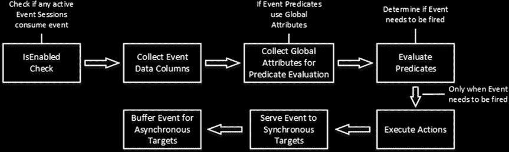
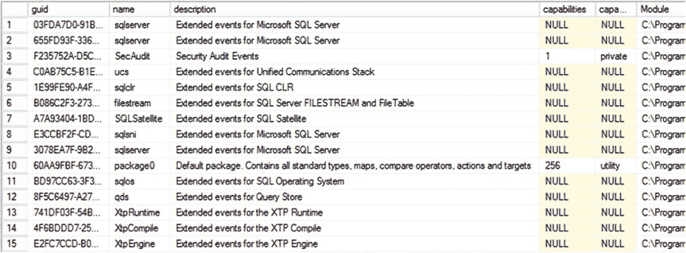

# 第五部分

## 第二十七章

### 扩展事件

`扩展事件`是 SQL Server 2008 中引入的一个高度可扩展的性能监控和故障排除解决方案。它旨在替代在 SQL Server 2012 中被弃用的 SQL 跟踪。

扩展事件是轻量级的，它们具有灵活性，可以对一些 SQL 跟踪无法处理的场景进行故障排除。

本章概述了扩展事件框架，并展示了如何使用它们。

#### 扩展事件概述

尽管 SQL 跟踪事件极其易于设置，但它们存在严重的局限性。所有事件类型都以相同格式生成输出。输出中的相同列对于不同的 SQL 跟踪事件可能提供不同的数据。例如，在`SQL:Batch Completed`事件中，`TextData`列包含 SQL 批处理的文本。而在`Lock:Acquired`事件中，同一列显示的是获取锁的资源。分析收集不同事件的跟踪输出很复杂。

性能是另一个重要因素。一个名为`跟踪控制器`的 SQL Server 组件管理所有`跟踪使用者`定义的 SQL 跟踪。它维护一个内部位图，显示当前活动跟踪所消耗的事件类型，因此需要被收集。其他 SQL Server 组件（在此上下文中称为`跟踪生产者`）分析该位图，并在需要时触发相应的事件。

跟踪生产者不知道跟踪中包含了哪些数据列。所有列的数据都会被收集并传递给控制器，由控制器评估跟踪过滤器并丢弃不需要的事件和数据列。

这种架构带来了不必要的开销。考虑这样一种情况：你想从特定会话中捕获长时间运行的 SQL 语句。SQL 跟踪可能只定义很少的列并只收集少量事件。然而，跟踪生产者会对进入系统的每条 SQL 语句都触发事件。跟踪控制器将完成所有进一步的过滤和列移除操作。

扩展事件框架的设计旨在解决这些局限。与 SQL 跟踪类似，它包括定义事件收集边界的`事件会话`。它们指定需要收集的事件类型和数据、用于过滤的谓词，以及存储数据的目标。SQL Server 可以同步地（在事件发生的同一线程中）或异步地（在为每个事件会话保留的内存中缓冲数据）将事件写入目标。

扩展事件使用 XML 格式。每种事件类型都有其自己的一组数据列。例如，`sql_statement_completed`事件提供了查询的读写次数、CPU 时间、持续时间和其他执行统计信息。你可以通过执行称为`操作`的运算符来收集额外的属性——例如，`tsql`堆栈。与 SQL 跟踪相比，扩展事件不会收集不必要的数据；也就是说，只收集一小部分事件数据列和指定的操作。

© Dmitri Korotkevitch 2016
D. Korotkevitch, `Pro SQL Server Internals`, DOI 10.1007/978-1-4842-1964-5_27



### 第二十七章 ■ 扩展事件

当 SQL Server 触发一个`事件`时，它会检查是否有任何活动的事件会话使用此类事件。当存在此类会话时，SQL Server 会收集事件数据列，如果定义了谓词，则会收集评估谓词所需的信息。如果谓词评估成功且需要触发事件，SQL Server 会收集所有操作，将数据传递给`同步目标`，并为...


## 异步目标
图 27-1 展示了这一过程。

***图 27-1.** 扩展事件生命周期*

最后，值得注意的是，SQL Server 2008 对扩展事件的支持相当有限，并未包含 SQL 跟踪中存在的所有事件。此外，SQL Server 2008 中的 Management Studio 没有提供用于操作扩展事件的用户界面。幸运的是，这些限制在 SQL Server 2012 及更高版本中得到了解决，所有 SQL 跟踪事件都有对应的扩展事件，并且 Management Studio 提供了管理和分析扩展事件数据的工具。

> **注意** 你可以从 SqlSkills.com 网站 `[`www.sqlskills.com/free-tools/`](http://www.sqlskills.com/free-tools/)` 或 CodePlex 下载由 Jonathan Kehayias 开发的 SQL Server 2008 扩展事件 Management Studio 插件。此外，Jonathan 撰写了一个关于扩展事件的出色教程，名为 “每日一事件”（An XEvent a Day），可在 `[`www.sqlskills.com/blogs/jonathan/category/xevent-a-day-series/`](http://www.sqlskills.com/blogs/jonathan/category/xevent-a-day-series/)` 获取。

#### 扩展事件对象

扩展事件框架由几个不同的对象组成。让我们详细研究它们。

### 包

SQL Server 将扩展事件对象组合成 *包*。你可以将包视为元数据信息的容器。每个扩展事件对象都通过一个两部分的名称来引用，包括包名和对象名。包并不为事件定义功能边界。将来自不同包的对象一起使用是完全正常的。

不同版本的 SQL Server 拥有不同数量的可用包，并通过 `sys.dm_xe_packages` 视图公开它们。你可以使用 清单 27-1 中所示的代码来检查它们。`Capabilities` 列是一个位掩码，描述了包的属性。最左边的位指示包是否是私有的，因此该包中的对象是否由 SQL Server 内部使用且用户无法访问。例如，`SecAudit` 包是私有的，被 SQL Server 用于审核功能。此包不能在任何用户定义的扩展事件会话中被引用。



**第 27 章 ■ 扩展事件**

***清单 27-1.*** 检查扩展事件包
```sql
select
    dxp.guid, dxp.name, dxp.description, dxp.capabilities,
    dxp.capabilities_desc, os.name as [Module]
from
    sys.dm_xe_packages dxp
    join sys.dm_os_loaded_modules os on
        dxp.module_address = os.base_address
```

图 27-2 显示了此查询在 SQL Server 2016 中的输出。

***图 27-2.** SQL Server 2016 中的扩展事件*

### 事件

*事件* 对应于 SQL Server 代码中的特定点；例如，SQL 语句完成、获取和释放锁、死锁条件等。

不同版本的 SQL Server 公开的事件数量不同。此外，事件数量可能随服务包的发布而增加。例如，SQL Server 2008 SP2 公开了 253 个事件，SQL Server 2012 RTM 公开了 617 个事件，SQL Server 2012 SP1 公开了 625 个事件，SQL Server 2014 RTM 公开了 870 个事件，而 SQL Server 2016 RTM 公开了 1,301 个事件。

在 SQL Server 2012 及更高版本中，每个 SQL 跟踪事件都有一个对应的扩展事件。然而，反之则不成立。SQL 跟踪在 SQL Server 2012 中已弃用，新的 SQL Server 功能不再通过 SQL 跟踪公开故障排除功能，而是使用扩展事件。

你可以使用 `sys.dm_xe_objects` 视图分析可用的事件，如 清单 27-2 所示。图 27-3 显示了 SQL Server 2016 中一个查询的部分输出。

***清单 27-2.*** 检查扩展事件
```sql
select
    xp.name as [Package],
    xo.name as [Event],
    xo.Description
from
    sys.dm_xe_packages xp
    join sys.dm_xe_objects xo on
        xp.guid = xo.package_guid
where
```


