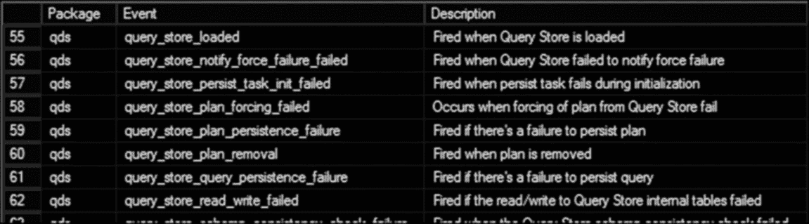
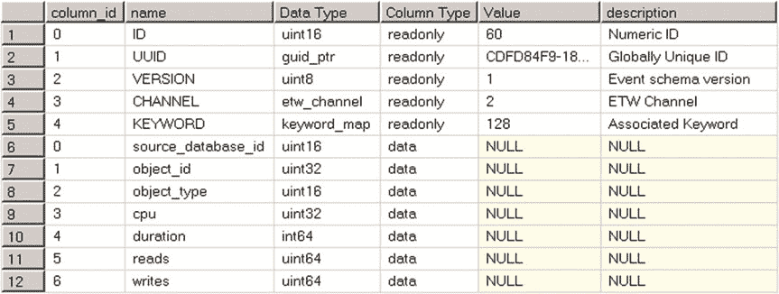
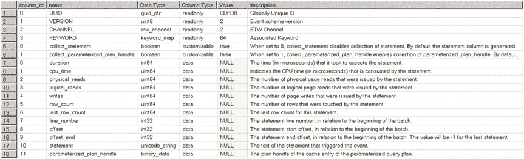
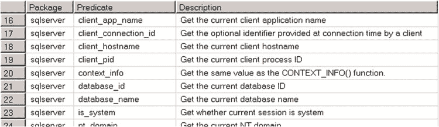
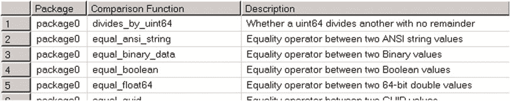
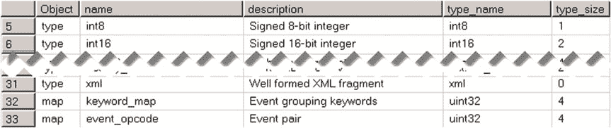
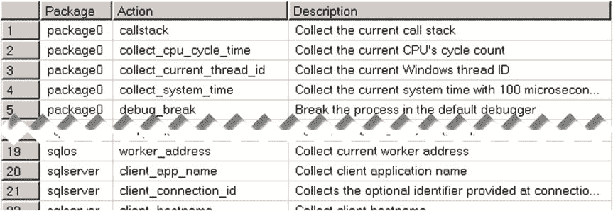
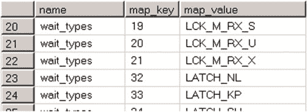
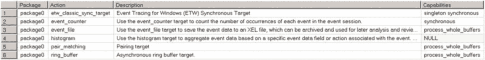
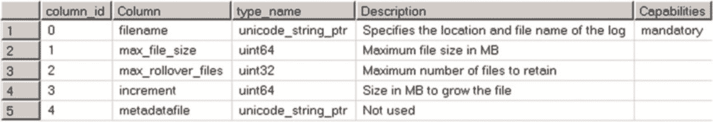

# 第 27 章 ■ 扩展事件



每个事件都有一组相关的列，这些列属于以下三类之一：

*   **只读** 列包含关于事件的静态信息，例如事件 GUID、架构版本和其他静态信息。
*   **数据** 列包含运行时事件数据。例如，`sql_statement_completed` 事件公开了各种与执行统计数据相关的数据列，如 I/O 操作次数、CPU 时间和其他运行时事件数据。
*   **可自定义** 列允许你在创建事件会话时更改其值，它们控制事件的行为。例如，`sql_statement_completed` 事件的 `collect_statement` 列控制在事件触发时是否收集 SQL 语句。默认情况下它是启用的；但是，你可以更改其值，并在繁忙的服务器上禁用语句收集。或者，`collect_parameterized_plan_handle` 列默认是禁用的，但可以在需要时启用。

你可以使用 `sys.dm_xe_object_columns` 视图检查事件列。以下查询展示了如何获取 `sql_statement_completed` 事件的列信息。

**清单 27-3.** 检查扩展事件列

```sql
select
    dxoc.column_id, dxoc.name, dxoc.type_name as [Data Type]
    , dxoc.column_type as [Column Type], dxoc.column_value as [Value], dxoc.description
from
    sys.dm_xe_object_columns dxoc
where
    dxoc.object_name = 'sql_statement_completed'
```

可用列的集合会根据所使用的 SQL Server 版本而变化。图 27-4 显示了在 SQL Server 2008 中执行上述查询的输出，图 27-5 显示了在 SQL Server 2012 及以上版本中的输出。值得注意的是，在这些情况下，事件数据中的 `VERSION` 列值是不同的。




**图 27-4.** SQL Server 2008 中的 `sql_statement_completed` 事件列

**图 27-5.** SQL Server 2012 及以上版本中的 `sql_statement_completed` 事件列

## 谓词

*谓词* 定义了事件需要触发的布尔条件。例如，如果你想收集有关 CPU 密集型查询的信息，你可以在 `sql_statement_completed` 事件的 `cpu_time` 列上定义一个谓词，只捕获 CPU 时间超过某个预定义阈值的语句。

尽管谓词看起来与 SQL 跟踪中的列筛选器非常相似，但它们之间有一个细微的区别。SQL 跟踪在事件被收集并传递给跟踪控制器后才评估列筛选器。相比之下，扩展事件只收集评估谓词所需的最少量数据，如果谓词评估结果为 `False`，则不会执行操作或触发事件。

谓词可以针对事件数据列或全局属性（如 `session_id`、`database_id` 等）来定义。你可以使用以下查询查看可用全局属性的列表。下图显示了在 SQL Server 2016 中此查询的部分输出。




**清单 27-4.** 检查全局属性

```sql
select xp.name as [Package], xo.name as [Predicate], xo.Description
from sys.dm_xe_packages xp join sys.dm_xe_objects xo on
    xp.guid = xo.package_guid
where
    (xp.capabilities is null or xp.capabilities & 1 = 0) and -- 排除私有包
    (xo.capabilities is null or xo.capabilities & 1 = 0) and -- 排除私有对象
    xo.object_type = 'pred_source'
order by
    xp.name, xo.name
```

**图 27-6.** 可用于谓词中的全局属性


谓词可以使用扩展事件框架提供的基本算术运算和比较函数。通过使用清单 27-5 中所示的查询，你可以查看可用函数的列表。

图 27-7 展示了此查询在 SQL Server 2016 中的部分输出。

***清单 27-5.*** 查看比较函数
```sql
select xp.name as [Package], xo.name as [Comparison Function], xo.Description
from sys.dm_xe_packages xp join sys.dm_xe_objects xo on
xp.guid = xo.package_guid
where
(xp.capabilities is null or xp.capabilities & 1 = 0) and -- exclude private packages
(xo.capabilities is null or xo.capabilities & 1 = 0) and -- exclude private objects
xo.object_type = 'pred_compare'
order by
xp.name, xo.name
```

***图 27-7.*** *可在谓词中使用的比较函数*

与 Transact SQL 不同，扩展事件支持短路谓词求值，类似于 C# 或 Java 等开发语言。当你使用逻辑 `OR` 和 `AND` 条件定义了多个谓词时，SQL Server 会在结果确定后立即停止求值。例如，如果你有两个使用逻辑 `AND` 运算符的谓词，并且第一个谓词被求值为 `False`，则 SQL Server 不会求值第二个谓词。

■ **提示** 收集全局属性数据会给谓词求值带来轻微开销。以先求值事件数据列、再求值全局属性的方式编写多个谓词是有帮助的，这样可以由于短路求值而防止收集全局属性数据。

SQL Server 在事件会话中维护谓词状态。例如，`package0.counter` 属性存储谓词被求值的次数。如果你想创建对数据进行采样的事件会话，例如每一百次或前十次事件发生时收集数据，可以依赖谓词状态。

## 操作

*操作* 让你能够随事件收集额外信息。可用操作包括 `session_id`、`client_app_name`、`query_plan_hash` 等许多其他项。操作在谓词求值之后执行，并且仅在事件将要触发时才执行。

SQL Server 在与事件相同的线程中同步执行操作，这会给事件收集增加开销。开销量取决于具体操作。其中一些操作——例如 `session_id` 或 `cpu_id`——相对较轻量。而其他操作，如 `sql_text` 或 `callstack`，在与频繁触发的事件一起收集时，可能会给 SQL Server 带来显著开销。执行计划相关的事件和操作也是如此，它们可能给服务器增加相当大的开销。

■ **重要提示** 尽管单个扩展事件相比 SQL 跟踪事件是轻量级的，但如果使用不当，仍然会给服务器带来相当大的开销。不要给 SQL Server 增加不必要的负载，仅收集故障排除所需的那些事件和操作。

你可以使用清单 27-6 中所示的查询来查看可用操作的列表。图 27-8 展示了该查询在 SQL Server 2016 中运行时的部分输出。

***清单 27-6.*** 查看操作
```sql
select xp.name as [Package], xo.name as [Action], xo.Description
from sys.dm_xe_packages xp join sys.dm_xe_objects xo on
xp.guid = xo.package_guid
where
(xp.capabilities is null or xp.capabilities & 1 = 0) and -- exclude private packages
(xo.capabilities is null or xo.capabilities & 1 = 0) and -- exclude private objects
xo.object_type = 'action'
order by
xp.name, xo.name
```





***图 27-8.*** *扩展事件操作*

## 类型和映射

在扩展事件框架中，数据属性通过类型或映射进行强类型化。*类型*


## 类型与映射

表示标量数据类型，如整型、字符型或 GUID。`映射`则是将整型键转换为人类可读表示的枚举器。

您可以将等待类型视为扩展事件映射的一个示例。可用的等待类型列表是预定义的，SQL Server 可以随事件返回一个整型等待类型键。`wait_types` 映射允许您将此代码转换为易于理解的等待类型定义。

您可以使用**清单 27-7**所示的查询查看可用类型和映射的列表。图 27-9 显示了在 SQL Server 2016 中运行该查询时的部分输出。

### 清单 27-7. 检查类型和映射

```sql
select xo.object_type as [Object], xo.name, xo.description, xo.type_name, xo.type_size
from sys.dm_xe_objects xo
where xo.object_type in ('type','map')
```

### 图 27-9. 扩展事件类型和映射

您可以使用 `sys.dm_xe_map_values` 视图检查某个类型的映射值列表。**清单 27-8** 展示了如何获取 `wait_types` 映射的值。图 27-10 显示了该查询的部分输出。





## 第 27 章 ■ 扩展事件

### 清单 27-8. 检查 wait_types 映射

```sql
select name, map_key, map_value
from sys.dm_xe_map_values
where name = 'wait_types'
order by map_key
```

### 图 27-10. wait_types 映射键值

## 目标

当所有事件数据被收集且事件触发后，它会被发送到`目标`。目标允许您存储和保留原始事件数据，或执行某些数据分析与聚合。

与包类似，有些目标是私有的，不能在扩展事件会话的定义中使用。您可以使用**清单 27-9**所示的代码检查公共目标的列表。

### 清单 27-9. 检查公共目标

```sql
select
    xp.name as [Package], xo.name as [Action], xo.Description,
    xo.capabilities_desc as [Capabilities]
from
    sys.dm_xe_packages xp join sys.dm_xe_objects xo on
    xp.guid = xo.package_guid
where
    (xp.capabilities is null or xp.capabilities & 1 = 0) and -- 排除私有包
    (xo.capabilities is null or xo.capabilities & 1 = 0) and -- 排除私有对象
    xo.object_type = 'target'
order by
    xp.name, xo.name
```

不同版本的 SQL Server 中，可用目标的集合基本相同。然而，目标名称在 SQL Server 2008/2008R2 与后续版本之间有所不同。图 27-11 显示了 SQL Server 2012-2016 中的可用目标列表。

### 图 27-11. SQL Server 2012-2016 扩展事件目标

## 第 27 章 ■ 扩展事件

现在，让我们更深入地了解目标。一些最有用的目标列举如下：

`ring_buffer` 目标将数据存储在一个预定义大小的内存中环形缓冲区中。当缓冲区满时，新事件会覆盖缓冲区中最旧的事件。因此，事件可以被无限期地消费。但是，只保留最新的事件。当您需要进行故障排除且之后不需要保留事件数据时，此目标最有用。这是一个异步目标（稍后会详细介绍），在所有 SQL Server 版本中均受支持。

`asynchronous_file_target`（SQL Server 2008/2008R2）和 `event_file`（SQL Server 2012-2016）目标使用专有二进制格式将事件存储在文件中。当您希望保留会话收集的原始事件数据时，这些目标最有用。这些目标是异步的。

`etw_classic_sync_target` 是一个基于文件的目标，它以支持 ETW 的读取器可以使用的格式写入数据。当您需要将 SQL Server 事件与由 Windows 内核和其他非 SQL Server 组件生成的事件跟踪事件关联时，会使用此目标。（这些场景超出了本书的范围。）这是一个同步目标，在所有 SQL Server 版本中均受支持。

`synchronous_event_counter`（SQL Server 2008/2008R2）和 `event_`


## 第 27 章 ■ 扩展事件

`counter`（SQL Server 2012-2016）目标用于计算事件会话中每个事件的发生次数。当您需要分析工作负载中的特定指标，而又不想引入完整事件收集的开销时，此目标非常有用。例如，您可以考虑计算系统中的查询数量。这些目标是同步的。

`synchronous_bucketizer`（SQL Server 2008/2008R2）、`asynchronous_bucketizer`（SQL Server 2008/2008R2）和`histogram`（SQL Server 2012-2016）目标允许您对特定事件进行计数，并根据指定的事件数据列或操作对结果进行分组。例如，您可以按数据库计算系统中的查询数量。SQL Server 2008/2008R2 中的 `bucketizer` 目标可以是同步的，也可以是异步的，而 `histogram` 目标是异步的。

`pair_matching` 目标可帮助您排查因某种原因导致某个预期事件未发生的情况。一个例子是通过查找有 `database_transaction_begin` 事件但没有相应 `database_transaction_end` 事件的情况来排查孤立事务。`pair_matching` 目标会丢弃所有匹配的事件对，只保留不匹配的事件。这是一个异步目标，在所有 SQL Server 版本中均受支持。

每个目标都有自己的一套属性，需要在事件会话中进行配置。例如，`ring_buffer` 目标要求您指定要保留的内存量和/或事件数量，以及缓冲区中每种事件类型的最大出现次数。清单 27-10 展示了如何检查目标的配置参数，这里以 `event_file` 目标为例。图 27-12 显示了此查询的输出。



***清单 27-10.*** 检查目标配置参数

```sql
select
    oc.column_id, oc.name as [Column], oc.type_name
    ,oc.Description, oc.capabilities_desc as [Capabilities]
from
    sys.dm_xe_objects xo join sys.dm_xe_object_columns oc on
    xo.package_guid = oc.object_package_guid and
    xo.name = oc.object_name
where
    xo.object_type = 'target' and
    xo.name = 'event_file'
order by
    oc.column_id
```

***图 27-12.** Event_file 目标配置设置*

■ **注意** 您可以在 `http://technet.microsoft.com/en-us/library/bb630339.aspx` 阅读更多关于目标及其配置设置的信息。请记住，配置设置在不同版本的 SQL Server 中有所不同。

您可以在一个事件会话中使用多个事件目标。例如，您可以将 `event_file` 目标与 `ring_buffer` 结合使用，后者用于实时故障排查，同时将事件保留在文件中。

如您所见，目标可以是同步的或异步的。SQL Server 在触发事件的执行线程中将数据写入同步目标。对于异步目标，SQL Server 将事件缓冲在内存中，并定期将它们刷新到目标。事件会话配置设置 `EVENT_RETENTION_MODE` 控制当缓冲区已满时新事件的处理方式，如下所示：

`NO_EVENT_LOSS` 选项表示必须保留所有事件，事件丢失是不可接受的。SQL Server 执行线程会等待，直到缓冲区被刷新并有空闲空间来容纳新事件。正如您所猜测的，此选项可能对 SQL Server 产生重大的性能影响。例如，考虑一个使用 `event_file` 目标收集已获取和已释放锁信息的事件会话。该事件会话可以收集大量的事件，当保存事件数据时，I/O 吞吐量很快就会成为瓶颈。

`ALLOW_SINGLE_EVENT_LOSS` 选项允许会话在缓冲区已满时丢失单个事件。此选项可减少对 SQL Server 的性能影响。


