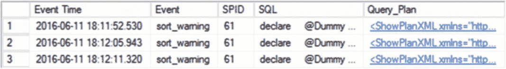
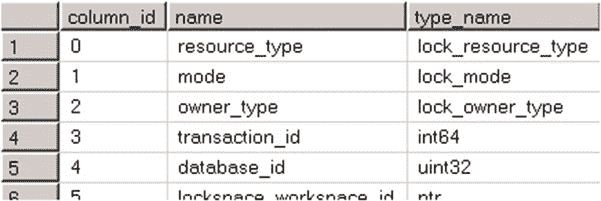

# 第 27 章 ■ 扩展事件

```sql
select convert(xml,st.target_data) as Data

from sys.dm_xe_sessions s join sys.dm_xe_session_targets st on

s.address = st.event_session_address

where s.name = 'TempDB Spills' and st.target_name = 'ring_buffer'

)

,EventInfo([Event Time],[Event],SPID,[SQL],PlanHandle)

as

(
```



```sql
select

t.e.value('@timestamp','datetime') as [Event Time]

,t.e.value('@name','sysname') as [Event]

,t.e.value('(action[@name="session_id"]/value)[1]','smallint') as [SPID]

,t.e.value('(action[@name="sql_text"]/value)[1]','nvarchar(max)') as [SQL]

,t.e.value('xs:hexBinary((action[@name="plan_handle"]/value)[1])'

,'varbinary(64)') as [PlanHandle]

from

TargetData cross apply

TargetData.Data.nodes('/RingBufferTarget/event') as t(e)

)

select

ei.[Event Time], ei.[Event], ei.SPID, ei.SQL, qp.Query_Plan

from

EventInfo ei outer apply

sys.dm_exec_query_plan(ei.PlanHandle) qp
```

如果您使用[第 3 章](http://dx.doi.org/10.1007/978-1-4842-1964-5_3)中清单 3-6、3-7 和 3-8 的代码强制发生了 tempdb 溢出，您将看到与图 27-13 所示相似的结果。

## 图 27-13. 检查 `ring_buffer` 目标数据

不幸的是，`sys.dm_xe_session_targets` 视图存在一个限制，它将 `target_data` 列的 XML 输出大小限制为 4 MB。这可能导致 `ring_buffer` 目标中的某些事件未出现在视图中。即使配置的 `ring_buffer` 大小小于 4 MB，也可能发生这种情况；事件在内部以二进制格式存储，而 XML 序列化会显著增加输出大小，使其超过 4 MB。更安全的方法是使用基于文件的目标来避免这种“事件丢失”的情况。

## 使用 `event_file` 和 `asynchronous_file_target` 目标

`sys.fn_xe_file_target_read_file` 表值函数允许您读取 `asynchronous_file_target` 和 `event_file` 目标的内容。

与 SQL 跟踪类似，扩展事件的基于文件的目标可以生成多个滚动文件。您可以通过在函数的第一个参数 `@path` 中指定确切的文件名来读取单个文件的数据。或者，您可以使用带有通配符的 `@path` 来读取所有文件的数据。

SQL Server 2008/2008R2 的 `asynchronous_file_target` 会创建另一种称为*元数据文件*的文件类型。您应该在函数的第二个参数 `@mdpath` 中提供此文件的路径。尽管 SQL Server 2012-2016 不使用元数据文件，但此函数出于向后兼容的原因仍保留了此参数。您可以使用 `NULL` 代替。

最后，第三和第四个参数允许您指定开始读取的位置。第三个参数 `@initial_file_name` 是要读取的第一个文件。第四个参数 `@initial_offset` 是文件中的起始偏移量。此函数会跳过文件中直到该偏移值的所有数据。文件名和偏移量都包含在结果集中，这使您能够实现仅读取新收集数据的代码。

## 清单 27-14. 从 `event_file` 目标读取数据

```sql
;with TargetData(Data, File_Name, File_Offset)

as

(

select convert(xml,event_data) as Data, file_name, file_offset

from sys.fn_xe_file_target_read_file('c:\extevents\TempDB_Spiils*.xel', null, null

,null)

)

,EventInfo([Event Time], [Event], SPID, [SQL], PlanHandle, File_Name, File_Offset)

as

(

select

Data.value('/event[1]/@timestamp','datetime') as [Event Time]

,Data.value('/event[1]/@name','sysname') as [Event]

,Data.value('(/event[1]/action[@name="session_id"]/value)[1]','smallint') as [SPID]

,Data.value('(/event[1]/action[@name="sql_text"]/value)[1]','nvarchar(max)')

as [SQL]

,Data.value('xs:hexBinary((/event[1]/action[@name="plan_handle"]/value)[1])'

,'varbinary(64)') as [PlanHandle]

,File_Name, File_Offset

from TargetData

)
```


进入 `EventInfo` 视图，选择 `ei.[Event Time]`、`ei.File_Name`、`ei.File_Offset`、`ei.[Event]`、`ei.SPID`、`ei.SQL` 以及 `qp_Query_Plan`。

```sql
select ei.[Event Time], ei.File_Name, ei.File_Offset, ei.[Event], ei.SPID, ei.SQL
,qp_Query_Plan
from EventInfo ei outer apply sys.dm_exec_query_plan(ei.PlanHandle) qp
```

对于活动会话，你可以从 `sys.dm_xe_session_object_columns` 视图获取目标文件的路径。然而，此路径不包含回滚信息，而 SQL Server 在创建文件时会将此信息附加到文件名中。你需要通过向路径添加通配符来转换它。清单 27-15 展示了如何在 SQL Server 2012-2016 中执行此操作。

**清单 27-15.** 读取 SQL Server 2012 – 2016 中 event_file 目标文件的路径

```sql
declare @dataFile nvarchar(260)
-- Get path to event data file
select
@dataFile = left(column_value,len(column_value ) - charindex('.',reverse(column_value)))
+ '*.' + right(column_value, charindex('.',reverse(column_value))-1)
from
sys.dm_xe_session_object_columns oc join sys.dm_xe_sessions s on
oc.event_session_address = s.address
where
s.name = 'TempDB Spills' and
oc.object_name = 'event_file' and
oc.column_name = 'filename';
```

**CHAPTER 27 ■ EXTENDED EVENTS**

你可以使用类似的方法在 SQL Server 2008/2008R2 中获取元数据文件的路径。但是，如果你未将元数据文件路径指定为目标的参数，则它在 `sys.dm_xe_session_object_columns` 视图中可能为 NULL，在这种情况下，你需要使用与事件文件相同的文件名，将扩展名替换为 `.xem`。

**使用 event_counter 和 synchronous_event_counter 目标**

`synchronous_event_counter` (SQL Server 2008/2008R2) 和 `event_counter` (SQL Server 2012-2016) 目标允许你计算特定事件发生的次数。这两个目标都以非常简单的 XML 格式提供数据，可以通过 `sys.dm_xe_session_targets` 视图中的 `event_data` 列访问。

清单 27-16 创建了一个事件会话，用于计算对 tempdb 文件的读取和写入次数；这将在 SQL Server 2012-2016 中工作。如果你将目标名称替换为 `synchronous_event_counter`，此代码同样适用于 SQL Server 2008/2008R2。

**清单 27-16.** 创建一个计算 tempdb 文件读写次数的会话

```sql
create event session [FileStats]
on server
add event sqlserver.file_read_completed ( where(sqlserver.database_id = 2) ),
add event sqlserver.file_write_completed ( where(sqlserver.database_id = 2) )
add target package0.event_counter
with
(
event_retention_mode=allow_single_event_loss
,max_dispatch_latency=5 seconds
);
```

启动会话后，你可以使用清单 27-17 中所示的代码检查收集的数据。如果你正在使用 SQL Server 2008/2008R2，应将 `TargetData` CTE 中的目标名称更改为 `synchronous_event_counter`。

**清单 27-17.** 检查会话数据

```sql
;with TargetData(Data)
as
(
select convert(xml,st.target_data) as Data
from sys.dm_xe_sessions s join sys.dm_xe_session_targets st on
s.address = st.event_session_address
where s.name = 'FileStats' and st.target_name = 'event_counter'
)
,EventInfo([Event],[Count])
as
(
select t.e.value('@name','sysname') as [Event], t.e.value('@count','bigint') as [Count]
from
TargetData cross apply
TargetData.Data.nodes('/CounterTarget/Packages/Package[@name="sqlserver"]/Event') as t(e)
)
select [Event], [Count] from EventInfo;
```



**CHAPTER 27 ■ EXTENDED EVENTS**

**使用 histogram、synchronous_bucketizer 和 asynchronous_bucketizer 目标**

直方图或分桶目标根据事件数据对特定事件类型的出现进行分组。考虑这样一种场景：你有一个包含大量数据库的 SQL Server 实例，并且你想找出哪些数据库未在使用中。你可以分析索引使用统计信息；然而，这种方法并非万无一失，对于使用较少的数据库，如果统计信息因 SQL Server 重启、索引重建或其他原因而卸载，则可能会提供不正确的结果。


