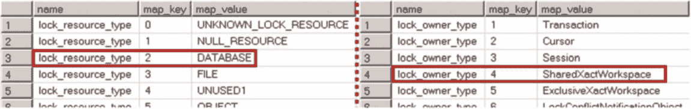

# Extended Events 监控数据库活动

Extended Events 可以帮助你解决这个问题。有两种简单的方法可以实现你的目标。你可以通过捕获 `sql_statement_starting` 和 `rpc_starting` 事件来分析针对不同数据库的活动。或者，你可以查看数据库级别的共享（S）锁，任何访问数据库的会话都会获取这种锁。无论采用哪种方法，直方图或分桶器目标都允许你对这些事件的发生次数进行计数，并按 `database_id` 进行分组。

让我们看看第二种方法，并实现一个跟踪数据库级锁的事件会话。第一步，让我们使用如**清单 27-18** 所示的查询来分析 `lock_acquired` 事件的数据列。

**图 27-14** 显示了该查询的部分结果。

**清单 27-18.** 检查 `lock_acquired` 事件数据列

```sql
select column_id, name, type_name
from sys.dm_xe_object_columns
where column_type = 'data' and object_name = 'lock_acquired'
```

**图 27-14.** `lock_acquired` 事件数据列

如你所见，`resource_type` 和 `owner_type` 列的数据类型是映射（map）。你可以使用如**清单 27-19** 所示的查询来检查所有可能的值。**图 27-15** 显示了查询的部分结果。

**清单 27-19.** 检查 `lock_resource_type` 和 `lock_owner_type` 映射

```sql
select name, map_key, map_value
from sys.dm_xe_map_values
where name = 'lock_resource_type'
order by map_key;

select name, map_key, map_value
from sys.dm_xe_map_values
where name = 'lock_owner_type'
order by map_key;
```



**图 27-15.** `lock_resource_types` 和 `lock_owner_types` 值

当 `owner_type` 为 `DATABASE` 且 `resource_type` 为 `SharedXActWorkspace` 的 `Lock_acquired` 事件在每次会话访问数据库时都会触发。**清单 27-20** 创建了一个事件会话，使用 SQL Server 2012-2016 捕获这些事件。如果你更改目标名称，这种方法在 SQL Server 2008/2008R2 中同样有效。

**清单 27-20.** 创建事件会话

```sql
create event session DBUsage
on server
add event sqlserver.lock_acquired
(
    where
        database_id > 4 and -- Users DB
        owner_type = 4 and -- SharedXactWorkspace
        resource_type = 2 and -- DB-level lock
        sqlserver.is_system = 0
)
add target package0.histogram
(
    set
        slots = 32 -- Based on # of DB
        ,filtering_event_name = 'sqlserver.lock_acquired'
        ,source_type = 0 -- event data column
        ,source = 'database_id' -- grouping column
)
with
(
    event_retention_mode=allow_single_event_loss
    ,max_dispatch_latency=30 seconds
);
```

直方图和/或分桶器目标有四个不同的参数，如下所示：

`slots` 表示要保留的不同值（组）的最大数量。一旦达到这个数字，SQL Server 会忽略所有新值（组）。你应该小心，并始终保留足够的槽位来保存数据中可能出现的所有组的信息。在我们的例子中，你应该设置一个超过实例中数据库数量的槽位值。为了提高性能，SQL Server 会将提供的值向上取整到下一个 2 的幂。

`source` 包含提供分组数据的事件列或操作的名称。

`source_type` 是你进行分组所依据对象的类型，可以是 0 或 1，分别表示按事件数据列或操作进行分组。默认值是 1，即操作。

`filtering_event_name` 是一个可选值，用于指定你用作分组数据源的事件会话中的事件。如果你按事件数据列分组，则应指定该值；如果按操作分组，则可以省略。在后一种情况下，分组可以基于来自多个事件的操作。

你可以通过 `sys.dm_xe_session_targets` 视图中的 `event_data` 列访问直方图或分桶器事件数据。**清单 27-21** 显示了分析 `DBUsage` 事件会话结果的代码。

## *清单 27-21.* 检查直方图数据

```sql
;with TargetData(Data)
as
(
    select convert(xml,st.target_data) as Data
    from sys.dm_xe_sessions s join sys.dm_xe_session_targets st on
        s.address = st.event_session_address
    where s.name = 'DBUsage' and st.target_name = 'histogram'
)
,EventInfo([Count],[DBID])
as
(
    select t.e.value('@count','int'), t.e.value('((./value)/text())[1]','smallint')
    from
        TargetData cross apply
        TargetData.Data.nodes('/HistogramTarget/Slot') as t(e)
)
select e.dbid, d.name, e.[Count]
from sys.databases d left outer join EventInfo e on
    e.DBID = d.database_id
where d.database_id > 4
order by e.Count
```

最后，值得注意的是，这种方法可能会产生*误报*，因为它会将各种维护任务（例如 `CHECKDB`、备份等）以及 SQL Server Management Studio 获取的锁也统计在内。

## 使用 pair_matching 目标

`pair_matching` 目标用于在*开始*事件没有对应的*结束*事件时维护未匹配事件的信息，当事件匹配时则将其从目标中移除。例如，考虑孤儿事务，其中 `database_transaction_begin` 事件没有对应的 `database_transaction_end` 事件。另一个案例是查询超时，此时 `sql_statement_starting` 事件没有对应的 `sql_statement_completed` 事件。

让我们看后一个例子并创建一个事件会话，如清单 27-22 所示。`pair_matching` 目标要求您根据事件数据列和/或操作指定匹配条件。

同样值得注意的是，在某些情况下——例如使用 ADO.Net SQL Client 库时——在故障排除期间还需要捕获 `rpc_starting` 和 `rpc_completed` 事件。

### 第 27 章 ■ 扩展事件

## *清单 27-22.* 创建一个带有 pair_matching 目标的事件会话

```sql
create event session [Timeouts]
on server
    add event sqlserver.sql_statement_starting ( action (sqlserver.session_id) ),
    add event sqlserver.sql_statement_completed ( action (sqlserver.session_id) )
    add target package0.pair_matching
    (
        set
            begin_event = 'sqlserver.sql_statement_starting'
            ,begin_matching_columns = 'statement'
            ,begin_matching_actions = 'sqlserver.session_id'
            ,end_event = 'sqlserver.sql_statement_completed'
            ,end_matching_columns = 'statement'
            ,end_matching_actions = 'sqlserver.session_id'
            ,respond_to_memory_pressure = 0
    )
with
(
    max_dispatch_latency=10 seconds
    ,track_causality=on
);
```

您可以通过 `sys.dm_xe_session_targets` 视图中的 `event_data` 列来检查 `pair_matching` 数据。清单 27-23 展示了这种方法。

## *清单 27-23.* 检查 pair_matching 目标数据

```sql
;with TargetData(Data)
as
(
    select convert(xml,st.target_data) as Data
    from sys.dm_xe_sessions s join sys.dm_xe_session_targets st on
        s.address = st.event_session_address
    where s.name = 'Timeouts' and st.target_name = 'pair_matching'
)
select
    t.e.value('@timestamp','datetime') as [Event Time]
    ,t.e.value('@name','sysname') as [Event]
    ,t.e.value('(action[@name="session_id"]/value/text())[1]','smallint') as [SPID]
    ,t.e.value('(data[@name="statement"]/value/text())[1]','nvarchar(max)') as [SQL]
from
    TargetData cross apply TargetData.Data.nodes('/PairingTarget/event') as t(e)
```

#### System_health 和 AlwaysOn_Health 会话

扩展事件框架的一个强大特性是 `system_health` 事件会话，它默认在每个 SQL Server 安装中创建并运行。此会话捕获有关 SQL Server 组件状态和资源使用情况的各种信息、高严重性内部错误、对资源或锁的过度等待以及其他多种事件。该会话使用 `ring_buffer` 和 `event_file` 目标来存储数据。

### 第 27 章 ■ 扩展事件

默认情况下，`system_health` 会话在 SQL Server 启动时启动。当您开始进行故障排除时，它能让您了解 SQL Server 实例中最近发生的情况。此外，最近的严重事件

#### 使用扩展事件

许多事件数据已经被收集，无需你设置任何监控例程。

其中一个例子是死锁排查。`system_health` 会话会收集 `xml_deadlock_report` 事件。因此，当客户抱怨死锁时，你可以分析已收集的数据，而无需等待下一次死锁发生。

SQL Server 2012-2016 的企业版和 SQL Server 2016 的标准版引入了另一个名为 `AlwaysOn_health` 的默认扩展事件会话。顾名思义，该会话收集与 AlwaysOn 可用性组相关的事件信息，例如错误和故障转移。仅当 SQL Server 参与 AlwaysOn 可用性组时，此会话才会启用。

最后，SQL Server 2016 还有一个名为 `telemetry_xevents` 的事件会话，用于收集各种遥测数据，并将其存储在 `ring_buffer` 目标中。大部分信息属于 SQL Server 2016 的新功能，如行级安全、延伸数据库和时态表；然而，部分信息与常规操作相关，例如数据库创建、缺失的统计信息和联接谓词等。

你可以在 SQL Server Management Studio 中通过编写脚本来检查由 `system_health`、`AlwaysOn_health` 和 `telemetry_xevents` 会话收集的事件。如果需要，你甚至可以修改会话定义。但要小心，因为在 SQL Server 升级或安装服务包时，这些更改可能会被覆盖。

### 检测高开销查询

你可以通过捕获执行指标超过某些阈值的 `sql_statement_completed` 和 `rpc_completed` 事件来检测系统中的高开销查询。这种方法允许你捕获那些没有缓存执行计划且未在 `sys.dm_exec_query_stats` 视图中暴露的查询。然而，选择需要优化的查询后，你将需要执行额外的工作来聚合和分析收集到的数据。

找到定义系统中高开销查询的正确阈值非常重要。尽管你不想捕获过多的信息，但收集“正确”的信息至关重要。优化相对开销较低但执行非常频繁的查询，与优化开销高但很少执行的查询相比，通常能带来更好的效果。分析 `sys.dm_exec_query_stats` 视图的数据可以帮助你检测到部分此类查询，应将其与扩展事件并行使用。

清单 27-24 展示了一个事件会话，用于捕获 CPU 时间超过五秒，或发出超过 10,000 次逻辑读或写的查询。显然，你需要根据系统工作负载微调过滤器，避免收集过多的数据。

**清单 27-24.** 捕获高开销查询

```
create event session [Expensive Queries]
on server
add event sqlserver.sql_statement_completed
(
    action ( sqlserver.plan_handle )
    where
    (
        (
            cpu_time >= 5000000 or -- 时间单位为微秒
            logical_reads >= 10000 or writes >= 10000
        ) and sqlserver.is_system = 0
    )
),
add event sqlserver.rpc_completed
(
    where
    (
        (
            cpu_time >= 5000000 or -- 时间单位为微秒
            logical_reads >= 10000 or writes >= 10000
        ) and sqlserver.is_system = 0
    )
)
add target package0.event_file
( set filename = 'c:\ExtEvents\Expensive Queries.xel' )
with
( event_retention_mode=allow_single_event_loss );
```

清单 27-25 展示了从 `event_file` 目标提取数据的查询。

**清单 27-25.** 提取高开销查询信息

```
;with TargetData(Data, File_Name, File_Offset)
as
(
    select convert(xml,event_data) as Data, file_name, file_offset
    from sys.fn_xe_file_target_read_file('c:\extevents\Expensive*.xel',null, null, null)
)
```


