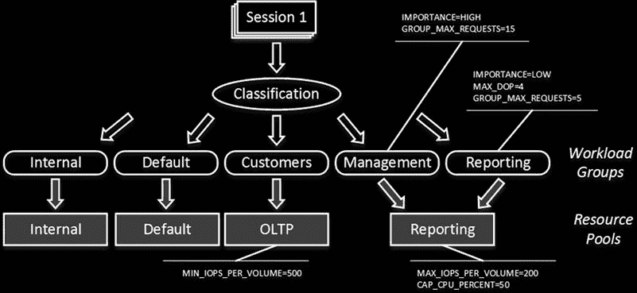
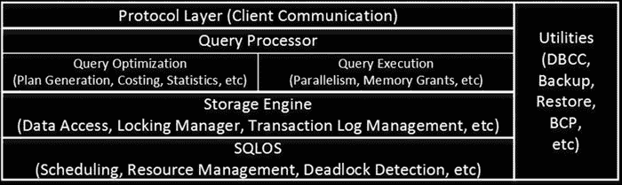

# 第 28 章 ■ 系统故障排除

SQL Server 内存配置。此部分稍后详述。

是否启用了 `针对临时工作负载进行优化` 设置？在大多数系统中，此项需要启用。

磁盘子系统的高级配置，包括 RAID 级别、条带大小和分区对齐。实际上，在大多数情况下，我在分析 I/O 子系统延迟、吞吐量和冗余的同时，也会分析此配置。同样无法避免的是讨论数据文件与日志文件的放置位置。如您所知，将数据文件和日志文件分离到不同的磁盘阵列是良好实践，它能在灾难发生时提供更好的数据可恢复性。然而，您也应考虑 I/O 系统性能和吞吐量。在某些情况下，当存储子系统没有足够的磁盘轴数时，将所有文件放在单个驱动器上比分散在多个驱动器上能获得更好的性能。尽管如此，您仍需考虑这种方法带来的数据丢失风险增加。

`tempdb` 数据文件的数量，以及数据/日志文件的自动增长参数。

用户数据库选项。这包括自动收缩和自动关闭（这两者都应禁用），以及页验证（应设置为 `CHECKSUM`）。我还会查看统计信息更新参数，并在未来将其与统计信息维护计划关联起来。

我还会检查是否启用了 `允许快照隔离` 选项。关键在于避免因启用但不使用它而带来不必要的 `tempdb` 开销。显然，在分析灾难恢复策略时，也需要分析数据库恢复模式。

数据库文件的自动增长参数以及事务日志中的 VLF（虚拟日志文件）数量。同一文件组中的数据文件应具有相同的初始大小，并以 MB 而非百分比指定自动增长参数。VLF 的数量应是可控的，我们将在第 30 章（http://dx.doi.org/10.1007/978-1-4842-1964-5_30）“事务日志内部原理”中讨论此问题。在某些情况下，我会考虑启用跟踪标志 `T1117` 以确保文件组中的所有文件同时自动增长。在 SQL Server 2016 中，此行为由 `AUTOGROW_ALL_FILES` 文件组设置控制，而非跟踪标志。

此列表仅是分析的起点，除了基本配置问题外，并未涵盖其他内容，也未向您提供有关瓶颈和系统运行状况的任何信息。尽管如此，作为系统故障排除的初始阶段，它还是很有用的。

#### 资源调控器概述

SQL Server 企业版附带另一项有用功能，称为 `资源调控器`。它允许您将不同的工作负载模式和会话分离到不同的 `工作负载组` 中。分类通过一个用户定义的函数（称为 `分类器函数`）完成，SQL Server 在登录阶段调用此函数。分类器函数根据用户定义的标准执行分类；例如，登录名、主机或应用程序名称。

工作负载组允许您指定多个参数，例如 `MAXDOP`（最大并行度）、要执行的最大并发请求数、用于查询内存授予的工作空间内存百分比（稍后详述）以及其他一些参数。此外，每个工作负载组都与一个 `资源池` 相关联，该资源池允许您为关联的工作负载组自定义或限制资源使用。

SQL Server 文档将资源池称为主实例内部的虚拟 SQL Server 实例。但我认为这并不准确。资源池并未提供足够的相互隔离；然而，它们确实允许您配置某些参数，例如设置关联性、限制 CPU 带宽以及控制用于内存授予的工作空间内存。在 SQL Server 2014 和 2016 中，您还可以控制磁盘吞吐量。不过，`资源调控器` 不允许您控制缓冲池使用量；它在所有池之间是共享的。

系统中有两种工作负载组和资源池：`internal` 和 `default`。顾名思义，第一种处理内部工作负载，第二种负责所有未分类的工作负载。实际上，你可以更改默认工作负载组的参数——例如，减少最大内存授予的大小——而无需创建其他用户定义的工作负载组和资源池。

图 28-1 展示了一个资源配置器的配置示例。它描绘了一个将面向客户的 OLTP 与内部报告活动分离的场景，从而避免了报告查询占满磁盘吞吐量和 CPU 的情况。另一个常见示例是为维护活动创建独立的工作负载和资源池，通过限制这些操作的磁盘吞吐量来减轻索引维护或数据库一致性检查的影响。

**图 28-1.** 资源调控器配置示例

资源配置器配置是一个复杂的主题，超出了本书的范围。你可以在 [`msdn.microsoft.com/en-us/library/bb933866.aspx`](http://msdn.microsoft.com/en-us/library/bb933866.aspx) 阅读更多相关内容。

## SQL Server 执行模型

从高层次来看，SQL Server 的架构包含五个不同的组件，如图 28-2 所示。

**图 28-2.** SQL Server 高层架构

`协议`层处理 SQL Server 与客户端应用程序之间的通信。数据以一种称为 `表格数据流 (TDS)` 的内部格式，通过标准网络通信协议（如 `TCP/IP` 或 `命名管道`）之一进行传输。另一种称为 `共享内存` 的通信协议，可在 SQL Server 和客户端应用程序本地运行于同一服务器上时使用。`共享内存` 协议不使用网络，比其他协议更高效。

不同版本的 SQL Server 在安装后启用的协议不同。例如，SQL Server Express 版默认禁用所有网络协议，在启用它们之前无法服务网络请求。你可以在 SQL Server 配置管理器实用工具中启用和禁用协议。

`查询处理器`层负责查询优化和执行。我们已在前面的章节中讨论了其行为的各个方面。

`存储引擎`由 SQL Server 中与数据访问和数据管理相关的组件组成。它处理磁盘上的数据，管理事务和并发，管理事务日志，并执行其他若干功能。

SQL Server 包含一组`实用工具`，负责备份和恢复操作、数据大容量加载、全文索引管理以及其他若干操作。

最后，SQL Server 的关键组件是 `SQL Server 操作系统 (SQLOS)`。`SQLOS` 是 SQL Server 与 Windows 之间的层，负责调度和资源管理、同步、异常处理、死锁检测、CLR 托管等。例如，当任何 SQL Server 组件需要分配内存时，它不会直接调用 Windows API 函数，而是向 `SQLOS` 请求内存，`SQLOS` 随后使用`内存分配器`组件来满足该请求。

**注意：** SQL Server 2014-2016 的企业版包含另一个主要组件，称为 `内存中 OLTP 引擎`。我们将在第八部分“内存中 OLTP”中更详细地讨论此组件。

`SQLOS` 最初在 SQL Server 7.0 中引入，旨在提高 SQL Server 中调度的效率并最小化上下文和内核模式切换。Windows 与 `SQLOS` 的主要区别在于调度模型。Windows 是一个采用抢占式调度的通用操作系统。

