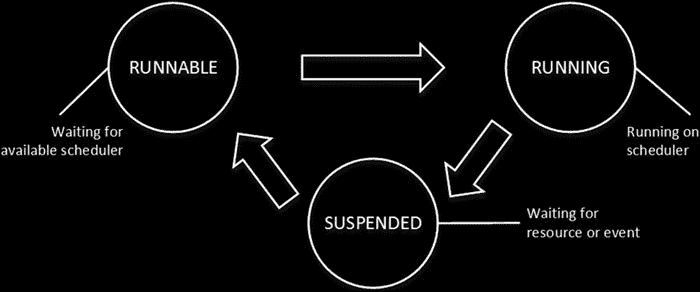

# 第 28 章 ■ 系统故障排除

## SQL Server 执行模型与调度

它控制着当前正在运行的进程，根据需要挂起和恢复它们。此外，除 CLR 代码外，SQLOS 使用协作式调度，其中进程会定期主动让出控制权。

SQLOS 在启动时会创建一组 `调度器`。调度器的数量等于系统中的逻辑 CPU 数量，再加上一个用于专用管理员连接的额外调度器，我们将在本章后面讨论。例如，如果一个服务器有两个启用了超线程的四核 CPU，SQL Server 会创建 17 个调度器。根据进程关联性设置和基于核心的许可模式，每个调度器可以处于 `联机` 或 `脱机` 阶段。

尽管调度器的数量与系统中的 CPU 数量相匹配，除非设置了进程关联性，否则它们之间没有严格的一一对应关系。在某些情况下，在重负载下，有可能出现多个调度器在同一个 CPU 上运行的情况。反之，当设置了进程关联性时，调度器与 CPU 之间则是严格的一一对应关系。

每个调度器负责管理称为 `工作线程` 的工作线程。系统中的最大工作线程数由 `最大工作线程数` 配置选项指定。默认值 `零` 表示 SQL Server 会根据系统中的调度器数量来计算最大工作线程数。在大多数情况下，您无需更改此默认值。

每次有任务需要执行时，它会被分配给一个处于空闲状态的工作线程。当没有空闲的工作线程时，调度器会创建一个新的。它也会在 15 分钟不活动或内存压力的情况下销毁空闲的工作线程。同样值得注意的是，在 32 位 SQL Server 中，每个工作线程会为线程栈使用 512 KB 的 RAM，而在 64 位版本中则使用 2 MB 的 RAM。

工作线程不会在调度器之间移动。此外，任务也永远不会在工作线程之间移动。然而，SQLOS 可以创建子任务并分配给不同的工作线程；例如，在并行执行计划的情况下。

每个任务可以处于以下六种状态之一：

*   `等待中`：任务正在等待可用的工作线程。
*   `已完成`：任务已完成。
*   `正在运行`：任务当前正在调度器上执行。



*   `可运行`：任务正在等待调度器执行。
*   `已挂起`：任务正在等待外部事件或资源。
*   `自旋等待`：任务正在处理自旋锁。我们将在本章后面讨论自旋锁。

每个调度器最多只有一个处于运行状态的任务。此外，它有两个不同的队列——一个用于可运行任务，另一个用于已挂起任务。当正在运行的任务需要某些资源时——例如来自磁盘的数据页——它会提交一个 I/O 请求并将其状态更改为 `已挂起`。它会保持在 `已挂起` 队列中，直到请求被满足且页面被读取。之后，该任务被移至 `可运行` 队列，在那里它准备好恢复执行。

杂货店或许是与 SQL Server 执行模型最接近的现实类比。将收银员想象为代表调度器。排队结账的顾客类似于可运行队列中的任务。正在结账的顾客类似于处于运行状态的任务。

如果某件商品缺少 UPC 条形码，收银员会派一名店员去核对价格。收银员会暂停当前顾客的结账过程，请他或她站到一旁（进入挂起队列）。当店员带着价格信息回来后，那位被暂停的顾客会移动到队伍末尾（可运行队列的末尾）。

值得一提的是，SQL Server 的进程比现实生活要高效得多，在现实中，其他人都会在价格核查期间耐心排队等候。然而，一位被迫移动到可运行队列末尾的顾客可能不会同意这样的结论。


图 28-3 展示了 SQL Server 执行模型的典型任务生命周期。任务总执行时间可通过以下三部分时间之和计算：任务处于运行状态（在调度器上执行）的时间、处于可运行状态（等待可用调度器）的时间，以及处于挂起状态（等待资源或外部事件）的时间。

**图 28-3.** 任务生命周期

SQL Server 会跟踪任务因不同类型等待而处于挂起状态的累计时间，并通过`sys.dm_os_wait_stats`视图提供这些信息。该信息的统计起点是上次 SQL Server 重启之时，或最近一次使用`DBCC SQLPERF ('sys.dm_os_wait_stats', CLEAR)`命令清除数据之时。

清单 28-2 展示了如何查找系统中排名靠前的`等待类型`，即工作线程等待时间最长的等待类型。它过滤掉了一些主要与 SQL Server 内部进程相关的非必要等待类型。尽管在高级性能调优阶段分析其中某些等待类型是有益的，但在系统故障排查的初始阶段，你很少会关注它们。

第 28 章 ■ 系统故障排查

■ **注意** SQL Server 每个新版本都会引入新的等待类型。你可以在[`msdn.microsoft.com/en-us/library/ms179984.aspx`](http://msdn.microsoft.com/en-us/library/ms179984.aspx)查看等待类型列表。请确保选择对应版本的 SQL Server 文档。

**清单 28-2.** 检测系统中排名靠前的等待类型

```
;with Waits
as
(
select
wait_type, wait_time_ms, waiting_tasks_count,signal_wait_time_ms
,wait_time_ms - signal_wait_time_ms as resource_wait_time_ms
,100. * wait_time_ms / SUM(wait_time_ms) over() as Pct
,row_number() over(order by wait_time_ms desc) AS RowNum
from sys.dm_os_wait_stats with (nolock)
where
wait_time_ms > 0 and
wait_type not in /* 过滤掉非必要的系统等待 */
(N'CLR_SEMAPHORE',N'LAZYWRITER_SLEEP',N'RESOURCE_QUEUE', N'DBMIRROR_DBM_EVENT'
,N'SLEEP_TASK',N'SLEEP_SYSTEMTASK',N'SQLTRACE_BUFFER_FLUSH',N'FSAGENT'
,N'DBMIRROR_EVENTS_QUEUE', N'DBMIRRORING_CMD', N'DBMIRROR_WORKER_QUEUE'
,N'WAITFOR',N'LOGMGR_QUEUE',N'CHECKPOINT_QUEUE',N'FT_IFTSHC_MUTEX'
,N'REQUEST_FOR_DEADLOCK_SEARCH',N'HADR_CLUSAPI_CALL',N'XE_TIMER_EVENT'
,N'BROKER_TO_FLUSH',N'BROKER_TASK_STOP',N'CLR_MANUAL_EVENT',N'HADR_TIMER_TASK'
,N'CLR_AUTO_EVENT',N'DISPATCHER_QUEUE_SEMAPHORE',N'HADR_LOGCAPTURE_WAIT'
,N'FT_IFTS_SCHEDULER_IDLE_WAIT',N'XE_DISPATCHER_WAIT',N'XE_DISPATCHER_JOIN'
,N'HADR_NOTIFICATION_DEQUEUE',N'SQLTRACE_INCREMENTAL_FLUSH_SLEEP',N'MSQL_XP'
,N'HADR_WORK_QUEUE',N'ONDEMAND_TASK_QUEUE',N'BROKER_EVENTHANDLER'
,N'SLEEP_BPOOL_FLUSH',N'KSOURCE_WAKEUP',N'SLEEP_DBSTARTUP',N'DIRTY_PAGE_POLL'
,N'BROKER_RECEIVE_WAITFOR',N'MEMORY_ALLOCATION_EXT',N'SNI_HTTP_ACCEPT'
,N'PREEMPTIVE_OS_LIBRARYOPS',N'PREEMPTIVE_OS_COMOPS',N'WAIT_XTP_HOST_WAIT'
,N'PREEMPTIVE_OS_CRYPTOPS',N'PREEMPTIVE_OS_PIPEOPS',N'WAIT_XTP_CKPT_CLOSE'
,N'PREEMPTIVE_OS_AUTHENTICATIONOPS',N'PREEMPTIVE_OS_GENERICOPS',N'CHKPT'
,N'PREEMPTIVE_OS_VERIFYTRUST',N'PREEMPTIVE_OS_FILEOPS',N'QDS_ASYNC_QUEUE'
,N'PREEMPTIVE_OS_DEVICEOPS',N'HADR_FILESTREAM_IOMGR_IOCOMPLETION'
,N'PREEMPTIVE_XE_GETTARGETSTATE',N'SP_SERVER_DIAGNOSTICS_SLEEP'
,N'BROKER_TRANSMITTER',N'PWAIT_ALL_COMPONENTS_INITIALIZED'
,N'QDS_PERSIST_TASK_MAIN_LOOP_SLEEP',N'PWAIT_DIRECTLOGCONSUMER_GETNEXT'
,N'QDS_CLEANUP_STALE_QUERIES_TASK_MAIN_LOOP_SLEEP',N'SERVER_IDLE_CHECK'
,N'SLEEP_DCOMSTARTUP',N'SQLTRACE_WAIT_ENTRIES',N'SLEEP_MASTERDBREADY'
,N'SLEEP_MASTERMDREADY',N'SLEEP_TEMPDBSTARTUP',N'XE_LIVE_TARGET_TVF'
,N'WAIT_FOR_RESULTS',N'WAITFOR_TASKSHUTDOWN',N'PARALLEL_REDO_WORKER_SYNC'
,N'PARALLEL_REDO_WORKER_WAIT_WORK',N'SLEEP_MASTERUPGRADED'
,N'SLEEP_MSDBSTARTUP',N'WAIT_XTP_OFFLINE_CKPT_NEW_LOG')

)
select
w1.wait_type as [等待类型]
,w1.waiting_tasks_count as [等待次数]
,convert(decimal(12,3), w1.wait_time_ms / 1000.0) as [等待时间]
,convert(decimal(12,1), w1.wait_time_ms / w1.waiting_tasks_count)
```

第 28 章 ■ 系统故障排查


