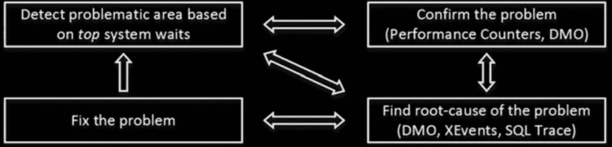
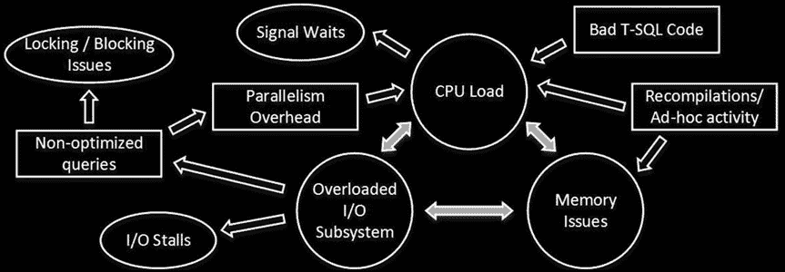

# 等待类型与 SQLOS 视图

```sql
as [Avg Wait Time]
,convert(decimal(12,3), w1.signal_wait_time_ms / 1000.0)
as [Signal Wait Time]
,convert(decimal(12,1), w1.signal_wait_time_ms / w1.waiting_tasks_count)
as [Avg Signal Wait Time]
,convert(decimal(12,3), w1.resource_wait_time_ms / 1000.0)
as [Resource Wait Time]
,convert(decimal(12,1), w1.resource_wait_time_ms / w1.waiting_tasks_count)
as [Avg Resource Wait Time]
,convert(decimal(6,3), w1.Pct) as [Percent]
,convert(decimal(6,3), w1.Pct + IsNull(w2.Pct,0)) as [Running Percent]
from
Waits w1 cross apply
(
select sum(w2.Pct) as Pct
from Waits w2
where w2.RowNum < w1.RowNum
) w2
where
w1.RowNum = 1 or w2.Pct <= 99
order by
w1.RowNum
option (recompile);
```

图 28-4 illustr 展示了故障排除流程开始时，来自一台生产服务器的脚本输出。我们将在本章稍后讨论输出中的等待类型。

## 图 28-4. 生产服务器上的脚本输出

还有其他一些与 SQLOS 相关的有用数据管理视图，如下所示：

`sys.dm_os_waiting_tasks` 返回当前被挂起的任务列表，包括等待类型、等待时间以及它正在等待的资源。如果存在阻塞会话，它还会包含该会话的 ID。



`sys.dm_exec_requests` 视图提供当前正在 SQL Server 上执行的请求列表。这包括有关提交请求的会话的信息；请求的当前状态；如果任务被挂起，则有关当前等待类型的信息；SQL 和计划句柄；执行统计信息；以及其他几个属性。在 SQL Server 2016 中，你可以将其与新函数 `sys.dm_exec_input_buffer` 结合使用，以获取当前运行的 SQL 语句的信息。在早期版本的 SQL Server 中，你可以使用 `sys.dm_exec_sql_text` 函数来实现此目的。

`sys.dm_exec_session_wait_stats` 视图在 SQL Server 2016 中引入，它提供每个会话级别的聚合等待统计信息。请记住，信息是在等待结束后才更新的，并且在排查当前运行会话的等待问题时，你需要分析来自 `sys.dm_os_waiting_tasks` 和/或 `sys.dm_exec_requests` 视图的数据。在早期版本的 SQL Server 中，你也可以使用 `sqlos.wait_info` 扩展事件来跟踪会话等待。

`sys.dm_os_schedulers` 视图返回有关调度器的信息，包括其状态、工作者和任务信息。

`sys.dm_os_threads` 视图提供有关工作者的信息。

`sys.dm_os_tasks` 视图提供有关任务的信息，包括它们的状态和一些执行统计信息。

#### 等待统计信息分析与故障排除

分析系统中主要等待的过程称为 `等待统计信息分析`。这是 SQL Server 中常用的故障排除和性能调优技术之一。图 28-5 阐释了一个典型的等待统计信息分析故障排除循环。

## 图 28-5. 等待统计信息分析故障排除循环

第一步，查看等待统计信息，以检测系统中的主要等待类型。这缩小了需要进一步分析的范围。之后，你使用其他工具（如 DMV、Windows 性能监视器、SQL 跟踪和扩展事件）确认问题，并找出问题的根本原因。当根本原因被确认后，你将其修复，然后再次分析等待统计信息，选择新的分析和改进目标。

这是一个永无止境的过程。系统中总是存在等待，也总是有改进的空间。然而，通用的 80/20 帕累托原则几乎适用于任何故障排除和优化过程。你可以通过花费 20% 的时间来获得 80% 的效果或改进。在某些时候，进一步的优化无法带来足够的投资回报，此时最好将你的时间和资源投入到其他地方。




