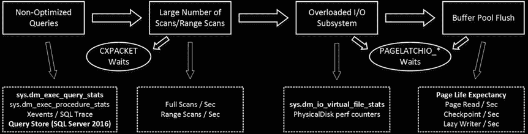

# 系统故障排除

即使等待统计信息可以帮助您检测系统中的问题区域，要找到问题的根本原因也并非总是易事。不同的问题会相互影响，并常常相互掩盖。

如图 28-6 所示。由于缓慢且无响应的 I/O 子系统导致的系统性能不佳，通常是由缺失的索引和未优化的查询造成的，这些查询使其过载。这些查询要求 `SQL Server` 扫描大量数据，这会刷新缓冲池的内容并增加 `CPU` 负载。此外，缺失的索引会在系统中引入锁定和阻塞。

> **图 28-6.** 一切皆有关联

即席查询和重编译会增加 `CPU` 负载并增大计划缓存大小，这反过来又为缓冲池留下的内存更少。由于所需的额外物理 `I/O`，它也会增加 `I/O` 子系统的负载。

让我们看看系统中经常遇到的不同问题，并讨论我们如何检测和排除它们的故障。

## I/O 子系统与未优化查询

与缓慢和/或过载的 `I/O` 子系统相关的最常见根本原因是未优化的查询，这些查询要求 `SQL Server` 扫描大量数据。当 `SQL Server` 没有足够的物理内存来将所有需要的数据缓存在缓冲池中时（大型系统通常是这种情况），就会发生物理 `I/O`，并不断替换缓冲池中的数据。

> **提示** 当 `I/O` 子系统过载时，您可以为托管 `SQL Server` 的服务器添加或分配更多物理内存。额外的内存会增加缓冲池的大小以及 `SQL Server` 可以缓存的数据量。它减少了扫描数据所需的物理 `I/O`。虽然这并不能解决问题的根本原因，但可以作为紧急修复并为您争取一些时间。请记住，非企业版的 `SQL Server` 在可使用的内存量方面存在限制。最后，企业版中的数据压缩也可以减少需要缓存的数据大小。

图 28-7 展示了存在未优化查询的情况，并显示了可用于诊断和修复这些问题的指标及工具。



**图 28-7.** 未优化查询的故障排除

当 `SQL Server` 等待 `I/O` 子系统将数据页从磁盘加载到缓冲池时，会出现 `PAGEIOLATCH_*` 等待类型。这些等待的高百分比表明系统中存在大量物理 `I/O` 活动。其他 `I/O` 等待类型，例如 `IO_COMPLETION`、`ASYNC_IO_COMPLETION`、`BACKUPIO`、`WRITELOG` 和 `LOGBUFFER`，则与非数据页的 `I/O` 相关。这些等待类型可能因各种原因出现。`IO_COMPLETION` 通常表示在排序和哈希运算期间 `tempdb` 的 `I/O` 性能缓慢。`BACKUPIO` 是备份磁盘驱动器性能缓慢的信号，并且经常与 `ASYNC_IO_COMPLETION` 等待类型一起出现。`WRITELOG` 和 `LOGBUFFER` 等待是事务日志 `I/O` 吞吐量不佳的标志。

当所有这些等待类型同时出现时，专注于减少 `PAGEIOLATCH` 等待和数据相关的 `I/O` 会更容易。这将减轻 `I/O` 子系统的负载，进而可以改善非数据相关的 `I/O` 操作的性能。

如今，服务器配备足够的物理内存来将整个活动数据集缓存在缓冲池中已变得很常见。这类系统通常存在相对较低百分比的 `PAGEIOLATCH` 等待。这些系统中的查询引入的物理 `I/O` 活动量很低，即使是未优化的查询也可以有可接受的执行时间。在 `OLTP` 系统中，这种情况的一个迹象是存在大量的并行 `CXPACKET` 等待和较低百分比的 `PAGEIOLATCH` 等待，无论是否存在非数据页 `I/O` 相关的等待。您需要通过查看查询执行统计信息来确认这种情况，我们将在本章后面讨论这一点。


未经过优化的查询，即使没有产生物理磁盘活动，也未必会给系统带来可见的性能影响。然而，这种情况存在一个隐藏的危险：数据增长量。它可能达到一个临界点，即数据不再适合驻留在内存中，由此引发的过度磁盘活动开始导致系统出现性能问题。此外，即使不涉及物理 I/O，非优化查询也可能导致并发问题。尽管如此，你应该分析优化此类查询是否能为你付出的努力带来足够的投资回报率（ROI）。

`sys.dm_io_virtual_file_stats` 函数为你提供数据和日志文件的 I/O 统计信息，包括 I/O 操作次数、处理的数据量以及 I/O 等待时间（即 SQL Server 等待 I/O 操作完成的时间）。这有助于检测最耗费 I/O 的数据库和数据文件，这在 SQL Server 实例托管大量数据库时尤其有用。此视图在你进行数据库整合项目时也很有用。

清单 28-3 展示了一个获取服务器上所有数据库 I/O 统计信息的查询。图 28-8 展示了该查询在某个生产服务器上运行时的部分输出。

***清单 28-3.*** 使用 `sys.dm_io_virtual_file_stats`

```sql
select
fs.database_id as [DB ID], fs.file_id as [File Id], mf.name as [File Name]
,mf.physical_name as [File Path], mf.type_desc as [Type], fs.sample_ms as [Time]
,fs.num_of_reads as [Reads], fs.num_of_bytes_read as [Read Bytes]
,fs.num_of_writes as [Writes], fs.num_of_bytes_written as [Written Bytes]
,fs.num_of_reads + fs.num_of_writes as [IO Count]
,convert(decimal(5,2),100.0 * fs.num_of_bytes_read /
(fs.num_of_bytes_read + fs.num_of_bytes_written)) as [Read %]
,convert(decimal(5,2),100.0 * fs.num_of_bytes_written /
(fs.num_of_bytes_read + fs.num_of_bytes_written)) as [Write %]
,fs.io_stall_read_ms as [Read Stall], fs.io_stall_write_ms as [Write Stall]
,case when fs.num_of_reads = 0
then 0.000
else convert(decimal(12,3),1.0 * fs.io_stall_read_ms / fs.num_of_reads)
end as [Avg Read Stall]
,case when fs.num_of_writes = 0
then 0.000
else convert(decimal(12,3),1.0 * fs.io_stall_write_ms / fs.num_of_writes)
end as [Avg Write Stall]
from
sys.dm_io_virtual_file_stats(null,null) fs join
sys.master_files mf with (nolock) on
fs.database_id = mf.database_id and fs.file_id = mf.file_id
join sys.databases d with (nolock) on
d.database_id = fs.database_id
where
fs.num_of_reads + fs.num_of_writes > 0;
```

***图 28-8.** `Sys_dm_io_virtual_file_stats` 输出*

不幸的是，`sys.dm_io_virtual_file_stats` 提供的是自 SQL Server 上次重启以来的累积统计信息，且无法清除。如果你需要获取系统当前负载的快照，应该多次运行此函数并比较调用间结果的变化。我在本书的配套资料中包含了实现这种方法的代码。

你可以使用 *PhysicalDisk* 对象分析各种系统性能计数器，以获取当前 I/O 活动的信息，例如请求数量以及正在读写的数据量。然而，这些计数器在与基线进行比较时最为有用，我们将在本章后面讨论基线。

来自 *SQL Server:Buffer Manager* 对象的性能计数器提供了与缓冲池和数据页 I/O 相关的各种指标。最有用的计数器之一是 *page life expectancy*，它表示数据页在缓冲池中停留的平均时间。历史上，微软建议高于 300 秒的值是可接受且 *足够好* 的；然而，对于使用大量内存的现代服务器来说，情况远非如此。定义该计数器最低可接受值的一种方法是，每 4 GB 缓冲池内存乘以 300 秒。例如，为缓冲池使用 56 GB 内存的服务器，其页面预期寿命应大于 4,200 秒（56/4*300）。然而，与其他计数器一样，将当前值与基线进行比较比依赖静态定义的阈值更好。

*page read/sec* 和 *page write/sec* 计数器分别显示物理读取和写入的数据页数量。*Checkpoint pages/sec* 和 *lazy writer/sec* 指示将脏页保存到磁盘的检查点和惰性写入器进程的活动。这些计数器值高而页面预期寿命值低，可能是内存压力的迹象。然而，大量的检查点也可能是因为系统中的大量事务造成的，你应该将 *transactions/sec* 计数器纳入分析。

在服务器拥有足够物理内存将活动数据集缓存在内存中的场景下，你会注意到页面预期寿命值高而页面读取/秒计数器值低。页面写入/秒和检查点页/秒的值将取决于系统中数据的易变性。

*buffer cache hit ratio* 指示无需执行物理读取操作即可在缓冲池中找到的页面百分比。该计数器的低值表示持续的缓冲池刷新，是大量物理 I/O 的标志。然而，该计数器的高值是无意义的。预读操作经常将数据页带入内存，增加了缓冲区缓存命中率的值并掩盖了问题。最终，页面预期寿命是进行此分析更可靠的计数器。

■ **注意** 你可以在 [`technet.microsoft.com/en-us/library/ms189628.aspx`](http://technet.microsoft.com/en-us/library/ms189628.aspx) 阅读更多关于缓冲池管理器对象的性能计数器。

来自 *SQL Server:Access Methods* 对象的 *full scans/sec* 和 *range scan/sec* 性能计数器为你提供系统中扫描活动的信息。然而，它们的值可能会产生误导。虽然扫描大量数据会对性能产生负面影响，但扫描小型临时表的小范围扫描或完全扫描是完全可接受的。与其他性能计数器一样，最好将计数器值与基线进行比较，而不是依赖绝对值。

使用标准 SQL 工具有几种方法可以检测 I/O 密集型查询。最常见的方法之一是使用 SQL 跟踪或扩展事件捕获系统活动，并按读取和/或写入次数过滤数据。你也可以分析查询持续时间；但是，使用这种方法时应小心。运行时间最长的查询不一定是 I/O 最密集的查询。还有其他因素会增加查询执行时间。例如，锁和阻塞。

然而，这种方法需要你在数据收集后进行额外的分析。在确定优化目标时，你应该检查查询执行的频率。

检测资源密集型查询的另一个非常简单而强大的方法是 `sys.dm_exec_query_stats` 数据管理视图。SQL Server 跟踪各种统计信息，包括执行次数、I/O 操作次数、耗时和 CPU 时间，并通过该视图公开它们。此外，你可以将其与其他数据管理对象联接，获取这些查询的 SQL 文本和执行计划。这简化了分析，并在解决系统中各种性能和计划缓存问题时提供帮助。


