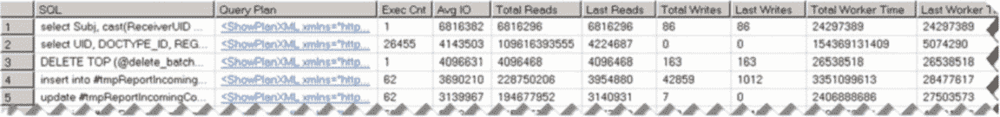

# 第 28 章 ■ 系统故障排除

`清单 28-4` 展示了一个查询，该查询返回了在执行时刻其执行计划已被缓存的 50 个 I/O 最密集的查询。值得注意的是，`sys.dm_exec_query_stats` 在不同版本的 SQL Server 中，其结果集包含的列略有不同。`清单 28-5` 中的查询适用于 SQL Server 2008R2 及以上版本。你可以从 `SELECT` 列表中移除最后四列以使其兼容 SQL Server 2005-2008。



**`清单 28-4.`** 使用 `sys.dm_exec_query_stats`

```sql
select top 50
substring(qt.text, (qs.statement_start_offset/2)+1,
((
case qs.statement_end_offset
when -1 then datalength(qt.text)
else qs.statement_end_offset
end - qs.statement_start_offset)/2)+1) as SQL
,qp.query_plan as [查询计划]
,qs.execution_count as [执行次数]
,(qs.total_logical_reads + qs.total_logical_writes) / qs.execution_count as [平均 IO]
,qs.total_logical_reads as [总读取次数], qs.last_logical_reads as [上次读取次数]
,qs.total_logical_writes as [总写入次数], qs.last_logical_writes as [上次写入次数]
,qs.total_worker_time as [总 CPU 时间], qs.last_worker_time as [上次 CPU 时间]
,qs.total_elapsed_time / 1000 as [总耗时]
,qs.last_elapsed_time / 1000 as [上次耗时]
,qs.last_execution_time as [上次执行时间]
,qs.total_rows as [总行数], qs.last_rows as [上次行数]
,qs.min_rows as [最小行数], qs.max_rows as [最大行数]
from
sys.dm_exec_query_stats qs with (nolock)
cross apply sys.dm_exec_sql_text(qs.sql_handle) qt
cross apply sys.dm_exec_query_plan(qs.plan_handle) qp
order by
[平均 IO] desc
```

正如你在 `图 28-9` 中所看到的，它使你能够轻松地根据资源使用情况和执行次数来定义优化目标。例如，结果集中的第二个查询就是最佳优化候选，因为它运行得非常频繁。

**`图 28-9.`** `Sys.dm_exec_query_stats` 结果

不幸的是，`sys.dm_exec_query_stats` 不会为那些没有已编译执行计划缓存的查询返回任何信息。通常这不是问题，因为我们的优化目标不仅是资源密集型的，而且也是频繁执行的查询。这些查询的执行计划通常因其频繁重用而保留在缓存中。然而，在发生语句级重新编译的情况下，SQL Server 不会缓存执行计划，因此 `sys.dm_exec_query_stats` 会遗漏此类查询。你应该使用扩展事件和/或 SQL 跟踪来捕获它们。我通常从 `sys.dm_exec_query_stats` 函数的输出查询开始，然后再用扩展事件交叉验证优化目标。

SQL Server 2016 的一个新组件 Query Store 解决了此类问题。它捕获并持久化那些查询的执行统计信息和执行计划，而不依赖于计划缓存。我们将在下一章深入讨论 Query Store。

执行计划可能会从缓存中移除，因此在 SQL Server 重启、内存压力、由于统计信息更新导致的重新编译以及其他少数情况下，它们不会被包含在 `sys.dm_exec_query_stats` 的结果中。除了执行次数外，分析 `creation_time` 和 `last_execution_time` 列也是有益的。

SQL Server 2008 及以上版本通过 `sys.dm_exec_procedure_stats` 视图提供了存储过程级别的执行统计信息。它提供了与 `sys.dm_exec_query_stats` 类似的指标，可用于确定系统中资源最密集的存储过程。`清单 28-5` 显示了一个查询，该查询返回了在执行时刻其执行计划已缓存的 50 个 I/O 最密集的存储过程。

**`清单 28-5.`** 使用 `sys.dm_exec_procedure_stats`

```sql
select top 50
db_name(ps.database_id) as [数据库]
,object_name(ps.object_id, ps.database_id) as [过程名]
,ps.type_desc as [类型]
,qp.query_plan as [执行计划]
,ps.execution_count as [执行次数]
```

