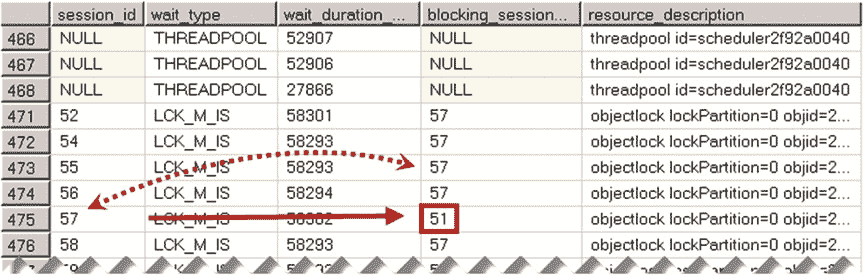

# 第 28 章 ■ 系统故障排除

检测 CPU 最密集型查询的过程与检测未优化查询的过程非常相似。您可以使用`sys.dm_exec_query_stats`视图，如清单 28-4 所示。 您可以按`total_worker_time`列对数据排序，该列可检测当前缓存计划中 CPU 最密集型查询。或者，您可以使用扩展事件，按 CPU 时间而非 I/O 指标来筛选数据。

持续的重新编译是 CPU 负载的另一个来源。您可以检查`batch requests/sec`（批处理请求/秒）、`SQL compilations/sec`（SQL 编译/秒）和`SQL recompilations/sec`（SQL 重新编译/秒）性能计数器，并使用以下公式计算计划重用率：

`Plan Reuse = (Batch Requests/Sec - (SQL Compilations/Sec - SQL Recompilations/Sec)) / Batch Requests/Sec`

`Low plan reuse`（计划重用率低）在 OLTP 系统中表明存在大量即席活动，通常需要重构代码并参数化查询。然而，未优化的查询仍然是 CPU 负载的主要贡献者。对于未优化的查询，SQL Server 会处理大量数据，这无论如何都会消耗 CPU 周期。在大多数情况下，查询优化可以降低系统中的 CPU 负载。

显然，糟糕的 T-SQL 代码也是如此。您应该减少命令式数据处理的量，避免多语句函数，并尽可能将计算和 XML 处理移至应用端。

## 锁定与阻塞

系统中过度的锁定和阻塞问题会呈现各种`LCK_M_*`等待类型。每种锁类型都有其对应的等待类型。例如，`LCK_M_U`表示更新（U）锁等待，这可能是未优化的数据修改查询的迹象。

我们已经介绍了如何排查系统中的锁定和阻塞问题。您需要使用`blocked process report`（阻塞进程报告）、`deadlock graph`（死锁图）事件和`sys.dm_tran_locks`视图来检测哪些进程参与了阻塞链，并找到阻塞的根本原因。在大多数情况下，这是由于未优化的查询造成的。

## 工作线程匮乏

在极少数情况下，SQL Server 可能会遇到`worker thread starvation`（工作线程匮乏），即没有可用的工作线程来分配给新任务的情况。这种情况发生的一种场景是：某个任务获取并持有一个关键资源上的锁，该锁阻塞了大量其他任务/工作线程，使其保持挂起状态。当系统中的工作线程数量达到由`Maximum Worker Thread`（最大工作线程）阈值定义的限制时，SQL Server 将无法创建新的工作线程，新任务将无法分配，从而产生`THREADPOOL`等待。

阻塞并非导致此情况发生的唯一原因。也可能达到限制


## 第 28 章 系统故障排除

当服务器面临内存压力和/或可用内存不足时，系统中的工作线程数量会减少。在这种情况下，工作线程被分配的任务会持续更长时间，等待内存授权（请检查 `RESOURCE_SEMAPHORE` 等待）或执行大量的物理 I/O 操作。最终，大量用户产生的高并发工作负载也可能耗尽工作线程池。

通常，你需要找到问题的根本原因。虽然可以在 `SQL Server` 配置中增加 `最大工作线程数`，但这可能有用，也可能没用。例如，在刚刚描述的阻塞场景中，新创建的工作线程极有可能以与现有线程相同的方式被阻塞。更好的做法是调查阻塞问题的根本原因并加以解决。



你可以通过分析 `sys.dm_os_waiting_tasks` 或 `sys.dm_exec_requests` 视图的结果来检查阻塞情况并定位阻塞会话。清单 28-10 展示了第一种方法。请记住，`sys.dm_exec_requests` 视图不会显示没有分配工作线程、且以 `THREADPOOL` 等待类型等待的任务。同样值得注意的是，工作线程匮乏可能会阻止任何连接到服务器。在这种情况下，你需要使用 `专用管理员连接 (DAC)` 进行故障排除。我们将在本章后面讨论 `DAC`。

`清单 28-10.` 使用 `sys.dm_os_waiting_tasks`

```sql
select session_id, wait_type, wait_duration_ms, blocking_session_id, resource_description
from sys.dm_os_waiting_tasks with (nolock)
order by wait_duration_ms desc
```

如图 28-10 所示，阻塞会话的 ID 是 51。

`图 28-10.` `sys.dm_os_waiting_tasks` 结果

下一步，你可以使用 `sys.dm_exec_sessions` 和 `sys.dm_exec_connections` 视图来获取有关阻塞会话的信息，如清单 28-11 所示。你可以调查锁被保持的原因，和/或在需要时使用 `KILL` 命令终止该会话。

`清单 28-11.` 获取有关阻塞会话的信息

```sql
select
    ec.session_id, s.login_time, s.host_name, s.program_name, s.login_name
    ,s.original_login_name, ec.connect_time, qt.text as [SQL]
from
    sys.dm_exec_connections ec with (nolock)
    join sys.dm_exec_sessions s with (nolock) on
        ec.session_id = s.session_id
    cross apply sys.dm_exec_sql_text(ec.most_recent_sql_handle) qt
where
    ec.session_id = 51 -- 阻塞会话的会话 ID
```

值得一提的是，即使增加 `最大工作线程` 设置不一定能解决问题，升级到 64 位版本的 `Windows` 和 `SQL Server` 总是值得的。64 位版本的 `SQL Server` 默认拥有更多可用的工作线程，并且它可以利用更多内存用于查询授权和其他组件。这减少了内存授权等待，使 `SQL Server` 更高效，因此能让任务更快完成执行并释放工作线程。

然而，工作线程会消耗内存，这减少了可用于其他 `SQL Server` 组件的内存量。这通常不是问题，除非 `SQL Server` 运行在物理内存非常少的服务器上。如果是这种情况，你应该考虑为服务器增加更多内存。毕竟，这在如今是个廉价的解决方案。

### ASYNC_NETWORK_IO 等待

当 `SQL Server` 生成数据的速度快于客户端应用程序消耗它的速度时，会发生 `ASYNC_NETWORK_IO` 等待类型。虽然这可能是网络吞吐量不足的迹象，但在大量情况下，`ASYNC_NETWORK_IO` 等待的累积是由于客户端代码不正确或效率低下造成的。

一个这样的例子是从服务器读取过量的数据。客户端应用程序读取了不必要的数据，或者可能执行了客户端筛选，这增加了额外的负载并超出了网络吞吐量。

