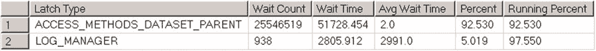

# 第 28 章 ■ 系统故障排除

通常情况下，在分析等待统计信息时，您无需关注 LATCH 等待类型，除非看到此类等待类型占比很高。在这些情况下，您可以使用 `sys.dm_os_latch_stats` 视图查看系统中的闩锁统计信息，如清单 28-14 所示。图 28-11 展示了其中一台服务器的输出结果。

另外，您可以使用 `DBCC SQLPERF('sys.dm_os_latch_stats', CLEAR)` 命令清除服务器上的闩锁统计信息。

## 清单 28-14. 分析闩锁统计信息

```sql
;with Latches
as
(
select latch_class, wait_time_ms, waiting_requests_count
,100\. * wait_time_ms / SUM(wait_time_ms) over() as Pct
,row_number() over(order by wait_time_ms desc) AS RowNum
from sys.dm_os_latch_stats with (nolock)
where latch_class not in (N'BUFFER',N'SLEEP_TASK') and wait_time_ms > 0
)
select
l1.latch_class as [Latch Type]
,l1.waiting_requests_count as [Wait Count]
,convert(decimal(12,3), l1.wait_time_ms / 1000.0) as [Wait Time]
,convert(decimal(12,1), l1.wait_time_ms /
l1.waiting_requests_count) as [Avg Wait Time]
,convert(decimal(6,3), l1.Pct) as [Percent]
,convert(decimal(6,3), l1.Pct + IsNull(l2.Pct,0))
as [Running Percent]
from
Latches l1 cross apply
(
select sum(l2.Pct) as Pct
from Latches l2
where l2.RowNum < l1.RowNum
) l2
where
l1.RowNum = 1 or l2.Pct < 99
option (recompile);
```

## 图 28-11. 闩锁统计信息



遗憾的是，闩锁类型的文档很不完善。尽管它们在 [`msdn.microsoft.com/en-us/library/ms175066.aspx`](https://msdn.microsoft.com/en-us/library/ms175066.aspx) 上有列出，但许多都被标注为 *仅供内部使用*。我在表 28-1 中概述了几种常见的闩锁类型。

您可以在 [`www.microsoft.com/en-us/download/details.aspx?id=26665`](http://www.microsoft.com/en-us/download/details.aspx?id=26665) 阅读更多关于闩锁和闩锁争用故障排除的信息。

## 表 28-1. 常见闩锁类型

| Latch Type | Description |
| --- | --- |
| LOG_MANAGER | 访问内部事务日志管理器结构，通常在日志增长时发生。分析为何事务日志未被截断。我们将在第 30 章讨论事务日志内部原理和故障排除。 |
| ACCESS_METHODS_DATASET_PARENT | 与并行度相关的闩锁。排查不必要的并行度问题。 |
| ACCESS_METHODS_SCAN_RANGE_GENERATOR |  |
| ACCESS_METHODS_SCAN_KEY_GENERATOR |  |
| NESTING_TRANSACTION_FULL |  |
| ACCESS_METHODS_HOBT_VIRTUAL_ROOT | 访问索引根页。可能表明索引中存在大量页拆分。 |
| ACCESS_METHODS_HOBT_COUNT | 更新元数据表中的页/行计数信息。可能表明来自多个会话对单个或多个表的重度数据修改。 |
| FGCB_ADD_REMOVE | 在文件组中添加、删除、增长和收缩文件时发生。检查是否启用了 *即时文件初始化* 并禁用了数据库的 *自动收缩* 选项。 |
| TRACE_CONTROLLER | SQL 跟踪相关的闩锁。减少服务器上运行的跟踪事件数量，并尽可能切换到扩展事件。 |

最后，SQL Server 使用了另一种同步对象——*自旋锁*。当需要对数据结构的访问保持非常短的时间时，会使用自旋锁。SQL Server 以类似于闩锁的方式使用自旋锁来保护内部数据结构。它们之间的主要区别在于，当线程无法获取自旋锁时，它会通过循环持续自旋，定期检查资源是否可用，而不是像闩锁那样将 CPU 让给另一个线程。这有助于避免线程上下文切换，这是一项相对昂贵的操作。

通常，在系统故障排除时，您不需要担心自旋锁，除非您


