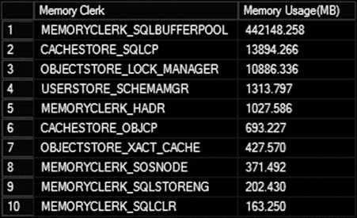

# 等待统计：总结

自旋锁碰撞是一种罕见的、但在拥有大量 CPU 的繁忙系统上可能发生的情况。这种状况可能表现为 CPU 利用率的不成比例增长，相比之下系统吞吐量却没有相应提升。例如，交易吞吐量增加 10%可能导致 CPU 负载增加 50%。正如您能猜到的，还有其他情况可能导致此类问题，而确认系统是否正遭受自旋锁碰撞的最佳方式是与基线进行比较。

您可以从未公开的 `sys.dm_os_spinlock_stats` 视图以及 `spinlock_backoff` 扩展事件中获取该基线。

自旋锁碰撞的故障排除是一个非常高级的话题，超出了本书的讨论范围。您可以在以下白皮书中阅读相关内容：[`www.microsoft.com/en-us/download/details.aspx?id=26666`](https://www.microsoft.com/en-us/download/details.aspx?id=26666)。

## 系统故障排除

表 28-2 展示了您在系统中可能遇到的最常见问题的症状，并说明了您可以采取哪些步骤来解决这些问题。

**表 28-2. 常见问题、症状与解决方案**

| **问题** | **症状 / 监控目标** | **进一步操作** |
| :--- | :--- | :--- |
| I/O 子系统过载 | `PAGEIOLATCH`、`IO_COMPLETION`、`WRITELOG`、`LOGBUFFER`、`BACKUPIO` 等待。使用 `sys.dm_io_virtual_file_stats`。 | 检查 I/O 子系统配置和吞吐量，特别是在遇到非数据页 I/O 等待时。使用查询存储、`sys.dm_exec_query_stats`、SQL 跟踪和扩展事件检测并优化 I/O 密集型查询。 |
| | 低*页面寿命预期*，高*页面读取/秒、页面写入/秒*性能计数器。 | |
| CPU 负载 | 高 CPU 负载，`SOS_SCHEDULER_YIELD` 等待，信号等待百分比高。 | 可能是低效的 T-SQL 代码。使用查询存储、`sys.dm_exec_query_stats`、SQL 跟踪和扩展事件检测并优化 CPU 密集型查询。检查 OLTP 系统中的重新编译和计划重用。 |
| 查询内存授予 | `RESOURCE_SEMAPHORE` 等待。*内存授予挂起*值非零。`sys.dm_exec_memory_grants` 中的挂起请求。 | 检测并优化需要大内存授予的查询。执行通用查询调优。 |
| 堆内存分配争用 | `CXMEMTHREAD` 等待 | 启用 *针对即席工作负载进行优化* 配置设置。分析哪些内存对象消耗内存最多，如果适用，使用 T8048 跟踪标志切换到每 CPU 分区。应用最新的服务包。 |
| OLTP 系统中的并行度 | `CXPACKET` 等待 | 找出并行度的根本原因；很可能是未优化的查询或报告查询。对不应具有并行计划的未优化查询执行查询优化。调整并增加 *并行度的成本阈值* 值。 |
| 锁定与阻塞 | `LCK_M_*` 等待。死锁。 | 使用 `sys.dm_tran_locks`、*阻塞进程报告* 和 *死锁图* 检测涉及阻塞的查询。消除阻塞的根本原因，很可能是未优化的查询或客户端代码问题。 |
| `ASYNC_NETWORK_IO` 等待 | `ASYNC_NETWORK_IO` 等待，网络性能计数器。 | 检查网络性能。审查并重构客户端代码（加载过多数据和/或同时加载和处理数据）。 |
| 工作线程耗尽 | `THREADPOOL` 等待 | 检测并解决问题的根本原因（阻塞和/或负载）。升级到 64 位版本的 SQL Server。增加 *最大工作线程* 值可能有用，也可能无效。 |
| 分配映射争用 | `PAGELATCH` 等待 | 使用 `sys.dm_os_waiting_tasks` 和 `sys.dm_exec_requests` 检测导致争用的资源。添加更多数据文件。对于 `tempdb`，使用 T1118（SQL Server 2016 中不需要）并利用临时对象缓存。 |

此列表绝非详尽无遗；然而，它应该是一个良好的起点。

> **注意** 阅读 “SQL Server 2005 Performance Tuning using the Waits and Queues” 白皮书以获取更多信息。

关于基于等待统计的性能故障排除方法的详细信息。可从以下网址下载：[`technet.microsoft.com/en-us/library/cc966413.aspx`](http://technet.microsoft.com/en-us/library/cc966413.aspx)。虽然这篇白皮书是为解决 SQL Server 2005 而编写，但其内的信息同样适用于任何更新版本的 SQL Server。

#### 内存管理与配置

讨论系统故障排除和 SQLOS 时，不可能不涉及 SQL Server 如何与内存协同工作。让我们从内存配置开始。

## 内存配置

如您所知，SQL Server 会尝试根据操作需要分配并使用尽可能多的内存。它并非在启动时就分配所有内存；分配是按需进行的——例如，当 SQL Server 将数据页读取到缓冲池或将编译后的计划存储到缓存时。

常见的情况是，实例会消耗数百 GB 甚至数 TB 的内存。这完全正常，简而言之，是件好事——它减少了物理 I/O 的数量和重编译次数，提升了系统性能。**实际上，为服务器增加内存通常是提升系统性能最快、最经济的方式。**

非企业版的 SQL Server 对其可使用的内存量有限制。标准版在 SQL Server 2014-2016 中最多可使用 128 GB RAM，在更早版本中则最多可使用 64 GB RAM。速成版被限制为 1 GB。

您可以通过分析 `SQL Server: Memory Manager` 对象的性能计数器来检查 SQL Server 的内存使用情况。`Total Server Memory (KB)` 表示 SQL Server 正在消耗的内存量。`Target Server Memory (KB)` 表示 SQL Server 期望消耗的理想内存量。如果 `Total Server Memory (KB)` 显著低于 `Target Server Memory (KB)`，则可能表明存在内存压力。或者，您可以使用 `sys.dm_os_process_memory` 视图来获取此信息。

建议在 SQL Server 配置中设置 `Maximum Server Memory` 选项。在 SQL Server 2012 及更高版本中，此设置适用于所有 SQL Server 内部组件。在 2012 之前的 SQL Server 中，此设置控制缓冲池的大小，您需要降低该值以考虑其他组件的内存在用。在大多数情况下，这些组件将需要额外保留 1 到 2 GB 的 RAM。

`Maximum Server Memory` 值应为操作系统及服务器上运行的应用程序留出足够的内存。最好在每台服务器上进行微调。根据经验，您可以从为前 16 GB RAM 保留 4 GB 开始，之后每 8 GB RAM 保留 1 GB。例如，一台配备 128 GB RAM 的服务器，起始值可设为 (128-16) / 8 + 4 = 110 GB RAM。显然，对于非专用的 SQL Server 实例，需要降低此数值，为其他应用程序预留内存。

设置初始的 `Maximum Server Memory` 值后，您应监控 `memory/available mbytes` 性能计数器，并根据需要微调 `Maximum Server Memory` 值。您应始终保持至少 500 MB 的可用内存（在安装了大量 RAM 的服务器上甚至更多），以避免出现内存压力情况。

授予 SQL Server 启动账户 `Lock Pages in Memory` 权限也是有益的，这可以防止 SQL Server 内存被分页到磁盘的情况。您可以在 `Group Policy` (`gpedit.msc`) 编辑器中进行设置。`Lock Pages in Memory` 在企业版和标准版中均受支持；但是，在 SQL Server 2005 和 2008 的标准版中，它需要特定的服务包级别才能工作。

## 第 28 章：系统故障排除

SQL Server 的 32 位版本要求您启用 `Lock Pages in Memory` 权限和 `AWE Enable` 设置，才能利用大约 4 GB 的扩展内存。然而，我刻意不深入探讨...

