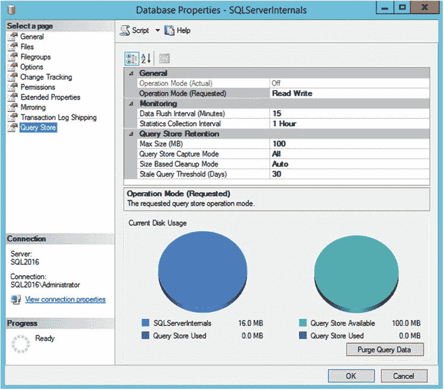

# 性能调优与查询存储

性能调优是一个复杂的过程。它涵盖许多主题，例如硬件、操作系统与 SQL Server 的安装和配置，以及应用程序与数据库设计等等。查询优化是首要任务之一。这里的关键挑战在于选择优化哪些查询。对系统中的所有查询进行优化既不可能也不可行，你需要专注于那些能带来最佳投资回报的查询。实际上，这意味着那些频繁执行、引入大量 I/O 活动和/或消耗大量 CPU 与内存的查询。

检测这类查询并非总是易事。尽管 SQL Server 会为缓存的执行计划保留运行时执行统计信息，但它有一些限制。执行计划可能因各种原因从缓存中被移除，或者根本未被缓存；例如，当使用语句级重编译时。最后，计划缓存的运行时统计信息不会持久保存在数据库中，并且会在 SQL Server 重启时被清除。

你可以通过使用`Extended Events`捕获查询运行时统计信息来解决其中一些限制；然而，这需要在事后进行复杂分析，并且在本已繁忙的服务器上也可能引入性能开销。

数据库专业人员需要解决的第二类常见问题是参数嗅引所引入的性能回归。正如你在第 26 章会回忆起的，SQL Server 会因为统计信息更新而重编译查询，而在重编译时出现的非典型参数值可能导致低效的执行计划被缓存和重用。

可以主动保护关键查询免受此类问题影响。但这通常需要索引或查询提示、计划指南或代码变更。这些方法都有其缺点，尤其是在可维护性方面。实际上，数据库专业人员通常是在问题已经在系统中发生、用户已报告性能问题后，才被动地处理这些问题。

幸运的是，查询存储有助于应对这两个挑战。你可以将其视为`SQL Server 飞行数据记录器`；启用查询存储后，SQL Server 会捕获并持久保存数据库中查询的运行时统计信息和执行计划。它向你展示执行计划如何随时间演变，并允许你强制查询使用特定的执行计划。

© Dmitri Korotkevitch 2016

D. Korotkevitch, *Pro SQL Server Internals*, DOI 10.1007/978-1-4842-1964-5_29

## 第 29 章 ■ 查询存储

`查询存储`在`SQL Server 2016`的所有版本以及`Microsoft Azure SQL 数据库`中均可用。启用时，它会给`SQL Server`带来一些开销；然而，这种开销相对较小。我们将在本章后面讨论如何监控此类开销。

#### 查询存储配置

`查询存储`是一个数据库级别的功能，默认是禁用的。你可以在`SQL Server Management Studio (SSMS)`中或使用`T-SQL`命令`ALTER DATABASE SET QUERY_STORE = ON`来启用它。

`查询存储`可以在两种操作模式下运行。在默认的`READ_WRITE`模式下，`SQL Server`收集执行计划和运行时统计信息并持久保存到`查询存储`中，并允许你对其进行操作。在`READ_ONLY`模式下，你可以从`查询存储`中查询数据；但是，`SQL Server`不会在那里收集任何新信息。你可以使用`ALTER DATABASE SET QUERY_STORE (OPERATION_MODE = mode)`命令来设置操作模式。

`SSMS`界面有点令人困惑。你可以通过`数据库属性`窗口的`查询存储`页面访问其配置。在`常规`组中有两个`操作模式`设置可用，如图 29-1 所示。`操作模式（实际）`显示`查询存储`是否已启用及其当前模式。`操作模式（请求）`允许你选择新的值或禁用`查询存储`，该更改将在应用后生效。

