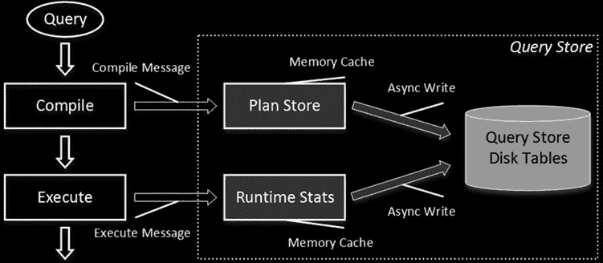
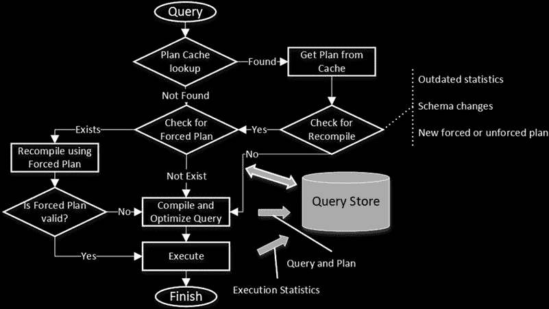

# 第 29 章：查询存储

#### 查询存储配置

***图 29-1.** SSMS 中的查询存储配置*

为了降低开销，查询存储将最近捕获的信息保存在内存缓存中，并根据 `DATA_FLUSH_INTERVAL_SECONDS` 设置（SSMS 中的 **数据刷新间隔（分钟）**）定义的计划将其刷新到磁盘，默认值为 15 分钟。简而言之，该值控制了在 SQL Server 崩溃事件中将丢失的已捕获数据量。

查询存储在由 `INTERVAL_LENGTH_MINUTES` 设置（SSMS 中的 **统计信息收集间隔**）控制的固定时间间隔上聚合运行时统计信息，默认值为 60 分钟。减小此间隔可提供更好的粒度；但是，它可能会增加存储信息所需的磁盘空间。不幸的是，SQL Server 不允许指定任意值，您应从以下值中选择：1、5、10、15、30、60 或 1440 分钟。

您可以使用 `MAX_STORAGE_SIZE_MB` 设置（SSMS 中的 **最大大小 (MB)**）控制查询存储磁盘上表的大小。一旦达到该大小，查询存储将变为只读。默认情况下，SQL Server 2016 RTM 允许查询存储使用最多 100 MB 的磁盘空间。您应记住查询存储表位于主文件组中，并在设计数据库布局和灾难恢复策略时考虑这一点。

查询存储清理策略可以通过 `STALE_QUERY_THRESHOLD_DAYS` 设置（SSMS 中的 **陈旧查询阈值（天）**）和 `SIZE_BASED_CLEANUP_POLICY` 设置（SSMS 中的 **基于大小的清理模式**）进行配置。第一个设置指定信息在查询存储中保留的时间。第二个设置控制自动清理过程，当查询存储空间使用约达 80% 时运行，并删除最不重要的查询信息。

> **重要提示** SQL Server 2016 RTM 存在一个错误，会阻止除 Enterprise 和 Developer 版本外的其他版本执行自动数据清理。您应使用 `ALTER DATABASE SET QUERY_STORE (CLEANUP_POLICY = (STALE_QUERY_THRESHOLD_DAYS = 0), SIZE_BASED_CLEANUP_MODE = OFF)` 命令在受影响的版本中禁用它，并实施手动清理，我们将在本章后面讨论。此错误已在 CU1 中修复。

`QUERY_CAPTURE_MODE` 设置（SSMS 中的 **查询存储捕获模式**）控制捕获哪些查询。它有三个值：`ALL`、`NONE` 或 `AUTO`。前两个值不言自明。最后一个值会触发一个内部算法来过滤掉不重要的查询。

最后，`MAX_PLAN_PER_QUERY` 设置限制了为每个查询维护的计划数量。此设置在 SSMS 中不可用。

`sys.database_query_store_options` 视图提供了有关当前查询存储配置设置及其大小的信息。

#### 查询存储内部原理

从内部来看，查询存储由两个相关的部分组成：*计划存储* 和 *运行时统计信息存储*。SQL Server 在查询编译和执行阶段都会与它们进行交互。当查询编译时，SQL Server 与 *计划存储* 交互，更新其数据并检查是否有可用的强制计划。在查询执行期间，SQL Server 在 *运行时统计信息存储* 中更新其执行统计信息。

如您所知，每个存储都由一个内存缓存和磁盘数据组成。新信息被放入缓存，并根据 `DATA_FLUSH_INTERVAL_SECONDS` 设置定义的计划异步写入磁盘。内存缓存也可以通过 `sys.sp_query_store_flush_db` 存储过程手动刷新。当您从查询存储查询数据时，SQL Server 会合并来自两个来源的数据。

图 29-2 展示了 SQL Server 查询存储的高级工作流程。

***图 29-2.** SQL Server 查询存储的高级工作流程*

