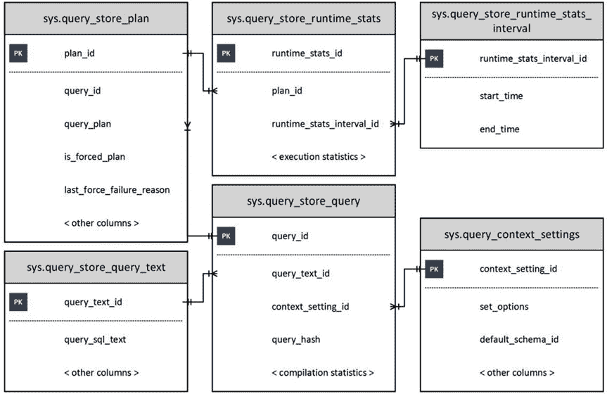

# 第 29 章 ■ 查询存储

查询存储已完全集成到查询处理管道中，如图 29-3 所示。

## 图 29-3 查询处理管道

当需要执行查询时，SQL Server 会在计划缓存中查找执行计划。如果找到计划，SQL Server 会检查该查询是否因统计信息更新或其他因素而需要重新编译，或者查询存储中是否创建了新的强制计划或删除了旧的强制计划。

在编译过程中，SQL Server 会检查该查询是否有可用的强制计划。当存在强制计划时，查询基本上会使用该强制计划进行编译，类似于使用 `USE PLAN` 提示的情况。如果生成的计划有效，则会被缓存在计划缓存中并供后续重用。

如果强制计划不再有效——例如，当用户删除了强制计划中引用的索引时——SQL Server 不会使查询失败，而是会在没有强制计划的情况下重新编译查询，并缓存新计划。另一方面，查询存储会持久保存两个计划，并将强制计划标记为无效。所有这些过程对于应用程序都是透明的。

您可以通过多个视图访问查询存储数据，如图 29-4 所示。

## 图 29-4 查询存储视图

与计划存储相关的视图包括：

### sys.query_store_query

提供有关查询、其编译统计信息和上次执行时间的信息。您可以在 [`msdn.microsoft.com/en-us/library/dn818156.aspx`](https://msdn.microsoft.com/en-us/library/dn818156.aspx) 阅读有关此视图的信息。

### sys.query_store_query_text

显示有关查询文本的信息。有关此视图的更多信息可在 [`msdn.microsoft.com/en-us/library/dn818159.aspx`](https://msdn.microsoft.com/en-us/library/dn818159.aspx) 获取。

### sys.query_context_setting

包含与查询关联的上下文设置信息。它包括 `SET` 选项、会话的默认架构、语言和其他属性。正如您在从第 26 章所记得的，SQL Server 会根据这些设置生成并缓存单独的执行计划。这种详细程度有助于您诊断计划缓存中包含大量相同查询计划的情况。文档可在 [`msdn.microsoft.com/en-us/library/dn818148.aspx`](https://msdn.microsoft.com/en-us/library/dn818148.aspx) 获取。

### sys.query_store_plan

提供有关查询执行计划的信息。`is_forced_plan` 列指示该计划是否为强制计划。`last_force_failure_reason` 提供强制计划未应用于查询的原因。您可以在 [`msdn.microsoft.com/en-us/library/dn818155.aspx`](https://msdn.microsoft.com/en-us/library/dn818155.aspx) 阅读有关此视图的信息。

如您所见，根据会话上下文选项、重新编译和其他因素，每个查询在 `sys.query_store_query` 和 `sys.query_store_plan` 视图中可以有多个条目。

运行时统计信息存储由以下两个视图表示：

### sys.query_store_runtime_stats_interval

包含有关统计信息收集间隔的信息。您应该记得，查询存储会聚合在由 `INTERVAL_LENGTH_MINUTES` 设置定义的固定时间间隔内的执行统计信息。MSDN 链接为 [`msdn.microsoft.com/en-us/library/dn818147.aspx`](https://msdn.microsoft.com/en-us/library/dn818147.aspx)。

### sys.query_store_runtime_stats

引用 `sys.query_store_plan` 视图，并包含在特定 `sys.query_store_runtime_stats_interval` 间隔内特定计划的运行时统计信息。

