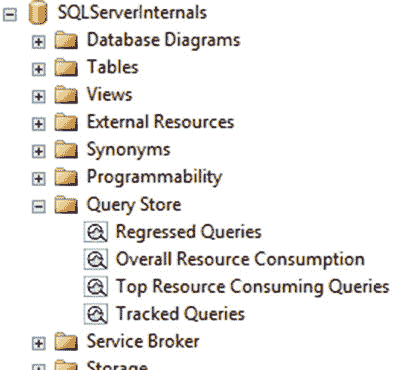
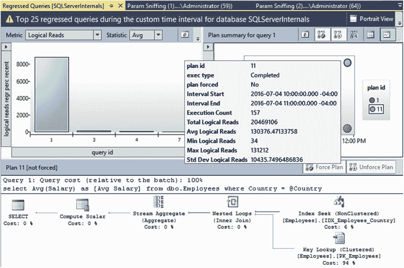
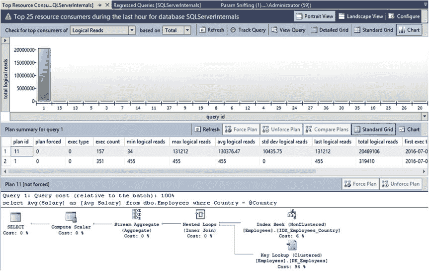

# 第 29 章 ■ 查询存储

#### 使用场景

执行次数、CPU 时间、调用持续时间、逻辑与物理 I/O 统计信息、事务日志使用情况、并行度、内存授予大小以及其他一些有用的指标信息。你可以在 [`msdn.microsoft.com/en-us/library/dn818158.aspx`](https://msdn.microsoft.com/en-us/library/dn818158.aspx) 阅读更多信息。

最后，查询存储允许你从内存中 OLTP 工作负载收集数据。当启用查询存储时，SQL Server 会自动为内存中 OLTP 对象收集查询、计划和优化统计信息，无需任何额外的配置更改。但是，运行时统计信息默认不被收集，你需要通过 `sys.sp_xtp_control_query_exec_stats` 存储过程显式启用此功能。

请记住，收集运行时统计信息会引入开销，这可能会降低内存中 OLTP 工作负载的性能。同样重要的是要记住，SQL Server 不会持久化内存中 OLTP 运行时统计信息的收集设置，该设置将在 SQL Server 重启后被禁用。

■ **注意** 我们将在本书第八部分详细讨论内存中 OLTP。

SQL Server 为你提供了一套丰富的工具，可以在 `SSMS` 和 `T-SQL` 中使用查询存储。让我们详细看看它们。

作为第一步，让我们收集一些数据并模拟因参数嗅探导致的性能回归。我将使用第 26 章清单 26-1 和 26-2 中定义的表和存储过程，如清单 29-1 所示，在两个会话中调用它们。



***清单 29-1.*** 模拟因参数嗅探导致的性能回归

```sql
-- 会话 1
while 1 = 1
begin
    exec dbo.GetAverageSalary @Country='USA';
    waitfor delay '0:00:01.000';
end;

-- 会话 2
dbcc freeproccache;
exec dbo.GetAverageSalary @Country='CANADA';
```

## 在 SSMS 中使用查询存储

在数据库中启用查询存储后，你可以在对象资源管理器中看到 `查询存储` 文件夹，如图 29-5 所示。此文件夹包含四个交互式报表，允许你分析收集的数据、强制查询的执行计划以及执行其他一些操作。

***图 29-5.** 对象资源管理器中的查询存储文件夹*

如图 29-6 所示的 `回归查询` 报表，显示了随时间性能回归的查询。你可以配置回归标准和分析的时间范围，以及其他几个参数。



***图 29-6.** 回归查询报表*

你可以在左上方的图表中选择要显示的查询。报表的右上方部分展示了所选查询收集到的执行计划。你可以点击代表不同执行计划的点，并在底部查看它们。如果需要，还可以比较不同的执行计划。

`强制计划` 按钮允许你为查询强制执行选定的计划。它在内部调用 `sys.sp_query_store_force_plan` 存储过程。类似地，`取消强制计划` 按钮通过调用 `sys.sp_query_store_unforce_plan` 存储过程来移除强制计划。

回归查询报表是一个强大的工具，可用于排查系统中与参数嗅探相关的问题，并通过强制特定执行计划快速修复它们。

如图 29-7 所示的 `资源消耗最高的查询` 报表，允许你检测系统中资源消耗最密集的查询。简而言之，其工作方式类似于 `sys.dm_exec_query_stats` 视图；但是，它没有该视图的限制，例如对计划缓存的依赖。该报表是一个绝佳工具，可帮助你快速识别系统中的优化目标。



