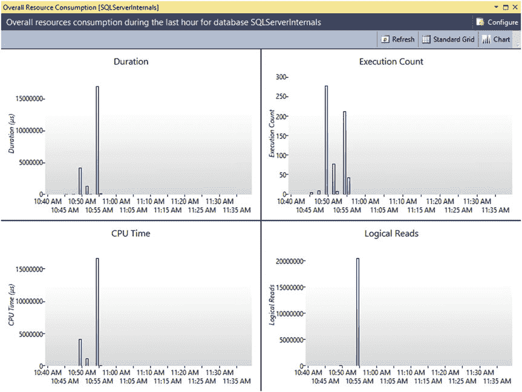
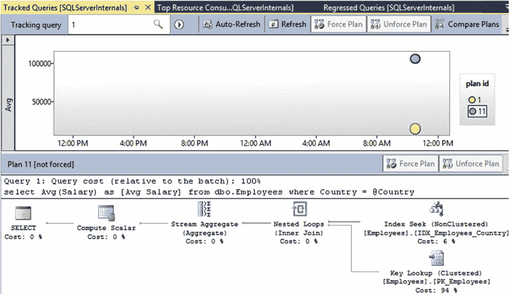

# 第 29 章 ■ 查询存储

## 图 29-7. 资源消耗最高的查询报告

`Overall Resource Consumption`（总体资源消耗）报告向你展示了工作负载随时间间隔变化的统计信息和资源使用情况。它允许你检测和分析资源使用的峰值，并深入探究引发这些峰值的查询。图 29-8 展示了该报告的输出。



## 图 29-8. 总体资源消耗报告

`Tracked Queries`（已跟踪的查询）报告允许你监控单个查询的执行计划和统计信息。它提供的信息与`Regressed Queries`（性能回退的查询）和`Top Resource Consuming Queries`（资源消耗最高的查询）报告类似，但范围限定在单个查询。图 29-9 对此进行了说明。



## 图 29-9. 已跟踪的查询报告

### 通过 T-SQL 使用查询存储

尽管 SSMS 提供了丰富的工具集来操作查询存储，但在某些情况下，使用 T-SQL 直接处理查询存储数据是有益的。让我们来看几个常见的适用场景。

第一个非常常见的任务是，在选择后续性能优化目标时，查找资源消耗最密集的查询。在上一章中，你已经看到了如何从 `sys.dm_exec_query_stats` 视图获取执行统计信息。如你所记得的，该视图依赖于计划缓存，并且在分析过程中你经常需要与扩展事件进行交叉核对。查询存储可以为你提供类似的信息，且无需依赖任何计划缓存，这极大地简化了流程。

代码清单 29-2 展示了返回系统中最近 50 个 I/O 最密集查询信息的代码。如你所知，查询存储按时间区间聚合执行统计信息，因此你需要聚合来自多个 `sys.query_store_runtime_stats` 行的数据。输出将包括过去 24 小时内结束的所有区间的数据，并按查询及其执行计划进行分组。

#### 代码清单 29-2. 获取最昂贵查询的信息

```sql
select top 50
    q.query_id
    , qt.query_sql_text
    , qp.plan_id
    , qp.query_plan
    , sum(rs.count_executions) as [Execution Cnt]
    , convert(int, sum(rs.count_executions *
        (rs.avg_logical_io_reads + avg_logical_io_writes)) /
        sum(rs.count_executions)) as [Avg IO]
    , convert(int, sum(rs.count_executions *
        (rs.avg_logical_io_reads + avg_logical_io_writes))) as [Total IO]
    , convert(int, sum(rs.count_executions * rs.avg_cpu_time) /
        sum(rs.count_executions)) as [Avg CPU]
    , convert(int, sum(rs.count_executions * rs.avg_cpu_time)) as [Total CPU]
    , convert(int, sum(rs.count_executions * rs.avg_duration) /
        sum(rs.count_executions)) as [Avg Duration]
    , convert(int, sum(rs.count_executions * rs.avg_duration))
        as [Total Duration]
    , convert(int, sum(rs.count_executions * rs.avg_physical_io_reads) /
        sum(rs.count_executions)) as [Avg Physical Reads]
    , convert(int, sum(rs.count_executions * rs.avg_physical_io_reads))
        as [Total Physical Reads]
    , convert(int, sum(rs.count_executions * rs.avg_query_max_used_memory) /
        sum(rs.count_executions)) as [Avg Memory Grant Pages]
    , convert(int, sum(rs.count_executions * rs.avg_query_max_used_memory))
        as [Total Memory Grant Pages]
    , convert(int, sum(rs.count_executions * rs.avg_rowcount) /
        sum(rs.count_executions)) as [Avg Rows]
    , convert(int, sum(rs.count_executions * rs.avg_rowcount)) as [Total Rows]
    , convert(int, sum(rs.count_executions * rs.avg_dop) /
        sum(rs.count_executions)) as [Avg DOP]
    , convert(int, sum(rs.count_executions * rs.avg_dop)) as [Total DOP]
from
    sys.query_store_query q
    join sys.query_store_plan qp on q.query_id = qp.query_id
    join sys.query_store_query_text qt on q.query_text_id = qt.query_text_id
    join sys.query_store_runtime_stats rs on qp.plan_id = rs.plan_id
    join sys.query_store_runtime_stats_interval rsi on rs.runtime_stats_interval_id = rsi.runtime_stats_interval_id
where
```


