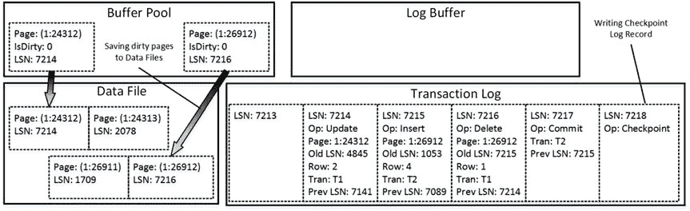
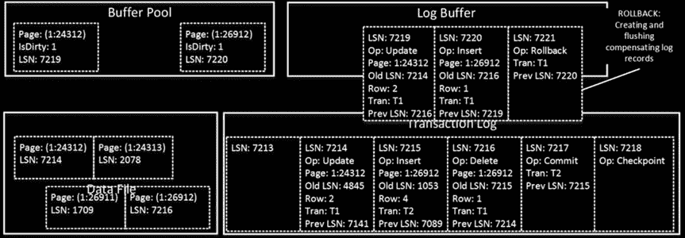

# 事务日志内部原理

***图 30-3.** 数据修改：T1 和 T2 在另一页上更改数据*

如您所见，所有日志记录仍在日志缓冲区中。现在，假设事务 `T2` 想要提交。此操作生成另一条日志记录，并强制 `SQL Server` 将日志块的内容刷写到磁盘，如 *图 30-4* 所示。`SQL Server` 将 `COMMIT` 及其之前的所有日志记录从日志缓冲区硬化到事务日志中，而不管生成它们的事务如何。

**注意** 准确地说，`COMMIT` 操作将包含 `COMMIT` 及其之前所有日志记录的日志缓冲区部分标记为“准备刷写”。另一个 `SQL Server` 进程，*日志写入器*，会持续扫描日志缓冲区并将“准备刷写”区域刷写到事务日志。

***图 30-4.** 数据修改：提交*

