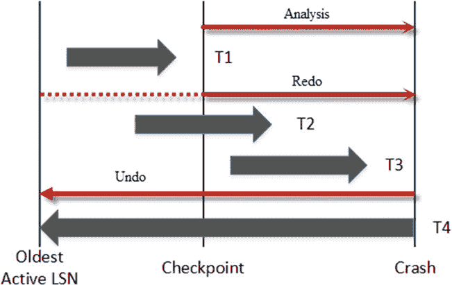

# 第 30 章 ■ 事务日志内部原理

只有在所有日志记录都硬化后，客户端应用程序才会收到事务已提交的确认。即使数据页 `(1:26912)` 仍然是脏页且尚未保存到数据文件中，磁盘上已硬化的日志记录也包含足够的信息来重新应用（重做）已提交的 `T2` 事务所做的所有更改。因此，如果发生 `SQL Server` 崩溃，这可以保证数据不会丢失。

此时，系统已将日志记录硬化到事务日志中，尽管数据文件中的数据页尚未更新。下一个 `CHECKPOINT` 进程会保存脏数据页，并在缓冲池中将它们标记为干净。`CHECKPOINT` 也会生成自己的日志记录，如 *图 30-5* 所示。

***图 30-5.** 数据修改：CHECKPOINT*

此时，数据文件中的页存储的是未提交事务 `T1` 的数据。然而，事务日志中的日志记录包含足够的信息，以便在需要时撤销更改。在这种情况下，`SQL Server` 会执行*补偿操作*，这些操作执行与原始数据修改相反的操作，并生成*补偿日志记录*。

*图 30-6* 展示了这样一个例子。`SQL Server` 执行了一次补偿更新，生成了 `LSN` 为 `7219` 的补偿日志记录，以撤消 `LSN` 为 `7214` 的原始更新操作所做的更改。它还生成了 `LSN` 为 `7920` 的补偿插入，以补偿 `LSN` 为 `7216` 的删除操作。

***图 30-6.** 数据修改：回滚*

