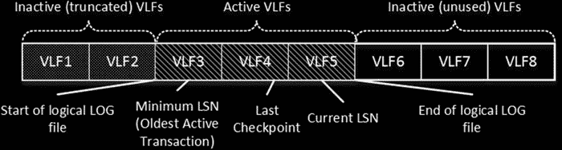
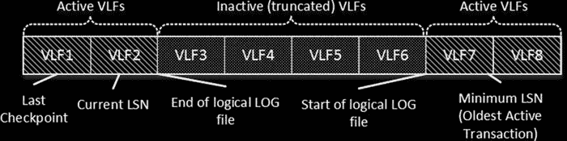

# 第 30 章：事务日志内部原理

延迟持久性对于那些在事务日志写入方面存在瓶颈且能容忍少量数据丢失的系统来说，可能是一个不错的选择。然而，这存在一个小风险。在某些罕见情况下，`CHECKPOINT` 进程可能会在事务日志记录固化（hardened）之前就将脏数据页刷新到磁盘。如果 SQL Server 恰好在此时崩溃，重启后数据库将进入损坏且事务不一致的状态。如果你决定使用延迟持久性，应评估此风险。

## 数据库选项：DELAYED_DURABILITY

一个名为 `DELAYED_DURABILITY` 的数据库选项，用于控制数据库范围内延迟持久性的行为。它可能有以下三种设置：

- `DISABLED`：此选项禁用数据库事务的延迟持久性，无论事务持久性模式如何。数据库中的所有事务始终是完全持久的。这是默认选项，与早期版本的 SQL Server 行为一致。
- `FORCED`：此选项强制数据库事务使用延迟持久性，无论事务持久性模式如何。
- `ALLOWED`：延迟持久性在事务级别进行控制。除非明确指定延迟持久性，否则事务是完全持久的。

值得注意的是，对于跨数据库或分布式事务，所有事务都是完全持久的，无论其设置如何。这同样适用于更改跟踪（Change Tracking）和变更数据捕获（Change Data Capture）技术。任何更新启用了这些技术之一的表的事务都将是完全持久的。延迟持久性也不支持与事务复制一起使用。

你可以通过在 `COMMIT` 操作符中指定持久性模式来控制事务的持久性。代码清单 30-1 展示了一个使用延迟持久性事务的示例。如前所述，`DELAYED_DURABILITY` 数据库选项可以覆盖该设置。

### 代码清单 30-1：具有延迟持久性的事务

```sql
begin tran

/* 执行某些操作 */

commit with (delayed_durability=on)
```

任何其他与事务日志交互的 SQL Server 技术，只有在这些提交记录被固化到日志中（并因此在数据库中变为持久）之后，才会看到并处理来自延迟持久性事务的提交记录。例如，如果在事务提交和日志缓冲区刷新之间完成了数据库备份，那么提交日志记录将不会包含在备份中，因此在还原时该事务将被回滚。

另一个例子是 AlwaysOn 可用性组。辅助节点只会在主节点上的日志记录固化并通过网络传输之后，才会接收到提交记录。

#### 虚拟日志文件

尽管一个事务日志可以包含多个文件，但 SQL Server 在写入和读取日志记录流时是以顺序方式处理它的。因此，SQL Server 无法从多个物理日志文件中受益。

> **注意**：在某些极端情况下，你可以从多个日志文件中获益。例如，将多个日志文件放置在独立的磁盘阵列上，将允许 SQL Server 在数据库创建或还原操作期间并行地对日志文件进行零初始化。

在内部，SQL Server 将每个物理日志文件划分为更小的部分，称为*虚拟日志文件 (VLF)*。SQL Server 使用虚拟日志文件作为管理单元；它们可以是活动的（active）或非活动的（inactive）。




当一个 VLF 存储*事务日志的活动部分*时，它就是活动的。该活动部分包含在发生事务回滚或意外 SQL Server 关闭时保持数据库事务一致性所需的一系列日志记录。目前，请不要关注是什么让日志保持活动状态；我们将在本章后面探讨这一点。一个非活动的 VLF 包含事务日志中*已被截断*（非活动）和未使用的部分。


