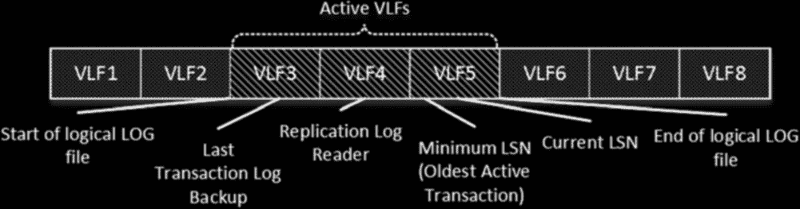
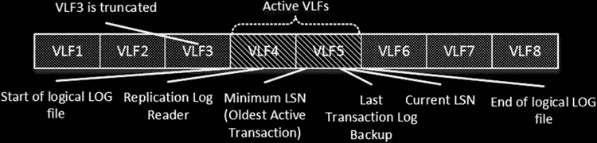

# 第 30 章 ■ 事务日志内部机制

## 图 30-11. 简单恢复模型：初始阶段

当 SQL Server 执行 `CHECKPOINT` 时，所有脏数据页都会被保存到数据文件中。因此，崩溃恢复不需要重做与来自 `VLF3` 的日志记录相关的任何更改，该虚拟日志文件可以被截断并标记为非活动。但是，`VLF4` 必须保持活动状态，以支持回滚那些在 `VLF4` 中存储有相应日志记录的事务。图 30-12 说明了这一点。

## 图 30-12. 简单恢复模型：CHECKPOINT 后的日志截断

因此，在 `SIMPLE` 恢复模型中，事务日志的活动部分起始于一个 `VLF`，该 `VLF` 包含最旧的活动事务的最旧 `LSN` 或最后一次 `CHECKPOINT` 的 `LSN`。同样值得注意的是，如果启用了事务复制，则 `VLF` 只有在 `复制日志读取器` 处理完其中的事务后才能被截断。

> **注意**
> 活动的数据库备份会延迟事务日志截断，直到其完成。

正如你可能猜到的那样，尽管 SQL Server 在 `SIMPLE` 模型中支持崩溃恢复，但你仍需保持数据和日志文件完好无损，以避免数据丢失并保持数据库的事务一致性。

或者，使用 `完整` 或 `大容量日志` 恢复模型，SQL Server 支持事务日志备份，这使你能够恢复数据库并避免数据丢失，无论数据文件的状态如何，只要事务日志是完整的。当然，这假设有一套合适的备份可用。我们将在下一章更详细地讨论备份和恢复过程。

在 `完整` 和 `大容量日志` 恢复模型中，SQL Server 要求你执行事务日志备份以触发日志截断。此外，如果你有其他需要读取事务日志记录的进程，截断可能会被延迟。想想事务复制、数据库镜像和 `AlwaysOn 可用性组` 就是这类进程的例子。

图 30-13 展示了一个例子。最小和当前 `LSN` 都在 `VLF5` 中，尽管上次事务日志备份的 `LSN` 在 `VLF3` 中。因此，事务日志的活动部分包括 `VLF3`、`VLF4` 和 `VLF5`。





## 图 30-13. 完整和大容量日志恢复模型：初始阶段

在进行另一次事务日志备份后，SQL Server 可以截断 `VLF3`。然而，`VLF4` 必须保持活动，因为 `复制日志读取器` 尚未处理来自 `VLF4` 的部分日志记录。图 30-14 说明了这一点。

## 图 30-14. 完整和大容量日志恢复模型：日志截断

如你所见，在 `完整` 或 `大容量日志` 恢复模型中，事务日志的活动部分起始于一个 `VLF`，该 `VLF` 包含以下项中最旧的一个：
* 上次日志备份的 `LSN`
* 最旧的活动事务的 `LSN`
* 读取事务日志记录的进程的 `LSN`

> **重要提示**
> `完整` 数据库备份不会截断事务日志。你必须执行事务日志备份才能做到这一点。

`完整` 和 `大容量日志` 恢复模型之间的区别在于 SQL Server 如何记录最小化日志操作，例如：

```sql
CREATE INDEX, ALTER INDEX REBUILD, BULK INSERT, INSERT INTO, INSERT SELECT
```

以及其他一些操作。在 `完整` 恢复模型中，这些操作被完整记录。SQL Server 为操作影响的每一行数据写入日志记录。或者，在 `大容量日志` 恢复模型中，SQL Server 不会逐行记录最小化日志操作；而是记录区的分配情况。所有最小化日志操作都会生成新的（或现有对象的副本）对象，而区的分配撤消则回滚更改。非最小化日志操作在 `大容量日志` 模型中总是像在 `完整` 恢复模型中一样被完整记录。同样值得注意的是，`简单`


恢复模型以类似于 `BULK LOGGED` 恢复模型的方式记录最小日志记录操作。

