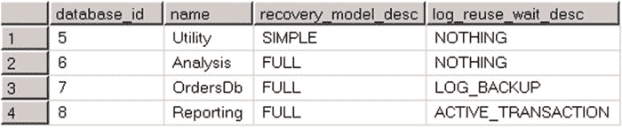

# 第 30 章 ■ 事务日志内部机制

`BULK LOGGED` 恢复模型在最小日志记录操作期间减少了事务日志负载，但这是有代价的。首先，如果在特定时间点运行了批量操作，`SQL Server` 无法执行时间点恢复。此外，`SQL Server` 在执行日志备份时必须能够访问数据文件，并且它将由最小日志记录操作修改的数据页/区作为备份文件的一部分存储。这会增加日志备份的大小，并在日志备份之间数据文件不可用时导致数据丢失。

选择正确的恢复模型是一个非常重要的决策，它会影响灾难发生时潜在的数据丢失量。这是设计备份和灾难恢复策略的重要组成部分，我们将在下一章中讨论。

## TempDB 日志记录

`tempdb` 中的所有用户对象必须在事务上保持一致。`SQL Server` 必须能够回滚更改 `tempdb` 中数据的事务，其方式与在用户数据库中的方式相同。然而，`tempdb` 总是在 `SQL Server` 启动时重新创建。因此，`tempdb` 中的日志记录不需要支持崩溃恢复的重做阶段。`tempdb` 中的日志记录仅存储修改数据行的 `旧值`，省略了 `新值`。

这种行为使 `tempdb` 成为 ETL 过程暂存区的良好候选者。与用户数据库中的修改相比，`tempdb` 中的数据修改更高效，因为涉及的日志记录量更少。日志记录不是用户数据库中事务日志活动的一部分，这减少了日志备份的大小。此外，如果使用任何基于事务日志的高可用性技术，这些修改不会通过网络传输。

正如我们在[第 13 章“临时对象与 TempDB”](http://dx.doi.org/10.1007/978-1-4842-1964-5_13)中所讨论的，使用 `tempdb` 作为暂存区在实施过程中会带来一系列挑战。在 `SQL Server` 重启或故障转移到另一个节点的情况下，存储在 `tempdb` 中的所有数据都将丢失。代码必须意识到这种可能性并相应地处理它。

#### 事务日志过度增长

事务日志过度增长是初级或意外担任的数据库管理员必须处理的常见问题。当 `SQL Server` 无法截断事务日志并重用日志文件中的空间时，就会发生这种情况。在这种情况下，日志文件会继续增长，直到填满整个磁盘，并将数据库切换为只读模式，同时出现此 9002 错误：`“事务日志已满。”`

`SQL Server` 无法截断事务日志的原因有很多。你可以检查 `sys.databases` 视图中的 `log_reuse_wait_desc` 列，以发现事务日志无法被重用的原因。你可以在 `清单 30-2` 中看到检查用户数据库 `log_reuse_wait_desc` 的查询。查询的输出显示在 `图 30-15` 中。

`清单 30-2.` 检查用户数据库的 `log_reuse_wait_desc`

```sql
select database_id, name, recovery_model_desc, log_reuse_wait_desc
from sys.databases
where database_id >= 5
```



