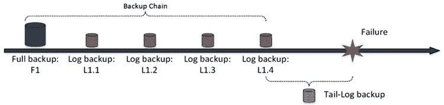

# 第 31 章 ■ 备份与恢复

在技术领域，灾难的发生只是时间问题。数据库可能因用户错误、硬件故障或软件缺陷而损坏。磁盘阵列可能失效，导致用户无法访问数据库。工程师可能意外更改 SAN 阵列中的 LUN 配置，从而影响其存储的数据库。自然灾害可能影响数据中心的可用性。在任何这些情况下，都必须能够恢复数据库，并以最小的数据丢失和停机时间将系统恢复在线。

本章讨论 SQL Server 如何执行数据库备份和恢复，并涵盖数据库恢复过程中可以使用的几个重要用例。它还提供了关于如何设计备份策略以最小化系统停机时间和数据丢失的若干思路。

#### 数据库备份类型

SQL Server 提供三种不同类型的数据库备份。

`完整`数据库备份会备份整个数据库。SQL Server 将 `CHECKPOINT` 作为数据库备份的第一步，备份数据文件中所有已分配的区，最后，备份代表备份期间所做工作的那部分事务日志。

事务日志是恢复数据库后在还原操作中必需的。该部分包含所有日志记录，起始于以下事件中最早的一个：

-   最后一个 `CHECKPOINT`（检查点）。
-   最老的活动事务的开始。
-   日志未扫描部分的开始（如果有任何依赖于事务日志扫描的进程，例如事务复制、数据库镜像、`AlwaysOn 可用性组`等）。

完整数据库备份代表备份操作完成时的数据库状态。它在每种恢复模型中都受支持。

`差异`备份自上次完整备份以来备份那些已修改的区。SQL Server 使用一组称为 `差异更改映射 (DCM)` 的分配映射页来跟踪哪些区已被更改。SQL Server 仅在完整数据库备份期间清除这些映射页。因此，差异备份是累积的，每个差异备份存储自上次完整备份（而非上次差异备份）以来所有已修改的区。与完整数据库备份一样，差异备份在每种恢复模型中均有效。

`日志`备份备份事务日志的活动部分，起始于上次完整备份或日志备份的 `LSN`（日志序列号）。此备份类型仅在 `FULL`（完整）或 `BULK LOGGED`（大容量日志）恢复模型中受支持。它是事务日志管理的重要组成部分，并且是触发日志截断所必需的。值得重申的是，在 `FULL` 或 `BULK LOGGED` 恢复模型中，完整数据库备份不会截断事务日志。您应执行日志备份来截断事务日志。

如果日志备份与完整数据库备份同时运行，日志截断将被推迟，直到完整备份完成。

© Dmitri Korotkevitch 2016

D. Korotkevitch, `Pro SQL Server Internals`, DOI 10.1007/978-1-4842-1964-5_31

