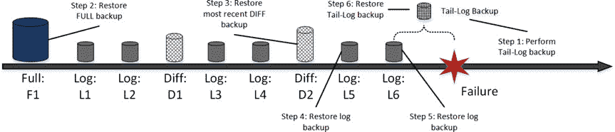

# 第 31 章 ■ 备份与还原

在批量复制操作期间（例如，在重建索引期间），数据库的恢复模型会临时切换为 `SIMPLE`，操作完成后再切换回 `FULL` 恢复模型。

### ■ 重要提示
在数据库切换回 `FULL` 恢复模型后，应立即执行一次完整备份或日志备份。

这两种恢复模型都无法在事务日志损坏时保持数据库的事务一致性。为最大限度地减少此类情况的发生，应将事务日志存储在高度冗余的磁盘阵列上。然而，没有任何解决方案是 100%冗余的。应定期进行日志备份，以最大程度地减少可能的数据丢失。*日志备份的频率有助于控制可能的数据丢失，并指示在事务日志损坏的情况下需要重做多少工作量*。

例如，如果你每小时执行一次日志备份，那么在还原最后一个日志备份时，你最多只会丢失一个小时的工作量。



### ■ 重要提示
日志备份之间的间隔不应超过恢复点目标（RPO）要求所规定的时间。在设计备份策略时，还应考虑日志备份的持续时间。

虽然基于 RPO 定义备份策略相对容易，但基于 RTO 则要棘手得多。RTO 规定了恢复过程的最大持续时间，也就是系统的停机时间。这段时间取决于几个因素，例如网络吞吐量（它决定了通过网络传输备份文件所需的时间），以及备份文件的大小和数量。此外，这个持续时间会随着数据库和负载的增长而变化。应定期测试数据库恢复过程，确保其仍然满足 RTO 要求。

图 31-4 展示了一个具有多个差异备份和日志备份的数据库的恢复场景。恢复过程的第一步是执行一个尾日志备份，该备份会备份自上次日志备份以来尚未备份的那部分事务日志。之后，你应该还原最近的一次完整备份、最近的一次差异备份，以及之后进行的所有日志备份，包括尾日志备份。

### 图 31-4. 恢复序列

让我们假设图 31-4 中的示例表示一个数据库，其主文件组位于磁盘 `M:` 上，次要文件组位于磁盘 `N:` 上，事务日志位于磁盘 `L:` 上。所有备份文件都存储在磁盘 `V:` 上。清单 31-12 展示了在灾难发生后（磁盘 `N:` 损坏且不可用）恢复数据库的脚本。次要文件组的数据文件被移动到磁盘 `M:`。在此示例中，`SQL Server` 必须重做从差异备份 `D2` 的时间点到故障发生时间点之间发生的所有数据修改。

### 清单 31-12. 灾难后恢复数据库

```
-- 备份尾日志。数据库将保持在 RESTORING 状态
backup log RecoveryDemo
to disk = N'V:\RecoveryDemo-tail-log.trn'
with no_truncate, noformat, init,
name = N'RecoveryDemo-Tail-log backup',
norecovery, stats = 5;

-- 还原完整备份，将文件从次要文件组移动到 M: 盘
restore database RecoveryDemo
from disk = N'V:\RecoveryDemo-F1.bak' with file = 1,
move N'RecoveryDemo_Secondary' to N'M:\RecoveryDemo_Secondary.ndf',
norecovery, stats = 5;

-- 还原差异备份
restore database RecoveryDemo
from disk = N'V:\RecoveryDemo-F2.bak' with file = 1,
norecovery, stats = 5;

-- 还原 L5 日志备份
restore log RecoveryDemo
from disk = N'V:\RecoveryDemo-L5.trn' with file = 1,
norecovery, stats = 5;

-- 还原 L6 日志备份
restore log RecoveryDemo
from disk = N'V:\RecoveryDemo-L6.trn' with file = 1,
norecovery, stats = 5;

-- 还原尾日志备份
restore log RecoveryDemo
from disk = N'V:\RecoveryDemo-tail-log.trn' with file = 1,
norecovery, stats = 5;

-- 恢复数据库
```


