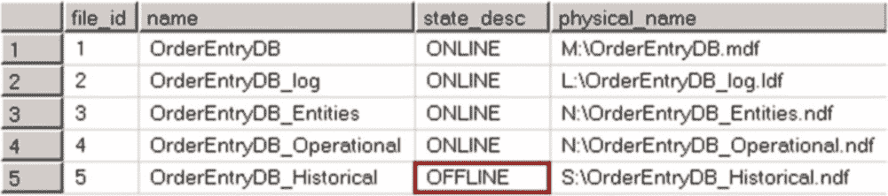

# 第 31 章 ■ 备份与还原

## 部分数据库可用性与分段还原

良好备份策略的关键要素之一是备份验证。仅仅备份数据库是不够的，您应确保备份文件未损坏，并且可以从它们还原数据库。您可以通过在另一台服务器上还原备份文件来验证其有效性。

`提示` 在备份还原到另一台服务器后，您也可以运行 `DBCC CHECKDB` 来执行数据库一致性检查。这有助于降低生产服务器的负载。

另一个确保备份安全的好做法是存储备份文件的冗余集。在进行新的差异备份后，不要删除包含旧差异备份和日志备份的备份文件。这样的策略可以帮助您在最近一次备份损坏时恢复数据库。

最后，数据库并非存在于真空中。灾难后仅仅恢复数据库是不够的；它还必须能为客户端应用程序所用。备份和灾难恢复策略应纳入数据库生态系统中的其他要素，并支持在另一台 SQL Server 上执行数据库还原。这些要素包括服务器登录名、SQL 作业、数据库邮件配置文件、`master` 数据库中的存储过程等。它们应与备份策略一起进行脚本化和测试。

*部分数据库可用性*是企业版的一项功能，它允许您在灾难期间保持部分数据库处于联机状态，或者按文件组逐个还原数据库，从而逐个使这些文件组对用户可用。部分数据库可用性基于每个文件组工作，并要求 `PRIMARY` 文件组和事务日志文件可用且在线。

`提示` 不要将用户对象放在 `PRIMARY` 文件组中。这可以减小 `PRIMARY` 文件组的大小，并在灾难发生时缩短其还原所需的时间。

部分数据库可用性在数据分区的情况下尤其有益。系统中的不同数据可能有不同的 RTO（恢复时间目标）要求。例如，当前关键操作数据的恢复时间要求以分钟计，而较早的历史数据恢复时间则以小时甚至天计，这种情况并不少见。分段还原允许您执行部分数据库快速还原，并使操作数据快速联机，而无需等待历史数据还原完成。



假设我们有一个数据库 `OrderEntryDB`，包含四个文件组：`Primary`、`Entities`、`OperationalData` 和 `HistoricalData`。`Primary` 文件组位于 `M:` 驱动器上，`Entities` 和 `OperationalData` 位于 `N:` 驱动器上，`HistoricalData` 位于 `S:` 驱动器上。清单 31-13 显示了该数据库的布局。

***清单 31-13.*** 部分数据库可用性：数据库布局

```sql
create database OrderEntryDB
on primary
(name = N'OrderEntryDB', filename = N'M:\OrderEntryDB.mdf'),
filegroup Entities
(name = N'OrderEntryDB_Entities', filename = N'N:\OrderEntryDB_Entities.ndf'),
filegroup OperationalData
(name = N'OrderEntryDB_Operational', filename = N'N:\OrderEntryDB_Operational.ndf'),
filegroup HistoricalData
(name = N'OrderEntryDB_Historical', filename = N'S:\OrderEntryDB_Historical.ndf')
log on
(name = N'OrderEntryDB_log', filename = N'L:\OrderEntryDB_log.ldf');
```

在第一个示例中，假设 `S:` 驱动器损坏，`HistoricalData` 文件组变得不可用。让我们看看如何从该文件组恢复数据并将文件移动到另一个驱动器。

第一步，如清单 31-14 所示，您需要将损坏的文件标记为脱机。此操作将终止所有数据库连接，尽管用户之后可以立即重新连接到数据库。

***清单 31-14.*** 部分数据库可用性：将文件标记为脱机

```sql
alter database OrderEntryDb modify file(name = OrderEntryDB_Historical, offline);
```


