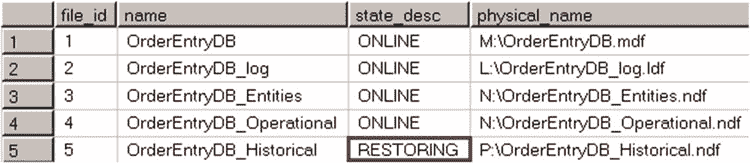
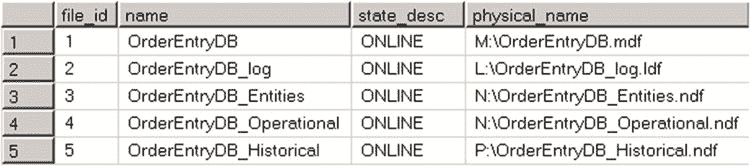

# 部分数据库可用性恢复流程

此时，`HistoricalData` 文件组中的所有数据对用户都不可用。但是，用户仍然可以使用其他文件组中的数据。

如果使用 清单 31-15 中所示的查询查询 `sys.database_files` 视图，您将看到 `HistoricalData` 文件组的数据文件处于 `OFFLINE` 状态。图 31-5 显示了此状态。

***清单 31-15.*** 部分数据库可用性：查询文件状态

```sql
select file_id, name, state_desc, physical_name
from sys.database_files
```

***图 31-5.*** 部分数据库可用性：将一个文件标记为脱机后的数据文件状态


下一步，您应该进行一个尾日志备份，如 清单 31-16 所示。数据库是否仍然在线以及其他会话是否正在生成日志记录并不重要。`OrderEntryDB_Historical` 文件已脱机，因此新生成的日志记录都不会应用于该文件中的数据。值得一提的是，在进行尾日志备份时不应使用 `NORECOVERY` 选项，因为 `NORECOVERY` 会将数据库切换到 `RESTORING` 状态。

***清单 31-16.*** 部分数据库可用性：进行尾日志备份

```sql
backup log OrderEntryDB
to disk = N'V:\OrderEntryDB-tail-log.trn'
with no_truncate, init,
name = N'OrderEntryDB-Tail-log backup';
```

接下来，您应该从当前的日志链中恢复一个完整备份，并按 清单 31-17 所示恢复单个文件。

***清单 31-17.*** 部分数据库可用性：恢复完整备份

```sql
restore database OrderEntryDB
file = N'OrderEntryDB_Historical'
from disk = N'V:\OrderEntryDB.bak' with file = 1,
move N'OrderEntryDB_Historical' to N'P:\OrderEntryDB_Historical.ndf',
norecovery, stats = 5;
```

如果您再次运行 清单 31-15 中显示文件状态的查询，您将看到 图 31-6 中所示的结果。只有一个文件将处于 `RESTORING` 阶段，而所有其他文件都将在线并可供用户使用。

***图 31-6.*** 部分数据库可用性：应用完整备份后的数据文件状态

最后，您应该恢复所有其他差异备份和日志备份文件，最后恢复尾日志备份。这里不需要指定每个单独的文件。SQL Server 将仅恢复处于 `RESTORING` 状态的文件。实现此操作的代码如 清单 31-18 所示。

***清单 31-18.*** 部分数据库可用性：恢复其他备份文件

```sql
restore log OrderEntryDB
from disk = N'V:\OrderEntryDB.trn' with file = 1,
norecovery, stats = 5;

-- 恢复尾日志备份
restore log OrderEntryDB
from disk = N'V:\OrderEntryDB-tail-log.trn' with file = 1,
norecovery, stats = 5;

restore database OrderEntryDB with recovery;
```



数据库已恢复，所有文件现在都在线，如 图 31-7 所示。

***图 31-7.*** 部分数据库可用性：恢复后的数据文件状态

在 SQL Server 的非企业版中恢复单个文件时，您可以使用相同的动作序列，尽管在此过程中数据库会切换到 `RESTORING` 状态，并且用户将无法访问。

当您希望对数据库执行分段恢复，使其按文件组逐个上线时，可以应用相同的技术。您可以使用一个 `RESTORE` 语句，指定文件组列表，并使用 `PARTIAL` 选项。清单 31-19 展示了如何对 `Primary`、`Entities` 和 `OperationalData` 文件组执行分段恢复。

***清单 31-19.*** 分段文件组恢复：恢复 Primary、Entities 和 OperationalData 文件组

```sql
restore database OrderEntryDB
filegroup='Primary', filegroup='Entities', filegroup='OperationalData'
```


