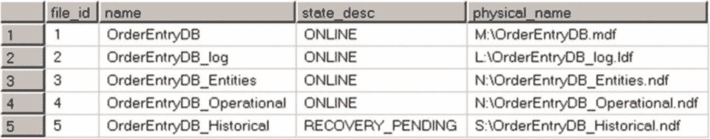

# 第 31 章 ■ 备份与恢复

```
from disk = N'V:\OrderEntryDB.bak' with file = 1,
move N'OrderEntryDB' to N'M:\OrderEntryDB.mdf',
move N'OrderEntryDB_Entities' to N'N:\OrderEntryDB_Entities.ndf',
move N'OrderEntryDB_Operational' to N'N:\OrderEntryDB_Operational.ndf',
move N'OrderEntryDB_log' to N'L:\OrderEntryDB_log.ldf',
norecovery, partial, stats= 5;

restore log OrderEntryDB
from disk = N'V:\OrderEntryDB.trn' with file = 1,
norecovery, stats = 5;

restore log OrderEntryDB
from disk = N'V:\OrderEntryDB-tail-log.trn' with file = 1,
norecovery, stats = 5;

restore database OrderEntryDB with recovery;
```

此时，来自已还原文件组的文件已处于联机状态，而历史数据文件则处于 `RECOVERY_PENDING`（恢复挂起）状态。你可以在 `图 31-8.` 中看到 `清单 31-15` 的查询结果。



`图 31-8.` 分段文件组恢复：还原 `Primary`、`Entities` 和 `OperationalData` 文件组后的数据文件状态

最后，你可以使用 `清单 31-20.` 所示的 `RESTORE` 语句将 `HistoricalData` 文件组联机。

`清单 31-20.` 分段文件组恢复：还原 `HistoricalData` 文件组

```
restore database OrderEntryDB
filegroup='HistoricalData'
from disk = N'V:\OrderEntryDB.bak' with file = 1,
move N'OrderEntryDB_Historical' to N'S:\OrderEntryDB_Historical.ndf',
norecovery, stats = 5;

restore log OrderEntryDB
from disk = N'V:\OrderEntryDB.trn' with file = 1,
norecovery, stats = 5;

restore log OrderEntryDB
from disk = N'V:\OrderEntryDB-tail-log.trn' with file = 1,
norecovery, stats = 5;

restore database OrderEntryDB with recovery;
```

分段恢复极大地提高了系统的可用性；然而，你需要以允许利用这种方式来设计数据布局。通常，这意味着要使用数据分区技术，我们已在 [第 16 章，“数据分区”](http://dx.doi.org/10.1007/978-1-4842-1964-5_16) 中讨论过。

## 部分数据库备份

SQL Server 允许你备份单个文件和文件组，以及从备份中排除只读文件组。你可以单独备份只读文件组，并将它们排除在常规完整备份之外，这可以显著减少备份文件的大小和备份时间。

`清单 31-21` 将 `HistoricalData` 文件组标记为只读，并备份来自该文件组的数据。之后，它使用 `READ_WRITE_FILEGROUPS` 选项仅对读写文件组执行完整备份，并执行日志备份。

`清单 31-21.` 部分备份：执行备份

```
alter database OrderEntryDB modify filegroup HistoricalData readonly;

backup database OrderEntryDB
filegroup = N'HistoricalData'
to disk = N'V:\OrderEntryDB-hd.bak'
with noformat, init,
name = N'OrderEntryDB-HistoricalData Backup', stats = 5;

backup database OrderEntryDB read_write_filegroups
to disk = N'V:\OrderEntryDB-rw.bak'
with noformat, init,
name = N'OrderEntryDB-R/W FG Full', stats = 5;

backup log OrderEntryDB
to disk = N'V:\OrderEntryDB.trn'
with noformat, init,
name = N'OrderEntryDB-Transaction Log ', stats = 5;
```

只要你保持该文件组为只读，就可以将 `HistoricalData` 文件组从所有后续的完整备份中排除。

如果在灾难后需要还原数据库，你可以对读写文件组执行分段还原，如 `清单 31-22.` 所示。

`清单 31-22.` 部分备份：读写文件组的分段还原

```
restore database OrderEntryDB
filegroup='Primary', filegroup='Entities', filegroup='OperationalData'
from disk = N'V:\OrderEntryDB-rw.bak' with file = 1,
move N'OrderEntryDB' to N'M:\OrderEntryDB.mdf',
move N'OrderEntryDB_Entities' to N'N:\OrderEntryDB_Entities.ndf',
move N'OrderEntryDB_Operational' to N'N:\OrderEntryDB_Operational.ndf',
move N'OrderEntryDB_log' to N'L:\OrderEntryDB_log.ldf',
norecovery, partial, stats = 5;

restore database OrderEntryDB
```


