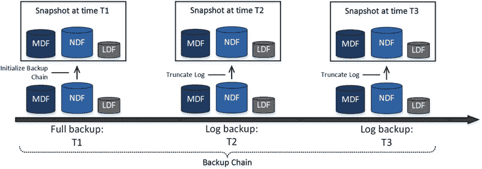
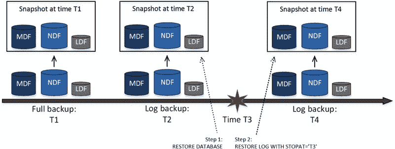

# 第 31 章 ■ 备份与还原

```sql
from disk = N'V:\OrderEntryDB-rw.bak' with file = 1,
norecovery, stats = 5;

restore log OrderEntryDB
from disk = N'V:\OrderEntryDB.trn' with file = 1
norecovery, stats = 5;

restore database OrderEntryDB with recovery;
```
现在，`Primary`、`Entities` 和 `OperationData` 文件组已在线，而 `HistoricalData` 文件组处于 `RECOVERY_PENDING` 状态，如图 31-9 所示。

**图 31-9.** 部分备份：读写文件组分段还原后的数据文件状态

您可以通过还原原始的文件组备份文件来使 `HistoricalData` 文件组在线，如清单 31-23 所示。

**清单 31-23.** 部分备份：只读文件组还原

```sql
restore database OrderEntryDB
filegroup='HistoricalData'
from disk = N'V:\OrderEntryDB-hd.bak' with file = 1,
move N'OrderEntryDB_Historical' to N'S:\OrderEntryDB_Historical.ndf',
recovery, stats = 5;
```

## 与 Microsoft Azure 的集成

SQL Server 包含多个与 Microsoft Azure 集成的备份相关功能。让我们详细看看它们。

### 备份到 Microsoft Azure

从 SQL Server 2012 SP1 CU2 开始，您可以通过在 `BACKUP` 和 `RESTORE` 命令中指定 URL 位置，直接备份到或从 Microsoft Azure Blob 存储还原。清单 31-24 展示了此过程的示例。

**清单 31-24.** 备份到 Windows Azure Blob 存储及从中还原

```sql
create credential MyCredential
with identity = 'mystorageaccount', secret = '<Secret Key>';

backup database MyDb
to url = 'https://mystorageaccount.blob.core.windows.net/mycontainer/MyDb.bak'
with credential = 'MyCredential', stats = 5;

restore database MyDb
from url = 'https://mystorageaccount.blob.core.windows.net/mycontainer/MyDb.bak'
with credential = 'MyCredential', recovery, stats = 5;
```

当您在 Microsoft Azure 的虚拟机中运行 SQL Server 时，将数据库备份存储在 Azure Blob 存储中是一个很好的选择。但是，对于本地安装，您需要考虑可用的上传和下载带宽。上传和下载大型的多 GB 备份文件可能需要数小时甚至数天，这使其不切实际，并在发生灾难时导致长时间的停机。
综上所述，对于 RTO（恢复时间目标）允许较长停机时间的小型和非关键任务数据库，将备份文件存储在 Microsoft Azure 仍然是一个可选方案。
除了 `BACKUP TO URL` 命令外，您还可以使用 `Microsoft SQL Server Backup to Microsoft Windows Azure Tool`，它适用于任何版本和版本的 SQL Server。此工具独立于 SQL Server 工作。它根据指定的规则拦截正在写入文件夹的备份文件，并将这些文件上传到 Azure Blob 存储。
不幸的是，`Microsoft SQL Server Backup to Microsoft Windows Azure Tool` 不保留备份文件的本地副本。如果您决定使用它，应考虑可用的带宽和 RTO 要求。

> **注意** 您可以从 [`www.microsoft.com/en-us/download/details.aspx?id=40740`](https://www.microsoft.com/en-us/download/details.aspx?id=40740) 下载 `Microsoft SQL Server Backup to Microsoft Windows Azure Tool`。

综上所述，当您需要为本地安装提供一个经济高效、冗余的解决方案时，将备份文件存储在云端可能是一个不错的选择。不过，最好将其与 SQL Server 备份过程分开实施，在之后上传备份文件的本地副本。这种方法允许您通过使用备份文件的本地副本快速从灾难中恢复数据库，同时将文件的另一份副本保留在云端以实现冗余。

### 托管备份到 Microsoft Azure

SQL Server 2014 引入了托管备份到 Microsoft Azure Blob 存储的概念。这可以


可在实例或数据库级别启用此功能。`SQL Server` 会根据以下条件自动执行完整备份和事务日志备份，并保留这些备份最多 30 天：

在以下任一情况下会执行`完整备份`：上一次完整备份距今已超过一周、自上次完整备份以来日志增长达到或超过 1 GB、或者备份链已中断。

`事务日志备份`会每两小时执行一次，或者当日志空间使用量达到 5 MB 时，或者当事务日志备份落后于完整备份时执行。

`SQL Server 2014` 的托管备份不支持处于`SIMPLE`或`BULK LOGGED`恢复模型的数据库，也不支持系统数据库。这些限制已在`SQL Server 2016`中移除。

托管备份仅将文件备份到`Microsoft Azure Blob Storage`。不支持本地存储。我们在“备份到 Microsoft Azure”部分讨论的所有注意事项同样适用于托管备份。

■ **注意** 您可以在 [`https://msdn.microsoft.com/en-us/library/dn449496.aspx`](https://msdn.microsoft.com/en-us/library/dn449496.aspx) 阅读更多关于托管备份的信息。请确保选择正确的`SQL Server`版本。`SQL Server 2014` 和 `2016` 之间的配置有显著变化。

## Azure 中数据库文件的文件快照备份

从`SQL Server 2014`开始，您可以将数据库文件存储在`Microsoft Azure Blob Storage`中，适用于本地安装和 Azure 虚拟机中的`SQL Server`安装。这为您提供了使用廉价且冗余存储的选项，适用于那些能够容忍 Blob 存储较低 I/O 性能和较高延迟的系统。

作为一项额外增强，`SQL Server 2016`允许您在数据库备份和还原过程中利用 Azure Blob 快照功能。这种方法与传统备份的工作原理截然不同。与常规备份文件（包含数据页和日志记录的副本）相反，Blob 快照存储的是在创建快照时所有数据库文件的只读副本。

图 31-10 说明了文件快照备份的概念。仅支持完整备份和日志备份。然而，这两种类型非常相似，都包含所有数据库文件的副本。它们之间的区别在于：完整备份会初始化备份链，而日志备份会在操作后截断日志。





### 图 31-10. 文件快照备份

还原过程从快照复制数据库文件，始终创建数据库的新副本。正如您所想，这允许您使用日志备份快照作为源来运行 `RESTORE DATABASE` 命令。它包含数据库文件的副本，您无需先还原完整备份。

对于时间点还原，您应该使用两个相邻的备份集执行两次还原操作。首先，您需要使用 `RESTORE DATABASE WITH NORECOVERY` 命令从第一个备份集还原数据库。此命令将创建截至该备份集时间的数据库新副本。接下来，您需要使用 `RESTORE LOG WITH STOPAT` 语句从第二个备份集还原日志。此命令会重放事务日志中从先前还原的备份集开始直到 `STOPAT` 选项中指定时间的部分。图 31-11 说明了这一点。

### 图 31-11. 文件快照时间点还原

清单 31-25 展示了实现此过程的代码。

### 清单 31-25. 文件快照备份和时间点还原

```sql
-- 执行完整和日志数据库备份
backup database MyDb /* 图 31-11 中的 T1 */
to url = 'https://mystorageaccountname.blob.core.windows.net/mycontainername/MyDb.bak'
with file_snapshot;

backup log MyDb /* 图 31-11 中的 T2 */
```


```markdown
to `url` = 'https://mystorageaccountname.blob.core.windows.net/mycontainername/MyDb_2016-03-11-08-00.trn'

with `file_snapshot`;

`backup log` `MyDb` /* 图 31-11 中的 T4 */

to `url` = 'https://mystorageaccountname.blob.core.windows.net/mycontainername/MyDb_2016-03-11-10-00.trn'

with `file_snapshot`;

-- 在上午 10 点进行时间点恢复 /* 图 31-11 中的 T4 */

`restore database` /* 图 31-11 中的 T2 */

from `url` = 'https://mystorageaccountname.blob.core.windows.net/mycontainername/MyDb_2016-03-11-08-00.trn'

with `norecovery`, `replace`;

`restore log` /* 图 31-11 中的 T4 */

from `url` = 'https://mystorageaccountname.blob.core.windows.net/mycontainername/MyDb_2016-03-11-11-00.trn'

with `recovery`, `stopat` = '2016-03-11T10:00:00.000';

正如您可以猜到的那样，恢复过程在底层利用了文件复制操作，并且只需要重放非常有限数量的事务日志记录。与传统的恢复过程相比，这可以大幅缩短恢复时间，并简化了备份策略的设计。然而，您应该将 Azure 存储成本纳入考量。尽管 Blob 存储相对便宜，但大量的快照（尤其是大型数据库的快照）可能会带来可观的成本。

最后，文件快照备份要求您在 SQL Server 内部管理备份集。手动删除快照文件会使备份集失效。您应使用 `sys.sp_delete_backup` 和 `sys.sp_delete_backup_file_snapshot` 系统存储过程来执行此类操作。

`注意` 您可以在 [`msdn.microsoft.com/en-us/library/mt169363.aspx`](https://msdn.microsoft.com/en-us/library/mt169363.aspx) 阅读更多关于文件快照备份的信息。

## 摘要

完整数据库备份存储一份数据库副本，该副本代表了备份完成时数据库的状态。差异备份存储自上次完整备份以来已修改的区。日志备份存储从上次完整备份结束或上次日志备份结束开始的事务日志部分。

完整和差异备份在所有恢复模型中都受支持，而日志备份仅在 `FULL` 或 `BULK LOGGED` 恢复模型中受支持。

差异备份是累积的。每个备份都包含自上次完整备份以来所有已修改的区。您可以在需要时还原最新的差异备份。相反，日志备份是增量的，不包含先前备份已备份的事务日志部分。

一个完整备份和一系列日志备份构成一个备份链。在还原数据库时，您应该按正确的顺序还原链中的所有备份。您可以对完整或日志备份使用 `COPY_ONLY` 选项，以保持备份链的完整性。

日志备份的频率由恢复点目标 (`RPO`) 要求决定。日志应在不超过系统允许数据丢失的时间间隔内进行备份。

## 第 31 章 ■ 备份与恢复

恢复时间目标 (`RTO`) 规定了恢复过程可接受的最大持续时间，这会影响完整和差异备份的时间表。在制定备份策略时，您还应考虑通过网络传输文件所需的时间。备份压缩有助于减少此时间并提高备份和恢复操作的性能，但代价是额外的 CPU 负载以及压缩和解压缩数据所需的额外时间。

您应该验证备份文件，并确保您的备份策略有效且满足 `RTO` 和 `RPO` 要求。备份和恢复过程的持续时间会随着数据库大小和负载的变化而随时间改变。

SQL Server 企业版支持分段还原，允许您按文件组进行还原，使部分数据库保持在线状态。如果数据经过合理分区，此功能可极大提高系统的可用性，并有助于缩短关键操作数据的恢复时间。
```


你可以将只读数据排除在常规完整备份之外，这可以减少备份时间和备份文件大小。考虑在适当时机将只读数据放入单独的文件组并标记为只读。

