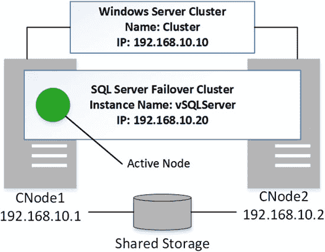
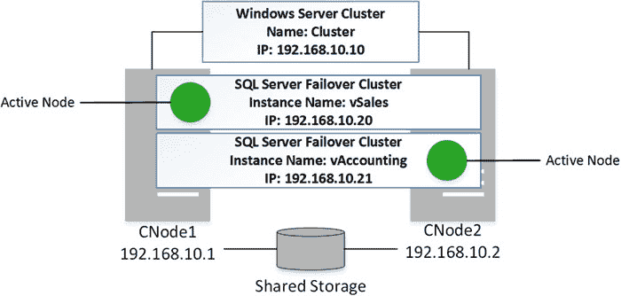

# 第 32 章

## 高可用性技术

高可用性（HA）策略有助于提高系统在硬件、软件或网络故障情况下的可用性。尽管听起来与备份和灾难恢复（DR）策略相似，但两者并不相同。高可用性策略作为第一道防线，使硬件故障或软件崩溃对用户透明。另一方面，灾难恢复处理的是当系统因高可用性策略未能预防的灾难而需要恢复的情况。

设想一个系统托管在单一数据中心内的情况。它可能拥有一个在数据中心内实现服务器冗余的高可用性策略，从而在服务器故障时保持系统在线。然而，这未必能保护系统免受多台服务器同时故障的影响，也无法抵御数据中心级别的灾难。灾难恢复策略将帮助你从后一种情况中恢复，在不同的硬件或数据中心上重建或恢复系统。

本章概述了 SQL Server 中可用的不同高可用性技术，并解释了它们的构建原理。你不应将本章视为 SQL Server 高可用性实现的权威指南，这些内容很容易单独成书。

本章不涵盖非基于 SQL Server 的高可用性技术，例如 SAN 复制和虚拟化技术。如果这些技术适用于你的环境，你应该自行研究和评估。

### SQL Server 故障转移群集

也许 SQL Server 中最知名的高可用性技术是 `SQL Server 故障转移群集`。直到 SQL Server 2005，故障转移群集是唯一支持在服务器故障时进行自动故障转移的高可用性技术。

从 SQL Server 2012 开始，微软更改了这项技术的名称，称其为 `AlwaysOn 故障转移群集`。然而，在本章中，为避免与 `AlwaysOn 可用性组` 混淆，我将继续使用旧名称。

`SQL Server 故障转移群集`作为 Windows Server 故障转移群集（`WSFC`）的资源组进行安装。在安装 `SQL Server 故障转移群集`之前，应先安装和配置 `WSFC`。通过 `WSFC` 和 `SQL Server 故障转移群集`，一组单独的服务器（称为 `节点`）共享一组资源，例如 `SQL Server 实例`中的磁盘或数据库。然而，在任何时间点，只有一个节点拥有资源所有权。如果某个节点发生故障，所有权会通过一个称为 `故障转移`的过程转移到另一个节点。

一个简单的故障转移群集安装包含两个不同的节点，每个节点都安装了一个 `SQL Server 实例`。这些节点使用放置在共享存储上的用户数据库和系统数据库的单个副本进行工作。该群集提供一个虚拟的 `SQL Server` 名称和 IP 地址，供客户端应用程序使用。这些资源与分配给 Windows Server 故障转移群集群集的资源不同。图 32-1 展示了一个简单的故障转移群集。

© Dmitri Korotkevitch 2016

D. Korotkevitch, *Pro SQL Server Internals*, DOI 10.1007/978-1-4842-1964-5_32

第 32 章 ■ 高可用性技术

**图 32-1.** 具有单个 SQL Server 故障转移群集实例的双节点 WSFC

其中一个 `SQL Server 实例`是活动的，并处理所有用户请求。另一个节点提供热备份。当活动节点发生故障时，`SQL Server 群集`会故障转移到第二个节点（原先的 `被动`节点），并从那里启动。简言之，此过程就是一次 `SQL Server 实例重启`。

新的活动节点会对实例中的所有数据库执行崩溃恢复，在此过程完成前阻止客户端连接到数据库。
故障恢复和故障转移的持续时间很大程度上取决于故障转移发生时活动事务修改的数据量。对于短暂的 OLTP 事务，故障转移可能在一分钟内完成。然而，故障转移也可能耗时更长，例如当存在修改了大量数据且需要由崩溃恢复过程回滚的活动事务时。
内存中 OLTP（我们将在本书第八部分讨论）也可能影响故障转移时间。SQL Server 在数据库启动期间将所有来自持久化内存优化表的数据加载到内存中，如果数据量很大，这可能非常耗时。
`SQL Server 故障转移群集运行在实例级别，保护整个实例。它包括系统数据库和用户数据库、SQL Server 配置设置、登录名与安全设置以及 SQL Server 代理作业。`整个 SQL Server 实例进行故障转移，无法实现某些数据库运行在安装在群集一个节点上的 SQL Server 实例，而其他数据库运行在安装在另一个节点上的另一个 SQL Server 实例。
故障转移群集要求所有数据库都置于共享存储中。从 Windows Server 2012 R2 开始，您可以使用 SMB 共享来存储数据。尽管如此，存储成为了单点故障。
■ **重要提示** 对于故障转移群集，请始终使用高度冗余的存储。此外，请考虑将 SQL Server 故障转移群集与允许您在不同存储设备上存储备份数据库的其他高可用性技术结合使用。这提高了系统的可用性，并在存储发生故障时最大程度地减少了可能的数据损失。

