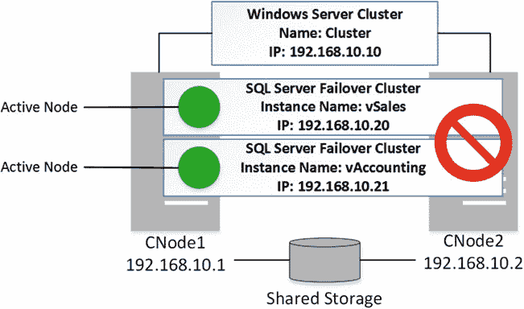
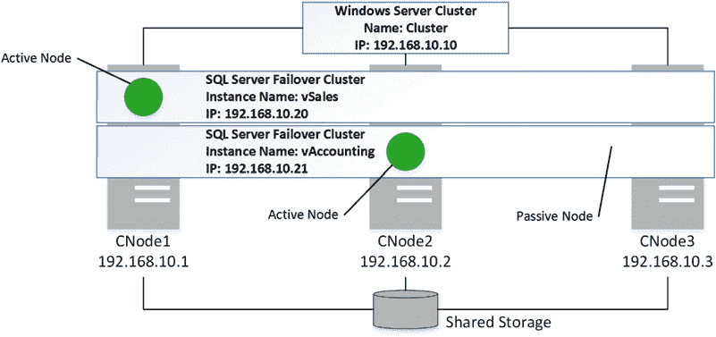

# 第 32 章 ■ 高可用性技术
系统数据库也使用共享存储。幸运的是，从 SQL Server 2012 开始，您可以将`tempdb`放在本地驱动器上，这可以显著提高群集的性能，特别是如果将其放置在基于固态硬盘的存储上。
虽然设置承载单个 SQL Server 群集实例的 Windows 群集相对容易，但它们会使您需要的服务器数量翻倍。尽管通常不需要为仅用于高可用性的被动节点购买额外的 SQL Server 许可证，但仍需考虑硬件、电力和维护成本。
■ **注意** 请与 Microsoft 许可专家合作，以确定您的高可用性配置的确切许可要求。许可要求因 SQL Server 版本和软件保障协议的存在而异。
降低故障转移群集解决方案成本的方法之一是使用`多实例故障转移群集`。在此配置中，一个 Windows 群集承载多个 SQL Server 故障转移群集实例。图 32-2 展示了一个双节点多实例群集的示例。有两个 SQL Server 群集实例：`vSales`和`vAccounting`。`CNode1`群集节点是`vSales`实例的活动节点，`CNode2`是`vAccounting`实例的活动节点。
***图 32-2.** 双节点多实例群集*
在理想情况下，当所有群集节点都启动并运行时，多个 SQL Server 群集不会相互影响性能。每个 SQL Server 群集实例运行在独立的节点上。
不幸的是，当其中一台服务器变得不可用，且 SQL Server 实例故障转移到另一个节点时（如图 32-3 所示），情况会变得复杂得多。两个 SQL Server 群集实例运行在同一台服务器上，争用 CPU 和内存，并相互影响性能。

