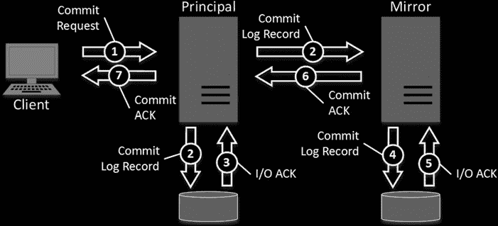

# 第 32 章 ■ 高可用性技术

## 图 32-3. 双节点多实例集群：单节点故障

在多实例集群中，为减少故障转移时可能带来的性能影响，一种典型方法是构建一种集群配置，预留一些节点以便在发生故障转移时接管负载。采用这种方法，拥有多活动实例的集群会有一个或多个预留的被动节点。如果某个活动节点发生故障，该节点上的实例可以故障转移到预留的（原先的）被动节点，而不会影响其他 SQL Server 集群实例的性能。

图 32-4 展示了一个带有单个预留被动节点的双实例集群示例。

## 图 32-4. 带有一个预留被动节点的多实例集群

遗憾的是，你无法在 SQL Server 标准版中实现带有预留被动节点的配置，该版本仅支持双节点故障转移集群。

你需要仔细规划多实例集群配置，假设多个实例可能最终运行在同一节点上。你应该购买能够处理负载的硬件，然后为每个节点上的每个实例设置最小和最大服务器内存。最好基于最坏情况（假设多个实例同时运行）来设置最小服务器内存。最大服务器内存可以基于最佳情况（节点上只有一个实例运行时）来设置。

在设置 SQL Server `最大服务器内存`配置选项时，请记住为操作系统保留一些内存。我们已经在第 28 章讨论了如何为此设置选择合适的值。不要忘记，在 2012 之前的 SQL Server 版本中，内存设置仅控制缓冲池的内存使用。在设置内存设置时，你应该考虑非缓冲池内存。

处理 CPU 配置更具挑战性。你可以为不同的实例设置 CPU 亲和性掩码，这会限制实例使用某些逻辑 CPU。但是，当节点上只有一个实例运行，并且你希望该实例能使用尽可能多的 CPU 能力时，这不是最佳方法。最好使用 Windows 系统资源管理器或 Windows 系统中心，并在需要时限制 CPU 活动。

你可以像监控非集群实例一样监控 SQL Server 集群实例。你应该使用虚拟 SQL Server 实例名称，这确保监控目标始终代表一个活动的 SQL Server 实例，无论它当前运行在哪个集群节点上。

■ **注意** 你可以在以下网址阅读更多关于 SQL Server 故障转移集群的信息：[`technet.microsoft.com/en-us/library/hh270278.aspx`](http://technet.microsoft.com/en-us/library/hh270278.aspx)。

## 数据库镜像与 AlwaysOn 可用性组

SQL Server 故障转移集群提供了出色的实例级保护。然而，它并不能防止存储故障。数据只存储一份副本，存储故障可能导致数据丢失。

这个问题可以通过另一组技术来缓解，例如 `数据库镜像` 和 `AlwaysOn 可用性组`，它们允许你在两台服务器上（在 `AlwaysOn 可用性组` 的情况下，可以是多台服务器）保留数据库的逐字节副本。

`数据库镜像` 在数据库级别工作。`AlwaysOn 可用性组` 在数据库组级别工作，该组可以包含一个或多个数据库。每个数据库只能参与一个镜像或 `AlwaysOn` 会话。然而，每个 SQL Server 实例可以托管多个镜像数据库或 `AlwaysOn 可用性组`。

数据库范围是这些技术与 SQL Server 故障转移集群之间的关键区别。

## 技术概览

镜像和 AlwaysOn 可用性组的工作原理都是将日志记录流从`主`服务器发送到`辅助`服务器，后者有时也称为`节点`。在数据库镜像中，这些服务器被称为`主体`服务器和`镜像`服务器。所有数据修改都必须在主服务器上进行。使用数据库镜像时，镜像服务器上的数据库对客户端不可访问。而使用 AlwaysOn 可用性组时，如果配置中启用，客户端可以访问并从辅助服务器读取数据。

