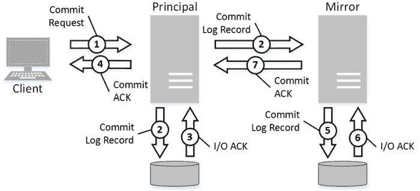

# 第 32 章 高可用性技术

该技术可以以`同步`或`异步`模式运行，这两种模式也分别称为`同步`提交和`异步`提交。同步提交保证已提交事务的数据不丢失，前提是数据复制是最新的且两台服务器能够相互通信。

在同步提交模式下，主服务器只有在辅助服务器在其事务日志中固化了`COMMIT`日志记录后，才会向客户端发送事务已提交的确认。图 32-5 说明了此模式下的逐步提交过程。

**图 32-5.** 同步提交

让我重申，同步提交*仅*保证在两台服务器都在线且进程是最新的情况下不会发生数据丢失。例如，如果辅助服务器脱机，主服务器将继续运行并提交事务，使辅助服务器上的数据库保持在`已挂起`状态。主服务器会为日志记录构建一个`发送队列`，需要在辅助服务器重新上线时发送。如果此时主服务器发生故障，自辅助服务器断开连接以来的数据修改可能会丢失。

当辅助服务器重新上线时，同步切换到`正在同步`状态，主服务器开始将发送队列中的日志记录发送给辅助服务器。此时数据丢失仍有可能发生。只有在所有日志记录都已发送到辅助服务器后，进程才会切换到`已同步`状态，这保证了在同步提交模式下不会发生数据丢失。

服务器之间的连接性和发送队列的大小都会影响事务日志截断。SQL Server 会延迟日志截断，直到来自`VLF`的所有记录都发送到辅助服务器。虽然在大多数情况下这不会引起日志管理问题，但当辅助服务器脱机时情况就不同了。发送队列会增长，事务日志将无法截断，直到辅助服务器重新上线并通过网络传输日志记录。

**提示** 如果你发现辅助服务器长时间停机，请考虑删除数据库镜像或从 AlwaysOn 可用性组中移除该辅助服务器。

如图 32-5 所示，步骤 2、4、5 和 6 引入了额外的延迟，这取决于网络和镜像服务器 I/O 性能。在一些负载很重的`OLTP`系统中，这种延迟是不可接受的。

你可以通过使用异步提交来避免这种延迟，在数据库镜像中这被称为`高性能`模式。在此模式下，主服务器将日志记录发送给辅助服务器，并且在提交事务前不等待确认，如图 32-6 所示。



该技术工作在 SQL Server 实例级别。只有数据库在节点之间复制。一方面，这为你提供了灵活性，允许你将不同的数据库复制到不同的服务器；但另一方面，这也带来了管理开销。你需要在基础设施中的每台服务器上单独执行服务器配置、设置登录和安全、配置`SQL Agent`作业以及其他服务器级别的操作。

```sql
if (condVar > someVal) {console.log("xxx")}
```


