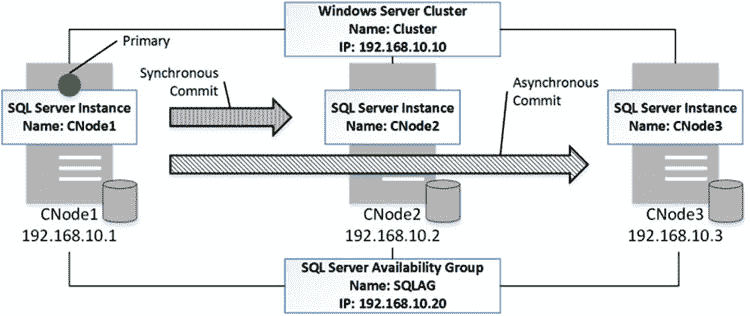

# 高可用性技术

## 数据库镜像的替代方案

基本可用性组是数据库镜像的替代方案；但是，在 SQL Server 2012 和 2014 中，它们仅包含在企业版中。

另一方面，SQL Server 2016 的标准版支持*基本可用性组*，它允许你创建一个类似数据库镜像的单数据库、双服务器副本。然而，基本可用性组支持异步提交，这与数据库镜像的情况不同。

**注意** 你可以在以下网址阅读更多关于数据库镜像的信息：[`technet.microsoft.com/en-us/library/ms189852.aspx`](http://technet.microsoft.com/en-us/library/ms189852.aspx)。

## AlwaysOn 可用性组

与数据库镜像相反，AlwaysOn 可用性组需要并依赖 Windows Server 故障转移集群 (WSFC)。虽然这使得它们的基础设施和设置相比数据库镜像更为复杂，但它也简化了客户端应用程序的部署。它们可以通过*监听器*连接到 AlwaysOn 可用性组，该监听器以类似于 SQL Server 故障转移集群的方式虚拟化一个 SQL Server 实例。

AlwaysOn 可用性组由一个具有读/写访问权限的主节点（或副本）组成。在企业版中，使用 SQL Server 2012 最多可以有四个辅助节点，使用 SQL Server 2014–2016 最多可以有八个辅助节点。可用性组中的三个节点可以使用同步提交。你需要两个节点才能支持自动故障转移。正如我已经提到的，SQL Server 2016 的标准版支持双节点基本可用性组。

图 32-7 展示了一个包含三个节点的 AlwaysOn 可用性组配置示例。

**图 32-7.** AlwaysOn 可用性组

事实上，可用性组可以只包含一个主节点。这种行为有助于将可用性组基础设施与应用程序抽象分离。例如，在部署的初始阶段，你可以建立一个单节点可用性组并创建一个监听器，以虚拟化一个 SQL Server 实例。之后，系统管理员可以在不担心可用性组基础设施状态的情况下开始更改连接字符串，同时你可以在那里添加其他节点。

另一个有用的例子是更改需要单用户访问权限的数据库选项，例如启用 `READ COMMITTED SNAPSHOT` 隔离级别。在启用数据库镜像的情况下，无法将数据库切换到 `SINGLE_USER` 模式。你可以移除数据库镜像并在之后重新建立，尽管你需要检查所有连接字符串，确保主服务器始终被指定为*服务器*而不是*故障转移伙伴*。然而，AlwaysOn 可用性组允许你移除所有辅助节点，而无需担心连接字符串。虽然仍然无法将参与 AlwaysOn 可用性组的数据库切换到 `SINGLE_USER` 模式，但你可以将数据库从可用性组中移除，更改数据库选项，并在几秒钟内将数据库添加回可用性组，对客户端应用程序的影响最小。

与在单数据库范围内工作的数据库镜像不同，AlwaysOn 可用性组可以包含多个数据库。这保证了组中的所有数据库将一起故障转移，并且始终具有相同的主节点。当系统需要多个数据库驻留在同一服务器上才能运行时，这种行为很有帮助。

AlwaysOn 可用性组允许对辅助节点进行只读访问，并允许你从中执行数据库备份。此外，应用程序可以在连接字符串中指定它只需要只读访问，AlwaysOn 可用性组会自动将其路由到一个可读的辅助节点。

